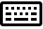
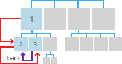
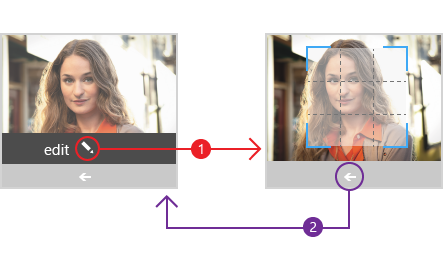

#  Navigation history and backwards navigation for UWP apps


On the Web, individual web sites provide their own navigation systems, such as tables of contents, buttons, menus, simple lists of links, and so on. The navigation experience can vary wildly from website to website. However, there is one consistent navigation experience: back. Most browsers provide a back button that behaves the same way regardless of the website.

> **Important APIs**: [SystemNavigationManager class](https://docs.microsoft.com/en-us/uwp/api/Windows.UI.Core.SystemNavigationManager), [BackRequested event](https://docs.microsoft.com/en-us/uwp/api/Windows.UI.Core.SystemNavigationManager#Windows_UI_Core_SystemNavigationManager_BackRequested), [OnNavigatedTo](https://msdn.microsoft.com/library/windows/apps/br227508)

For similar reasons, the Universal Windows Platform (UWP) provides a consistent back navigation system for traversing the user's navigation history within an app and, depending on the device, from app to app.

The UI for the system back button is optimized for each form factor and input device type, but the navigation experience is global and consistent across devices and UWP apps.

Here are the primary form factors with the back button UI:


<table>
    <tr>
        <td colspan="2">Devices</td>
        <td style="vertical-align:top;">Back button behavior</td>
     </tr>
    <tr>
        <td style="vertical-align:top;">Phone</td>
        <td style="vertical-align:top;"></td>
        <td style="vertical-align:top;">
        <ul>
<li>Always present.</li>
<li>A software or hardware button at the bottom of the device.</li>
<li>Global back navigation within the app and between apps.</li>
</ul>
</td>
     </tr>
     <tr>
        <td style="vertical-align:top;">Tablet</td>
        <td style="vertical-align:top;"></td>
        <td style="vertical-align:top;">
<ul>
<li>Always present in Tablet mode. Not available in Desktop mode. Title bar back button can be enabled, instead. 
Users can switch between running in Tablet mode and Desktop mode by going to **Settings &gt; System &gt; Tablet mode** and setting **Make Windows more touch-friendly when using your device as a tablet**.</li>
<li> A software button in the navigation bar at the bottom of the device.</li>
<li>Global back navigation within the app and between apps.</li></ul>        
        </td>
     </tr>
    <tr>
        <td style="vertical-align:top;">PC, Laptop, Tablet</td>
        <td style="vertical-align:top;"></td>
        <td style="vertical-align:top;">
<ul>
<li>Optional in Desktop mode. Not available in Tablet mode.
Disabled by default. Must opt in to enable it.
Users can switch between running in Tablet mode and Desktop mode by going to **Settings &gt; System &gt; Tablet mode** and setting **Make Windows more touch-friendly when using your device as a tablet**.</li>
<li>A software button in the title bar of the app.</li>
<li>Back navigation within the app only. Does not support app-to-app navigation.</li></ul>        
        </td>
     </tr>
    <tr>
        <td style="vertical-align:top;">Surface Hub</td>
        <td style="vertical-align:top;"></td>
        <td style="vertical-align:top;">
<ul>
<li>Optional.</li>
<li>Disabled by default. Must opt in to enable it.</li>
<li>A software button in the title bar of the app.</li>
<li>Back navigation within the app only. Does not support app-to-app navigation.</li></ul>        
        </td>
     </tr>     
<table>


Here are some alternative input types that don't rely on a back button UI, but still provide the exact same functionality.


<table>
<tr><td colspan="3">Input devices</td></tr>
<tr><td style="vertical-align:top;">Keyboard</td><td style="vertical-align:top;"></td><td style="vertical-align:top;">Windows key + Backspace</td></tr>
<tr><td style="vertical-align:top;">Cortana</td><td style="vertical-align:top;"></td><td style="vertical-align:top;">Say, "Hey Cortana, go back"</td></tr>
</table>
 

When your app runs on a phone, tablet, or on a PC or laptop that has system back enabled, the system notifies your app when the back button is pressed. The user expects the back button to navigate to the previous location in the app's navigation history. It's up to you to decide which navigation actions to add to the navigation history and how to respond to the back button press.


## How to enable system back navigation support


Apps must enable back navigation for all hardware and software system back buttons. Do this by registering a listener for the [**BackRequested**](https://msdn.microsoft.com/library/windows/apps/dn893596) event and defining a corresponding handler.

Here we register a global listener for the [**BackRequested**](https://msdn.microsoft.com/library/windows/apps/dn893596) event in the App.xaml code-behind file. You can register for this event in each page if you want to exclude specific pages from back navigation, or you want to execute page-level code before displaying the page.

> [!div class="tabbedCodeSnippets"]
```csharp
Windows.UI.Core.SystemNavigationManager.GetForCurrentView().BackRequested += 
    App_BackRequested;
```
```cpp
Windows::UI::Core::SystemNavigationManager::GetForCurrentView()->
    BackRequested += ref new Windows::Foundation::EventHandler<
    Windows::UI::Core::BackRequestedEventArgs^>(
        this, &App::App_BackRequested);
```

Here's the corresponding [**BackRequested**](https://msdn.microsoft.com/library/windows/apps/dn893596) event handler that calls [**GoBack**](https://msdn.microsoft.com/library/windows/apps/dn996568) on the root frame of the app.

This handler is invoked on a global back event. If the in-app back stack is empty, the system might navigate to the previous app in the app stack or to the Start screen. There is no app back stack in Desktop mode and the user stays in the app even when the in-app back stack is depleted.

> [!div class="tabbedCodeSnippets"]
```csharp
>private void App_BackRequested(object sender, 
>    Windows.UI.Core.BackRequestedEventArgs e)
>{
>    Frame rootFrame = Window.Current.Content as Frame;
>    if (rootFrame == null)
>        return;
>
>    // Navigate back if possible, and if the event has not 
>    // already been handled .
>    if (rootFrame.CanGoBack && e.Handled == false)
>    {
>        e.Handled = true;
>        rootFrame.GoBack();
>    }
>}
```
```cpp
>void App::App_BackRequested(
>    Platform::Object^ sender, 
>    Windows::UI::Core::BackRequestedEventArgs^ e)
>{
>    Frame^ rootFrame = dynamic_cast<Frame^>(Window::Current->Content);
>    if (rootFrame == nullptr)
>        return;
>
>    // Navigate back if possible, and if the event has not
>    // already been handled.
>    if (rootFrame->CanGoBack && e->Handled == false)
>    {
>        e->Handled = true;
>        rootFrame->GoBack();
>    }
>}
```

## How to enable the title bar back button


Devices that support Desktop mode (typically PCs and laptops, but also some tablets) and have the setting enabled (**Settings &gt; System &gt; Tablet mode**), do not provide a global navigation bar with the system back button.

In Desktop mode, every app runs in a window with a title bar. You can provide an alternative back button for your app that is displayed in this title bar.

The title bar back button is only available in apps running on devices in Desktop mode, and only supports in-app navigation history—it does not support app-to-app navigation history.

**Important**  The title bar back button is not displayed by default. You must opt in.

 

|                                                             |                                                        |
|-------------------------------------------------------------|--------------------------------------------------------|
|  |  |
| Desktop mode, no back navigation.                           | Desktop mode, back navigation enabled.                 |

 

Override the [**OnNavigatedTo**](https://msdn.microsoft.com/library/windows/apps/br227508) event and set [**AppViewBackButtonVisibility**](https://msdn.microsoft.com/library/windows/apps/dn986448) to [**Visible**](https://msdn.microsoft.com/library/windows/apps/dn986276) in the code-behind file for each page that you want to enable the title bar back button.

For this example, we list each page in the back stack and enable the back button if the [**CanGoBack**](https://msdn.microsoft.com/library/windows/apps/br242685) property of the frame has a value of **true**.

> [!div class="tabbedCodeSnippets"]
>```csharp
>protected override void OnNavigatedTo(NavigationEventArgs e)
>{
>    Frame rootFrame = Window.Current.Content as Frame;
>
>    string myPages = "";
>    foreach (PageStackEntry page in rootFrame.BackStack)
>    {
>        myPages += page.SourcePageType.ToString() + "\n";
>    }
>    stackCount.Text = myPages;
>
>    if (rootFrame.CanGoBack)
>    {
>        // Show UI in title bar if opted-in and in-app backstack is not empty.
>        SystemNavigationManager.GetForCurrentView().AppViewBackButtonVisibility = 
>            AppViewBackButtonVisibility.Visible;
>    }
>    else
>    {
>        // Remove the UI from the title bar if in-app back stack is empty.
>        SystemNavigationManager.GetForCurrentView().AppViewBackButtonVisibility = 
>            AppViewBackButtonVisibility.Collapsed;
>    }
>}
>```
>```cpp
>void StartPage::OnNavigatedTo(NavigationEventArgs^ e)
>{
>    auto rootFrame = dynamic_cast<Windows::UI::Xaml::Controls::Frame^>(Window::Current->Content);
>
>    Platform::String^ myPages = "";
>
>    if (rootFrame == nullptr)
>        return;
>
>    for each (PageStackEntry^ page in rootFrame->BackStack)
>    {
>        myPages += page->SourcePageType.ToString() + "\n";
>    }
>    stackCount->Text = myPages;
>
>    if (rootFrame->CanGoBack)
>    {
>        // If we have pages in our in-app backstack and have opted in to showing back, do so
>        Windows::UI::Core::SystemNavigationManager::GetForCurrentView()->AppViewBackButtonVisibility =
>            Windows::UI::Core::AppViewBackButtonVisibility::Visible;
>    }
>    else
>    {
>        // Remove the UI from the title bar if there are no pages in our in-app back stack
>        Windows::UI::Core::SystemNavigationManager::GetForCurrentView()->AppViewBackButtonVisibility =
>            Windows::UI::Core::AppViewBackButtonVisibility::Collapsed;
>    }
>}
>```


### Guidelines for custom back navigation behavior

If you choose to provide your own back stack navigation, the experience should be consistent with other apps. We recommend that you follow the following patterns for navigation actions:

<table>
<thead>
<tr class="header">
<th align="left">Navigation action</th>
<th align="left">Add to navigation history?</th>
</tr>
</thead>
<tbody>
<tr class="odd">
<td style="vertical-align:top;"><strong>Page to page, different peer groups</strong></td>
<td style="vertical-align:top;"><strong>Yes</strong>
<p>In this illustration, the user navigates from level 1 of the app to level 2, crossing peer groups, so the navigation is added to the navigation history.</p>
<p></p>
<p>In the next illustration, the user navigates between two peer groups at the same level, again crossing peer groups, so the navigation is added to the navigation history.</p>
<p></p></td>
</tr>
<tr class="even">
<td style="vertical-align:top;"><strong>Page to page, same peer group, no on-screen navigation element</strong>
<p>The user navigates from one page to another with the same peer group. There is no navigation element that is always present (such as tabs/pivots or a docked navigation pane) that provides direct navigation to both pages.</p></td>
<td style="vertical-align:top;"><strong>Yes</strong>
<p>In the following illustration, the user navigates between two pages in the same peer group. The pages don't use tabs or a docked navigation pane, so the navigation is added to the navigation history.</p>
<p></p></td>
</tr>
<tr class="odd">
<td style="vertical-align:top;"><strong>Page to page, same peer group, with an on-screen navigation element</strong>
<p>The user navigates from one page to another in the same peer group. Both pages are shown in the same navigation element. For example, both pages use the same tabs/pivots element, or both pages appear in a docked navigation pane.</p></td>
<td style="vertical-align:top;"><strong>No</strong>
<p>When the user presses back, go back to the last page before the user navigated to the current peer group.</p>
<p></p></td>
</tr>
<tr class="even">
<td style="vertical-align:top;"><strong>Show a transient UI</strong>
<p>The app displays a pop-up or child window, such as a dialog, splash screen, or on-screen keyboard, or the app enters a special mode, such as multiple selection mode.</p></td>
<td style="vertical-align:top;"><strong>No</strong>
<p>When the user presses the back button, dismiss the transient UI (hide the on-screen keyboard, cancel the dialog, etc) and return to the page that spawned the transient UI.</p>
<p></p></td>
</tr>
<tr class="odd">
<td style="vertical-align:top;"><strong>Enumerate items</strong>
<p>The app displays content for an on-screen item, such as the details for the selected item in master/details list.</p></td>
<td style="vertical-align:top;"><strong>No</strong>
<p>Enumerating items is similar to navigating within a peer group. When the user presses back, navigate to the page that preceded the current page that has the item enumeration.</p>
</td>
</tr>
</tbody>
</table>


### Resuming

When the user switches to another app and returns to your app, we recommend returning to the last page in the navigation history.


## Get the samples
*   [Back button sample](https://github.com/Microsoft/Windows-universal-samples/blob/master/Samples/BackButton)<br/>
    Shows how to set up an event handler for the back button event and how to enable the title bar back button for when the app is in windowed Desktop mode.

## Related articles
* [Navigation basics](navigation-basics.md)

 


