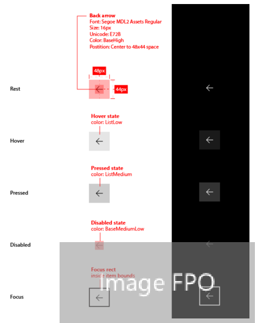
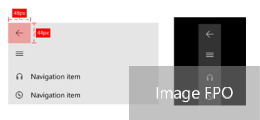

#  Navigation history and backwards navigation for UWP apps
> [!WARNING] 
Back buttons mentioned in this article will be released with RS4. Code examples are not final.

The Universal Windows Platform (UWP) provides a consistent back navigation system for traversing the user's navigation history within an app and, depending on the device, from app to app.

To implement backwards navigation in your app, place a [back button](#Back-button) at the top left corner of your app's UI. If your app uses the [NavigationView](../controls-and-patterns/navigationview.md) control, then you can use [NavigationView's built-in back button](#Back-Button-in-NavigationView). 

The user expects the back button to navigate to the previous location in the app's navigation history. Note that it's up to you to decide which navigation actions to add to the navigation history and how to respond to the back button press.

> **Important APIs**: [SystemNavigationManager class](https://docs.microsoft.com/en-us/uwp/api/Windows.UI.Core.SystemNavigationManager), [BackRequested event](https://docs.microsoft.com/en-us/uwp/api/Windows.UI.Core.SystemNavigationManager#Windows_UI_Core_SystemNavigationManager_BackRequested), [OnNavigatedTo](https://docs.microsoft.com/uwp/api/Windows.UI.Xaml.Controls.Page#Windows_UI_Xaml_Controls_Page_OnNavigatedTo_Windows_UI_Xaml_Navigation_NavigationEventArgs_)


## Back button
To create a back button, use the [Button](../controls-and-patterns/buttons.md) control with the `NavigationBackButtonNormalStyle` style, and place the button at the top left hand corner of your app's UI.


```xaml
<Button Style="{StaticResource NavigationBackButtonNormalStyle}"/>
```

If your app has a top [CommandBar](../controls-and-patterns/app-bars.md), the Button control that is 44px in height will not align with 48px AppBarButtons very nicely. However, to avoid inconsistency, align the top of the Button control inside the 48px bounds.


```xaml
<Button VerticalAlignment="Top" HorizontalAlignment="Left" 
Style="{StaticResource NavigationBackButtonNormalStyle}"/>
```

In order to minimize UI elements moving around in your app, show a disabled back button when there is nothing in the backstack (see code example below).



### Code example
The following code example demonstrates how implement backwards navigation behavior with a back button. The code responds to the Button [**Click**](https://docs.microsoft.com/uwp/api/windows.ui.xaml.controls.primitives.buttonbase#Windows_UI_Xaml_Controls_Primitives_ButtonBase_Click) event and disables/enables the button visibility in [**OnNavigatedTo**](https://docs.microsoft.com/uwp/api/windows.ui.xaml.controls.frame#Windows_UI_Xaml_Controls_Frame_Navigated), which is called when navigating to a new page. The code example also handles inputs from hardware and software system back keys by registering a listener for the [**BackRequested**](https://docs.microsoft.com/uwp/api/windows.ui.core.systemnavigationmanager#Windows_UI_Core_SystemNavigationManager_BackRequested) event.

```xaml
<Page x:Class="AppName.MainPage">
...
<Button x:Name="BackButton" Click="Back_Click" Style="{StaticResource NavigationBackButtonNormalStyle}"/>
...
<Page/>
```

Code-behind:
```csharp
// Handles system-level BackRequested events and page-level back button Click events
private bool On_BackRequested()
{
    Frame rootFrame = this.Frame;
    if (rootFrame == null)
    {
        return true;
    }
    if (rootFrame.CanGoBack)
    {
        rootFrame.GoBack();
        return true;
    }
}

private void Back_Click(object sender, RoutedEventArgs e)
{
    On_BackRequested();
}

protected override void OnNavigatedTo(NavigationEventArgs e)
{
    Frame rootFrame = this.Frame;
    BackButton.isEnabled = rootFrame.CanGoBack;
}

public MainPage()
{
    KeyboardAccelerator GoBack = new KeyboardAccelerator();
    GoBack.Key = VirtualKey.GoBack;
    GoBack.Invoked += "BackInvoked";
    KeyboardAccelerator AltLeft = new KeyboardAccelerator();
    AltLeft.Key = VirtualKey.Left;
    AltLeft.Invoked += "BackInvoked";
    // ALT routes here
    AltLeft.Modifiers = VirtualKeyModifiers.Menu;

    List<KeyboardAccelerator> AccList = new List< KeyboardAccelerator >(new KeyboardAccelerator [] {GoBack, AltLeft});
    MainPage.KeyboardAccelerators = AccList;
}

protected void BackInvoked (KeyboardAccelerator sender, KeyboardAcceleratorInvokedEventArgs args)
{
    On_BackRequested();
    args.Handled = true;
}

private void On_PointerPressed(object sender, PointerRoutedEventArgs e)
{
    bool isXButton1Pressed = e.GetCurrentPoint(sender as UIElement).Properties.PointerUpdateKind == PointerUpdateKind.XButton1Pressed;

    if (isXButton1Pressed)
    {
        e.handled = On_BackRequested();
    }
}
```
Here, we register a global listener for the [**BackRequested**](https://docs.microsoft.com/uwp/api/windows.ui.core.systemnavigationmanager#Windows_UI_Core_SystemNavigationManager_BackRequested) event in the `App.xaml` code-behind file. You can register for this event in each page if you want to exclude specific pages from back navigation, or you want to execute page-level code before displaying the page.

App.xaml code-behind:
```csharp
Windows.UI.Core.SystemNavigationManager.GetForCurrentView().BackRequested += App_BackRequested;
Frame rootFrame = Window.Current.Content;
rootFrame.PointerPressed += 'On_PointerPressed';

private void App_BackRequested(object sender, Windows.UI.Core.BackRequestedEventArgs e)
{
    e.handled = On_BackRequested();
}

private void On_PointerPressed(object sender, PointerRoutedEventArgs e)
{
    bool isXButton1Pressed = e.GetCurrentPoint(sender as UIElement).Properties.PointerUpdateKind == PointerUpdateKind.XButton1Pressed;

    if (isXButton1Pressed)
    {
        e.handled = On_BackRequested();
    }
}
```

## Back button in NavigationView
The [NavigationView](../controls-and-patterns/navigationview.md) control has a built-in back button, which can be enabled with the following properties:

- **IsBackButtonVisible** is a NavigationViewBackButtonVisible enum and "Auto" by default. It is used to show/hide the back button. When the button is not visible, the space for drawing the back button will be collapsed.
- **IsBackEnabled** is false by default and can be used to toggle the back button states.
- **BackRequested** is fired when a user clicks on the back button.
    - In Minimal/Compact mode, when the NavigationView.Pane is open as a flyout, clicking the back button will close the Pane and fire **PaneClosing** event instead.
    - Not fired if IsBackEnabled is false.

> [!NOTE]
Internal: The plan is that this button will be available for both horizontal and vertical version of NavView control. Unfortunately, horizontal version is not available in RS4, so if your UI uses horizontal version, refer to the back button style above to draw your own button for now.



### Code example

The following code example demonstrates how to implement backwards navigation with NavigationView's back button.

Since there is both a content frame for the NavigationView (the app navigation backstack) and a root frame for the application (the system backstack), pay careful attention to the backstack. Once the app navigation backstack is empty, the system backstack should be utilized.

```xaml
<Page x:Class="AppName.MainPage">
    <NavigationView x:Name="NavView" SelectionChanged="NavView_SelectionChanged" BackRequested="NavView_BackRequested">
        <NavigationView.MenuItems>
            <NavigationViewItem Icon="Street" Content="Brick House" Tag="house"/> 
            <NavigationViewItem Icon="Contact2" Content="Sculpture" Tag="sculpture"/> 
            <NavigationViewItem Icon="Camera" Content="Waterfall" Tag="waterfall"/> 
            <NavigationViewItem Icon="Pictures" Content="Tree Tops" Tag="trees"/> 
        </NavigationView.MenuItems> 

        <Frame x:Name="ContentFrame"> 
            <Frame.ContentTransitions> 
                <TransitionCollection> 
                    <NavigationThemeTransition/> 
                </TransitionCollection> 
            </Frame.ContentTransitions> 
        </Frame>
    </NavigationView> 
<Page/>
```
Code behind:
```csharp
bool FromBack = false;

private void NavView_Loaded(object sender, RoutedEventArgs e)
{
    // set the initial SelectedItem  
    foreach (NavigationViewItemBase item in NavView.MenuItems)
    {
        if (item is NavigationViewItem && item.Tag.ToString() == "house")
        {
            NavView.SelectedItem = item;
            break;
        }
    }

    ContentFrame.Navigated += 'On_Navigated';
}

private void NavView_SelectionChanged(NavigationView sender, NavigationViewSelectionChangedEventArgs args) 
{ 
    if (args.IsSettingsSelected) 
    { 
        ContentFrame.Navigate(typeof(SettingsPage)); 
    } 
    else 
    { 
        NavigationViewItem item = args.SelectedItem as NavigationViewItem; 
        switch (item.Tag.ToString()) 
        {
            case "house": 
                ContentFrame.Navigate(typeof(HousePage)); 
                break;
            case "sculpture": 
                ContentFrame.Navigate(typeof(SculpturePage)); 
                break; 
            case "waterfall": 
                ContentFrame.Navigate(typeof(WaterfallPage)); 
                break; 
            case "trees": 
                ContentFrame.Navigate(typeof(TreesPage)); 
                break; 
         } 
    } 
    if (!ContentFrame.CanGoBack && FromBack)
    { 
        NavView.IsBackEnabled = false; 
    }
    else
    { 
        NavView.IsBackEnabled = true; 
    } 
    FromBack = false; 
} 

private void NavView_BackRequested(NavigationView sender) 
{ 
     On_BackRequested(); 
} 

private bool On_BackRequested()
{
    if ((NavView.DisplayMode == NavigationViewDisplayMode.Compact || NavView.DisplayMode == NavigationViewDisplayMode.Minimal) && NavView.IsPaneOpen = true)
    {
        // Do not navigate back and just allow NavView to execute its light
        // dismiss behavior
        return true;
    } else if (ContentFrame.BackStackDepth == 0)
    {
        Frame rootFrame = this.Frame;
        if (rootFrame == null)
            return true;

        if (rootFrame.CanGoBack)
        {
            rootFrame.GoBack();
            return true;
        }

    } else {

        if (ContentFrame.CanGoBack)
        {
            ContentFrame.GoBack();
            return true;
        }

        FromBack = true;
    }
}

private void NavView_Loaded(object sender, RoutedEventArgs e)
{
    // set the initial SelectedItem  
    foreach (NavigationViewItemBase item in NavView.MenuItems)
    {
        if (item is NavigationViewItem && item.Tag.ToString() == "apps")
        {
            NavView.SelectedItem = item;
            break;
        }
    }

    KeyboardAccelerator GoBack = new KeyboardAccelerator();
    GoBack.Key = VirtualKey.GoBack;
    GoBack.Invoked += "BackInvoked";
    KeyboardAccelerator AltLeft = new KeyboardAccelerator();
    AltLeft.Key = VirtualKey.Left;
    AltLeft.Invoked += "BackInvoked";
    // ALT routes here
    AltLeft.Modifiers = VirtualKeyModifiers.Menu;

    List<KeyboardAccelerator> AccList = new List< KeyboardAccelerator >(new KeyboardAccelerator [] {GoBack, AltLeft});
    MainPage.KeyboardAccelerators = AccList;
}

protected void BackInvoked (KeyboardAccelerator sender, KeyboardAcceleratorInvokedEventArgs args)
{
    On_BackRequested();
    args.Handled = true;
}

private void On_Navigated(object sender, NavigationEventArgs e)
{
    String stringTag = "";
    switch (typeof(ContentFrame.Content))
    { 
        case typeof(HousePage): 
            stringTag = "house"; 
            break; 
        case typeof(SculpturePage: 
            stringTag = "sculpture";
            break; 
        case typeof(WaterfallPage):
            stringTag = "waterfall";
            break; 
        case typeof(TreesPage): 
            stringTag = "trees";
            break;
    }

    // set the new SelectedItem  
    foreach (NavigationViewItemBase item in NavView.MenuItems)
    {
        if (item is NavigationViewItem && item.Tag.ToString() == stringTag)
        {
            NavView.SelectedItem = item;
            break;
        }
    }
}

```

App.xaml code behind:

```csharp
Windows.UI.Core.SystemNavigationManager.GetForCurrentView().BackRequested += App_BackRequested;
Frame rootFrame = Window.Current.Content;
rootFrame.Navigated += 'On_Navigated';
rootFrame.PointerPressed += 'On_PointerPressed';

private void App_BackRequested(object sender, Windows.UI.Core.BackRequestedEventArgs e)
{
    if (e.handled == False)  
    {
        e.handled = On_BackRequested();
    }
}

private void On_PointerPressed(object sender, PointerRoutedEventArgs e)
{
    bool isXButton1Pressed = e.GetCurrentPoint(sender as UIElement).Properties.PointerUpdateKind == PointerUpdateKind.XButton1Pressed;

    if (isXButton1Pressed)
    {
        e.handled = On_BackRequested();
    }
}
```

## Optimizing for different device and form factors
This backwards navigation design guidance is applicable to all devices, but different device and form factors may benefit from optimization. This also depends on the hardware back button supported by different shells.

- **Phone/Tablet**: Note that a hardware or software back button is always present on mobile and tablet, but we recommend drawing an in-app back button for clarity.
- **Desktop/Hub**: Draw the in-app back button on the top left corner of your app's UI.
- **Xbox/TV**: For Xbox and TV/10ft design, do not draw a back button, for it will add unnecessary UI clutter. Instead, rely on the Gamepad B button to navigate backwards, as it has been in the past.

If your app will run on multiple devices, [create a custom visual trigger for Xbox](../devices/designing-for-tv.md) to toggle the visibility of button. The NavigationView control will automatically toggle the back button's visibility if your app is running on Xbox. 

We recommend supporting the following inputs for back button:  Windows-Backspace key, Alt+LeftArrow key, Hardware back button, Shell tablet mode back button, VirtualKey.GoBack, VirtualKey.XButton1. Some of these keys are not supported by system back currently, so must be handled uniquely (as in the code examples below).

## Backwards compatibility for title bar back button
> [!WARNING]
This section will be re-written soon with POR information.

Previously, UWP apps used the title bar back button with [AppViewBackButtonVisibility](https://docs.microsoft.com/uwp/api/windows.ui.core.appviewbackbuttonvisibility) for backwards navigation. While the API will continue to be supported for backward compatibility, we no longer recommend relying on the title bar back button.

If your app continues to use the title bar back button with [AppViewBackButtonVisibility](https://docs.microsoft.com/uwp/api/windows.ui.core.appviewbackbuttonvisibility), then your app will receive a system back bar, which goes across the top width of the app with a back button on the left edge.


## Guidelines for custom back navigation behavior

If you choose to provide your own back stack navigation, the experience should be consistent with other apps. We recommend that you follow the following patterns for navigation actions:

<table>
<thead>
<tr class="header">
<th align="left">Navigation action</th>
<th align="left">Add to navigation history?</th>
</tr>
</thead>
<tbody>
<tr class="odd">
<td style="vertical-align:top;"><strong>Page to page, different peer groups</strong></td>
<td style="vertical-align:top;"><strong>Yes</strong>
<p>In this illustration, the user navigates from level 1 of the app to level 2, crossing peer groups, so the navigation is added to the navigation history.</p>
<p></p>
<p>In the next illustration, the user navigates between two peer groups at the same level, again crossing peer groups, so the navigation is added to the navigation history.</p>
<p></p></td>
</tr>
<tr class="even">
<td style="vertical-align:top;"><strong>Page to page, same peer group, no on-screen navigation element</strong>
<p>The user navigates from one page to another with the same peer group. There is no navigation element that is always present (such as tabs/pivots or a docked navigation pane) that provides direct navigation to both pages.</p></td>
<td style="vertical-align:top;"><strong>Yes</strong>
<p>In the following illustration, the user navigates between two pages in the same peer group. The pages don't use tabs or a docked navigation pane, so the navigation is added to the navigation history.</p>
<p></p></td>
</tr>
<tr class="odd">
<td style="vertical-align:top;"><strong>Page to page, same peer group, with an on-screen navigation element</strong>
<p>The user navigates from one page to another in the same peer group. Both pages are shown in the same navigation element. For example, both pages use the same tabs/pivots element, or both pages appear in a docked navigation pane.</p></td>
<td style="vertical-align:top;"><strong>No</strong>
<p>When the user presses back, go back to the last page before the user navigated to the current peer group.</p>
<p></p></td>
</tr>
<tr class="even">
<td style="vertical-align:top;"><strong>Show a transient UI</strong>
<p>The app displays a pop-up or child window, such as a dialog, splash screen, or on-screen keyboard, or the app enters a special mode, such as multiple selection mode.</p></td>
<td style="vertical-align:top;"><strong>No</strong>
<p>When the user presses the back button, dismiss the transient UI (hide the on-screen keyboard, cancel the dialog, etc) and return to the page that spawned the transient UI.</p>
<p></p></td>
</tr>
<tr class="odd">
<td style="vertical-align:top;"><strong>Enumerate items</strong>
<p>The app displays content for an on-screen item, such as the details for the selected item in master/details list.</p></td>
<td style="vertical-align:top;"><strong>No</strong>
<p>Enumerating items is similar to navigating within a peer group. When the user presses back, navigate to the page that preceded the current page that has the item enumeration.</p>
</td>
</tr>
</tbody>
</table>


### Resuming

When the user switches to another app and returns to your app, we recommend returning to the last page in the navigation history

## Related articles
* [Navigation basics](navigation-basics.md)

 


