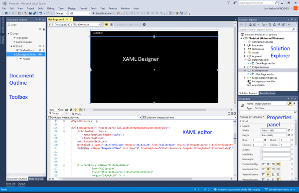
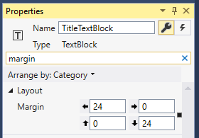
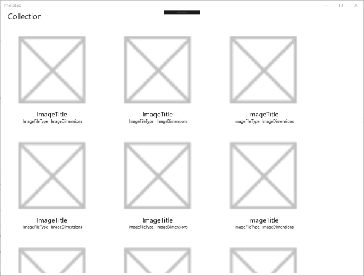
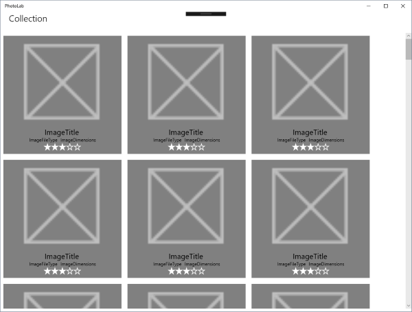

# Tutorial: Create a user interface

In this tutorial, you'll learn how to create a basic UI for an image editing program by:

+ Using the XAML tools in Visual Studio, such as XAML Designer, Toolbox, the XAML editor, the Properties panel, and Document Outline, to add controls and content to your UI.
+ Using some of the most common XAML layout panels, such as `RelativePanel`, `Grid`, and `StackPanel`.

The image editing program has two pages. The _main page_ displays a photo gallery view, along with some information about each image file.


The *details page* displays a single photo after it has been selected. A flyout editing menu allows the photo to be altered, renamed, and saved.


## Prerequisites

+ Visual Studio 2019: [Download Visual Studio 2019](https://visualstudio.microsoft.com/downloads/) (The Community edition is free.)
+ Windows 10 SDK (10.0.17763.0 or later):  [Download the latest Windows SDK (free)](https://developer.microsoft.com/windows/downloads/windows-10-sdk)
+ Windows 10, Version 1809 or later

## Part 0: Get the starter code from GitHub

For this tutorial, you'll start with a simplified version of the PhotoLab sample.

1. Go to the GitHub page for the sample: [https://github.com/Microsoft/Windows-appsample-photo-lab](https://github.com/Microsoft/Windows-appsample-photo-lab).
2. Next, you'll need to clone or download the sample. Select the **Clone or download** button. A sub-menu appears.
    

    **If you're not familiar with GitHub:**

    a. Select **Download ZIP** and save the file locally. This downloads a .zip file that contains all the project files you need.

    b. Extract the file. Use File Explorer to browse to the .zip file that you just downloaded, right-click it, and select **Extract All...**.

    c. Browse to your local copy of the sample, and go to the `Windows-appsample-photo-lab-master\xaml-basics-starting-points\user-interface` directory.

    **If you are familiar with GitHub:**

    a. Clone the master branch of the repo locally.

    b. Browse to the `Windows-appsample-photo-lab\xaml-basics-starting-points\user-interface` directory.

3. Double-click `Photolab.sln` to open the solution in Visual Studio.

## Part 1: Add a TextBlock control by using XAML Designer

Visual Studio provides several tools to make creating your XAML UI easier.

+ Drag controls from the _Toolbox_ onto the _XAML Designer_ design surface and see what they'll look like before you run the app.
+ The _Properties panel_ lets you view and set all the properties of the control that is active in the designer.
+ _Document Outline_ shows the parent/child structure of the XAML visual tree for your UI.
+ The _XAML editor_ lets you directly enter and modify the XAML markup.

Here's the Visual Studio UI with the tools labeled.



Each of these tools makes creating your UI easier, so we'll use all of them in this tutorial. You'll start by using XAML Designer to add a control.

To add a control by using XAML Designer:

1. Double-click **MainPage.xaml** in Solution Explorer to open it. This step shows the main page of the app without any UI elements added.

2. Before going further, you need to make some adjustments to Visual Studio:

    + Make sure the solution platform is set to x86 or x64, not ARM.
    + Set the main page of XAML Designer to show the 13.3" desktop preview.

    You should see both settings near the top of the window, as shown here.

    

    You can run the app now, but you won't see much. Let's add some UI elements to make things more interesting.

3. In Toolbox, expand **Common XAML controls** and find the [TextBlock](/uwp/api/windows.ui.xaml.controls.textblock) control. Drag a `TextBlock` control onto the design surface and place it near the upper-left corner of the page.

    The `TextBlock` control is added to the page, and the designer sets some properties based on its best guess at the layout you want. A blue highlight appears around the `TextBlock` control to indicate that it is now the active object. Notice the margins and other settings that the designer added.

    Your XAML will look something like the following. Don't worry if it's not formatted exactly like this. We abbreviated here to make it easier to read.

    ```xaml
    <TextBlock HorizontalAlignment="Left"
               Margin="351,44,0,0"
               TextWrapping="Wrap"
               Text="TextBlock"
               VerticalAlignment="Top"/>
    ```

    In the next steps, you'll update these values.

4. In the **Properties** panel, change the **Name** value of the `TextBlock` control to **TitleTextBlock**. (Make sure the `TextBlock` control is still the active object.)

5. Under **Common**, change the **Text** value to **Collection**.

    

    In the XAML editor, your XAML will now look like this.

    ```xaml
    <TextBlock x:Name="TitleTextBlock"
               HorizontalAlignment="Left"
               Margin="351,44,0,0"
               TextWrapping="Wrap"
               Text="Collection"
               VerticalAlignment="Top"/>
    ```

6. To position the `TextBlock` control, you should first remove the property values that Visual Studio added. In Document Outline, right-click **TitleTextBlock**, and then select **Layout** > **Reset All**.

    

7. In the **Properties** panel, enter `Margin` into the search box to easily find the `Margin` property. Set the left and bottom margins to 24.

    

    Margins provide the most basic positioning of an element on the page. They're useful for fine-tuning your layout, but you should avoid using large margin values like those added by Visual Studio. They make it difficult for your UI to adapt to various screen sizes.

    For more info, see [Alignment, margins, and padding](../layout/alignment-margin-padding.md).

8. In Document Outline, right-click **TitleTextBlock**, and then select **Edit Style** > **Apply Resource** > **TitleTextBlockStyle**. This step applies a system-defined style to your title text.

    ```xaml
    <TextBlock x:Name="TitleTextBlock"
               TextWrapping="Wrap"
               Text="Collection"
               Margin="24,0,0,24"
               Style="{StaticResource TitleTextBlockStyle}"/>
    ```

9. In the **Properties** panel, enter **textwrapping** into the search box to find the `TextWrapping` property. Select the _property marker_ for the `TextWrapping` property to open its menu. (The property marker is the small box symbol to the right of each property value. The property marker is black to indicate that the property is set to a non-default value.) On the **Property** menu, select **Reset** to reset the `TextWrapping` property.

    Visual Studio adds this property, but it's already set in the style you applied, so you don't need it here.

You've added the first part of the UI to your app. Run the app now to see what it looks like.

> [!NOTE]
> In this part of the tutorial, you added a control by dragging it. You can also add a control by double-clicking it in Toolbox. Give it a try, and see the differences in the XAML that Visual Studio generates.

## Part 2: Add a GridView control by using the XAML editor

In Part 1, you had a taste of using XAML Designer and some of the other tools that Visual Studio provides. Here, you'll use the XAML editor to work directly with the XAML markup. As you become more familiar with XAML, you might find that this is a more efficient way for you to work.

First, you'll replace the root layout [Grid](/uwp/api/windows.ui.xaml.controls.grid) with [RelativePanel](/uwp/api/windows.ui.xaml.controls.relativepanel). `RelativePanel` makes it easier to rearrange chunks of UI relative to the panel or other pieces of UI. You'll see its usefulness in the [XAML adaptive layout](xaml-basics-adaptive-layout.md) tutorial.

Then, you'll add a [GridView](/uwp/api/windows.ui.xaml.controls.gridview) control to display your data.

To add a control by using the XAML editor:

1. In the XAML editor, change the root `Grid` to `RelativePanel`.

    **Before**

    ```xaml
    <Grid Background="{ThemeResource ApplicationPageBackgroundThemeBrush}">
          <TextBlock x:Name="TitleTextBlock"
                     Text="Collection"
                     Margin="24,0,0,24"
                     Style="{StaticResource TitleTextBlockStyle}"/>
    </Grid>
    ```

    **After**

    ```xaml
    <RelativePanel Background="{ThemeResource ApplicationPageBackgroundThemeBrush}">
        <TextBlock x:Name="TitleTextBlock"
                   Text="Collection"
                   Margin="24,0,0,24"
                   Style="{StaticResource TitleTextBlockStyle}"/>
    </RelativePanel>
    ```

    For more info about layout using `RelativePanel`, see [Layout panels](../layout/layout-panels.md#relativepanel).

2. Below the `TextBlock` element, add a `GridView` control named **ImageGridView**. Set the `RelativePanel` _attached properties_ to place the control below the title text and make it stretch across the entire width of the screen.

    **Add this XAML**

    ```xaml
    <GridView x:Name="ImageGridView"
              Margin="0,0,0,8"
              RelativePanel.AlignLeftWithPanel="True"
              RelativePanel.AlignRightWithPanel="True"
              RelativePanel.Below="TitleTextBlock"/>
    ```

    **After TextBlock**

    ```xaml
    <RelativePanel Background="{ThemeResource ApplicationPageBackgroundThemeBrush}">
        <TextBlock x:Name="TitleTextBlock"
                   Text="Collection"
                   Margin="24,0,0,24"
                   Style="{StaticResource TitleTextBlockStyle}"/>

        <!-- Add the GridView control here. -->

    </RelativePanel>
    ```

    For more info about panel attached properties, see [Layout panels](../layout/layout-panels.md).

3. For the `GridView` control to show anything, you need to give it a collection of data to show. Open **MainPage.xaml.cs** and find the `GetItemsAsync` method. This method populates a collection called **Images**, which is a property that we've added to **MainPage**.

    At the end of the `GetItemsAsync` method, add this line of code.

    ```csharp
    ImageGridView.ItemsSource = Images;
    ```

    This sets the `GridView` control's [ItemsSource](/uwp/api/windows.ui.xaml.controls.itemscontrol.itemssource) property to the app's **Images** collection. It also gives the `GridView` control something to show.

This is a good place to run the app and make sure everything's working. It should look something like this.


You'll notice that the app isn't showing images yet. By default, it shows the `ToString` value of the data type that's in the collection. Next, you'll create a data template to define how the data is shown.

> [!NOTE]
> You can learn more about layout using `RelativePanel` in the [Layout panels](../layout/layout-panels.md#relativepanel) article. Take a look, and then experiment with some different layouts by setting `RelativePanel` attached properties on `TextBlock` and `GridView`.

## Part 3: Add a DataTemplate object to display your data

Now, you'll create a [DataTemplate](/uwp/api/windows.ui.xaml.datatemplate) object that tells the `GridView` control how to display your data. For a full explanation of data templates, see [Item containers and templates](../controls-and-patterns/item-containers-templates.md).

For now, you'll add only placeholders to help you create the layout you want. In the [XAML data binding](../../data-binding/xaml-basics-data-binding.md) tutorial, you'll replace these placeholders with real data from the `ImageFileInfo` class. You can open the **ImageFileInfo.cs** file now if you want to see what the data object looks like.

To add a data template to a grid view:

1. Open **MainPage.xaml**.

2. To show the rating, use the [RatingControl](/uwp/api/microsoft.ui.xaml.controls.ratingcontrol) from the [Windows UI Library](/windows/apps/winui/) (WinUI) NuGet package. Add a XAML namespace reference that specifies the namespace for the WinUI controls. Put this in the opening `Page` tag, right after the other `xmlns:` entries.

    **Add this XAML**

    ```xaml
    xmlns:muxc="using:Microsoft.UI.Xaml.Controls"
    ```

    **After the last `xmlns:` entry**

    ```xaml
    <Page x:Name="page"
      x:Class="PhotoLab.MainPage"
      xmlns="http://schemas.microsoft.com/winfx/2006/xaml/presentation"
      xmlns:x="http://schemas.microsoft.com/winfx/2006/xaml"
      xmlns:local="using:PhotoLab"
      xmlns:d="http://schemas.microsoft.com/expression/blend/2008"
      xmlns:mc="http://schemas.openxmlformats.org/markup-compatibility/2006"
      xmlns:muxc="using:Microsoft.UI.Xaml.Controls"
      mc:Ignorable="d"
      NavigationCacheMode="Enabled">
    ```

    For more info about XAML namespaces, see [XAML namespaces and namespace mapping](../../xaml-platform/xaml-namespaces-and-namespace-mapping.md).

3. In Document Outline, right-click **ImageGridView**. On the shortcut menu, select **Edit Additional Templates** > **Edit Generated Items (ItemTemplate)** > **Create Empty**. The **Create Resource** dialog box opens.

4. In the dialog box, change the **Name (key)** value to **ImageGridView_DefaultItemTemplate**, and then select **OK**.

    Several things happen when you select **OK**:

    + A `DataTemplate` object is added to the `Page.Resources` section of **MainPage.xaml**.

        ```xaml
        <Page.Resources>
            <DataTemplate x:Key="ImageGridView_DefaultItemTemplate">
                <Grid/>
            </DataTemplate>
        </Page.Resources>
        ```

    + The `GridView` control's [ItemTemplate](/uwp/api/windows.ui.xaml.controls.itemscontrol.itemtemplate) property is set to the `DataTemplate` resource.

       ```xaml
           <GridView x:Name="ImageGridView"
                     Margin="0,0,0,8"
                     RelativePanel.AlignLeftWithPanel="True"
                     RelativePanel.AlignRightWithPanel="True"
                     RelativePanel.Below="TitleTextBlock"
                     ItemTemplate="{StaticResource ImageGridView_DefaultItemTemplate}"/>
       ```

5. In the **ImageGridView_DefaultItemTemplate** resource, give the root `Grid` a height and width of **300**, and margin of **8**. Then add two rows and set the height of the second row to **Auto**.

    **Before**

    ```xaml
    <Grid/>
    ```

    **After**

    ```xaml
    <Grid Height="300"
          Width="300"
          Margin="8">
        <Grid.RowDefinitions>
            <RowDefinition />
            <RowDefinition Height="Auto" />
        </Grid.RowDefinitions>
    </Grid>
    ```

    For more info about `Grid` layouts, see [Layout panels](../layout/layout-panels.md#grid).

6. Add controls to the `Grid` layout.

    a. Add an [Image](/uwp/api/windows.ui.xaml.controls.image) control to the grid; by default, it's placed in the first grid row (row 0). This is where the image will be shown. But for now, you'll use the app's store logo as a placeholder.

    b. Add `TextBlock` controls to show the image's name, file type, and dimensions. For this, you use `StackPanel` controls to arrange the text blocks. Use the `Grid.Row` attached property to place the outermost `StackPanel` in the second row (row 1).

    For more info about `StackPanel` layout, see [Layout panels](../layout/layout-panels.md#stackpanel).

    c. Add the `RatingControl` to the outer (vertical) `StackPanel` control. Place it after the inner (horizontal) `StackPanel` control.

    **The final template**

    ```xaml
    <Grid Height="300"
          Width="300"
          Margin="8">
        <Grid.RowDefinitions>
            <RowDefinition />
            <RowDefinition Height="Auto" />
        </Grid.RowDefinitions>

        <Image x:Name="ItemImage"
               Source="Assets/StoreLogo.png"
               Stretch="Uniform" />

        <StackPanel Orientation="Vertical"
                    Grid.Row="1">
            <TextBlock Text="ImageTitle"
                       HorizontalAlignment="Center"
                       Style="{StaticResource SubtitleTextBlockStyle}" />
            <StackPanel Orientation="Horizontal"
                        HorizontalAlignment="Center">
                <TextBlock Text="ImageFileType"
                           HorizontalAlignment="Center"
                           Style="{StaticResource CaptionTextBlockStyle}" />
                <TextBlock Text="ImageDimensions"
                           HorizontalAlignment="Center"
                           Style="{StaticResource CaptionTextBlockStyle}"
                           Margin="8,0,0,0" />
            </StackPanel>

            <muxc:RatingControl Value="3" IsReadOnly="True"/>
        </StackPanel>
    </Grid>
    ```

Run the app now to see the `GridView` control with the item template that you just created. Next, you'll change the background color and add some space between the grid items.



## Part 4: Modify the item container style

An item's control template contains the visuals that display state, like selection, pointer over, and focus. These visuals are rendered either on top of or below the data template. Here, you'll modify the `Background` and `Margin` properties of the control template to give the `GridView` items a gray background.

To modify the item container:

1. In Document Outline, right-click **ImageGridView**. On the shortcut menu, select **Edit Additional Templates** > **Edit Generated Item Container (ItemContainerStyle)** > **Edit a Copy**. The **Create Resource** dialog box opens.

2. In the dialog box, change the **Name (key)** value to **ImageGridView_DefaultItemContainerStyle**, and then select **OK**.

    A copy of the default style is added to the **Page.Resources** section of your XAML.

    ```xaml
    <Style x:Key="ImageGridView_DefaultItemContainerStyle" TargetType="GridViewItem">
        <Setter Property="FontFamily" Value="{ThemeResource ContentControlThemeFontFamily}"/>
        <Setter Property="FontSize" Value="{ThemeResource ControlContentThemeFontSize}"/>
        <Setter Property="Background" Value="{ThemeResource GridViewItemBackground}"/>
        <Setter Property="Foreground" Value="{ThemeResource GridViewItemForeground}"/>
        <Setter Property="TabNavigation" Value="Local"/>
        <Setter Property="IsHoldingEnabled" Value="True"/>
        <Setter Property="HorizontalContentAlignment" Value="Center"/>
        <Setter Property="VerticalContentAlignment" Value="Center"/>
        <Setter Property="Margin" Value="0,0,4,4"/>
        <Setter Property="MinWidth" Value="{ThemeResource GridViewItemMinWidth}"/>
        <Setter Property="MinHeight" Value="{ThemeResource GridViewItemMinHeight}"/>
        <Setter Property="AllowDrop" Value="False"/>
        <Setter Property="UseSystemFocusVisuals" Value="{StaticResource UseSystemFocusVisuals}"/>
        <Setter Property="FocusVisualMargin" Value="-2"/>
        <Setter Property="Template">
            <Setter.Value>
                <ControlTemplate TargetType="GridViewItem">
                <!-- XAML removed for clarity
                    <ListViewItemPresenter ... />
                -->   
                </ControlTemplate>
            </Setter.Value>
        </Setter>
    </Style>
    ```

    The `GridViewItem` default style sets a lot of properties. However, in your copy of the template, you only need to keep the properties that want to modify.

    As in the previous step, the **GridView** control's **ItemContainerStyle** property is set to the new **Style** resource.

    ```xaml
        <GridView x:Name="ImageGridView"
                  Margin="0,0,0,8"
                  RelativePanel.AlignLeftWithPanel="True"
                  RelativePanel.AlignRightWithPanel="True"
                  RelativePanel.Below="TitleTextBlock"
                  ItemTemplate="{StaticResource ImageGridView_DefaultItemTemplate}"
                  ItemContainerStyle="{StaticResource ImageGridView_DefaultItemContainerStyle}"/>
    ```

3. Delete all the `Setter` elements except `Background` and `Margin`.

4. Change the value for the `Background` property to `Gray`.

    **Before**

    ```xaml
        <Setter Property="Background" Value="{ThemeResource GridViewItemBackground}"/>
    ```

    **After**

    ```xaml
        <Setter Property="Background" Value="Gray"/>
    ```

5. Change the value for the `Margin` property to `8`.

    **Before**

    ```xaml
        <Setter Property="Margin" Value="0,0,4,4"/>
    ```

    **After**

    ```xaml
        <Setter Property="Margin" Value="8"/>
    ```

Run the app and see how it looks now. Resize the app window. The `GridView` control takes care of rearranging the images for you, but at some widths, there's a lot of space on the right side of the app window. It would look better if the images were centered. You'll take care of that next.



> [!Note]
> If you want to experiment, try setting the `Background` and `Margin` properties to different values and see what effect it has.

## Part 5: Apply some final adjustments to the layout

To center the images on the page, you need to adjust the alignment of the `Grid` control on the page. Or do you need to adjust the alignment of the images in the `GridView`? Does it matter? Let's see.

For more info about alignment, see [Alignment, margins, and padding](../layout/alignment-margin-padding.md).

(You might try setting the `Background` property of `GridView` to your favorite color for this step. It will let you see more clearly what's happening with the layout.)

To modify the alignment of the images:

1. In `GridView`, set the [HorizontalAlignment](/uwp/api/windows.ui.xaml.frameworkelement.horizontalalignment) property to `Center`.

    **Before**

    ```xaml
        <GridView x:Name="ImageGridView"
                  Margin="0,0,0,8"
                  RelativePanel.AlignLeftWithPanel="True"
                  RelativePanel.AlignRightWithPanel="True"
                  RelativePanel.Below="TitleTextBlock"
                  ItemTemplate="{StaticResource ImageGridView_DefaultItemTemplate}"/>
    ```

    **After**

    ```xaml
        <GridView x:Name="ImageGridView"
                  Margin="0,0,0,8"
                  RelativePanel.AlignLeftWithPanel="True"
                  RelativePanel.AlignRightWithPanel="True"
                  RelativePanel.Below="TitleTextBlock"
                  ItemTemplate="{StaticResource ImageGridView_DefaultItemTemplate}"
                  HorizontalAlignment="Center"/>
    ```

2. Run the app and resize the window. Scroll down to see more images.

    The images are centered, which looks better. However, the scroll bar is aligned with the edge of the `GridView` control instead of with the edge of the window. To fix this, you'll center the images in `GridView` rather than centering `GridView` on the page. It's a little more work, but it will look better in the end.

3. Remove the `HorizontalAlignment` setting from the previous step.

4. In Document Outline, right-click **ImageGridView**. On the shortcut menu, select **Edit Additional Templates** > **Edit Layout of Items (ItemsPanel)** > **Edit a Copy**. The **Create Resource** dialog box opens.

5. In the dialog box, change the **Name (key)** value to **ImageGridView_ItemsPanelTemplate**, and then select **OK**.

    A copy of the default **ItemsPanelTemplate** is added to the **Page.Resources** section of your XAML. (And as before, `GridView` is updated to reference this resource.)

    ```xaml
    <ItemsPanelTemplate x:Key="ImageGridView_ItemsPanelTemplate">
        <ItemsWrapGrid Orientation="Horizontal" />
    </ItemsPanelTemplate>
    ```

    Just as you've used various panels to lay out the controls in your app, `GridView` has an internal panel that manages the layout of its items. Now that you have access to this panel ([ItemsWrapGrid](/uwp/api/windows.ui.xaml.controls.itemswrapgrid)), you can modify its properties to change the layout of items inside the `GridView` control.

6. In the `ItemsWrapGrid`, set the `HorizontalAlignment` property to `Center`.

    **Before**

    ```xaml
    <ItemsPanelTemplate x:Key="ImageGridView_ItemsPanelTemplate">
        <ItemsWrapGrid Orientation="Horizontal" />
    </ItemsPanelTemplate>
    ```

    **After**

    ```xaml
    <ItemsPanelTemplate x:Key="ImageGridView_ItemsPanelTemplate">
        <ItemsWrapGrid Orientation="Horizontal"
                       HorizontalAlignment="Center"/>
    </ItemsPanelTemplate>
    ```

7. Run the app and resize the window again. Scroll down to see more images.


Now, the scroll bar is aligned with the edge of the window. Good job! You've created the basic UI for your app.

## Go further

Now that you've created the basic UI, check out these other tutorials. They're also based on the PhotoLab sample.

* Add real images and data in the [XAML data binding tutorial](../../data-binding/xaml-basics-data-binding.md).
* Make the UI adapt to different screen sizes in the [XAML adaptive layout tutorial](xaml-basics-adaptive-layout.md).


## Get the final version of the PhotoLab sample

This tutorial doesn't build up to the complete photo-editing app. So be sure to check out the [final version](https://github.com/Microsoft/Windows-appsample-photo-lab) to see other features, such as custom animations and adaptive layouts.