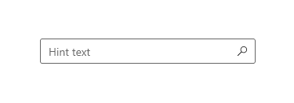
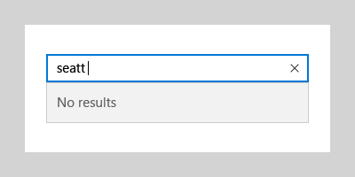

# Auto-suggest box

Use an AutoSuggestBox to provide a list of suggestions for a user to select from as they type.

> **Important APIs**: [AutoSuggestBox class](https://msdn.microsoft.com/library/windows/apps/xaml/windows.ui.xaml.controls.autosuggestbox.aspx), [TextChanged event](https://msdn.microsoft.com/library/windows/apps/xaml/windows.ui.xaml.controls.autosuggestbox.textchanged.aspx), [SuggestionChose event](https://msdn.microsoft.com/library/windows/apps/xaml/windows.ui.xaml.controls.autosuggestbox.suggestionchosen.aspx), [QuerySubmitted event](https://msdn.microsoft.com/library/windows/apps/xaml/windows.ui.xaml.controls.autosuggestbox.querysubmitted.aspx)


## Is this the right control?

If you'd like a simple, customizable control that allows text search with a list of suggestions, then choose an auto-suggest box.

For more info about choosing the right text control, see the [Text controls](text-controls.md) article.

## Examples

<table>
<th align="left">XAML Controls Gallery<th>
<tr>
<td></img></td>
<td>
    <p>If you have the <strong style="font-weight: semi-bold">XAML Controls Gallery</strong> app installed, click here to <a href="xamlcontrolsgallery:/item/AutoSuggestBox">open the app and see the AutoSuggestBox in action</a>.</p>
    <ul>
    <li><a href="https://www.microsoft.com/store/productId/9MSVH128X2ZT">Get the XAML Controls Gallery app (Microsoft Store)</a></li>
    <li><a href="https://github.com/Microsoft/Windows-universal-samples/tree/master/Samples/XamlUIBasics">Get the source code (GitHub)</a></li>
    </ul>
</td>
</tr>
</table>

An auto suggest box in the Groove Music app.


## Anatomy
The entry point for the auto-suggest box consists of an optional header and a text box with optional hint text:



The auto-suggest results list populates automatically once the user starts to enter text. The results list can appear above or below the text entry box. A "clear all" button appears:


## Create an auto-suggest box

To use an AutoSuggestBox, you need to respond to 3 user actions.

- Text changed - When the user enters text, update the suggestion list.
- Suggestion chosen - When the user chooses a suggestion in the suggestion list, update the text box.
- Query submitted - When the user submits a query, show the query results.

### Text changed

The [TextChanged](https://msdn.microsoft.com/library/windows/apps/xaml/windows.ui.xaml.controls.autosuggestbox.textchanged.aspx) event occurs whenever the content of the text box is updated. Use the event args [Reason](https://msdn.microsoft.com/library/windows/apps/xaml/windows.ui.xaml.controls.autosuggestboxtextchangedeventargs.reason.aspx) property to determine whether the change was due to user input. If the change reason is **UserInput**, filter your data based on the input. Then, set the filtered data as the [ItemsSource](https://msdn.microsoft.com/library/windows/apps/xaml/windows.ui.xaml.controls.itemscontrol.itemssource.aspx) of the AutoSuggestBox to update the suggestion list.

To control how items are displayed in the suggestion list, you can use [DisplayMemberPath](https://msdn.microsoft.com/library/windows/apps/xaml/windows.ui.xaml.controls.itemscontrol.displaymemberpath.aspx) or [ItemTemplate](https://msdn.microsoft.com/library/windows/apps/xaml/windows.ui.xaml.controls.itemscontrol.itemtemplate.aspx).

- To display the text of a single property of your data item, set the DisplayMemberPath property to choose which property from your object to display in the suggestion list.
- To define a custom look for each item in the list, use the ItemTemplate property.

### Suggestion chosen

When a user navigates through the suggestion list using the keyboard, you need to update the text in the text box to match.

You can set the [TextMemberPath](https://msdn.microsoft.com/library/windows/apps/xaml/windows.ui.xaml.controls.autosuggestbox.textmemberpath.aspx) property to choose which property from your data object to display in the text box. If you specify a TextMemberPath, the text box is updated automatically. You should typically specify the same value for DisplayMemberPath and TextMemberPath so the text is the same in the suggestion list and the text box.

If you need to show more than a simple property, handle the [SuggestionChosen](https://msdn.microsoft.com/library/windows/apps/xaml/windows.ui.xaml.controls.autosuggestbox.suggestionchosen.aspx) event to populate the text box with custom text based on the selected item.

### Query submitted

Handle the [QuerySubmitted](https://msdn.microsoft.com/library/windows/apps/xaml/windows.ui.xaml.controls.autosuggestbox.querysubmitted.aspx) event to perform a query action appropriate to your app and show the result to the user.

The QuerySubmitted event occurs when a user commits a query string. The user can commit a query in one of these ways:
- While the focus is in the text box, press Enter or click the query icon. The event args [ChosenSuggestion](https://msdn.microsoft.com/library/windows/apps/xaml/windows.ui.xaml.controls.autosuggestboxquerysubmittedeventargs.chosensuggestion.aspx) property is **null**.
- While the focus is in the suggestion list, press Enter, click, or tap an item. The event args ChosenSuggestion property contains the item that was selected from the list.

In all cases, the event args [QueryText](https://msdn.microsoft.com/library/windows/apps/xaml/windows.ui.xaml.controls.autosuggestboxquerysubmittedeventargs.querytext.aspx) property contains the text from the text box.

Here is a simple AutoSuggestBox with the required event handlers.

```xaml
<AutoSuggestBox PlaceholderText="Search" QueryIcon="Find" Width="200"
                TextChanged="AutoSuggestBox_TextChanged"
                QuerySubmitted="AutoSuggestBox_QuerySubmitted"
                SuggestionChosen="AutoSuggestBox_SuggestionChosen"/>
```

```csharp
private void AutoSuggestBox_TextChanged(AutoSuggestBox sender, AutoSuggestBoxTextChangedEventArgs args)
{
    // Only get results when it was a user typing,
    // otherwise assume the value got filled in by TextMemberPath
    // or the handler for SuggestionChosen.
    if (args.Reason == AutoSuggestionBoxTextChangeReason.UserInput)
    {
        //Set the ItemsSource to be your filtered dataset
        //sender.ItemsSource = dataset;
    }
}


private void AutoSuggestBox_SuggestionChosen(AutoSuggestBox sender, AutoSuggestBoxSuggestionChosenEventArgs args)
{
    // Set sender.Text. You can use args.SelectedItem to build your text string.
}


private void AutoSuggestBox_QuerySubmitted(AutoSuggestBox sender, AutoSuggestBoxQuerySubmittedEventArgs args)
{
    if (args.ChosenSuggestion != null)
    {
        // User selected an item from the suggestion list, take an action on it here.
    }
    else
    {
        // Use args.QueryText to determine what to do.
    }
}
```

## Use AutoSuggestBox for search

Use an AutoSuggestBox to provide a list of suggestions for a user to select from as they type.

By default, the text entry box doesn’t have a query button shown. You can set the [QueryIcon](https://msdn.microsoft.com/library/windows/apps/xaml/windows.ui.xaml.controls.autosuggestbox.queryicon.aspx) property to add a button with the specified icon on the right side of the text box. For example, to make the AutoSuggestBox look like a typical search box, add a ‘find’ icon, like this.

```xaml
<AutoSuggestBox QueryIcon="Find"/>
```

Here's an AutoSuggestBox with a 'find' icon.


## Do's and don'ts

-   When using the auto-suggest box to perform searches and no search results exist for the entered text, display a single-line "No results" message as the result so that users know their search request executed:

    

<!--
<div class="microsoft-internal-note">
**Globalization and localization checklist**

<table>
<tr>
<th>Vertical spacing</th><td>Use non-Latin characters for vertical spacing to ensure non-Latin scripts will display properly, including numbers.</td>
</tr>
<tr>
<th>Scrolling</th><td>When auto suggest text is selected, user should be able to scroll to end of string.</td>
</tr>
</table>
</div>
-->

## Get the sample code

- [XAML Controls Gallery sample](https://github.com/Microsoft/Windows-universal-samples/tree/master/Samples/XamlUIBasics) - See all the XAML controls in an interactive format.
- [AutoSuggestBox sample](https://github.com/Microsoft/Windows-universal-samples/tree/master/Samples/XamlAutoSuggestBox)

## Related articles

- [Text controls](text-controls.md)
- [Spell checking](text-controls.md)
- [Search](search.md)
- [TextBox class](https://msdn.microsoft.com/library/windows/apps/br209683)
- [Windows.UI.Xaml.Controls PasswordBox class](https://msdn.microsoft.com/library/windows/apps/br227519)
- [String.Length property](https://msdn.microsoft.com/library/system.string.length.aspx)
