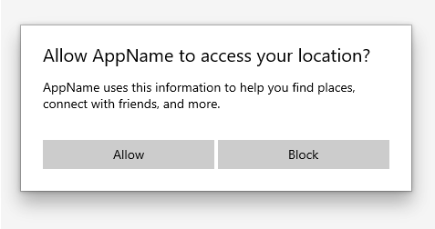
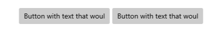
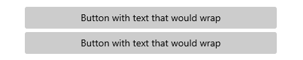
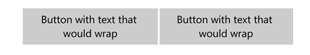
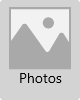

# Buttons


A button gives the user a way to trigger an immediate action.

> **Important APIs**: [Button class](https://msdn.microsoft.com/library/windows/apps/windows.ui.xaml.controls.button.aspx), [RepeatButton class](https://msdn.microsoft.com/library/windows/apps/windows.ui.xaml.controls.primitives.repeatbutton.aspx), [Click event](https://msdn.microsoft.com/library/windows/apps/windows.ui.xaml.controls.primitives.buttonbase.click.aspx)


## Is this the right control?

A button lets the user initiate an immediate action, such as submitting a form.

Don't use a button when the action is to navigate to another page; use a link instead. See [Hyperlinks](hyperlinks.md) for more info.
> Exception: For wizard navigation, use buttons labeled "Back" and "Next". For other types of backwards navigation or navigation to an upper level, use a back button.

## Examples

<table>
<th align="left">XAML Controls Gallery<th>
<tr>
<td></img></td>
<td>
    <p>If you have the <strong style="font-weight: semi-bold">XAML Controls Gallery</strong> app installed, click here to <a href="xamlcontrolsgallery:/item/Button">open the app and see the Button in action</a>.</p>
    <ul>
    <li><a href="https://www.microsoft.com/store/productId/9MSVH128X2ZT">Get the XAML Controls Gallery app (Microsoft Store)</a></li>
    <li><a href="https://github.com/Microsoft/Windows-universal-samples/tree/master/Samples/XamlUIBasics">Get the source code (GitHub)</a></li>
    </ul>
</td>
</tr>
</table>

This example uses two buttons, Allow and Block, in a dialog requesting location access.



## Create a button

This example shows a button that responds to a click.

Create the button in XAML.

```xaml
<Button Content="Subscribe" Click="SubscribeButton_Click"/>
```

Or create the button in code.

```csharp
Button subscribeButton = new Button();
subscribeButton.Content = "Subscribe";
subscribeButton.Click += SubscribeButton_Click;

// Add the button to a parent container in the visual tree.
stackPanel1.Children.Add(subscribeButton);
```

Handle the Click event.

```csharp
private async void SubscribeButton_Click(object sender, RoutedEventArgs e)
{
    // Call app specific code to subscribe to the service. For example:
    ContentDialog subscribeDialog = new ContentDialog
    {
        Title = "Subscribe to App Service?",
        Content = "Listen, watch, and play in high definition for only $9.99/month. Free to try, cancel anytime.",
        CloseButtonText = "Not Now",
        PrimaryButtonText = "Subscribe",
        SecondaryButtonText = "Try it"
    };

    ContentDialogResult result = await subscribeDialog.ShowAsync();
}
```

### Button interaction

When you tap a Button with a finger or stylus, or press a left mouse button while the pointer is over it, the button raises the [Click](https://msdn.microsoft.com/library/windows/apps/windows.ui.xaml.controls.primitives.buttonbase.click.aspx) event. If a button has keyboard focus, pressing the Enter key or the Spacebar key also raises the Click event.

You generally can't handle low-level [PointerPressed](https://msdn.microsoft.com/library/windows/apps/windows.ui.xaml.uielement.pointerpressed.aspx) events on a Button because it has the Click behavior instead. For more info, see [Events and routed events overview](https://msdn.microsoft.com/library/windows/apps/mt185584.aspx).

You can change how a button raises the Click event by changing the [ClickMode](https://docs.microsoft.com/en-us/uwp/api/windows.ui.xaml.controls.clickmode) property. The default ClickMode value is **Release**, but you also can set a button's ClickMode to **Hover** or **Press**. If ClickMode is **Hover**, the Click event can't be raised with the keyboard or touch.


### Button content

Button is a [ContentControl](https://msdn.microsoft.com/library/windows/apps/xaml/windows.ui.xaml.controls.contentcontrol.aspx). Its XAML content property is [Content](https://msdn.microsoft.com/library/windows/apps/xaml/windows.ui.xaml.controls.contentcontrol.content.aspx), which enables a syntax like this for XAML: `<Button>A button's content</Button>`. You can set any object as the button's content. If the content is a [UIElement](https://msdn.microsoft.com/library/windows/apps/xaml/windows.ui.xaml.uielement.aspx), it is rendered in the button. If the content is another type of object, its string representation is shown in the button.

A button's content is usually text. Here are design recommendations for buttons with text content:
-   Use a concise, specific, self-explanatory text that clearly describes the action that the button performs. Usually button text content is a single word, a verb.
-   Use the default font unless your brand guidelines tell you to use something different.
-   For shorter text, avoid narrow command buttons by using a minimum button width of 120px.
- For longer text, avoid wide command buttons by limiting text to a maximum length of 26 characters.
-   If the button's text content is dynamic (i.e., it is [localized](../globalizing/globalizing-portal.md)), consider how the button will resize and what will happen to controls around it.

<table>
<tr>
<td> <b>Need to fix:</b><br> Buttons with overflowing text. </td>
<td>  </td>
</tr>
<tr>
<td> <b>Option 1:</b><br> Increase button width, stack buttons, and wrap if text length is greater than 26 characters. </td>
<td>  </td>
</tr>
<tr>
<td> <b>Option 2:</b><br> Increase button height, and wrap text. </td>
<td>  </td>
</tr>
</table>

You can also customize visuals that make up the button's appearance. For example, you could replace the text with an icon, or use an icon plus text.

Here, a **StackPanel** that contains an image and text is set as the content of a button.

```xaml
<Button Click="Button_Click"
        Background="LightGray"
        Height="100" Width="80">
    <StackPanel>
        <Image Source="Assets/Photo.png" Height="62"/>
        <TextBlock Text="Photos" Foreground="Black"
                   HorizontalAlignment="Center"/>
    </StackPanel>
</Button>
```

The button looks like this.



## Create a repeat button

A [RepeatButton](https://msdn.microsoft.com/library/windows/apps/windows.ui.xaml.controls.primitives.repeatbutton.aspx) is a button that raises [Click](https://msdn.microsoft.com/library/windows/apps/windows.ui.xaml.controls.primitives.buttonbase.click.aspx) events repeatedly from the time it's pressed until it's released. Set the [Delay](https://msdn.microsoft.com/library/windows/apps/windows.ui.xaml.controls.primitives.repeatbutton.delay.aspx) property to specify the time that the RepeatButton waits after it is pressed before it starts repeating the click action. Set the [Interval](https://msdn.microsoft.com/library/windows/apps/windows.ui.xaml.controls.primitives.repeatbutton.interval.aspx) property to specify the time between repetitions of the click action. Times for both properties are specified in milliseconds.

The following example shows two RepeatButton controls whose respective Click events are used to increase and decrease the value shown in a text block.

```xaml
<StackPanel>
    <RepeatButton Width="100" Delay="500" Interval="100" Click="Increase_Click">Increase</RepeatButton>
    <RepeatButton Width="100" Delay="500" Interval="100" Click="Decrease_Click">Decrease</RepeatButton>
    <TextBlock x:Name="clickTextBlock" Text="Number of Clicks:" />
</StackPanel>
```

```csharp
private static int _clicks = 0;
private void Increase_Click(object sender, RoutedEventArgs e)
{
    _clicks += 1;
    clickTextBlock.Text = "Number of Clicks: " + _clicks;
}

private void Decrease_Click(object sender, RoutedEventArgs e)
{
    if(_clicks > 0)
    {
        _clicks -= 1;
        clickTextBlock.Text = "Number of Clicks: " + _clicks;
    }
}
```

## Recommendations
-   Make sure the purpose and state of a button are clear to the user.
-   When there are multiple buttons for the same decision (such as in a confirmation dialog), present the commit buttons in this order, where [Do it] and [Don't do it] are specific responses to the main instruction:
	-   OK/[Do it]/Yes
	-   [Don't do it]/No
	-   Cancel
-   Expose only one or two buttons to the user at a time, for example, Accept and Cancel. If you need to expose more actions to the user, consider using [checkboxes](checkbox.md) or [radio buttons](radio-button.md) from which the user can select actions, with a single command button to trigger those actions.
-   For an action that needs to be available across multiple pages within your app, instead of duplicating a button on multiple pages, consider using a [bottom app bar](app-bars.md).

### Recommended single button layout

If your layout requires only one button, it should be either left- or right-aligned based on its container context.

-   Dialogs with only one button should **right-align** the button. If your dialog contains only one button, ensure that the button performs the safe, nondestructive action. If you use [ContentDialog](dialogs.md) and specify a single button, it will automatically right-align.


-   If your button appears within a container UI (for example, within a toast notification, a flyout, or a list view item), you should **right-align** the button within the container.


-   In pages that contain a single button (for example, an "Apply" button at the bottom of a settings page), you should **left-align** the button. This ensures that the button aligns with the rest of the page content.


## Back buttons

The back button is a system-provided UI element that enables backward navigation through either the back stack or navigation history of the user. You don't have to create your own back button, but you might have to do some work to enable a good backwards navigation experience. For more info, see [History and backwards navigation](../basics/navigation-history-and-backwards-navigation.md)

## Get the sample code

- [XAML Controls Gallery sample](https://github.com/Microsoft/Windows-universal-samples/tree/master/Samples/XamlUIBasics) - See all the XAML controls in an interactive format.


## Related articles
- [Button class](https://msdn.microsoft.com/library/windows/apps/windows.ui.xaml.controls.button.aspx)
- [Radio buttons](radio-button.md)
- [Check boxes](checkbox.md)
- [Toggle switches](toggles.md)
