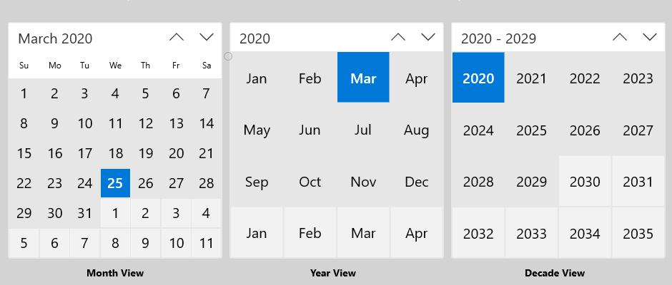
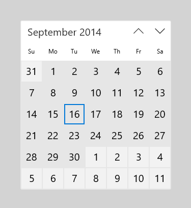

# Calendar view

A calendar view lets a user view and interact with a calendar that they can navigate by month, year, or decade. A user can select a single date or a range of dates. It doesn't have a picker surface and the calendar is always visible.

**Get the Windows UI Library**

|  |  |
| - | - |
|  | Windows UI Library 2.2 or later includes a new template for this control that uses rounded corners. For more info, see [Corner radius](../style/rounded-corner.md). WinUI is a NuGet package that contains new controls and UI features for Windows apps. For more info, including installation instructions, see [Windows UI Library](/uwp/toolkits/winui/). |

> **Platform APIs:**  [CalendarView class](/uwp/api/Windows.UI.Xaml.Controls.CalendarView), [SelectedDatesChanged event](/uwp/api/windows.ui.xaml.controls.calendarview.selecteddateschanged)

## Is this the right control?
Use a calendar view to let a user pick a single date or a range of dates from an always visible calendar.

If you need to let a user select multiple dates at one time, you must use a calendar view. If you need to let a user pick only a single date and don't need a calendar to be always visible, consider using a [calendar date picker](calendar-date-picker.md) or [date picker](date-picker.md) control.

For more info about choosing the right control, see the [Date and time controls](date-and-time.md) article.

## Examples

<table>
<th align="left">XAML Controls Gallery<th>
<tr>
<td></img></td>
<td>
    <p>If you have the <strong style="font-weight: semi-bold">XAML Controls Gallery</strong> app installed, click here to <a href="xamlcontrolsgallery:/item/CalendarView">open the app and see the CalendarView in action</a>.</p>
    <ul>
    <li><a href="https://www.microsoft.com/store/productId/9MSVH128X2ZT">Get the XAML Controls Gallery app (Microsoft Store)</a></li>
    <li><a href="https://github.com/Microsoft/Xaml-Controls-Gallery">Get the source code (GitHub)</a></li>
    </ul>
</td>
</tr>
</table>

The calendar view is made up of 3 separate views: the month view, year view, and decade view. By default, it starts with the month view open. You can specify a startup view by setting the [DisplayMode](/uwp/api/windows.ui.xaml.controls.calendarview.displaymode) property.



Users click the header in the month view to open the year view, and click the header in the year view to open the decade view. Users pick a year in the decade view to return to the year view, and pick a month in the year view to return to the month view. The two arrows to the side of the header navigate forward or backward by month, by year, or by decade.

## Create a calendar view

This example shows how to create a simple calendar view.

```xaml
<CalendarView/>
```

The resulting calendar view looks like this:



### Selecting dates

By default, the [SelectionMode](/uwp/api/windows.ui.xaml.controls.calendarview.selectionmode) property is set to **Single**. This lets a user pick a single date in the calendar. Set SelectionMode to **None** to disable date selection.

Set SelectionMode to **Multiple** to let a user select multiple dates. You can select multiple dates programmatically by adding [DateTime](/dotnet/api/system.datetime)/[DateTimeOffset](/dotnet/api/system.datetimeoffset) objects to the [SelectedDates](/uwp/api/windows.ui.xaml.controls.calendarview.selecteddates) collection, as shown here:

```csharp
calendarView1.SelectedDates.Add(DateTimeOffset.Now);
calendarView1.SelectedDates.Add(new DateTime(1977, 1, 5));
```

A user can deselect a selected date by clicking or tapping it in the calendar grid.

You can handle the [SelectedDatesChanged](/uwp/api/windows.ui.xaml.controls.calendarview.selecteddateschanged) event to be notified when the [SelectedDates](/uwp/api/windows.ui.xaml.controls.calendarview.selecteddates) collection has changed.

> [!NOTE]
> For important info about date values, see [DateTime and Calendar values](date-and-time.md#datetime-and-calendar-values) in the Date and time controls article.

### Customizing the calendar view's appearance

The calendar view is composed of both XAML elements defined in the ControlTemplate and visual elements rendered directly by the control.
- The XAML elements defined in the control template include the border that encloses the control, the header, previous and next buttons, and DayOfWeek elements. You can style and re-template these elements like any XAML control.
- The calendar grid is composed of [CalendarViewDayItem](/uwp/api/Windows.UI.Xaml.Controls.CalendarViewDayItem) objects. You can't style or re-template these elements, but various properties are provided to let you to customize their appearance.

This diagram shows the elements that make up the month view of the calendar. For more info, see the Remarks on the [CalendarViewDayItem](/uwp/api/Windows.UI.Xaml.Controls.CalendarViewDayItem) class.


This table lists the properties you can change to modify the appearance of calendar elements.

Element | Properties
--------|-----------
DayOfWeek | [DayOfWeekFormat](/uwp/api/windows.ui.xaml.controls.calendarview.dayofweekformat)
CalendarItem | [CalendarItemBackground](/uwp/api/windows.ui.xaml.controls.calendarview.calendaritembackground), [CalendarItemBorderBrush](/uwp/api/windows.ui.xaml.controls.calendarview.calendaritemborderbrush), [CalendarItemBorderThickness](/uwp/api/windows.ui.xaml.controls.calendarview.calendaritemborderthickness), [CalendarItemForeground](/uwp/api/windows.ui.xaml.controls.calendarview.calendaritemforeground)
DayItem | [DayItemFontFamily](/uwp/api/windows.ui.xaml.controls.calendarview.dayitemfontfamily), [DayItemFontSize](/uwp/api/windows.ui.xaml.controls.calendarview.dayitemfontsize), [DayItemFontStyle](/uwp/api/windows.ui.xaml.controls.calendarview.dayitemfontstyle), [DayItemFontWeight](/uwp/api/windows.ui.xaml.controls.calendarview.dayitemfontweight), [HorizontalDayItemAlignment](/uwp/api/windows.ui.xaml.controls.calendarview.horizontaldayitemalignment), [VerticalDayItemAlignment](/uwp/api/windows.ui.xaml.controls.calendarview.verticaldayitemalignment), [CalendarViewDayItemStyle](/uwp/api/windows.ui.xaml.controls.calendarview.calendarviewdayitemstyle)
MonthYearItem (in the year and decade views, equivalent to DayItem) | [MonthYearItemFontFamily](/uwp/api/windows.ui.xaml.controls.calendarview.monthyearitemfontfamily), [MonthYearItemFontSize](/uwp/api/windows.ui.xaml.controls.calendarview.monthyearitemfontsize), [MonthYearItemFontStyle](/uwp/api/windows.ui.xaml.controls.calendarview.monthyearitemfontstyle), [MonthYearItemFontWeight](/uwp/api/windows.ui.xaml.controls.calendarview.monthyearitemfontweight)
FirstOfMonthLabel | [FirstOfMonthLabelFontFamily](/uwp/api/windows.ui.xaml.controls.calendarview.firstofmonthlabelfontfamily), [FirstOfMonthLabelFontSize](/uwp/api/windows.ui.xaml.controls.calendarview.firstofmonthlabelfontsize), [FirstOfMonthLabelFontStyle](/uwp/api/windows.ui.xaml.controls.calendarview.firstofmonthlabelfontstyle), [FirstOfMonthLabelFontWeight](/uwp/api/windows.ui.xaml.controls.calendarview.firstofmonthlabelfontweight), [HorizontalFirstOfMonthLabelAlignment](/uwp/api/windows.ui.xaml.controls.calendarview.horizontalfirstofmonthlabelalignment), [VerticalFirstOfMonthLabelAlignment](/uwp/api/windows.ui.xaml.controls.calendarview.verticalfirstofmonthlabelalignment), [IsGroupLabelVisible](/uwp/api/windows.ui.xaml.controls.calendarview.isgrouplabelvisible)
FirstofYearDecadeLabel (in the year and decade views, equivalent to FirstOfMonthLabel) | [FirstOfYearDecadeLabelFontFamily](/uwp/api/windows.ui.xaml.controls.calendarview.firstofyeardecadelabelfontfamily), [FirstOfYearDecadeLabelFontSize](/uwp/api/windows.ui.xaml.controls.calendarview.firstofyeardecadelabelfontsize), [FirstOfYearDecadeLabelFontStyle](/uwp/api/windows.ui.xaml.controls.calendarview.firstofyeardecadelabelfontstyle), [FirstOfYearDecadeLabelFontWeight](/uwp/api/windows.ui.xaml.controls.calendarview.firstofyeardecadelabelfontweight)
Visual State Borders | [FocusBorderBrush](/uwp/api/windows.ui.xaml.controls.calendarview.focusborderbrush), [HoverBorderBrush](/uwp/api/windows.ui.xaml.controls.calendarview.hoverborderbrush), [PressedBorderBrush](/uwp/api/windows.ui.xaml.controls.calendarview.pressedborderbrush), [SelectedBorderBrush](/uwp/api/windows.ui.xaml.controls.calendarview.selectedborderbrush), [SelectedForeground](/uwp/api/windows.ui.xaml.controls.calendarview.selectedforeground), [SelectedHoverBorderBrush](/uwp/api/windows.ui.xaml.controls.calendarview.selectedhoverborderbrush), [SelectedPressedBorderBrush](/uwp/api/windows.ui.xaml.controls.calendarview.selectedpressedborderbrush)
OutofScope | [IsOutOfScopeEnabled](/uwp/api/windows.ui.xaml.controls.calendarview.isoutofscopeenabled), [OutOfScopeBackground](/uwp/api/windows.ui.xaml.controls.calendarview.outofscopebackground), [OutOfScopeForeground](/uwp/api/windows.ui.xaml.controls.calendarview.outofscopeforeground)
Today | [IsTodayHighlighted](/uwp/api/windows.ui.xaml.controls.calendarview.istodayhighlighted), [TodayFontWeight](/uwp/api/windows.ui.xaml.controls.calendarview.todayfontweight), [TodayForeground](/uwp/api/windows.ui.xaml.controls.calendarview.todayforeground)

 By default, the month view shows 6 weeks at a time. You can change the number of weeks shown by setting the [NumberOfWeeksInView](/uwp/api/windows.ui.xaml.controls.calendarview.numberofweeksinview) property. The minimum number of weeks to show is 2; the maximum is 8.

By default, the year and decade views show in a 4x4 grid. To change the number of rows or columns, call [SetYearDecadeDisplayDimensions](/uwp/api/windows.ui.xaml.controls.calendarview.setyeardecadedisplaydimensions) with the your desired number of rows and columns. This will change the grid for both the year and decade views.

Here, the year and decade views are set to show in a 3x4 grid.

```csharp
calendarView1.SetYearDecadeDisplayDimensions(3, 4);
```

By default, the minimum date shown in the calendar view is 100 years prior to the current date, and the maximum date shown is 100 years past the current date. You can change the minimum and maximum dates that the calendar shows by setting the [MinDate](/uwp/api/windows.ui.xaml.controls.calendarview.mindate) and [MaxDate](/uwp/api/windows.ui.xaml.controls.calendarview.maxdate) properties.

```csharp
calendarView1.MinDate = new DateTime(2000, 1, 1);
calendarView1.MaxDate = new DateTime(2099, 12, 31);
```

### Updating calendar day items

Each day in the calendar is represented by a [CalendarViewDayItem](/uwp/api/Windows.UI.Xaml.Controls.CalendarViewDayItem) object. To access an individual day item and use its properties and methods, handle the [CalendarViewDayItemChanging](/uwp/api/windows.ui.xaml.controls.calendarview.calendarviewdayitemchanging) event and use the Item property of the event args to access the CalendarViewDayItem.

You can make a day not selectable in the calendar view by setting its [CalendarViewDayItem.IsBlackout](/uwp/api/windows.ui.xaml.controls.calendarviewdayitem.isblackout) property to **true**.

You can show contextual information about the density of events in a day by calling the [CalendarViewDayItem.SetDensityColors](/uwp/api/windows.ui.xaml.controls.calendarviewdayitem.setdensitycolors) method. You can show from 0 to 10 density bars for each day, and set the color of each bar.

Here are some day items in a calendar. Days 1 and 2 are blacked out. Days 2, 3, and 4 have various density bars set.


### Phased rendering

A calendar view can contain a large number of CalendarViewDayItem objects. To keep the UI responsive and enable smooth navigation through the calendar, calendar view supports phased rendering. This lets you break up processing of a day item into phases. If a day is moved out of view before all the phases are complete, no more time is used trying to process and render that item.

This example shows phased rendering of a calendar view for scheduling appointments.
- In phase 0, the default day item is rendered.
- In phase 1, you blackout dates that can't be booked. This includes past dates, Sundays, and dates that are already fully booked.
- In phase 2, you check each appointment that's booked for the day. You show a green density bar for each confirmed appointment and a blue density bar for each tentative appointment.

The `Bookings` class in this example is from a fictitious appointment booking app, and is not shown.

```xaml
<CalendarView CalendarViewDayItemChanging="CalendarView_CalendarViewDayItemChanging"/>
```

```csharp
private void CalendarView_CalendarViewDayItemChanging(CalendarView sender,
                                   CalendarViewDayItemChangingEventArgs args)
{
    // Render basic day items.
    if (args.Phase == 0)
    {
        // Register callback for next phase.
        args.RegisterUpdateCallback(CalendarView_CalendarViewDayItemChanging);
    }
    // Set blackout dates.
    else if (args.Phase == 1)
    {
        // Blackout dates in the past, Sundays, and dates that are fully booked.
        if (args.Item.Date < DateTimeOffset.Now ||
            args.Item.Date.DayOfWeek == DayOfWeek.Sunday ||
            Bookings.HasOpenings(args.Item.Date) == false)
        {
            args.Item.IsBlackout = true;
        }
        // Register callback for next phase.
        args.RegisterUpdateCallback(CalendarView_CalendarViewDayItemChanging);
    }
    // Set density bars.
    else if (args.Phase == 2)
    {
        // Avoid unnecessary processing.
        // You don't need to set bars on past dates or Sundays.
        if (args.Item.Date > DateTimeOffset.Now &&
            args.Item.Date.DayOfWeek != DayOfWeek.Sunday)
        {
            // Get bookings for the date being rendered.
            var currentBookings = Bookings.GetBookings(args.Item.Date);

            List<Color> densityColors = new List<Color>();
            // Set a density bar color for each of the days bookings.
            // It's assumed that there can't be more than 10 bookings in a day. Otherwise,
            // further processing is needed to fit within the max of 10 density bars.
            foreach (booking in currentBookings)
            {
                if (booking.IsConfirmed == true)
                {
                    densityColors.Add(Colors.Green);
                }
                else
                {
                    densityColors.Add(Colors.Blue);
                }
            }
            args.Item.SetDensityColors(densityColors);
        }
    }
}
```

## Get the sample code

- [XAML Controls Gallery sample](https://github.com/Microsoft/Xaml-Controls-Gallery) - See all the XAML controls in an interactive format.

## Related articles

- [Date and time controls](date-and-time.md)
- [Calendar date picker](calendar-date-picker.md)
- [Date picker](date-picker.md)
- [Time picker](time-picker.md)