# Controls by function

The XAML UI framework for Windows provides an extensive library of controls that support UI development. Some of these controls have a visual representation; others function as the containers for other controls or content, such as images and media. 

You can see many of the Windows UI controls in action by downloading the [XAML UI Basics sample](https://github.com/Microsoft/Windows-universal-samples/tree/master/Samples/XamlUIBasics).

<table>
<th align="left">XAML Controls Gallery<th>
<tr>
<td>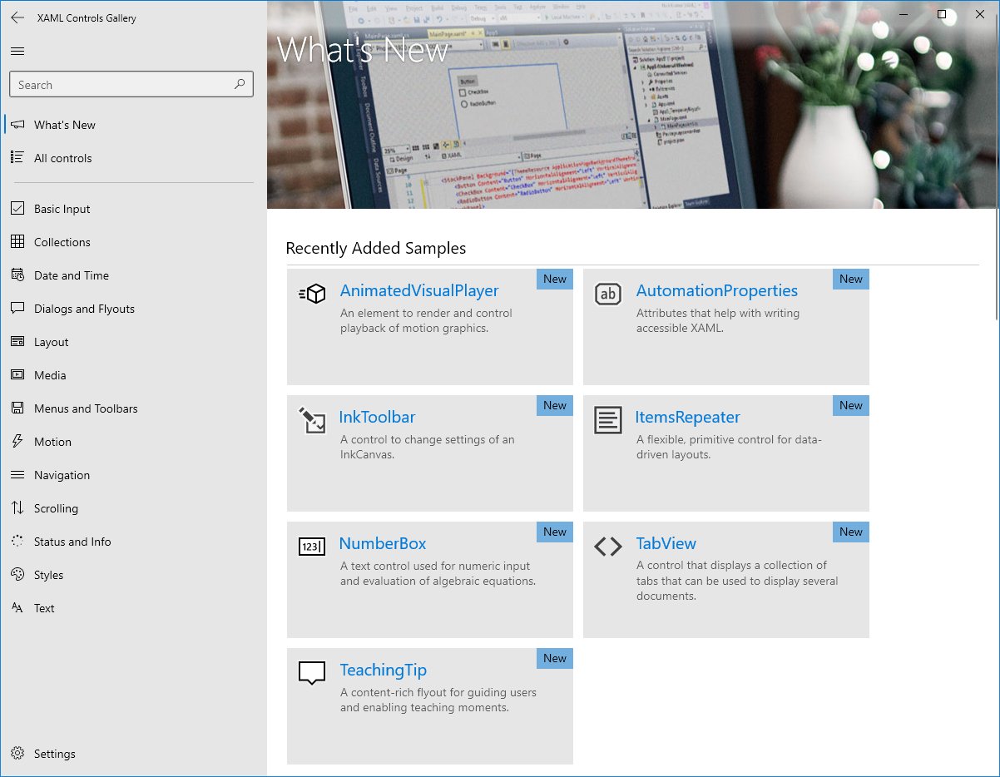</img></td>
<td>
    <p>If you have the <strong style="font-weight: semi-bold">XAML Controls Gallery</strong> app installed, click here to <a href="xamlcontrolsgallery:/item/NavigationView">open the app and see the NavigationView in action</a> </p>
    <ul>
    <li><a href="https://www.microsoft.com/store/productId/9MSVH128X2ZT">Get the XAML Controls Gallery app (Microsoft Store)</a></li>
    <li><a href="https://github.com/Microsoft/Xaml-Controls-Gallery">Get the source code (GitHub)</a></li>
    </ul>
</td>
</tr>
</table>


Here's a list by function of the common XAML controls you can use in your app.

## Appbars and commands

### App bar
A toolbar for displaying application-specific commands. See Command bar.

Reference: [AppBar](/uwp/api/Windows.UI.Xaml.Controls.AppBar) 

### App bar button
A button for showing commands using app bar styling.

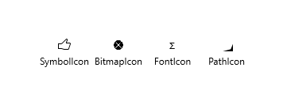 

Reference: [AppBarButton](/uwp/api/Windows.UI.Xaml.Controls.AppBarButton), [SymbolIcon](/uwp/api/Windows.UI.Xaml.Controls.SymbolIcon), [BitmapIcon](/uwp/api/Windows.UI.Xaml.Controls.BitmapIcon), [FontIcon](/uwp/api/Windows.UI.Xaml.Controls.FontIcon), [PathIcon](/uwp/api/Windows.UI.Xaml.Controls.PathIcon) 

Design and how-to: [App bar and command bar control guide](app-bars.md) 

Sample code: [XAML Commanding sample](https://github.com/Microsoft/Windows-universal-samples/tree/master/Samples/XamlCommanding)

### App bar separator
Visually separates groups of commands in a command bar.

Reference: [AppBarSeparator](/uwp/api/Windows.UI.Xaml.Controls.AppBarSeparator) 

Sample code: [XAML Commanding sample](https://github.com/Microsoft/Windows-universal-samples/tree/master/Samples/XamlCommanding)

### App bar toggle button
A button for toggling commands in a command bar.

Reference: [AppBarToggleButton](/uwp/api/Windows.UI.Xaml.Controls.AppBarToggleButton) 

Sample code: [XAML Commanding sample](https://github.com/Microsoft/Windows-universal-samples/tree/master/Samples/XamlCommanding)

### Command bar
A specialized app bar that handles the resizing of app bar button elements.


```xaml
<CommandBar>
    <AppBarButton Icon="Back" Label="Back" Click="AppBarButton_Click"/>
    <AppBarButton Icon="Stop" Label="Stop" Click="AppBarButton_Click"/>
    <AppBarButton Icon="Play" Label="Play" Click="AppBarButton_Click"/>
</CommandBar>
```
Reference: [CommandBar](/uwp/api/Windows.UI.Xaml.Controls.CommandBar) 

Design and how-to: [App bar and command bar control guide](app-bars.md)

Sample code: [XAML Commanding sample](https://github.com/Microsoft/Windows-universal-samples/tree/master/Samples/XamlCommanding)

## Buttons

### Button
A control that responds to user input and raises a **Click** event.

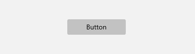

```xaml
<Button x:Name="button1" Content="Button" 
        Click="Button_Click" />
```

Reference: [Button](/uwp/api/Windows.UI.Xaml.Controls.Button) 

Design and how-to: [Buttons control guide](buttons.md) 

### Hyperlink
See Hyperlink button.

### Hyperlink button
A button that appears as marked up text and opens the specified URI in a browser.


```xaml
<HyperlinkButton Content="www.microsoft.com" 
                 NavigateUri="https://www.microsoft.com"/>
```

Reference: [HyperlinkButton](/uwp/api/Windows.UI.Xaml.Controls.HyperlinkButton) 

Design and how-to: [Hyperlinks control guide](hyperlinks.md)

### Repeat button
A button that raises its **Click** event repeatedly from the time it's pressed until it's released. 

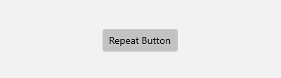 

```xaml
<RepeatButton x:Name="repeatButton1" Content="Repeat Button" 
              Click="RepeatButton_Click" />
```

Reference: [RepeatButton](/uwp/api/Windows.UI.Xaml.Controls.Primitives.RepeatButton) 

Design and how-to: [Buttons control guide](buttons.md) 

## Collection/data controls

### Flip view
A control that presents a collection of items that the user can flip through, one item at a time.

```xaml
<FlipView x:Name="flipView1" SelectionChanged="FlipView_SelectionChanged">
    <Image Source="Assets/Logo.png" />
    <Image Source="Assets/SplashScreen.png" />
    <Image Source="Assets/SmallLogo.png" />
</FlipView>
```

Reference: [FlipView](/uwp/api/Windows.UI.Xaml.Controls.FlipView) 

Design and how-to: [Flip view control guide](flipview.md) 

### Grid view
A control that presents a collection of items in rows and columns that can scroll vertically.

```xaml
<GridView x:Name="gridView1" SelectionChanged="GridView_SelectionChanged">
    <x:String>Item 1</x:String>
    <x:String>Item 2</x:String>
</GridView>
```

Reference: [GridView](/uwp/api/Windows.UI.Xaml.Controls.GridView) 

Design and how-to: [Lists](lists.md) 

Sample code: [ListView sample](https://github.com/Microsoft/Windows-universal-samples/tree/master/Samples/XamlListView)

### Items control
A control that presents a collection of items in a UI specified by a data template. 

```xaml
<ItemsControl/>
```

Reference: [ItemsControl](/uwp/api/Windows.UI.Xaml.Controls.ItemsControl) 

### List view
A control that presents a collection of items in a list that can scroll vertically.

```xaml
<ListView x:Name="listView1" SelectionChanged="ListView_SelectionChanged">
    <x:String>Item 1</x:String>
    <x:String>Item 2</x:String>
</ListView>
```

Reference: [ListView](/uwp/api/Windows.UI.Xaml.Controls.ListView) 

Design and how-to: [Lists](lists.md) 

Sample code: [ListView sample](https://github.com/Microsoft/Windows-universal-samples/tree/master/Samples/XamlListView)

## Date and time controls

### Calendar date picker
A control that lets a user select a date using a drop-down calendar display.

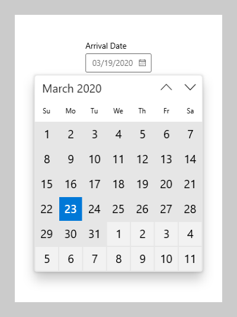

```xaml
<CalendarDatePicker/>
```

Reference: [CalendarDatePicker](/uwp/api/Windows.UI.Xaml.Controls.CalendarDatePicker) 

Design and how-to: [Calendar, date, and time controls](date-and-time.md)
 
### Calendar view
A configurable calendar display that lets a user select single or multiple dates.

```xaml
<CalendarView/>
```

Reference: [CalendarView](/uwp/api/Windows.UI.Xaml.Controls.CalendarView) 

Design and how-to: [Calendar, date, and time controls](date-and-time.md) 

### Date picker
A control that lets a user select a date.


```xaml
<DatePicker Header="Arrival Date"/>
```

Reference: [DatePicker](/uwp/api/Windows.UI.Xaml.Controls.DatePicker) 

Design and how-to: [Calendar, date, and time controls](date-and-time.md)
 
### Time picker
A control that lets a user set a time value.


```xaml
<TimePicker Header="Arrival Time"/>
```

Reference: [TimePicker](/uwp/api/Windows.UI.Xaml.Controls.TimePicker) 

Design and how-to: [Calendar, date, and time controls](date-and-time.md)

## Flyouts

### Context menu
See Menu flyout and Popup menu.

### Flyout
Displays a message that requires user interaction. (Unlike a dialog, a flyout does not create a separate window, and does not block other user interaction.)


```xaml
<Flyout>
    <StackPanel>
        <TextBlock Text="All items will be removed. Do you want to continue?"/>
        <Button Click="DeleteConfirmation_Click" Content="Yes, empty my cart"/>
    </StackPanel>
</Flyout>
```

Reference: [Flyout](/uwp/api/Windows.UI.Xaml.Controls.Flyout) 

Design and how-to: [Flyouts](dialogs-and-flyouts/flyouts.md) 

### Menu flyout
Temporarily displays a list of commands or options related to what the user is currently doing.

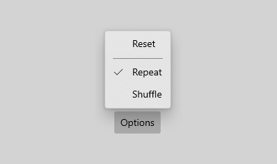 

```xaml
<MenuFlyout>
    <MenuFlyoutItem Text="Reset" Click="Reset_Click"/>
    <MenuFlyoutSeparator/>
    <ToggleMenuFlyoutItem Text="Shuffle" 
                          IsChecked="{Binding IsShuffleEnabled, Mode=TwoWay}"/>
    <ToggleMenuFlyoutItem Text="Repeat" 
                          IsChecked="{Binding IsRepeatEnabled, Mode=TwoWay}"/>
</MenuFlyout>
```

Reference: [MenuFlyout](/uwp/api/Windows.UI.Xaml.Controls.MenuFlyout), [MenuFlyoutItem](/uwp/api/Windows.UI.Xaml.Controls.MenuFlyoutItem), [MenuFlyoutSeparator](/uwp/api/Windows.UI.Xaml.Controls.MenuFlyoutSeparator), [ToggleMenuFlyoutItem](/uwp/api/Windows.UI.Xaml.Controls.ToggleMenuFlyoutItem) 

Design and how-to: [Menus and context menus](menus.md) 

Sample code: [XAML Context Menu sample](https://github.com/Microsoft/Windows-universal-samples/tree/master/Samples/XamlContextMenu)

### Popup menu
A custom menu that presents commands that you specify.

Reference: [PopupMenu](/uwp/api/Windows.UI.Popups.PopupMenu) 

Design and how-to: [Dialogs](dialogs-and-flyouts/dialogs.md) 

### Tooltip
A pop-up window that displays information for an element. 
 
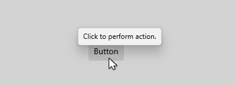

```xaml
<Button Content="Button" Click="Button_Click" 
        ToolTipService.ToolTip="Click to perform action" />
```

Reference: [ToolTip](/uwp/api/Windows.UI.Xaml.Controls.ToolTip), [ToolTipService](/uwp/api/Windows.UI.Xaml.Controls.ToolTipService) 

Design and how-to: Guidelines for tooltips 

## Images

### Image
A control that presents an image.

```xaml
<Image Source="Assets/Logo.png" />
```

Reference: [Image](/uwp/api/Windows.UI.Xaml.Controls.Image) 

Design and how-to: [Image and ImageBrush](images-imagebrushes.md) 

Sample code: [XAML Controls Gallery](/samples/microsoft/xaml-controls-gallery/xaml-controls-gallery/)

## Graphics and ink

### InkCanvas
A control that receives and displays ink strokes.

```xaml
<InkCanvas/>
```

Reference: [InkCanvas](/uwp/api/Windows.UI.Xaml.Controls.InkCanvas) 

### Shapes
Various retained mode graphical objects that can be presented like ellipses, rectangles, lines, Bezier paths, etc.

 
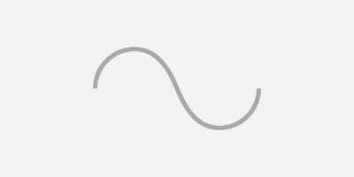 

```xaml
<Ellipse/>
<Path/>
<Rectangle/>
```

Reference: [Shapes](/uwp/api/Windows.UI.Xaml.Shapes.Shape) 

How to: [Drawing shapes](./shapes.md) 

Sample code: [XAML vector-based drawing sample](https://github.com/microsoftarchive/msdn-code-gallery-microsoft/tree/411c271e537727d737a53fa2cbe99eaecac00cc0/Official%20Windows%20Platform%20Sample/Windows%208%20app%20samples/%5BC%23%5D-Windows%208%20app%20samples/C%23/Windows%208%20app%20samples/XAML%20vector-based%20drawing%20sample%20(Windows%208))

## Layout controls

### Border
A container control that draws a border, background, or both, around another object.

 

```xaml
<Border BorderBrush="Blue" BorderThickness="4" 
        Height="108" Width="64" 
        Padding="8" CornerRadius="4">
    <Canvas>
        <Rectangle Fill="Orange"/>
        <Rectangle Fill="Green" Margin="0,44"/>
    </Canvas>
</Border>
```

Reference: [Border](/uwp/api/Windows.UI.Xaml.Controls.Border)

### Canvas
A layout panel that supports the absolute positioning of child elements relative to the top left corner of the canvas.
 
 

```xaml
<Canvas Width="120" Height="120">
    <Rectangle Fill="Red"/>
    <Rectangle Fill="Blue" Canvas.Left="20" Canvas.Top="20"/>
    <Rectangle Fill="Green" Canvas.Left="40" Canvas.Top="40"/>
    <Rectangle Fill="Orange" Canvas.Left="60" Canvas.Top="60"/>
</Canvas>
```

Reference: [Canvas](/uwp/api/Windows.UI.Xaml.Controls.Canvas)
 
### Grid
A layout panel that supports the arranging of child elements in rows and columns.

 

```xaml
<Grid>
    <Grid.RowDefinitions>
        <RowDefinition Height="50"/>
        <RowDefinition Height="50"/>
    </Grid.RowDefinitions>
    <Grid.ColumnDefinitions>
        <ColumnDefinition Width="50"/>
        <ColumnDefinition Width="50"/>
    </Grid.ColumnDefinitions>
    <Rectangle Fill="Red"/>
    <Rectangle Fill="Blue" Grid.Row="1"/>
    <Rectangle Fill="Green" Grid.Column="1"/>
    <Rectangle Fill="Orange" Grid.Row="1" Grid.Column="1"/>
</Grid>
```

Reference: [Grid](/uwp/api/Windows.UI.Xaml.Controls.Grid)
 
### Panning scroll viewer
See Scroll viewer.

### RelativePanel
A panel that lets you position and align child objects in relation to each other or the parent panel.

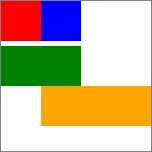 

```xaml
<RelativePanel>
    <TextBox x:Name="textBox1" RelativePanel.AlignLeftWithPanel="True"/>
    <Button Content="Submit" RelativePanel.Below="textBox1"/>
</RelativePanel>
```

Reference: [RelativePanel](/uwp/api/Windows.UI.Xaml.Controls.RelativePanel)

### Scroll bar
See scroll viewer. (ScrollBar is an element of ScrollViewer. You don't typically use it as a stand-alone control.)

Reference: [ScrollBar](/uwp/api/Windows.UI.Xaml.Controls.Primitives.ScrollBar)
 
### Scroll viewer
A container control that lets the user pan and zoom its content.

```xaml
<ScrollViewer ZoomMode="Enabled" MaxZoomFactor="10" 
              HorizontalScrollMode="Enabled" 
              HorizontalScrollBarVisibility="Visible"
              Height="200" Width="200">
    <Image Source="Assets/Logo.png" Height="400" Width="400"/>
</ScrollViewer>
```

Reference: [ScrollViewer](/uwp/api/Windows.UI.Xaml.Controls.ScrollViewer)

Design and how-to: [Scroll and panning controls guide](scroll-controls.md) 

Sample code: [XAML scrolling, panning and zooming sample](https://github.com/microsoftarchive/msdn-code-gallery-microsoft/tree/411c271e537727d737a53fa2cbe99eaecac00cc0/Official%20Windows%20Platform%20Sample/Windows%208%20app%20samples/%5BC%23%5D-Windows%208%20app%20samples/C%23/Windows%208%20app%20samples/XAML%20scrolling%2C%20panning%2C%20and%20zooming%20sample%20(Windows%208))

### Stack panel
A layout panel that arranges child elements into a single line that can be oriented horizontally or vertically.

 

```xaml
<StackPanel>
    <Rectangle Fill="Red"/>
    <Rectangle Fill="Blue"/>
    <Rectangle Fill="Green"/>
    <Rectangle Fill="Orange"/>
</StackPanel>
```

Reference: [StackPanel](/uwp/api/Windows.UI.Xaml.Controls.StackPanel)
 
### VariableSizedWrapGrid
A layout panel that supports the arranging of child elements in rows and columns. Each child element can span multiple rows and columns.

 

```xaml
<VariableSizedWrapGrid MaximumRowsOrColumns="3" ItemHeight="44" ItemWidth="44">
    <Rectangle Fill="Red"/>
    <Rectangle Fill="Blue" Height="80" 
               VariableSizedWrapGrid.RowSpan="2"/>
    <Rectangle Fill="Green" Width="80" 
               VariableSizedWrapGrid.ColumnSpan="2"/>
    <Rectangle Fill="Orange" Height="80" Width="80" 
               VariableSizedWrapGrid.RowSpan="2" 
               VariableSizedWrapGrid.ColumnSpan="2"/>
</VariableSizedWrapGrid>
```

Reference: [VariableSizedWrapGrid](/uwp/api/Windows.UI.Xaml.Controls.VariableSizedWrapGrid)

### Viewbox
A container control that scales its content to a specified size.

 

```xaml
<Viewbox MaxWidth="25" MaxHeight="25">
    <Image Source="Assets/Logo.png"/>
</Viewbox>
<Viewbox MaxWidth="75" MaxHeight="75">
    <Image Source="Assets/Logo.png"/>
</Viewbox>
<Viewbox MaxWidth="150" MaxHeight="150">
    <Image Source="Assets/Logo.png"/>
</Viewbox>
```

Reference: [Viewbox](/uwp/api/Windows.UI.Xaml.Controls.Viewbox)
 
### Zooming scroll viewer
See Scroll viewer.

## Media controls

### Audio
See Media element.

### Media element
A control that plays audio and video content.

```xaml
<MediaElement x:Name="myMediaElement"/>
```

Reference: [MediaElement](/uwp/api/Windows.UI.Xaml.Controls.MediaElement) 

Design and how-to: [Media element control guide](media-playback.md)

### MediaTransportControls
A control that provides playback controls for a MediaElement.

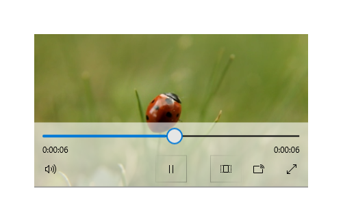 

```xaml
<MediaTransportControls MediaElement="myMediaElement"/>
```

Reference: [MediaTransportControls](/uwp/api/Windows.UI.Xaml.Controls.MediaTransportControls) 

Design and how-to: [Media element control guide](media-playback.md) 

Sample code: [Media Transport Controls sample](https://github.com/Microsoft/Windows-universal-samples/tree/master/Samples/XamlCustomMediaTransportControls)

### Video
See Media element.

## Navigation

### NavigationView

An adaptable container and flexible navigation model that implements the left navigation pane, top navigation and tabs pattern.

Reference: [NavigationView](/uwp/api/windows.ui.xaml.controls.navigationview)

Design and how-to: [NavigationView control guide](navigationview.md)

### SplitView

A container control with two views; one view for the main content and another view that is typically used for a navigation menu.

 

```xaml
<SplitView>
    <SplitView.Pane>
        <!-- Menu content -->
    </SplitView.Pane>
    <SplitView.Content>
        <!-- Main content -->
    </SplitView.Content>
</SplitView>
```

Reference: [SplitView](/uwp/api/Windows.UI.Xaml.Controls.SplitView) 

Design and how-to: [Split view control guide](split-view.md)

### Web view

A container control that hosts web content.

```xaml
<WebView x:Name="webView1" Source="https://developer.microsoft.com" 
         Height="400" Width="800"/>
```

Reference: [WebView](/uwp/api/Windows.UI.Xaml.Controls.WebView) 

Design and how-to: Guidelines for Web views 

Sample code: [XAML WebView control sample](https://github.com/microsoftarchive/msdn-code-gallery-microsoft/tree/411c271e537727d737a53fa2cbe99eaecac00cc0/Official%20Windows%20Platform%20Sample/Windows%208%20app%20samples/%5BC%23%5D-Windows%208%20app%20samples/C%23/Windows%208%20app%20samples/XAML%20WebView%20control%20sample%20(Windows%208))

### Semantic zoom

A container control that lets the user zoom between two views of a collection of items.

```xaml
<SemanticZoom>
    <ZoomedInView>
        <GridView></GridView>
    </ZoomedInView>
    <ZoomedOutView>
        <GridView></GridView>
    </ZoomedOutView>
</SemanticZoom>
```

Reference: [SemanticZoom](/uwp/api/Windows.UI.Xaml.Controls.SemanticZoom) 

Design and how-to: [Semantic zoom control guide](semantic-zoom.md)

Sample code: [XAML GridView grouping and SemanticZoom sample](https://github.com/microsoftarchive/msdn-code-gallery-microsoft/tree/411c271e537727d737a53fa2cbe99eaecac00cc0/Official%20Windows%20Platform%20Sample/Windows%208%20app%20samples/%5BC%23%5D-Windows%208%20app%20samples/C%23/Windows%208%20app%20samples/XAML%20GridView%20grouping%20and%20SemanticZoom%20sample%20(Windows%208))

## Progress controls

### Progress bar
A control that indicates progress by displaying a bar.

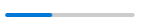

A progress bar that shows a specific value.

```xaml
<ProgressBar x:Name="progressBar1" Value="50" Width="100"/>
```


A progress bar that shows indeterminate progress.

```xaml
<ProgressBar x:Name="indeterminateProgressBar1" IsIndeterminate="True" Width="100"/>
```

Reference: [ProgressBar](/uwp/api/Windows.UI.Xaml.Controls.ProgressBar) 

Design and how-to: [Progress controls guide](progress-controls.md) 

### Progress ring
A control that indicates indeterminate progress by displaying a ring. 

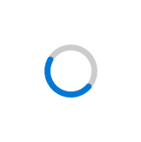 

```xaml
<ProgressRing x:Name="progressRing1" IsActive="True"/>
```

Reference: [ProgressRing](/uwp/api/Windows.UI.Xaml.Controls.ProgressRing) 

Design and how-to: [Progress controls guide](progress-controls.md) 

## Text controls

### Auto suggest box
A text input box that provides suggested text as the user types.

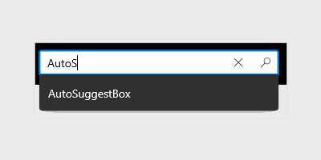 

Reference: [AutoSuggestBox](/uwp/api/Windows.UI.Xaml.Controls.AutoSuggestBox)

Design and how-to: [Text controls](text-controls.md), [Auto suggest box control guide](auto-suggest-box.md)

Sample code: [AutoSuggestBox migration sample](https://github.com/Microsoft/Windows-universal-samples/tree/master/Samples/XamlAutoSuggestBox)

### Multi-line text box
See Text box.

### Password box
A control for entering passwords.

 

```xaml
<PasswordBox x:Name="passwordBox1" 
             PasswordChanged="PasswordBox_PasswordChanged" />
```

Reference: [PasswordBox](/uwp/api/Windows.UI.Xaml.Controls.PasswordBox) 

Design and how-to: [Text controls](text-controls.md), [Password box control guide](password-box.md) 

Sample code: [XAML text display sample](https://github.com/microsoftarchive/msdn-code-gallery-microsoft/tree/411c271e537727d737a53fa2cbe99eaecac00cc0/Official%20Windows%20Platform%20Sample/Windows%208%20app%20samples/%5BC%23%5D-Windows%208%20app%20samples/C%23/Windows%208%20app%20samples/XAML%20text%20display%20sample%20(Windows%208)), [XAML text editing sample](https://github.com/microsoftarchive/msdn-code-gallery-microsoft/tree/411c271e537727d737a53fa2cbe99eaecac00cc0/Official%20Windows%20Platform%20Sample/Windows%208%20app%20samples/%5BC%23%5D-Windows%208%20app%20samples/C%23/Windows%208%20app%20samples/XAML%20text%20editing%20sample%20(Windows%208))

### Rich edit box
A control that lets a user edit rich text documents with content like formatted text, hyperlinks, and images.

```xaml
<RichEditBox />
```

Reference: [RichEditBox](/uwp/api/Windows.UI.Xaml.Controls.RichEditBox) 

Design and how-to: [Text controls](text-controls.md), [Rich edit box control guide](rich-edit-box.md)

Sample code: [XAML text sample](https://github.com/microsoftarchive/msdn-code-gallery-microsoft/tree/411c271e537727d737a53fa2cbe99eaecac00cc0/Official%20Windows%20Platform%20Sample/Windows%208%20app%20samples/%5BC%23%5D-Windows%208%20app%20samples/C%23/Windows%208%20app%20samples/XAML%20text%20display%20sample%20(Windows%208))

### Search box
See Auto suggest box.

### Single-line text box
See Text box.

### Static text/paragraph
See Text block.

### Text block
A control that displays text.

 

```xaml
<TextBlock x:Name="textBlock1" Text="I am a TextBlock"/>
```

Reference: [TextBlock](/uwp/api/Windows.UI.Xaml.Controls.TextBlock), [RichTextBlock](/uwp/api/Windows.UI.Xaml.Controls.RichTextBlock) 

Design and how-to: [Text controls](text-controls.md), [Text block control guide](text-block.md), [Rich text block control guide](rich-text-block.md)

Sample code: [XAML text sample](https://code.msdn.microsoft.com/windowsapps/XAML-text-display-sample-2593ba0a)

### Text box
A single-line or multi-line plain text field.

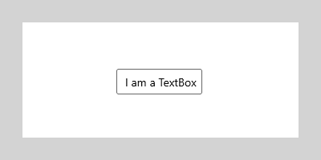

```xaml
<TextBox x:Name="textBox1" Text="I am a Text Box."
         TextChanged="TextBox_TextChanged"/>
```

Reference: [TextBox](/uwp/api/Windows.UI.Xaml.Controls.TextBox) 

Design and how-to: [Text controls](text-controls.md), [Text box control guide](text-box.md) 

Sample code: [XAML text sample](https://code.msdn.microsoft.com/windowsapps/XAML-text-display-sample-2593ba0a)

## Selection controls

### Check box
A control that a user can select or clear.

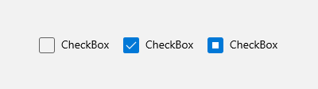

```xaml
<CheckBox x:Name="checkbox1" Content="CheckBox" 
          Checked="CheckBox_Checked"/>
```

Reference: [CheckBox](/uwp/api/Windows.UI.Xaml.Controls.CheckBox) 

Design and how-to: [Check box control guide](checkbox.md) 

### Combo box
A drop-down list of items a user can select from.

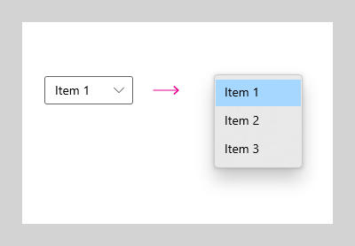 

```xaml
<ComboBox x:Name="comboBox1" Width="100"
          SelectionChanged="ComboBox_SelectionChanged">
    <x:String>Item 1</x:String>
    <x:String>Item 2</x:String>
    <x:String>Item 3</x:String>
</ComboBox>
```

Reference: [ComboBox](/uwp/api/Windows.UI.Xaml.Controls.ComboBox) 

Design and how-to: [Lists](lists.md) 

### List box
A control that presents an inline list of items that the user can select from. 

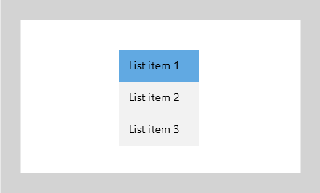

```xaml
<ListBox x:Name="listBox1" Width="100"
         SelectionChanged="ListBox_SelectionChanged">
    <x:String>List item 1</x:String>
    <x:String>List item 2</x:String>
    <x:String>List item 3</x:String>
</ListBox>
```

Reference: [ListBox](/uwp/api/Windows.UI.Xaml.Controls.ListBox) 

Design and how-to: [Lists](lists.md) 

### Radio button
A control that allows a user to select a single option from a group of options. When radio buttons are grouped together, they are mutually exclusive.

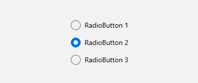

```xaml
<RadioButton x:Name="radioButton1" Content="RadioButton 1" GroupName="Group1" 
             Checked="RadioButton_Checked"/>
<RadioButton x:Name="radioButton2" Content="RadioButton 2" GroupName="Group1" 
             Checked="RadioButton_Checked" IsChecked="True"/>
<RadioButton x:Name="radioButton3" Content="RadioButton 3" GroupName="Group1" 
             Checked="RadioButton_Checked"/>
```

Reference: [RadioButton](/uwp/api/Windows.UI.Xaml.Controls.RadioButton) 

Design and how-to: [Radio button control guide](radio-button.md)
 
### Slider
A control that lets the user select from a range of values by moving a Thumb control along a track.

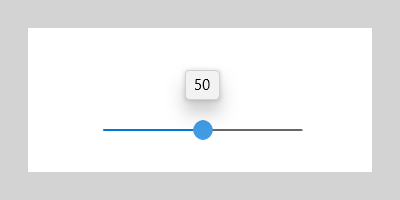

```xaml
<Slider x:Name="slider1" Width="100" ValueChanged="Slider_ValueChanged" />
```

Reference: [Slider](/uwp/api/Windows.UI.Xaml.Controls.Slider) 

Design and how-to: [Slider control guide](slider.md) 

### Toggle button
A button that can be toggled between 2 states.

```xaml
<ToggleButton x:Name="toggleButton1" Content="Button" 
              Checked="ToggleButton_Checked"/>
```

Reference: [ToggleButton](/uwp/api/Windows.UI.Xaml.Controls.Primitives.ToggleButton)

Design and how-to: [Toggle control guide](toggles.md) 

### Toggle switch
A switch that can be toggled between 2 states.

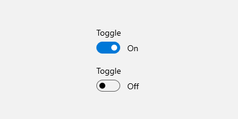 

```xaml
<ToggleSwitch x:Name="toggleSwitch1" Header="ToggleSwitch" 
              OnContent="On" OffContent="Off" 
              Toggled="ToggleSwitch_Toggled"/>
```

Reference: [ToggleSwitch](/uwp/api/Windows.UI.Xaml.Controls.ToggleSwitch) 

Design and how-to: [Toggle control guide](toggles.md)