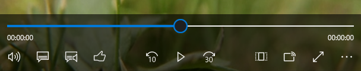

# Create custom transport controls


MediaPlayerElement has customizable XAML transport controls to manage control of audio and video content within a Universal Windows Platform (UWP) app. Here, we demonstrate how to customize the MediaTransportControls template. We’ll show you how to work with the overflow menu, add a custom button and modify the slider.

> **Important APIs**: [MediaPlayerElement](https://msdn.microsoft.com/library/windows/apps/windows.ui.xaml.controls.mediaplayerelement.aspx), [MediaPlayerElement.AreTransportControlsEnabled](https://msdn.microsoft.com/library/windows/apps/windows.ui.xaml.controls.mediaplayerelement.aretransportcontrolsenabled.aspx), [MediaTransportControls](https://msdn.microsoft.com/library/windows/apps/dn278677)

Before starting, you should be familiar with the MediaPlayerElement and the MediaTransportControls classes. For more info, see the MediaPlayerElement control guide.

> [!TIP]
> The examples in this topic are based on the [Media Transport Controls sample](http://go.microsoft.com/fwlink/p/?LinkId=620023). You can download the sample to view and run the completed code.

> [!NOTE]
> **MediaPlayerElement** is only available in Windows 10, version 1607 and up. If you are developing an app for an earlier version of Windows 10 you will need to use [**MediaElement**](https://msdn.microsoft.com/library/windows/apps/br242926) instead. All of the examples on this page work with **MediaElement** as well.

## When should you customize the template?

**MediaPlayerElement** has built-in transport controls that are designed to work well without modification in most video and audio playback apps. They’re provided by the [**MediaTransportControls**](https://msdn.microsoft.com/library/windows/apps/xaml/windows.ui.xaml.controls.mediatransportcontrols.aspx) class and include buttons to play, stop, and navigate media, adjust volume, toggle full screen, cast to a second device, enable captions, switch audio tracks, and adjust the playback rate. MediaTransportControls has properties that let you control whether each button is shown and enabled. You can also set the [**IsCompact**](https://msdn.microsoft.com/library/windows/apps/xaml/windows.ui.xaml.controls.mediatransportcontrols.iscompact.aspx) property to specify whether the controls are shown in one row or two.

However, there may be scenarios where you need to further customize the look of the control or change its behavior. Here are some examples:
- Change the icons, slider behavior, and colors.
- Move less commonly used command buttons into an overflow menu.
- Change the order in which commands drop out when the control is resized.
- Provide a command button that’s not in the default set.

> [!NOTE]
> The buttons visible on screen will drop out of the built-in transport controls in a predefined order if there is not enough room on screen. To change this ordering or put commands that don't fit into an overflow menu, you will need to customize the controls.

You can customize the appearance of the control by modifying the default template. To modify the control's behavior or add new commands, you can create a custom control that's derived from MediaTransportControls.

> [!TIP]
> Customizable control templates are a powerful feature of the XAML platform, but there are also consequences that you should take into consideration. When you customize a template, it becomes a static part of your app and therefore will not receive any platform updates that are made to the template by Microsoft. If template updates are made by Microsoft, you should take the new template and re-modify it in order to get the benefits of the updated template.

## Template structure

The [**ControlTemplate**](https://msdn.microsoft.com/library/windows/apps/xaml/windows.ui.xaml.controls.controltemplate.aspx) is part of the default style. The transport control's default style is shown in the [**MediaTransportControls**](https://msdn.microsoft.com/library/windows/apps/xaml/windows.ui.xaml.controls.mediatransportcontrols.aspx) class reference page. You can copy this default style into your project to modify it. The ControlTemplate is divided into sections similar to other XAML control templates.
- The first section of the template contains the [**Style**](https://msdn.microsoft.com/library/windows/apps/xaml/windows.ui.xaml.style.aspx) definitions for the various components of the MediaTransportControls.
- The second section defines the various visual states that are used by the MediaTransportControls.
- The third section contains the [**Grid**](https://msdn.microsoft.com/library/windows/apps/xaml/windows.ui.xaml.controls.grid.aspx) that holds that various MediaTransportControls elements together and defines how the components are laid out.

> [!NOTE]
> For more info about modifying templates, see [Control templates](). You can use a text editor or similar editors in your IDE to open the XAML files in \(*Program Files*)\Windows Kits\10\DesignTime\CommonConfiguration\Neutral\UAP\\(*SDK version*)\Generic. The default style and template for each control is defined in the **generic.xaml** file. You can find the MediaTransportControls template in generic.xaml by searching for "MediaTransportControls".

In the following sections, you learn how to customize several of the main elements of the transport controls:
- [**Slider**](https://msdn.microsoft.com/library/windows/apps/xaml/windows.ui.xaml.controls.slider.aspx): allows a user to scrub through their media and also displays progress
- [**CommandBar**](https://msdn.microsoft.com/library/windows/apps/xaml/windows.ui.xaml.controls.commandbar.aspx): contains all of the buttons.
For more info, see the Anatomy section of the MediaTransportControls reference topic.

## Customize the transport controls

If you want to modify only the appearance of the MediaTransportControls, you can create a copy of the default control style and template, and modify that. However, if you also want to add to or modify the functionality of the control, you need to create a new class that derives from MediaTransportControls.

### Re-template the control

**To customize the MediaTransportControls default style and template**
1. Copy the default style from MediaTransportControls styles and templates into a ResourceDictionary in your project.
2. Give the Style an x:Key value to identify it, like this.

```xaml
<Style TargetType="MediaTransportControls" x:Key="myTransportControlsStyle">
    <!-- Style content ... -->
</Style>
```

3. Add a MediaPlayerElement with MediaTransportControls to your UI.
4. Set the Style property of the MediaTransportControls element to your custom Style resource, as shown here.

```xaml
<MediaPlayerElement AreTransportControlsEnabled="True">
    <MediaPlayerElement.TransportControls>
        <MediaTransportControls Style="{StaticResource myTransportControlsStyle}"/>
    </MediaPlayerElement.TransportControls>
</MediaPlayerElement>
```

For more info about modifying styles and templates, see [Styling controls]() and [Control templates]().

### Create a derived control

To add to or modify the functionality of the transport controls, you must create a new class that's derived from MediaTransportControls. A derived class called `CustomMediaTransportControls` is shown in the [Media Transport Controls sample](http://go.microsoft.com/fwlink/p/?LinkId=620023) and the remaining examples on this page.

**To create a new class derived from MediaTransportControls**
1. Add a new class file to your project.
    - In Visual Studio, select Project > Add Class. The Add New Item dialog opens.
    - In the Add New Item dialog, enter a name for the class file, then click Add. (In the Media Transport Controls sample, the class is named `CustomMediaTransportControls`.)
2. Modify the class code to derive from the MediaTransportControls class.

```csharp
public sealed class CustomMediaTransportControls : MediaTransportControls
{
}
```

3. Copy the default style for [**MediaTransportControls**](https://msdn.microsoft.com/library/windows/apps/xaml/windows.ui.xaml.controls.mediatransportcontrols.aspx) into a [ResourceDictionary](https://msdn.microsoft.com/library/windows/apps/xaml/windows.ui.xaml.resourcedictionary.aspx) in your project. This is the style and template you modify.
(In the Media Transport Controls sample, a new folder called "Themes" is created, and a ResourceDictionary file called generic.xaml is added to it.)
4. Change the [**TargetType**](https://msdn.microsoft.com/library/windows/apps/xaml/windows.ui.xaml.style.targettype.aspx) of the style to the new custom control type. (In the sample, the TargetType is changed to `local:CustomMediaTransportControls`.)

```xaml
xmlns:local="using:CustomMediaTransportControls">
...
<Style TargetType="local:CustomMediaTransportControls">
```

5. Set the [**DefaultStyleKey**](https://msdn.microsoft.com/library/windows/apps/xaml/windows.ui.xaml.controls.control.defaultstylekey.aspx) of your custom class. This tells your custom class to use a Style with a TargetType of `local:CustomMediaTransportControls`.

```csharp
public sealed class CustomMediaTransportControls : MediaTransportControls
{
    public CustomMediaTransportControls()
    {
        this.DefaultStyleKey = typeof(CustomMediaTransportControls);
    }
}
```

6. Add a [**MediaPlayerElement**](https://msdn.microsoft.com/library/windows/apps/windows.ui.xaml.controls.mediaplayerelement.aspx) to your XAML markup and add the custom transport controls to it. One thing to note is that the APIs to hide, show, disable, and enable the default buttons still work with a customized template.

```xaml
<MediaPlayerElement Name="MediaPlayerElement1" AreTransportControlsEnabled="True" Source="video.mp4">
    <MediaPlayerElement.TransportControls>
        <local:CustomMediaTransportControls x:Name="customMTC"
                                            IsFastForwardButtonVisible="True"
                                            IsFastForwardEnabled="True"
                                            IsFastRewindButtonVisible="True"
                                            IsFastRewindEnabled="True"
                                            IsPlaybackRateButtonVisible="True"
                                            IsPlaybackRateEnabled="True"
                                            IsCompact="False">
        </local:CustomMediaTransportControls>
    </MediaPlayerElement.TransportControls>
</MediaPlayerElement>
```

You can now modify the control style and template to update the look of your custom control, and the control code to update its behavior.

### Working with the overflow menu

You can move MediaTransportControls command buttons into an overflow menu, so that less commonly used commands are hidden until the user needs them.

In the MediaTransportControls template, the command buttons are contained in a [**CommandBar**](https://msdn.microsoft.com/library/windows/apps/xaml/windows.ui.xaml.controls.commandbar.aspx) element. The command bar has the concept of primary and secondary commands. The primary commands are the buttons that appear in the control by default and are always visible (unless you disable the button, hide the button or there is not enough room). The secondary commands are shown in an overflow menu that appears when a user clicks the ellipsis (…) button. For more info, see the [App bars and command bars](app-bars.md) article.

To move an element from the command bar primary commands to the overflow menu, you need to edit the XAML control template.

**To move a command to the overflow menu:**
1. In the control template, find the CommandBar element named `MediaControlsCommandBar`.
2. Add a [**SecondaryCommands**](https://msdn.microsoft.com/library/windows/apps/xaml/windows.ui.xaml.controls.commandbar.secondarycommands.aspx) section to the XAML for the CommandBar. Put it after the closing tag for the [**PrimaryCommands**](https://msdn.microsoft.com/library/windows/apps/xaml/windows.ui.xaml.controls.commandbar.primarycommands.aspx).

```xaml
<CommandBar x:Name="MediaControlsCommandBar" ... >  
  <CommandBar.PrimaryCommands>
...
    <AppBarButton x:Name='PlaybackRateButton'
                    Style='{StaticResource AppBarButtonStyle}'
                    MediaTransportControlsHelper.DropoutOrder='4'
                    Visibility='Collapsed'>
      <AppBarButton.Icon>
        <FontIcon Glyph="&#xEC57;"/>
      </AppBarButton.Icon>
    </AppBarButton>
...
  </CommandBar.PrimaryCommands>
<!-- Add secondary commands (overflow menu) here -->
  <CommandBar.SecondaryCommands>
    ...
  </CommandBar.SecondaryCommands>
</CommandBar>
```

3. To populate the menu with commands, cut and paste the XAML for the desired [**AppBarButton**](https://msdn.microsoft.com/library/windows/apps/xaml/windows.ui.xaml.controls.appbarbutton.aspx) objects from the PrimaryCommands to the SecondaryCommands. In this example, we move the `PlaybackRateButton` to the overflow menu.

4. Add a label to the button and remove the styling information, as shown here.
Because the overflow menu is comprised of text buttons, you must add a text label to the button and also remove the style that sets the height and width of the button. Otherwise, it won't appear correctly in the overflow menu.

```xaml
<CommandBar.SecondaryCommands>
    <AppBarButton x:Name='PlaybackRateButton'
                  Label='Playback Rate'>
    </AppBarButton>
</CommandBar.SecondaryCommands>
```

> [!IMPORTANT]
> You must still make the button visible and enable it in order to use it in the overflow menu. In this example, the PlaybackRateButton element isn't visible in the overflow menu unless the IsPlaybackRateButtonVisible property is true. It's not enabled unless the IsPlaybackRateEnabled property is true. Setting these properties is shown in the previous section.

### Adding a custom button

One reason you might want to customize MediaTransportControls is to add a custom command to the control. Whether you add it as a primary command or a secondary command, the procedure for creating the command button and modifying its behavior is the same. In the [Media Transport Controls sample](http://go.microsoft.com/fwlink/p/?LinkId=620023), a "rating" button is added to the primary commands.

**To add a custom command button**
1. Create an AppBarButton object and add it to the CommandBar in the control template.

```xaml
<AppBarButton x:Name="LikeButton"
              Icon="Like"
              Style="{StaticResource AppBarButtonStyle}"
              MediaTransportControlsHelper.DropoutOrder="3"
              VerticalAlignment="Center" />
```

    You must add it to the CommandBar in the appropriate location. (For more info, see the Working with the overflow menu section.) How it's positioned in the UI is determined by where the button is in the markup. For example, if you want this button to appear as the last element in the primary commands, add it at the very end of the primary commands list.

    You can also customize the icon for the button. For more info, see the [**AppBarButton**](https://msdn.microsoft.com/library/windows/apps/xaml/windows.ui.xaml.controls.appbarbutton.aspx) reference.

2. In the [**OnApplyTemplate**](https://msdn.microsoft.com/library/windows/apps/xaml/windows.ui.xaml.frameworkelement.onapplytemplate.aspx) override, get the button from the template and register a handler for its [**Click**](https://msdn.microsoft.com/library/windows/apps/xaml/windows.ui.xaml.controls.primitives.buttonbase.click.aspx) event. This code goes in the `CustomMediaTransportControls` class.

```csharp
public sealed class CustomMediaTransportControls :  MediaTransportControls
{
    // ...

    protected override void OnApplyTemplate()
    {
        // Find the custom button and create an event handler for its Click event.
        var likeButton = GetTemplateChild("LikeButton") as Button;
        likeButton.Click += LikeButton_Click;
        base.OnApplyTemplate();
    }

    //...
}
```

3. Add code to the Click event handler to perform the action that occurs when the button is clicked.
Here's the complete code for the class.

```csharp
public sealed class CustomMediaTransportControls : MediaTransportControls
{
    public event EventHandler< EventArgs> Liked;

    public CustomMediaTransportControls()
    {
        this.DefaultStyleKey = typeof(CustomMediaTransportControls);
    }

    protected override void OnApplyTemplate()
    {
        // Find the custom button and create an event handler for its Click event.
        var likeButton = GetTemplateChild("LikeButton") as Button;
        likeButton.Click += LikeButton_Click;
        base.OnApplyTemplate();
    }

    private void LikeButton_Click(object sender, RoutedEventArgs e)
    {
        // Raise an event on the custom control when 'like' is clicked.
        var handler = Liked;
        if (handler != null)
        {
            handler(this, EventArgs.Empty);
        }
    }
}
```

**Custom media transport controls with a "Like" button added**


### Modifying the slider

The "seek" control of the MediaTransportControls is provided by a [**Slider**](https://msdn.microsoft.com/library/windows/apps/xaml/windows.ui.xaml.controls.slider.aspx) element. One way you can customize it is to change the granularity of the seek behavior.

The default seek slider is divided into 100 parts, so the seek behavior is limited to that many sections. You can change the granularity of the seek slider by getting the Slider from the XAML visual tree in your [**MediaOpened**](https://msdn.microsoft.com/library/windows/apps/windows.media.playback.mediaplayer.mediaopened.aspx) event handler on [**MediaPlayerElement.MediaPlayer**](https://msdn.microsoft.com/library/windows/apps/windows.ui.xaml.controls.mediaplayerelement.aspx). This example shows how to use [**VisualTreeHelper**](https://msdn.microsoft.com/library/windows/apps/xaml/windows.ui.xaml.media.visualtreehelper.aspx) to get a reference to the Slider, then change the default step frequency of the slider from 1% to 0.1% (1000 steps) if the media is longer than 120 minutes. The MediaPlayerElement is named `MediaPlayerElement1`.

```csharp
protected override void OnNavigatedTo(NavigationEventArgs e)
{
  MediaPlayerElement1.MediaPlayer.MediaOpened += MediaPlayerElement_MediaPlayer_MediaOpened;
  base.OnNavigatedTo(e);
}

private void MediaPlayerElement_MediaPlayer_MediaOpened(object sender, RoutedEventArgs e)
{
  FrameworkElement transportControlsTemplateRoot = (FrameworkElement)VisualTreeHelper.GetChild(MediaPlayerElement1.TransportControls, 0);
  Slider sliderControl = (Slider)transportControlsTemplateRoot.FindName("ProgressSlider");
  if (sliderControl != null && MediaPlayerElement1.NaturalDuration.TimeSpan.TotalMinutes > 120)
  {
    // Default is 1%. Change to 0.1% for more granular seeking.
    sliderControl.StepFrequency = 0.1;
  }
}
```
## Related articles

- [Media playback](media-playback.md)
