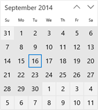
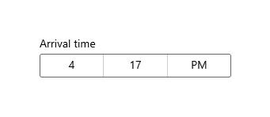
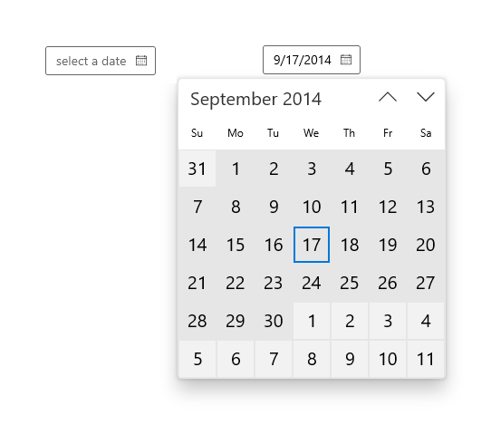

# Calendar, date, and time controls

 

Date and time controls give you standard, localized ways to let a user view and set date and time values in your app. This article provides design guidelines and helps you pick the right control.

> **Important APIs**: [CalendarView class](/uwp/api/Windows.UI.Xaml.Controls.CalendarView), [CalendarDatePicker class](/uwp/api/Windows.UI.Xaml.Controls.CalendarDatePicker), [DatePicker class](/uwp/api/Windows.UI.Xaml.Controls.DatePicker), [TimePicker class](/uwp/api/Windows.UI.Xaml.Controls.TimePicker)

<table>
<th align="left">XAML Controls Gallery<th>
<tr>
<td></img></td>
<td>
    
If you have the <strong style="font-weight: semi-bold">XAML Controls Gallery</strong> app installed, click here to <a href="xamlcontrolsgallery:/category/DataInput">open the app and see these controls in action</a>.

    <ul>
    <li><a href="https://www.microsoft.com/store/productId/9MSVH128X2ZT">Get the XAML Controls Gallery app (Microsoft Store)</a></li>
    <li><a href="https://github.com/Microsoft/Xaml-Controls-Gallery">Get the source code (GitHub)</a></li>
    </ul>
</td>
</tr>
</table>

## Which date or time control should you use?

There are four date and time controls to choose from; the control you use depends on your scenario. Use this info to pick the right control to use in your app.

&nbsp;|&nbsp;|&nbsp;                                                                                                                      
--------------------|-------|-------------------------------------------------------------------------------------------------------------------------------
Calendar view       ||Use to pick a single date or a range of dates from an always visible calendar.                   
Calendar date picker||Use to pick a single date from a contextual calendar. 
Date picker         ||Use to pick a single known date when contextual info isn't important.
Time picker         ||Use to pick a single time value.                                        

<!-- This table seems redundant, not sure it's needed.-->

### Calendar view

**CalendarView** lets a user view and interact with a calendar that they can navigate by month, year, or decade. A user can select a single date or a range of dates. It doesn't have a picker surface and the calendar is always visible.

The calendar view is made up of 3 separate views: the month view, year view, and decade view. By default, it starts with the month view open, but you can specify any view as the startup view.

- If you need to let a user select multiple dates, you must use a **CalendarView**.
- If you need to let a user pick only a single date and don't need a calendar to be always visible, consider using a **CalendarDatePicker** or **DatePicker** control.

### Calendar date picker

**CalendarDatePicker** is a drop down control that's optimized for picking a single date from a calendar view where contextual information like the day of the week or fullness of the calendar is important. You can modify the calendar to provide additional context or to limit available dates.

The entry point displays placeholder text if a date has not been set; otherwise, it displays the chosen date. When the user selects the entry point, a calendar view expands for the user to make a date selection. The calendar view overlays other UI; it doesn't push other UI out of the way.

- Use a calendar date picker for things like choosing an appointment or departure date. 

### Date picker

The **DatePicker** control provides a standardized way to choose a specific date. 

The entry point displays the chosen date, and when the user selects the entry point, a picker surface expands vertically from the middle for the user to make a selection. The date picker overlays other UI; it doesn't push other UI out of the way.

- Use a date picker to let a user pick a known date, such as a date of birth, where the context of the calendar is not important.

### Time picker

The **TimePicker** is used to select a single time value for things like appointments or a departure time. It's a static display that is set by the user or in code, but it doesn't update to display the current time.

The entry point displays the chosen time, and when the user selects the entry point, a picker surface expands vertically from the middle for the user to make a selection. The time picker overlays other UI; it doesn't push other UI out of the way.

- Use a time picker to let a user pick a single time value.

## Create a date or time control

See these articles for info and examples specific to each date and time control.

- [Calendar view](calendar-view.md)
- [Calendar date picker](calendar-date-picker.md)
- [Date picker](date-picker.md)
- [Time Picker](time-picker.md)

### Globalization

The XAML date controls support each of the calendar systems supported by Windows. These calendars are specified in the [Windows.Globalization.CalendarIdentifiers](/uwp/api/Windows.Globalization.CalendarIdentifiers) class. Each control uses the correct calendar for your app's default language, or you can set the **CalendarIdentifier** property to use a specific calendar system.

The time picker control supports each of the clock systems specified in the [Windows.Globalization.ClockIdentifiers](/uwp/api/Windows.Globalization.ClockIdentifiers) class. You can set the [ClockIdentifier](/uwp/api/windows.ui.xaml.controls.timepicker.clockidentifier) property to use either a 12-hour clock or 24-hour clock. The type of the property is String, but you must use values that correspond to the static string properties of the ClockIdentifiers class. These are: TwelveHour (the string "12HourClock")and TwentyFourHour (the string "24HourClock"). "12HourClock" is the default value.

### DateTime and Calendar values

The date objects used in the XAML date and time controls have a different representation depending on your programming language.

- C# and Visual Basic use the [System.DateTimeOffset](/dotnet/api/system.datetimeoffset) structure that is part of .NET. 
- C++/CX uses the [Windows::Foundation::DateTime](/windows/desktop/api/windows.foundation/ns-windows-foundation-datetime) structure. 

A related concept is the Calendar class, which influences how dates are interpreted in context. All Windows Runtime apps can use the [Windows.Globalization.Calendar](/uwp/api/Windows.Globalization.Calendar) class. C# and Visual Basic apps can alternatively use the [System.Globalization.Calendar](/dotnet/api/system.globalization.calendar) class, which has very similar functionality. (Windows Runtime apps can use the base .NET Calendar class but not the specific implementations; for example, GregorianCalendar.)

.NET also supports a type named [DateTime](/dotnet/api/system.datetime), which is implicitly convertible to a [DateTimeOffset](/dotnet/api/system.datetimeoffset). So you might see a "DateTime" type being used in .NET code that's used to set values that are really DateTimeOffset. For more info on the difference between DateTime and DateTimeOffset, see Remarks in the [DateTimeOffset](/dotnet/api/system.datetimeoffset) class.

> [!NOTE]
> Properties that take date objects can't be set as a XAML attribute string, because the Windows Runtime XAML parser doesn't have a conversion logic for converting strings to dates as DateTime/DateTimeOffset objects. You typically set these values in code. Another possible technique is to define a date that's available as a data object or in the data context, then set the property as a XAML attribute that references a [\{Binding\} markup extension](../../xaml-platform/binding-markup-extension.md) expression that can access the date as data.

## Get the sample code

- [XAML UI basics sample](https://github.com/Microsoft/Windows-universal-samples/tree/master/Samples/XamlUIBasics)
- [Calendar sample](https://github.com/Microsoft/Windows-universal-samples/tree/master/Samples/Calendar)
- [Date and time formatting sample](https://github.com/microsoft/Windows-universal-samples/tree/master/Samples/DateTimeFormatting)

## Related topics

### For developers (XAML)

- [CalendarView class](/uwp/api/Windows.UI.Xaml.Controls.CalendarView)
- [CalendarDatePicker class](/uwp/api/Windows.UI.Xaml.Controls.CalendarDatePicker)
- [DatePicker class](/uwp/api/Windows.UI.Xaml.Controls.DatePicker)
- [TimePicker class](/uwp/api/Windows.UI.Xaml.Controls.TimePicker)