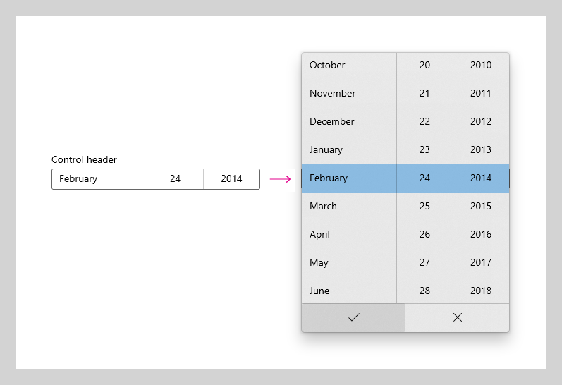

# Date picker

The date picker gives you a standardized way to let users pick a localized date value using touch, mouse, or keyboard input.


**Get the Windows UI Library**

|  |  |
| - | - |
|  | Windows UI Library 2.2 or later includes a new template for this control that uses rounded corners. For more info, see [Corner radius](../style/rounded-corner.md). WinUI is a NuGet package that contains new controls and UI features for Windows apps. For more info, including installation instructions, see [Windows UI Library](/uwp/toolkits/winui/). |

> **Platform APIs:** [DatePicker class](/uwp/api/Windows.UI.Xaml.Controls.DatePicker), [Date property](/uwp/api/windows.ui.xaml.controls.datepicker.date)

## Is this the right control?

Use a date picker to let a user pick a known date, such as a date of birth, where the context of the calendar is not important.

For more info about choosing the right date control, see the [Date and time controls](date-and-time.md) article.

## Examples

<table>
<th align="left">XAML Controls Gallery<th>
<tr>
<td></img></td>
<td>
    <p>If you have the <strong style="font-weight: semi-bold">XAML Controls Gallery</strong> app installed, click here to <a href="xamlcontrolsgallery:/item/DatePicker">open the app and see the DatePicker in action</a>.</p>
    <ul>
    <li><a href="https://www.microsoft.com/store/productId/9MSVH128X2ZT">Get the XAML Controls Gallery app (Microsoft Store)</a></li>
    <li><a href="https://github.com/Microsoft/Xaml-Controls-Gallery">Get the source code (GitHub)</a></li>
    </ul>
</td>
</tr>
</table>

The entry point displays the chosen date, and when the user selects the entry point, a picker surface expands vertically from the middle for the user to make a selection. The date picker overlays other UI; it doesn't push other UI out of the way.



## Create a date picker

This example shows how to create a simple date picker with a header.

```xaml
<DatePicker x:Name="birthDatePicker" Header="Date of birth"/>
```

```csharp
DatePicker birthDatePicker = new DatePicker();
birthDatePicker.Header = "Date of birth";
```

The resulting date picker looks like this:


> **Note**&nbsp;&nbsp;For important info about date values, see [DateTime and Calendar values](date-and-time.md#datetime-and-calendar-values) in the Date and time controls article.

## Get the sample code

- [XAML Controls Gallery sample](https://github.com/Microsoft/Xaml-Controls-Gallery) - See all the XAML controls in an interactive format.

## Related articles

- [Date and time controls](date-and-time.md)
- [Calendar date picker](calendar-date-picker.md)
- [Calendar view](calendar-view.md)
- [Time picker](time-picker.md)