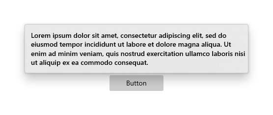
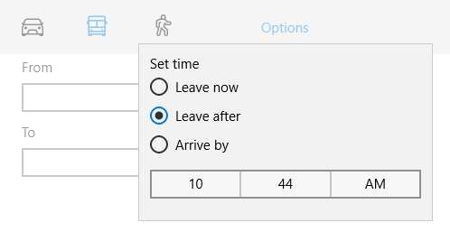

# Flyouts

A flyout is a light dismiss container that can show arbitrary UI as its content. Flyouts can contain other flyouts or context menus to create a nested experience.


**Get the Windows UI Library**

|  |  |
| - | - |
|  | Windows UI Library 2.2 or later includes a new template for this control that uses rounded corners. For more info, see [Corner radius](../../style/rounded-corner.md). WinUI is a NuGet package that contains new controls and UI features for Windows apps. For more info, including installation instructions, see [Windows UI Library](/uwp/toolkits/winui/). |

> **Platform APIs:** [Flyout class](/uwp/api/Windows.UI.Xaml.Controls.Flyout)

## Is this the right control?

* Don't use a flyout instead of [tooltip](../tooltips.md) or [context menu](../menus.md). Use a tooltip to show a short description that hides after a specified time. Use a context menu for contextual actions related to a UI element, such as copy and paste.

For recommendations on when to use a flyout vs. when to use a dialog (a similar control), see [Dialogs and flyouts](index.md).

## Examples

<table>
<th align="left">XAML Controls Gallery<th>
<tr>
<td></img></td>
<td>
    <p>If you have the <strong style="font-weight: semi-bold">XAML Controls Gallery</strong> app installed, click here to open the app and see the <a href="xamlcontrolsgallery:/item/ContentDialog">ContentDialog</a> or <a href="xamlcontrolsgallery:/item/Flyout">Flyout</a> in action.</p>
    <ul>
    <li><a href="https://www.microsoft.com/store/productId/9MSVH128X2ZT">Get the XAML Controls Gallery app (Microsoft Store)</a></li>
    <li><a href="https://github.com/Microsoft/Xaml-Controls-Gallery">Get the source code (GitHub)</a></li>
    </ul>
</td>
</tr>
</table>

##  How to create a flyout


Flyouts are attached to specific controls. You can use the [Placement](/uwp/api/Windows.UI.Xaml.Controls.Primitives.FlyoutBase.Placement) property to specify where a flyout appears: Top, Left, Bottom, Right, or Full. If you select the [Full placement mode](/uwp/api/Windows.UI.Xaml.Controls.Primitives.FlyoutPlacementMode), the app stretches the flyout and centers it inside the app window. Some controls, such as [Button](/uwp/api/Windows.UI.Xaml.Controls.Button), provide a [Flyout](/uwp/api/Windows.UI.Xaml.Controls.Button.Flyout) property that you can use to associate a flyout or [context menu](../menus.md).

This example creates a simple flyout that displays some text when the button is pressed.
````xaml
<Button Content="Click me">
  <Button.Flyout>
     <Flyout>
        <TextBlock Text="This is a flyout!"/>
     </Flyout>
  </Button.Flyout>
</Button>
````

If the control doesn't have a flyout property, you can use the [FlyoutBase.AttachedFlyout](/uwp/api/windows.ui.xaml.controls.primitives.flyoutbase.AttachedFlyoutProperty) attached property instead. When you do this, you also need to call the [FlyoutBase.ShowAttachedFlyout](/uwp/api/Windows.UI.Xaml.Controls.Primitives.FlyoutBase#Windows_UI_Xaml_Controls_Primitives_FlyoutBase_ShowAttachedFlyout_Windows_UI_Xaml_FrameworkElement_) method to show the flyout.

This example adds a simple flyout to an image. When the user taps the image, the app shows the flyout.

````xaml
<Image Source="Assets/cliff.jpg" Width="50" Height="50"
  Margin="10" Tapped="Image_Tapped">
  <FlyoutBase.AttachedFlyout>
    <Flyout>
      <TextBlock Text="This is some text in a flyout."  />
    </Flyout>
  </FlyoutBase.AttachedFlyout>
</Image>
````

````csharp
private void Image_Tapped(object sender, TappedRoutedEventArgs e)
{
    FlyoutBase.ShowAttachedFlyout((FrameworkElement)sender);
}
````

The previous examples defined their flyouts inline. You can also define a flyout as a static resource and then use it with multiple elements. This example creates a more complicated flyout that displays a larger version of an image when its thumbnail is tapped.

````xaml
<!-- Declare the shared flyout as a resource. -->
<Page.Resources>
    <Flyout x:Key="ImagePreviewFlyout" Placement="Right">
        <!-- The flyout's DataContext must be the Image Source
             of the image the flyout is attached to. -->
        <Image Source="{Binding Path=Source}"
            MaxHeight="400" MaxWidth="400" Stretch="Uniform"/>
    </Flyout>
</Page.Resources>
````

````xaml
<!-- Assign the flyout to each element that shares it. -->
<StackPanel>
    <Image Source="Assets/cliff.jpg" Width="50" Height="50"
           Margin="10" Tapped="Image_Tapped"
           FlyoutBase.AttachedFlyout="{StaticResource ImagePreviewFlyout}"
           DataContext="{Binding RelativeSource={RelativeSource Mode=Self}}"/>
    <Image Source="Assets/grapes.jpg" Width="50" Height="50"
           Margin="10" Tapped="Image_Tapped"
           FlyoutBase.AttachedFlyout="{StaticResource ImagePreviewFlyout}"
           DataContext="{Binding RelativeSource={RelativeSource Mode=Self}}"/>
    <Image Source="Assets/rainier.jpg" Width="50" Height="50"
           Margin="10" Tapped="Image_Tapped"
           FlyoutBase.AttachedFlyout="{StaticResource ImagePreviewFlyout}"
           DataContext="{Binding RelativeSource={RelativeSource Mode=Self}}"/>
</StackPanel>
````

````csharp
private void Image_Tapped(object sender, TappedRoutedEventArgs e)
{
    FlyoutBase.ShowAttachedFlyout((FrameworkElement)sender);
}
````

## Style a flyout
To style a Flyout, modify its [FlyoutPresenterStyle](/uwp/api/Windows.UI.Xaml.Controls.Flyout.FlyoutPresenterStyle). This example shows a paragraph of wrapping text and makes the text block accessible to a screen reader.



````xaml
<Flyout>
  <Flyout.FlyoutPresenterStyle>
    <Style TargetType="FlyoutPresenter">
      <Setter Property="ScrollViewer.HorizontalScrollMode"
          Value="Disabled"/>
      <Setter Property="ScrollViewer.HorizontalScrollBarVisibility" Value="Disabled"/>
      <Setter Property="IsTabStop" Value="True"/>
      <Setter Property="TabNavigation" Value="Cycle"/>
    </Style>
  </Flyout.FlyoutPresenterStyle>
  <TextBlock Style="{StaticResource BodyTextBlockStyle}" Text="Lorem ipsum dolor sit amet, consectetur adipiscing elit, sed do eiusmod tempor incididunt ut labore et dolore magna aliqua. Ut enim ad minim veniam, quis nostrud exercitation ullamco laboris nisi ut aliquip ex ea commodo consequat."/>
</Flyout>
````

## Styling flyouts for 10-foot experiences

Light dismiss controls like flyout trap keyboard and gamepad focus inside their transient UI until dismissed. To provide a visual cue for this behavior, light dismiss controls on Xbox draw an overlay that dims the contrast and visibility of out of scope UI. This behavior can be modified with the [`LightDismissOverlayMode`](/uwp/api/Windows.UI.Xaml.Controls.Primitives.FlyoutBase.LightDismissOverlayMode) property. By default, flyouts will draw the light dismiss overlay on Xbox but not other device families, but apps can choose to force the overlay to be always **On** or always **Off**.



```xaml
<MenuFlyout LightDismissOverlayMode="On">
```

## Light dismiss behavior
Flyouts can be closed with a quick light dismiss action, including
-    Tap outside the flyout
-    Press the Escape keyboard key
-    Press the hardware or software system Back button
-    Press the gamepad B button

When dismissing with a tap, this gesture is typically absorbed and not passed on to the UI underneath. For example, if there's a button visible behind an open flyout, the user's first tap dismisses the flyout but does not activate this button. Pressing the button requires a second tap.

You can change this behavior by designating the button as an input pass-through element for the flyout. The flyout will close as a result of the light dismiss actions described above and will also pass the tap event to its designated `OverlayInputPassThroughElement`. Consider adopting this behavior to speed up user interactions on functionally similar items. If your app has a favorites collection and each item in the collection includes an attached flyout, it's reasonable to expect that users may want to interact with multiple flyouts in rapid succession.

[!NOTE] Be careful not to designate an overlay input pass-through element which results in a destructive action. Users have become habituated to discreet light dismiss actions which do not activate primary UI. Close, Delete or similarly destructive buttons should not activate on light dismiss to avoid unexpected and disruptive behavior.

In the following example, all three buttons inside FavoritesBar will be activated on the first tap.

````xaml
<Page>
    <Page.Resources>
        <Flyout x:Name="TravelFlyout" x:Key="TravelFlyout"
                OverlayInputPassThroughElement="{x:Bind FavoritesBar}">
            <StackPanel>
                <HyperlinkButton Content="Washington Trails Association"/>
                <HyperlinkButton Content="Washington Cascades - Go Northwest! A Travel Guide"/>
            </StackPanel>
        </Flyout>
    </Page.Resources>

    <Grid>
        <Grid.RowDefinitions>
            <RowDefinition Height="Auto"/>
            <RowDefinition Height="*"/>
        </Grid.RowDefinitions>
        <StackPanel x:Name="FavoritesBar" Orientation="Horizontal">
            <HyperlinkButton x:Name="PageLinkBtn">Bing</HyperlinkButton>
            <Button x:Name="Folder1" Content="Travel" Flyout="{StaticResource TravelFlyout}"/>
            <Button x:Name="Folder2" Content="Entertainment" Click="Folder2_Click"/>
        </StackPanel>
        <ScrollViewer Grid.Row="1">
            <WebView x:Name="WebContent"/>
        </ScrollViewer>
    </Grid>
</Page>
````
````csharp
private void Folder2_Click(object sender, RoutedEventArgs e)
{
     Flyout flyout = new Flyout();
     flyout.OverlayInputPassThroughElement = FavoritesBar;
     ...
     flyout.ShowAt(sender as FrameworkElement);
{
````

## Get the sample code

- [XAML Controls Gallery sample](https://github.com/Microsoft/Xaml-Controls-Gallery) - See all the XAML controls in an interactive format.

## Related articles
- [Tooltips](../tooltips.md)
- [Menus and context menu](../menus.md)
- [Flyout class](/uwp/api/Windows.UI.Xaml.Controls.Flyout)
- [ContentDialog class](/uwp/api/Windows.UI.Xaml.Controls.ContentDialog)