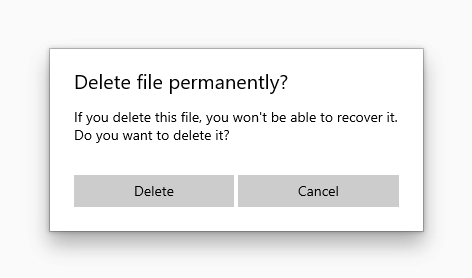

# Dialogs and flyouts

Dialogs and flyouts are transient UI elements that appear when something happens that requires notification, approval, or additional information from the user.

> **Platform APIs:** [ContentDialog class](/uwp/api/Windows.UI.Xaml.Controls.ContentDialog), [Flyout class](/uwp/api/Windows.UI.Xaml.Controls.Flyout)

**Dialogs**

Dialogs are modal UI overlays that provide contextual app information. Dialogs block interactions with the app window until being explicitly dismissed. They often request some kind of action from the user.

**Flyouts**

A flyout is a lightweight contextual popup that displays UI related to what the user is doing. It includes placement and sizing logic, and can be used to reveal a secondary control or show more detail about an item.

Unlike a dialog, a flyout can be quickly dismissed by tapping or clicking somewhere outside the flyout, pressing the Escape key or Back button, resizing the app window, or changing the device's orientation.

## Is this the right control?

Dialogs and flyouts make sure that users are aware of important information, but they also disrupt the user experience. Because dialogs are modal (blocking), they interrupt users, preventing them from doing anything else until they interact with the dialog. Flyouts provide a less jarring experience, but displaying too many flyouts can be distracting.

Once you've determined that you want to use a dialog or flyout, you need to choose which one to use.

Given that dialogs block interactions and flyouts do not, dialogs should be reserved for situations where you want the user to drop everything to focus on a specific bit of information or answer a question. Flyouts, on the other hand, can be used when you want to call attention to something, but it's ok if the user wants to ignore it.

   
<b>Use a dialog for...</b>  
<ul>
<li>Expressing important information that the user <b>must</b> read and acknowledge before proceeding. Examples include:
<ul>
  <li>When the user's security might be compromised</li>
  <li>When the user is about to permanently alter a valuable asset</li>
  <li>When the user is about to delete a valuable asset</li>
  <li>To confirm an in-app purchase</li>
</ul>

</li>
<li>Error messages that apply to the overall app context, such as a connectivity error.</li>
<li>Questions, when the app needs to ask the user a blocking question, such as when the app can't choose on the user's behalf. A blocking question can't be ignored or postponed, and should offer the user well-defined choices.</li>
</ul>

   
<b>Use a flyout for...</b>  
<ul>
<li>Collecting additional information needed before an action can be completed.</li>
<li>Displaying info that's only relevant some of the time. For example, in a photo gallery app, when the user clicks an image thumbnail, you might use a flyout to display a large version of the image.</li>
<li>Displaying more information, such as details or longer descriptions of an item on the page.</li>
</ul>

## Ways to avoid using dialogs and flyouts

Consider the importance of the information you want to share: is it important enough to interrupt the user? Also consider how frequently the information needs to be shown; if you're showing a dialog or notification every few minutes, you might want to allocate space for this info in the primary UI instead. For example, in a chat client, rather than showing a flyout every time a friend logs in, you might display a list of friends who are online at the moment and highlight friends as they log on.

Dialogs are frequently used to confirm an action (such as deleting a file) before executing it. If you expect the user to perform a particular action frequently, consider providing a way for the user to undo the action if it was a mistake, rather than forcing users to confirm the action every time.

## How to create a dialog

See the [Dialogs article](dialogs.md). 

## How to create a flyout

See the [Flyout article](flyouts.md). 

## Examples

<table>
<th align="left">XAML Controls Gallery<th>
<tr>
<td></img></td>
<td>
    
If you have the <strong style="font-weight: semi-bold">XAML Controls Gallery</strong> app installed, click here to open the app and see the <a href="xamlcontrolsgallery:/item/ContentDialog">ContentDialog</a> or <a href="xamlcontrolsgallery:/item/Flyout">Flyout</a> in action.

    <ul>
    <li><a href="https://www.microsoft.com/store/productId/9MSVH128X2ZT">Get the XAML Controls Gallery app (Microsoft Store)</a></li>
    <li><a href="https://github.com/Microsoft/Xaml-Controls-Gallery">Get the source code (GitHub)</a></li>
    </ul>
</td>
</tr>
</table>

