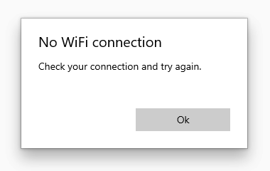
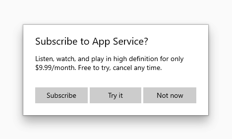
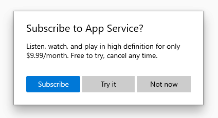

# Dialogs and flyouts


Dialogs and flyouts are transient UI elements that appear when something happens that requires notification, approval, or additional information from the user.

> **Important APIs**: [ContentDialog class](https://docs.microsoft.com/uwp/api/Windows.UI.Xaml.Controls.ContentDialog), [Flyout class](https://docs.microsoft.com/uwp/api/Windows.UI.Xaml.Controls.Flyout)


:::row:::
    :::column:::
        **Dialogs**
        
        

        Dialogs are modal UI overlays that provide contextual app information. Dialogs block interactions with the app window until being explicitly dismissed. They often request some kind of action from the user.
    :::column-end:::
    :::column::: 
        **Flyouts**

        

        A flyout is a lightweight contextual popup that displays UI related to what the user is doing. It includes placement and sizing logic, and can be used to reveal a secondary control or show more detail about an item.

        Unlike a dialog, a flyout can be quickly dismissed by tapping or clicking somewhere outside the flyout, pressing the Escape key or Back button, resizing the app window, or changing the device's orientation.
    :::column-end:::
:::row-end:::


## Is this the right control?

* Use dialogs to notify users of important information or to request confirmation or additional info before an action can be completed.
* Don't use a flyout instead of [tooltip](tooltips.md) or [context menu](menus.md). Use a tooltip to show a short description that hides after a specified time. Use a context menu for contextual actions related to a UI element, such as copy and paste.  


Dialogs and flyouts make sure that users are aware of important information, but they also disrupt the user experience. Because dialogs are modal (blocking), they interrupt users, preventing them from doing anything else until they interact with the dialog. Flyouts provide a less jarring experience, but displaying too many flyouts can be distracting.

Consider the importance of the information you want to share: is it important enough to interrupt the user? Also consider how frequently the information needs to be shown; if you're showing a dialog or notification every few minutes, you might want to allocate space for this info in the primary UI instead. For example, in a chat client, rather than showing a flyout every time a friend logs in, you might display a list of friends who are online at the moment and highlight friends as they log on.

Dialogs are frequently used to confirm an action (such as deleting a file) before executing it. If you expect the user to perform a particular action frequently, consider providing a way for the user to undo the action if it was a mistake, rather than forcing users to confirm the action every time.

## Examples

<table>
<th align="left">XAML Controls Gallery<th>
<tr>
<td></img></td>
<td>
    <p>If you have the <strong style="font-weight: semi-bold">XAML Controls Gallery</strong> app installed, click here to open the app and see the <a href="xamlcontrolsgallery:/item/ContentDialog">ContentDialog</a> or <a href="xamlcontrolsgallery:/item/Flyout">Flyout</a> in action.</p>
    <ul>
    <li><a href="https://www.microsoft.com/store/productId/9MSVH128X2ZT">Get the XAML Controls Gallery app (Microsoft Store)</a></li>
    <li><a href="https://github.com/Microsoft/Windows-universal-samples/tree/master/Samples/XamlUIBasics">Get the source code (GitHub)</a></li>
    </ul>
</td>
</tr>
</table>

## Dialogs vs. flyouts

Once you've determined that you want to use a dialog or flyout, you need to choose which one to use.

Given that dialogs block interactions and flyouts do not, dialogs should be reserved for situations where you want the user to drop everything to focus on a specific bit of information or answer a question. Flyouts, on the other hand, can be used when you want to call attention to something, but it's ok if the user wants to ignore it.

:::row:::
    :::column:::
   <p><b>Use a dialog for...</b> <br/>
<ul>
<li>Expressing important information that the user <b>must</b> read and acknowledge before proceeding. Examples include:
<ul>
  <li>When the user's security might be compromised</li>
  <li>When the user is about to permanently alter a valuable asset</li>
  <li>When the user is about to delete a valuable asset</li>
  <li>To confirm an in-app purchase</li>
</ul>

</li>
<li>Error messages that apply to the overall app context, such as a connectivity error.</li>
<li>Questions, when the app needs to ask the user a blocking question, such as when the app can't choose on the user's behalf. A blocking question can't be ignored or postponed, and should offer the user well-defined choices.</li>
</ul>
</p>
    :::column-end:::
    :::column:::
   <p><b>Use a flyout for...</b> <br/>
<ul>
<li>Collecting additional information needed before an action can be completed.</li>
<li>Displaying info that's only relevant some of the time. For example, in a photo gallery app, when the user clicks an image thumbnail, you might use a flyout to display a large version of the image.</li>
<li>Displaying more information, such as details or longer descriptions of an item on the page.</li>
</ul></p>
    :::column-end:::
:::row-end:::


## Dialogs
### General guidelines

-   Clearly identify the issue or the user's objective in the first line of the dialog's text.
-   The dialog title is the main instruction and is optional.
    -   Use a short title to explain what people need to do with the dialog.
    -   If you're using the dialog to deliver a simple message, error or question, you can optionally omit the title. Rely on the content text to deliver that core information.
    -   Make sure that the title relates directly to the button choices.
-   The dialog content contains the descriptive text and is required.
    -   Present the message, error, or blocking question as simply as possible.
    -   If a dialog title is used, use the content area to provide more detail or define terminology. Don't repeat the title with slightly different wording.
-   At least one dialog button must appear.
    -   Ensure that your dialog has at least one button corresponding to a safe, nondestructive action like "Got it!", "Close", or "Cancel". Use the CloseButton API to add this button.
    -   Use specific responses to the main instruction or content as button text. An example is, "Do you want to allow AppName to access your location?", followed by "Allow" and "Block" buttons. Specific responses can be understood more quickly, resulting in efficient decision making.
    - Ensure that the text of the action buttons is concise. Short strings enable the user to make a choice quickly and confidently.
    - In addition to the safe, nondestructive action, you may optionally present the user with one or two action buttons related to the main instruction. These "do it" action buttons confirm the main point of the dialog. Use the PrimaryButton and SecondaryButton APIs to add these "do it" actions.
    - The "do it" action button(s) should appears as the leftmost buttons. The safe, nondestructive action should appear as the rightmost button.
    - You may optionally choose to differentiate one of the three buttons as the dialog's default button. Use the DefaultButton API to differentiate one of the buttons.  
-   Don't use dialogs for errors that are contextual to a specific place on the page, such as validation errors (in password fields, for example), use the app's canvas itself to show inline errors.
- Use the [ContentDialog class](https://docs.microsoft.com/uwp/api/Windows.UI.Xaml.Controls.ContentDialog) to build your dialog experience. Don't use the deprecated MessageDialog API.

### Dialog scenarios
Because dialogs block user interaction, and because buttons are the primary mechanism for users to dismiss the dialog, ensure that your dialog contains at least one "safe" and nondestructive button such as "Close" or "Got it!". **All dialogs should contain at least one safe action button to close the dialog.** This ensures that the user can confidently close the dialog without performing an action.<br>

```csharp
private async void DisplayNoWifiDialog()
{
    ContentDialog noWifiDialog = new ContentDialog
    {
        Title = "No wifi connection",
        Content = "Check your connection and try again.",
        CloseButtonText = "Ok"
    };

    ContentDialogResult result = await noWifiDialog.ShowAsync();
}
```

When dialogs are used to display a blocking question, your dialog should present the user with action buttons related to the question. The "safe" and nondestructive button may be accompanied by one or two "do it" action buttons. When presenting the user with multiple options, ensure that the buttons clearly explain the "do it" and safe/"don’t do it" actions related to the question proposed.


```csharp
private async void DisplayLocationPromptDialog()
{
    ContentDialog locationPromptDialog = new ContentDialog
    {
        Title = "Allow AppName to access your location?",
        Content = "AppName uses this information to help you find places, connect with friends, and more.",
        CloseButtonText = "Block",
        PrimaryButtonText = "Allow"
    };

    ContentDialogResult result = await locationPromptDialog.ShowAsync();
}
```

Three button dialogs are used when you present the user with two "do it" actions and a "don’t do it" action. Three button dialogs should be used sparingly with clear distinctions between the secondary action and the safe/close action.



```csharp
private async void DisplaySubscribeDialog()
{
    ContentDialog subscribeDialog = new ContentDialog
    {
        Title = "Subscribe to App Service?",
        Content = "Listen, watch, and play in high definition for only $9.99/month. Free to try, cancel anytime.",
        CloseButtonText = "Not Now",
        PrimaryButtonText = "Subscribe",
        SecondaryButtonText = "Try it"
    };

    ContentDialogResult result = await subscribeDialog.ShowAsync();
}
```

### The three dialog buttons
ContentDialog has three different types of buttons that you can use to build a dialog experience.

- **CloseButton** - Required - Represents the safe, nondestructive action that enables the user to exit the dialog. Appears as the rightmost button.
- **PrimaryButton** - Optional - Represents the first "do it" action. Appears as the leftmost button.
- **SecondaryButton** - Optional - Represents the second "do it" action. Appears as the middle button.

Using the built-in buttons will position the buttons appropriately, ensure that they correctly respond to keyboard events, ensure that the command area remains visible even when the on-screen keyboard is up, and will make the dialog look consistent with other dialogs.

#### CloseButton
Every dialog should contain a safe, nondestructive action button that enables the user to confidently exit the dialog.

Use the ContentDialog.CloseButton API to create this button. This allows you to create the right user experience for all inputs including mouse, keyboard, touch, and gamepad. This experience will happen when:
<ol>
    <li>The user clicks or taps on the CloseButton </li>
    <li>The user presses the system back button </li>
    <li>The user presses the ESC button on the keyboard </li>
    <li>The user presses Gamepad B </li>
</ol>

When the user clicks a dialog button, the [ShowAsync](https://docs.microsoft.com/uwp/api/Windows.UI.Xaml.Controls.ContentDialog.ShowAsync) method returns a [ContentDialogResult](https://docs.microsoft.com/uwp/api/Windows.UI.Xaml.Controls.ContentDialogResult) to let you know which button the user clicks. Pressing on the CloseButton returns ContentDialogResult.None.

#### PrimaryButton and SecondaryButton
In addition to the CloseButton, you may optionally present the user with one or two action buttons related to the main instruction.
Leverage PrimaryButton for the first "do it" action, and SecondaryButton for the second "do it" action. In three-button dialogs, the PrimaryButton generally represents the affirmative "do it" action, while the SecondaryButton generally represents a neutral or secondary "do it" action.
For example, an app may prompt the user to subscribe to a service. The PrimaryButton as the affirmative "do it" action would host the Subscribe text, while the SecondaryButton as the neutral "do it" action would host the Try it text. The CloseButton would allow the user to cancel without performing either action.

When the user clicks on the PrimaryButton, the [ShowAsync](https://docs.microsoft.com/uwp/api/Windows.UI.Xaml.Controls.ContentDialog.ShowAsync) method returns ContentDialogResult.Primary.
When the user clicks on the SecondaryButton, the [ShowAsync](https://docs.microsoft.com/uwp/api/Windows.UI.Xaml.Controls.ContentDialog.ShowAsync) method returns ContentDialogResult.Secondary.


#### DefaultButton
You may optionally choose to differentiate one of the three buttons as the default button. Specifying the default button causes the following to happen:
- The button receives the Accent Button visual treatment
- The button will respond to the ENTER key automatically
    - When the user presses the ENTER key on the keyboard, the click handler associated with the Default Button will fire and the ContentDialogResult will return the value associated with the Default Button
    - If the user has placed Keyboard Focus on a control that handles ENTER, the Default Button will not respond to ENTER presses
- The button will receive focus automatically when the Dialog is opened unless the dialog’s content contains focusable UI

Use the ContentDialog.DefaultButton property to indicate the default button. By default, no default button is set.



```csharp
private async void DisplaySubscribeDialog()
{
    ContentDialog subscribeDialog = new ContentDialog
    {
        Title = "Subscribe to App Service?",
        Content = "Listen, watch, and play in high definition for only $9.99/month. Free to try, cancel anytime.",
        CloseButtonText = "Not Now",
        PrimaryButtonText = "Subscribe",
        SecondaryButtonText = "Try it",
        DefaultButton = ContentDialogButton.Primary
    };

    ContentDialogResult result = await subscribeDialog.ShowAsync();
}
```

### Confirmation dialogs (OK/Cancel)
A confirmation dialog gives users the chance to confirm that they want to perform an action. They can affirm the action, or choose to cancel.  
A typical confirmation dialog has two buttons: an affirmation ("OK") button and a cancel button.  

<ul>
    <li>
        <p>In general, the affirmation button should be on the left (the primary button) and the cancel button (the secondary button) should be on the right.</p>
        
    </li>
    <li>As noted in the general recommendations section, use buttons with text that identifies specific responses to the main instruction or content.
    </li>
</ul>

> Some platforms put the affirmation button on the right instead of the left. So why do we recommend putting it on the left?  If you assume that the majority of users are right-handed and they hold their phone with that hand, it's actually more comfortable to press the affirmation button when it's on the left, because the button is more likely to be within the user's thumb-arc. Buttons on the right-side of the screen require the user to pull their thumb inward into a less-comfortable position.

### Create a dialog
To create a dialog, you use the [ContentDialog class](https://docs.microsoft.com/uwp/api/Windows.UI.Xaml.Controls.ContentDialog). You can create a dialog in code or markup. Although its usually easier to define UI elements in XAML, in the case of a simple dialog, it's actually easier to just use code. This example creates a dialog to notify the user that there's no WiFi connection, and then uses the [ShowAsync](https://docs.microsoft.com/uwp/api/Windows.UI.Xaml.Controls.ContentDialog.ShowAsync) method to display it.

```csharp
private async void DisplayNoWifiDialog()
{
    ContentDialog noWifiDialog = new ContentDialog
    {
        Title = "No wifi connection",
        Content = "Check your connection and try again.",
        CloseButtonText = "Ok"
    };

    ContentDialogResult result = await noWifiDialog.ShowAsync();
}
```

When the user clicks a dialog button, the [ShowAsync](https://docs.microsoft.com/uwp/api/Windows.UI.Xaml.Controls.ContentDialog.ShowAsync) method returns a [ContentDialogResult](https://docs.microsoft.com/uwp/api/Windows.UI.Xaml.Controls.ContentDialogResult) to let you know which button the user clicks.

The dialog in this example asks a question and uses the returned [ContentDialogResult](https://docs.microsoft.com/uwp/api/Windows.UI.Xaml.Controls.ContentDialogResult) to determine the user's response.

```csharp
private async void DisplayDeleteFileDialog()
{
    ContentDialog deleteFileDialog = new ContentDialog
    {
        Title = "Delete file permanently?",
        Content = "If you delete this file, you won't be able to recover it. Do you want to delete it?",
        PrimaryButtonText = "Delete",
        CloseButtonText = "Cancel"
    };

    ContentDialogResult result = await deleteFileDialog.ShowAsync();

    // Delete the file if the user clicked the primary button.
    /// Otherwise, do nothing.
    if (result == ContentDialogResult.Primary)
    {
        // Delete the file.
    }
    else
    {
        // The user clicked the CLoseButton, pressed ESC, Gamepad B, or the system back button.
        // Do nothing.
    }
}
```

## Flyouts
###  Create a flyout

A flyout is a light dismiss container that can show arbitrary UI as its content. Flyouts can contain other flyouts or context menus to create a nested experience.


Flyouts are attached to specific controls. You can use the [Placement](https://docs.microsoft.com/uwp/api/Windows.UI.Xaml.Controls.Primitives.FlyoutBase.Placement) property to specify where a flyout appears: Top, Left, Bottom, Right, or Full. If you select the [Full placement mode](https://docs.microsoft.com/uwp/api/Windows.UI.Xaml.Controls.Primitives.FlyoutPlacementMode), the app stretches the flyout and centers it inside the app window. Some controls, such as [Button](https://docs.microsoft.com/uwp/api/Windows.UI.Xaml.Controls.Button), provide a [Flyout](https://docs.microsoft.com/uwp/api/Windows.UI.Xaml.Controls.Button.Flyout) property that you can use to associate a flyout or [context menu](menus.md).

This example creates a simple flyout that displays some text when the button is pressed.
````xaml
<Button Content="Click me">
  <Button.Flyout>
     <Flyout>
        <TextBlock Text="This is a flyout!"/>
     </Flyout>
  </Button.Flyout>
</Button>
````

If the control doesn't have a flyout property, you can use the [FlyoutBase.AttachedFlyout](https://docs.microsoft.com/uwp/api/windows.ui.xaml.controls.primitives.flyoutbase.AttachedFlyoutProperty) attached property instead. When you do this, you also need to call the [FlyoutBase.ShowAttachedFlyout](https://docs.microsoft.com/uwp/api/Windows.UI.Xaml.Controls.Primitives.FlyoutBase#Windows_UI_Xaml_Controls_Primitives_FlyoutBase_ShowAttachedFlyout_Windows_UI_Xaml_FrameworkElement_) method to show the flyout.

This example adds a simple flyout to an image. When the user taps the image, the app shows the flyout.

````xaml
<Image Source="Assets/cliff.jpg" Width="50" Height="50"
  Margin="10" Tapped="Image_Tapped">
  <FlyoutBase.AttachedFlyout>
    <Flyout>
      <TextBlock Text="This is some text in a flyout."  />
    </Flyout>        
  </FlyoutBase.AttachedFlyout>
</Image>
````

````csharp
private void Image_Tapped(object sender, TappedRoutedEventArgs e)
{
    FlyoutBase.ShowAttachedFlyout((FrameworkElement)sender);
}
````

The previous examples defined their flyouts inline. You can also define a flyout as a static resource and then use it with multiple elements. This example creates a more complicated flyout that displays a larger version of an image when its thumbnail is tapped.

````xaml
<!-- Declare the shared flyout as a resource. -->
<Page.Resources>
    <Flyout x:Key="ImagePreviewFlyout" Placement="Right">
        <!-- The flyout's DataContext must be the Image Source
             of the image the flyout is attached to. -->
        <Image Source="{Binding Path=Source}"
            MaxHeight="400" MaxWidth="400" Stretch="Uniform"/>
    </Flyout>
</Page.Resources>
````

````xaml
<!-- Assign the flyout to each element that shares it. -->
<StackPanel>
    <Image Source="Assets/cliff.jpg" Width="50" Height="50"
           Margin="10" Tapped="Image_Tapped"
           FlyoutBase.AttachedFlyout="{StaticResource ImagePreviewFlyout}"
           DataContext="{Binding RelativeSource={RelativeSource Mode=Self}}"/>
    <Image Source="Assets/grapes.jpg" Width="50" Height="50"
           Margin="10" Tapped="Image_Tapped"
           FlyoutBase.AttachedFlyout="{StaticResource ImagePreviewFlyout}"
           DataContext="{Binding RelativeSource={RelativeSource Mode=Self}}"/>
    <Image Source="Assets/rainier.jpg" Width="50" Height="50"
           Margin="10" Tapped="Image_Tapped"
           FlyoutBase.AttachedFlyout="{StaticResource ImagePreviewFlyout}"
           DataContext="{Binding RelativeSource={RelativeSource Mode=Self}}"/>
</StackPanel>
````

````csharp
private void Image_Tapped(object sender, TappedRoutedEventArgs e)
{
    FlyoutBase.ShowAttachedFlyout((FrameworkElement)sender);  
}
````

### Style a flyout
To style a Flyout, modify its [FlyoutPresenterStyle](https://docs.microsoft.com/uwp/api/Windows.UI.Xaml.Controls.Flyout.FlyoutPresenterStyle). This example shows a paragraph of wrapping text and makes the text block accessible to a screen reader.


````xaml
<Flyout>
  <Flyout.FlyoutPresenterStyle>
    <Style TargetType="FlyoutPresenter">
      <Setter Property="ScrollViewer.HorizontalScrollMode"
          Value="Disabled"/>
      <Setter Property="ScrollViewer.HorizontalScrollBarVisibility" Value="Disabled"/>
      <Setter Property="IsTabStop" Value="True"/>
      <Setter Property="TabNavigation" Value="Cycle"/>
    </Style>
  </Flyout.FlyoutPresenterStyle>
  <TextBlock Style="{StaticResource BodyTextBlockStyle}" Text="Lorem ipsum dolor sit amet, consectetur adipiscing elit, sed do eiusmod tempor incididunt ut labore et dolore magna aliqua. Ut enim ad minim veniam, quis nostrud exercitation ullamco laboris nisi ut aliquip ex ea commodo consequat."/>
</Flyout>
````

#### Styling flyouts for 10-foot experience

Light dismiss controls like flyout trap keyboard and gamepad focus inside their transient UI until dismissed. To provide a visual cue for this behavior, light dismiss controls on Xbox draw an overlay that dims the contrast and visibility of out of scope UI. This behavior can be modified with the [`LightDismissOverlayMode`](https://docs.microsoft.com/uwp/api/Windows.UI.Xaml.Controls.Primitives.FlyoutBase.LightDismissOverlayMode) property. By default, flyouts will draw the light dismiss overlay on Xbox but not other device families, but apps can choose to force the overlay to be always **On** or always **Off**.


```xaml
<MenuFlyout LightDismissOverlayMode="On">
```

### Light dismiss behavior
Flyouts can be closed with a quick light dismiss action, including
-	Tap outside the flyout
-	Press the Escape keyboard key
-	Press the hardware or software system Back button
-	Press the gamepad B button

When dismissing with a tap, this gesture is typically absorbed and not passed on to the UI underneath. For example, if there’s a button visible behind an open flyout, the user’s first tap dismisses the flyout but does not activate this button. Pressing the button requires a second tap.

You can change this behavior by designating the button as an input pass-through element for the flyout. The flyout will close as a result of the light dismiss actions described above and will also pass the tap event to its designated `OverlayInputPassThroughElement`. Consider adopting this behavior to speed up user interactions on functionally similar items. If your app has a favorites collection and each item in the collection includes an attached flyout, it's reasonable to expect that users may want to interact with multiple flyouts in rapid succession.

[!NOTE] Be careful not to designate an overlay input pass-through element which results in a destructive action. Users have become habituated to discreet light dismiss actions which do not activate primary UI. Close, Delete or similarly destructive buttons should not activate on light dismiss to avoid unexpected and disruptive behavior.

In the following example, all three buttons inside FavoritesBar will be activated on the first tap.

````xaml
<Page>
    <Page.Resources>
        <Flyout x:Name="TravelFlyout" x:Key="TravelFlyout"
                OverlayInputPassThroughElement="{x:Bind FavoritesBar}">
            <StackPanel>
                <HyperlinkButton Content="Washington Trails Association"/>
                <HyperlinkButton Content="Washington Cascades - Go Northwest! A Travel Guide"/>  
            </StackPanel>
        </Flyout>
    </Page.Resources>

    <Grid>
        <Grid.RowDefinitions>
            <RowDefinition Height="Auto"/>
            <RowDefinition Height="*"/>
        </Grid.RowDefinitions>
        <StackPanel x:Name="FavoritesBar" Orientation="Horizontal">
            <HyperlinkButton x:Name="PageLinkBtn">Bing</HyperlinkButton>  
            <Button x:Name="Folder1" Content="Travel" Flyout="{StaticResource TravelFlyout}"/>
            <Button x:Name="Folder2" Content="Entertainment" Click="Folder2_Click"/>
        </StackPanel>
        <ScrollViewer Grid.Row="1">
            <WebView x:Name="WebContent"/>
        </ScrollViewer>
    </Grid>
</Page>
````
````csharp
private void Folder2_Click(object sender, RoutedEventArgs e)
{
     Flyout flyout = new Flyout();
     flyout.OverlayInputPassThroughElement = FavoritesBar;
     ...
     flyout.ShowAt(sender as FrameworkElement);
{
````

## Get the sample code

- [XAML Controls Gallery sample](https://github.com/Microsoft/Windows-universal-samples/tree/master/Samples/XamlUIBasics) - See all the XAML controls in an interactive format.

## Related articles
- [Tooltips](tooltips.md)
- [Menus and context menu](menus.md)
- [Flyout class](https://docs.microsoft.com/uwp/api/Windows.UI.Xaml.Controls.Flyout)
- [ContentDialog class](https://docs.microsoft.com/uwp/api/Windows.UI.Xaml.Controls.ContentDialog)
