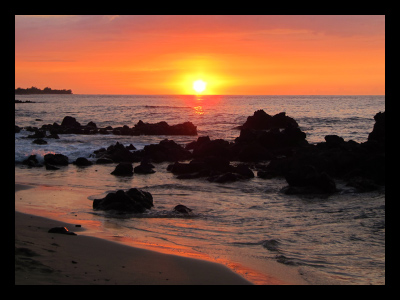

# Images and image brushes

To display an image, you can use either the **Image** object or the **ImageBrush** object. An Image object renders an image, and an ImageBrush object paints another object with an image. 

> **Important APIs**: [Image class](/uwp/api/Windows.UI.Xaml.Controls.Image), [Source property](/uwp/api/windows.ui.xaml.controls.image.source), [ImageBrush class](/uwp/api/Windows.UI.Xaml.Media.ImageBrush), [ImageSource property](/uwp/api/windows.ui.xaml.media.imagebrush.imagesource)

## Are these the right elements?
Use an **Image** element to display a stand-alone image in your app.

Use an **ImageBrush** to apply an image to another object. Uses for an ImageBrush include decorative effects for text, or backgrounds for controls or layout containers.

## Examples

<table>
<th align="left">XAML Controls Gallery<th>
<tr>
<td></img></td>
<td>
    <p>If you have the <strong style="font-weight: semi-bold">XAML Controls Gallery</strong> app installed, click here to <a href="xamlcontrolsgallery:/item/Image">open the app and see the Image in action</a>.</p>
    <ul>
    <li><a href="https://www.microsoft.com/p/xaml-controls-gallery/9msvh128x2zt">Get the XAML Controls Gallery app (Microsoft Store)</a></li>
    <li><a href="https://github.com/Microsoft/Xaml-Controls-Gallery">Get the source code (GitHub)</a></li>
    </ul>
</td>
</tr>
</table>

## Create an image

### Image
This example shows how to create an image by using the [Image](/uwp/api/Windows.UI.Xaml.Controls.Image) object.


```XAML
<Image Width="200" Source="sunset.jpg" />
```

Here's the rendered Image object.



In this example, the [Source](/uwp/api/windows.ui.xaml.controls.image.source) property specifies the location of the image that you want to display. You can set the Source by specifying an absolute URL (for example, http://contoso.com/myPicture.jpg) or by specifying a URL that is relative to your app packaging structure. For our example, we put the "licorice.jpg" image file in the root folder of our project and declare project settings that include the image file as content.

### ImageBrush

With the [ImageBrush](/uwp/api/Windows.UI.Xaml.Media.ImageBrush) object, you can use an image to paint an area that takes a [Brush](/uwp/api/Windows.UI.Xaml.Media.Brush) object. For example, you can use an ImageBrush for the value of the [Fill](/uwp/api/windows.ui.xaml.shapes.shape.fill) property of an [Ellipse](/uwp/api/Windows.UI.Xaml.Shapes.Ellipse) or the [Background](/uwp/api/windows.ui.xaml.controls.control.background) property of a [Canvas](/uwp/api/Windows.UI.Xaml.Controls.Canvas).

The next example shows how to use an ImageBrush to paint an Ellipse.

```XAML
<Ellipse Height="200" Width="300">
   <Ellipse.Fill>
     <ImageBrush ImageSource="sunset.jpg" />
   </Ellipse.Fill>
</Ellipse>
```

Here's the Ellipse painted by the ImageBrush.


### Stretch an image

If you don't set the [Width](/uwp/api/windows.ui.xaml.frameworkelement.width) or [Height](/uwp/api/windows.ui.xaml.frameworkelement.height) values of an **Image**, it is displayed with the dimensions of the image specified by the **Source**. Setting the **Width** and **Height** creates a containing rectangular area in which the image is displayed. You can specify how the image fills this containing area by using the [Stretch](/uwp/api/windows.ui.xaml.controls.image.stretch) property. The Stretch property accepts these values, which the [Stretch](/uwp/api/Windows.UI.Xaml.Media.Stretch) enumeration defines:

-   **None**: The image doesn't stretch to fill the output dimensions. Be careful with this Stretch setting: if the source image is larger than the containing area, your image will be clipped, and this usually isn't desirable because you don't have any control over the viewport like you do with a deliberate [Clip](/uwp/api/windows.ui.xaml.uielement.clip).
-   **Uniform**: The image is scaled to fit the output dimensions. But the aspect ratio of the content is preserved. This is the default value.
-   **UniformToFill**: The image is scaled so that it completely fills the output area but preserves its original aspect ratio.
-   **Fill**: The image is scaled to fit the output dimensions. Because the content's height and width are scaled independently, the original aspect ratio of the image might not be preserved. That is, the image might be distorted to completely fill the output area.


### Crop an image

You can use the [Clip](/uwp/api/windows.ui.xaml.uielement.clip) property to clip an area from the image output. You set the Clip property to a [Geometry](/uwp/api/Windows.UI.Xaml.Media.Geometry). Currently, non-rectangular clipping is not supported.

The next example shows how to use a [RectangleGeometry](/uwp/api/Windows.UI.Xaml.Media.RectangleGeometry) as the clip region for an image. In this example, we define an **Image** object with a height of 200. A **RectangleGeometry** defines a rectangle for the area of the image that will be displayed. The [Rect](/uwp/api/windows.ui.xaml.media.rectanglegeometry.rect) property is set to "25,25,100,150", which defines a rectangle starting at position "25,25" with a width of 100 and a height of 150. Only the part of the image that is within the area of the rectangle is displayed.

```xaml
<Image Source="sunset.jpg" Height="200">
    <Image.Clip>
        <RectangleGeometry Rect="25,25,100,150" />
    </Image.Clip>
</Image>
```

Here's the clipped image on a black background.


### Apply an opacity

You can apply an [Opacity](/uwp/api/windows.ui.xaml.uielement.opacity) to an image so that the image is rendered semi-translucent. The opacity values are from 0.0 to 1.0 where 1.0 is fully opaque and 0.0 is fully transparent. This example shows how to apply an opacity of 0.5 to an Image.

```xaml
<Image Height="200" Source="sunset.jpg" Opacity="0.5" />
```

Here's the rendered image with an opacity of 0.5 and a black background showing through the partial opacity.


### Image file formats

**Image** and **ImageBrush** can display these image file formats:

-   Joint Photographic Experts Group (JPEG)
-   Portable Network Graphics (PNG)
-   bitmap (BMP)
-   Graphics Interchange Format (GIF)
-   Tagged Image File Format (TIFF)
-   JPEG XR
-   icons (ICO)

The APIs for [Image](/uwp/api/Windows.UI.Xaml.Controls.Image), [BitmapImage](/uwp/api/Windows.UI.Xaml.Media.Imaging.BitmapImage) and [BitmapSource](/uwp/api/Windows.UI.Xaml.Media.Imaging.BitmapSource) don't include any dedicated methods for encoding and decoding of media formats. All of the encode and decode operations are built-in, and at most will surface aspects of encode or decode as part of event data for load events. If you want to do any special work with image encode or decode, which you might use if your app is doing image conversions or manipulation, you should use the APIs that are available in the [Windows.Graphics.Imaging](/uwp/api/Windows.Graphics.Imaging) namespace. These APIs are also supported by the Windows Imaging Component (WIC) in Windows.

Starting in Windows 10, version 1607, the **Image** element supports animated GIF images. When you use a **BitmapImage** as the image **Source**, you can access BitmapImage APIs to control playback of the animated GIF image. For more info, see the Remarks on the [BitmapImage](/uwp/api/Windows.UI.Xaml.Media.Imaging.BitmapImage) class page.

> **Note**&nbsp;&nbsp;Animated GIF support is available when your app is compiled for Windows 10, version 1607 and running on version 1607 (or later). When your app is compiled for or runs on previous versions, the first frame of the GIF is shown, but it is not animated.

For more info about app resources and how to package image sources in an app, see [Defining app resources](/previous-versions/windows/apps/hh965321(v=win.10)).

### WriteableBitmap

A [WriteableBitmap](/uwp/api/Windows.UI.Xaml.Media.Imaging.WriteableBitmap) provides a [BitmapSource](/uwp/api/Windows.UI.Xaml.Media.Imaging.BitmapSource) that can be modified and that doesn't use the basic file-based decoding from the WIC. You can alter images dynamically and re-render the updated image. To define the buffer content of a **WriteableBitmap**, use the [PixelBuffer](/uwp/api/windows.ui.xaml.media.imaging.writeablebitmap.pixelbuffer) property to access the buffer and use a stream or language-specific buffer type to fill it. For example code, see [WriteableBitmap](/uwp/api/Windows.UI.Xaml.Media.Imaging.WriteableBitmap).

### RenderTargetBitmap

The [RenderTargetBitmap](/uwp/api/Windows.UI.Xaml.Media.Imaging.RenderTargetBitmap) class can capture the XAML UI tree from a running app, and then represents a bitmap image source. After capture, that image source can be applied to other parts of the app, saved as a resource or app data by the user, or used for other scenarios. One particularly useful scenario is creating a runtime thumbnail of a XAML page for a navigation scheme, such as providing an image link from a [Hub](/uwp/api/Windows.UI.Xaml.Controls.Hub) control. **RenderTargetBitmap** does have some limitations on the content that will appear in the captured image. For more info, see the API reference topic for [RenderTargetBitmap](/uwp/api/Windows.UI.Xaml.Media.Imaging.RenderTargetBitmap).

### Image sources and scaling

You should create your image sources at several recommended sizes, to ensure that your app looks great when Windows scales it. When specifying a **Source** for an **Image**, you can use a naming convention that will automatically reference the correct resource for the current scaling. For specifics of the naming convention and more info, see [Quickstart: Using file or image resources](/previous-versions/windows/apps/hh965325(v=win.10)).

For more info about how to design for scaling, see [UX guidelines for layout and scaling](https://developer.microsoft.com/windows/apps/design).

### Image and ImageBrush in code

It's typical to specify Image and ImageBrush elements using XAML rather than code. This is because these elements are often the output of design tools as part of a XAML UI definition.

If you define an Image or ImageBrush using code, use the default constructors, then set the relevant source property ([Image.Source](/uwp/api/windows.ui.xaml.controls.image.source) or [ImageBrush.ImageSource](/uwp/api/windows.ui.xaml.media.imagebrush.imagesource)). The source properties require a [BitmapImage](/uwp/api/Windows.UI.Xaml.Media.Imaging.BitmapImage) (not a URI) when you set them using code. If your source is a stream, use the [SetSourceAsync](/uwp/api/windows.ui.xaml.media.imaging.bitmapsource.setsourceasync) method to initialize the value. If your source is a URI, which includes content in your app that uses the **ms-appx** or **ms-resource** schemes, use the [BitmapImage](/uwp/api/windows.ui.xaml.media.imaging.bitmapimage) constructor that takes a URI. You might also consider handling the [ImageOpened](/uwp/api/windows.ui.xaml.media.imaging.bitmapimage.imageopened) event if there are any timing issues with retrieving or decoding the image source, where you might need alternate content to display until the image source is available. For example code, see [XAML Controls Gallery](/samples/microsoft/xaml-controls-gallery/xaml-controls-gallery/).

> [!NOTE]
> If you establish images using code, you can use automatic handling for accessing unqualified resources with current scale and culture qualifiers, or you can use [ResourceManager](/uwp/api/Windows.ApplicationModel.Resources.Core.ResourceManager) and [ResourceMap](/uwp/api/Windows.ApplicationModel.Resources.Core.ResourceMap) with qualifiers for culture and scale to obtain the resources directly. For more info see [Resource management system](/previous-versions/windows/apps/jj552947(v=win.10)).

## Get the sample code

- [XAML Controls Gallery sample](https://github.com/Microsoft/Xaml-Controls-Gallery) - See all the XAML controls in an interactive format.

## Related articles

-   [Audio, video, and camera](../../audio-video-camera/index.md)
-   [Image class](/uwp/api/Windows.UI.Xaml.Controls.Image)
-   [ImageBrush class](/uwp/api/Windows.UI.Xaml.Media.ImageBrush)