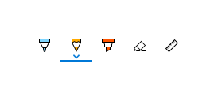
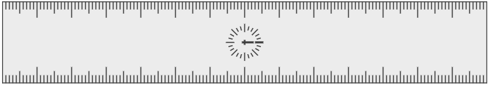

# Inking controls


There are two different controls that facilitate inking in Windows apps: [InkCanvas](/uwp/api/windows.ui.xaml.controls.inkcanvas) and [InkToolbar](/uwp/api/windows.ui.xaml.controls.inktoolbar).

The InkCanvas control renders pen input as either an ink stroke (using default settings for color and thickness) or an erase stroke. This control is a transparent overlay that doesn't include any built-in UI for changing the default ink stroke properties.

> [!NOTE]
> InkCanvas can be configured to support similar functionality for both mouse and touch input.

As the InkCanvas control does not include support for changing the default ink stroke settings, it can be paired with an InkToolbar control. The InkToolbar contains a customizable and extensible collection of buttons that activate ink-related features in an associated InkCanvas.

By default, the InkToolbar includes buttons for drawing, erasing, highlighting, and displaying a ruler. Depending on the feature, other settings and commands, such as ink color, stroke thickness, erase all ink, are provided in a flyout.

> [!NOTE]
> InkToolbar supports pen and mouse input and can be configured to recognize touch input.


> **Important APIs**: [InkCanvas class](/uwp/api/windows.ui.xaml.controls.inkcanvas), [InkToolbar class](/uwp/api/windows.ui.xaml.controls.inktoolbar), [InkPresenter class](/uwp/api/windows.ui.input.inking.inkpresenter), [Windows.UI.Input.Inking](/uwp/api/Windows.UI.Input.Inking)


## Is this the right control?

Use the InkCanvas when you need to enable basic inking features in your app without providing any ink settings to the user.

By default, strokes are rendered as ink when using the pen tip (a black ballpoint pen with a thickness of 2 pixels) and as an eraser when using the eraser tip. If an eraser tip is not present, the InkCanvas can be configured to process input from the pen tip as an erase stroke.

Pair the InkCanvas with an InkToolbar to provide a UI for activating ink features and setting basic ink properties such as stroke size, color, and shape of the pen tip.

> [!NOTE] 
> For more extensive customization of ink stroke rendering on an InkCanvas, use the underlying [InkPresenter](/uwp/api/windows.ui.input.inking.inkpresenter) object.

## Examples

<table>
<th align="left">XAML Controls Gallery<th>
<tr>
<td></img></td>
<td>
    <p>If you have the <strong style="font-weight: semi-bold">XAML Controls Gallery</strong> app installed, click here to <a href="xamlcontrolsgallery:/item/InkCanvas">open the app and see the InkCanvas in action</a>.</p>
    <ul>
    <li><a href="https://www.microsoft.com/store/productId/9MSVH128X2ZT">Get the XAML Controls Gallery app (Microsoft Store)</a></li>
    <li><a href="https://github.com/Microsoft/Xaml-Controls-Gallery">Get the source code (GitHub)</a></li>
    </ul>
</td>
</tr>
</table>

**Microsoft Edge**

Microsoft Edge uses the InkCanvas and InkToolbar for **Web Notes**.  


**Windows Ink Workspace**

The InkCanvas and InkToolbar are also used for **Snip & Sketch** in the **Windows Ink Workspace**.  


## Create an InkCanvas and InkToolbar

Adding an InkCanvas to your app requires just one line of markup:

```xaml
<InkCanvas x:Name="myInkCanvas"/>
```

> [!NOTE]
> For detailed InkCanvas customization using InkPresenter, see the ["Pen interactions and Windows Ink in Windows apps"](../input/pen-and-stylus-interactions.md) article.

The InkToolbar control must be used in conjunction with an InkCanvas. Incorporating an InkToolbar (with all built-in tools) into your app requires one additional line of markup:

 ```xaml
<InkToolbar TargetInkCanvas="{x:Bind myInkCanvas}"/>
 ```

This displays the following InkToolbar:


### Built-in buttons

The InkToolbar includes the following built-in buttons:

**Pens**

- Ballpoint pen - draws a solid, opaque stroke with a circle pen tip. The stroke size is dependent on the pen pressure detected.
- Pencil - draws a soft-edged, textured, and semi-transparent stroke (useful for layered shading effects) with a circle pen tip. The stroke color (darkness) is dependent on the pen pressure detected.
- Highlighter – draws a semi-transparent stroke with a rectangle pen tip.

You can customize both the color palette and size attributes (min, max, default) in the flyout for each pen.

**Tool**

- Eraser – deletes any ink stroke touched. Note that the entire ink stroke is deleted, not just the portion under the eraser stroke.

**Toggle**

- Ruler – shows or hides the ruler. Drawing near the ruler edge causes the ink stroke to snap to the ruler.  
 

Although this is the default configuration, you have complete control over which built-in buttons are included in the InkToolbar for your app.

### Custom buttons

The InkToolbar consists of two distinct groups of button types:

1. A group of "tool" buttons containing the built-in drawing, erasing, and highlighting buttons. Custom pens and tools are added here.
> [!NOTE]
> Feature selection is mutually exclusive.

2. A group of "toggle" buttons containing the built-in ruler button. Custom toggles are added here.
> [!NOTE]
> Features are not mutually exclusive and can be used concurrently with other active tools.

Depending on your application and the inking functionality required, you can add any of the following buttons (bound to your custom ink features) to the InkToolbar:

- Custom pen – a pen for which the ink color palette and pen tip properties, such as shape, rotation, and size, are defined by the host app.
- Custom tool – a non-pen tool, defined by the host app.
- Custom toggle – Sets the state of an app-defined feature to on or off. When turned on, the feature works in conjunction with the active tool.

> [!NOTE]
> You cannot change the display order of the built-in buttons. The default display order is: Ballpoint pen, pencil, highlighter, eraser, and ruler. Custom pens are appended to the last default pen, custom tool buttons are added between the last pen button and the eraser button and custom toggle buttons are added after the ruler button. (Custom buttons are added in the order they are specified.)

Although the InkToolbar can be a top level item, it is typically exposed through an "Inking" button or command. We recommend using EE56 glyph from the Segoe MLD2 Assets font as a top level icon.

## InkToolbar Interaction

All built-in pen and tool buttons include a flyout menu where ink properties and pen tip shape and size can be set. An "extension glyph"  is displayed on the button to indicate the existence of the flyout.

The flyout is shown when the button of an active tool is selected again. When the color or size is changed, the flyout is automatically dismissed and inking can be resumed. Custom pens and tools can use the default flyout or specify a custom flyout.

The eraser also has a flyout that provides the **Erase All Ink** command.  


 For information on customization and extensibility, check out [SimpleInk sample](https://github.com/Microsoft/Windows-universal-samples/tree/master/Samples/SimpleInk).

## Do's and don'ts

- The InkCanvas, and inking in general, is best experienced through an active pen. However, we recommend supporting inking with mouse and touch (including passive pen) input if required by your app.
- Use an InkToolbar control with the InkCanvas to provide basic inking features and settings. Both the InkCanvas and InkToolbar can be programmatically customized.
- The InkToolbar, and inking in general, is best experienced through an active pen. However, inking with mouse and touch can be supported if required by your app.
- If supporting inking with touch input, we recommend using the ED5F icon from the Segoe MLD2 Assets font for the toggle button, with a "Touch writing" tooltip.
- If providing stroke selection, we recommend using the EF20 icon from the Segoe MLD2 Assets font for the tool button, with a "Selection tool" tooltip.
- If using more than one InkCanvas, we recommend using a single InkToolbar to control inking across canvases.
- For best performance, we recommend altering the default flyout rather than creating a custom one for both default and custom tools.

## Get the sample code

- [SimpleInk sample](https://github.com/Microsoft/Windows-universal-samples/tree/master/Samples/SimpleInk) - Demonstrates 8 scenarios around the customization and extensibility capabilities of the InkCanvas and InkToolbar controls. Each scenario provides basic guidance on common inking situations and control implementations.
- [ComplexInk sample](https://github.com/Microsoft/Windows-universal-samples/tree/master/Samples/ComplexInk) - Demonstrates more advanced inking scenarios.
- [XAML Controls Gallery sample](https://github.com/Microsoft/Xaml-Controls-Gallery) - See all the XAML controls in an interactive format.

## Related articles

- [Pen interactions and Windows Ink in Windows apps](../input/pen-and-stylus-interactions.md)
- [Recognize Windows Ink strokes as text and shapes](../input/convert-ink-to-text.md)
- [Store and retrieve Windows Ink stroke data](../input/save-and-load-ink.md)