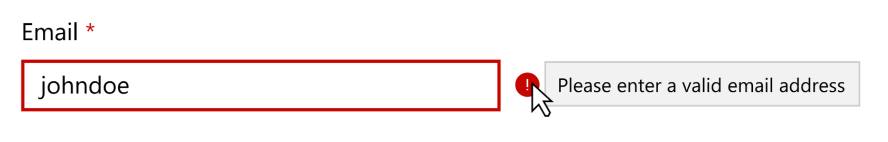

# Input field validation in UWP

Most applications that take user input need to have validation logic to ensure that the user has entered the expected information. The validation checks can be based on type, range, format, or other application-specific requirements. For example:



New Input validation features provide you with built in validation UI in input controls. To use the built in visuals, use x:Bind in your view and the INotifyDataErrorInfo interface in your model objects to populate the errors for your app and update the state of your view.

With the built-in validation UI you can check that the input users are providing into controls is correct before uploading to a data store. When incorrect, the control will display error messages and your chosen error message.

You can also provide description text to users to help guide them to a correct input format before errors occur.

To perform validation, you can port your existing .Net validation code forward from existing code. Use .Net APIs, like DataAnnotations that you already have, to populate your errors and update your view to benefit from the error styling.

## In this article

This article will cover the recommended way of performing end to end validation in the Universal Windows Platform.

This article will cover defining validation logic and reusing some of your exisiting validation logic, including leveraging .Net APIs in the [System.ComponentModel.DataAnnotations]() namespace for example.

Input fields, such as TextBox, have built in validation UI. Validation will be enabled by default when you are using [INotifyDataErrorInfo]() with x:Bind to update your view. The validation UI is part of the control template and can be customized without retemplating the control.

## Examples

<table>
<tr>
<td></img></td>
<td>
    <p>If you have the <strong style="font-weight: semi-bold">XAML Controls Gallery</strong> app installed, click here to <a href="xamlcontrolsgallery:/item/InputValidation">open the app and see input validation in action</a>.</p>
    <ul>
    <li><a href="https://www.microsoft.com/store/productId/9MSVH128X2ZT">Get the XAML Controls Gallery app (Microsoft Store)</a></li>
    <li><a href="https://github.com/Microsoft/Windows-universal-samples/tree/master/Samples/XamlUIBasics">Get the source code (GitHub)</a></li>
    </ul>
</td>
</tr>
</table>

## End to end input validation

In this sample, we want to display a validation error on a textbox when user input is invalid. This is the recommended model for validating fields. The validation logic with DataAnnoations displayed in this sample is proper to managed apps. Native apps can use INotifyDataErrorInfo as described below and substitute their current validation logic in place of the .Net APIs. 


 
Use [INotifyDataErrorInfo]() with x:Bind to update your view.  This API can be implemented by any class, and allows the object to raise an event if one of its properties is set to an invalid value.  When the source of a Xaml x:Bind implements this interface, the x:Bind will put the validation errors onto the bind target.  Xaml controls such as TextBox will recognize these errors and provide visualization for them.

#### View
A user input control with the input bound:
```xaml
<TextBox Name="ValidationTextbox" 
         Text="{x:Bind  ViewModel.Person.Name, 
                  UpdateSourceTrigger=PropertyChanged, 
                  Mode=TwoWay}>
```

#### ViewModel
The “ViewModel” property is the View Model for the Page on which this TextBox is displayed (this.ViewModel).
``` csharp
public class ViewModel
{
    public ViewModel()
    {
        Person = new Person();
    }

    public Person Person { get; set; }

}
```

#### C# only - Person (Model)
Person.Name is the source of the bind (this.ViewModel.Person.Name).  Person derives from ValidationWrapper (app code) which will provide the data validation for Name.  It’s marked with [MinLength] and [MaxLength] data annotations.  The property accessors use GetValue/SetValue in the base ValidationWrapper class for storage and to check the validity.
``` csharp
using System.ComponentModel.DataAnnotations;
    
public class Person : ValidationWrapper
{
    [MinLength(4, ErrorMessage = "Name must be at least 4 characters")]
    [MaxLength(6, ErrorMessage = "Name must be no more than 6 characters")]
    public string Name
    {	
        get { return GetValue<string>("Name"); }
        set { SetValue("Name", value); }
    }
}
```

#### INotifyDataErrorInfo base class
The NotifyDataErrorInfoBase class (app code) provides a reusable implementation of INotifyDataErrorInfo.  It’s the base of ValidationWrapper, which is the base class for Person.
``` csharp
public class NotifyDataErrorInfoBase : INotifyDataErrorInfo
{
    protected readonly Dictionary<string, ObservableCollection<ValidationError>> Errors;

    protected NotifyDataErrorInfoBase()
    {
        Errors = new Dictionary<string, List<string>>();
    }

    public bool HasErrors => Errors.Any();

    public event EventHandler<DataErrorsChangedEventArgs> ErrorsChanged;

    public ObservableCollection<ValidationError> GetErrors(string propertyName)
    {
        return propertyName != null && Errors.ContainsKey(propertyName)
            ? Errors[propertyName]
            : new ObservableCollection<ValidationError>();
    }

    protected virtual void OnErrorsChanged(string propertyName)
    {
        ErrorsChanged?.Invoke(this, new DataErrorsChangedEventArgs(propertyName));
    }

    protected void ClearErrors()
    {
        foreach (var propertyName in Errors.Keys.ToList())
        {
            Errors.Remove(propertyName);
            OnErrorsChanged(propertyName);
        }
    }
}
```

#### ValidationWrapper
ValidationWrapper derives from the above NotifyDataErrorInfoBase, and provides GetValue/SetValue methods for storage of subclass’ properties.  The SetValue performs validation.  This also provides an implementation of INotifyPropertyChanged.

``` csharp
public class ValidationWrapper : NotifyDataErrorInfoBase
{

    #region get/set
    protected T GetValue<T>(string propertyName)
    {
        if (string.IsNullOrEmpty(propertyName))
        {
            throw new ArgumentException("Invalid property name", propertyName);
        }

        object value;
        value = default(T);

        return (T)value;
    }

    // Validate() gets called from inside SetValue
    protected void SetValue<T>(string propertyName, T value)
    {
        if (string.IsNullOrEmpty(propertyName))
        {
            throw new ArgumentException("Invalid property name", propertyName);
        }

        var current = GetValue<T>(propertyName);

        if (!value.Equals(current))
        {
            PropertyChanged?.Invoke(
                    this, new PropertyChangedEventArgs(propertyName));
            Validate(propertyName);
        }
    }
    #endregion

    #region Populate errors (C# - DataAnnotations)
    private Task Validate(string propertyName)
    {
        ClearErrors();


        return Task.Run(() =>
        {
            var val = GetPropertyValue(propertyName);
            var results = new ObservableCollection<ValidationResult>();
            var context = new ValidationContext(this, null, null) 
                            { MemberName = propertyName };
    
            // Validator is from the .Net System.ComponentModel.DataAnnotations namespace
            Validator.TryValidateProperty(val, context, results);

            if (results.Any())
            {
                    foreach (var result in results)
                    {
                        Errors[propertyName].Add(new ValidationError(result.ErrorMessage));
                    }
            }

                OnErrorsChanged(propertyName);
            }

        }
    }
    #endregion

    #region privates
    private object GetPropertyValue([CallerMemberName] string propertyName = "")
    {
        return _values.ContainsKey(propertyName) ? _values[propertyName] : null;
    }

    #endregion
    }
}
```


## Switching between default validation modes

Each control has 2 default UI validation modes: compact and inline. These UI validation modes are part of the control and take part in layout. 

In this sample, we show you how to switch between the 2 default UI validation modes on a control. See the above end to end scenario for details on validation logic.

In compact mode, when errors are present, a bang appears to the right of the control. Hovering over the bang provides the error message with the tooltip text. The tooltip content is equivalent to the content that you would see for the error messages in inline mode.

In inline mode, the control will leave the necessary space for one line of validation. Adding more than one line of validation will cause layout to move. If you do not wish for the control to take up the space, use compact mode or turn the system validation visuals off.

Compact is the default ValidationVisualKind.

**Inline**


**Compact**


```xaml
<TextBox    x:Name="Email" 
            Header="Email" 
            ValidationVisualKind="Compact"
            Text="{x:Bind ViewModel.Person.Email, 
                          UpdateSourceTrigger=PropertyChanged,
                          Mode=TwoWay}"/>
```
#### Model
```csharp
public class Person : ValidationWrapper
{
    [Required]
    [EmailAddress(ErrorMessage = "Please enter a valid email address")]
    public string Email
    {
        get { return GetValue<string>("Email"); }
        set { SetValue("Email", value); }
    }
}
```

## Using non-default validation visuals
You can create your own visuals for the error message style and not use the control’s visuals at all.

To do this, turn off the system error visuals and then display the content from the errors collection in your own custom UI.


```xaml
<TextBox 
        x:Name="Name" 
        Header="Name: " 
        PlaceholderText="Enter Name..." 

        Text="{x:Bind   ViewModel.Person.Name, 
                        UpdateSourceTrigger=PropertyChanged, 
                        Mode=TwoWay}" 
         UseSystemValidationVisuals="False"
        />

<!-- Custom error message template -->
<ItemsControl
    ItemsSource="{x:Bind Name.(Validation.Errors), Mode=OneWay}"
    Foreground="Red">

    <ItemsControl.ItemTemplate>
        <DataTemplate x:DataType="ValidationError">
            <StackPanel Orientation="Horizontal" Spacing="5">
                <Border Background="Red" Margin="3" CornerRadius="10" 
                        Width="12" Height="12" VerticalAlignment="Top">
                    <TextBlock Text="!" Foreground="White" 
                               HorizontalAlignment="Center" VerticalAlignment="Center"/>
                </Border>
                <TextBlock Text="{x:Bind ErrorMessage, Mode=OneWay}"
                           />
            </StackPanel>
        </DataTemplate>
    </ItemsControl.ItemTemplate>
</ItemsControl>

```


## Customizing the content of the system error template
To modify the styling and content of your error template, use the Validation.ErrorTemplate property. The Validation.ErrorTemplate refers to either the content of the tooltip or the content of the container below the control depending on the validation mode.

If you wish to override the default visuals for errors across all forms elements in your app, override the **ValidationErrorTemplate** DataTemplate and use in your app.


**OR**


```xaml
<ResourceDictionary>
    <DataTemplate x:Key="ValidationErrorTemplate">
        <StackPanel Orientation="Horizontal">
            <Border Background="Red" Margin="3" CornerRadius="10" Width="20" Height="20" VerticalAlignment="Top">
                <TextBlock Text="!" Foreground="White"
                HorizontalAlignment="Center" VerticalAlignment="Center"/>
            </Border>
            <TextBlock Text="{x:Bind (Validation.Errors)[0].ErrorContent, Mode=OneWay}"
        </StackPanel>
    </DataTemplate>
</ResourceDictionary>

<TextBox Validation.ErrorTemplate="{StaticResource ValidationErrorTemplate}"/>
```


## Changing the resource color for the error and description messages
Colors for the error and description messages are defined in a standard color/brush pattern in generic.xaml that can be overridden at an app level.

```xaml
<Application.Resources>

    <!--Color for error messages-->
    <Color x:Key="SystemErrorColor">#CE3880</Color>
    <SolidColorBrush x:Key="SystemControlErrorTextForegroundBrush" Value="SystemErrorColor"/>

    <!--Brush for description messages-->
    <SolidColorBrush x:Key="SystemControlDescriptionTextForegroundBrush" Value="SystemControlPageTextBaseMediumBrush"/>

</Application.Resources>
```

## Changing description text for validation

Description text provides input to the end user on what format or content is expected from the control when it is not clear from the header and placeholder text.

You can choose to either show the description text for a control or not. Default is that description text is off. 

<!-- NOTE TO DOC EDITOR -- BULLET POINT 2 HAS VERBIAGE TAKEN VERBATIM FROM A 3RD PARTY WEBSITE - CAN WE REPHRASE SOME OF THE ITEMS TO BE OUR OWN MICROSOFT VOICE? -->

Description text should be used to complement headers and placeholders. Use the following guidance to know which one to use: 
1.	Headers give you an indication of what the control represents. They are used to catch the eye of a user scanning your form or to refer to a field.
2.	Placeholders provide a succinct description of what should be input in the box. However, they aren’t an ideal pattern for guiding users input because user testing continually shows that placeholders in form fields often hurt usability more than help it. This is because: 
    - Disappearing placeholder text strains users’ short-term memory.
    -	Users may mistake a placeholder for data that was automatically filled in.
    -	The default light-grey color of placeholder text has poor color contrast against most backgrounds.
    -	Not all screen readers read placeholder text aloud
    -	Often incompatible with autofill – you need to delete field content before finding the hint.
3.	Description text is used to complement placeholder text. It provides more detailed formatting guidance that is needed while editing the field. 


**Description text:**

 

**Post validation:**

 

```xaml
    <TextBox 
            x:Name="FirstName" 
            Header="First Name:" 
            Text="{x:Bind   ViewModel.Person.FirstName, 
                            UpdateSourceTrigger=LostFocus, 
                            Mode=TwoWay}"
            DescriptionText="Use alphabetical characters (a-Z)."
        />
```

#### Model
```csharp
    public class Person : ValidationWrapper
    {
        [Required]
        [RegularExpression(@"^[a-zA-Z''-'\s]{1,40}$", ErrorMessage ="Use alphabetical characters (a-Z).")]
        public string FirstName {
            get { return GetValue<string>("FirstName"); }
            set { SetValue("FirstName", value); }
        }
    }
```

## Validation for view-centric developers
Code a view-centric (Winforms-like) developer would write to enable Validation.

 

```xaml
<TextBox x:Name="Email" 
         Header="Email" 
         Validation.IsRequired="True" 
         TextChanged="TextBox_TextChanged"/>
```

```csharp
private void TextBox_TextChanged(object sender, TextChangedEventArgs e)
{
    WinformsValidate(sender, e);
}

private void WinformsValidate(object sender, TextChangedEventArgs e)
{
    var foo = sender as TextBox;
    Validation.ClearErrors(foo);
    Validation.AddErrorHandler(foo, OnValidationError);

    if (!new EmailAddressAttribute().IsValid(foo.Text))
    {

        var ErrorsCollection = Validation.GetErrors(foo);
        ErrorsCollection.Add(new ValidationError("Email is not a valid email address"));
    }
}

private void OnValidationError(object sender, ValidationErrorEventArgs e)
{
    if (e.Action == ValidationErrorEventAction.Added)
        // Do something when an error message was added
    else
        // Do something when an error was removed.

        SaveButton.IsEnabled = Validation.GetErrors(e.Source);
}
```

## Get the sample code

- [XAML Controls Gallery sample](https://github.com/Microsoft/Windows-universal-samples/tree/master/Samples/XAMLUIBasics)

## Related topics
- [Input controls](controls-and-events-intro.md)
- [Typography](../style/typography.md)
- [Forms](forms.md)