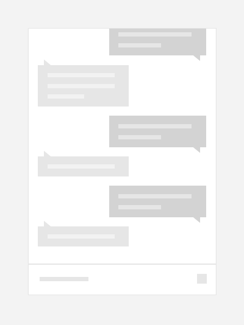

# Inverted lists

 

You can use a list view to present a conversation in a chat experience with items that are visually distinct to represent the sender/receiver.  Using different colors and horizontal alignment to separate messages from the sender/receiver helps the user quickly orient themselves in a conversation.

> **Important APIs**:  [ListView class](/uwp/api/windows.ui.xaml.controls.listview), [ItemsStackPanel class](/uwp/api/windows.ui.xaml.controls.itemsstackpanel), [ItemsUpdatingScrollMode property](/uwp/api/windows.ui.xaml.controls.itemsstackpanel.itemsupdatingscrollmode)
 
You will typically need to present the list such that it appears to grow from the bottom up instead of from the top down.  When a new message arrives and is added to the end, the previous messages slide up to make room drawing the user’s attention to the latest arrival.  However, if a user has scrolled up to view previous replies then the arrival of a new message must not cause a visual shift that would disrupt their focus.



## Create an inverted list

To create an inverted list, use a list view with an [ItemsStackPanel](/uwp/api/windows.ui.xaml.controls.itemsstackpanel) as its items panel. On the ItemsStackPanel, set the [ItemsUpdatingScrollMode](/uwp/api/windows.ui.xaml.controls.itemsstackpanel.itemsupdatingscrollmode) to [KeepLastItemInView](/uwp/api/windows.ui.xaml.controls.itemsupdatingscrollmode).

> [!IMPORTANT]
> The **KeepLastItemInView** enum value is available starting with Windows 10, version 1607. You can't use this value when your app runs on earlier versions of Windows 10.

This example shows how to align the list view’s items to the bottom and indicate that when there is a change to the items the last item should remain in view.
 
 **XAML**
 ```xaml
<ListView>
    <ListView.ItemsPanel>
        <ItemsPanelTemplate>
            <ItemsStackPanel VerticalAlignment="Bottom"
                             ItemsUpdatingScrollMode="KeepLastItemInView"/>
        </ItemsPanelTemplate>
    </ListView.ItemsPanel>
</ListView>
```

## Do's and don'ts

- Align messages from the sender/receiver on opposite sides to make the flow of conversation clear to users.
- Animate the existing messages out of the way to display the latest message if the user is already at the end of the conversation awaiting the next message.
- Don’t disrupt the users focus by moving items if they’re not reading the end of the conversation.

## Get the sample code

- [XAML Bottom-up list sample](https://github.com/Microsoft/Windows-universal-samples/tree/master/Samples/XamlBottomUpList)