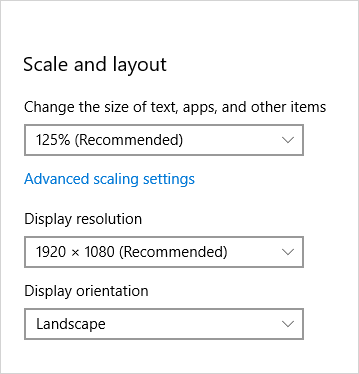

# Labels

 

A label is the name or title of a control or a group of related controls.

> **Important APIs**: Header property, [TextBlock class](/uwp/api/Windows.UI.Xaml.Controls.TextBlock)

In XAML, many controls have a built-in Header property that you use to display the label. For controls that don't have a Header property, or to label groups of controls, you can use a [TextBlock](/uwp/api/Windows.UI.Xaml.Controls.TextBlock) instead.

## Recommendations

-   Use a label to indicate to the user what they should enter into an adjacent control. You can also label a group of related controls, or display instructional text near a group of related controls.
-   When labeling controls, write the label as a noun or a concise noun phrase, not as a sentence, and not as instructional text. Avoid colons or other punctuation.
-   When you do have instructional text in a label, you can be more generous with text-string length and also use punctuation.

## Get the sample code
* [XAML UI basics sample](https://github.com/Microsoft/Windows-universal-samples/tree/master/Samples/XamlUIBasics)

## Related topics
* [Text controls](text-controls.md)
* [TextBox.Header property](/uwp/api/windows.ui.xaml.controls.textbox.header)
* [PasswordBox.Header property](/uwp/api/windows.ui.xaml.controls.passwordbox.header)
* [ToggleSwitch.Header property](/uwp/api/windows.ui.xaml.controls.toggleswitch.header)
* [DatePicker.Header property](/uwp/api/windows.ui.xaml.controls.datepicker.header)
* [TimePicker.Header property](/uwp/api/windows.ui.xaml.controls.timepicker.header)
* [Slider.Header property](/uwp/api/windows.ui.xaml.controls.slider.header)
* [ComboBox.Header property](/uwp/api/windows.ui.xaml.controls.combobox.header)
* [RichEditBox.Header property](/uwp/api/windows.ui.xaml.controls.richeditbox.header)
* [TextBlock class](/uwp/api/Windows.UI.Xaml.Controls.TextBlock)

 

 