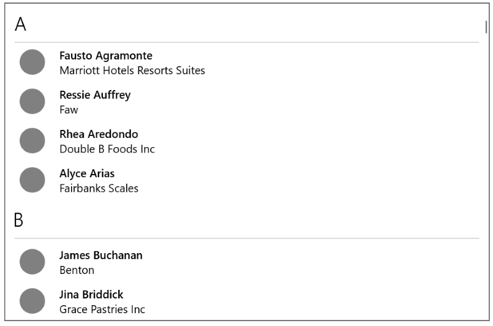
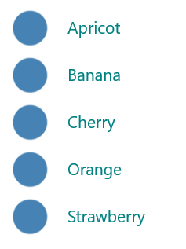
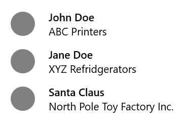
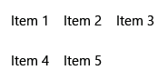

# List view and grid view

Most applications manipulate and display sets of data, such as a gallery of images or a set of email messages. The XAML UI framework provides ListView and GridView controls that make it easy to display and manipulate data in your app.  

> **Important APIs**: [ListView class](/uwp/api/windows.ui.xaml.controls.listview), [GridView class](/uwp/api/windows.ui.xaml.controls.gridview), [ItemsSource property](/uwp/api/windows.ui.xaml.controls.itemscontrol.itemssource), [Items property](/uwp/api/windows.ui.xaml.controls.itemscontrol.items)

> [!NOTE]
> ListView and GridView both derive from the [ListViewBase](/uwp/api/windows.ui.xaml.controls.listviewbase) class, so they have the same functionality, but display data differently. In this article, when we talk about list view, the info applies to both the ListView and GridView controls unless otherwise specified. We may refer to classes like ListView or ListViewItem, but the *List* prefix can be replaced with *Grid* for the corresponding grid equivalent (GridView or GridViewItem). 

ListView and GridView provide many benefits for working with collections. They are both easy to implement and provide basic UI; interaction; and scrolling while still being easily customizable. ListView and GridView can be bound to existing dynamic data sources, or hard-coded data provided in the XAML itself/the code-behind. 

These two controls are flexible to many use cases, but overall work best with collections in which all items should have the same basic structure and appearance, as well as the same interaction behavior - i.e. they should all perform the same action when clicked (open a link, navigate, etc).


## Differences between ListView and GridView

### ListView
The ListView displays data stacked vertically in a single column. ListView works better for items that have text as a focal point, and for collections that are meant to be read top to bottom (i.e. alphabetically ordered). A few common use cases for ListView include lists of messages and search results. Collections that need to be displayed in multiple columns or in a table-like format should _not_ use ListView, but should look into using a [DataGrid](/windows/communitytoolkit/controls/datagrid) instead.



### GridView
The GridView presents a collection of items in rows and columns that can scroll vertically. Data is stacked horizontally until it fills the columns, then continues with the next row. GridView works better for items that have images as their focal point, and for collections that can be read from side-to-side or are not sorted in a specific order. A common use case for GridView is a photo or product gallery.


## Which collection control should you use? A Comparison with ItemsRepeater

ListView and GridView are controls that work out-of-the-box to display any collection, with their own built-in UI and UX. The [ItemsRepeater](./items-repeater.md) control also is used to display collections, but was created as a building block for creating a custom control that fits your exact UI needs. The most important differences that should impact which control you end up using are below:

-	ListView and GridView are feature-rich controls that require little customization but offer plenty. ItemsRepeater is a building block to create your own layout control and does not have the same built in features and functionality - it requires you to implement any necessary features or interactions.
-	ItemsRepeater should be used if you have a highly custom UI that you can’t create using ListView or GridView, or if you have a data source that requires highly different behavior for each item.


Learn more about ItemsRepeater by reading its [Guidelines](./items-repeater.md) and [API Documentation](/uwp/api/microsoft.ui.xaml.controls.itemsrepeater?view=winui-2.2) pages.

## Examples

<table>
<th align="left">XAML Controls Gallery<th>
<tr>
<td></img></td>
<td>
    <p>If you have the <strong style="font-weight: semi-bold">XAML Controls Gallery</strong> app installed, click here to open the app and see the <a href="xamlcontrolsgallery:/item/ListView">ListView</a> or <a href="xamlcontrolsgallery:/item/GridView">GridView</a> in action.</p>
    <ul>
    <li><a href="https://www.microsoft.com/store/productId/9MSVH128X2ZT">Get the XAML Controls Gallery app (Microsoft Store)</a></li>
    <li><a href="https://github.com/Microsoft/Xaml-Controls-Gallery">Get the source code (GitHub)</a></li>
    </ul>
</td>
</tr>
</table>

## Create a ListView or GridView

ListView and GridView are both [ItemsControl](/uwp/api/windows.ui.xaml.controls.itemscontrol) types, so they can contain a collection of items of any type. A ListView or GridView must have items in its [Items](/uwp/api/windows.ui.xaml.controls.itemscontrol.items) collection before it can show anything on the screen. To populate the view, you can add items directly to the [Items](/uwp/api/windows.ui.xaml.controls.itemscontrol.items) collection, or set the [ItemsSource](/uwp/api/windows.ui.xaml.controls.itemscontrol.itemssource) property to a data source. 

> [!IMPORTANT]
> You can use either Items or ItemsSource to populate the list, but you can't use both at the same time. If you set the ItemsSource property and you add an item in XAML, the added item is ignored. If you set the ItemsSource property and you add an item to the Items collection in code, an exception is thrown.

Many of the examples in this article populate the `Items` collection directly for the sake of simplicity. However, it's more common for the items in a list to come from a dynamic source, like a list of books from an online database. You use the `ItemsSource` property for this purpose. 

### Add Items to a ListView or GridView

You can add items to the ListView or GridView's [Items](/uwp/api/windows.ui.xaml.controls.itemscontrol.items) collection using XAML or code to yield the same result. You typically add items through XAML if you have a small number of items that don't change and are easily defined, or if you generate the items in code at run time. 

<u>Method 1: Add items to the Items Collection</u>
#### Option 1: Add Items through XAML
```xml
<!-- No corresponding C# code is needed for this example. -->

<ListView x:Name="Fruits"> 
   <x:String>Apricot</x:String> 
   <x:String>Banana</x:String> 
   <x:String>Cherry</x:String> 
   <x:String>Orange</x:String> 
   <x:String>Strawberry</x:String> 
</ListView>  
```


#### Option 2: Add Items through C#

##### C# Code:
```csharp
// Create a new ListView and add content. 
ListView Fruits = new ListView(); 
Fruits.Items.Add("Apricot"); 
Fruits.Items.Add("Banana"); 
Fruits.Items.Add("Cherry"); 
Fruits.Items.Add("Orange"); 
Fruits.Items.Add("Strawberry");
 
// Add the ListView to a parent container in the visual tree (that you created in the corresponding XAML file).
FruitsPanel.Children.Add(Fruits); 
```

##### Corresponding XAML Code:
```xml
<StackPanel Name="FruitsPanel"></StackPanel>
```
Both of the above options will result in the same ListView, which is shown below:


<br/>
<u> Method 2: Add items by setting the ItemsSource</u>

You typically use a ListView or GridView to display data from a source such as a database or the Internet. To populate a  ListView/GridView from a data source, you set its [ItemsSource](/uwp/api/windows.ui.xaml.controls.itemscontrol.itemssource) property to a collection of data items. This method works better if your ListView or GridView is going to hold custom class objects, as shown in the examples below.

#### Option 1: Set ItemsSource in C#
Here, the list view's ItemsSource is set in code directly to an instance of a collection. 

##### C# Code:
```csharp 
// Class defintion should be provided within the namespace being used, outside of any other classes.

this.InitializeComponent();

// Instead of adding hard coded items to an ObservableCollection as shown below, 
//the data could be pulled asynchronously from a database or the internet.
ObservableCollection<Contact> Contacts = new ObservableCollection<Contact>();

// Contact objects are created by providing a first name, last name, and company for the Contact constructor.
// They are then added to the ObservableCollection Contacts.
Contacts.Add(new Contact("John", "Doe", "ABC Printers"));
Contacts.Add(new Contact("Jane", "Doe", "XYZ Refridgerators"));
Contacts.Add(new Contact("Santa", "Claus", "North Pole Toy Factory Inc."));

// Create a new ListView (or GridView) for the UI, add content by setting ItemsSource
ListView ContactsLV = new ListView();
ContactsLV.ItemsSource = Contacts;

// Add the ListView to a parent container in the visual tree (that you created in the corresponding XAML file)
ContactPanel.Children.Add(ContactsLV);
```

##### XAML Code:
```xml
<StackPanel x:Name="ContactPanel"></StackPanel>
```

#### Option 2: Set ItemsSource in XAML
You can also bind the ItemsSource property to a collection in the XAML. Here, the ItemsSource is bound to a public property named `Contacts` that exposes the Page's private data collection, `_contacts`.

**XAML**
```xml
<ListView x:Name="ContactsLV" ItemsSource="{x:Bind Contacts}"/>
```

**C#**
```csharp
// Class defintion should be provided within the namespace being used, outside of any other classes.
// These two declarations belong outside of the main page class.
private ObservableCollection<Contact> _contacts = new ObservableCollection<Contact>();

public ObservableCollection<Contact> Contacts
{
    get { return this._contacts; }
}

// This method should be defined within your main page class.
protected override void OnNavigatedTo(NavigationEventArgs e)
{
    base.OnNavigatedTo(e);

    // Instead of hard coded items, the data could be pulled 
    // asynchronously from a database or the internet.
    Contacts.Add(new Contact("John", "Doe", "ABC Printers"));
    Contacts.Add(new Contact("Jane", "Doe", "XYZ Refridgerators"));
    Contacts.Add(new Contact("Santa", "Claus", "North Pole Toy Factory Inc."));
}
```

Both of the above options will result in the same ListView, shown below. The ListView only shows the string representation of each item because we did not provide a data template.


> [!IMPORTANT]
> With no data template defined, custom class objects will only appear in the ListView with their string value  if they have a defined [ToString()](/uwp/api/windows.foundation.istringable.tostring) method.

 The next section will go into detail on how to visually represent simple and custom class items properly in a ListView or GridView.

For more info about data binding, see [Data binding overview](../../data-binding/data-binding-quickstart.md).

> [!NOTE]
> If you need to show grouped data in your ListView, you must bind to a [CollectionViewSource](/uwp/api/Windows.UI.Xaml.Data.CollectionViewSource). The CollectionViewSource acts as a proxy for the collection class in XAML and enables grouping support. For more info, see [CollectionViewSource](/uwp/api/Windows.UI.Xaml.Data.CollectionViewSource).

## Customizing the look of items with a DataTemplate

A data template in a ListView or GridView defines how the items/data are visualized. By default, a data item is displayed in the ListView as the string representation of the data object it's bound to. You can show the string representation of a particular property of the data item by setting the [DisplayMemberPath](/uwp/api/windows.ui.xaml.controls.itemscontrol.displaymemberpath) to that property.

However, you typically want to show a more rich presentation of your data. To specify exactly how items in the ListView/GridView are displayed, you create a [DataTemplate](/uwp/api/Windows.UI.Xaml.DataTemplate). The XAML in the DataTemplate defines the layout and appearance of controls used to display an individual item. The controls in the layout can be bound to properties of a data object, or have static content defined inline. 

> [!NOTE]
> When you use the [x:Bind markup extension](../../xaml-platform/x-bind-markup-extension.md) in a DataTemplate, you have to specify the DataType (`x:DataType`) on the DataTemplate.

#### Simple ListView Data Template
In this example, the data item is a simple string. A DataTemplate is defined inline within the ListView definition to add an image to the left of the string, and show the string in teal. This is the same ListView created from using Method 1 and Option 1 shown above.

**XAML**
```XML
<!--No corresponding C# code is needed for this example.-->
<ListView x:Name="FruitsList">
                <ListView.ItemTemplate>
                    <DataTemplate x:DataType="x:String">
                        <Grid>
                            <Grid.ColumnDefinitions>
                                <ColumnDefinition Width="47"/>
                                <ColumnDefinition/>
                            </Grid.ColumnDefinitions>
                            <Image Source="Assets/placeholder.png" Width="32" Height="32"
                                HorizontalAlignment="Left" VerticalAlignment="Center"/>
                            <TextBlock Text="{x:Bind}" Foreground="Teal" FontSize="14" 
                                Grid.Column="1" VerticalAlignment="Center"/>
                        </Grid>
                    </DataTemplate>
                </ListView.ItemTemplate>
                <x:String>Apricot</x:String>
                <x:String>Banana</x:String>
                <x:String>Cherry</x:String>
                <x:String>Orange</x:String>
                <x:String>Strawberry</x:String>
            </ListView>

```

Here's what the data items look like when displayed with this data template in a ListView:



#### ListView Data Template for Custom Class Objects
In this example, the data item is a Contact object. A DataTemplate is defined inline within the ListView definition to add the contact image to the left of the Contact name and company. This ListView was created by using Method 2 and Option 2 mentioned above.
```xml
<ListView x:Name="ContactsLV" ItemsSource="{x:Bind Contacts}">
    <ListView.ItemTemplate>
        <DataTemplate x:DataType="local:Contact">
            <Grid>
                <Grid.RowDefinitions>
                    <RowDefinition Height="*"/>
                    <RowDefinition Height="*"/>
                </Grid.RowDefinitions>
                <Grid.ColumnDefinitions>
                    <ColumnDefinition Width="Auto"/>
                    <ColumnDefinition Width="*"/>
                </Grid.ColumnDefinitions>
                <Image Grid.Column="0" Grid.RowSpan="2" Source="Assets/grey-placeholder.png" Width="32"
                    Height="32" HorizontalAlignment="Center" VerticalAlignment="Center"></Image>
                <TextBlock Grid.Column="1" Text="{x:Bind Name}" Margin="12,6,0,0" 
                    Style="{ThemeResource BaseTextBlockStyle}"/>
                <TextBlock  Grid.Column="1" Grid.Row="1" Text="{x:Bind Company}" Margin="12,0,0,6" 
                    Style="{ThemeResource BodyTextBlockStyle}"/>
            </Grid>
        </DataTemplate>
    </ListView.ItemTemplate>
</ListView>
```

Here's what the data items look like when displayed using this data template in a ListView:



Data templates are the primary way you define the look of your ListView. They can also have a significant impact on performance if your list holds a large number of items.  

Your data template can be defined inline within the ListView/GridView definition (shown above), or separately in a Resources section. If defined outside of the ListView/GridView itself, the DataTemplate must be given an [x:Key](../../xaml-platform/x-key-attribute.md) attribute and be assigned to the [ItemTemplate](/uwp/api/windows.ui.xaml.controls.itemscontrol.itemtemplate) property of the ListView or GridView using that key.

For more info and examples of how to use data templates and item containers to define the look of items in your list or grid, see [Item containers and templates](item-containers-templates.md). 

## Change the layout of items

When you add items to a ListView or GridView, the control automatically wraps each item in an item container and then lays out all of the item containers. How these item containers are laid out depends on the [ItemsPanel](/uwp/api/windows.ui.xaml.controls.itemscontrol.itemspanel) of the control.  
- By default, **ListView** uses an [ItemsStackPanel](/uwp/api/windows.ui.xaml.controls.itemsstackpanel), which produces a vertical list, like this.


- **GridView** uses an [ItemsWrapGrid](/uwp/api/windows.ui.xaml.controls.itemswrapgrid), which adds items horizontally, and wraps and scrolls vertically, like this.



You can modify the layout of items by adjusting properties on the items panel, or you can replace the default panel with another panel.

> [!NOTE]
> Be careful to not disable virtualization if you change the ItemsPanel. Both **ItemsStackPanel** and **ItemsWrapGrid** support virtualization, so these are safe to use. If you use any other panel, you might disable virtualization and slow the performance of the list view. For more info, see the list view articles under [Performance](../../debug-test-perf/performance-and-xaml-ui.md). 

This example shows how to make a **ListView** lay out its item containers in a horizontal list by changing the [Orientation](/uwp/api/windows.ui.xaml.controls.itemsstackpanel.orientation) property of the **ItemsStackPanel**.
Because the list view scrolls vertically by default, you also need to adjust some properties on the list view’s internal [ScrollViewer](/uwp/api/windows.ui.xaml.controls.scrollviewer) to make it scroll horizontally.
- [ScrollViewer.HorizontalScrollMode](/uwp/api/windows.ui.xaml.controls.scrollviewer.horizontalscrollmode) to **Enabled** or **Auto**
- [ScrollViewer.HorizontalScrollBarVisibility](/uwp/api/windows.ui.xaml.controls.scrollviewer.horizontalscrollbarvisibility) to **Auto** 
- [ScrollViewer.VerticalScrollMode](/uwp/api/windows.ui.xaml.controls.scrollviewer.verticalscrollmode) to **Disabled** 
- [ScrollViewer.VerticalScrollBarVisibility](/uwp/api/windows.ui.xaml.controls.scrollviewer.verticalscrollbarvisibility) to **Hidden** 

> [!IMPORTANT]
> These examples are shown with the list view width unconstrained, so the horizontal scrollbars are not shown. If you run this code, you can set `Width="180"` on the ListView to make the scrollbars show.

**XAML**
```xml
<ListView Height="60" 
          ScrollViewer.HorizontalScrollMode="Enabled" 
          ScrollViewer.HorizontalScrollBarVisibility="Auto"
          ScrollViewer.VerticalScrollMode="Disabled"
          ScrollViewer.VerticalScrollBarVisibility="Hidden">
    <ListView.ItemsPanel>
        <ItemsPanelTemplate>
            <ItemsStackPanel Orientation="Horizontal"/>
        </ItemsPanelTemplate>
    </ListView.ItemsPanel>
    <x:String>Apricot</x:String>
    <x:String>Banana</x:String>
    <x:String>Cherry</x:String>
    <x:String>Orange</x:String>
    <x:String>Strawberry</x:String>
</ListView>
```

The resulting list looks like this.


 In the next example, the **ListView** lays out items in a vertical wrapping list by using an **ItemsWrapGrid** instead of an **ItemsStackPanel**. 
 
> [!IMPORTANT]
> The height of the list view must be constrained to force the control to wrap the containers.

**XAML**
```xml
<ListView Height="100"
          ScrollViewer.HorizontalScrollMode="Enabled" 
          ScrollViewer.HorizontalScrollBarVisibility="Auto"
          ScrollViewer.VerticalScrollMode="Disabled"
          ScrollViewer.VerticalScrollBarVisibility="Hidden">
    <ListView.ItemsPanel>
        <ItemsPanelTemplate>
            <ItemsWrapGrid/>
        </ItemsPanelTemplate>
    </ListView.ItemsPanel>
    <x:String>Apricot</x:String>
    <x:String>Banana</x:String>
    <x:String>Cherry</x:String>
    <x:String>Orange</x:String>
    <x:String>Strawberry</x:String>
</ListView>
```

The resulting list looks like this.


If you show grouped data in your list view, the ItemsPanel determines how the item groups are layed out, not how the individual items are layed out. For example, if the horizontal ItemsStackPanel shown previously is used to show grouped data, the groups are arranged horizontally, but the items in each group are still stacked vertically, as shown here.


## Item selection and interaction

You can choose from various ways to let a user interact with a list view. By default, a user can select a single item. You can change the [SelectionMode](/uwp/api/windows.ui.xaml.controls.listviewbase.selectionmode) property to enable multi-selection or to disable selection. You can set the [IsItemClickEnabled](/uwp/api/windows.ui.xaml.controls.listviewbase.isitemclickenabled) property so that a user clicks an item to invoke an action (like a button) instead of selecting the item.

> **Note**&nbsp;&nbsp;Both ListView and GridView use the [ListViewSelectionMode](/uwp/api/windows.ui.xaml.controls.listviewselectionmode) enumeration for their SelectionMode properties. IsItemClickEnabled is **False** by default, so you need to set it only to enable click mode.

This table shows the ways a user can interact with a list view, and how you can respond to the interaction.

To enable this interaction: | Use these settings: | Handle this event: | Use this property to get the selected item:
----------------------------|---------------------|--------------------|--------------------------------------------
No interaction | [SelectionMode](/uwp/api/windows.ui.xaml.controls.listviewbase.selectionmode) = **None**, [IsItemClickEnabled](/uwp/api/windows.ui.xaml.controls.listviewbase.isitemclickenabled) = **False** | N/A | N/A 
Single selection | SelectionMode = **Single**, IsItemClickEnabled = **False** | [SelectionChanged](/uwp/api/windows.ui.xaml.controls.primitives.selector.selectionchanged) | [SelectedItem](/uwp/api/windows.ui.xaml.controls.primitives.selector.selecteditem), [SelectedIndex](/uwp/api/windows.ui.xaml.controls.primitives.selector.selectedindex)  
Multiple selection | SelectionMode = **Multiple**, IsItemClickEnabled = **False** | [SelectionChanged](/uwp/api/windows.ui.xaml.controls.primitives.selector.selectionchanged) | [SelectedItems](/uwp/api/windows.ui.xaml.controls.listviewbase.selecteditems)  
Extended selection | SelectionMode = **Extended**, IsItemClickEnabled = **False** | [SelectionChanged](/uwp/api/windows.ui.xaml.controls.primitives.selector.selectionchanged) | [SelectedItems](/uwp/api/windows.ui.xaml.controls.listviewbase.selecteditems)  
Click | SelectionMode = **None**, IsItemClickEnabled = **True** | [ItemClick](/uwp/api/windows.ui.xaml.controls.listviewbase.itemclick) | N/A 

> **Note**&nbsp;&nbsp;Starting in Windows 10, you can enable IsItemClickEnabled to raise an ItemClick event while SelectionMode is also set to Single, Multiple, or Extended. If you do this, the ItemClick event is raised first, and then the SelectionChanged event is raised. In some cases, like if you navigate to another page in the ItemClick event handler, the SelectionChanged event is not raised and the item is not selected.

You can set these properties in XAML or in code, as shown here.

**XAML**
```xaml
<ListView x:Name="myListView" SelectionMode="Multiple"/>

<GridView x:Name="myGridView" SelectionMode="None" IsItemClickEnabled="True"/> 
```

**C#**
```csharp
myListView.SelectionMode = ListViewSelectionMode.Multiple; 

myGridView.SelectionMode = ListViewSelectionMode.None;
myGridView.IsItemClickEnabled = true;
```

### Read-only

You can set the SelectionMode property to **ListViewSelectionMode.None** to disable item selection. This puts the control in read only mode, to be used for displaying data, but not for interacting with it. The control itself is not disabled, only item selection is disabled.

### Single selection

This table describes the keyboard, mouse, and touch interactions when SelectionMode is **Single**.

Modifier key | Interaction
-------------|------------
None | <li>A user can select a single item using the space bar, mouse click, or touch tap.</li>
Ctrl | <li>A user can deselect a single item using the space bar, mouse click, or touch tap.</li><li>Using the arrow keys, a user can move focus independently of selection.</li>

When SelectionMode is **Single**, you can get the selected data item from the [SelectedItem](/uwp/api/windows.ui.xaml.controls.primitives.selector.selecteditem) property. You can get the index in the collection of the selected item using the [SelectedIndex](/uwp/api/windows.ui.xaml.controls.primitives.selector.selectedindex) property. If no item is selected, SelectedItem is **null**, and SelectedIndex is -1. 
 
If you try to set an item that is not in the **Items** collection as the **SelectedItem**, the operation is ignored and SelectedItem is**null**. However, if you try to set the **SelectedIndex** to an index that's out of the range of the **Items** in the list, a **System.ArgumentException** exception occurs. 

### Multiple selection

This table describes the keyboard, mouse, and touch interactions when SelectionMode is **Multiple**.

Modifier key | Interaction
-------------|------------
None | <li>A user can select multiple items using the space bar, mouse click, or touch tap to toggle selection on the focused item.</li><li>Using the arrow keys, a user can move focus independently of selection.</li>
Shift | <li>A user can select multiple contiguous items by clicking or tapping the first item in the selection and then the last item in the selection.</li><li>Using the arrow keys, a user can create a contiguous selection starting with the item selected when Shift is pressed.</li>

### Extended selection

This table describes the keyboard, mouse, and touch interactions when SelectionMode is **Extended**.

Modifier key | Interaction
-------------|------------
None | <li>The behavior is the same as **Single** selection.</li>
Ctrl | <li>A user can select multiple items using the space bar, mouse click, or touch tap to toggle selection on the focused item.</li><li>Using the arrow keys, a user can move focus independently of selection.</li>
Shift | <li>A user can select multiple contiguous items by clicking or tapping the first item in the selection and then the last item in the selection.</li><li>Using the arrow keys, a user can create a contiguous selection starting with the item selected when Shift is pressed.</li>

When SelectionMode is **Multiple** or **Extended**, you can get the selected data items from the [SelectedItems](/uwp/api/windows.ui.xaml.controls.listviewbase.selecteditems) property. 

The **SelectedIndex**, **SelectedItem**, and **SelectedItems** properties are synchronized. For example, if you set SelectedIndex to -1, SelectedItem is set to **null** and SelectedItems is empty; if you set SelectedItem to **null**, SelectedIndex is set to -1 and SelectedItems is empty.

In multi-select mode, **SelectedItem** contains the item that was selected first, and **Selectedindex** contains the index of the item that was selected first. 

### Respond to selection changes

To respond to selection changes in a list view, handle the [SelectionChanged](/uwp/api/windows.ui.xaml.controls.primitives.selector.selectionchanged) event. In the event handler code, you can get the list of selected items from the [SelectionChangedEventArgs.AddedItems](/uwp/api/windows.ui.xaml.controls.selectionchangedeventargs.addeditems) property. You can get any items that were deselected from the [SelectionChangedEventArgs.RemovedItems](/uwp/api/windows.ui.xaml.controls.selectionchangedeventargs.removeditems) property. The AddedItems and RemovedItems collections contain at most 1 item unless the user selects a range of items by holding down the Shift key.

This example shows how to handle the **SelectionChanged** event and access the various items collections.

**XAML**
```xml
<StackPanel HorizontalAlignment="Right">
    <ListView x:Name="listView1" SelectionMode="Multiple" 
              SelectionChanged="ListView1_SelectionChanged">
        <x:String>Apricot</x:String>
        <x:String>Banana</x:String>
        <x:String>Cherry</x:String>
        <x:String>Orange</x:String>
        <x:String>Strawberry</x:String>
    </ListView>
    <TextBlock x:Name="selectedItem"/>
    <TextBlock x:Name="selectedIndex"/>
    <TextBlock x:Name="selectedItemCount"/>
    <TextBlock x:Name="addedItems"/>
    <TextBlock x:Name="removedItems"/>
</StackPanel> 
```

**C#**
```csharp
private void ListView1_SelectionChanged(object sender, SelectionChangedEventArgs e)
{
    if (listView1.SelectedItem != null)
    {
        selectedItem.Text = 
            "Selected item: " + listView1.SelectedItem.ToString();
    }
    else
    {
        selectedItem.Text = 
            "Selected item: null";
    }
    selectedIndex.Text = 
        "Selected index: " + listView1.SelectedIndex.ToString();
    selectedItemCount.Text = 
        "Items selected: " + listView1.SelectedItems.Count.ToString();
    addedItems.Text = 
        "Added: " + e.AddedItems.Count.ToString();
    removedItems.Text = 
        "Removed: " + e.RemovedItems.Count.ToString();
}
```

### Click mode

You can change a list view so that a user clicks items like buttons instead of selecting them. For example, this is useful when your app navigates to a new page when your user clicks an item in a list or grid. 
To enable this behavior:
- Set **SelectionMode** to **None**.
- Set **IsItemClickEnabled** to **true**.
- Handle the **ItemClick** event to do something when your user clicks an item.

Here's a list view with clickable items. The code in the ItemClick event handler navigates to a new page.

**XAML**
```xml
<ListView SelectionMode="None"
          IsItemClickEnabled="True" 
          ItemClick="ListView1_ItemClick">
    <x:String>Page 1</x:String>
    <x:String>Page 2</x:String>
    <x:String>Page 3</x:String>
    <x:String>Page 4</x:String>
    <x:String>Page 5</x:String>
</ListView>
```

**C#**
```csharp
private void ListView1_ItemClick(object sender, ItemClickEventArgs e)
{
    switch (e.ClickedItem.ToString())
    {
        case "Page 1":
            this.Frame.Navigate(typeof(Page1));
            break;

        case "Page 2":
            this.Frame.Navigate(typeof(Page2));
            break;

        case "Page 3":
            this.Frame.Navigate(typeof(Page3));
            break;

        case "Page 4":
            this.Frame.Navigate(typeof(Page4));
            break;

        case "Page 5":
            this.Frame.Navigate(typeof(Page5));
            break;

        default:
            break;
    }
}
```

### Select a range of items programmatically

Sometimes, you need to manipulate a list view’s item selection programmatically. For example, you might have a **Select all** button to let a user select all items in a list. In this case, it’s usually not very efficient to add and remove items from the SelectedItems collection one by one. Each item change causes a SelectionChanged event to occur, and when you work with the items directly instead of working with index values, the item is de-virtualized.

The [SelectAll](/uwp/api/windows.ui.xaml.controls.listviewbase.selectall), [SelectRange](/uwp/api/windows.ui.xaml.controls.listviewbase.selectrange), and [DeselectRange](/uwp/api/windows.ui.xaml.controls.listviewbase.deselectrange) methods provide a more efficient way to modify the selection than using the SelectedItems property. These methods select or deselect using ranges of item indexes. Items that are virtualized remain virtualized, because only the index is used. All items in the specified range are selected (or deselected), regardless of their original selection state. The SelectionChanged event occurs only once for each call to these methods.

> [!IMPORTANT]
> You should call these methods only when the SelectionMode property is set to Multiple or Extended. If you call SelectRange when the SelectionMode is Single or None, an exception is thrown.

When you select items using index ranges, use the [SelectedRanges](/uwp/api/windows.ui.xaml.controls.listviewbase.selectedranges) property to get all selected ranges in the list.

If the ItemsSource implements [IItemsRangeInfo](/uwp/api/windows.ui.xaml.data.iitemsrangeinfo), and you use these methods to modify the selection, the **AddedItems** and **RemovedItems** properties are not set in the SelectionChangedEventArgs. Setting these properties requires de-virtualizing the item object. Use the **SelectedRanges** property to get the items instead.

You can select all items in a collection by calling the SelectAll method. However, there is no corresponding method to deselect all items. You can deselect all items by calling DeselectRange and passing an [ItemIndexRange](/uwp/api/windows.ui.xaml.data.itemindexrange) with a [FirstIndex](/uwp/api/windows.ui.xaml.data.itemindexrange.firstindex) value of 0 and a [Length](/uwp/api/windows.ui.xaml.data.itemindexrange.length) value equal to the number of items in the collection. This is shown in the example below, along with an option to select all items.

**XAML**
```xml
<StackPanel Width="160">
    <Button Content="Select all" Click="SelectAllButton_Click"/>
    <Button Content="Deselect all" Click="DeselectAllButton_Click"/>
    <ListView x:Name="listView1" SelectionMode="Multiple">
        <x:String>Apricot</x:String>
        <x:String>Banana</x:String>
        <x:String>Cherry</x:String>
        <x:String>Orange</x:String>
        <x:String>Strawberry</x:String>
    </ListView>
</StackPanel>
```

**C#**
```csharp
private void SelectAllButton_Click(object sender, RoutedEventArgs e)
{
    if (listView1.SelectionMode == ListViewSelectionMode.Multiple ||
        listView1.SelectionMode == ListViewSelectionMode.Extended)
    {
        listView1.SelectAll();
    }
}

private void DeselectAllButton_Click(object sender, RoutedEventArgs e)
{
    if (listView1.SelectionMode == ListViewSelectionMode.Multiple ||
        listView1.SelectionMode == ListViewSelectionMode.Extended)
    {
        listView1.DeselectRange(new ItemIndexRange(0, (uint)listView1.Items.Count));
    }
}
```

For info about how to change the look of selected items, see [Item containers and templates](item-containers-templates.md).

### Drag and drop

ListView and GridView controls support drag and drop of items within themselves, and between themselves and other ListView and GridView controls. For more info about implementing the drag and drop pattern, see [Drag and drop](../input/drag-and-drop.md).

## Get the sample code

- [XAML ListView and GridView sample](https://github.com/Microsoft/Windows-universal-samples/tree/master/Samples/XamlListView) - Demonstrates the ListView and GridView controls.
- [XAML Drag and drop sample](https://github.com/Microsoft/Windows-universal-samples/tree/master/Samples/XamlDragAndDrop) - Demonstrates drag and drop with the ListView control.
- [XAML Controls Gallery sample](https://github.com/Microsoft/Xaml-Controls-Gallery) - See all the XAML controls in an interactive format.

## Related articles

- [Lists](lists.md)
- [Item containers and templates](item-containers-templates.md)
- [Drag and drop](../input/drag-and-drop.md)