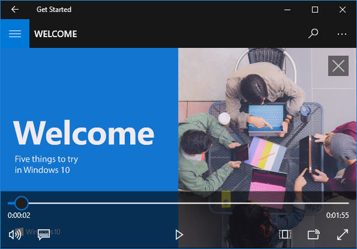
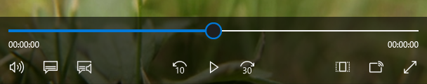

# Media player


The media player is used to view and listen to video and audio. Media playback can be inline (embedded in a page or with a group of other controls) or in a dedicated full-screen view. You can modify the player's button set, change the background of the control bar, and arrange layouts as you see fit. Just keep in mind that users expect a basic control set (play/pause, skip back, skip forward).


> **Important APIs**: [MediaPlayerElement class](https://msdn.microsoft.com/library/windows/apps/windows.ui.xaml.controls.mediaplayerelement.aspx), [MediaTransportControls class](https://msdn.microsoft.com/library/windows/apps/windows.ui.xaml.controls.mediatransportcontrols)


> [!NOTE]
> **MediaPlayerElement** is only available in Windows 10, version 1607 and up. If you are developing an app for an earlier version of Windows 10 you will need to use [MediaElement](https://msdn.microsoft.com/library/windows/apps/br242926) instead. All of the recommendations on this page apply to MediaElement as well.

## Is this the right control?

Use a media player when you want to play audio or video in your app. To display a collection of images, use a [Flip view](flipview.md).

## Examples

<table>
<th align="left">XAML Controls Gallery<th>
<tr>
<td></img></td>
<td>
    <p>If you have the <strong style="font-weight: semi-bold">XAML Controls Gallery</strong> app installed, click here to open the app and see the <a href="xamlcontrolsgallery:/item/MediaPlayerElement">MediaPlayerElement</a> or <a href="xamlcontrolsgallery:/item/MediaPlayer">MediaPlayer</a> in action.</p>
    <ul>
    <li><a href="https://www.microsoft.com/store/productId/9MSVH128X2ZT">Get the XAML Controls Gallery app (Microsoft Store)</a></li>
    <li><a href="https://github.com/Microsoft/Windows-universal-samples/tree/master/Samples/XamlUIBasics">Get the source code (GitHub)</a></li>
    </ul>
</td>
</tr>
</table>

A media player in the Windows 10 Get Started app.



## Create a media player
Add media to your app by creating a [MediaPlayerElement](https://msdn.microsoft.com/library/windows/apps/windows.ui.xaml.controls.mediaplayerelement.aspx) object in XAML and set the [Source](https://msdn.microsoft.com/library/windows/apps/windows.ui.xaml.controls.mediaplayerelement.source.aspx) to a [MediaSource](https://msdn.microsoft.com/library/windows/apps/windows.media.core.mediasource.aspx) that points to an audio or video file.

This XAML creates a [MediaPlayerElement](https://msdn.microsoft.com/library/windows/apps/windows.ui.xaml.controls.mediaplayerelement.aspx) and sets its [Source](https://msdn.microsoft.com/library/windows/apps/windows.ui.xaml.controls.mediaplayerelement.source.aspx) property to the URI of a video file that's local to the app. The **MediaPlayerElement** begins playing when the page loads. To suppress media from starting right away, you can set the [AutoPlay](https://msdn.microsoft.com/library/windows/apps/windows.ui.xaml.controls.mediaplayerelement.autoplay.aspx) property to **false**.

```xaml
<MediaPlayerElement x:Name="mediaSimple"
                    Source="Videos/video1.mp4"
                    Width="400" AutoPlay="True"/>
```

This XAML creates a [MediaPlayerElement](https://msdn.microsoft.com/library/windows/apps/windows.ui.xaml.controls.mediaplayerelement.aspx) with the built in transport controls enabled and the [AutoPlay](https://msdn.microsoft.com/library/windows/apps/windows.ui.xaml.controls.mediaplayerelement.autoplay.aspx) property set to **false.**


```xaml
<MediaPlayerElement x:Name="mediaPlayer"
                    Source="Videos/video1.mp4"
                    Width="400"
                    AutoPlay="False"
                    AreTransportControlsEnabled="True"/>
```

### Media transport controls
[MediaPlayerElement](https://msdn.microsoft.com/library/windows/apps/windows.ui.xaml.controls.mediaplayerelement.aspx) has built in transport controls that handle play, stop, pause, volume, mute, seeking/progress, closed captions, and audio track selection. To enable these controls, set [AreTransportControlsEnabled](https://msdn.microsoft.com/library/windows/apps/windows.ui.xaml.controls.mediaplayerelement.AreTransportControlsEnabled.aspx) to **true**. To disable them, set **AreTransportControlsEnabled** to **false**. The transport controls are represented by the [MediaTransportControls](https://msdn.microsoft.com/library/windows/apps/dn831962) class. You can use the transport controls as-is, or customize them in various ways. For more info, see the [MediaTransportControls](https://msdn.microsoft.com/library/windows/apps/dn831962) class reference and [Create custom transport controls](custom-transport-controls.md).

The transport controls support single- and double-row layouts. The first example here is a single-row layout, with the play/pause button located to the left of the media timeline. This layout is best reserved for inline media playback and compact screens.


The double-row controls layout (below) is recommended for most usage scenarios, especially on larger screens. This layout provides more space for controls and makes the timeline easier for the user to operate.



**System media transport controls**

[MediaPlayerElement](https://msdn.microsoft.com/library/windows/apps/windows.ui.xaml.controls.mediaplayerelement.aspx) is automatically integrated with the system media transport controls. The system media transport controls are the controls that pop up when hardware media keys are pressed, such as the media buttons on keyboards. For more info, see [SystemMediaTransportControls](https://msdn.microsoft.com/library/windows/apps/dn278677).

> **Note**&nbsp;&nbsp; [MediaElement](https://msdn.microsoft.com/library/windows/apps/br242926) does not automatically integrate with the system media transport controls so you must connect them yourself. For more information, see [System Media Transport Controls](https://msdn.microsoft.com/library/windows/apps/mt228338).


### Set the media source
To play files on the network or files embedded with the app, set the [Source](https://msdn.microsoft.com/library/windows/apps/windows.ui.xaml.controls.mediaplayerelement.source.aspx) property to a [MediaSource](https://msdn.microsoft.com/library/windows/apps/windows.media.core.mediasource.aspx) with the path of the file.

**Tip**  To open files from the internet, you need to declare the **Internet (Client)** capability in your app's manifest (Package.appxmanifest). For more info about declaring capabilities, see [App capability declarations](https://msdn.microsoft.com/library/windows/apps/mt270968).

 

This code attempts to set the [Source](https://msdn.microsoft.com/library/windows/apps/windows.ui.xaml.controls.mediaplayerelement.source.aspx) property of the [MediaPlayerElement](https://msdn.microsoft.com/library/windows/apps/windows.ui.xaml.controls.mediaplayerelement.aspx) defined in XAML to the path of a file entered into a [TextBox](https://msdn.microsoft.com/library/windows/apps/br209683).

```xaml
<TextBox x:Name="txtFilePath" Width="400"
         FontSize="20"
         KeyUp="TxtFilePath_KeyUp"
         Header="File path"
         PlaceholderText="Enter file path"/>
```

```csharp
private void TxtFilePath_KeyUp(object sender, KeyRoutedEventArgs e)
{
    if (e.Key == Windows.System.VirtualKey.Enter)
    {
        TextBox tbPath = sender as TextBox;

        if (tbPath != null)
        {
            LoadMediaFromString(tbPath.Text);
        }
    }
}

private void LoadMediaFromString(string path)
{
    try
    {
        Uri pathUri = new Uri(path);
        mediaPlayer.Source = MediaSource.CreateFromUri(pathUri);
    }
    catch (Exception ex)
    {
        if (ex is FormatException)
        {
            // handle exception.
            // For example: Log error or notify user problem with file
        }
    }
}
```

To set the media source to a media file embedded in the app, initialize a [Uri](https://msdn.microsoft.com/library/windows/apps/br226017) with the path prefixed with **ms-appx:///**, create a [MediaSource](https://msdn.microsoft.com/library/windows/apps/windows.media.core.mediasource.aspx) with the Uri and then set the [Source](https://msdn.microsoft.com/library/windows/apps/windows.ui.xaml.controls.mediaplayerelement.source.aspx) to the Uri. For example, for a file called **video1.mp4** that is in a **Videos** subfolder, the path would look like: **ms-appx:///Videos/video1.mp4**

This code sets the [Source](https://msdn.microsoft.com/library/windows/apps/windows.ui.xaml.controls.mediaplayerelement.source.aspx) property of the [MediaPlayerElement](https://msdn.microsoft.com/library/windows/apps/windows.ui.xaml.controls.mediaplayerelement.aspx) defined previously in XAML to **ms-appx:///Videos/video1.mp4**.

```csharp
private void LoadEmbeddedAppFile()
{
    try
    {
        Uri pathUri = new Uri("ms-appx:///Videos/video1.mp4");
        mediaPlayer.Source = MediaSource.CreateFromUri(pathUri);
    }
    catch (Exception ex)
    {
        if (ex is FormatException)
        {
            // handle exception.
            // For example: Log error or notify user problem with file
        }
    }
}
```

### Open local media files
To open files on the local system or from OneDrive, you can use the [FileOpenPicker](https://msdn.microsoft.com/library/windows/apps/br207847) to get the file and [Source](https://msdn.microsoft.com/library/windows/apps/windows.ui.xaml.controls.mediaplayerelement.source.aspx) to set the media source, or you can programmatically access the user media folders.

If your app needs access without user interaction to the **Music** or **Video** folders, for example, if you are enumerating all the music or video files in the user's collection and displaying them in your app, then you need to declare the **Music Library** and **Video Library** capabilities. For more info, see [Files and folders in the Music, Pictures, and Videos libraries](https://msdn.microsoft.com/library/windows/apps/mt188703).

The [FileOpenPicker](https://msdn.microsoft.com/library/windows/apps/br207847) does not require special capabilities to access files on the local file system, such as the user's **Music** or **Video** folders, since the user has complete control over which file is being accessed. From a security and privacy standpoint, it is best to minimize the number of capabilities your app uses.

**To open local media using FileOpenPicker**

1.  Call [FileOpenPicker](https://msdn.microsoft.com/library/windows/apps/br207847) to let the user pick a media file.

    Use the [FileOpenPicker](https://msdn.microsoft.com/library/windows/apps/br207847) class to select a media file. Set the [FileTypeFilter](https://msdn.microsoft.com/library/windows/apps/br207850) to specify which file types the **FileOpenPicker** displays. Call [PickSingleFileAsync](https://msdn.microsoft.com/library/windows/apps/jj635275) to launch the file picker and get the file.

2.  Use a [MediaSource](https://msdn.microsoft.com/library/windows/apps/windows.media.core.mediasource.aspx) to set the chosen media file as the [MediaPlayerElement.Source](https://msdn.microsoft.com/library/windows/apps/windows.ui.xaml.controls.mediaplayerelement.source.aspx).

    To use the [StorageFile](https://msdn.microsoft.com/library/windows/apps/br227171) returned from the [FileOpenPicker](https://msdn.microsoft.com/library/windows/apps/br207847), you need to call the [CreateFromStorageFile](https://msdn.microsoft.com/library/windows/apps/windows.media.core.mediasource.createfromstoragefile.aspx) method on [MediaSource](https://msdn.microsoft.com/library/windows/apps/windows.media.core.mediasource.aspx) and set it as the [Source](https://msdn.microsoft.com/library/windows/apps/windows.ui.xaml.controls.mediaplayerelement.source.aspx) of [MediaPlayerElement](https://msdn.microsoft.com/library/windows/apps/windows.ui.xaml.controls.mediaplayerelement.aspx). Then call [Play](https://msdn.microsoft.com/library/windows/apps/windows.media.playback.mediaplayer.play.aspx) on the [MediaPlayerElement.MediaPlayer](https://msdn.microsoft.com/library/windows/apps/windows.ui.xaml.controls.mediaplayerelement.mediaplayer.aspx) to start the media.


This example shows how to use the [FileOpenPicker](https://msdn.microsoft.com/library/windows/apps/br207847) to choose a file and set the file as the [Source](https://msdn.microsoft.com/library/windows/apps/windows.ui.xaml.controls.mediaplayerelement.source.aspx) of a [MediaPlayerElement](https://msdn.microsoft.com/library/windows/apps/windows.ui.xaml.controls.mediaplayerelement.aspx).

```xaml
<MediaPlayerElement x:Name="mediaPlayer"/>
...
<Button Content="Choose file" Click="Button_Click"/>
```

```csharp
private async void Button_Click(object sender, RoutedEventArgs e)
{
    await SetLocalMedia();
}

async private System.Threading.Tasks.Task SetLocalMedia()
{
    var openPicker = new Windows.Storage.Pickers.FileOpenPicker();

    openPicker.FileTypeFilter.Add(".wmv");
    openPicker.FileTypeFilter.Add(".mp4");
    openPicker.FileTypeFilter.Add(".wma");
    openPicker.FileTypeFilter.Add(".mp3");

    var file = await openPicker.PickSingleFileAsync();

    // mediaPlayer is a MediaPlayerElement defined in XAML
    if (file != null)
    {
        mediaPlayer.Source = MediaSource.CreateFromStorageFile(file);

        mediaPlayer.MediaPlayer.Play();
    }
}
```

### Set the poster source
You can use the [PosterSource](https://msdn.microsoft.com/library/windows/apps/windows.ui.xaml.controls.mediaplayerelement.PosterSource.aspx) property to provide your [MediaPlayerElement](https://msdn.microsoft.com/library/windows/apps/windows.ui.xaml.controls.mediaplayerelement.aspx) with a visual representation before the media is loaded. A **PosterSource** is an image, such as a screen shot or movie poster, that is displayed in place of the media. The **PosterSource** is displayed in the following situations:

-   When a valid source is not set. For example, [Source](https://msdn.microsoft.com/library/windows/apps/windows.ui.xaml.controls.mediaplayerelement.source.aspx) is not set, **Source** was set to **Null**, or the source is invalid (as is the case when a [MediaFailed](https://msdn.microsoft.com/library/windows/apps/windows.media.playback.mediaplayer.mediafailed.aspx) event occurs).
-   While media is loading. For example, a valid source is set, but the [MediaOpened](https://msdn.microsoft.com/library/windows/apps/windows.media.playback.mediaplayer.mediaopened.aspx) event has not occurred yet.
-   When media is streaming to another device.
-   When the media is audio only.

Here's a [MediaPlayerElement](https://msdn.microsoft.com/library/windows/apps/windows.ui.xaml.controls.mediaplayerelement.aspx) with its [Source](https://msdn.microsoft.com/library/windows/apps/windows.ui.xaml.controls.mediaplayerelement.source.aspx) set to an album track, and it's [PosterSource](https://msdn.microsoft.com/library/windows/apps/windows.ui.xaml.controls.mediaplayerelement.PosterSource.aspx) set to an image of the album cover.

```xaml
<MediaPlayerElement Source="Media/Track1.mp4" PosterSource="Media/AlbumCover.png"/>
```

### Keep the device's screen active
Typically, a device dims the display (and eventually turns it off) to save battery life when the user is away, but video apps need to keep the screen on so the user can see the video. To prevent the display from being deactivated when user action is no longer detected, such as when an app is playing video, you can call [DisplayRequest.RequestActive](https://msdn.microsoft.com/library/windows/apps/br241818). The [DisplayRequest](https://msdn.microsoft.com/library/windows/apps/br241816) class lets you tell Windows to keep the display turned on so the user can see the video.

To conserve power and battery life, you should call [DisplayRequest.RequestRelease](https://msdn.microsoft.com/library/windows/apps/br241819) to release the display request when it is no longer required. Windows automatically deactivates your app's active display requests when your app moves off screen, and re-activates them when your app comes back to the foreground.

Here are some situations when you should release the display request:

-   Video playback is paused, for example, by user action, buffering, or adjustment due to limited bandwidth.
-   Playback stops. For example, the video is done playing or the presentation is over.
-   A playback error has occurred. For example, network connectivity issues or a corrupted file.

> **Note**&nbsp;&nbsp; If [MediaPlayerElement.IsFullWindow](https://msdn.microsoft.com/library/windows/apps/windows.ui.xaml.controls.mediaplayerelement.IsFullWindow.aspx) is set to true and media is playing, the display will automatically be prevented from deactivating.

**To keep the screen active**

1.  Create a global [DisplayRequest](https://msdn.microsoft.com/library/windows/apps/br241816) variable. Initialize it to null.
```csharp
// Create this variable at a global scope. Set it to null.
private DisplayRequest appDisplayRequest = null;
```

2.  Call [RequestActive](https://msdn.microsoft.com/library/windows/apps/br241818) to notify Windows that the app requires the display to remain on.

3.  Call [RequestRelease](https://msdn.microsoft.com/library/windows/apps/br241819) to release the display request whenever video playback is stopped, paused, or interrupted by a playback error. When your app no longer has any active display requests, Windows saves battery life by dimming the display (and eventually turning it off) when the device is not being used.

    Each [MediaPlayerElement.MediaPlayer](https://msdn.microsoft.com/library/windows/apps/windows.ui.xaml.controls.mediaplayerelement.mediaplayer.aspx) has a [PlaybackSession](https://msdn.microsoft.com/library/windows/apps/windows.media.playback.mediaplayer.playbacksession.aspx) of type [MediaPlaybackSession](https://msdn.microsoft.com/library/windows/apps/windows.media.playback.mediaplaybacksession.aspx) that controls various aspects of media playback such as [PlaybackRate](https://msdn.microsoft.com/library/windows/apps/windows.media.playback.mediaplaybacksession.playbackrate.aspx), [PlaybackState](https://msdn.microsoft.com/library/windows/apps/windows.media.playback.mediaplaybacksession.playbackstate.aspx) and [Position](https://msdn.microsoft.com/library/windows/apps/windows.media.playback.mediaplaybacksession.position.aspx). Here, you use the [PlaybackStateChanged](https://msdn.microsoft.com/library/windows/apps/windows.media.playback.mediaplaybacksession.playbackstatechanged.aspx) event on  [MediaPlayer.PlaybackSession](https://msdn.microsoft.com/library/windows/apps/windows.media.playback.mediaplayer.playbacksession.aspx) to detect situations when you should release the display request. Then, use the [NaturalVideoHeight](https://msdn.microsoft.com/library/windows/apps/windows.media.playback.mediaplaybacksession.naturalvideoheight.aspx) property to determine whether an audio or video file is playing, and keep the screen active only if video is playing.
    ```xaml
<MediaPlayerElement x:Name="mpe" Source="Media/video1.mp4"/>
    ```

    ```csharp
    protected override void OnNavigatedTo(NavigationEventArgs e)
    {
        mpe.MediaPlayer.PlaybackSession.PlaybackStateChanged += MediaPlayerElement_CurrentStateChanged;
        base.OnNavigatedTo(e);
    }

    private void MediaPlayerElement_CurrentStateChanged(object sender, RoutedEventArgs e)
    {
        MediaPlaybackSession playbackSession = sender as MediaPlaybackSession;
        if (playbackSession != null && playbackSession.NaturalVideoHeight != 0)
        {
            if(playbackSession.PlaybackState == MediaPlaybackState.Playing)
            {
                if(appDisplayRequest == null)
                {
                    // This call creates an instance of the DisplayRequest object
                    appDisplayRequest = new DisplayRequest();
                    appDisplayRequest.RequestActive();
                }
            }
            else // PlaybackState is Buffering, None, Opening or Paused
            {
                if(appDisplayRequest != null)
                {
                      // Deactivate the displayr request and set the var to null
                      appDisplayRequest.RequestRelease();
                      appDisplayRequest = null;
                }
            }
        }

    }
    ```

### Control the media player programmatically
[MediaPlayerElement](https://msdn.microsoft.com/library/windows/apps/windows.ui.xaml.controls.mediaplayerelement.aspx) provides numerous properties, methods, and events for controlling audio and video playback through the [MediaPlayerElement.MediaPlayer](https://msdn.microsoft.com/library/windows/apps/windows.ui.xaml.controls.mediaplayerelement.mediaplayer.aspx) property. For a full listing of properties, methods, and events, see the [MediaPlayer](https://msdn.microsoft.com/library/windows/apps/windows.media.playback.mediaplayer.aspx) reference page.

### Advanced media playback scenarios
For more complex media playback scenarios like playing a playlist, switching between audio languages or creating custom metadata tracks set the [MediaPlayerElement.Source](https://msdn.microsoft.com/library/windows/apps/windows.ui.xaml.controls.mediaplayerelement.source.aspx) to a [MediaPlaybackItem](https://msdn.microsoft.com/library/windows/apps/windows.media.playback.mediaplaybackitem.aspx) or a [MediaPlaybackList](https://msdn.microsoft.com/library/windows/apps/windows.media.playback.mediaplaybacklist.aspx). See the [Media playback](https://msdn.microsoft.com/windows/uwp/audio-video-camera/media-playback-with-mediasource) page in the dev center for more information on how to enable various advanced media functionality.

### Enable full window video rendering

Set the [IsFullWindow](https://msdn.microsoft.com/library/windows/apps/windows.ui.xaml.controls.mediaplayerelement.isfullwindow.aspx) property to enable and disable full window rendering. When you programmatically set full window rendering in your app, you should always use **IsFullWindow** instead of doing it manually. **IsFullWindow** insures that system level optimizations are performed that improve performance and battery life. If full window rendering is not set up correctly, these optimizations may not be enabled.

Here is some code that creates an [AppBarButton](https://msdn.microsoft.com/library/windows/apps/dn279244) that toggles full window rendering.

```xaml
<AppBarButton Icon="FullScreen"
              Label="Full Window"
              Click="FullWindow_Click"/>>
```

```csharp
private void FullWindow_Click(object sender, object e)
{
    mediaPlayer.IsFullWindow = !media.IsFullWindow;
}
```

### Resize and stretch video

Use the [Stretch](https://msdn.microsoft.com/library/windows/apps/windows.ui.xaml.controls.mediaplayerelement.stretch.aspx) property to change how the video content and/or the [PosterSource](https://msdn.microsoft.com/library/windows/apps/windows.ui.xaml.controls.mediaplayerelement.postersource.aspx) fills the container it's in. This resizes and stretches the video depending on the [Stretch](https://msdn.microsoft.com/library/windows/apps/br242968) value. The **Stretch** states are similar to picture size settings on many TV sets. You can hook this up to a button and allow the user to choose which setting they prefer.

-   [None](https://msdn.microsoft.com/library/windows/apps/br242968) displays the native resolution of the content in its original size.
-   [Uniform](https://msdn.microsoft.com/library/windows/apps/br242968) fills up as much of the space as possible while preserving the aspect ratio and the image content. This can result in horizontal or vertical black bars at the edges of the video. This is similar to wide-screen modes.
-   [UniformToFill](https://msdn.microsoft.com/library/windows/apps/br242968) fills up the entire space while preserving the aspect ratio. This can result in some of the image being cropped. This is similar to full-screen modes.
-   [Fill](https://msdn.microsoft.com/library/windows/apps/br242968) fills up the entire space, but does not preserve the aspect ratio. None of image is cropped, but stretching may occur. This is similar to stretch modes.


Here, an [AppBarButton](https://msdn.microsoft.com/library/windows/apps/dn279244) is used to cycle through the [Stretch](https://msdn.microsoft.com/library/windows/apps/br242968) options. A **switch** statement checks the current state of the [Stretch](https://msdn.microsoft.com/library/windows/apps/br227422) property and sets it to the next value in the **Stretch** enumeration. This lets the user cycle through the different stretch states.

```xaml
<AppBarButton Icon="Switch"
              Label="Resize Video"
              Click="PictureSize_Click" />
```

```csharp
private void PictureSize_Click(object sender, RoutedEventArgs e)
{
    switch (mediaPlayer.Stretch)
    {
        case Stretch.Fill:
            mediaPlayer.Stretch = Stretch.None;
            break;
        case Stretch.None:
            mediaPlayer.Stretch = Stretch.Uniform;
            break;
        case Stretch.Uniform:
            mediaPlayer.Stretch = Stretch.UniformToFill;
            break;
        case Stretch.UniformToFill:
            mediaPlayer.Stretch = Stretch.Fill;
            break;
        default:
            break;
    }
}
```

### Enable low-latency playback

Set the [RealTimePlayback](https://msdn.microsoft.com/library/windows/apps/windows.media.playback.mediaplayer.realtimeplayback.aspx) property to **true** on a [MediaPlayerElement.MediaPlayer](https://msdn.microsoft.com/library/windows/apps/windows.ui.xaml.controls.mediaplayerelement.mediaplayer.aspx) to enable the media player element to reduce the initial latency for playback. This is critical for two-way communications apps, and can be applicable to some gaming scenarios. Be aware that this mode is more resource intensive and less power-efficient.

This example creates a [MediaPlayerElement](https://msdn.microsoft.com/library/windows/apps/windows.ui.xaml.controls.mediaplayerelement.aspx) and sets [RealTimePlayback](https://msdn.microsoft.com/library/windows/apps/windows.media.playback.mediaplayer.realtimeplayback.aspx) to **true**.


```csharp
MediaPlayerElement mp = new MediaPlayerElement();
mp.MediaPlayer.RealTimePlayback = true;
```

## Recommendations

The media player supports both light and dark themes, but dark theme provides a better experience for most entertainment scenarios. The dark background provides better contrast, in particular for low-light conditions, and limits the control bar from interfering in the viewing experience.

When playing video content, encourage a dedicated viewing experience by promoting full-screen mode over inline mode. The full-screen viewing experience is optimal, and options are restricted in the inline mode.

If you have the screen real estate or are designing for the 10-foot experience, go with the double-row layout. It provides more space for controls than the compact single-row layout and it is easier to navigate using gamepad for 10-foot.

> **Note**&nbsp;&nbsp; Visit the [Designing for Xbox and TV](../devices/designing-for-tv.md) article for more information on optimizing your application for the 10-foot experience.

The default controls have been optimized for media playback, however you have the ability to add custom options you need to the media player in order to provide the best experience for you app. Visit [Create custom transport controls](custom-transport-controls.md) to learn more about adding custom controls.

## Get the sample code

- [XAML Controls Gallery sample](https://github.com/Microsoft/Windows-universal-samples/tree/master/Samples/XamlUIBasics) - See all the XAML controls in an interactive format.

## Related articles

- [Command design basics for UWP apps](https://msdn.microsoft.com/library/windows/apps/dn958433)
- [Content design basics for UWP apps](https://msdn.microsoft.com/library/windows/apps/dn958434)
