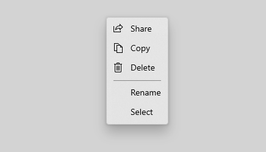
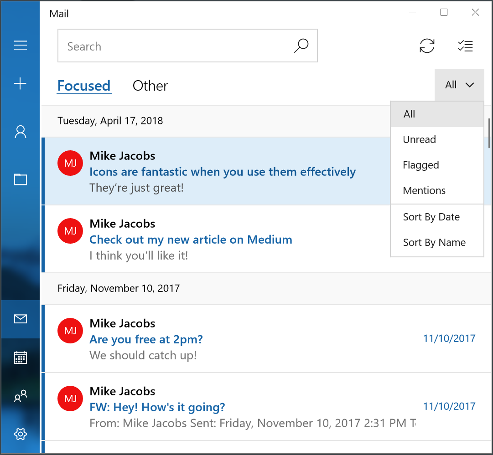
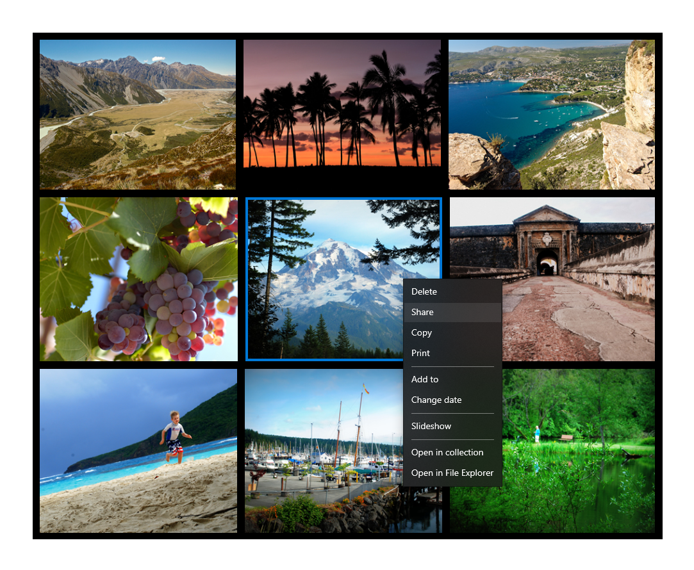
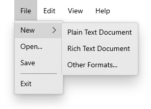

# Menus and context menus

Menus and context menus display a list of commands or options when the user requests them. Use a menu flyout to show a single, inline menu. Use a menu bar to show a set of menus in a horizontal row, typically at the top of an app window. Each menu can have menu items and sub-menus.



**Get the Windows UI Library**

|  |  |
| - | - |
|  | The **MenuBar** control is included as part of the Windows UI Library, a NuGet package that contains new controls and UI features for Windows apps. For more info, including installation instructions, see the [Windows UI Library overview](/uwp/toolkits/winui/). |

> **Windows UI Library APIs:** [MenuBar class](/uwp/api/microsoft.ui.xaml.controls.menubar)
>
> **Platform APIs:** [MenuFlyout class](/uwp/api/windows.ui.xaml.controls.menuflyout), [MenuBar class](/uwp/api/windows.ui.xaml.controls.menubar), [ContextFlyout property](/uwp/api/windows.ui.xaml.uielement.contextflyout), [FlyoutBase.AttachedFlyout property](/uwp/api/windows.ui.xaml.controls.primitives.flyoutbase#xaml-attached-properties)

## Is this the right control?

Menus and context menus save space by organizing commands and hiding them until the user needs them. If a particular command will be used frequently and you have the space available, consider placing it directly in its own element, rather than in a menu, so that users don't have to go through a menu to get to it.

Menus and context menus are for organizing commands; to display arbitrary content, such as a notification or confirmation request, use a [dialog or a flyout](./dialogs-and-flyouts/index.md).

### MenuBar vs. MenuFlyout

To show a menu in a flyout attached to an on-canvas UI element, use the MenuFlyout control to host your menu items. You can invoke a menu flyout either as a regular menu or as a context menu. A menu flyout hosts a single top-level menu (and optional sub-menus).

To show a set of multiple top-level menus in a horizontal row, use a menu bar. You typically position the menu bar at the top of the app window.

### MenuBar vs. CommandBar

MenuBar and CommandBar both represent surfaces that you can use to expose commands to your users. The MenuBar provides a quick and simple way to expose a set of commands for apps that might need more organization or grouping than a CommandBar allows.

You can also use a MenuBar in conjunction with a CommandBar. Use the MenuBar to provide the bulk of the commands, and the CommandBar to highlight the most used commands.

## Examples

<table>
<th align="left">XAML Controls Gallery<th>
<tr>
<td></img></td>
<td>
    <p>If you have the <strong style="font-weight: semi-bold">XAML Controls Gallery</strong> app installed, click here to <a href="xamlcontrolsgallery:/item/MenuFlyout">open the app and see the MenuFlyout in action</a>.</p>
    <ul>
    <li><a href="https://www.microsoft.com/p/xaml-controls-gallery/9msvh128x2zt">Get the XAML Controls Gallery app (Microsoft Store)</a></li>
    <li><a href="https://github.com/Microsoft/Xaml-Controls-Gallery">Get the source code (GitHub)</a></li>
    </ul>
</td>
</tr>
</table>

## Menus vs. context menus

Menus and context menus are similar in how they look and what they can contain. In fact, you can use the same control, [MenuFlyout](/uwp/api/Windows.UI.Xaml.Controls.MenuFlyout), to create them. The difference is how you let the user access it.

When should you use a menu or a context menu?

- If the host element is a button or some other command element whose primary role is to present additional commands, use a menu.
- If the host element is some other type of element that has another primary purpose (such as presenting text or an image), use a context menu.

For example, use a menu on a button to provide filtering and sorting options for a list. In this scenario, the primary purpose of the button control is to provide access to a menu.



If you want to add commands (such as cut, copy, and paste) to a text element, use a context menu instead of a menu. In this scenario, the primary role of the text element is to present and edit text; additional commands (such as cut, copy, and paste) are secondary and belong in a context menu.



### Menus

- Have a single entry point (a File menu at the top of the screen, for example) that is always displayed.
- Are usually attached to a button or a parent menu item.
- Are invoked by left-clicking (or an equivalent action, such as tapping with your finger).
- Are associated with an element via its [Flyout](/uwp/api/windows.ui.xaml.controls.button.flyout) or [FlyoutBase.AttachedFlyout](/uwp/api/windows.ui.xaml.controls.primitives.flyoutbase#xaml-attached-properties) properties, or grouped in a menu bar at the top of the app window.

### Context menus

- Are attached to a single element and display secondary commands.
- Are invoked by right clicking (or an equivalent action, such as pressing and holding with your finger).
- Are associated with an element via its [ContextFlyout](/uwp/api/windows.ui.xaml.uielement.contextflyout) property.

## Icons

Consider providing menu item icons for:

- The most commonly used items.
- Menu items whose icon is standard or well known.
- Menu items whose icon well illustrates what the command does.

Don't feel obligated to provide icons for commands that don't have a standard visualization. Cryptic icons aren't helpful, create visual clutter, and prevent users from focusing on the important menu items.


````xaml
<MenuFlyout>
  <MenuFlyoutItem Text="Share" >
    <MenuFlyoutItem.Icon>
      <FontIcon Glyph="&#xE72D;" />
    </MenuFlyoutItem.Icon>
  </MenuFlyoutItem>
  <MenuFlyoutItem Text="Copy" Icon="Copy" />
  <MenuFlyoutItem Text="Delete" Icon="Delete" />
  <MenuFlyoutSeparator />
  <MenuFlyoutItem Text="Rename" />
  <MenuFlyoutItem Text="Select" />
</MenuFlyout>
````

> [!TIP]
> The size of the icon in a MenuFlyoutItem is 16x16px. If you use SymbolIcon, FontIcon, or PathIcon, the icon automatically scales to the correct size with no loss of fidelity. If you use BitmapIcon, ensure that your asset is 16x16px.  

## Create a menu flyout or a context menu

To create a menu flyout or a context menu, you use the [MenuFlyout class](/uwp/api/windows.ui.xaml.controls.menuflyout). You define the contents of the menu by adding [MenuFlyoutItem](/uwp/api/windows.ui.xaml.controls.menuflyoutitem), [MenuFlyoutSubItem](/uwp/api/windows.ui.xaml.controls.menuflyoutsubitem), [ToggleMenuFlyoutItem](/uwp/api/windows.ui.xaml.controls.togglemenuflyoutitem), [RadioMenuFlyoutItem](/uwp/api/microsoft.ui.xaml.controls.radiomenuflyoutitem) and [MenuFlyoutSeparator](/uwp/api/windows.ui.xaml.controls.menuflyoutseparator) objects to the MenuFlyout.

These objects are for:

- [MenuFlyoutItem](/uwp/api/windows.ui.xaml.controls.menuflyoutitem)—Performing an immediate action.
- [MenuFlyoutSubItem](/uwp/api/windows.ui.xaml.controls.menuflyoutsubitem)—Containing a cascading list of menu items.
- [ToggleMenuFlyoutItem](/uwp/api/windows.ui.xaml.controls.togglemenuflyoutitem)—Switching an option on or off.
- [RadioMenuFlyoutItem](/uwp/api/microsoft.ui.xaml.controls.radiomenuflyoutitem)—Switching between mutually-exclusive menu items.
- [MenuFlyoutSeparator](/uwp/api/windows.ui.xaml.controls.menuflyoutseparator)—Visually separating menu items.

This example creates a [MenuFlyout](/uwp/api/windows.ui.xaml.controls.menuflyout) and uses the [ContextFlyout](/uwp/api/windows.ui.xaml.uielement.contextflyout) property, a property available to most controls, to show the MenuFlyout as a context menu.

````xaml
<Rectangle
  Height="100" Width="100">
  <Rectangle.ContextFlyout>
    <MenuFlyout>
      <MenuFlyoutItem Text="Change color" Click="ChangeColorItem_Click" />
    </MenuFlyout>
  </Rectangle.ContextFlyout>
  <Rectangle.Fill>
    <SolidColorBrush x:Name="rectangleFill" Color="Red" />
  </Rectangle.Fill>
</Rectangle>
````

````csharp
private void ChangeColorItem_Click(object sender, RoutedEventArgs e)
{
    // Change the color from red to blue or blue to red.
    if (rectangleFill.Color == Windows.UI.Colors.Red)
    {
        rectangleFill.Color = Windows.UI.Colors.Blue;
    }
    else
    {
        rectangleFill.Color = Windows.UI.Colors.Red;
    }
}
````

The next example is nearly identical, but instead of using the [ContextFlyout](/uwp/api/windows.ui.xaml.uielement.contextflyout) property to show the [MenuFlyout class](/uwp/api/windows.ui.xaml.controls.menuflyout) as a context menu, the example uses the [FlyoutBase.ShowAttachedFlyout](/uwp/api/windows.ui.xaml.controls.primitives.flyoutbase.showattachedflyout) property to show it as a menu.

````xaml
<Rectangle
  Height="100" Width="100"
  Tapped="Rectangle_Tapped">
  <FlyoutBase.AttachedFlyout>
    <MenuFlyout>
      <MenuFlyoutItem Text="Change color" Click="ChangeColorItem_Click" />
    </MenuFlyout>
  </FlyoutBase.AttachedFlyout>
  <Rectangle.Fill>
    <SolidColorBrush x:Name="rectangleFill" Color="Red" />
  </Rectangle.Fill>
</Rectangle>
````

````csharp
private void Rectangle_Tapped(object sender, TappedRoutedEventArgs e)
{
    FlyoutBase.ShowAttachedFlyout((FrameworkElement)sender);
}

private void ChangeColorItem_Click(object sender, RoutedEventArgs e)
{
    // Change the color from red to blue or blue to red.
    if (rectangleFill.Color == Windows.UI.Colors.Red)
    {
        rectangleFill.Color = Windows.UI.Colors.Blue;
    }
    else
    {
        rectangleFill.Color = Windows.UI.Colors.Red;
    }
}
````

### Light dismiss

Light dismiss controls such as menus, context menus, and other flyouts, trap keyboard and gamepad focus inside the transient UI until dismissed. To provide a visual cue for this behavior, light dismiss controls on Xbox will draw an overlay that dims the visibility of out of scope UI. This behavior can be modified with the  [LightDismissOverlayMode](/uwp/api/windows.ui.xaml.controls.primitives.flyoutbase.lightdismissoverlaymode) property. By default, transient UIs will draw the light dismiss overlay on Xbox (**Auto**) but not other device families. You can choose to force the overlay to be always **On** or always **Off**.

```xaml
<MenuFlyout LightDismissOverlayMode="Off" />
```

## Create a menu bar

> [!IMPORTANT]
> MenuBar requires Windows 10, version 1809 ([SDK 17763](https://developer.microsoft.com/windows/downloads/windows-10-sdk)) or later, or the [Windows UI Library](/uwp/toolkits/winui/).

You use the same elements to create menus in a menu bar as in a menu flyout. However, instead of grouping MenuFlyoutItem objects in a MenuFlyout, you group them in a MenuBarItem element. Each MenuBarItem is added to the MenuBar as a top level menu.



> [!NOTE]
> This example shows only how to create the UI structure, but does not show implementation of any of the commands.

```xaml
<muxc:MenuBar>
    <muxc:MenuBarItem Title="File">
        <MenuFlyoutSubItem Text="New">
            <MenuFlyoutItem Text="Plain Text Document"/>
            <MenuFlyoutItem Text="Rich Text Document"/>
            <MenuFlyoutItem Text="Other Formats..."/>
        </MenuFlyoutSubItem>
        <MenuFlyoutItem Text="Open..."/>
        <MenuFlyoutItem Text="Save"/>
        <MenuFlyoutSeparator />
        <MenuFlyoutItem Text="Exit"/>
    </muxc:MenuBarItem>

    <muxc:MenuBarItem Title="Edit">
        <MenuFlyoutItem Text="Undo"/>
        <MenuFlyoutItem Text="Cut"/>
        <MenuFlyoutItem Text="Copy"/>
        <MenuFlyoutItem Text="Paste"/>
    </muxc:MenuBarItem>

    <muxc:MenuBarItem Title="View">
        <MenuFlyoutItem Text="Output"/>
        <MenuFlyoutSeparator/>
        <muxc:RadioMenuFlyoutItem Text="Landscape" GroupName="OrientationGroup"/>
        <muxc:RadioMenuFlyoutItem Text="Portrait" GroupName="OrientationGroup" IsChecked="True"/>
        <MenuFlyoutSeparator/>
        <muxc:RadioMenuFlyoutItem Text="Small icons" GroupName="SizeGroup"/>
        <muxc:RadioMenuFlyoutItem Text="Medium icons" IsChecked="True" GroupName="SizeGroup"/>
        <muxc:RadioMenuFlyoutItem Text="Large icons" GroupName="SizeGroup"/>
    </muxc:MenuBarItem>

    <muxc:MenuBarItem Title="Help">
        <MenuFlyoutItem Text="About"/>
    </muxc:MenuBarItem>
</muxc:MenuBar>
```

## Get the sample code

- [XAML Controls Gallery sample](https://github.com/Microsoft/Xaml-Controls-Gallery) - See all the XAML controls in an interactive format.
- [XAML Context menu sample](https://github.com/Microsoft/Windows-universal-samples/tree/master/Samples/XamlContextMenu)

## Related articles

- [MenuFlyout class](/uwp/api/windows.ui.xaml.controls.menuflyout)
- [MenuBar class](/uwp/api/microsoft.ui.xaml.controls.menubar)