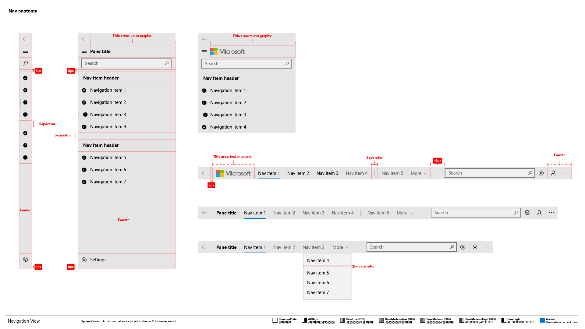
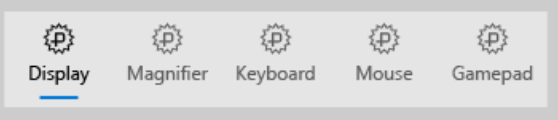
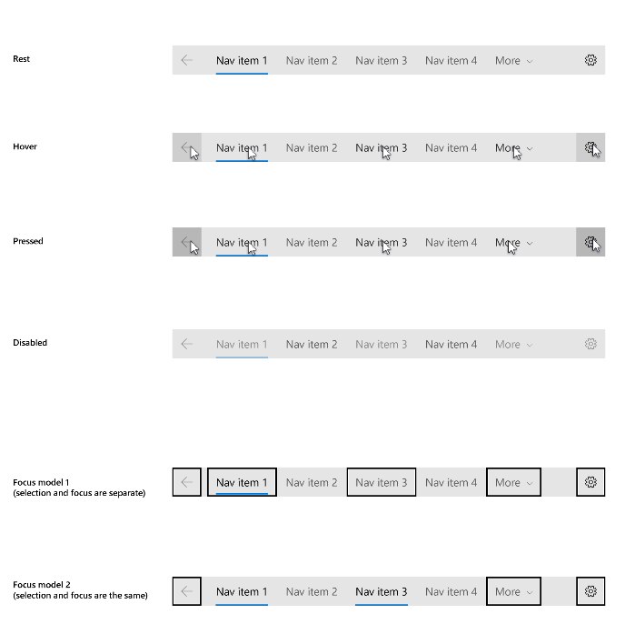
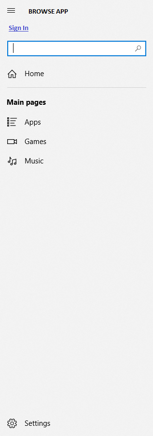
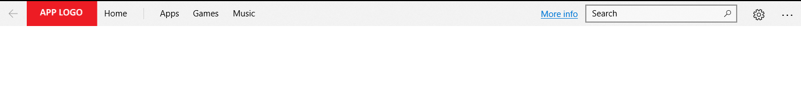

# Navigation view

The navigation view control provides a navigation menu for top-level navigation in your app. This control supports
- a left nav pane, or hamburger menu
- a top nav pane, or top nav bar
- adaptive panes that respond to window width
- tabs

> **Important APIs**: [NavigationView class](https://docs.microsoft.com/uwp/api/windows.ui.xaml.controls.navigationview), [NavigationViewItem class](https://docs.microsoft.com/uwp/api/windows.ui.xaml.controls.navigationviewitem), [NavigationViewDisplayMode enumeration](https://docs.microsoft.com/uwp/api/windows.ui.xaml.controls.navigationviewdisplaymode)

Here's an example of a left nav pane:


Here's an example of a top nav pane:


## Video summary

> [!VIDEO https://channel9.msdn.com/Events/Windows/Windows-Developer-Day-Fall-Creators-Update/WinDev010/player]

## Is this the right control?

NavigationView works well for:

-  An app with many top-level navigational categories (For example, a sports app with categories like Football, Baseball, Basketball, Soccer, and so on.)
-  Providing a consistent navigational experience.
-  Preserving screen real estate of smaller windows.

Pivot vs NavigationView:

- Use NavigationView to support navigation UI patterns with rich related content. 
- Use Pivot sparingly, only if you require touch swiping between a small number of uninteractive content sections.
- Instead of customizing or retemplating Pivot to support top navigation, tabs, and icon tabs, use NavigationView instead.
- Unlike Pivot, NavigationView's API decouples app content from navigational categories, enabling richer app navigation scenarios 
- Unlike Pivot, NavigationView supports flexibility between navigation UI patterns. For example, using a hamburger menu on small window widths and a top navigation pane on large window widths.
- Unlike Pivot, NavigationView supports tying/untying selection and focus, supports back button UI, and provides a consistent model for navigation.

To learn more about navigation UI patterns and elements, see [Navigation design basics](../basics/navigation-basics.md).

If your navigation requires more complex behavior that is not supported by NavigationView, then you might want to consider the [Master/details](master-details.md) pattern instead.

## Examples
<table>
<th align="left">XAML Controls Gallery<th>
<tr>
<td></img></td>
<td>
    <p>If you have the <strong style="font-weight: semi-bold">XAML Controls Gallery</strong> app installed, click here to <a href="xamlcontrolsgallery:/item/NavigationView">open the app and see the NavigationView in action</a> </p>
    <ul>
    <li><a href="https://www.microsoft.com/store/productId/9MSVH128X2ZT">Get the XAML Controls Gallery app (Microsoft Store)</a></li>
    <li><a href="https://github.com/Microsoft/Windows-universal-samples/tree/master/Samples/XamlUIBasics">Get the source code (GitHub)</a></li>
    </ul>
</td>
</tr>
</table>


## NavigationView Anatomy

Here's the overall anatomy when the NavigationView's pane is positioned left:


Here's the overall anatomy when the NavigationView's pane is positioned on top:


### Pane

The pane can be positioned either on top or on left, via the [PanePosition](https://docs.microsoft.com/uwp/api/windows.ui.xaml.controls.navigationview.PaneFooter) property.
The built-in back button appears in the top left-hand corner in the pane. The NavigationView control does not automatically add content to the back stack, but to enable backwards navigation, see the [backwards navigation](#backwards-navigation) section.

Here is the pane anatomy for both pane positions:



Here is what the NavigationView pane can contain:

- Navigation items, in the form of [NavigationViewItem](https://docs.microsoft.com/uwp/api/windows.ui.xaml.controls.navigationviewitem), for navigating to specific pages
- Separators, in the form of [NavigationViewItemSeparator](https://docs.microsoft.com/uwp/api/windows.ui.xaml.controls.navigationviewitemseparator), for grouping navigation items. Set the [Opacity](https://docs.microsoft.com/uwp/api/windows.ui.xaml.controls.navigationviewitemseparator.opacity) property to 0 to render the separator as space.
- Headers, in the form of [NavigationViewItemHeader](https://docs.microsoft.com/uwp/api/windows.ui.xaml.controls.navigationviewitemheader), for labeling groups of items
- An optional [AutoSuggestBox](auto-suggest-box.md) to allow for app-level search
- An optional entry point for [app settings](../app-settings/app-settings-and-data.md). To hide the settings item, use the [IsSettingsVisible](https://docs.microsoft.com/uwp/api/windows.ui.xaml.controls.navigationview.IsSettingsVisible) property
- Free-form content in the pane’s footer, when added to the [PaneFooter](https://docs.microsoft.com/uwp/api/windows.ui.xaml.controls.navigationview.PaneFooter) property
- Free-form content in the pane's header, when added to the [PaneHeader](https://docs.microsoft.com/uwp/api/windows.ui.xaml.controls.navigationview.PaneHeader) property
- Free-form content in the middle of the pane, when added to the [PaneMiddleContent](https://docs.microsoft.com/uwp/api/windows.ui.xaml.controls.navigationview.PaneMiddleContent) property

Here is what is unique to the left pane:

- Navigation ("hamburger") button that lets users open and close the pane. On larger app windows when the pane is open, you may choose to hide this button using the [IsPaneToggleButtonVisible](https://docs.microsoft.com/uwp/api/windows.ui.xaml.controls.navigationview.IsPaneToggleButtonVisible) property.

Here is what is unique to the top pane:

- Positioning the Icon on top of the text, in the form of [IconPositionWhenTopMode](https://docs.microsoft.com/uwp/api/windows.ui.xaml.controls.navigationview.IconPositionWhenTopMode), for navigating to specific pages



#### Visual style

NavigationView items have support for selected, disabled, pointer over, pressed, and focused visual states.

By default, the focused visual state is not tied to the selected visual state. However, by setting the [SelectionFollowsFocus](https://docs.microsoft.com/uwp/api/windows.ui.xaml.controls.navigationview.SelectionFollowsFocus) property to true, you can tie the selected and focused states, meaning an action that would normally change focus would also change selection.




When hardware and software requirements are met, NavigationView automatically uses the new [Acrylic material](../style/acrylic.md) in its pane, and [Reveal highlight](../style/reveal.md) only in its left pane.

### Header

The header area is vertically aligned with the navigation button in the left pane position, and lies below the pane in the top pane position. It has a fixed height of 52 px. Its purpose is to hold the page title of the selected nav category. The header is docked to the top of the page and acts as a scroll clipping point for the content area.

The header must be visible when NavigationView is in Minimal display mode. You may choose to hide the header in other modes, which are used on larger window widths. To do so, set the [AlwaysShowHeader](https://docs.microsoft.com/uwp/api/windows.ui.xaml.controls.navigationview.AlwaysShowHeader) property to **false**.

### Content

The content area is where most of the information for the selected nav category is displayed. 

We recommend 12px margins for your content area when NavigationView is in Minimal mode and 24px margins otherwise.

## Common Usage Patterns

### Adaptive Left Nav Pane

We recommend using a left nav pane when:
- you have a medium-to-high number (5-10) of equally important top-level navigation categories
- you desire very prominent navigation categories with less space for other app content

The default adaptive behavior of NavigationView is to show an expanded left pane on large window widths, a left icon-only nav pane on intermediate window widths, and a hamburger menu button on small window widths.

These map to 3 display modes:
-  **Minimal**
   The hamburger button is used to toggle the pane opena nd closed. 
-  **Compact**
   The pane shows as a narrow icon-only sliver, which can be opened to full width.
-  **Expanded**
   The pane is exapnded open, alongside the content. When closed by activating the hamburger button, the pane's width becomes a narrow sliver.

The [CompactModeThresholdWidth](https://docs.microsoft.com/uwp/api/windows.ui.xaml.controls.navigationview.CompactModeThresholdWidth) property defaults to 641 px and the [ExpandedModeThresholdWidth](https://docs.microsoft.com/uwp/api/windows.ui.xaml.controls.navigationview.ExpandedModeThresholdWidth) property defaults to 1007px, but you can override these defaults.

```xaml
<NavigationView />
```

We recommend this default when:
- you desire more space for app content on smaller window widths
- your navigation categories can be clearly represented with icons

A second common adaptive pattern is to use an expanded left pane on large window widths, and a hamburger menu on both intermediate and small window widths. A good example of this is 

```xaml
<NavigationView CompactModeThresholdWidth="1008"  />
```

We recommend this when:
- you desire more space for app content on smaller window widths
- your navigation categories cannot be clearly represented with icons

A third common adaptive pattern is to use an expanded left pane on large window widths, and a left icon-only nav pane on both intermediate and small window widths. A good example of this is the Mail app.

```xaml
<NavigationView CompactModeThresholdWidth="0"  />
```

We recommend this when:
- you desire more space for app content on smaller window widths
- it is important to always show all navigation options on screen
- your navigation categories can be clearly represented with icons

Here is an example:



```xaml
<NavigationView>

    <NavigationView.MenuItems>
        <NavigationViewItem x:Uid="HomeNavItem" Content="Home" Tag="home">
            <NavigationViewItem.Icon>
                <FontIcon Glyph="&#xE10F;"/>
            </NavigationViewItem.Icon>
        </NavigationViewItem>
        <NavigationViewItemSeparator/>
        <NavigationViewItemHeader Content="Main pages"/>
        <NavigationViewItem x:Uid="AppsNavItem" Icon="AllApps" Content="Apps" Tag="apps"/>
        <NavigationViewItem x:Uid="GamesNavItem" Icon="Video" Content="Games" Tag="games"/>
        <NavigationViewItem x:Uid="MusicNavItem" Icon="Audio" Content="Music" Tag="music"/>
    </NavigationView.MenuItems>

    <NavigationView.AutoSuggestBox>
        <AutoSuggestBox x:Name="ASB" QueryIcon="Find"/>
    </NavigationView.AutoSuggestBox>

    <NavigationView.PaneMiddleContent>
        <HyperlinkButton Content="Sign In"
                    Click="SignIn_Click"
                    Margin="12,0" />
    </NavigationView.PaneMiddleContent>

    <NavigationView.PaneHeader>
        <TextBlock Text="Browse App" />
    </NavigationView.PaneHeader>

</NavigationView>
```


You can force the pane to be open or closed using the [IsPaneOpen](https://docs.microsoft.com/uwp/api/windows.ui.xaml.controls.navigationview.IsPaneOpen) property.


### Hamburger Menu Or Icon-Only Left Pane Across All Window Widths

We recommend using a hamburger menu button across all window widths when:
- you desire as much space as possible for your app content
- you expect end users to spend most of their time on one navigation category
- navigation is less important to your app

```xaml
<NavigationView CompactModeThresholdWidth="10000" ExpandedModeThresholdWidth="10000"  />
```

We recommend using an icon-only left nav pane across all window widths when:
- you desire more space for your app content
- icons clearly describe your app's navigation categories

```xaml
<NavigationView CompactModeThresholdWidth="0" ExpandedModeThresholdWidth="10000"  />
```


### Top Nav Pane Across All Window Widths

We recommend a top only nav pane when:
- you have 5 or less equally important top-level navigation categories, such that any additional top-level navigation categories that end up in the dropdown overflow menu are considered less important
- you desire navigation categories to be displayed at all times, without sacrificing space for app content
- it is important to always show all navigation options on screen
- you desire more space for your app content
- icons cannot clearly describe your app's navigation categories

Here is an example:



```xaml
<NavigationView PanePosition="Top">

    <NavigationView.MenuItems>
        <NavigationViewItem  Content="Home" Tag="home">
            <NavigationViewItem.Icon>
                <FontIcon Glyph="&#xE10F;"/>
            </NavigationViewItem.Icon>
        </NavigationViewItem>
        <NavigationViewItemSeparator/>
        <NavigationViewItem Content="Apps" Tag="apps"/>
        <NavigationViewItem  Content="Movies" Tag="movies"/>
        <NavigationViewItem  Content="Music" Tag="music"/>
    </NavigationView.MenuItems>

    <NavigationView.AutoSuggestBox>
        <AutoSuggestBox x:Name="ASB" QueryIcon="Find"/>
    </NavigationView.AutoSuggestBox>

    <NavigationView.PaneMiddleContent>
        <HyperlinkButton Content="More info"
                    Click="More_Click" />
    </NavigationView.PaneMiddleContent>

    <NavigationView.PaneHeader>
        <Image ImageSource="src/applogo.png" />
    </NavigationView.PaneHeader>

    <NavigationView.PaneFooter>
        <CommandBar>
            <CommandBar.SecondaryCommands>
                <AppBarButton Icon="Downloads" Label="Downloads"/>
            </CommandBar.SecondaryCommands>
        </CommandBar>
    </NavigationView.PaneFooter >


</NavigationView>
```

Note that to trigger a top positioned pane, you must explictly set the [PanePosition](https://docs.microsoft.com/uwp/api/windows.ui.xaml.controls.navigationview.PanePostion) property to Top.

When the pane is positioned on top, there is only 1 possible display mode:
-  **Top**
   The pane is positioned on the top. The dropdown overflow is automatically triggered to swallow nav items that don't fit in layout space.

Note that you can also set the [OverflowLabelMode](https://docs.microsoft.com/uwp/api/windows.ui.xaml.controls.navigationview.PanePostion) property on NavigationView to NavigationViewOverflowLabelMode.NoLabel (the default is NavigationViewOverflowLabelMode.MoreLabel).

Insert image of no label.

### Top Or Left Nav Pane Based on Window Width

Specifically, we recommend using top nav on large window sizes and left nav on small window sizes when:
- you have a set of equally important top-level navigation categories to be displayed together, such that if one category in this set doesn't fit on screen, you collapse to left nav to give them equal importance.
- you wish to preserve as much app retail space as possible in small window sizes

Here is an example:

Insert a diagram showing a minimal mode left nav / a minimal mode left nav with pane open / a top nav side-by-side.

```xaml
<Grid >
    <VisualStateManager.VisualStateGroups>
        <VisualStateGroup>
            <VisualState>
                <VisualState.StateTriggers>
                    <AdaptiveTrigger MinWindowWidth="{x:Bind NavigationViewControl.CompactModeThresholdWidth}" />
                </VisualState.StateTriggers>

                <VisualState.Setters>
                    <Setter Target="NavigationViewControl.PanePosition" Value="Top"/>
                </VisualState.Setters>
            </VisualState>
        </VisualStateGroup>
    </VisualStateManager.VisualStateGroups>

    <NavigationView x:Name="NavigationViewControl" … >
        <NavigationView.MenuItems>
            <NavigationViewItem Content="A" Tag="A" />
            <NavigationViewItem Content="B" Tag="B" />
            <NavigationViewItem Content="C" Tag="C" />
        </NavigationView.MenuItems>            
    </NavigationView>
</Grid>

```

Sometimes apps need to bind different data to the top pane and left pane. Often this is because having less retail space on small window sizes forces the left pane to include more navigation elements.

Here is an example:

Insert a diagram showing a minimal mode left nav / a minimal mode left nav with pane open / a top nav side-by-side. (different data)

Insert code snippet.

```xaml
<Page >
    <Page.Resources>
        <DataTemplate x:name="navItem_top_temp" x:DataType="models:Item">
            <NavigationViewItem Background= Icon={x:Bind TopIcon}, Content={x:Bind TopContent}, Visibility={x:Bind TopVisibility} />
        </DataTemplate>

        <DataTemplate x:name="navItem_temp" x:DataType="models:Item">
            <NavigationViewItem Icon={x:Bind Icon}, Content={x:Bind Content}, Visibility={x:Bind Visibility} />
        </DataTemplate>
        
        <services:NavViewDataTemplateSelector x:Key="navview_selector" 
              NavItemTemplate="{StaticResource navItem_temp}" 
              NavItemTopTemplate="{StaticResource navItem_top_temp}" 
              NavPanePosition="{x:Bind NavigationViewControl.PanePosition}">
        </services:NavViewDataTemplateSelector>
    </Page.Resources>

    <Grid >
        <VisualStateManager.VisualStateGroups>
            <VisualStateGroup>
                <VisualState>
                    <VisualState.StateTriggers>
                        <AdaptiveTrigger MinWindowWidth="{x:Bind NavigationViewControl.CompactModeThresholdWidth}" />
                    </VisualState.StateTriggers>

                    <VisualState.Setters>
                        <Setter Target="NavigationViewControl.PanePosition" Value="Top"/>
                    </VisualState.Setters>
                </VisualState>
            </VisualStateGroup>
        </VisualStateManager.VisualStateGroups>

        <NavView x:Name='NavigationViewControl' MenuItemsSource={x:Bind items}   
                 PanePosition = "Top" MenuItemTemplateSelector="navview_selector" />
    </Grid>
</Page>

```

```csharp
ObservableCollection<Item> items = new ObservableCollection<Item>();
items.Add(new Item() {
    Content = "Aa",
    TopContent ="A",
    Icon = new BitmapIcon() { UriSource = new Uri("ms-appx:///testimage.jpg") },
    TopIcon = new BitmapIcon(),
    ItemVisibility = Visibility.Visible,
    TopItemVisiblity = Visibility.Visible 
});
items.Add(new Item() {
    Content = "Bb",
    TopContent = "B",
    Icon = new BitmapIcon() { UriSource = new Uri("ms-appx:///testimage.jpg") },
    TopIcon = new BitmapIcon(),
    ItemVisibility = Visibility.Visible,
    TopItemVisiblity = Visibility.Visible 
});
items.Add(new Item() {
    Content = "Cc",
    TopContent = "C",
    Icon = new BitmapIcon() { UriSource = new Uri("ms-appx:///testimage.jpg") },
    TopIcon = new BitmapIcon(),
    ItemVisibility = Visibility.Visible,
    TopItemVisiblity = Visibility.Visible 
});

public class NavViewDataTemplateSelector : DataTemplateSelector
    {
        public DataTemplate NavItemTemplate { get; set; }

        public DataTemplate NavItemTopTemplate { get; set; }	

	 public NavigationViewPanePosition NavPanePosition { get; set; }

        protected override DataTemplate SelectTemplateCore(object item)
        {
            Item currItem = item as Item;
            if (NavPanePosition == NavigationViewPanePosition.Top)
                return NavItemTopTemplate;
            else 
                return NavItemTemplate;
        }	

    }

```


### Tabs Pattern

The NavigationView control supports the tabs pattern, in which either
- icons articulate section content
- icons postioned on top of text articulate section content


Here is example XAML demonstrating how to achieve the above:

```xaml
<NavigationView PanePosition="Top" SelectionFollowsFocus="true" IconPositionWhenTopMode="Top" … >
   <NavigationView.MenuItems>
        <NavigationViewItem Icon="Badge" Content="Display" Width="80" />
        <NavigationViewItem Icon="Badge" Content="Magnifier" Width="80"  />
        <NavigationViewItem Icon="Badge" Content="Keyboard" Width="80"  />
        <NavigationViewItem Icon="Badge" Content="Mouse" Width="80"  />
        <NavigationViewItem Icon="Badge" Content="Gamepad" Width="80" />
    </NavigationView.MenuItems>     
</NavigationView>

```

In the tabs pattern, selection and focus are tied. An action that normally shifts focus would also shift selection. In the above example, right arrowing would move the blue bar selection indicator from Display to Magnifier. To achieve this, set the [SelectionFollowsFocus](https://docs.microsoft.com/uwp/api/windows.ui.xaml.controls.navigationview.SelectionFollowsFocus) property on NavigationView to true.

To swap out content when changing tab selection, you can use Frame's [NavigateToType](https://docs.microsoft.com/uwp/api/windows.ui.xaml.controls.frame.NavigateToType) method with NavigateOptions.IsNavigationStackEnabled set to False, and NavigateOptions.TransitionInfoOverride set to the appropriate side-to-side slide animation.

Please see the End to End code sample below for an example of this.


## Interaction

When users tap on a navigation item in the Pane, NavigationView will show that item as selected and will raise an [ItemInvoked](https://docs.microsoft.com/uwp/api/windows.ui.xaml.controls.navigationview.ItemInvoked) event. If the tap results in a new item being selected, NavigationView will also raise a [SelectionChanged](https://docs.microsoft.com/uwp/api/windows.ui.xaml.controls.navigationview.SelectionChanged) event. 

Your app is responsible for updating the Header and Content with appropriate information in response to this user interaction. In addition, we recommend programmatically moving [focus](https://docs.microsoft.com/en-us/uwp/api/windows.ui.xaml.controls.control.FocusState) from the navigation item to the content. By setting initial focus on load, you streamline the user flow and minimize the expected number of keyboard focus moves.

## Backwards navigation
NavigationView has a built-in back button, which can be enabled with the following properties:
- [**IsBackButtonVisible**](https://docs.microsoft.com/uwp/api/windows.ui.xaml.controls.navigationview.IsBackButtonVisible) is a NavigationViewBackButtonVisible enum and "Auto" by default. It is used to show/hide the back button. When the button is not visible, the space for drawing the back button will be collapsed.
- [**IsBackEnabled**](https://docs.microsoft.com/uwp/api/windows.ui.xaml.controls.navigationview.IsBackEnabled) is false by default and can be used to toggle the back button states.
- [**BackRequested**](https://docs.microsoft.com/uwp/api/windows.ui.xaml.controls.navigationview.BackRequested) is fired when a user clicks on the back button.
    - In Minimal/Compact mode, when the NavigationView.Pane is open as a flyout, clicking the back button will close the Pane and fire **PaneClosing** event instead.
    - Not fired if IsBackEnabled is false.


## End-To-End Code Example

The following is an end-to-end example of how you can incorporate NavigationView with both a top navigation pane on large window sizes and a left navigation pane on small window sizes. 

In this sample, we expect end users to frequently select new navigation categories, and so we:
- set the [SelectionFollowsFocus](https://docs.microsoft.com/uwp/api/windows.ui.xaml.controls.navigationview.PanePostion) property to True
- use Frame navigations that do not add to the navigation stack.
- keep the default value on the [ShoulderNavigationEnabled](https://docs.microsoft.com/uwp/api/windows.ui.xaml.controls.navigationview.PanePostion) property, which is "WhenSelectionFollowsFocus". The other possible values are "Always" and "Never".

We also demonstrate how to implement backwards navigation with NavigationView's back button.

Here's an image of what the sample demonstrates:


Here's the sample code:

```xaml
<Page
    x:Class="NavigationViewSample.MainPage"
    xmlns="http://schemas.microsoft.com/winfx/2006/xaml/presentation"
    xmlns:x="http://schemas.microsoft.com/winfx/2006/xaml"
    xmlns:local="using:NavigationViewSample"
    xmlns:d="http://schemas.microsoft.com/expression/blend/2008"
    xmlns:mc="http://schemas.openxmlformats.org/markup-compatibility/2006"
    mc:Ignorable="d">

    <Grid Background="{ThemeResource ApplicationPageBackgroundThemeBrush}">
      <VisualStateManager.VisualStateGroups>
            <VisualStateGroup>
                <VisualState>
                    <VisualState.StateTriggers>
                        <AdaptiveTrigger MinWindowWidth="{x:Bind NavView.CompactModeThresholdWidth}" />
                    </VisualState.StateTriggers>

                    <VisualState.Setters>
                        <Setter Target="NavView.PanePosition" Value="Top"/>
                        <Setter Target="NavView.SelectionFollowsFocus" Value="True"/>
                    </VisualState.Setters>
                </VisualState>
            </VisualStateGroup>
      </VisualStateManager.VisualStateGroups>

      <NavigationView x:Name="NavView"
                    ItemInvoked="NavView_ItemInvoked"
                    IsSettingsVisible="True"
                    Loaded="NavView_Loaded"
                    BackRequested="NavView_BackRequested">

        <NavigationView.MenuItems>
            <NavigationViewItem Content="Home" Tag="home">
                <NavigationViewItem.Icon>
                    <FontIcon Glyph="&#xE10F;"/>
                </NavigationViewItem.Icon>
            </NavigationViewItem>
            <NavigationViewItemSeparator/>
            <NavigationViewItemHeader Content="Main pages"/>
            <NavigationViewItem Icon="AllApps" Content="Apps" Tag="apps"/>
            <NavigationViewItem Icon="Video" Content="Games" Tag="games"/>
            <NavigationViewItem Icon="Audio" Content="Music" Tag="music"/>
        </NavigationView.MenuItems>

        <NavigationView.AutoSuggestBox>
            <AutoSuggestBox x:Name="ASB" QueryIcon="Find"/>
        </NavigationView.AutoSuggestBox>

        <NavigationView.HeaderTemplate>
            <DataTemplate>
                <Grid Margin="24,10,0,0">
                    <Grid.ColumnDefinitions>
                        <ColumnDefinition Width="Auto"/>
                        <ColumnDefinition/>
                    </Grid.ColumnDefinitions>
                    <TextBlock Style="{StaticResource TitleTextBlockStyle}"
                           FontSize="28"
                           VerticalAlignment="Center"
                           Text="Welcome"/>
                    <CommandBar Grid.Column="1"
                            HorizontalAlignment="Right"
                            VerticalAlignment="Top"
                            DefaultLabelPosition="Right"
                            Background="{ThemeResource SystemControlBackgroundAltHighBrush}">
                        <AppBarButton Label="Refresh" Icon="Refresh"/>
                        <AppBarButton Label="Import" Icon="Import"/>
                    </CommandBar>
                </Grid>
            </DataTemplate>
        </NavigationView.HeaderTemplate>

        <Frame x:Name="ContentFrame" Margin="24"/>

      </NavigationView>
    </Grid>
</Page>
```

```csharp
private void NavView_Loaded(object sender, RoutedEventArgs e)
{
    // you can also add items in code behind
    NavView.MenuItems.Add(new NavigationViewItemSeparator());
    NavView.MenuItems.Add(new NavigationViewItem()
    { Content = "My content", Icon = new SymbolIcon(Symbol.Folder), Tag = "content" });

    // set the initial SelectedItem 
    foreach (NavigationViewItemBase item in NavView.MenuItems)
    {
        if (item is NavigationViewItem && item.Tag.ToString() == "home")
        {
            NavView.SelectedItem = item;
            break;
        }
    }
            
    ContentFrame.Navigated += On_Navigated;

    // add keyboard accelerators for backwards navigation
    KeyboardAccelerator GoBack = new KeyboardAccelerator();
    GoBack.Key = VirtualKey.GoBack;
    GoBack.Invoked += BackInvoked;
    KeyboardAccelerator AltLeft = new KeyboardAccelerator();
    AltLeft.Key = VirtualKey.Left;
    AltLeft.Invoked += BackInvoked;
    this.KeyboardAccelerators.Add(GoBack);
    this.KeyboardAccelerators.Add(AltLeft);
    // ALT routes here
    AltLeft.Modifiers = VirtualKeyModifiers.Menu;
    
}

private void NavView_ItemInvoked(NavigationView sender, NavigationViewItemInvokedEventArgs args)
{  
    SlideNavigationTransitionDirection direction;
    switch (args.InvokedDirection)
    {
        case NavigationViewInvokedDirection.Left:
            direction = SlideNavigationTransitionDirection.FromLeft;
        case NavigationViewInvokedDirection.Right:
            direction = SlideNavigationTransitionDirection.FromRight;
        default:
            direction = SlideNavigationTransitionDirection.FromBottom;
    }

    if (args.IsSettingsInvoked)
    {
        ContentFrame.NavigateToType(typeof(SettingsPage), null, 
            new NavigateOptions(){TransitionInfoOverride = new SlideNavigationTransitionInfo() { SlideNavigationTransitionDirection=direction } } );
    }
    else
    {
        NavView_Navigate(args.InvokedItemContainer, direction, sender.PanePosition);
    }
}

private void NavView_Navigate(NavigationViewItemBase item, SlideNavigationTransitionDirection direction, NavigationViewPanePosition position)
{
    NavigateOptions navOptions = new NavigateOptions();
    navOptions.TransitionInfoOverride = new SlideNavigationTransitionInfo() { SlideNavigationTransitionDirection=direction };
    if (position == NavigationViewPanePosition.Top)
    {
        navOptions.IsNavigationStackEnabled = False;
    }

    switch (item.Tag)
    {
        case "home":
            ContentFrame.NavigateToType(typeof(HomePage), null, navOptions);
            break;

        case "apps":
            ContentFrame.NavigateToType(typeof(AppsPage), null, navOptions);
            break;

        case "games":
            ContentFrame.NavigateToType(typeof(GamesPage), null, navOptions);
            break;

        case "music":
            ContentFrame.NavigateToType(typeof(MusicPage), null, navOptions);
            break;

        case "content":
            ContentFrame.NavigateToType(typeof(MyContentPage), null, navOptions);
            break;
    }           
}

private void NavView_BackRequested(NavigationView sender, NavigationViewBackRequestedEventArgs args)
{
    On_BackRequested();
}

private void BackInvoked(KeyboardAccelerator sender, KeyboardAcceleratorInvokedEventArgs args)
{
    On_BackRequested();
    args.Handled = true;
}

private bool On_BackRequested()
{
    bool navigated = false;

    // don't go back if the nav pane is overlayed
    if (NavView.IsPaneOpen && (NavView.DisplayMode == NavigationViewDisplayMode.Compact || NavView.DisplayMode == NavigationViewDisplayMode.Minimal))
    {
        return false;
    }
    else
    {
        if (ContentFrame.CanGoBack)
        {
            ContentFrame.GoBack();
            navigated = true;
        }
    }
    return navigated;
}

private void On_Navigated(object sender, NavigationEventArgs e)
{
    NavView.IsBackEnabled = ContentFrame.CanGoBack;

    if (ContentFrame.SourcePageType == typeof(SettingsPage))
    {
        NavView.SelectedItem = NavView.SettingsItem as NavigationViewItem;
    }
    else 
    {
        Dictionary<Type, string> lookup = new Dictionary<Type, string>()
        {
            {typeof(HomePage), "home"},
            {typeof(AppsPage), "apps"},
            {typeof(GamesPage), "games"},
            {typeof(MusicPage), "music"},
            {typeof(MyContentPage), "content"}    
        };

        String stringTag = lookup[ContentFrame.SourcePageType];

        // set the new SelectedItem  
        foreach (NavigationViewItemBase item in NavView.MenuItems)
        {
            if (item is NavigationViewItem && item.Tag.Equals(stringTag))
            {
                item.IsSelected = true;
                break;
            }
        }        
    }
}
```

## Customizing Top Nav Bar Height

To change the height of NavigationView's top pane, override resources in App.xaml.

```xaml
<Application.Resources>
    <ResourceDictionary>
        <x:Double x:Key="NavigationViewThemeTopHeight">40</x:Double>
        <x:Double x:Key="NavigationViewThemeTopIconHeight">60</x:Double>
    </ResourceDictionary>
</Application.Resources>
```

## Customizing to suppress selection

If you set the [SuppressSelection](https://docs.microsoft.com/uwp/api/windows.ui.xaml.controls.navigationviewitem.SuppressSelection) property on a NavigationViewItem, then even when users tap on a navigation item in the Pane, NavigationView will not show that item as visually selected. In addition, NavigationView will not raise a [SelectionChanged](https://docs.microsoft.com/uwp/api/windows.ui.xaml.controls.navigationview.SelectionChanged) event.

We recommend you consider using this property if the navigation item is a sub-category or filter another navigation item.

```xaml
<NavigationView.MenuItems>
        <NavigationViewItem FontWeight=“Bold” Content=“Games” Tag=“Games” />
        <NavigationViewItemSeparator />
        <NavigationViewItem Content=“Top Games” Tag=“Top Games” SuppressSelection=“True”/>
        <NavigationViewItem Content=“Featured Games” Tag=“Featured Games” SuppressSelection=“True” />
        <NavigationViewItem Content=“Xbox Live Games” Tag=“Xbox Live Games” SuppressSelection=“True” />
	<NavigationViewItem Content=“Collections” Tag=“Collections” SuppressSelection=“True” />
</NavigationView.MenuItems>
```

## Customizing backgrounds

To change the background of NavigationView's main area, set its `Background` property to your preferred brush.

The Pane's background shows in-app acrylic when NavigationView is in Top, Minimal, or Compact mode, and background acrylic in Expanded mode. To update this behavior or customize the appearance of your Pane's acrylic, modify the two theme resources by overwriting them in your App.xaml.

```xaml
<Application.Resources>
    <ResourceDictionary>
        <AcrylicBrush x:Key="NavigationViewDefaultPaneBackground"
        BackgroundSource="Backdrop" TintColor="Yellow" TintOpacity=".6"/>
        <AcrylicBrush x:Key="NavigationViewTopPaneBackground"
        BackgroundSource="Backdrop" TintColor="Yellow" TintOpacity=".6"/>
        <AcrylicBrush x:Key="NavigationViewExpandedPaneBackground"
        BackgroundSource="HostBackdrop" TintColor="Orange" TintOpacity=".8"/>
    </ResourceDictionary>
</Application.Resources>
```

## Extending your app into the title bar

For a seamless, flowing look within your app's window, we recommend extending NavigationView and its acrylic pane up into your app's title bar area. This avoids the visually unattractive shape created by the title bar, the solid-colored NavigationView Content, and the acrylic of NavigationView's pane.

To do so, add the following code to your App.xaml.cs.

```csharp
//draw into the title bar
var coreTitleBar = CoreApplication.GetCurrentView().TitleBar;
coreTitleBar.ExtendViewIntoTitleBar = true;

//remove the solid-colored backgrounds behind the caption controls and system back button
var viewTitleBar = ApplicationView.GetForCurrentView().TitleBar;
viewTitleBar.ButtonBackgroundColor = Colors.Transparent;
viewTitleBar.ButtonInactiveBackgroundColor = Colors.Transparent;
viewTitleBar.ButtonForegroundColor = (Color)Resources["SystemBaseHighColor"];
```

Drawing into the title bar has the side-effect of hiding your app's title. To help users, restore the title by adding your own TextBlock. Add the following markup to the root page containing your NavigationView.

```xaml
<Grid>

    <TextBlock x:Name="AppTitle" 
        xmlns:appmodel="using:Windows.ApplicationModel"
        Text="{x:Bind appmodel:Package.Current.DisplayName}" 
        Style="{StaticResource CaptionTextBlockStyle}" 
        IsHitTestVisible="False" 
        Canvas.ZIndex="1"/>

    <NavigationView Canvas.ZIndex="0" ... />

</Grid>
```

You'll also need to adjust AppTitle's margins depending on back button's visibility. And, when the app is in FullScreenMode, you'll need to remove the spacing for the back arrow, even if the TitleBar reserves space for it.

```csharp
void UpdateAppTitle()
{
    var full = (ApplicationView.GetForCurrentView().IsFullScreenMode);
    var left = 12 + (full ? 0 : CoreApplication.GetCurrentView().TitleBar.SystemOverlayLeftInset);
    AppTitle.Margin = new Thickness(left, 8, 0, 0);
}

Window.Current.CoreWindow.SizeChanged += (s, e) => UpdateAppTitle();
coreTitleBar.LayoutMetricsChanged += (s, e) => UpdateAppTitle();
```

For more information about customizing title bars, see [title bar customization](../shell/title-bar.md).

## Scroll Content Underneath Top Nav Pane

For a seamless look+feel, if your app has pages that use a ScrollViewer and your navigation pane is top positioned, we recommend having the content scroll underneath the top nav pane.

This can be achieved by setting the [CanRenderOutofBounds](https://docs.microsoft.com/uwp/api/windows.ui.xaml.controls.scrollviewer.CanRenderOutOfBounds) property on the relevant ScrollViewer to true.

If your app has very long scrolling content, you may want to consider incorporating sticky headers that attach to the top nav pane and form a smooth surface. 

You can achieve this by setting the [ContentOverlay](https://docs.microsoft.com/uwp/api/windows.ui.xaml.controls.navigationview.ContentOverlay) property on NavigationView. 

Sometimes, if the suer is scrolling down, you may want to hide the nav pane, achieved by setting the [IsPaneVisible](https://docs.microsoft.com/uwp/api/windows.ui.xaml.controls.navigationview.ContentOverlay) property on NavigationView to false.


## Related topics

- [NavigationView class](https://docs.microsoft.com/uwp/api/windows.ui.xaml.controls.navigationview)
- [Master/details](master-details.md)
- [Pivot control](tabs-pivot.md)
- [Navigation basics](../basics/navigation-basics.md)
- [Fluent Design for UWP overview](../fluent-design-system/index.md)

