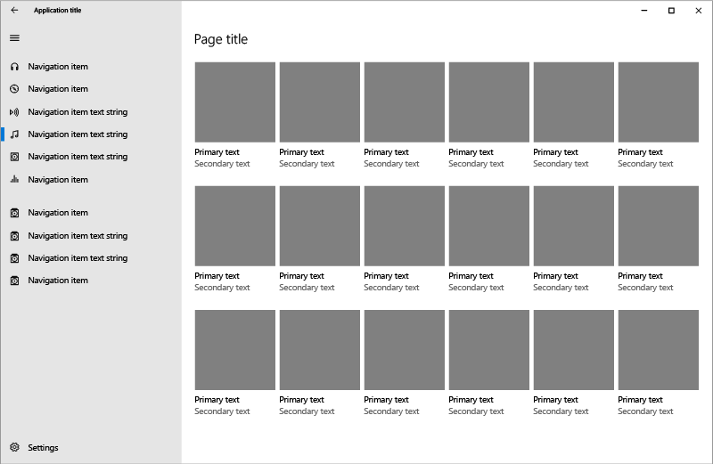
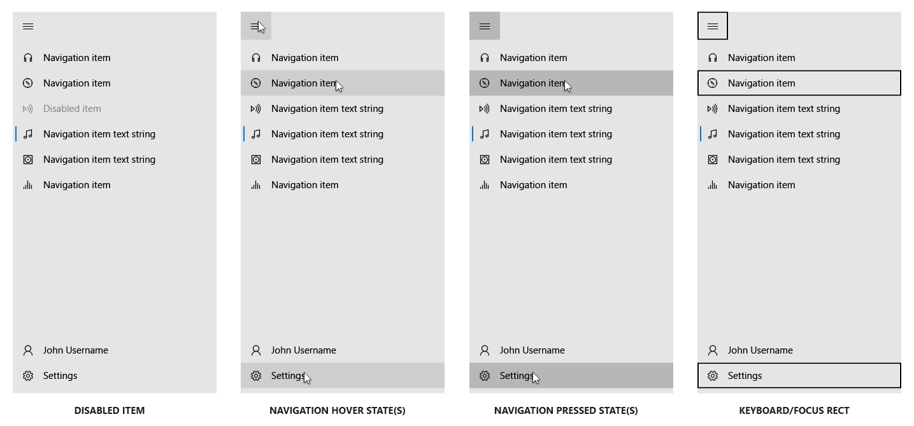
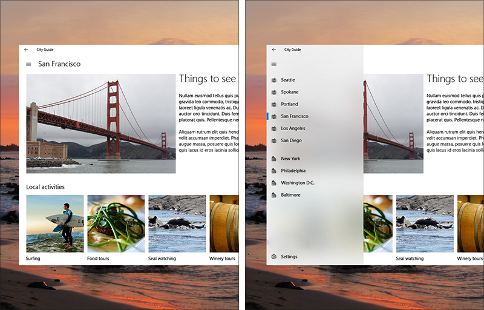
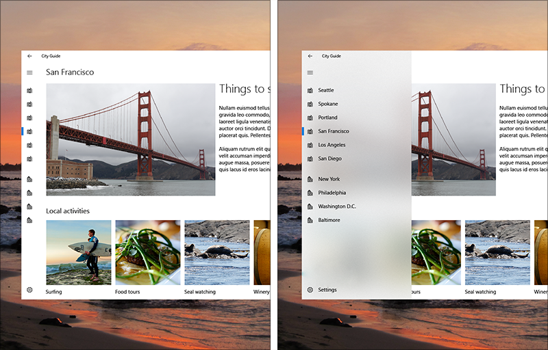
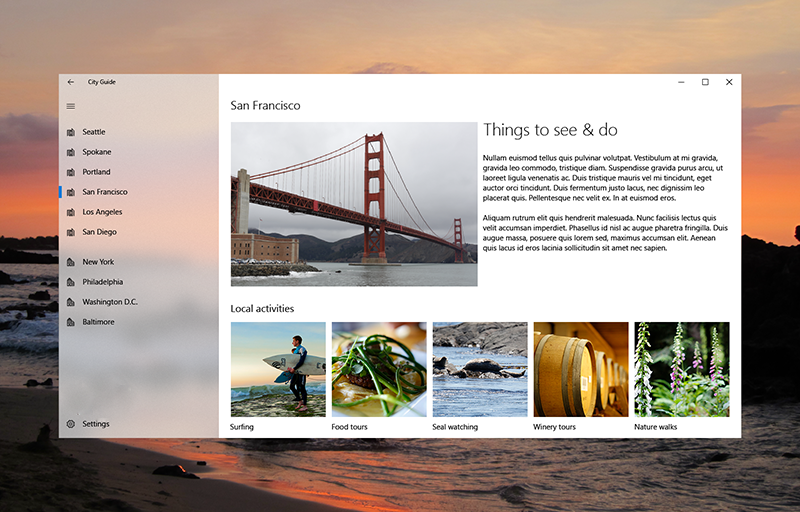
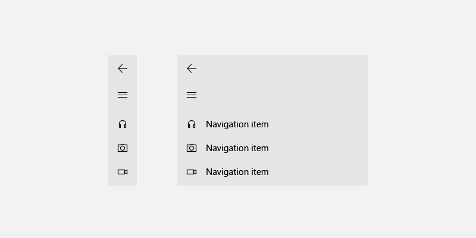

# Navigation view

The navigation view control provides a collapsible navigation menu for top-level navigation in your app. This control implements the nav pane, or hamburger menu, pattern and automatically adapts the pane's display mode to different window sizes.

> **Important APIs**: [NavigationView class](https://docs.microsoft.com/uwp/api/windows.ui.xaml.controls.navigationview), [NavigationViewItem class](https://docs.microsoft.com/uwp/api/windows.ui.xaml.controls.navigationviewitem), [NavigationViewDisplayMode enumeration](https://docs.microsoft.com/uwp/api/windows.ui.xaml.controls.navigationviewdisplaymode)



## Video summary

> [!VIDEO https://channel9.msdn.com/Events/Windows/Windows-Developer-Day-Fall-Creators-Update/WinDev010/player]

## Is this the right control?

NavigationView works well for:

-  Many top-level navigation items of a similar type. (For example, a sports app with categories like Football, Baseball, Basketball, Soccer, and so on.)
-  A medium-to-high number (5-10) of top-level navigational categories.
-  Providing a consistent navigational experience. The pane should include only navigational elements, not actions.
-  Preserving screen real estate of smaller windows.

NavigationView is just one of several navigation elements you can use. To learn more about other navigation patterns and elements, see [Navigation design basics](../basics/navigation-basics.md).

The NavigationView control has many built-in behaviors that implement the simple nav pane pattern. If your navigation requires more complex behavior that is not supported by NavigationView, then you might want to consider the [Master/details](master-details.md) pattern instead.

## Examples
<table>
<th align="left">XAML Controls Gallery<th>
<tr>
<td></img></td>
<td>
    <p>If you have the <strong style="font-weight: semi-bold">XAML Controls Gallery</strong> app installed, click here to <a href="xamlcontrolsgallery:/item/NavigationView">open the app and see the NavigationView in action</a>.</p>
    <ul>
    <li><a href="https://www.microsoft.com/store/productId/9MSVH128X2ZT">Get the XAML Controls Gallery app (Microsoft Store)</a></li>
    <li><a href="https://github.com/Microsoft/Windows-universal-samples/tree/master/Samples/XamlUIBasics">Get the source code (GitHub)</a></li>
    </ul>
</td>
</tr>
</table>

## NavigationView sections


### Pane

The built-in navigation ("hamburger") button lets users open and close the pane. On larger app windows when the pane is open, you may choose to hide this button using the [IsPaneToggleButtonVisible](https://docs.microsoft.com/uwp/api/windows.ui.xaml.controls.navigationview.IsPaneToggleButtonVisible) property. The text label adjacent to the hamburger is the [PaneTitle](https://docs.microsoft.com/uwp/api/windows.ui.xaml.controls.navigationview.PaneTitle) property.

The built-in back button appears in the top left-hand corner in the pane. The NavigationView control does not automatically add content to the back stack, but to enable backwards navigation, see the [backwards navigation](#backwards-navigation) section.

The NavigationView pane also can contain:

- Navigation items, in the form of [NavigationViewItem](https://docs.microsoft.com/uwp/api/windows.ui.xaml.controls.navigationviewitem), for navigating to specific pages
- Separators, in the form of [NavigationViewItemSeparator](https://docs.microsoft.com/uwp/api/windows.ui.xaml.controls.navigationviewitemseparator), for grouping navigation items
- Headers, in the form of [NavigationViewItemHeader](https://docs.microsoft.com/uwp/api/windows.ui.xaml.controls.navigationviewitemheader), for labeling groups of items
- An optional [AutoSuggestBox](auto-suggest-box.md) to allow for app-level search
- An optional entry point for [app settings](../app-settings/app-settings-and-data.md). To hide the settings item, use the [IsSettingsVisible](https://docs.microsoft.com/uwp/api/windows.ui.xaml.controls.navigationview.IsSettingsVisible) property
- Free-form content in the pane’s footer, when added to the [PaneFooter](https://docs.microsoft.com/uwp/api/windows.ui.xaml.controls.navigationview.PaneFooter) property

#### Visual style

NavigationView items have support for selected, disabled, pointer over, pressed, and focused visual states.



When hardware and software requirements are met, NavigationView automatically uses the new [Acrylic material](../style/acrylic.md) and [Reveal highlight](../style/reveal.md) in its pane.

### Header

The header area is vertically aligned with the navigation button and has a fixed height of 52 px. Its purpose is to hold the page title of the selected nav category. The header is docked to the top of the page and acts as a scroll clipping point for the content area.

The header must be visible when NavigationView is in Minimal mode. You may choose to hide the header in other modes, which are used on larger window widths. To do so, set the [AlwaysShowHeader](https://docs.microsoft.com/uwp/api/windows.ui.xaml.controls.navigationview.AlwaysShowHeader) property to **false**.

### Content

The content area is where most of the information for the selected nav category is displayed. 

We recommend 12px margins for your content area when NavigationView is in Minimal mode and 24px margins otherwise.

## NavigationView display modes
The NavigationView pane can be open or closed, and has three display mode options:
-  **Minimal**
   Only the hamburger button remains fixed while the pane shows and hides as needed.
-  **Compact**
   The pane always shows as a narrow sliver which can be opened to full width.
-  **Expanded**
   The pane is open alongside the content. When closed by activating the hamburger button, the pane's width becomes a narrow sliver.

By default, the system automatically selects the optimal display mode based on the amount of screen space available to the control. (You can [override](#overriding-the-default-adaptive-behavior) this setting.)

### Minimal



-  When closed, the pane is hidden by default, with only the nav button visible.
-  Provides on-demand navigation that conserves screen real estate. Ideal for apps on phones and phablets.
-  Pressing the nav button opens and closes the pane, which draws as an overlay above the header and content. Content does not reflow.
-  When open, the pane is transient and can be closed with a light dismiss gesture such as making a selection, pressing the back button, or tapping outside the pane.
-  The selected item becomes visible when the pane’s overlay opens.
-  When requirements are met, the open pane’s background is [in-app acrylic](../style/acrylic.md#acrylic-blend-types).
-  By default, NavigationView is in Minimal mode when its overall width is less than or equal to 640px.

### Compact



-  When closed, a vertical sliver of the pane showing only icons and the nav button is visible.
-  Provides some indication of the selected location while using a small amount of screen real estate.
-  This mode is better suited for medium screens like tablets and [10-foot experiences](../devices/designing-for-tv.md).
-  Pressing the nav button opens and closes the pane, which draws as an overlay above the header and content. Content does not reflow.
-  The Header is not required and can be hidden to give Content more vertical space.
-  The selected item shows a visual indicator to highlight where the user is in the navigation tree.
-  When requirements are met, the pane’s background is [in-app acrylic](../style/acrylic.md#acrylic-blend-types).
-  By default, NavigationView is in Compact mode when its overall width is between 641px and 1007px.

### Expanded



-  By default, the pane remains open. This mode is better suited for larger screens.
-  The pane draws side-by-side with the header and content, which reflows within its available space.
-  When the pane is closed using the nav button, the pane shows as a narrow sliver side-by-side with the header and content.
-  The Header is not required and can be hidden to give Content more vertical space.
-  The selected item shows a visual indicator to highlight where the user is in the navigation tree.
-  When requirements are met, the pane’s background is painted using [background acrylic](../style/acrylic.md#acrylic-blend-types).
-  By default, NavigationView is in Expanded mode when its overall width is greater than 1007px.

### Overriding the default adaptive behavior

NavigationView automatically changes its display mode based on the amount of screen space available to it.

> [!NOTE]
> NavigationView should serve as the root container of your app, as this control is designed to span the full width and height of the app window.
You can override the widths at which the navigation view changes display modes by using the [CompactModeThresholdWidth](https://docs.microsoft.com/uwp/api/windows.ui.xaml.controls.navigationview.CompactModeThresholdWidth) and [ExpandedModeThresholdWidth](https://docs.microsoft.com/uwp/api/windows.ui.xaml.controls.navigationview.ExpandedModeThresholdWidth) properties.

Consider the following scenarios that illustrate when you might want to customize the display mode behavior.

- **Frequent navigation** If you expect users to navigate between app areas somewhat frequently, consider keeping the pane in view at narrower window widths. A music app with Songs / Albums / Artists navigation areas may opt for a 280px pane width and remain in Expanded mode while the app window is wider than 560px.
```xaml
<NavigationView OpenPaneLength="280" CompactModeThresholdWidth="560" ExpandedModeThresholdWidth="560"/>
```

- **Rare navigation** If you expect users to navigate between app areas very infrequently, consider keeping the pane hidden at wider window widths. A calculator app with multiple layouts may opt to remain in Minimal mode even when the app is maximized on a 1080p display.
```xaml
<NavigationView CompactModeThresholdWidth="1920" ExpandedModeThresholdWidth="1920"/>
```

- **Icon disambiguation** If your app’s navigation areas don’t lend themselves to meaningful icons, avoid using Compact mode. An image viewing app with Collections / Albums / Folders navigation areas may opt for showing NavigationView in Minimal mode at narrow and medium widths, and in Expanded mode at wide width.
```xaml
<NavigationView CompactModeThresholdWidth="1008"/>
```

## Interaction

When users tap on a navigation item in the Pane, NavigationView will show that item as selected and will raise an [ItemInvoked](https://docs.microsoft.com/uwp/api/windows.ui.xaml.controls.navigationview.ItemInvoked) event. If the tap results in a new item being selected, NavigationView will also raise a [SelectionChanged](https://docs.microsoft.com/uwp/api/windows.ui.xaml.controls.navigationview.SelectionChanged) event. 

Your app is responsible for updating the Header and Content with appropriate information in response to this user interaction. In addition, we recommend programmatically moving [focus](https://docs.microsoft.com/en-us/uwp/api/windows.ui.xaml.controls.control.FocusState) from the navigation item to the content. By setting initial focus on load, you streamline the user flow and minimize the expected number of keyboard focus moves.

## Backwards navigation
NavigationView has a built-in back button, which can be enabled with the following properties:
- [**IsBackButtonVisible**](https://docs.microsoft.com/uwp/api/windows.ui.xaml.controls.navigationview.IsBackButtonVisible) is a NavigationViewBackButtonVisible enum and "Auto" by default. It is used to show/hide the back button. When the button is not visible, the space for drawing the back button will be collapsed.
- [**IsBackEnabled**](https://docs.microsoft.com/uwp/api/windows.ui.xaml.controls.navigationview.IsBackEnabled) is false by default and can be used to toggle the back button states.
- [**BackRequested**](https://docs.microsoft.com/uwp/api/windows.ui.xaml.controls.navigationview.BackRequested) is fired when a user clicks on the back button.
    - In Minimal/Compact mode, when the NavigationView.Pane is open as a flyout, clicking the back button will close the Pane and fire **PaneClosing** event instead.
    - Not fired if IsBackEnabled is false.



## Code example

The following is a simple example of how you can incorporate NavigationView into your app. 

We demonstrate how to implement backwards navigation with NavigationView's back button. Note that to use NavigationView's back navigation properties, you'll need the [Windows 10 Insider Preview (introduced v10.0.17110.0)](https://www.microsoft.com/en-us/software-download/windowsinsiderpreviewSDK).

We also demonstrate localization of nav item content strings with `x:Uid`. For more information on localization, see [Localize strings in your UI](../../app-resources/localize-strings-ui-manifest.md).

```xaml
<Page
    x:Class="NavigationViewSample.MainPage"
    xmlns="http://schemas.microsoft.com/winfx/2006/xaml/presentation"
    xmlns:x="http://schemas.microsoft.com/winfx/2006/xaml"
    xmlns:local="using:NavigationViewSample"
    xmlns:d="http://schemas.microsoft.com/expression/blend/2008"
    xmlns:mc="http://schemas.openxmlformats.org/markup-compatibility/2006"
    mc:Ignorable="d">

    <NavigationView x:Name="NavView"
                    ItemInvoked="NavView_ItemInvoked"
                    Loaded="NavView_Loaded"
                    BackRequested="NavView_BackRequested">

        <NavigationView.MenuItems>
            <NavigationViewItem x:Uid="HomeNavItem" Content="Home" Tag="home">
                <NavigationViewItem.Icon>
                    <FontIcon Glyph="&#xE10F;"/>
                </NavigationViewItem.Icon>
            </NavigationViewItem>
            <NavigationViewItemSeparator/>
            <NavigationViewItemHeader Content="Main pages"/>
            <NavigationViewItem x:Uid="AppsNavItem" Icon="AllApps" Content="Apps" Tag="apps"/>
            <NavigationViewItem x:Uid="GamesNavItem" Icon="Video" Content="Games" Tag="games"/>
            <NavigationViewItem x:Uid="MusicNavItem" Icon="Audio" Content="Music" Tag="music"/>
        </NavigationView.MenuItems>

        <NavigationView.AutoSuggestBox>
            <AutoSuggestBox x:Name="ASB" QueryIcon="Find"/>
        </NavigationView.AutoSuggestBox>

        <NavigationView.HeaderTemplate>
            <DataTemplate>
                <Grid Margin="24,10,0,0">
                    <Grid.ColumnDefinitions>
                        <ColumnDefinition Width="Auto"/>
                        <ColumnDefinition/>
                    </Grid.ColumnDefinitions>
                    <TextBlock Style="{StaticResource TitleTextBlockStyle}"
                           FontSize="28"
                           VerticalAlignment="Center"
                           Text="Welcome"/>
                    <CommandBar Grid.Column="1"
                            HorizontalAlignment="Right"
                            VerticalAlignment="Top"
                            DefaultLabelPosition="Right"
                            Background="{ThemeResource SystemControlBackgroundAltHighBrush}">
                        <AppBarButton Label="Refresh" Icon="Refresh"/>
                        <AppBarButton Label="Import" Icon="Import"/>
                    </CommandBar>
                </Grid>
            </DataTemplate>
        </NavigationView.HeaderTemplate>

        <NavigationView.PaneFooter>
            <HyperlinkButton x:Name="MoreInfoBtn"
                             Content="More info"
                             Click="More_Click"
                             Margin="12,0"/>
        </NavigationView.PaneFooter>

        <Frame x:Name="ContentFrame" Margin="24">
            <Frame.ContentTransitions>
                <TransitionCollection>
                    <NavigationThemeTransition/>
                </TransitionCollection>
            </Frame.ContentTransitions>
        </Frame>

    </NavigationView>
</Page>
```

```csharp
// List of ValueTuple holding the Navigation Tag and the relative Navigation Page
private readonly IList<(string Tag, Type Page)> _pages = new List<(string Tag, Type Page)>
{
    ("home", typeof(HomePage)),
    ("apps", typeof(AppsPage)),
    ("games", typeof(GamesPage)),
    ("music", typeof(MusicPage))
};

private void NavView_Loaded(object sender, RoutedEventArgs e)
{
    // You can also add items in code behind
    NavView.MenuItems.Add(new NavigationViewItemSeparator());
    NavView.MenuItems.Add(new NavigationViewItem
    {
        Content = "My content",
        Icon = new SymbolIcon(Symbol.Folder),
        Tag = "content"
    });
    _pages.Add(("content", typeof(TabbedPage)));

    ContentFrame.Navigated += On_Navigated;

    // NavView doesn't load any page by default: you need to specify it
    NavView_Navigate("home");

    // Add keyboard accelerators for backwards navigation
    var goBack = new KeyboardAccelerator { Key = VirtualKey.GoBack };
    goBack.Invoked += BackInvoked;
    this.KeyboardAccelerators.Add(goBack);

    // ALT routes here
    var altLeft = new KeyboardAccelerator
    {
        Key = VirtualKey.Left,
        Modifiers = VirtualKeyModifiers.Menu
    };
    altLeft.Invoked += BackInvoked;
    this.KeyboardAccelerators.Add(altLeft);
}

private void NavView_ItemInvoked(NavigationView sender, NavigationViewItemInvokedEventArgs args)
{
    if (args.IsSettingsInvoked)
    {
        ContentFrame.Navigate(typeof(SettingsPage));
    }
    else
    {
        // Getting the Tag from Content (args.InvokedItem is the content of NavigationViewItem)
        var navItemTag = NavView.MenuItems
            .OfType<NavigationViewItem>()
            .First(i => args.InvokedItem.Equals(i.Content))
            .Tag.ToString();
        NavView_Navigate(navItemTag);
    }
}

private void NavView_Navigate(string navItemTag)
{
    var item = _pages.First(p => p.Tag.Equals(navItemTag));
    ContentFrame.Navigate(item.Page);
}

private void NavView_BackRequested(NavigationView sender, NavigationViewBackRequestedEventArgs args)
{
    On_BackRequested();
}

private void BackInvoked(KeyboardAccelerator sender, KeyboardAcceleratorInvokedEventArgs args)
{
    On_BackRequested();
    args.Handled = true;
}

private bool On_BackRequested()
{
    if (!ContentFrame.CanGoBack)
        return false;

    // Don't go back if the nav pane is overlayed
    if (NavView.IsPaneOpen &&
        (NavView.DisplayMode == NavigationViewDisplayMode.Compact ||
        NavView.DisplayMode == NavigationViewDisplayMode.Minimal))
        return false;

    ContentFrame.GoBack();
    return true;
}

private void On_Navigated(object sender, NavigationEventArgs e)
{
    NavView.IsBackEnabled = ContentFrame.CanGoBack;

    if (ContentFrame.SourcePageType == typeof(SettingsPage))
    {
        // SettingsItem is not part of NavView.MenuItems, and doesn't have a Tag
        NavView.SelectedItem = (NavigationViewItem)NavView.SettingsItem;
    }
    else
    {
        var item = _pages.First(p => p.Page == e.SourcePageType);
        NavView.SelectedItem = NavView.MenuItems
            .OfType<NavigationViewItem>()
            .First(n => n.Tag.Equals(item.Tag));
    }
}

private void More_Click(object sender, RoutedEventArgs e)
{
    // TODO: Implement
}
```

## Customizing backgrounds

To change the background of NavigationView's main area, set its `Background` property to your preferred brush.

The Pane's background shows in-app acrylic when NavigationView is in Minimal or Compact mode, and background acrylic in Expanded mode. To update this behavior or customize the appearance of your Pane's acrylic, modify the two theme resources by overwriting them in your App.xaml.

```xaml
<Application.Resources>
    <ResourceDictionary>
        <AcrylicBrush x:Key="NavigationViewDefaultPaneBackground"
        BackgroundSource="Backdrop" TintColor="Yellow" TintOpacity=".6"/>
        <AcrylicBrush x:Key="NavigationViewExpandedPaneBackground"
        BackgroundSource="HostBackdrop" TintColor="Orange" TintOpacity=".8"/>
    </ResourceDictionary>
</Application.Resources>
```

## Extending your app into the title bar

For a seamless, flowing look within your app's window, we recommend extending NavigationView and its acrylic pane up into your app's title bar area. This avoids the visually unattractive shape created by the title bar, the solid-colored NavigationView Content, and the acrylic of NavigationView's pane.

To do so, add the following code to your App.xaml.cs.

```csharp
//draw into the title bar
var coreTitleBar = CoreApplication.GetCurrentView().TitleBar;
coreTitleBar.ExtendViewIntoTitleBar = true;

//remove the solid-colored backgrounds behind the caption controls and system back button
var viewTitleBar = ApplicationView.GetForCurrentView().TitleBar;
viewTitleBar.ButtonBackgroundColor = Colors.Transparent;
viewTitleBar.ButtonInactiveBackgroundColor = Colors.Transparent;
viewTitleBar.ButtonForegroundColor = (Color)Resources["SystemBaseHighColor"];
```

Drawing into the title bar has the side-effect of hiding your app's title. To help users, restore the title by adding your own TextBlock. Add the following markup to the root page containing your NavigationView.

```xaml
<Grid>
    <TextBlock x:Name="AppTitle"
        xmlns:appmodel="using:Windows.ApplicationModel"
        Text="{x:Bind appmodel:Package.Current.DisplayName}"
        Style="{StaticResource CaptionTextBlockStyle}"
        IsHitTestVisible="False"
        Canvas.ZIndex="1"/>
    

    <NavigationView Canvas.ZIndex="0" ... />

</Grid>
```

You'll also need to adjust AppTitle's margins depending on back button's visibility. And, when the app is in FullScreenMode, you'll need to remove the spacing for the back arrow, even if the TitleBar reserves space for it.

```csharp
var coreTitleBar = CoreApplication.GetCurrentView().TitleBar;
Window.Current.SetTitleBar(AppTitle);
coreTitleBar.ExtendViewIntoTitleBar = true;

void UpdateAppTitle()
{
    var full = (ApplicationView.GetForCurrentView().IsFullScreenMode);
    var left = 12 + (full ? 0 : CoreApplication.GetCurrentView().TitleBar.SystemOverlayLeftInset);
    AppTitle.Margin = new Thickness(left, 8, 0, 0);
}

Window.Current.CoreWindow.SizeChanged += (s, e) => UpdateAppTitle();
coreTitleBar.LayoutMetricsChanged += (s, e) => UpdateAppTitle();
```

For more information about customizing title bars, see [title bar customization](../shell/title-bar.md).

## Related topics

- [NavigationView class](https://docs.microsoft.com/uwp/api/windows.ui.xaml.controls.navigationview)
- [Master/details](master-details.md)
- [Pivot control](tabs-pivot.md)
- [Navigation basics](../basics/navigation-basics.md)
- [Fluent Design for UWP overview](../fluent-design-system/index.md)

