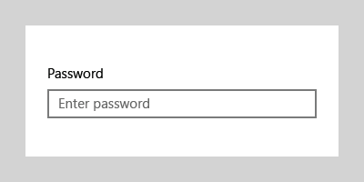
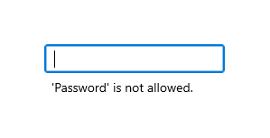
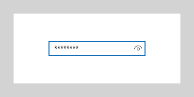
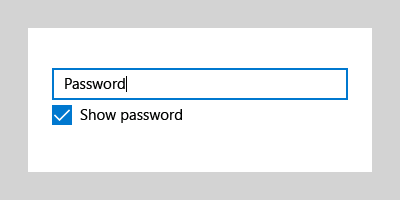

# Password box

A password box is a text input box that conceals the characters typed into it for the purpose of privacy. A password box looks like a text box, except that it renders placeholder characters in place of the text that has been entered. You can configure the placeholder character.

By default, the password box provides a way for the user to view their password by holding down a reveal button. You can disable the reveal button, or provide an alternate mechanism to reveal the password, such as a check box.

**Get the Windows UI Library**

|  |  |
| - | - |
|  | Windows UI Library 2.2 or later includes a new template for this control that uses rounded corners. For more info, see [Corner radius](../style/rounded-corner.md). WinUI is a NuGet package that contains new controls and UI features for Windows apps. For more info, including installation instructions, see [Windows UI Library](/uwp/toolkits/winui/). |

> **Platform APIs**: [PasswordBox class](/uwp/api/Windows.UI.Xaml.Controls.PasswordBox), [Password property](/uwp/api/windows.ui.xaml.controls.passwordbox.password), [PasswordChar property](/uwp/api/windows.ui.xaml.controls.passwordbox.passwordchar), [PasswordRevealMode property](/uwp/api/windows.ui.xaml.controls.passwordbox.passwordrevealmode), [PasswordChanged event](/uwp/api/windows.ui.xaml.controls.passwordbox.passwordchanged)

## Is this the right control?

Use a **PasswordBox** control to collect a password or other private data, such as a Social Security number.

For more info about choosing the right text control, see the [Text controls](text-controls.md) article.

## Examples

<table>
<th align="left">XAML Controls Gallery<th>
<tr>
<td></img></td>
<td>
    <p>If you have the <strong style="font-weight: semi-bold">XAML Controls Gallery</strong> app installed, click here to <a href="xamlcontrolsgallery:/item/PasswordBox">open the app and see the PasswordBox in action</a>.</p>
    <ul>
    <li><a href="https://www.microsoft.com/store/productId/9MSVH128X2ZT">Get the XAML Controls Gallery app (Microsoft Store)</a></li>
    <li><a href="https://github.com/Microsoft/Xaml-Controls-Gallery">Get the source code (GitHub)</a></li>
    </ul>
</td>
</tr>
</table>

The password box has several states, including these notable ones.

A password box at rest can show hint text so that the user knows its purpose:



When the user types in a password box, the default behavior is to show bullets that hide the text being entered:


Pressing the "reveal" button on the right gives a peek at the password text being entered:


## Create a password box

Use the [Password](/uwp/api/windows.ui.xaml.controls.passwordbox.password) property to get or set the contents of the PasswordBox. You can do this in the handler for the [PasswordChanged](/uwp/api/windows.ui.xaml.controls.passwordbox.passwordchanged) event to perform validation while the user enters the password. Or, you can use another event, like a button [Click](/uwp/api/windows.ui.xaml.controls.primitives.buttonbase.click), to perform validation after the user completes the text entry.

Here's the XAML for a password box control that demonstrates the default look of the PasswordBox. When the user enters a password, you check to see if it's the literal value, "Password". If it is, you display a message to the user.

```xaml
<StackPanel>  
  <PasswordBox x:Name="passwordBox" Width="200" MaxLength="16"
             PasswordChanged="passwordBox_PasswordChanged"/>

  <TextBlock x:Name="statusText" Margin="10" HorizontalAlignment="Center" />
</StackPanel>   
```

```csharp
private void passwordBox_PasswordChanged(object sender, RoutedEventArgs e)
{
    if (passwordBox.Password == "Password")
    {
        statusText.Text = "'Password' is not allowed as a password.";
    }
    else
    {
        statusText.Text = string.Empty;
    }
}
```
Here's the result when this code runs and the user enters "Password".



### Password character

You can change the character used to mask the password by setting the [PasswordChar](/uwp/api/windows.ui.xaml.controls.passwordbox.passwordchar) property. Here, the default bullet is replaced with an asterisk.

```xaml
<PasswordBox x:Name="passwordBox" Width="200" PasswordChar="*"/>
```

The result looks like this.



### Headers and placeholder text

You can use the [Header](/uwp/api/windows.ui.xaml.controls.passwordbox.header) and [PlaceholderText](/uwp/api/windows.ui.xaml.controls.passwordbox.placeholdertext) properties to provide context for the PasswordBox. This is especially useful when you have multiple boxes, such as on a form to change a password.

```xaml
<PasswordBox x:Name="passwordBox" Width="200" Header="Password" PlaceholderText="Enter your password"/>
```


### Maximum length

Specify the maximum number of characters that the user can enter by setting the [MaxLength](/uwp/api/windows.ui.xaml.controls.passwordbox.maxlength) property. There is no property to specify a minimum length, but you can check the password length, and perform any other validation, in your app code.

## Password reveal mode

The PasswordBox has a built-in button that the user can press to display the password text. Here's the result of the user's action. When the user releases it, the password is automatically hidden again.


### Peek mode

By default, the password reveal button (or "peek" button) is shown. The user must continuously press the button to view the password, so that a high level of security is maintained.

The value of the [PasswordRevealMode](/uwp/api/windows.ui.xaml.controls.passwordbox.passwordrevealmode) property is not the only factor that determines whether a password reveal button is visible to the user. Other factors include whether the control is displayed above a minimum width, whether the PasswordBox has focus, and whether the text entry field contains at least one character. The password reveal button is shown only when the PasswordBox receives focus for the first time and a character is entered. If the PasswordBox loses focus and then regains focus, the reveal button is not shown again unless the password is cleared and character entry starts over.

> **Caution**&nbsp;&nbsp;Prior to Windows 10, the password reveal button was not shown by default. If the security of your app requires that the password is always obscured, be sure to set PasswordRevealMode to Hidden.

### Hidden and Visible modes

The other [PasswordRevealMode](/uwp/api/Windows.UI.Xaml.Controls.PasswordRevealMode) enumeration values, **Hidden** and **Visible**, hide the password reveal button and let you programmatically manage whether the password is obscured.

To always obscure the password, set PasswordRevealMode to Hidden. Unless you need the password to be always obscured, you can provide a custom UI to let the user toggle the PasswordRevealMode between Hidden and Visible. For example, you can use a check box to toggle whether the password is obscured, as shown in the following example. You can also use other controls, like [ToggleButton](/uwp/api/Windows.UI.Xaml.Controls.Primitives.ToggleButton), to let the user switch modes.

This example shows how to use a [CheckBox](/uwp/api/Windows.UI.Xaml.Controls.CheckBox) to let a user switch the reveal mode of a PasswordBox.

```xaml
<StackPanel Width="200">
    <PasswordBox Name="passwordBox1"
                 PasswordRevealMode="Hidden"/>
    <CheckBox Name="revealModeCheckBox" Content="Show password"
              IsChecked="False"
              Checked="CheckBox_Changed" Unchecked="CheckBox_Changed"/>
</StackPanel>
```

```csharp
private void CheckBox_Changed(object sender, RoutedEventArgs e)
{
    if (revealModeCheckBox.IsChecked == true)
    {
        passwordBox1.PasswordRevealMode = PasswordRevealMode.Visible;
    }
    else
    {
        passwordBox1.PasswordRevealMode = PasswordRevealMode.Hidden;
    }
}
```

This PasswordBox looks like this.



## Choose the right keyboard for your text control

To help users to enter data using the touch keyboard, or Soft Input Panel (SIP), you can set the input scope of the text control to match the kind of data the user is expected to enter. PasswordBox supports only the **Password** and **NumericPin** input scope values. Any other value is ignored.

For more info about how to use input scopes, see [Use input scope to change the touch keyboard](../input/use-input-scope-to-change-the-touch-keyboard.md).

## Recommendations

-   Use a label or placeholder text if the purpose of the password box isn't clear. A label is visible whether or not the text input box has a value. Placeholder text is displayed inside the text input box and disappears once a value has been entered.
-   Give the password box an appropriate width for the range of values that can be entered. Word length varies between languages, so take localization into account if you want your app to be world-ready.
-   Don't put another control right next to a password input box. The password box has a password reveal button for users to verify the passwords they have typed, and having another control right next to it might make users accidentally reveal their passwords when they try to interact with the other control. To prevent this from happening, put some spacing between the password in put box and the other control, or put the other control on the next line.
-   Consider presenting two password boxes for account creation: one for the new password, and a second to confirm the new password.
-   Only show a single password box for logins.
-   When a password box is used to enter a PIN, consider providing an instant response as soon as the last number is entered instead of using a confirmation button.

## Get the sample code

- [XAML Controls Gallery sample](https://github.com/Microsoft/Xaml-Controls-Gallery) - See all the XAML controls in an interactive format.

## Related articles

[Text controls](text-controls.md)

- [Guidelines for spell checking](text-controls.md)
- [Adding search](/previous-versions/windows/apps/hh465231(v=win.10))
- [Guidelines for text input](text-controls.md)
- [TextBox class](/uwp/api/Windows.UI.Xaml.Controls.TextBox)
- [Windows.UI.Xaml.Controls PasswordBox class](/uwp/api/Windows.UI.Xaml.Controls.PasswordBox)
- [String.Length property](/dotnet/api/system.string.length)