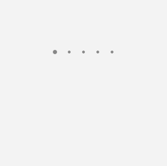
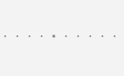
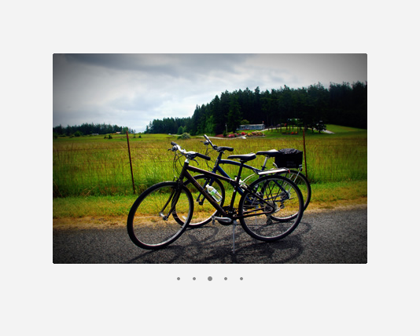

# PipsPager
The PipsPager control enables paginated content to be navigated to beyond the bounds of the viewport (visible area). The PipsPager is independent of the content shown and best for experiences where the content is paginated and not explicitly numbered. In these scenarios, the pages are commonly indicated with 'dot' glyphs instead of numbers to encourage discovery of content and reduce unnecessary UI elements on the page.

**Get the Windows UI Library**

:::row:::
   :::column:::
      
   :::column-end:::
   :::column span="3":::
      The **PipsPager** control requires the Windows UI Library, a NuGet package that contains new controls and UI features for Windows apps. For more info, including installation instructions, see [Windows UI Library](/uwp/toolkits/winui/).
   :::column-end:::
   :::column:::

   :::column-end:::
:::row-end:::

> **Windows UI Library APIs:** [PipsPager class](/uwp/api/microsoft.ui.xaml.controls.pipspager)

> [!TIP]
> Throughout this document, we use the **muxc** alias in XAML to represent the Windows UI Library APIs that we have included in our project. We have added this to our [Page](/uwp/api/windows.ui.xaml.controls.page) element: `xmlns:muxc="using:Microsoft.UI.Xaml.Controls"`
>
>In the code-behind, we also use the **muxc** alias in C# to represent the Windows UI Library APIs that we have included in our project. We have added this **using** statement at the top of the file: `using muxc = Microsoft.UI.Xaml.Controls;`

## Is this the right control?

Use a PipsPager when the content in the layout is not explicitly numbered or 
a glyph-based representation of numbered pages is desired.
This UI is commonly used in photo viewers, app lists, and when display space is limited.
The PipsPager can be oriented vertically or horizontally.

### What is a pip?

Pips represent a unit of numerical value, typically represented as dots,
however can be customized to other glyphs like dashes or squares.
In the PipsPager control by default, a solid dot will represent each page of the layout. 
They can be selected by the user to navigate to a specific page.

## Examples
### Create a PipsPager

A PipsPager with five visible pips that can be selected by the user to jump to that specific page.
Additionally, the user can use navigational buttons; previous and next, to change the selected page incrementally. 
Navigating beyond the first or last item does not wrap around.
By default, the navigational buttons are collapsed, the pips are oriented horizontally,
and the total number of pages is infinite.



XAML
```XAML 
<muxc:PipsPager x:Name="DefaultPipsPager" />
```

### PipsPager with visible navigational buttons

The visibility of the previous and next buttons can be set via the
`PreviousButtonVisibility` and `NextButtonVisibility` properties. 
These buttons allow the user to incrementally select a page. The possible values are:
- Visible: The button is visible and enabled, except it is hidden at the extents.
  - For example, when the current page is the first page, the previous button is hidden.
  - Note: Hidden means that the button is invisible but does take up layout space.
- VisibleOnPointerOver: The behavior is the same as Visible *except* that the button is only Visible when
the user is hovering over the paging UI with their cursor or keyboard focus is on the PipsPager.
- Collapsed: The button is not visible to the user and does **not** take up layout space. (Default)


```xaml
<muxc:PipsPager x:Name="VisibleButtonPipsPager"
  NumberOfPages="5"
  PreviousButtonVisibility="Visible"
  NextButtonVisibility="Visible" />
```

### Vertical PipsPager with VisibleOnPointerOver button visibility

The PipsPager can also be oriented vertically which does not change its behavior or interaction.
The various button visibility modes can apply to either orientation.
The below example highlights the VisibleOnPointerOver button visibility.


```xaml 
<muxc:PipsPager x:Name="VerticalPipsPager"
  NumberOfPages="5"
  Orientation="Vertical" 
  PreviousButtonVisibility="VisibleOnPointerOver" 
  NextButtonVisibility="VisibleOnPointerOver" />
```

### Number of pages displayed less than total

If the number of pages of content is large and do not need to be navigated to at once,
the MaxVisiblePips property can be set to limit the number of visible, interactive, pips.
If the NumberOfPages is greater than the MaxVisiblePips then the pips will scroll so that the selected page is
centered in the control. If the NumberOfPages is equal to or less than the MaxVisiblePips,
no scrolling will occur and the number of pips shown will be the same as the NumberOfPages.

Additionally, if there is not enough layout space for the MaxVisiblePips number of pages, the pips will be clipped.
The number of pips visible is the minimum between the MaxVisiblePips and the NumberOfPages.


By default, the maximum number of visible pips is 5.



```xaml
<muxc:PipsPager x:Name="ScrollingPipsPager"
  NumberOfPages="20"
  MaxVisiblePips="10" />
```

### Integrate PipsPager with a Collection control

Commonly, a PipsPager is used in conjunction with a Collection control.
The below example shows how to bind a PipsPager with a FlipView to provide
an extra way to navigate through content and indicate its page.

Note: To use the PipsPager as a page indicator **only**,
set IsEnabled to false in the control to disable user interaction.



```xaml
<StackPanel>
  <FlipView x:Name="Gallery" MaxWidth="400" Height="270" ItemsSource="{x:Bind Pictures}">
      <FlipView.ItemTemplate>
          <DataTemplate x:DataType="x:String">
              <Image Source="{x:Bind Mode=OneWay}"/>
          </DataTemplate>
      </FlipView.ItemTemplate>
  </FlipView>

  <!-- The SelectedPageIndex is bound to the FlipView to keep the two in sync -->
  <muxc:PipsPager x:Name="FlipViewPipsPager"
      HorizontalAlignment="Center"
      Margin="0, 10, 0, 0"
      NumberOfPages="{x:Bind Pictures.Count}"
      SelectedPageIndex="{x:Bind Path=Gallery.SelectedIndex, Mode=TwoWay}" />
</StackPanel>
```

### Pip and Button customization

The navigational buttons and pips are able to be customized via the PreviousButtonStyle, NextButtonStyle, SelectedPipStyle, and DefaultPipStyle.

If the PreviousButtonStyle or NextButtonStyle sets the Visibility property on the navigational button, it will take precedence over PreviousButtonVisibility or NextButtonVisibility respectively unless they are set to the PipsPagerButtonVisibility value, "Collapsed".


``` xaml
<Page.Resources>
    <Style x:Key="NavButtonBaseStyle" TargetType="Button" BasedOn="{StaticResource PipsPagerNavigationButtonBaseStyle}">
        <Setter Property="Width" Value="30" />
        <Setter Property="Height" Value="30" />
        <Setter Property="FontSize" Value="12" />
    </Style>

    <Style x:Key="PreviousButtonStyle" BasedOn="{StaticResource NavButtonBaseStyle}" TargetType="Button">
        <Setter Property="Content" Value="&#xEDDB;" />
    </Style>

    <Style x:Key="NextButtonStyle" BasedOn="{StaticResource NavButtonBaseStyle}" TargetType="Button">
        <Setter Property="Content" Value="&#xEDDC;" />
    </Style>
</Page.Resources>

<muxc:PipsPager x:Name="CustomNavButtonPipsPager"
  PreviousButtonStyle="{StaticResource PreviousButtonStyle}"
  NextButtonStyle="{StaticResource NextButtonStyle}"
  PreviousButtonVisibility="VisibleOnPointerOver" 
  NextButtonVisibility="VisibleOnPointerOver" />
```

## Recommendations

- Common UI patterns where a PipsPager are used are in photo viewers, app lists, carousels, and when display space is limited.
-  For Gamepad-optimized experiences, we recommend that developers do not place UI directly above below a vertically oriented PipsPager or to the left or right of a horizontally oriented PipsPager.
- For touch-optimized experiences, we recommend that developers integrate the PipsPager with a view control (i.e. [FlipView](flipview.md)) to take advantage of on-content pagination with touch. The user can also touch to select the individual pip if able.

## Related articles

* [ScrollViewer](./dialogs-and-flyouts/index.md)
* [FlipView](flipview.md)
* [ItemsRepeater](items-repeater.md)