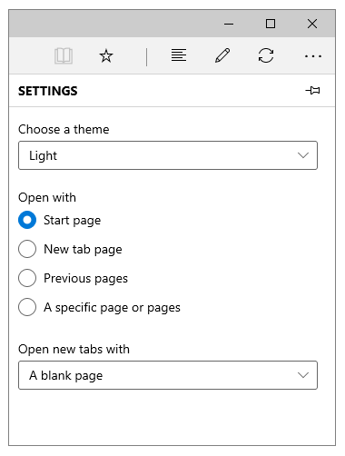

# Radio buttons

> **Important APIs**: [RadioButton class](https://docs.microsoft.com/uwp/api/Windows.UI.Xaml.Controls.RadioButton), [Checked event](https://docs.microsoft.com/uwp/api/Windows.UI.Xaml.Controls.Primitives.ToggleButton.Checked), [IsChecked property](https://docs.microsoft.com/uwp/api/Windows.UI.Xaml.Controls.Primitives.ToggleButton.IsChecked)

Radio buttons allow users to select one option from a set. Each option is represented by one radio button, and users can only select one radio button in a radio button group.

(If you're curious about the name, radio buttons are named after the channel preset buttons on a radio.)


## Is this the right control?

Use radio buttons to present users with two or more mutually exclusive options.


Use radio buttons when users need to see all options to make a selection. Since radio buttons emphasize all options equally, they may draw more attention to the options than necessary. Unless the options deserve extra attention from the user, consider using other controls. For example, if the default option is recommended for most users in most situations, use a [drop-down list](lists.md) instead.


If there are only two mutually exclusive options, combine them into a single [checkbox](checkbox.md) or [toggle switch](toggles.md). For example, use a checkbox for "I agree" instead of two radio buttons for "I agree" and "I don't agree."


When the user can select multiple options, use a [checkbox](checkbox.md).


When options are numbers that have fixed steps (10, 20, 30), use a [slider](slider.md) control.


If there are more than 8 options, use a [drop-down list](lists.md) or [list box](lists.md).


If the available options are based on the app’s current context, or can otherwise vary dynamically, use a single-select [list box](lists.md).

## Examples

<table>
<th align="left">XAML Controls Gallery<th>
<tr>
<td></img></td>
<td>
    <p>If you have the <strong style="font-weight: semi-bold">XAML Controls Gallery</strong> app installed, click here to <a href="xamlcontrolsgallery:/item/RadioButton">open the app and see the RadioButton in action</a>.</p>
    <ul>
    <li><a href="https://www.microsoft.com/store/productId/9MSVH128X2ZT">Get the XAML Controls Gallery app (Microsoft Store)</a></li>
    <li><a href="https://github.com/Microsoft/Windows-universal-samples/tree/master/Samples/XamlUIBasics">Get the source code (GitHub)</a></li>
    </ul>
</td>
</tr>
</table>

Radio buttons in the Microsoft Edge browser settings.



## Create a radio button

Radio buttons work in groups. There are 2 ways you can group radio button controls:
- Put them inside the same parent container.
- Set the [GroupName](https://docs.microsoft.com/uwp/api/Windows.UI.Xaml.Controls.RadioButton.GroupName) property on each radio button to the same value.

In this example, the first group of radio buttons is implicitly grouped by being in the same stack panel. The second group is divided between 2 stack panels, so they're explicitly grouped by GroupName.

```xaml
<StackPanel>
    <StackPanel>
        <TextBlock Text="Background" Style="{ThemeResource BaseTextBlockStyle}"/>
        <StackPanel Orientation="Horizontal">
            <RadioButton Content="Green" Tag="Green" Checked="BGRadioButton_Checked"/>
            <RadioButton Content="Yellow" Tag="Yellow" Checked="BGRadioButton_Checked"/>
            <RadioButton Content="Blue" Tag="Blue" Checked="BGRadioButton_Checked"/>
            <RadioButton Content="White" Tag="White" Checked="BGRadioButton_Checked" IsChecked="True"/>
        </StackPanel>
    </StackPanel>
    <StackPanel>
        <TextBlock Text="BorderBrush" Style="{ThemeResource BaseTextBlockStyle}"/>
        <StackPanel Orientation="Horizontal">
            <StackPanel>
                <RadioButton Content="Green" GroupName="BorderBrush" Tag="Green" Checked="BorderRadioButton_Checked"/>
                <RadioButton Content="Yellow" GroupName="BorderBrush" Tag="Yellow" Checked="BorderRadioButton_Checked" IsChecked="True"/>
            </StackPanel>
            <StackPanel>
                <RadioButton Content="Blue" GroupName="BorderBrush" Tag="Blue" Checked="BorderRadioButton_Checked"/>
                <RadioButton Content="White" GroupName="BorderBrush" Tag="White"  Checked="BorderRadioButton_Checked"/>
            </StackPanel>
        </StackPanel>
    </StackPanel>
    <Border x:Name="BorderExample1" BorderThickness="10" BorderBrush="#FFFFD700" Background="#FFFFFFFF" Height="50" Margin="0,10,0,10"/>
</StackPanel>
```

```csharp
private void BGRadioButton_Checked(object sender, RoutedEventArgs e)
{
    RadioButton rb = sender as RadioButton;

    if (rb != null && BorderExample1 != null)
    {
        string colorName = rb.Tag.ToString();
        switch (colorName)
        {
            case "Yellow":
                BorderExample1.Background = new SolidColorBrush(Colors.Yellow);
                break;
            case "Green":
                BorderExample1.Background = new SolidColorBrush(Colors.Green);
                break;
            case "Blue":
                BorderExample1.Background = new SolidColorBrush(Colors.Blue);
                break;
            case "White":
                BorderExample1.Background = new SolidColorBrush(Colors.White);
                break;
        }
    }
}

private void BorderRadioButton_Checked(object sender, RoutedEventArgs e)
{
    RadioButton rb = sender as RadioButton;

    if (rb != null && BorderExample1 != null)
    {
        string colorName = rb.Tag.ToString();
        switch (colorName)
        {
            case "Yellow":
                BorderExample1.BorderBrush = new SolidColorBrush(Colors.Gold);
                break;
            case "Green":
                BorderExample1.BorderBrush = new SolidColorBrush(Colors.DarkGreen);
                break;
            case "Blue":
                BorderExample1.BorderBrush = new SolidColorBrush(Colors.DarkBlue);
                break;
            case "White":
                BorderExample1.BorderBrush = new SolidColorBrush(Colors.White);
                break;
        }
    }
}
```

The radio button groups look like this.


A radio button has two states: *selected* or *cleared*. When a radio button is selected, its [IsChecked](https://docs.microsoft.com/uwp/api/Windows.UI.Xaml.Controls.Primitives.ToggleButton.IsChecked) property is **true**. When a radio button is cleared, its **IsChecked** property is **false**. A radio button can be cleared by clicking another radio button in the same group, but it cannot be cleared by clicking it again. However, you can clear a radio button programmatically by setting its IsChecked property to **false**. You can actually compare the **IsChecked** property with a bool by getting the **Value** of the **IsChecked** property

## Recommendations

-   Make sure the purpose and current state of a set of radio buttons is clear.
-   Limit the radio button’s text content to a single line.
-   If the text content is dynamic, consider how the button will resize and what will happen to visuals around it.
-   Use the default font unless your brand guidelines tell you to use another.
-   Don't put two radio button groups side by side. When two radio button groups are right next to each other, it's difficult to determine which buttons belong to which group.

## Additional usage guidance

This illustration shows the proper way to position and space radio buttons.


## Related topics

**For designers**
- [Buttons](buttons.md)
- [Toggle switches](toggles.md)
- [Checkboxes](checkbox.md)
- [Lists and combo boxes](lists.md)
- [Sliders](slider.md)

**For developers (XAML)**
- [RadioButton class](https://docs.microsoft.com/uwp/api/windows.ui.xaml.controls.radiobutton)
