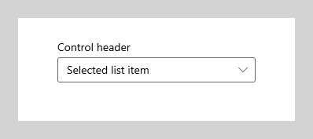
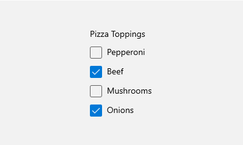
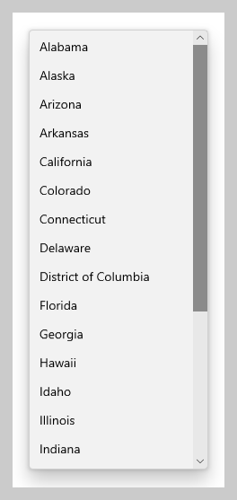
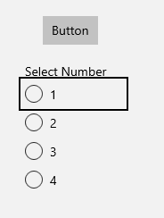
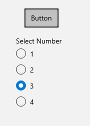
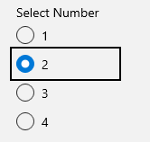
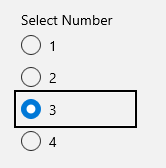
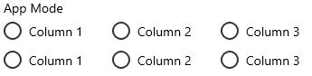
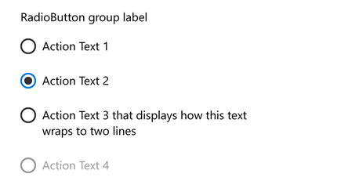

# Radio buttons

Radio buttons, also called option buttons, let users select one option from a collection of two or more mutually exclusive, but related, options. Each option is represented by one radio button.

In the default state, no radio button in a RadioButtons group is selected. That is, all radio buttons are cleared. However, when a radio button has been selected, the cleared state of the group can't be restored.

The singular behavior of a RadioButtons group distinguishes it from [check boxes](checkbox.md), which support multiselection and deselection, or clearing.


## Get the Windows UI Library

| &nbsp; | &nbsp; |
| - | - |
|  | The RadioButtons control is included as part of the Windows UI Library, a NuGet package that contains new controls and UI features for Windows apps. For more information, including installation instructions, see [Windows UI Library](/uwp/toolkits/winui/). |

**Windows UI Library APIs**: 
* [RadioButtons class](/uwp/api/microsoft.ui.xaml.controls.radiobuttons)
* [SelectionChanged event](/uwp/api/microsoft.ui.xaml.controls.radiobuttons.selectionchanged)
* [SelectedItem property](/uwp/api/microsoft.ui.xaml.controls.radiobuttons.selecteditem)
* [SelectedIndex property](/uwp/api/microsoft.ui.xaml.controls.radiobuttons.selectedindex)

**Platform APIs**: 
* [RadioButton class](/uwp/api/Windows.UI.Xaml.Controls.RadioButton)
* [Checked event](/uwp/api/Windows.UI.Xaml.Controls.Primitives.ToggleButton.Checked)
* [IsChecked property](/uwp/api/Windows.UI.Xaml.Controls.Primitives.ToggleButton.IsChecked)

## Is this the right control?

Use radio buttons to allow users to select from two or more mutually exclusive options.


Use radio buttons when users need to see all options before they make a selection. Radio buttons emphasize all options equally, which means that some options might draw more attention than is necessary or desired. 

Unless all options deserve equal attention, consider using other controls. For example, to recommend a single best option for most users and in most situations, use a [combo box](combo-box.md) to display that best option as the default option.



If there are only two options, and they're mutually exclusive, combine them into a single [check box](checkbox.md) or [toggle switch](toggles.md) control. For example, use a single check box for "I agree" instead of two radio buttons for "I agree" and "I don't agree."


When users can select multiple options, use [check boxes](checkbox.md).



When users' options lie within a range of values (for example, *10, 20, 30, ... 100*), use a [slider](slider.md) control.


If there are eight or more options, use a [combo box](combo-box.md).



> [!NOTE]
> If the available options are based on an app's current context, or they can otherwise vary dynamically, use a list control.

## RadioButtons behavior

Keyboard access and navigation behavior have been optimized in the [RadioButton class](/uwp/api/windows.ui.xaml.controls.radiobutton?view=winrt-19041). These improvements help both accessibility and keyboard power users move through the list of options more quickly and easily.

In addition to these improvements, the default visual layout of individual radio buttons in a RadioButtons group has been optimized through automated orientation, spacing, and margin settings. This optimization eliminates the requirement to specify these properties, as you might have to do when you use a more primitive grouping control, such as [StackPanel](../layout/layout-panels.md#stackpanel) or [Grid](../layout/layout-panels.md#grid).

### Navigating a RadioButtons group

The RadioButtons control supports two states:

- No radio button is selected
- One radio button is selected

The following two sections cover both radio button focus behaviors.

#### No radio button is selected

When no radio button is selected, the first radio button in the list gets focus.

> [!NOTE]
> The item that receives tab focus from the initial tab navigation is not selected.

|List without tab focus | List with initial tab focus|
|:--:|:--:|
|  | |

#### One radio button is selected

When a radio button is selected and a user tabs into the list, the selected radio button gets focus.

|List without tab focus | List with initial tab focus |
|:--:|:--:|
|  | |


### Keyboard navigation

When users have a single row or column of radio button options, and an item has already received tab focus, they can use arrow keys for "inner navigation" between the items within the RadioButtons control. For more information about keyboard navigation behaviors, see [Keyboard interactions - Navigation](../input/keyboard-interactions.md#navigation).

For a RadioButtons control, when the list of options is arranged only vertically, the Up arrow and Down arrow keys move between items and the Left arrow and Right arrow keys do nothing. However, in a list that's arranged only horizontally, the Left/Right and Up/Down arrow keys all move between items in the same way.

<br/>
*Example of keyboard navigation in a single-column or single-row RadioButtons group*

#### Navigating within multi-column or multi-row layouts

In column-major order, focus moves from top to bottom and from left to right). When focus is on the last item in a column and the Down arrow key is pressed, focus moves to the first item in the next column. This same behavior occurs in reverse: when focus is set to the first item in a column and the Up arrow key is pressed, focus moves to the last item in the previous column.


In row-major order (where items fill in left to right, top to bottom), when the focus is on the last item in a row and the Right arrow key is pressed, focus moves to the first item in the next row. This same behavior occurs in reverse: when focus is set to the first item in a row and the Left arrow key is pressed, focus moves to the last item in the previous row.

For more information, see [Keyboard interactions](../input/keyboard-interactions.md#wrapping-homogeneous-list-and-grid-view-items).

##### Wrapping

The RadioButtons group doesn't wrap. This is because, when users use a screen reader, a sense of boundary and a clear indication of beginning and end is lost, which makes it difficult for users with visual impairment to navigate the list. The RadioButtons control also doesn't support enumeration, because the control is intended to contain a reasonable number of items (see [Is this the right control?](#is-this-the-right-control)).

## Selection follows focus

When users use the keyboard to navigate between items in a RadioButtons list in which an item is already selected, as focus moves from one item to the next, the newly focused item gets selected and the previously focused item is cleared.

|Before keyboard navigation | After keyboard navigation|
|:--|:--|
| </br>*Example of focus and selection before keyboard navigation* | <br/>*Example of focus and selection after keyboard navigation, where the Down or Right arrow key moves focus to radio button 3, selects it, and clears radio button 2* |

### Navigating with Xbox gamepad and remote control

If a user is using an Xbox gamepad or remote control to move between radio buttons, the "selection follows focus" behavior is disabled, and the user must press the "A" button to select the focused radio button.

## Accessibility behavior

The following table describes how Narrator handles a RadioButtons group and what is announced. This behavior depends on how a user has set the Narrator detail preferences.

| Initial focus | Focus moves to a selected item |
|:--|:--|
| "Group name" RadioButton collection has focus, and item x of N items is selected | If RadioButton "name" is selected, item x has focus. |
| "Group name" RadioButton collection has focus, and no item is selected| If RadioButton "name" is not selected, item x has focus. <br> If the user uses shift-arrow keys, no selection follows focus. |

## Examples

<table>
<th align="left">XAML Controls Gallery<th>
<tr>
<td></img></td>
<td>
    <p>If you have the <strong style="font-weight: semi-bold">XAML Controls Gallery</strong> app installed, <a href="xamlcontrolsgallery:/item/RadioButton">open it to see the RadioButtons control in action</a>.</p>
    <ul>
    <li><a href="https://www.microsoft.com/store/productId/9MSVH128X2ZT">Get the XAML Controls Gallery app (Microsoft Store)</a></li>
    <li><a href="https://github.com/Microsoft/Xaml-Controls-Gallery">Get the source code (GitHub)</a></li>
    </ul>
</td>
</tr>
</table>

## Using the WinUI RadioButtons control

If you're using [WinUI](https://github.com/microsoft/microsoft-ui-xaml), we recommend using the [RadioButtons](/uwp/api/microsoft.ui.xaml.controls.radiobuttons) control.

The RadioButtons control is easy to set up and use, and it ensures proper and expected keyboarding and Narrator behavior.

In the following code, you declare a basic RadioButtons control with three options:

```xaml
<RadioButtons Header="App Mode" SelectedIndex="2">
    <RadioButton>Item 1</RadioButton>
    <RadioButton>Item 2</RadioButton>
    <RadioButton>Item 3</RadioButton>
</RadioButtons>
```
The result is shown in the following image:


### Defining multiple columns

You can declare a multicolumn RadioButtons control by specifying the [MaxColumns property](/uwp/api/microsoft.ui.xaml.controls.radiobuttons.maxcolumns).

```xaml
<muxc:RadioButtons Header="App Mode" MaxColumns="3">
    <x:String>Column 1</x:String>
    <x:String>Column 2</x:String>
    <x:String>Column 3</x:String>
    <x:String>Column 1</x:String>
    <x:String>Column 2</x:String>
    <x:String>Column 3</x:String>
</muxc:RadioButtons>
```



### Data binding

The RadioButtons control supports data binding that uses its [ItemsSource](/uwp/api/microsoft.ui.xaml.controls.radiobuttons.itemssource) property, as shown in the following snippet.

```xaml
<RadioButtons Header="App Mode" ItemsSource="{x:Bind radioButtonItems}" />
```

```c#
public sealed partial class MainPage : Page
{
    public class OptionDataModel
    {
        public string Label;
        public override string ToString()
        {
            return Label;
        }
    }

    List<OptionDataModel> radioButtonItems;

    public MainPage()
    {
        this.InitializeComponent();

        radioButtonItems = new List<OptionDataModel>();
        radioButtonItems.Add(new OptionDataModel() { label = "Item 1" });
        radioButtonItems.Add(new OptionDataModel() { label = "Item 2" });
        radioButtonItems.Add(new OptionDataModel() { label = "Item 3" });
    }
}
```

## Create your own RadioButtons group

> [!Important]
> Unless you're using an older version of WinUI, we recommend using the WinUI RadioButtons control to group RadioButton elements.

Radio buttons work in groups. You can group radio buttons in either of two ways:

- Put them inside the same parent container.
- Set the [GroupName](/uwp/api/Windows.UI.Xaml.Controls.RadioButton.GroupName) property on each radio button to the same value.

In this example, the first group of radio buttons is implicitly grouped by being in the same stack panel. The second group is divided between two stack panels, so they're explicitly grouped by GroupName.

```xaml
<StackPanel>
    <StackPanel>
        <TextBlock Text="Background" Style="{ThemeResource BaseTextBlockStyle}"/>
        <StackPanel Orientation="Horizontal">
            <RadioButton Content="Green" Tag="Green" Checked="BGRadioButton_Checked"/>
            <RadioButton Content="Yellow" Tag="Yellow" Checked="BGRadioButton_Checked"/>
            <RadioButton Content="Blue" Tag="Blue" Checked="BGRadioButton_Checked"/>
            <RadioButton Content="White" Tag="White" Checked="BGRadioButton_Checked" IsChecked="True"/>
        </StackPanel>
    </StackPanel>
    <StackPanel>
        <TextBlock Text="BorderBrush" Style="{ThemeResource BaseTextBlockStyle}"/>
        <StackPanel Orientation="Horizontal">
            <StackPanel>
                <RadioButton Content="Green" GroupName="BorderBrush" Tag="Green" Checked="BorderRadioButton_Checked"/>
                <RadioButton Content="Yellow" GroupName="BorderBrush" Tag="Yellow" Checked="BorderRadioButton_Checked" IsChecked="True"/>
            </StackPanel>
            <StackPanel>
                <RadioButton Content="Blue" GroupName="BorderBrush" Tag="Blue" Checked="BorderRadioButton_Checked"/>
                <RadioButton Content="White" GroupName="BorderBrush" Tag="White"  Checked="BorderRadioButton_Checked"/>
            </StackPanel>
        </StackPanel>
    </StackPanel>
    <Border x:Name="BorderExample1" BorderThickness="10" BorderBrush="#FFFFD700" Background="#FFFFFFFF" Height="50" Margin="0,10,0,10"/>
</StackPanel>
```

```csharp
private void BGRadioButton_Checked(object sender, RoutedEventArgs e)
{
    RadioButton rb = sender as RadioButton;

    if (rb != null && BorderExample1 != null)
    {
        string colorName = rb.Tag.ToString();
        switch (colorName)
        {
            case "Yellow":
                BorderExample1.Background = new SolidColorBrush(Colors.Yellow);
                break;
            case "Green":
                BorderExample1.Background = new SolidColorBrush(Colors.Green);
                break;
            case "Blue":
                BorderExample1.Background = new SolidColorBrush(Colors.Blue);
                break;
            case "White":
                BorderExample1.Background = new SolidColorBrush(Colors.White);
                break;
        }
    }
}

private void BorderRadioButton_Checked(object sender, RoutedEventArgs e)
{
    RadioButton rb = sender as RadioButton;

    if (rb != null && BorderExample1 != null)
    {
        string colorName = rb.Tag.ToString();
        switch (colorName)
        {
            case "Yellow":
                BorderExample1.BorderBrush = new SolidColorBrush(Colors.Gold);
                break;
            case "Green":
                BorderExample1.BorderBrush = new SolidColorBrush(Colors.DarkGreen);
                break;
            case "Blue":
                BorderExample1.BorderBrush = new SolidColorBrush(Colors.DarkBlue);
                break;
            case "White":
                BorderExample1.BorderBrush = new SolidColorBrush(Colors.White);
                break;
        }
    }
}
```

The following image shows how this RadioButtons group is rendered:


## Radio button states

A radio button has two states: selected or cleared. When a radio button is selected, its [IsChecked property](/uwp/api/Windows.UI.Xaml.Controls.Primitives.ToggleButton.IsChecked) is `true`. When a radio button is cleared, its IsChecked property is `false`. A radio button can be cleared if a user selects another radio button in the same group, but it can't be cleared if the user selects it again. However, you can clear a radio button programmatically by setting its IsChecked property to `false`.

## Recommendations

- Make sure that the purpose and current state of a set of radio buttons is explicit.
- Limit the radio button's text label to a single line.
- If the text label is dynamic, consider how the button will automatically resize and what will happen to any visuals around it.
- Use the default font unless your brand guidelines tell you otherwise.
- Don't put two RadioButtons groups side by side. When two RadioButtons groups are right next to each other, it can be difficult for users to determine which buttons belong to which group.

### Visuals to consider

The following images show how best to arrange the radio buttons in a RadioButtons group.




> [!NOTE]
> If you're using a WinUI RadioButtons control, the spacing, margins, and orientation are already optimized.

## Get the sample code

- To get all the XAML controls in an interactive format, see [XAML Controls Gallery sample](https://github.com/Microsoft/Xaml-Controls-Gallery). 

## Related topics

### For designers

- [Buttons](buttons.md)
- [Toggle switches](toggles.md)
- [Check boxes](checkbox.md)
- [Lists and combo boxes](lists.md)
- [Sliders](slider.md)

### For developers (XAML)

- [RadioButton class](/uwp/api/windows.ui.xaml.controls.radiobutton)