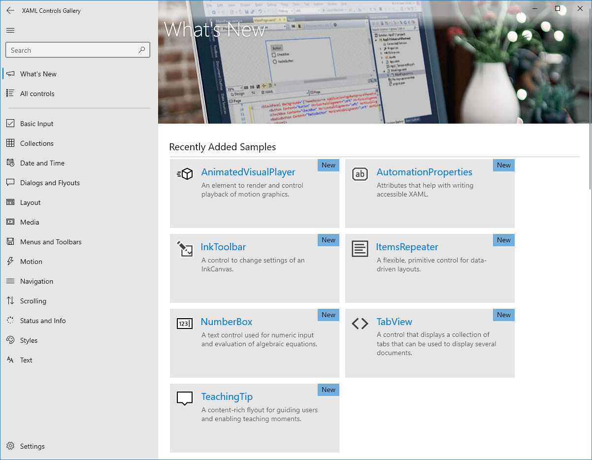

# Rich edit box

 

You can use a RichEditBox control to enter and edit rich text documents that contain formatted text, hyperlinks, and images. You can make a RichEditBox read-only by setting its IsReadOnly property to **true**.

> **Important APIs**: [RichEditBox class](https://msdn.microsoft.com/library/windows/apps/xaml/windows.ui.xaml.controls.richeditbox.aspx), [Document property](https://msdn.microsoft.com/library/windows/apps/xaml/windows.ui.xaml.controls.richeditbox.document.aspx), [IsReadOnly property](https://msdn.microsoft.com/library/windows/apps/xaml/windows.ui.xaml.controls.richeditbox.isreadonly.aspx), [IsSpellCheckEnabled property](https://msdn.microsoft.com/library/windows/apps/xaml/windows.ui.xaml.controls.richeditbox.isspellcheckenabled.aspx)

## Is this the right control?

Use a **RichEditBox** to display and edit text files. You don't use a RichEditBox to get user input into you app the way you use other standard text input boxes. Rather, you use it to work with text files that are separate from your app. You typically save text entered into a RichEditBox to a .rtf file.
-   If the primary purpose of the multi-line text box is for creating documents (such as blog entries or the contents of an email message), and those documents require rich text, use a rich text box.
-   If you want users to be able to format their text, use a rich text box.
-   When capturing text that will only be consumed and not redisplayed to users, use a plain text input control.
-   For all other scenarios, use a plain text input control.

For more info about choosing the right text control, see the [Text controls](text-controls.md) article.

## Examples

<table>
<th align="left">XAML Controls Gallery<th>
<tr>
<td></img></td>
<td>
    <p>If you have the <strong style="font-weight: semi-bold">XAML Controls Gallery</strong> app installed, click here to <a href="xamlcontrolsgallery:/item/RichEditBox">open the app and see the RichEditBox in action</a>.</p>
    <ul>
    <li><a href="https://www.microsoft.com/store/productId/9MSVH128X2ZT">Get the XAML Controls Gallery app (Microsoft Store)</a></li>
    <li><a href="https://github.com/Microsoft/Windows-universal-samples/tree/master/Samples/XamlUIBasics">Get the source code (GitHub)</a></li>
    </ul>
</td>
</tr>
</table>

This rich edit box has a rich text document open in it. The formatting and file buttons aren't part of the rich edit box, but you should provide at least a minimal set of styling buttons and implement their actions.


## Create a rich edit box

By default, the RichEditBox supports spell checking. To disable the spell checker, set the [IsSpellCheckEnabled](https://msdn.microsoft.com/library/windows/apps/xaml/windows.ui.xaml.controls.richeditbox.isspellcheckenabled.aspx) property to **false**. For more info, see the [Guidelines for spell checking](text-controls.md) article.

You use the [Document](https://msdn.microsoft.com/library/windows/apps/xaml/windows.ui.xaml.controls.richeditbox.document.aspx) property of the RichEditBox to get its content. The content of a RichEditBox is a [Windows.UI.Text.ITextDocument](https://msdn.microsoft.com/library/windows/apps/xaml/bb774052.aspx) object, unlike the RichTextBlock control, which uses [Windows.UI.Xaml.Documents.Block](https://msdn.microsoft.com/library/windows/apps/xaml/windows.ui.xaml.documents.block.aspx) objects as its content. The ITextDocument interface provides a way to load and save the document to a stream, retrieve text ranges, get the active selection, undo and redo changes, set default formatting attributes, and so on.

This example shows how to edit, load, and save a Rich Text Format (.rtf) file in a RichEditBox.

```xaml
<RelativePanel Margin="20" HorizontalAlignment="Stretch">
    <RelativePanel.Resources>
        <Style TargetType="AppBarButton">
            <Setter Property="IsCompact" Value="True"/>
        </Style>
    </RelativePanel.Resources>
    <AppBarButton x:Name="openFileButton" Icon="OpenFile"
                  Click="OpenButton_Click" ToolTipService.ToolTip="Open file"/>
    <AppBarButton Icon="Save" Click="SaveButton_Click"
                  ToolTipService.ToolTip="Save file"
                  RelativePanel.RightOf="openFileButton" Margin="8,0,0,0"/>

    <AppBarButton Icon="Bold" Click="BoldButton_Click" ToolTipService.ToolTip="Bold"
                  RelativePanel.LeftOf="italicButton" Margin="0,0,8,0"/>
    <AppBarButton x:Name="italicButton" Icon="Italic" Click="ItalicButton_Click"
                  ToolTipService.ToolTip="Italic" RelativePanel.LeftOf="underlineButton" Margin="0,0,8,0"/>
    <AppBarButton x:Name="underlineButton" Icon="Underline" Click="UnderlineButton_Click"
                  ToolTipService.ToolTip="Underline" RelativePanel.AlignRightWithPanel="True"/>

    <RichEditBox x:Name="editor" Height="200" RelativePanel.Below="openFileButton"
                 RelativePanel.AlignLeftWithPanel="True" RelativePanel.AlignRightWithPanel="True"/>
</RelativePanel>
```


```csharp
private async void OpenButton_Click(object sender, RoutedEventArgs e)
{
    // Open a text file.
    Windows.Storage.Pickers.FileOpenPicker open =
        new Windows.Storage.Pickers.FileOpenPicker();
    open.SuggestedStartLocation =
        Windows.Storage.Pickers.PickerLocationId.DocumentsLibrary;
    open.FileTypeFilter.Add(".rtf");

    Windows.Storage.StorageFile file = await open.PickSingleFileAsync();

    if (file != null)
    {
        try
        {
            Windows.Storage.Streams.IRandomAccessStream randAccStream =
        await file.OpenAsync(Windows.Storage.FileAccessMode.Read);

            // Load the file into the Document property of the RichEditBox.
            editor.Document.LoadFromStream(Windows.UI.Text.TextSetOptions.FormatRtf, randAccStream);
        }
        catch (Exception)
        {
            ContentDialog errorDialog = new ContentDialog()
            {
                Title = "File open error",
                Content = "Sorry, I couldn't open the file.",
                PrimaryButtonText = "Ok"
            };

            await errorDialog.ShowAsync();
        }
    }
}

private async void SaveButton_Click(object sender, RoutedEventArgs e)
{
    Windows.Storage.Pickers.FileSavePicker savePicker = new Windows.Storage.Pickers.FileSavePicker();
    savePicker.SuggestedStartLocation = Windows.Storage.Pickers.PickerLocationId.DocumentsLibrary;

    // Dropdown of file types the user can save the file as
    savePicker.FileTypeChoices.Add("Rich Text", new List<string>() { ".rtf" });

    // Default file name if the user does not type one in or select a file to replace
    savePicker.SuggestedFileName = "New Document";

    Windows.Storage.StorageFile file = await savePicker.PickSaveFileAsync();
    if (file != null)
    {
        // Prevent updates to the remote version of the file until we
        // finish making changes and call CompleteUpdatesAsync.
        Windows.Storage.CachedFileManager.DeferUpdates(file);
        // write to file
        Windows.Storage.Streams.IRandomAccessStream randAccStream =
            await file.OpenAsync(Windows.Storage.FileAccessMode.ReadWrite);

        editor.Document.SaveToStream(Windows.UI.Text.TextGetOptions.FormatRtf, randAccStream);

        // Let Windows know that we're finished changing the file so the
        // other app can update the remote version of the file.
        Windows.Storage.Provider.FileUpdateStatus status = await Windows.Storage.CachedFileManager.CompleteUpdatesAsync(file);
        if (status != Windows.Storage.Provider.FileUpdateStatus.Complete)
        {
            Windows.UI.Popups.MessageDialog errorBox =
                new Windows.UI.Popups.MessageDialog("File " + file.Name + " couldn't be saved.");
            await errorBox.ShowAsync();
        }
    }
}

private void BoldButton_Click(object sender, RoutedEventArgs e)
{
    Windows.UI.Text.ITextSelection selectedText = editor.Document.Selection;
    if (selectedText != null)
    {
        Windows.UI.Text.ITextCharacterFormat charFormatting = selectedText.CharacterFormat;
        charFormatting.Bold = Windows.UI.Text.FormatEffect.Toggle;
        selectedText.CharacterFormat = charFormatting;
    }
}

private void ItalicButton_Click(object sender, RoutedEventArgs e)
{
    Windows.UI.Text.ITextSelection selectedText = editor.Document.Selection;
    if (selectedText != null)
    {
        Windows.UI.Text.ITextCharacterFormat charFormatting = selectedText.CharacterFormat;
        charFormatting.Italic = Windows.UI.Text.FormatEffect.Toggle;
        selectedText.CharacterFormat = charFormatting;
    }
}

private void UnderlineButton_Click(object sender, RoutedEventArgs e)
{
    Windows.UI.Text.ITextSelection selectedText = editor.Document.Selection;
    if (selectedText != null)
    {
        Windows.UI.Text.ITextCharacterFormat charFormatting = selectedText.CharacterFormat;
        if (charFormatting.Underline == Windows.UI.Text.UnderlineType.None)
        {
            charFormatting.Underline = Windows.UI.Text.UnderlineType.Single;
        }
        else {
            charFormatting.Underline = Windows.UI.Text.UnderlineType.None;
        }
        selectedText.CharacterFormat = charFormatting;
    }
}
```

## Choose the right keyboard for your text control

To help users to enter data using the touch keyboard, or Soft Input Panel (SIP), you can set the input scope of the text control to match the kind of data the user is expected to enter. The default keyboard layout is usually appropriate for working with rich text documents.

For more info about how to use input scopes, see [Use input scope to change the touch keyboard](https://msdn.microsoft.com/library/windows/apps/mt280229).

## Do's and don'ts

- When you create a rich text box, provide styling buttons and implement their actions.
- Use a font that's consistent with the style of your app.
- Make the height of the text control tall enough to accommodate typical entries.
- Don't let your text input controls grow in height while users type.
- Don't use a multi-line text box when users only need a single line.
- Don't use a rich text control if a plain text control is adequate.

## Get the sample code

- [XAML Controls Gallery sample](https://github.com/Microsoft/Windows-universal-samples/tree/master/Samples/XamlUIBasics) - See all the XAML controls in an interactive format.

## Related articles

- [Text controls](text-controls.md)
- [Guidelines for spell checking](text-controls.md)
- [Adding search](search.md)
- [Guidelines for text input](text-controls.md)
- [TextBox class](https://msdn.microsoft.com/library/windows/apps/br209683)
- [Windows.UI.Xaml.Controls PasswordBox class](https://msdn.microsoft.com/library/windows/apps/br227519)
