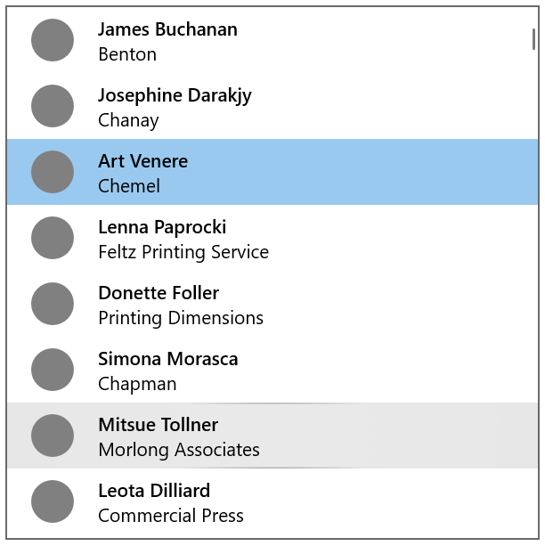
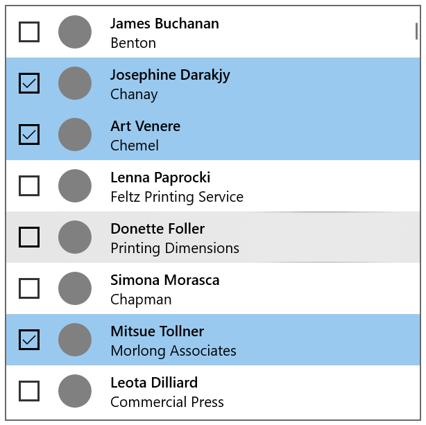
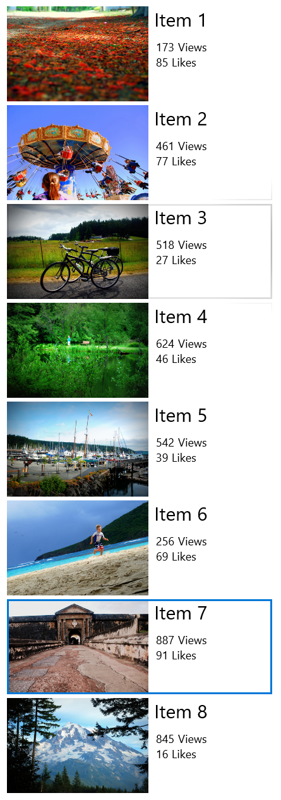
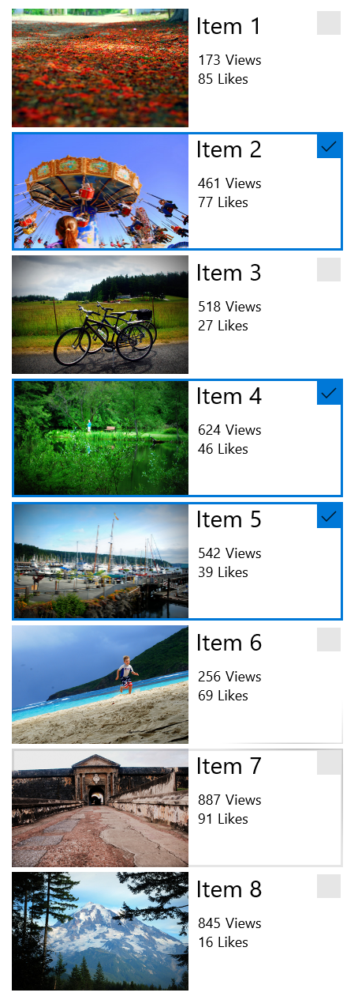

# Selection mode overview

Selection mode lets users select and take action on a single item or on multiple items. It can be invoked through a context menu, by using CTRL+click or SHIFT+click on an item, or by rolling-over a target on an item in a gallery view. When selection mode is active, check boxes appear next to each list item, and actions can appear at the top or the bottom of the screen.

## Different selection modes
There are three selection modes:

- Single: The user can select only one item at a time.
- Multiple: The user can select multiple items without using a modifier.
- Extended: The user can select multiple items with a modifier, such as holding down the SHIFT key.

## Selection mode examples
### Here is a ListView with single selection mode enabled.

The item Art Venere is selected, and the item Mitsue Tollner is currently being hovered over.

### Here is a ListView with multiple selection mode enabled:

There are three items selected, and the item Donette Foller is being hovered over.

### Here is a GridView with single selection mode enabled:

Item 7 is selected, and Item 3 is currently being hovered over.

### Here is a GridView with multiple selection mode enabled:

Items 2, 4, and 5 are selected, and Item 7 is currently being hovered over.

## Behavior and interaction
Tapping anywhere on an item selects it. Tapping on the command bar action affects all selected items. If no item is selected, command bar actions should be inactive, except for "Select All".

Selection mode doesn't have a light dismiss model; tapping outside of the frame in which selection mode is active won't cancel the mode. This is to prevent accidental deactivation of the mode. Clicking the back button dismisses the multi-select mode.

Show a visual confirmation when an action is selected. Consider displaying a confirmation dialog for certain actions, especially destructive actions such as delete.

Selection mode is confined to the page in which it is active, and can't affect any items outside of that page.

The entry point to selection mode should be juxtaposed against the content it affects.

For command bar recommendations, see [guidelines for command bars](app-bars.md).

To learn more about selection modes and handling selection events for certain controls, visit the guidance page for that control.
