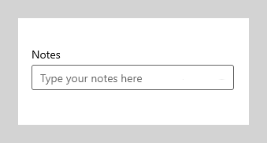
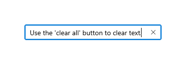
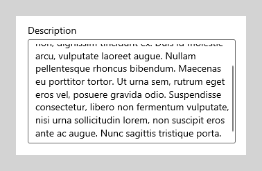
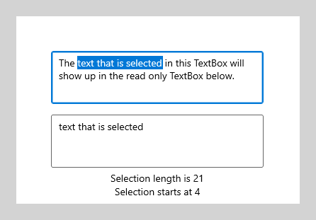
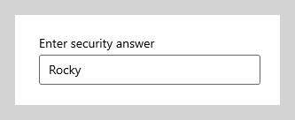
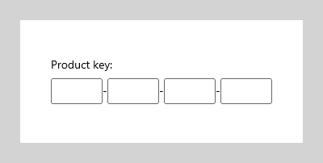
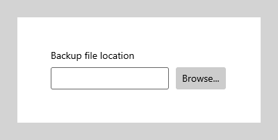
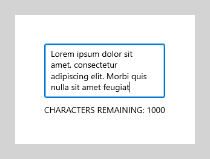

# Text box

The TextBox control lets a user type text into an app. It's typically used to capture a single line of text, but can be configured to capture multiple lines of text. The text displays on the screen in a simple, uniform, plaintext format.

TextBox has a number of features that can simplify text entry. It comes with a familiar, built-in context menu with support for copying and pasting text. The "clear all" button lets a user quickly delete all text that has been entered. It also has spell checking capabilities built in and enabled by default.

**Get the Windows UI Library**

|  |  |
| - | - |
|  | Windows UI Library 2.2 or later includes a new template for this control that uses rounded corners. For more info, see [Corner radius](../style/rounded-corner.md). WinUI is a NuGet package that contains new controls and UI features for Windows apps. For more info, including installation instructions, see [Windows UI Library](/uwp/toolkits/winui/). |

> **Platform APIs**: [TextBox class](/uwp/api/Windows.UI.Xaml.Controls.TextBox), [Text property](/uwp/api/windows.ui.xaml.controls.textbox.text)

## Is this the right control?

Use a **TextBox** control to let a user enter and edit unformatted text, such as in a form. You can use the [Text](/uwp/api/windows.ui.xaml.controls.textbox.text) property to get and set the text in a TextBox.

You can make a TextBox read-only, but this should be a temporary, conditional state. If the text is never editable, consider using a [TextBlock](text-block.md) instead.

Use a [PasswordBox](password-box.md) control to collect a password or other private data, such as a Social Security number. A password box looks like a text input box, except that it renders bullets in place of the text that has been entered.

Use an [AutoSuggestBox](auto-suggest-box.md) control to let the user enter search terms or to show the user a list of suggestions to choose from as they type.

Use a [RichEditBox](rich-edit-box.md) to display and edit rich text files.

For more info about choosing the right text control, see the [Text controls](text-controls.md) article.

## Examples

<table>
<th align="left">XAML Controls Gallery<th>
<tr>
<td></img></td>
<td>
    <p>If you have the <strong style="font-weight: semi-bold">XAML Controls Gallery</strong> app installed, click here to <a href="xamlcontrolsgallery:/item/TextBox">open the app and see the TextBox in action</a>.</p>
    <ul>
    <li><a href="https://www.microsoft.com/store/productId/9MSVH128X2ZT">Get the XAML Controls Gallery app (Microsoft Store)</a></li>
    <li><a href="https://github.com/Microsoft/Xaml-Controls-Gallery">Get the source code (GitHub)</a></li>
    </ul>
</td>
</tr>
</table>


## Create a text box

Here's the XAML for a simple text box with a header and placeholder text.

```xaml
<TextBox Width="500" Header="Notes" PlaceholderText="Type your notes here"/>
```

```csharp
TextBox textBox = new TextBox();
textBox.Width = 500;
textBox.Header = "Notes";
textBox.PlaceholderText = "Type your notes here";
// Add the TextBox to the visual tree.
rootGrid.Children.Add(textBox);
```

Here's the text box that results from this XAML.



### Use a text box for data input in a form

It's common to use a text box to accept data input on a form, and use the [Text](/uwp/api/windows.ui.xaml.controls.textbox.text) property to get the complete text string from the text box. You typically use an event like a submit button click to access the Text property, but you can handle the [TextChanged](/uwp/api/windows.ui.xaml.controls.textbox.textchanged) or [TextChanging](/uwp/api/windows.ui.xaml.controls.textbox.textchanging) event if you need to do something when the text changes.

This example shows how to get and set the current content of a text box.

```xaml
<TextBox name="SampleTextBox" Text="Sample Text"/>
```

```csharp
string sampleText = SampleTextBox.Text;
...
SampleTextBox.Text = "Sample text retrieved";
```

You can add a [Header](/uwp/api/windows.ui.xaml.controls.textbox.header) (or label) and [PlaceholderText](/uwp/api/windows.ui.xaml.controls.textbox.placeholdertext) (or watermark) to the text box to give the user an indication of what the text box is for. To customize the look of the header, you can set the [HeaderTemplate](/uwp/api/windows.ui.xaml.controls.textbox.headertemplate) property instead of Header. *For design info, see Guidelines for labels*.

You can restrict the number of characters the user can type by setting the [MaxLength](/uwp/api/windows.ui.xaml.controls.textbox.maxlength) property. However, MaxLength does not restrict the length of pasted text. Use the [Paste](/uwp/api/windows.ui.xaml.controls.textbox.paste) event to modify pasted text if this is important for your app.

The text box includes a clear all button ("X") that appears when text is entered in the box. When a user clicks the "X", the text in the text box is cleared. It looks like this.



The clear all button is shown only for editable, single-line text boxes that contain text and have focus.

The clear all button is not shown in any of these cases:

- **IsReadOnly** is **true**
- **AcceptsReturn** is **true**
- **TextWrap** has a value other than **NoWrap**

This example shows how to get and set the current content of a text box.

```xaml
<TextBox name="SampleTextBox" Text="Sample Text"/>
```

```csharp
string sampleText = SampleTextBox.Text;
...
SampleTextBox.Text = "Sample text retrieved";
```


### Make a text box read-only

You can make a text box read-only by setting the [IsReadOnly](/uwp/api/windows.ui.xaml.controls.textbox.isreadonly) property to **true**. You typically toggle this property in your app code based on conditions in your app. If need text that is always read-only, consider using a TextBlock instead.

You can make a TextBox read-only by setting the IsReadOnly property to true. For example, you might have a TextBox for a user to enter comments that is enabled only under certain conditions. You can make the TextBox read-only until the conditions are met. If you need only to display text, consider using a TextBlock or RichTextBlock instead.

A read-only text box looks the same as a read/write text box, so it might be confusing to a user.
A user can select and copy text.
IsEnabled

### Enable multi-line input

There are two properties that you can use to control whether the text box displays text on more than one line. You typically set both properties to make a multi-line text box.

- To let the text box allow and display the newline or return characters, set the [AcceptsReturn](/uwp/api/windows.ui.xaml.controls.textbox.acceptsreturn) property to **true**.
- To enable text wrapping, set the [TextWrapping](/uwp/api/windows.ui.xaml.controls.textbox.textwrapping) property to **Wrap**. This causes the text to wrap when it reaches the edge of the text box, independent of line separator characters.

> **Note**&nbsp;&nbsp;TextBox and RichEditBox don't support the **WrapWholeWords** value for their TextWrapping properties. If you try to use WrapWholeWords as a value for TextBox.TextWrapping or RichEditBox.TextWrapping an invalid argument exception is thrown.

A multi-line text box will continue to grow vertically as text is entered unless it's constrained by its [Height](/uwp/api/windows.ui.xaml.frameworkelement.height) or [MaxHeight](/uwp/api/windows.ui.xaml.frameworkelement.maxheight) property, or by a parent container. You should test that a multi-line text box doesn't grow beyond its visible area, and constrain its growth if it does. We recommend that you always specify an appropriate height for a multi-line text box, and not let it grow in height as the user types.

Scrolling using a scroll-wheel or touch is automatically enabled when needed. However, the vertical scrollbars are not visible by default. You can show the vertical scrollbars by setting the [ScrollViewer.VerticalScrollBarVisibility](/uwp/api/windows.ui.xaml.controls.scrollviewer.verticalscrollbarvisibility) to **Auto** on the embedded ScrollViewer, as shown here.

```xaml
<TextBox AcceptsReturn="True" TextWrapping="Wrap"
         MaxHeight="172" Width="300" Header="Description"
         ScrollViewer.VerticalScrollBarVisibility="Auto"/>
```

```csharp
TextBox textBox = new TextBox();
textBox.AcceptsReturn = true;
textBox.TextWrapping = TextWrapping.Wrap;
textBox.MaxHeight = 172;
textBox.Width = 300;
textBox.Header = "Description";
ScrollViewer.SetVerticalScrollBarVisibility(textBox, ScrollBarVisibility.Auto);
```

Here's what the text box looks like after text is added.



### Format the text display

Use the [TextAlignment](/uwp/api/windows.ui.xaml.controls.textbox.textalignment) property to align text within a text box. To align the text box within the layout of the page, use the [HorizontalAlignment](/uwp/api/windows.ui.xaml.frameworkelement.horizontalalignment) and [VerticalAlignment](/uwp/api/windows.ui.xaml.frameworkelement.verticalalignment) properties.

While the text box supports only unformatted text, you can customize how the text is displayed in the text box to match your branding. You can set standard [Control](/uwp/api/Windows.UI.Xaml.Controls.Control) properties like [FontFamily](/uwp/api/windows.ui.xaml.controls.control.fontfamily), [FontSize](/uwp/api/windows.ui.xaml.controls.control.fontsize), [FontStyle](/uwp/api/windows.ui.xaml.controls.control.fontstyle), [Background](/uwp/api/windows.ui.xaml.controls.control.background), [Foreground](/uwp/api/windows.ui.xaml.controls.control.foreground), and [CharacterSpacing](/uwp/api/windows.ui.xaml.controls.control.characterspacing) to change the look of the text. These properties affect only how the text box displays the text locally, so if you were to copy and paste the text into a rich text control, for example, no formatting would be applied.

This example shows a read-only text box with several properties set to customize the appearance of the text.

```xaml
<TextBox Text="Sample Text" IsReadOnly="True"
         FontFamily="Verdana" FontSize="24"
         FontWeight="Bold" FontStyle="Italic"
         CharacterSpacing="200" Width="300"
         Foreground="Blue" Background="Beige"/>
```

```csharp
TextBox textBox = new TextBox();
textBox.Text = "Sample Text";
textBox.IsReadOnly = true;
textBox.FontFamily = new FontFamily("Verdana");
textBox.FontSize = 24;
textBox.FontWeight = Windows.UI.Text.FontWeights.Bold;
textBox.FontStyle = Windows.UI.Text.FontStyle.Italic;
textBox.CharacterSpacing = 200;
textBox.Width = 300;
textBox.Background = new SolidColorBrush(Windows.UI.Colors.Beige);
textBox.Foreground = new SolidColorBrush(Windows.UI.Colors.Blue);
// Add the TextBox to the visual tree.
rootGrid.Children.Add(textBox);
```

The resulting text box looks like this.


### Modify the context menu

By default, the commands shown in the text box context menu depend on the state of the text box. For example, the following commands can be shown when the text box is editable.

Command | Shown when...
------- | -------------
Copy | text is selected.
Cut | text is selected.
Paste | the clipboard contains text.
Select all | the TextBox contains text.
Undo | text has been changed.

To modify the commands shown in the context menu, handle the [ContextMenuOpening](/uwp/api/windows.ui.xaml.controls.textbox.contextmenuopening) event. For an example of this, see the **Customizing RichEditBox's CommandBarFlyout - adding 'Share'** example in the <a href="xamlcontrolsgallery:/item/RichEditBox">XAML Controls Gallery</a>. For design info, see Guidelines for [context menus](menus.md).

### Select, copy, and paste

You can get or set the selected text in a text box using the [SelectedText](/uwp/api/windows.ui.xaml.controls.textbox.selectedtext) property. Use the [SelectionStart](/uwp/api/windows.ui.xaml.controls.textbox.selectionstart) and [SelectionLength](/uwp/api/windows.ui.xaml.controls.textbox.selectionlength) properties, and the [Select](/uwp/api/windows.ui.xaml.controls.textbox.select) and [SelectAll](/uwp/api/windows.ui.xaml.controls.textbox.selectall) methods, to manipulate the text selection. Handle the [SelectionChanged](/uwp/api/windows.ui.xaml.controls.textbox.selectionchanged) event to do something when the user selects or de-selects text. You can change the color used to highlight the selected text by setting the [SelectionHighlightColor](/uwp/api/windows.ui.xaml.controls.textbox.selectionhighlightcolor) property.

TextBox supports copy and paste by default. You can provide custom handling of the [Paste](/uwp/api/windows.ui.xaml.controls.textbox.paste) event on editable text controls in your app. For example, you might remove the line breaks from a multi-line address when pasting it into a single-line search box. Or, you might check the length of the pasted text and warn the user if it exceeds the maximum length that can be saved to a database. For more info and examples, see the [Paste](/uwp/api/windows.ui.xaml.controls.textbox.paste) event.

Here, we have an example of these properties and methods in use. When you select text in the first text box, the selected text is displayed in the second text box, which is read-only. The values of the [SelectionLength](/uwp/api/windows.ui.xaml.controls.textbox.selectionlength) and [SelectionStart](/uwp/api/windows.ui.xaml.controls.textbox.selectionstart) properties are shown in two text blocks. This is done using the [SelectionChanged](/uwp/api/windows.ui.xaml.controls.textbox.selectionchanged) event.

```xaml
<StackPanel>
   <TextBox x:Name="textBox1" Height="75" Width="300" Margin="10"
         Text="The text that is selected in this TextBox will show up in the read only TextBox below."
         TextWrapping="Wrap" AcceptsReturn="True"
         SelectionChanged="TextBox1_SelectionChanged" />
   <TextBox x:Name="textBox2" Height="75" Width="300" Margin="5"
         TextWrapping="Wrap" AcceptsReturn="True" IsReadOnly="True"/>
   <TextBlock x:Name="label1" HorizontalAlignment="Center"/>
   <TextBlock x:Name="label2" HorizontalAlignment="Center"/>
</StackPanel>
```

```csharp
private void TextBox1_SelectionChanged(object sender, RoutedEventArgs e)
{
    textBox2.Text = textBox1.SelectedText;
    label1.Text = "Selection length is " + textBox1.SelectionLength.ToString();
    label2.Text = "Selection starts at " + textBox1.SelectionStart.ToString();
}
```

Here's the result of this code.



## Choose the right keyboard for your text control

To help users to enter data using the touch keyboard, or Soft Input Panel (SIP), you can set the input scope of the text control to match the kind of data the user is expected to enter.

The touch keyboard can be used for text entry when your app runs on a device with a touch screen. The touch keyboard is invoked when the user taps on an editable input field, such as a TextBox or RichEditBox. You can make it much faster and easier for users to enter data in your app by setting the input scope of the text control to match the kind of data you expect the user to enter. The input scope provides a hint to the system about the type of text input expected by the control so the system can provide a specialized touch keyboard layout for the input type.

For example, if a text box is used only to enter a 4-digit PIN, set the [InputScope](/uwp/api/windows.ui.xaml.controls.textbox.inputscope) property to **Number**. This tells the system to show the number keypad layout, which makes it easier for the user to enter the PIN.

> **Important**&nbsp;&nbsp;The input scope does not cause any input validation to be performed, and does not prevent the user from providing any input through a hardware keyboard or other input device. You are still responsible for validating the input in your code as needed.

Other properties that affect the touch keyboard are [IsSpellCheckEnabled](/uwp/api/windows.ui.xaml.controls.textbox.isspellcheckenabled), [IsTextPredictionEnabled](/uwp/api/windows.ui.xaml.controls.textbox.istextpredictionenabled), and [PreventKeyboardDisplayOnProgrammaticFocus](/uwp/api/windows.ui.xaml.controls.textbox.preventkeyboarddisplayonprogrammaticfocus). (IsSpellCheckEnabled also affects the TextBox when a hardware keyboard is used.)

For more info and examples, see [Use input scope to change the touch keyboard](../input/use-input-scope-to-change-the-touch-keyboard.md) and the property documentation.

## Recommendations

- Use a label or placeholder text if the purpose of the text box isn't clear. A label is visible whether or not the text input box has a value. Placeholder text is displayed inside the text input box and disappears once a value has been entered.
- Give the text box an appropriate width for the range of values that can be entered. Word length varies between languages, so take localization into account if you want your app to be world-ready.
- A text input box is typically single-line (`TextWrap = "NoWrap"`). When users need to enter or edit a long string, set the text input box to multi-line (`TextWrap = "Wrap"`).
- Generally, a text input box is used for editable text. But you can make a text input box read-only so that its content can be read, selected, and copied, but not edited.
- If you need to reduce clutter in a view, consider making a set of text input boxes appear only when a controlling checkbox is checked. You can also bind the enabled state of a text input box to a control such as a checkbox.
- Consider how you want a text input box to behave when it contains a value and the user taps it. The default behavior is appropriate for editing the value rather than replacing it; the insertion point is placed between words and nothing is selected. If replacing is the most common use case for a given text input box, you can select all the text in the field whenever the control receives focus, and typing replaces the selection.

### Single-line input boxes

- Use several single-line text boxes to capture many small pieces of text information. If the text boxes are related in nature, group those together.

- Make the size of single-line text boxes slightly wider than the longest anticipated input. If doing so makes the control too wide, separate it into two controls. For example, you could split a single address input into "Address line 1" and "Address line 2".
- Set a maximum length for characters that can be entered. If the backing data source doesn't allow a long input string, limit the input and use a validation popup to let users know when they reach the limit.
- Use single-line text input controls to gather small pieces of text from users.

    The following example shows a single-line text box to capture an answer to a security question. The answer is expected to be short, and so a single-line text box is appropriate here.

    

- Use a set of short, fixed-sized, single-line text input controls to enter data with a specific format.

    

- Use a single-line, unconstrained text input control to enter or edit strings, combined with a command button that helps users select valid values.

    

### Multi-line text input controls

- When you create a rich text box, provide styling buttons and implement their actions.
- Use a font that's consistent with the style of your app.
- Make the height of the text control tall enough to accommodate typical entries.
- When capturing long spans of text with a maximum character or word count, use a plain text box and provide a live-running counter to show the user how many characters or words they have left before they reach the limit. You'll need to create the counter yourself; place it below the text box and dynamically update it as the user enters each character or word.

    

- Don't let your text input controls grow in height while users type.
- Don't use a multi-line text box when users only need a single line.
- Don't use a rich text control if a plain text control is adequate.

## Get the sample code

- [XAML Controls Gallery sample](https://github.com/Microsoft/Xaml-Controls-Gallery) - See all the XAML controls in an interactive format.

## Related articles

- [Text controls](text-controls.md)
- [Guidelines for spell checking](text-controls.md)
- [Adding search](/previous-versions/windows/apps/hh465231(v=win.10))
- [Guidelines for text input](text-controls.md)
- [TextBox class](/uwp/api/Windows.UI.Xaml.Controls.TextBox)
- [PasswordBox class](/uwp/api/Windows.UI.Xaml.Controls.PasswordBox)
- [String.Length property](/dotnet/api/system.string.length)