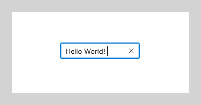
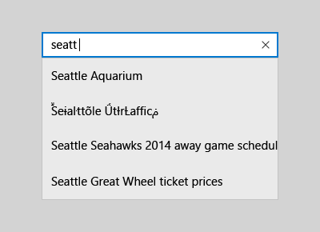
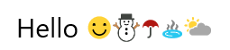

# Text controls

Text controls consist of text input boxes, password boxes, auto-suggest boxes, and text blocks. The XAML framework provides several controls for rendering, entering, and editing text, and a set of properties for formatting the text.

- The controls for displaying read-only text are [TextBlock](text-block.md) and [RichTextBlock](rich-text-block.md).
- The controls for text entry and editing are: [TextBox](text-box.md), [RichEditBox](rich-edit-box.md), [AutoSuggestBox](auto-suggest-box.md), and [PasswordBox](password-box.md).

> **Important APIs**: [TextBlock class](/uwp/api/Windows.UI.Xaml.Controls.TextBlock), [RichTextBlock class](/uwp/api/Windows.UI.Xaml.Controls.RichTextBlock), [TextBox class](/uwp/api/Windows.UI.Xaml.Controls.TextBox), [RichEditBox class](/uwp/api/Windows.UI.Xaml.Controls.RichEditBox), [AutoSuggestBox class](/uwp/api/Windows.UI.Xaml.Controls.AutoSuggestBox), [PasswordBox class](/uwp/api/Windows.UI.Xaml.Controls.PasswordBox)

## Is this the right control?

The text control you use depends on your scenario. Use this info to pick the right text control to use in your app.

### Render read-only text

Use a **TextBlock** to display most read-only text in your app. You can use it to display single-line or multi-line text, inline hyperlinks, and text with formatting like bold, italic, or underlined.

TextBlock is typically easier to use and provides better text rendering performance than RichTextBlock, so it's preferred for most app UI text. You can easily access and use text from a TextBlock in your app by getting the value of the [Text](/uwp/api/windows.ui.xaml.controls.textblock.text) property.

It also provides many of the same formatting options for customizing how your text is rendered. Although you can put line breaks in the text, TextBlock is designed to display a single paragraph and doesn't support text indentation.

Use a **RichTextBlock** when you need support for multiple paragraphs, multi-column text or other complex text layouts, or inline UI elements like images. RichTextBlock provides several features for advanced text layout.

The content property of RichTextBlock is the [Blocks](/uwp/api/windows.ui.xaml.controls.richtextblock.blocks) property, which supports paragraph based text via the [Paragraph](/uwp/api/Windows.UI.Xaml.Documents.Paragraph) element. It doesn't have a **Text** property that you can use to easily access the control's text content in your app.  

### Text input

Use a **TextBox** control to let a user enter and edit unformatted text, such as in a form. You can use the [Text](/uwp/api/windows.ui.xaml.controls.textbox.text) property to get and set the text in a TextBox.

You can make a TextBox read-only, but this should be a temporary, conditional state. If the text is never editable, consider using a TextBlock instead.

Use a **PasswordBox** control to collect a password or other private data, such as a Social Security number. A password box is a text input box that conceals the characters typed in it for the sake of privacy. A password box looks like a text input box, except that it renders bullets in place of the text that has been entered. The bullet character can be customized.

Use an **AutoSuggestBox** control to show the user a list of suggestions to choose from as they type. An auto-suggest box is a text entry box that triggers a list of basic search suggestions. Suggested terms can draw from a combination of popular search terms and historical user-entered terms.

You should also use an AutoSuggestBox control to implement a search box.

Use a **RichEditBox** to display and edit text files. You don't use a RichEditBox to get user input into your app the way you use other standard text input boxes. Rather, you use it to work with text files that are separate from your app. You typically save text entered into a RichEditBox to a .rtf file.

**Is text input the best option?**

There are many ways you can get user input in your app. These questions will help answer whether one of the standard text input boxes or another control is the best fit for getting user input.

-   **Is it practical to efficiently enumerate all valid values?** If so, consider using one of the selection controls, such as a [check box](checkbox.md), [drop-down list](lists.md), list box, [radio button](radio-button.md), [slider](slider.md), [toggle switch](toggles.md), [date picker](date-and-time.md), or time picker.
-   **Is there a fairly small set of valid values?** If so, consider a [drop-down list](lists.md) or a list box, especially if the values are more than a few characters long.
-   **Is the valid data completely unconstrained? Or is the valid data only constrained by format (constrained length or character types)?** If so, use a text input control. You can limit the number of characters that can be entered, and you can validate the format in your app code.
-   **Does the value represent a data type that has a specialized common control?** If so, use the appropriate control instead of a text input control. For example, use a [DatePicker](/previous-versions/windows/apps/br211681(v=win.10)) instead of a text input control to accept a date entry.
-   If the data is strictly numeric:
    -   **Is the value being entered approximate and/or relative to another quantity on the same page?** If so, use a [slider](slider.md).
    -   **Would the user benefit from instant feedback on the effect of setting changes?** If so, use a [slider](slider.md), possibly with an accompanying control.
    -   **Is the value entered likely to be adjusted after the result is observed, such as with volume or screen brightness?** If so, use a [slider](slider.md).

## Examples

<table>
<th align="left">XAML Controls Gallery<th>
<tr>
<td></img></td>
<td>
    <p>If you have the <strong style="font-weight: semi-bold">XAML Controls Gallery</strong> app installed, click here to <a href="xamlcontrolsgallery:/category/Text">open the app and see the text controls in action</a>.</p>
    <ul>
    <li><a href="https://www.microsoft.com/store/productId/9MSVH128X2ZT">Get the XAML Controls Gallery app (Microsoft Store)</a></li>
    <li><a href="https://github.com/Microsoft/Xaml-Controls-Gallery">Get the source code (GitHub)</a></li>
    </ul>
</td>
</tr>
</table>

Text box



Auto suggest box



Password box


## Create a text control

See these articles for info and examples specific to each text control.

-   [AutoSuggestBox](auto-suggest-box.md)
-   [PasswordBox](password-box.md)
-   [RichEditBox](rich-edit-box.md)
-   [RichTextBlock](rich-text-block.md)
-   [TextBlock](text-block.md)
-   [TextBox](text-box.md)

## Font and style guidelines
See these articles for font guidelines:

- [Typography guidelines](../style/typography.md)
- [Segoe MDL2 icon list and guidelines](../style/segoe-ui-symbol-font.md)

## Pen input

**Applies to:** TextBox, RichEditBox, AutoSuggestBox

Starting with Windows 10, version 1803, XAML text input boxes feature embedded support for pen input using [Windows Ink](../input/pen-and-stylus-interactions.md). When a user taps into a text input box using a Windows pen, the text box transforms to let the user write directly into it with a pen, rather than opening a separate input panel.


For more info, see [Text input with the handwriting view](text-handwriting-view.md).

## Choose the right keyboard for your text control

**Applies to:** TextBox, PasswordBox RichEditBox

To help users to enter data using the touch keyboard, or Soft Input Panel (SIP), you can set the input scope of the text control to match the kind of data the user is expected to enter.

>Tip
>This info applies only to the SIP. It does not apply to hardware keyboards or the On-Screen Keyboard available in the Windows Ease of Access options.

The touch keyboard can be used for text entry when your app runs on a device with a touch screen. The touch keyboard is invoked when the user taps on an editable input field, such as a TextBox or RichEditBox. You can make it much faster and easier for users to enter data in your app by setting the input scope of the text control to match the kind of data you expect the user to enter. The input scope provides a hint to the system about the type of text input expected by the control so the system can provide a specialized touch keyboard layout for the input type.

For example, if a text box is used only to enter a 4-digit PIN, set the [InputScope](/uwp/api/windows.ui.xaml.controls.textbox.inputscope) property to **Number**. This tells the system to show the number keypad layout, which makes it easier for the user to enter the PIN.

>Important  
>The input scope does not cause any input validation to be performed, and does not prevent the user from providing any input through a hardware keyboard or other input device. You are still responsible for validating the input in your code as needed.

For more info, see [Use input scope to change the touch keyboard](../input/use-input-scope-to-change-the-touch-keyboard.md).

## Color fonts

**Applies to:** TextBlock, RichTextBlock, TextBox, RichEditBox

Windows has the ability for fonts to include multiple colored layers for each glyph. For example, the Segoe UI Emoji font defines color versions of the Emoticon and other Emoji characters.

The standard and rich text controls support display color fonts. By default, the **IsColorFontEnabled** property is **true** and fonts with these additional layers are rendered in color. The default color font on the system is Segoe UI Emoji and the controls will fall back to this font to display the glyphs in color.

```xaml
<TextBlock FontSize="30">Hello ☺⛄☂♨⛅</TextBlock>
```

The rendered text looks like this:



For more info, see the [IsColorFontEnabled](/uwp/api/windows.ui.xaml.controls.textblock.iscolorfontenabled) property.

## Guidelines for line and paragraph separators

**Applies to:** TextBlock, RichTextBlock, multi-line TextBox, RichEditBox

Use the line separator character (0x2028) and the paragraph separator character (0x2029) to divide plain text. A new line is begun after each line separator. A new paragraph is begun after each paragraph separator.

It isn't necessary to start the first line or paragraph in a file with these characters or to end the last line or paragraph with them; doing so indicates that there is an empty line or paragraph in that location.

Your app can use the line separator to indicate an unconditional end of line. However, line separators do not correspond to the separate carriage return and linefeed characters, or to a combination of these characters. Line separators must be processed separately from carriage return and linefeed characters.

Your app can insert a paragraph separator between paragraphs of text. Use of this separator allows creation of plain text files that can be formatted with different line widths on different operating systems. The target system can ignore any line separators and break paragraphs only at the paragraph separators.

## Guidelines for spell checking

**Applies to:** TextBox, RichEditBox

During text entry and editing, spell checking informs the user that a word is misspelled by highlighting it with a red squiggle and provides a way for the user to correct the misspelling.

Here's an example of the built-in spell checker:


Use spell checking with text input controls for these two purposes:

-   **To auto-correct misspellings**

    The spell checking engine automatically corrects misspelled words when it's confident about the correction. For example, the engine automatically changes "teh" to "the."

-   **To show alternate spellings**

    When the spell checking engine is not confident about the corrections, it adds a red line under the misspelled word and displays the alternates in a context menu when you tap or right-click the word.

-   Use spell checking to help users as they enter words or sentences into text input controls. Spell checking works with touch, mouse, and keyboard inputs.
-   Don't use spell checking when a word is not likely to be in the dictionary or if users wouldn't value spell checking. For example, don't turn it on if the text box is intended to capture a telephone number or name.
-   Don't disable spell checking just because the current spell checking engine doesn't support your app language. When the spell checker doesn't support a language, it doesn't do anything, so there's no harm in leaving the option on. Also, some users might use an Input Method Editor (IME) to enter another language into your app, and that language might be supported. For example, when building a Japanese language app, even though the spell checking engine might not currently recognize that language, don't turn spell checking off. The user may switch to an English IME and type English into the app; if spell checking is enabled, the English will get spell checked.

For TextBox and RichEditBox controls, spell checking is turned on by default. You can turn it off by setting the **IsSpellCheckEnabled** property to **false**.

## Related articles

**For designers**
- [Typography guidelines](../style/typography.md)
- [Segoe MDL2 icon list and guidelines](../style/segoe-ui-symbol-font.md)
- [Adding search](/previous-versions/windows/apps/hh465231(v=win.10))

**For developers (XAML)**
- [TextBox class](/uwp/api/Windows.UI.Xaml.Controls.TextBox)
- [Windows.UI.Xaml.Controls PasswordBox class](/uwp/api/Windows.UI.Xaml.Controls.PasswordBox)
- [String.Length property](/dotnet/api/system.string.length)