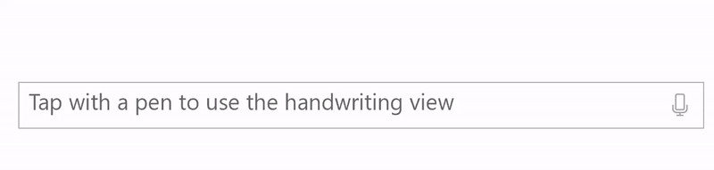
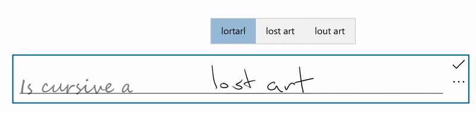
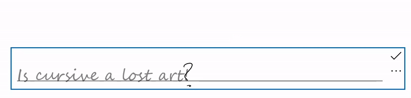
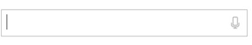
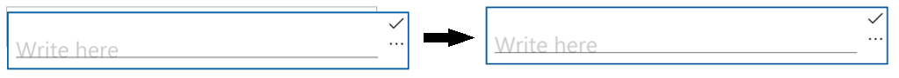
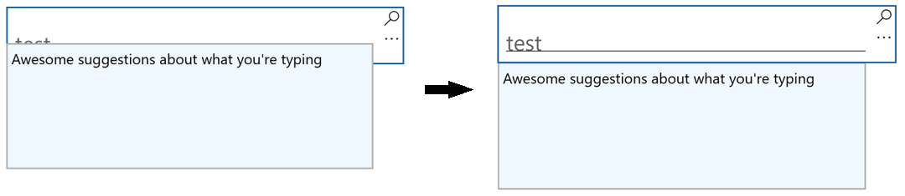

# Text input with the handwriting view



Customize the built-in handwriting view for ink to text input supported by Windows text controls such as the [TextBox](/uwp/api/windows.ui.xaml.controls.textbox), [RichEditBox](/uwp/api/windows.ui.xaml.controls.richeditbox), and controls derived from these such as the [AutoSuggestBox](/uwp/api/windows.ui.xaml.controls.autosuggestbox).

## Overview

XAML text input boxes feature embedded support for pen input using [Windows Ink](../input/pen-and-stylus-interactions.md). When a user taps into a text input box using a Windows pen, the text box transforms into a handwriting surface, rather than opening a separate input panel.

Text is recognized as the user writes anywhere in the text box, and a candidate window shows the recognition results. The user can tap a result to choose it, or continue writing to accept the proposed candidate. The literal (letter-by-letter) recognition results are included in the candidate window, so recognition is not restricted to words in a dictionary. As the user writes, the accepted text input is converted to a script font that retains the feel of natural writing.

> [!NOTE]
> The handwriting view is enabled by default, but you can disable it on a per-control basis and revert to the text input panel instead.



A user can edit their text using standard gestures and actions, like these:

- _strike through_ or _scratch out_ - draw through to delete a word or part of a word
- _join_ - draw an arc between words to delete the space between them
- _insert_ - draw a caret symbol to insert a space
- _overwrite_ - write over existing text to replace it



## Disable the handwriting view

The built-in handwriting view is enabled by default.

You might want to disable the handwriting view if you already provide equivalent ink-to-text functionality in your application, or your text input experience relies on some kind of formatting or special character (such as a tab) not available through handwriting.

In this example, we disable the handwriting view by setting the [IsHandwritingViewEnabled](/uwp/api/windows.ui.xaml.controls.textbox.ishandwritingviewenabled) ​property of the [TextBox](/uwp/api/windows.ui.xaml.controls.textbox) control to false. All text controls that support the handwriting view support a similar property.
​
```xaml
<TextBox Name="SampleTextBox"​
    Height="50" Width="500" ​
    FontSize="36" FontFamily="Segoe UI" ​
    PlaceholderText="Try taping with your pen" ​
    IsHandwritingViewEnabled="False">​
</TextBox>​
```

## Specify the alignment of the handwriting view

The handwriting view is located above the underlying text control and sized to accommodate the user's handwriting preferences (see **Settings -> Devices -> Pen & Windows Ink -> Handwriting -> Size of font when writing directly into text field**). The view is also automatically aligned relative to the text control and its location within the app.

The application UI does not reflow to accommodate the larger control, so the system might cause the view to occlude important UI.

Here, we show how to use the [PlacementAlignment​](/uwp/api/windows.ui.xaml.controls.handwritingview.placementalignment) property of a [TextBox](/uwp/api/windows.ui.xaml.controls.textbox) [HandwritingView](/uwp/api/windows.ui.xaml.controls.handwritingview) to specify which anchor on the underlying text control is used to align the handwriting view.
​
```xaml
<TextBox Name="SampleTextBox"​
    Height="50" Width="500" ​
    FontSize="36" FontFamily="Segoe UI" ​
    PlaceholderText="Try taping with your pen">​
        <TextBox.HandwritingView>​
            <HandwritingView PlacementAlignment="TopLeft"/>​
        </TextBox.HandwritingView>​
</TextBox>​
```

## Disable auto-completion candidates

The text suggestion popup is enabled by default to provide a list of top ink recognition candidates from which the user can select in case the top candidate is incorrect.

If your application already provides robust, custom recognition ​functionality, you can use the [AreCandidatesEnabled](/uwp/api/windows.ui.xaml.controls.handwritingview.arecandidatesenabled) property to disable the built-in suggestions, as shown in the following example.

```xaml
<TextBox Name="SampleTextBox"​
    Height="50" Width="500" ​
    FontSize="36" FontFamily="Segoe UI" ​
    PlaceholderText="Try taping with your pen">​
        <TextBox.HandwritingView>​
            <HandwritingView AreCandidatesEnabled="False"/>​
        </TextBox.HandwritingView>​
</TextBox>
```

## Use handwriting font preferences​

A user can choose from a pre-defined collection of handwriting-based fonts to use when rendering text based on ink recognition (see **Settings -> Devices -> Pen & Windows Ink -> Handwriting -> Font when using handwriting**).

> [!NOTE]
> Users can even create a font based on their own handwriting.
> [!VIDEO https://www.youtube.com/embed/YRR4qd4HCw8]

Your app can access this setting and use the selected font for the recognized text in the text control.

In this example, we ​listen for the [TextChanged](/uwp/api/windows.ui.xaml.controls.textbox.textchanged) event of a [TextBox](/uwp/api/windows.ui.xaml.controls.textbox) and apply the user's selected font if the text change originated from the HandwritingView (or a default font, if not).
​
```csharp
private void SampleTextBox_TextChanged(object sender, TextChangedEventArgs e)​
{​
    ((TextBox)sender).FontFamily = 
        ((TextBox)sender).HandwritingView.IsOpen ?
            new FontFamily(PenAndInkSettings.GetDefault().FontFamilyName) : 
            new FontFamily("Segoe UI");​
}​
```

## Access the HandwritingView in composite controls

Composite controls that use the [TextBox](/uwp/api/windows.ui.xaml.controls.textbox) or [RichEditBox](/uwp/api/windows.ui.xaml.controls.richeditbox) controls, such as [AutoSuggestBox](/uwp/api/windows.ui.xaml.controls.autosuggestbox) also support a [HandwritingView](/uwp/api/windows.ui.xaml.controls.handwritingview).

To access the [HandwritingView](/uwp/api/windows.ui.xaml.controls.handwritingview) in a composite control, use the [VisualTreeHelper](/uwp/api/windows.ui.xaml.media.visualtreehelper) API.

The following XAML snippet displays an [AutoSuggestBox](/uwp/api/windows.ui.xaml.controls.autosuggestbox) control.

```xaml
<AutoSuggestBox Name="SampleAutoSuggestBox"​ 
    Height="50" Width="500"​ 
    PlaceholderText="Auto Suggest Example"​ 
    FontSize="16" FontFamily="Segoe UI" ​ 
    Loaded="SampleAutoSuggestBox_Loaded">​
</AutoSuggestBox>​
```

In the corresponding code-behind, we show how to disable the [HandwritingView](/uwp/api/windows.ui.xaml.controls.handwritingview) on the [AutoSuggestBox](/uwp/api/windows.ui.xaml.controls.autosuggestbox).

1. First, we handle the application's Loaded event where we call a FindInnerTextBox function to start the visual tree traversal.

    ```csharp
    private void SampleAutoSuggestBox_Loaded(object sender, RoutedEventArgs e)​
    {​
        if (FindInnerTextBox((AutoSuggestBox)sender))​
            autoSuggestInnerTextBox.IsHandwritingViewEnabled = false;​
    }​
    ```

2. We then begin iterating through the visual tree (starting at an AutoSuggestBox) in the FindInnerTextBox function with a call to FindVisualChildByName.

    ```csharp​
    private bool FindInnerTextBox(AutoSuggestBox autoSuggestBox)​
    {​
        if (autoSuggestInnerTextBox == null)​
        {​
            // Cache textbox to avoid multiple tree traversals. ​
            autoSuggestInnerTextBox = 
                (TextBox)FindVisualChildByName<TextBox>(autoSuggestBox);​
        }​
        return (autoSuggestInnerTextBox != null);​
    }​
    ​```

3. Finally, this function iterates through the visual tree until the TextBox is retrieved.

    ```csharp
    private FrameworkElement FindVisualChildByName<T>(DependencyObject obj)​
    {​
        FrameworkElement element = null;​
        int childrenCount = 
            VisualTreeHelper.GetChildrenCount(obj);​
        for (int i = 0; (i < childrenCount) && (element == null); i++)​
        {​
            FrameworkElement child = 
                (FrameworkElement)VisualTreeHelper.GetChild(obj, i);​
            if ((child.GetType()).Equals(typeof(T)) || (child.GetType().GetTypeInfo().IsSubclassOf(typeof(T))))​
            {​
                element = child;​
            }​
            else​
            {​
                element = FindVisualChildByName<T>(child);​
            }​
        }​
        return (element);​
    }​
    ​```

## Reposition the HandwritingView

In some cases, you might need to ensure that the [HandwritingView](/uwp/api/windows.ui.xaml.controls.handwritingview) covers UI elements that it otherwise might not.

Here, we create a TextBox that supports dictation (implemented by placing a TextBox and a dictation button into a StackPanel).



As the StackPanel is now larger than the TextBox, the [HandwritingView](/uwp/api/windows.ui.xaml.controls.handwritingview) might not occlude all of the composite cotnrol.



To address this, set the PlacementTarget property of the [HandwritingView](/uwp/api/windows.ui.xaml.controls.handwritingview) to the UI element to which it should be aligned.

```xaml
<StackPanel Name="DictationBox" 
    Orientation="Horizontal" ​
    VerticalAlignment="Top" 
    HorizontalAlignment="Left" ​
    BorderThickness="1" BorderBrush="DarkGray" ​
    Height="55" Width="500" Margin="50">​
    <TextBox Name="DictationTextBox" 
        Width="450" BorderThickness="0" ​
        FontSize="24" VerticalAlignment="Center">​
        <TextBox.HandwritingView>​
            <HandwritingView PlacementTarget="{Binding ElementName=DictationBox}"/>​
        </TextBox.HandwritingView>​
    </TextBox>​
    <Button Name="DictationButton" 
        Height="48" Width="48" 
        FontSize="24" ​
        FontFamily="Segoe MDL2 Assets" 
        Content="&#xE720;" ​
        Background="White" Foreground="DarkGray" ​    Tapped="DictationButton_Tapped" />​
</StackPanel>​
```

## Resize the HandwritingView

You can also set the size of the [HandwritingView](/uwp/api/windows.ui.xaml.controls.handwritingview), which can be useful when you need to ensure the view doesn't occlude important UI.

Like the previous example, we create a TextBox that supports dictation (implemented by placing a TextBox and a dictation button into a StackPanel).


In this case, we want to ensure that the dictation button is always visible.


To do this, we bind the MaxWidth property of the [HandwritingView](/uwp/api/windows.ui.xaml.controls.handwritingview) to the width of the UI element that it should occlude.

```xaml
<StackPanel Name="DictationBox" 
    Orientation="Horizontal" ​
    VerticalAlignment="Top" 
    HorizontalAlignment="Left" ​
    BorderThickness="1" 
    BorderBrush="DarkGray" ​
    Height="55" Width="500" 
    Margin="50">​
    <TextBox Name="DictationTextBox" 
        Width="450" 
        BorderThickness="0" ​
        FontSize="24" 
        VerticalAlignment="Center">​
        <TextBox.HandwritingView>​
            <HandwritingView 
                PlacementTarget="{Binding ElementName=DictationBox}"​
                MaxWidth="{Binding ElementName=DictationTextBox, Path=Width"/>​
        </TextBox.HandwritingView>​
    </TextBox>​
    <Button Name="DictationButton" 
        Height="48" Width="48" 
        FontSize="24" ​
        FontFamily="Segoe MDL2 Assets" 
        Content="&#xE720;" ​
        Background="White" Foreground="DarkGray" ​
        Tapped="DictationButton_Tapped" />​
</StackPanel>​
```

## Reposition custom UI​

If you have custom UI that appears in response to text input, such as an informational popup, you might need to reposition that UI so it doesn't occlude the handwriting view.



The following example shows how to listen for the [Opened](/uwp/api/windows.ui.xaml.controls.handwritingview.opened), [Closed](/uwp/api/windows.ui.xaml.controls.handwritingview.closed), and [SizeChanged](/uwp/api/windows.ui.xaml.frameworkelement.sizechanged) events of the [HandwritingView](/uwp/api/windows.ui.xaml.controls.handwritingview) to set the position of a [Popup](/uwp/api/windows.ui.popups).

```csharp
private void Search_HandwritingViewOpened(
    HandwritingView sender, HandwritingPanelOpenedEventArgs args)​
{​
    UpdatePopupPositionForHandwritingView();​
}​
​
private void Search_HandwritingViewClosed(
    HandwritingView sender, HandwritingPanelClosedEventArgs args)​
{​
    UpdatePopupPositionForHandwritingView();​
}​
​
private void Search_HandwritingViewSizeChanged(
    object sender, SizeChangedEventArgs e)​
{​
    UpdatePopupPositionForHandwritingView();​
}​
​
private void UpdatePopupPositionForHandwritingView()​
{​
if (CustomSuggestionUI.IsOpen)​
    CustomSuggestionUI.VerticalOffset = GetPopupVerticalOffset();​
}​
​
private double GetPopupVerticalOffset()​
{​
    if (SearchTextBox.HandwritingView.IsOpen)​
        return (SearchTextBox.Margin.Top + SearchTextBox.HandwritingView.ActualHeight);​
    else​
        return (SearchTextBox.Margin.Top + SearchTextBox.ActualHeight);​    ​
}​
```

## Retemplate the HandwritingView control

As with all XAML framework controls, you can customize both the visual structure and visual behavior of a [HandwritingView](/uwp/api/windows.ui.xaml.controls.handwritingview) for your specific requirements.

To see a full example of creating a custom template check out the [Create custom transport controls](./custom-transport-controls.md)​ how-to or the [Custom Edit Control sample](https://github.com/Microsoft/Windows-universal-samples/tree/master/Samples/CustomEditControl).
​
​
​
​
​
​
​
​