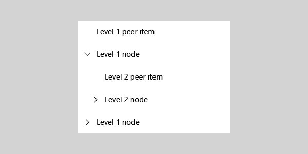

# TreeView

The XAML TreeView control enables a hierarchical list with expanding and collapsing nodes that contain nested items. It can be used to illustrate a folder structure or nested relationships in your UI.

> **Important APIs**: [TreeView class](/uwp/api/windows.ui.xaml.controls.treeview), [TreeViewNode class](/uwp/api/windows.ui.xaml.controls.treeviewnode)

The TreeView APIs support the following features:

- N-level nesting
- Expanding/collapsing of nodes
- Selection of single or multiple nodes

## Is this the right control?

- Use a TreeView when items have nested list items, and if it is important to illustrate the hierarchical relationship of items to their peers and nodes.

- Avoid using TreeView if highlighting the nested relationship of an item is not a priority. For most drill-in scenarios, a regular list view is appropriate

## TreeView UI

The tree view uses a combination of indentation and icons to represent the nested relationship between folder/parent nodes and non-folder/child nodes. Collapsed nodes use a chevron pointing to the right, and expanded nodes use a chevron pointing down.



You can include an icon in the tree view item data template to represent nodes. If you do this, you should use a folder icon only for nodes that represent literal folders, such as the folder structure on a disk.


## Create a tree view

To create a tree view, you use a [TreeView](/uwp/api/windows.ui.xaml.controls.treeview) control and a hierarchy of [TreeViewNode](/uwp/api/windows.ui.xaml.controls.treeviewnode) objects. You create the node hierarchy by adding one or more root nodes to the TreeView control’s RootNodes collection. Each TreeViewNode can then have more nodes added to its Children collection. You can nest tree view nodes to whatever depth you require.

Here's an example of a simple tree view declared in XAML. You typically add the nodes in code, but we show the XAML hierarchy here because it can be helpful for visualizing how the hierarchy of nodes is created.

```xaml
<TreeView>
    <TreeView.RootNodes>
        <TreeViewNode Content="Flavors" IsExpanded="True">
            <TreeViewNode.Children>
                <TreeViewNode Content="Vanilla"/>
                <TreeViewNode Content="Strawberry"/>
                <TreeViewNode Content="Chocolate"/>
            </TreeViewNode.Children>
        </TreeViewNode>
    </TreeView.RootNodes>
</TreeView>
```

In most cases, your tree view displays data from a data source, so you typically declare the root TreeView control in XAML, but add the TreeViewNode objects in code.

This tree view is the same as the one created previously in XAML, but the nodes are created in code instead.

```xaml
<TreeView x:Name="sampleTreeView"/>
```

```csharp
private void InitializeTreeView()
{
    TreeViewNode rootNode = new TreeViewNode() { Content = "Flavors" };
    rootNode.IsExpanded = true;
    rootNode.Children.Add(new TreeViewNode() { Content = "Vanilla" });
    rootNode.Children.Add(new TreeViewNode() { Content = "Strawberry" });
    rootNode.Children.Add(new TreeViewNode() { Content = "Chocolate" });

    sampleTreeView.RootNodes.Add(rootNode);
}
```

```vb
Private Sub InitializeTreeView()
    Dim rootNode As New TreeViewNode With {.Content = "Flavors", .IsExpanded = True}
    With rootNode.Children
        .Add(New TreeViewNode With {.Content = "Vanilla"})
        .Add(New TreeViewNode With {.Content = "Strawberry"})
        .Add(New TreeViewNode With {.Content = "Chocolate"})
    End With
    sampleTreeView.RootNodes.Add(rootNode)
End Sub
```

These APIs are available for managing the data hierarchy of your tree view.

| **[TreeView](/uwp/api/windows.ui.xaml.controls.treeview)** | |
| - | - |
| [RootNodes](/uwp/api/windows.ui.xaml.controls.treeview.rootnodes) | A tree view can have one or more root nodes. Add a TreeViewNode object to the RootNodes collection to create a root node. The **Parent** of a root node is always **null**. The **Depth** of a root node is 0. |

| **[TreeViewNode](/uwp/api/windows.ui.xaml.controls.treeviewnode)** | |
| - | - |
| [Children](/uwp/api/windows.ui.xaml.controls.treeviewnode.children) | Add TreeViewNode objects to the Children collection of a parent node to create your node hierarchy. A node is the **Parent** of all nodes in its **Children** collection. |
| [HasChildren](/uwp/api/windows.ui.xaml.controls.treeviewnode.haschildren) | **true** if the node has realized children. **false** indicates an empty folder or an item. |
| [HasUnrealizedChildren](/uwp/api/windows.ui.xaml.controls.treeviewnode.hasunrealizedchildren) | Use this property if you're filling nodes as they're expanded. See _Fill a node when it's expanding_ later in this article. |
| [Depth](/uwp/api/windows.ui.xaml.controls.treeviewnode.depth) | Indicates how far from the root node a child node is. |
| [Parent](/uwp/api/windows.ui.xaml.controls.treeviewnode.parent) | Gets the TreeViewNode that owns the **Children** collection that this node is part of. |

The tree view uses the **HasChildren** and **HasUnrealizedChildren** properties to determine whether the expand/collapse icon is shown. If either property is **true**, the icon is shown; otherwise, it's not shown.

## Tree view node content

You can store the data item that a tree view node represents in its [Content](/uwp/api/windows.ui.xaml.controls.treeviewnode.content) property.

In the previous examples, the content was a simple string value. Here, a tree view node represents the user's Pictures folder, so the pictures library [StorageFolder](/uwp/api/windows.storage.storagefolder) is assigned to the node's Content property.

```csharp
StorageFolder picturesFolder = KnownFolders.PicturesLibrary;
TreeViewNode pictureNode = new TreeViewNode();
pictureNode.Content = picturesFolder;
```

```vb
Dim picturesFolder As StorageFolder = KnownFolders.PicturesLibrary
Dim pictureNode As New TreeViewNode With {.Content = picturesFolder}
```

You can provide a [DataTemplate](/uwp/api/windows.ui.xaml.datatemplate) to specify how the data item is displayed in the tree view.

> [!NOTE]
> In Windows 10, version 1803, you have to retemplate the TreeView control and specify a custom ItemTemplate if your content is not a string. For more info, see the full example at the end of this article.

## Interacting with a tree view

You can configure a tree view to let a user interact with it in several different ways:

- expand or collapse nodes
- single- or multi-select items
- click to invoke an item

### Expand/collapse

Any tree view node that has children can always be expanded or collapsed by clicking the expand/collapse glyph. You can also expand or collapse a node programmatically, and respond when a node changes state.

#### Expand/collapse a node programmatically

There are 2 ways you can expand or collapse a tree view node in your code.

- The [TreeView](/uwp/api/windows.ui.xaml.controls.treeview) class has the [Collapse](/uwp/api/windows.ui.xaml.controls.treeview.collapse) and [Expand](/uwp/api/windows.ui.xaml.controls.treeview.expand) methods. When you call these methods, you pass in the TreeViewNode that you want to expand or collapse.

- Each [TreeViewNode](/uwp/api/windows.ui.xaml.controls.treeviewnode) has the [IsExpanded](/uwp/api/windows.ui.xaml.controls.treeviewnode.isexpanded) property. You can use this property to check the state of a node, or set it to change the state. You can also set this property in XAML to set the initial state of a node.

### Fill a node when it's expanding

You might need to show a large number of nodes in your tree view, or you might not know ahead of time how many nodes it will have. The TreeView control is not virtualized, so you can manage resources by filling each node as it's expanded, and removing the child nodes when it's collapsed.

Handle the [Expanding](/uwp/api/windows.ui.xaml.controls.treeview.expand) event and use the [HasUnrealizedChildren](/uwp/api/windows.ui.xaml.controls.treeviewnode.hasunrealizedchildren) property to add children to a node when it's being expanded. The HasUnrealizedChildren property indicates whether the node needs to be filled, or if its Children collection has already been populated. It's important to remember that the TreeViewNode doesn't set this value, you need need to manage it in your app code.

Here's an example of these APIs in use. See the complete example code at the end of this article for context, including the implemetation of 'FillTreeNode'.

```csharp
private void SampleTreeView_Expanding(TreeView sender, TreeViewExpandingEventArgs args)
{
    if (args.Node.HasUnrealizedChildren)
    {
        FillTreeNode(args.Node);
    }
}
```

```vb
Private Sub SampleTreeView_Expanding(sender As TreeView, args As TreeViewExpandingEventArgs)
    If args.Node.HasUnrealizedChildren Then
        FillTreeNode(args.Node)
    End If
End Sub
```

It's not required, but you might want to also handle the [Collapsed](/uwp/api/windows.ui.xaml.controls.treeview.collapsed) event and remove the child nodes when the parent node is closed. This can be important if your tree view has many nodes, or if the node data uses a lot of resources. You should consider the performance impact of filling a node each time it's opened versus leaving the children on a closed node. The best option will depend on your app.

Here's an example of a handler for the Collapsed event.

```csharp
private void SampleTreeView_Collapsed(TreeView sender, TreeViewCollapsedEventArgs args)
{
    args.Node.Children.Clear();
    args.Node.HasUnrealizedChildren = true;
}
```

```vb
Private Sub SampleTreeView_Collapsed(sender As TreeView, args As TreeViewCollapsedEventArgs)
    args.Node.Children.Clear()
    args.Node.HasUnrealizedChildren = True
End Sub
```

### Invoking an item

A user can invoke an action (treating the item like a button) instead of selecting the item. You handle the [ItemInvoked](/uwp/api/windows.ui.xaml.controls.treeview.iteminvoked) event to respond to this user interaction.

> [!NOTE]
> Unlike ListView, which has the [IsItemClickEnabled](/uwp/api/windows.ui.xaml.controls.listviewbase.isitemclickenabled) property, invoking an item is always enabled on the tree view. You can still choose whether to handle the event or not.

**[TreeViewItemInvokedEventArgs](/uwp/api/windows.ui.xaml.controls.treeviewiteminvokedeventargs) class**

The ItemInvoked event args give you acces to the invoked item. The [InvokedItem](/uwp/api/windows.ui.xaml.controls.treeviewiteminvokedeventargs.invokeditem) property has the node that was invoked. You can cast it to TreeViewNode and get the data item from the TreeViewNode.Content property.

Here's an example of an ItemInvoked event handler. The data item is an [IStorageItem](/uwp/api/windows.storage.istorageitem), and this example just displays some info about the file and tree. Also, if the node is a folder node, it expands or collpases the node at the same time. Otherwise, the node expands or collapses only when the chevron is clicked.

```csharp
private void SampleTreeView_ItemInvoked(TreeView sender, TreeViewItemInvokedEventArgs args)
{
    var node = args.InvokedItem as TreeViewNode;
    if (node.Content is IStorageItem item)
    {
        FileNameTextBlock.Text = item.Name;
        FilePathTextBlock.Text = item.Path;
        TreeDepthTextBlock.Text = node.Depth.ToString();

        if (node.Content is StorageFolder)
        {
            node.IsExpanded = !node.IsExpanded;
        }
    }
}
```

```vb
Private Sub SampleTreeView_ItemInvoked(sender As TreeView, args As TreeViewItemInvokedEventArgs)
    Dim node = TryCast(args.InvokedItem, TreeViewNode)
    Dim item = TryCast(node.Content, IStorageItem)
    If item IsNot Nothing Then
        FileNameTextBlock.Text = item.Name
        FilePathTextBlock.Text = item.Path
        TreeDepthTextBlock.Text = node.Depth.ToString()
        If TypeOf node.Content Is StorageFolder Then
            node.IsExpanded = Not node.IsExpanded
        End If
    End If
End Sub
```

### Item selection

The TreeView control supports both single-selection and multi-selection. By default, selection of nodes is turned off, but you can set the [TreeView.SelectionMode](/uwp/api/windows.ui.xaml.controls.treeview.selectionmode) property to allow selection of nodes. The [TreeViewSelectionMode](/uwp/api/windows.ui.xaml.controls.treeviewselectionmode) values are **None**, **Single**, and **Multiple**.

When selection is enabled, a checkbox is shown next to each tree view node, and selected items are highlighted. A user can select or de-select an item by using the checkbox; clicking the item still causes it to be invoked.

Selected nodes are added to the tree view's [SelectedNodes](/uwp/api/windows.ui.xaml.controls.treeview.selectednodes) collection. You can call the [SelectAll](/uwp/api/windows.ui.xaml.controls.treeview.selectall) method to select all the nodes in a tree view.

> [!NOTE]
> If you call **SelectAll**, all realized nodes are selected, regardless of the SelectionMode. To provide a consistent user experience, you should only call SelectAll if SelectionMode is **Multiple**.

#### Selection and realized/unrealized nodes

If your tree view has unrealized nodes, they are not taken into account for selection. Here are some things you need to keep in mind regarding selection with unrealized nodes.

- If a user selects a parent node, all the realized children under that parent are also selected. Similarly, if all the child nodes are selected, the parent node also becomes selected.
- The SelectAll method only adds realized nodes to the SelectedNodes collection.
- If a parent node with unrealized children is selected, the children will be selected as they are realized.

## Code examples

### Tree view with selection enabled

This example shows how to create a simple tree view structure in XAML. The tree view shows ice cream flavors and toppings that the user can choose from, arranged in categories. Multi-selection is enabled, and when the user clicks a button, the SelectedItems are displayed in the main app UI.

```xaml
<Grid Background="{ThemeResource ApplicationPageBackgroundThemeBrush}" Padding="100">
    <SplitView IsPaneOpen="True"
               DisplayMode="Inline"
               OpenPaneLength="296">
        <SplitView.Pane>
            <TreeView x:Name="DessertTree" SelectionMode="Multiple">
                <TreeView.RootNodes>
                    <TreeViewNode Content="Flavors" IsExpanded="True">
                        <TreeViewNode.Children>
                            <TreeViewNode Content="Vanilla"/>
                            <TreeViewNode Content="Strawberry"/>
                            <TreeViewNode Content="Chocolate"/>
                        </TreeViewNode.Children>
                    </TreeViewNode>

                    <TreeViewNode Content="Toppings">
                        <TreeViewNode.Children>
                            <TreeViewNode Content="Candy">
                                <TreeViewNode.Children>
                                    <TreeViewNode Content="Chocolate"/>
                                    <TreeViewNode Content="Mint"/>
                                    <TreeViewNode Content="Sprinkles"/>
                                </TreeViewNode.Children>
                            </TreeViewNode>
                            <TreeViewNode Content="Fruits">
                                <TreeViewNode.Children>
                                    <TreeViewNode Content="Mango"/>
                                    <TreeViewNode Content="Peach"/>
                                    <TreeViewNode Content="Kiwi"/>
                                </TreeViewNode.Children>
                            </TreeViewNode>
                            <TreeViewNode Content="Berries">
                                <TreeViewNode.Children>
                                    <TreeViewNode Content="Strawberry"/>
                                    <TreeViewNode Content="Blueberry"/>
                                    <TreeViewNode Content="Blackberry"/>
                                </TreeViewNode.Children>
                            </TreeViewNode>
                        </TreeViewNode.Children>
                    </TreeViewNode>
                </TreeView.RootNodes>
            </TreeView>
        </SplitView.Pane>

        <StackPanel Grid.Column="1" Margin="12,0">
            <Button Content="Select all" Click="SelectAllButton_Click"/>
            <Button Content="Create order" Click="OrderButton_Click" Margin="0,12"/>
            <TextBlock Text="Your flavor selections:" Style="{StaticResource CaptionTextBlockStyle}"/>
            <TextBlock x:Name="FlavorList" Margin="0,0,0,12"/>
            <TextBlock Text="Your topping selections:" Style="{StaticResource CaptionTextBlockStyle}"/>
            <TextBlock x:Name="ToppingList"/>
        </StackPanel>
    </SplitView>
</Grid>
```

```csharp
private void OrderButton_Click(object sender, RoutedEventArgs e)
{
    FlavorList.Text = string.Empty;
    ToppingList.Text = string.Empty;

    foreach (TreeViewNode node in DessertTree.SelectedNodes)
    {
        if (node.Parent.Content?.ToString() == "Flavors")
        {
            FlavorList.Text += node.Content + "; ";
        }
        else if (node.HasChildren == false)
        {
            ToppingList.Text += node.Content + "; ";
        }
    }
}

private void SelectAllButton_Click(object sender, RoutedEventArgs e)
{
    if (DessertTree.SelectionMode == TreeViewSelectionMode.Multiple)
    {
        DessertTree.SelectAll();
    }
}
```

```vb
Private Sub OrderButton_Click(sender As Object, e As RoutedEventArgs)
    FlavorList.Text = String.Empty
    ToppingList.Text = String.Empty
    For Each node As TreeViewNode In DessertTree.SelectedNodes
        If node.Parent.Content?.ToString() = "Flavors" Then
            FlavorList.Text += node.Content & "; "
        ElseIf node.HasChildren = False Then
            ToppingList.Text += node.Content & "; "
        End If
    Next
End Sub

Private Sub SelectAllButton_Click(sender As Object, e As RoutedEventArgs)
    If DessertTree.SelectionMode = TreeViewSelectionMode.Multiple Then
        DessertTree.SelectAll()
    End If
End Sub
```

### Pictures and Music Library tree view

This example shows how to create a tree view that shows the contents and structure of the users Pictures and Music libraries. The number of items can't be known ahead of time, so each node is filled when it's expanded, and emptied when it's collapsed.

A custom item template is used to display the data items, which are of type [IStorageItem](/uwp/api/windows.storage.istorageitem).

> [!IMPORTANT]
> The code in this example requires the picturesLibrary and musicLibrary capabilities. For more info about file access, see [File access permissions](../../files/file-access-permissions.md), [Enumerate and query files and folders](../../files/quickstart-listing-files-and-folders.md), and [Files and folders in the Music, Pictures, and Videos libraries](../../files/quickstart-managing-folders-in-the-music-pictures-and-videos-libraries.md).

```xaml
<Page
    x:Class="TreeViewApp1.MainPage"
    xmlns="http://schemas.microsoft.com/winfx/2006/xaml/presentation"
    xmlns:x="http://schemas.microsoft.com/winfx/2006/xaml"
    xmlns:local="using:TreeViewApp1"
    xmlns:d="http://schemas.microsoft.com/expression/blend/2008"
    xmlns:mc="http://schemas.openxmlformats.org/markup-compatibility/2006"
    mc:Ignorable="d">
    <Page.Resources>
        <DataTemplate x:Key="TreeViewItemDataTemplate">
            <Grid Height="44">
                <TextBlock
                    Text="{Binding Content.DisplayName}"
                    HorizontalAlignment="Left"
                    VerticalAlignment="Center"
                    Style="{ThemeResource BodyTextBlockStyle}"/>
            </Grid>
        </DataTemplate>

        <Style TargetType="TreeView">
            <Setter Property="IsTabStop" Value="False" />
            <Setter Property="Template">
                <Setter.Value>
                    <ControlTemplate TargetType="TreeView">
                        <TreeViewList x:Name="ListControl"
                                      ItemTemplate="{StaticResource TreeViewItemDataTemplate}"
                                      ItemContainerStyle="{StaticResource TreeViewItemStyle}"
                                      CanDragItems="True"
                                      AllowDrop="True"
                                      CanReorderItems="True">
                            <TreeViewList.ItemContainerTransitions>
                                <TransitionCollection>
                                    <ContentThemeTransition />
                                    <ReorderThemeTransition />
                                    <EntranceThemeTransition IsStaggeringEnabled="False" />
                                </TransitionCollection>
                            </TreeViewList.ItemContainerTransitions>
                        </TreeViewList>
                    </ControlTemplate>
                </Setter.Value>
            </Setter>
        </Style>
    </Page.Resources>

    <Grid Background="{ThemeResource ApplicationPageBackgroundThemeBrush}">
        <SplitView IsPaneOpen="True"
                   DisplayMode="Inline"
                   OpenPaneLength="296">
            <SplitView.Pane>
                <Grid>
                    <Grid.RowDefinitions>
                        <RowDefinition Height="Auto"/>
                        <RowDefinition/>
                    </Grid.RowDefinitions>
                    <Button Content="Refresh tree" Click="RefreshButton_Click" Margin="24,12"/>
                    <TreeView x:Name="sampleTreeView" Grid.Row="1" SelectionMode="Single"
                              Expanding="SampleTreeView_Expanding"
                              Collapsed="SampleTreeView_Collapsed"
                              ItemInvoked="SampleTreeView_ItemInvoked"/>
                </Grid>
            </SplitView.Pane>

            <StackPanel Grid.Column="1" Margin="12,72">
                <TextBlock Text="File name:" Style="{StaticResource CaptionTextBlockStyle}"/>
                <TextBlock x:Name="FileNameTextBlock" Margin="0,0,0,12"/>

                <TextBlock Text="File path:" Style="{StaticResource CaptionTextBlockStyle}"/>
                <TextBlock x:Name="FilePathTextBlock" Margin="0,0,0,12"/>

                <TextBlock Text="Tree depth:" Style="{StaticResource CaptionTextBlockStyle}"/>
                <TextBlock x:Name="TreeDepthTextBlock" Margin="0,0,0,12"/>
            </StackPanel>
        </SplitView>
    </Grid>
</Page>
```

```csharp
public MainPage()
{
    this.InitializeComponent();
    InitializeTreeView();
}

private void InitializeTreeView()
{
    // A TreeView can have more than 1 root node. The Pictures library
    // and the Music library will each be a root node in the tree.
    // Get Pictures library.
    StorageFolder picturesFolder = KnownFolders.PicturesLibrary;
    TreeViewNode pictureNode = new TreeViewNode();
    pictureNode.Content = picturesFolder;
    pictureNode.IsExpanded = true;
    pictureNode.HasUnrealizedChildren = true;
    sampleTreeView.RootNodes.Add(pictureNode);
    FillTreeNode(pictureNode);

    // Get Music library.
    StorageFolder musicFolder = KnownFolders.MusicLibrary;
    TreeViewNode musicNode = new TreeViewNode();
    musicNode.Content = musicFolder;
    musicNode.IsExpanded = true;
    musicNode.HasUnrealizedChildren = true;
    sampleTreeView.RootNodes.Add(musicNode);
    FillTreeNode(musicNode);
}

private async void FillTreeNode(TreeViewNode node)
{
    // Get the contents of the folder represented by the current tree node.
    // Add each item as a new child node of the node that's being expanded.

    // Only process the node if it's a folder and has unrealized children.
    StorageFolder folder = null;
    if (node.Content is StorageFolder && node.HasUnrealizedChildren == true)
    {
        folder = node.Content as StorageFolder;
    }
    else
    {
        // The node isn't a folder, or it's already been filled.
        return;
    }

    IReadOnlyList<IStorageItem> itemsList = await folder.GetItemsAsync();

    if (itemsList.Count == 0)
    {
        // The item is a folder, but it's empty. Leave HasUnrealizedChildren = true so
        // that the chevron appears, but don't try to process children that aren't there.
        return;
    }

    foreach (var item in itemsList)
    {
        var newNode = new TreeViewNode();
        newNode.Content = item;

        if (item is StorageFolder)
        {
            // If the item is a folder, set HasUnrealizedChildren to true. 
            // This makes the collapsed chevron show up.
            newNode.HasUnrealizedChildren = true;
        }
        else
        {
            // Item is StorageFile. No processing needed for this scenario.
        }
        node.Children.Add(newNode);
    }
    // Children were just added to this node, so set HasUnrealizedChildren to false.
    node.HasUnrealizedChildren = false;
}

private void SampleTreeView_Expanding(TreeView sender, TreeViewExpandingEventArgs args)
{
    if (args.Node.HasUnrealizedChildren)
    {
        FillTreeNode(args.Node);
    }
}

private void SampleTreeView_Collapsed(TreeView sender, TreeViewCollapsedEventArgs args)
{
    args.Node.Children.Clear();
    args.Node.HasUnrealizedChildren = true;
}

private void SampleTreeView_ItemInvoked(TreeView sender, TreeViewItemInvokedEventArgs args)
{
    var node = args.InvokedItem as TreeViewNode;
    if (node.Content is IStorageItem item)
    {
        FileNameTextBlock.Text = item.Name;
        FilePathTextBlock.Text = item.Path;
        TreeDepthTextBlock.Text = node.Depth.ToString();

        if (node.Content is StorageFolder)
        {
            node.IsExpanded = !node.IsExpanded;
        }
    }
}

private void RefreshButton_Click(object sender, RoutedEventArgs e)
{
    sampleTreeView.RootNodes.Clear();
    InitializeTreeView();
}
```

```vb
Public Sub New()
    InitializeComponent()
    InitializeTreeView()
End Sub

Private Sub InitializeTreeView()
    ' A TreeView can have more than 1 root node. The Pictures library
    ' and the Music library will each be a root node in the tree.
    ' Get Pictures library.
    Dim picturesFolder As StorageFolder = KnownFolders.PicturesLibrary
    Dim pictureNode As New TreeViewNode With {
        .Content = picturesFolder,
        .IsExpanded = True,
        .HasUnrealizedChildren = True
    }
    sampleTreeView.RootNodes.Add(pictureNode)
    FillTreeNode(pictureNode)

    ' Get Music library.
    Dim musicFolder As StorageFolder = KnownFolders.MusicLibrary
    Dim musicNode As New TreeViewNode With {
        .Content = musicFolder,
        .IsExpanded = True,
        .HasUnrealizedChildren = True
    }
    sampleTreeView.RootNodes.Add(musicNode)
    FillTreeNode(musicNode)
End Sub

Private Async Sub FillTreeNode(node As TreeViewNode)
    ' Get the contents of the folder represented by the current tree node.
    ' Add each item as a new child node of the node that's being expanded.

    ' Only process the node if it's a folder and has unrealized children.
    Dim folder As StorageFolder = Nothing
    If TypeOf node.Content Is StorageFolder AndAlso node.HasUnrealizedChildren Then
        folder = TryCast(node.Content, StorageFolder)
    Else
        ' The node isn't a folder, or it's already been filled.
        Return
    End If

    Dim itemsList As IReadOnlyList(Of IStorageItem) = Await folder.GetItemsAsync()
    If itemsList.Count = 0 Then
        ' The item is a folder, but it's empty. Leave HasUnrealizedChildren = true so
        ' that the chevron appears, but don't try to process children that aren't there.
        Return
    End If

    For Each item In itemsList
        Dim newNode As New TreeViewNode With {
            .Content = item
        }
        If TypeOf item Is StorageFolder Then
            ' If the item is a folder, set HasUnrealizedChildren to True.
            ' This makes the collapsed chevron show up.
            newNode.HasUnrealizedChildren = True
        Else
            ' Item is StorageFile. No processing needed for this scenario.
        End If
        node.Children.Add(newNode)
    Next

    ' Children were just added to this node, so set HasUnrealizedChildren to False.
    node.HasUnrealizedChildren = False
End Sub

Private Sub SampleTreeView_Expanding(sender As TreeView, args As TreeViewExpandingEventArgs)
    If args.Node.HasUnrealizedChildren Then
        FillTreeNode(args.Node)
    End If
End Sub

Private Sub SampleTreeView_Collapsed(sender As TreeView, args As TreeViewCollapsedEventArgs)
    args.Node.Children.Clear()
    args.Node.HasUnrealizedChildren = True
End Sub

Private Sub SampleTreeView_ItemInvoked(sender As TreeView, args As TreeViewItemInvokedEventArgs)
    Dim node = TryCast(args.InvokedItem, TreeViewNode)
    Dim item = TryCast(node.Content, IStorageItem)
    If item IsNot Nothing Then
        FileNameTextBlock.Text = item.Name
        FilePathTextBlock.Text = item.Path
        TreeDepthTextBlock.Text = node.Depth.ToString()
        If TypeOf node.Content Is StorageFolder Then
            node.IsExpanded = Not node.IsExpanded
        End If
    End If
End Sub

Private Sub RefreshButton_Click(sender As Object, e As RoutedEventArgs)
    sampleTreeView.RootNodes.Clear()
    InitializeTreeView()
End Sub
```

## Related articles

- [TreeView class](https://docs.microsoft.com/uwp/api/windows.ui.xaml.controls.treeview)
- [ListView class](https://msdn.microsoft.com/library/windows/apps/windows.ui.xaml.controls.listview.aspx)
- [ListView and GridView](listview-and-gridview.md)
