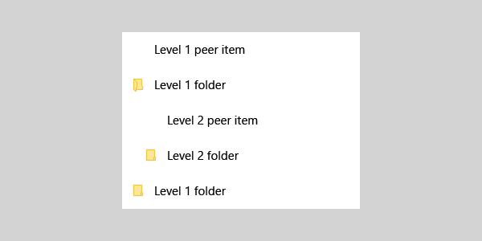

# Hierarchical layout with TreeView
 

A TreeView is a hierarchical list pattern with expanding and collapsing nodes that contain nested items. Nested items can be additional nodes or regular list items. You can use a [ListView](https://msdn.microsoft.com/library/windows/apps/windows.ui.xaml.controls.listview.aspx) to build a tree view to illustrate a folder structure or nested relationships in your UI.

The [TreeView sample](http://go.microsoft.com/fwlink/?LinkId=785018) is a reference implementation built using **ListView**. It is not a standalone control. The TreeView seen in the Favorites Pane in the Microsoft Edge browser uses this reference implementation.

The sample supports:
- N-level nesting
- Expanding/collapsing of nodes
- Dragging and dropping of nodes within the TreeView
- Built-in accessibility

 | 
-- | --
TreeView reference sample | TreeView in Edge browser

## Is this the right pattern?

- Use a TreeView when items have nested list items, and if it is important to illustrate the hierarchical relationship of items to their peers and nodes.

- Avoid using TreeView if highlighting the nested relationship of an item is not a priority. For most drill-in scenarios, a regular list view is appropriate

## TreeView UI structure

You can use icons to represent nodes in a TreeView. A combination of indentation and icons can be used to represent the nested relationship between
folder/parent nodes and non-folder/child nodes. Here is guidance on how to do so.

### Icons

Use icons to indicate that an item is a node, as well as what state the node is in (expanded or collapsed).

#### Chevron

For consistency, collapsed nodes should use a chevron pointing to the right, and expanded nodes should use a chevron pointing down.


#### Folder

Use a folder icon only for literal representations of folders.



#### Chevron and Folder

A combination of a chevron and a folder should be used only if non-node list items in the TreeView also have icons.


#### Redlines for indentation of folders and non-folder nodes

Use the redlines in the screenshot below for indentation of folder and non-folder nodes.


## Building a TreeView

TreeView has the following main classes. All of these are defined and included in the reference implementation.

> **Note**&nbsp;&nbsp;TreeView is implemented as a [Windows Runtime component](https://msdn.microsoft.com/windows/uwp/winrt-components/index) written in C++, so it can be referenced by a UWP app in any language. In the sample, the TreeView code is located in the *cpp/Control* folder. There is no corresponding *cs/Control* folder for C#.

- The `TreeNode` class implements the hierarchical layout for the TreeView. It also holds the data that will be bound to it in the items template.
- The `TreeView` class implements events for ItemClick, expand/collapse of folders, and drag initiation.
- The `TreeViewItem` class implements the events for the drop operation.
- The `ViewModel` class flattens the list of TreeViewItems so that operations such as keyboard navigation, and drag-and-drop can be inherited from ListView.

## Create a data template for your TreeViewItem

Here is the section of the XAML that sets up the data template for folder and non-folder type items.
- To specify a ListViewItem as a folder, you will need to explicitly set the [AllowDrop](https://msdn.microsoft.com/library/windows/apps/windows.ui.xaml.uielement.allowdrop.aspx) property to **true** on that ListViewItem. This XAML shows you one way to do so.
- To specify a ListViewItem as a non-folder, you do not need to specify any property on the ListViewItem itself. Just set the AllowDrop property to True on the ListView.
- You can use expanded/collapsed folder icons or chevrons to visually indicate if a folder is expanded or collapsed.
- You can use converters to choose the different icons needed for the expanded versus the collapsed state as seen in this example.

```xaml
<!-- MainPage.xaml -->
<DataTemplate x:Key="TreeViewItemDataTemplate">
    <StackPanel Orientation="Horizontal" Height="40" Margin="{Binding Depth, Converter={StaticResource IntToIndConverter}}" AllowDrop="{Binding Data.IsFolder}">
        <FontIcon x:Name="expandCollapseChevron"
                  Glyph="{Binding IsExpanded, Converter={StaticResource expandCollapseGlyphConverter}}"
                  Visibility="{Binding Data.IsFolder, Converter={StaticResource booleanToVisibilityConverter}}"                           
                  FontSize="12"
                  Margin="12,8,12,8"
                  FontFamily="Segoe MDL2 Assets"                          
                  />
        <Grid>
            <FontIcon x:Name ="expandCollapseFolder"
                      Glyph="{Binding IsExpanded, Converter={StaticResource folderGlyphConverter}}"
                      Foreground="#FFFFE793"
                      FontSize="16"
                      Margin="0,8,12,8"
                      FontFamily="Segoe MDL2 Assets"
                      Visibility="{Binding Data.IsFolder, Converter={StaticResource booleanToVisibilityConverter}}"
                      />

            <FontIcon x:Name ="nonFolderIcon"
                      Glyph="&#xE160;"
                      Foreground="{ThemeResource SystemControlForegroundBaseLowBrush}"
                      FontSize="12"
                      Margin="20,8,12,8"
                      FontFamily="Segoe MDL2 Assets"
                      Visibility="{Binding Data.IsFolder, Converter={StaticResource inverseBooleanToVisibilityConverter}}"
                      />

            <FontIcon x:Name ="expandCollapseFolderOutline"
                      Glyph="{Binding IsExpanded, Converter={StaticResource folderOutlineGlyphConverter}}"
                      Foreground="#FFECC849"
                      FontSize="16"
                      Margin="0,8,12,8"
                      FontFamily="Segoe MDL2 Assets"
                      Visibility="{Binding Data.IsFolder, Converter={StaticResource booleanToVisibilityConverter}}"/>
        </Grid>

        <TextBlock Text="{Binding Data.Name}"
                   HorizontalAlignment="Stretch"
                   VerticalAlignment="Center"  
                   FontWeight="Medium"
                   FontFamily="Segoe MDL2 Assests"                           
                   Style="{ThemeResource BodyTextBlockStyle}"/>
    </StackPanel>
</DataTemplate>
```

## Set up the data in your TreeView

Here is the code that sets up the data in the TreeView sample.

```csharp
 public MainPage()
 {
     this.InitializeComponent();

     TreeNode workFolder = CreateFolderNode("Work Documents");
     workFolder.Add(CreateFileNode("Feature Functional Spec"));
     workFolder.Add(CreateFileNode("Feature Schedule"));
     workFolder.Add(CreateFileNode("Overall Project Plan"));
     workFolder.Add(CreateFileNode("Feature Resource allocation"));
     sampleTreeView.RootNode.Add(workFolder);

     TreeNode remodelFolder = CreateFolderNode("Home Remodel");
     remodelFolder.IsExpanded = true;
     remodelFolder.Add(CreateFileNode("Contactor Contact Information"));
     remodelFolder.Add(CreateFileNode("Paint Color Scheme"));
     remodelFolder.Add(CreateFileNode("Flooring woodgrain types"));
     remodelFolder.Add(CreateFileNode("Kitchen cabinet styles"));

     TreeNode personalFolder = CreateFolderNode("Personal Documents");
     personalFolder.IsExpanded = true;
     personalFolder.Add(remodelFolder);

     sampleTreeView.RootNode.Add(personalFolder);
 }

 private static TreeNode CreateFileNode(string name)
 {
     return new TreeNode() { Data = new FileSystemData(name) };
 }

 private static TreeNode CreateFolderNode(string name)
 {
     return new TreeNode() { Data = new FileSystemData(name) { IsFolder = true } };
 }
```

Once you’re done with the above steps, you will have a fully populated TreeView/Hierarchical layout with n-level nesting, support for expand/collapse of folders, dragging and dropping between folders, and accessibility built in.

To provide the user the ability to add/remove items from the TreeView, we recommend you add a context menu to expose those options to the user.


## Related articles

- [TreeView sample](http://go.microsoft.com/fwlink/?LinkId=785018)
- [**ListView**](https://msdn.microsoft.com/library/windows/apps/windows.ui.xaml.controls.listview.aspx)
- [ListView and GridView](listview-and-gridview.md)
