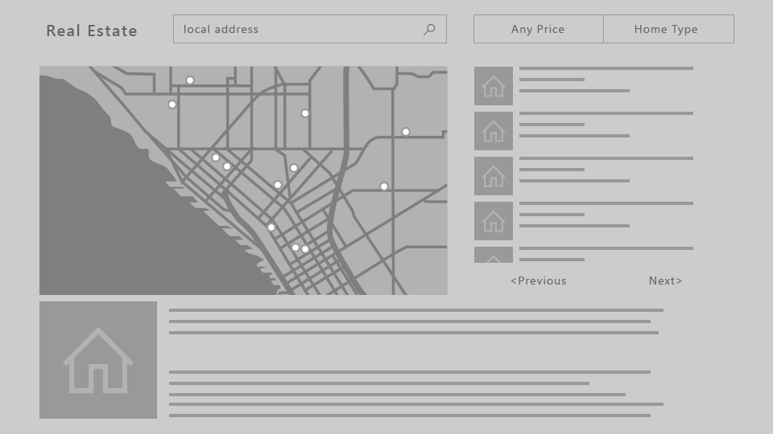
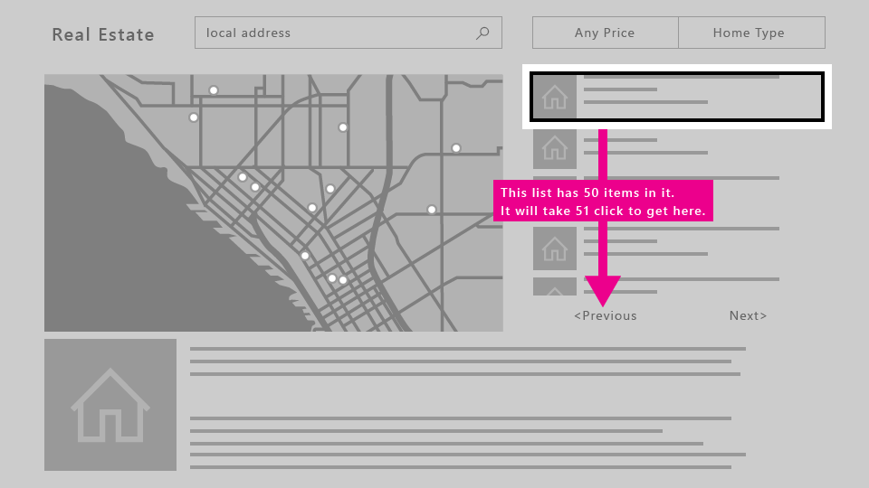
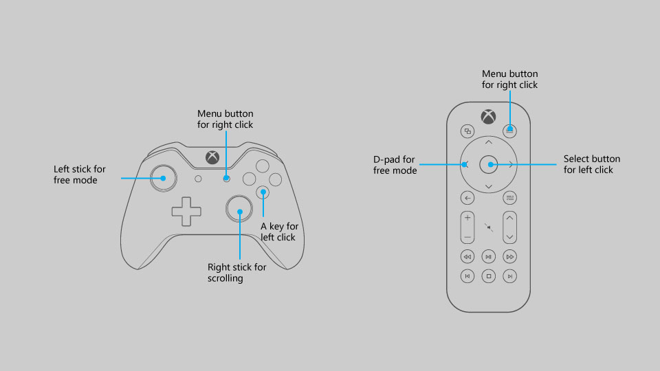
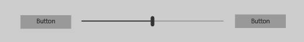

# Designing for Xbox and TV

Design your Universal Windows Platform (UWP) app so that it looks good and functions well on Xbox One and television screens.

## Overview

The Universal Windows Platform lets you create delightful experiences across multiple Windows 10 devices.
Most of the functionality provided by the UWP framework enables apps to use the same user interface (UI) across these devices, without additional work.
However, tailoring and optimizing your app to work great on Xbox One and TV screens requires special considerations.

The experience of sitting on your couch across the room, using a gamepad or remote to interact with your TV, is called the **10-foot experience**.
It is so named because the user is generally sitting approximately 10 feet away from the screen.
This provides unique challenges that aren't present in, say, the *2-foot* experience, or interacting with a PC.
If you are developing an app for Xbox One or any other device that outputs to the TV screen and uses a controller for input, you should always keep this in mind.

Not all of the steps in this article are required to make your app work well for 10-foot experiences, but understanding them and making the appropriate decisions for your app will result in a better 10-foot experience tailored for your app's specific needs.
As you bring your app to life in the 10-foot environment, consider the following design principles.

### Simple

Designing for the 10-foot environment presents a unique set of challenges. Resolution and viewing distance can make it difficult for people to process too much information.
Try to keep your design clean, reduced to the simplest possible components. The amount of information displayed on a TV should be comparable to what you'd see on a mobile phone, rather than on a desktop.


### Coherent

UWP apps in the 10-foot environment should be intuitive and easy to use. Make the focus clear and unmistakable.
Arrange content so that movement across the space is consistent and predictable. Give people the shortest path to what they want to do.


_**All movies shown in the screenshot are available on Microsoft Movies & TV.**_  

### Captivating

The most immersive, cinematic experiences take place on the big screen. Edge-to-edge scenery, elegant motion, and vibrant use of color and typography take your apps to the next level. Be bold and beautiful.


### Optimizations for the 10-foot experience

Now that you know the principles of good UWP app design for the 10-foot experience, read through the following overview of the specific ways you can optimize your app and make for a great user experience.

| Feature        | Description           |
| -------------------------------------------------------------- |--------------------------------|
| [Gamepad and remote control](#gamepad-and-remote-control)      | Making sure that your app works well with gamepad and remote is the most important step in optimizing for 10-foot experiences. There are several gamepad and remote-specific improvements that you can make to optimize the user interaction experience on a device where their actions are somewhat limited. |
| [XY focus navigation and interaction](#xy-focus-navigation-and-interaction) | The UWP provides **XY focus navigation** that allows the user to navigate around your app's UI. However, this limits the user to navigating up, down, left, and right. Recommendations for dealing with this and other considerations are outlined in this section. |
| [Mouse mode](#mouse-mode)|In some user interfaces, such as maps and drawing surfaces, it is not possible or practical to use XY focus navigation. For these interfaces, the UWP provides **mouse mode** to let the gamepad/remote navigate freely, like a mouse on a desktop computer.|
| [Focus visual](#focus-visual)  | The focus visual is the border around the UI element that currently has focus. This helps orient the user so that they can easily navigate your UI without getting lost. If the focus is not clearly visible, the user could get lost in your UI and not have a great experience.  |
| [Focus engagement](#focus-engagement) | Setting focus engagement on a UI element requires the user to press the **A/Select** button in order to interact with it. This can help create a better experience for the user when navigating your app's UI.
| [UI element sizing](#ui-element-sizing)  | The Universal Windows Platform uses [scaling and effective pixels](../basics/design-and-ui-intro.md#effective-pixels-and-scaling) to scale the UI according to the viewing distance. Understanding sizing and applying it across your UI will help optimize your app for the 10-foot environment.  |
|  [TV-safe area](#tv-safe-area) | The UWP will automatically avoid displaying any UI in TV-unsafe areas (areas close to the edges of the screen) by default. However, this creates a "boxed-in" effect in which the UI looks letterboxed. For your app to be truly immersive on TV, you will want to modify it so that it extends to the edges of the screen on TVs that support it. |
| [Colors](#colors)  |  The UWP supports color themes, and an app that respects the system theme will default to **dark** on Xbox One. If your app has a specific color theme, you should consider that some colors don't work well for TV and should be avoided. |
| [Sound](../style/sound.md)    | Sounds play a key role in the 10-foot experience, helping to immerse and give feedback to the user. The UWP provides functionality that automatically turns on sounds for common controls when the app is running on Xbox One. Find out more about the sound support built into the UWP and learn how to take advantage of it.    |
| [Guidelines for UI controls](#guidelines-for-ui-controls)  |  There are several UI controls that work well across multiple devices, but have certain considerations when used on TV. Read about some best practices for using these controls when designing for the 10-foot experience. |
| [Custom visual state trigger for Xbox](#custom-visual-state-trigger-for-xbox) | To tailor your UWP app for the 10-foot experience, we recommend that you use a custom *visual state trigger* to make layout changes when the app detects that it has been launched on an Xbox console.

> [!NOTE]
> Most of the code snippets in this topic are in XAML/C#; however, the principles and concepts apply to all UWP apps. If you're developing an HTML/JavaScript UWP app for Xbox, check out the excellent [TVHelpers](https://github.com/Microsoft/TVHelpers/wiki) library on GitHub.

## Gamepad and remote control

Just like keyboard and mouse are for PC, and touch is for phone and tablet, gamepad and remote control are the main input devices for the 10-foot experience.
This section introduces what the hardware buttons are and what they do.
In [XY focus navigation and interaction](#xy-focus-navigation-and-interaction) and [Mouse mode](#mouse-mode), you will learn how to optimize your app when using these input devices.

The quality of gamepad and remote behavior that you get out-of-the-box depends on how well keyboard is supported in your app. A good way to ensure that your app will work well with gamepad/remote is to make sure that it works well with keyboard on PC, and then test with gamepad/remote to find weak spots in your UI.

### Hardware buttons

Throughout this document, buttons will be referred to by the names given in the following diagram.


As you can see from the diagram, there are some buttons that are supported on gamepad that are not supported on remote control, and vice versa. While you can use buttons that are only supported on one input device to make navigating the UI faster, be aware that using them for critical interactions may create a situation where the user is unable to interact with certain parts of the UI.

The following table lists all of the hardware buttons supported by UWP apps, and which input device supports them.

| Button                    | Gamepad   | Remote control    |
|---------------------------|-----------|-------------------|
| A/Select button           | Yes       | Yes               |
| B/Back button             | Yes       | Yes               |
| Directional pad (D-pad)   | Yes       | Yes               |
| Menu button               | Yes       | Yes               |
| View button               | Yes       | Yes               |
| X and Y buttons           | Yes       | No                |
| Left stick                | Yes       | No                |
| Right stick               | Yes       | No                |
| Left and right triggers   | Yes       | No                |
| Left and right bumpers    | Yes       | No                |
| OneGuide button           | No        | Yes               |
| Volume button             | No        | Yes               |
| Channel button            | No        | Yes               |
| Media control buttons     | No        | Yes               |
| Mute button               | No        | Yes               |

### Built-in button support

The UWP automatically maps existing keyboard input behavior to gamepad and remote control input. The following table lists these built-in mappings.

| Keyboard              | Gamepad/remote                        |
|-----------------------|---------------------------------------|
| Arrow keys            | D-pad (also left stick on gamepad)    |
| Spacebar              | A/Select button                       |
| Enter                 | A/Select button                       |
| Escape                | B/Back button*                        |

\*When neither the [KeyDown](https://msdn.microsoft.com/library/windows/apps/br208941.aspx) nor [KeyUp](https://msdn.microsoft.com/library/windows/apps/windows.ui.xaml.uielement.keyup.aspx) events for the B button are handled by the app, the [SystemNavigationManager.BackRequested](https://msdn.microsoft.com/library/windows/apps/windows.ui.core.systemnavigationmanager.backrequested.aspx) event will be fired, which should result in back navigation within the app. However, you have to implement this yourself, as in the following code snippet:

```csharp
// This code goes in the MainPage class

public MainPage()
{
    this.InitializeComponent();

    // Handling Page Back navigation behaviors
    SystemNavigationManager.GetForCurrentView().BackRequested +=
        SystemNavigationManager_BackRequested;
}

private void SystemNavigationManager_BackRequested(
    object sender,
    BackRequestedEventArgs e)
{
    if (!e.Handled)
    {
        e.Handled = this.BackRequested();
    }
}

public Frame AppFrame { get { return this.Frame; } }

private bool BackRequested()
{
    // Get a hold of the current frame so that we can inspect the app back stack
    if (this.AppFrame == null)
        return false;

    // Check to see if this is the top-most page on the app back stack
    if (this.AppFrame.CanGoBack)
    {
        // If not, set the event to handled and go back to the previous page in the
        // app.
        this.AppFrame.GoBack();
        return true;
    }
    return false;
}
```

> [!NOTE]
> If the B button is used to go back, then don't show a back button in the UI. If you're using a [Navigation view](../controls-and-patterns/navigationview.md), the back button will be hidden automatically. For more information about backwards navigation, see [Navigation history and backwards navigation for UWP apps](../basics/navigation-history-and-backwards-navigation.md).

UWP apps on Xbox One also support pressing the **Menu** button to open context menus. For more information, see [CommandBar and ContextFlyout](#commandbar-and-contextflyout).

### Accelerator support

Accelerator buttons are buttons that can be used to speed up navigation through a UI. However, these buttons may be unique to a certain input device, so keep in mind that not all users will be able to use these functions. In fact, gamepad is currently the only input device that supports accelerator functions for UWP apps on Xbox One.

The following table lists the accelerator support built into the UWP, as well as that which you can implement on your own. Utilize these behaviors in your custom UI to provide a consistent and friendly user experience.

| Interaction   | Keyboard/Mouse   | Gamepad      | Built-in for:  | Recommended for: |
|---------------|------------|--------------|----------------|------------------|
| Page up/down  | Page up/down | Left/right triggers | [CalendarView](https://msdn.microsoft.com/library/windows/apps/windows.ui.xaml.controls.calendarview.aspx), [ListBox](https://msdn.microsoft.com/library/windows/apps/windows.ui.xaml.controls.listbox.aspx), [ListViewBase](https://msdn.microsoft.com/library/windows/apps/windows.ui.xaml.controls.listviewbase.aspx), [ListView](https://msdn.microsoft.com/library/windows/apps/windows.ui.xaml.controls.listview.aspx), `ScrollViewer`, [Selector](https://msdn.microsoft.com/library/windows/apps/windows.ui.xaml.controls.primitives.selector.aspx), [LoopingSelector](https://msdn.microsoft.com/library/windows/apps/windows.ui.xaml.controls.primitives.loopingselector.aspx), [ComboBox](https://msdn.microsoft.com/library/windows/apps/windows.ui.xaml.controls.combobox.aspx), [FlipView](https://msdn.microsoft.com/library/windows/apps/windows.ui.xaml.controls.flipview.aspx) | Views that support vertical scrolling
| Page left/right | None | Left/right bumpers | [Pivot](https://msdn.microsoft.com/library/windows/apps/windows.ui.xaml.controls.pivot.aspx), [ListBox](https://msdn.microsoft.com/library/windows/apps/windows.ui.xaml.controls.listbox.aspx), [ListViewBase](https://msdn.microsoft.com/library/windows/apps/windows.ui.xaml.controls.listviewbase.aspx), [ListView](https://msdn.microsoft.com/library/windows/apps/windows.ui.xaml.controls.listview.aspx), `ScrollViewer`, [Selector](https://msdn.microsoft.com/library/windows/apps/windows.ui.xaml.controls.primitives.selector.aspx), [LoopingSelector](https://msdn.microsoft.com/library/windows/apps/windows.ui.xaml.controls.primitives.loopingselector.aspx), [FlipView](https://msdn.microsoft.com/library/windows/apps/windows.ui.xaml.controls.flipview.aspx) | Views that support horizontal scrolling
| Zoom in/out        | Ctrl +/- | Left/right triggers | None | `ScrollViewer`, views that support zooming in and out |
| Open/close nav pane | None | View | None | Navigation panes |
| [Search](#search-experience) | None | Y button | None | Shortcut to the main search function in the app |
| [Open context menu](#commandbar-and-contextflyout) | Right-click | Menu button | [ContextFlyout](https://docs.microsoft.com/uwp/api/Windows.UI.Xaml.UIElement.ContextFlyout) | Context menus |

## XY focus navigation and interaction

If your app supports proper focus navigation for keyboard, this will translate well to gamepad and remote control.
Navigation with the arrow keys is mapped to the **D-pad** (as well as the **left stick** on gamepad), and interaction with UI elements is mapped to the **Enter/Select** key
(see [Gamepad and remote control](#gamepad-and-remote-control)).

Many events and properties are used by both keyboard and gamepad&mdash;they both fire `KeyDown` and `KeyUp` events, and they both will only navigate to controls that have the properties `IsTabStop="True"` and `Visibility="Visible"`. For keyboard design guidance, see [Keyboard interactions](../input/keyboard-interactions.md).

If keyboard support is implemented properly, your app will work reasonably well; however, there may be some extra work required to support every scenario. Think about your app's specific needs to provide the best user experience possible.

> [!IMPORTANT]
> Mouse mode is enabled by default for UWP apps running on Xbox One. To disable mouse mode and enable XY focus navigation, set `Application.RequiresPointerMode=WhenRequested`.

### Debugging focus issues

The [FocusManager.GetFocusedElement](https://msdn.microsoft.com/library/windows/apps/windows.ui.xaml.input.focusmanager.getfocusedelement.aspx) method will tell you which element currently has focus. This is useful for situations where the location of the focus visual may not be obvious. You can log this information to the Visual Studio output window like so:

```csharp
page.GotFocus += (object sender, RoutedEventArgs e) =>
{
    FrameworkElement focus = FocusManager.GetFocusedElement() as FrameworkElement;
    if (focus != null)
    {
        Debug.WriteLine("got focus: " + focus.Name + " (" +
            focus.GetType().ToString() + ")");
    }
};
```

There are three common reasons why XY navigation might not work the way you expect:

* The [IsTabStop](https://msdn.microsoft.com/library/windows/apps/windows.ui.xaml.controls.control.istabstop.aspx) or [Visibility](https://msdn.microsoft.com/library/windows/apps/windows.ui.xaml.uielement.visibility.aspx) property is set wrong.
* The control getting focus is actually bigger than you think&mdash;XY navigation looks at the total size of the control ([ActualWidth](https://msdn.microsoft.com/library/windows/apps/windows.ui.xaml.frameworkelement.actualwidth.aspx) and [ActualHeight](https://msdn.microsoft.com/library/windows/apps/windows.ui.xaml.frameworkelement.actualheight.aspx)), not just the portion of the control that renders something interesting.
* One focusable control is on top of another&mdash;XY navigation doesn't support controls that are overlapped.

If XY navigation is still not working the way you expect after fixing these issues, you can manually point to the element that you want to get focus using the method described in [Overriding the default navigation](#overriding-the-default-navigation).

If XY navigation is working as intended but no focus visual is displayed, one of the following issues may be the cause:

* You re-templated the control and didn't include a focus visual. Set `UseSystemFocusVisuals="True"` or add a focus visual manually.
* You moved the focus by calling `Focus(FocusState.Pointer)`. The [FocusState](https://msdn.microsoft.com/library/windows/apps/windows.ui.xaml.focusstate.aspx) parameter controls what happens to the focus visual. Generally you should set this to `FocusState.Programmatic`, which keeps the focus visual visible if it was visible before, and hidden if it was hidden before.

The rest of this section goes into detail about common design challenges when using XY navigation, and offers several ways to solve them.

### Inaccessible UI

Because XY focus navigation limits the user to moving up, down, left, and right, you may end up with scenarios where parts of the UI are inaccessible.
The following diagram illustrates an example of the kind of UI layout that XY focus navigation doesn't support.
Note that the element in the middle is not accessible by using gamepad/remote because the vertical and horizontal navigation will be prioritized and the middle element will never be high enough priority to get focus.


If for some reason rearranging the UI is not possible, use one of the techniques discussed in the next section to override the default focus behavior.

### Overriding the default navigation

While the Universal Windows Platform tries to ensure that D-pad/left stick navigation makes sense to the user, it cannot guarantee behavior that is optimized for your app's intentions.
The best way to ensure that navigation is optimized for your app is to test it with a gamepad and confirm that every UI element can be accessed by the user in a manner that makes sense for your app's scenarios. In case your app's scenarios call for a behavior not achieved through the XY focus navigation provided, consider following the recommendations in the following sections and/or overriding the behavior to place the focus on a logical item.

The following code snippet shows how you might override the XY focus navigation behavior:

```xml
<StackPanel>
    <Button x:Name="MyBtnLeft"
            Content="Search" />
    <Button x:Name="MyBtnRight"
            Content="Delete"/>
    <Button x:Name="MyBtnTop"
            Content="Update" />
    <Button x:Name="MyBtnDown"
            Content="Undo" />
    <Button Content="Home"  
            XYFocusLeft="{x:Bind MyBtnLeft}"
            XYFocusRight="{x:Bind MyBtnRight}"
            XYFocusDown="{x:Bind MyBtnDown}"
            XYFocusUp="{x:Bind MyBtnTop}" />
</StackPanel>
```

In this case, when focus is on the `Home` button and the user navigates to the left, focus will move to the `MyBtnLeft` button; if the user navigates to the right, focus will move to the `MyBtnRight` button; and so on.

To prevent the focus from moving from a control in a certain direction, use the `XYFocus*` property to point it at the same control:

```xml
<Button Name="HomeButton"  
        Content="Home"  
        XYFocusLeft ="{x:Bind HomeButton}" />
```

Using these `XYFocus` properties, a control parent can also force the navigation of its children when the next focus candidate is out of its visual tree, unless the child who has the focus uses the same `XYFocus` property.

```xml
<StackPanel Orientation="Horizontal" Margin="300,300">
    <UserControl XYFocusRight="{x:Bind ButtonThree}">
        <StackPanel>
            <Button Content="One"/>
            <Button Content="Two"/>
        </StackPanel>
    </UserControl>
    <StackPanel>
        <Button x:Name="ButtonThree" Content="Three"/>
        <Button Content="Four"/>
    </StackPanel>
</StackPanel>
```

In the sample above, if the focus is on `Button` Two and the user navigates to the right, the best focus candidate is `Button` Four; however, the focus is moved to `Button` Three because the parent `UserControl` forces it to navigate there when it is out of its visual tree.

### Path of least clicks

Try to allow the user to perform the most common tasks in the least number of clicks. In the following example, the [TextBlock](https://msdn.microsoft.com/library/windows/apps/windows.ui.xaml.controls.textblock.aspx) is placed between the **Play** button (which initially gets focus) and a commonly used element, so that an unnecessary element is placed in between priority tasks.


In the following example, the [TextBlock](https://msdn.microsoft.com/library/windows/apps/windows.ui.xaml.controls.textblock.aspx) is placed above the **Play** button instead.
Simply rearranging the UI so that unnecessary elements are not placed in between priority tasks will greatly improve your app's usability.


### CommandBar and ContextFlyout

When using a [CommandBar](https://msdn.microsoft.com/library/windows/apps/windows.ui.xaml.controls.commandbar.aspx), keep in mind the issue of scrolling through a list as mentioned in [Problem: UI elements located after long scrolling list/grid](#problem-ui-elements-located-after-long-scrolling-list-grid). The following image shows a UI layout with the `CommandBar` on the bottom of a list/grid. The user would need to scroll all the way down through the list/grid to reach the `CommandBar`.


What if you put the `CommandBar` *above* the list/grid? While a user who scrolled down the list/grid would have to scroll back up to reach the `CommandBar`, it is slightly less navigation than the previous configuration. Note that this is assuming that your app's initial focus is placed next to or above the `CommandBar`; this approach won't work as well if the initial focus is below the list/grid. If these `CommandBar` items are global action items that don't have to be accessed very often (such as a **Sync** button), it may be acceptable to have them above the list/grid.

While you can't stack a `CommandBar`'s items vertically, placing them against the scroll direction (for example, to the left or right of a vertically scrolling list, or the top or bottom of a horizontally scrolling list) is another option you may want to consider if it works well for your UI layout.

If your app has a `CommandBar` whose items need to be readily accessible by users, you may want to consider placing these items inside a [ContextFlyout](https://msdn.microsoft.com/library/windows/apps/windows.ui.xaml.uielement.contextflyout.aspx) and removing them from the `CommandBar`. `ContextFlyout` is a property of [UIElement](https://msdn.microsoft.com/library/windows/apps/windows.ui.xaml.uielement.aspx) and is the [context menu](../controls-and-patterns/dialogs.md) associated with that element. On PC, when you right-click on an element with a `ContextFlyout`, that context menu will pop up. On Xbox One, this will happen when you press the **Menu** button while the focus is on such an element.

### UI layout challenges

Some UI layouts are more challenging due to the nature of XY focus navigation, and should be evaluated on a case-by-case basis. While there is no single "right" way, and which solution you choose is up to your app's specific needs, there are some techniques that you can employ to make a great TV experience.

To understand this better, let's look at an imaginary app that illustrates some of these issues and techniques to overcome them.

> [!NOTE]
> This fake app is meant to illustrate UI problems and potential solutions to them, and is not intended to show the best user experience for your particular app.

The following is an imaginary real estate app which shows a list of houses available for sale, a map, a description of a property, and other information. This app poses three challenges that you can overcome by using the following techniques:

- [UI rearrange](#ui-rearrange)
- [Focus engagement](#engagement)
- [Mouse mode](#mouse-mode)



#### Problem: UI elements located after long scrolling list/grid <a name="problem-ui-elements-located-after-long-scrolling-list-grid"></a>

The [ListView](https://msdn.microsoft.com/library/windows/apps/windows.ui.xaml.controls.listview.aspx) of properties shown in the following image is a very long scrolling list. If [engagement](#focus-engagement) is *not* required on the `ListView`, when the user navigates to the list, focus will be placed on the first item in the list. For the user to reach the **Previous** or **Next** button, they must go through all the items in the list. In cases like this where requiring the user to traverse the entire list is painful&mdash;that is, when the list is not short enough for this experience to be acceptable&mdash;you may want to consider other options.



#### Solutions

**UI rearrange <a name="ui-rearrange"></a>**

Unless your initial focus is placed at the bottom of the page, UI elements placed above a long scrolling list are typically more easily accessible than if placed below.
If this new layout works for other devices, changing the layout for all device families instead of doing special UI changes just for Xbox One might be a less costly approach.
Additionally, placing UI elements against the scrolling direction (that is, horizontally to a vertically scrolling list, or vertically to a horizontally scrolling list) will make for even better accessibility.


**Focus engagement <a name="engagement"></a>**

When engagement is *required*, the entire `ListView` becomes a single focus target. The user will be able to bypass the contents of the list to get to the next focusable element. Read more about what controls support engagement and how to use them in [Focus engagement](#focus-engagement).


#### Problem: ScrollViewer without any focusable elements

Because XY focus navigation relies on navigating to one focusable UI element at a time,
a [ScrollViewer](https://msdn.microsoft.com/library/windows/apps/windows.ui.xaml.controls.scrollviewer.aspx) that doesn't contain any focusable elements (such as one with only text, as in this example) may cause a scenario where the user isn't able to view all of the content in the `ScrollViewer`.
For solutions to this and other related scenarios, see [Focus engagement](#focus-engagement).


#### Problem: Free-scrolling UI

When your app requires a freely scrolling UI, such as a drawing surface or, in this example, a map, XY focus navigation simply doesn't work.
In such cases, you can turn on [mouse mode](#mouse-mode) to allow the user to navigate freely inside a UI element.


## Mouse mode

As described in [XY focus navigation and interaction](#xy-focus-navigation-and-interaction), on Xbox One the focus is moved by using an XY navigation system, allowing the user to shift the focus from control to control by moving up, down, left, and right.
However, some controls, such as [WebView](https://msdn.microsoft.com/library/windows/apps/windows.ui.xaml.controls.webview.aspx) and
[MapControl](https://msdn.microsoft.com/library/windows/apps/windows.ui.xaml.controls.maps.mapcontrol.aspx),
require a mouse-like interaction where users can freely move the pointer inside the boundaries of the control.
There are also some apps where it makes sense for the user to be able to move the pointer across the entire page, having an experience with gamepad/remote similar to what users can find on a PC with a mouse.

For these scenarios, you should request a pointer (mouse mode) for the entire page, or on a control inside a page.
For example, your app could have a page that has a `WebView` control that uses mouse mode only while inside the control, and XY focus navigation everywhere else.
To request a pointer, you can specify whether you want it **when a control or page is engaged** or **when a page has focus**.

> [!NOTE]
> Requesting a pointer when a control gets focus is not supported.

For both XAML and hosted web apps running on Xbox One, mouse mode is turned on by default for the entire app. It is highly recommended that you turn this off and optimize your app for XY navigation. To do this, set the `Application.RequiresPointerMode` property to `WhenRequested` so that you only enable mouse mode when a control or page calls for it.

To do this in a XAML app, use the following code in your `App` class:

```csharp
public App()
{
    this.InitializeComponent();
    this.RequiresPointerMode =
        Windows.UI.Xaml.ApplicationRequiresPointerMode.WhenRequested;
    this.Suspending += OnSuspending;
}
```

For more information, including sample code for HTML/JavaScript, see [How to disable mouse mode](../../xbox-apps/how-to-disable-mouse-mode.md).

The following diagram shows the button mappings for gamepad/remote in mouse mode.



> [!NOTE]
> Mouse mode is only supported on Xbox One with gamepad/remote. On other device families and input types it is silently ignored.

Use the [RequiresPointer](https://docs.microsoft.com/uwp/api/windows.ui.xaml.controls.requirespointer) property on a control or page to activate mouse mode on it. This property has three possible values: `Never` (the default value), `WhenEngaged`, and `WhenFocused`.

### Activating mouse mode on a control

When the user engages a control with `RequiresPointer="WhenEngaged"`, mouse mode is activated on the control until the user disengages it. The following code snippet demonstrates a simple `MapControl` that activates mouse mode when engaged:

```xml
<Page>
    <Grid>
        <MapControl IsEngagementRequired="true"
                    RequiresPointer="WhenEngaged"/>
    </Grid>
</Page>
```

> [!NOTE]
> If a control activates mouse mode when engaged, it must also require engagement with `IsEngagementRequired="true"`; otherwise, mouse mode will never be activated.

When a control is in mouse mode, its nested controls will be in mouse mode as well. The requested mode of its children will be ignored&mdash;it's impossible for a parent to be in mouse mode but a child not to be.

Additionally, the requested mode of a control is only inspected when it gets focus, so the mode won't change dynamically while it has focus.

### Activating mouse mode on a page

When a page has the property `RequiresPointer="WhenFocused"`, mouse mode will be activated for the whole page when it gets focus. The following code snippet demonstrates giving a page this property:

```xml
<Page RequiresPointer="WhenFocused">
    ...
</Page>
```

> [!NOTE]
> The `WhenFocused` value is only supported on [Page](https://msdn.microsoft.com/library/windows/apps/windows.ui.xaml.controls.page.aspx) objects. If you try to set this value on a control, an exception will be thrown.

### Disabling mouse mode for full screen content

Usually when displaying video or other types of content in full screen, you will want to hide the cursor because it can distract the user. This scenario occurs when the rest of the app uses mouse mode, but you want to turn it off when showing full screen content. To accomplish this, put the full screen content on its own `Page`, and follow the steps below.

1. In the `App` object, set `RequiresPointerMode="WhenRequested"`.
2. In every `Page` object *except* for the full screen `Page`, set `RequiresPointer="WhenFocused"`.
3. For the full screen `Page`, set `RequiresPointer="Never"`.

This way, the cursor will never appear when showing full screen content.

## Focus visual

The focus visual is the border around the UI element that currently has focus. This helps orient the user so that they can easily navigate your UI without getting lost.

With a visual update and numerous customization options added to focus visual, developers can trust that a single focus visual will work well on PCs and Xbox One, as well as on any other Windows 10 devices that support keyboard and/or gamepad/remote.

While the same focus visual can be used across different platforms, the context in which the user encounters it is slightly different for the 10-foot experience. You should assume that the user is not paying full attention to the entire TV screen, and therefore it is important that the currently focused element is clearly visible to the user at all times to avoid the frustration of searching for the visual.

It is also important to keep in mind that the focus visual is displayed by default when using a gamepad or remote control, but *not* a keyboard. Thus, even if you don't implement it, it will appear when you run your app on Xbox One.

### Initial focus visual placement

When launching an app or navigating to a page, place the focus on a UI element that makes sense as the first element on which the user would take action. For example, a photo app may place focus on the first item in the gallery, and a music app navigated to a detailed view of a song might place focus on the play button for ease of playing music.

Try to put initial focus in the top left region of your app (or top right for a right-to-left flow). Most users tend to focus on that corner first because that's where app content flow generally begins.

### Making focus clearly visible

One focus visual should always be visible on the screen so that the user can pick up where they left off without searching for the focus. Similarly, there should be a focusable item onscreen at all times&mdash;for example, don't use pop-ups with only text and no focusable elements.

An exception to this rule would be for full-screen experiences, such as watching videos or viewing images, in which cases it would not be appropriate to show the focus visual.

### Reveal focus

Reveal focus is a lighting effect that animates the border of focusable elements, such as a button, when the user moves gamepad or keyboard focus to them. By animating the glow around the border of the focused elements, Reveal focus gives users a better understanding of where focus is and where focus is going.

Reveal focus is off by default. For 10 foot experiences you should opt-in to reveal focus by setting the [Application.FocusVisualKind property](https://docs.microsoft.com/uwp/api/windows.ui.xaml.application.FocusVisualKind) in your app constructor.

```csharp
    if(AnalyticsInfo.VersionInfo.DeviceFamily == "Windows.Xbox")
    {
        this.FocusVisualKind = FocusVisualKind.Reveal;
    }
```

For more information see the guidance for [Reveal focus](/windows/uwp/design/style/reveal-focus).

### Customizing the focus visual

If you'd like to customize the focus visual, you can do so by modifying the properties related to the focus visual for each control. There are several such properties that you can take advantage of to personalize your app.

You can even opt out of the system-provided focus visuals by drawing your own using visual states. To learn more, see [VisualState](https://msdn.microsoft.com/library/windows/apps/windows.ui.xaml.visualstate.Aspx).

### Light dismiss overlay

To call the user's attention to the UI elements that the user is currently manipulating with the game controller or remote control, the UWP automatically adds a "smoke" layer that covers areas outside of the popup UI when the app is running on Xbox One. This requires no extra work, but is something to keep in mind when designing your UI. You can set the `LightDismissOverlayMode` property on any `FlyoutBase` to enable or disable the smoke layer; it defaults to `Auto`, meaning that it is enabled on Xbox and disabled elsewhere. For more information, see [Modal vs light dismiss](../controls-and-patterns/menus.md).

## Focus engagement

Focus engagement is intended to make it easier to use a gamepad or remote to interact with an app.

> [!NOTE]
> Setting focus engagement does not impact keyboard or other input devices.

When the property `IsFocusEngagementEnabled` on a [FrameworkElement](https://msdn.microsoft.com/library/windows/apps/windows.ui.xaml.frameworkelement.aspx) object is set to `True`, it marks the control as requiring focus engagement. This means that the user must press the **A/Select** button to "engage" the control and interact with it. When they are finished, they can press the **B/Back** button to disengage the control and navigate out of it.

> [!NOTE]
> `IsFocusEngagementEnabled` is a new API and not yet documented.

### Focus trapping

Focus trapping is what happens when a user attempts to navigate an app's UI but becomes "trapped" within a control, making it difficult or even impossible to move outside of that control.

The following example shows UI that creates focus trapping.



If the user wants to navigate from the left button to the right button, it would be logical to assume that all they'd have to do is press right on the D-pad/left stick twice.
However, if the [Slider](https://msdn.microsoft.com/library/windows/apps/windows.ui.xaml.controls.slider.aspx) doesn't require engagement, the following behavior would occur: when the user presses right the first time, focus would shift to the `Slider`, and when they press right again, the `Slider`'s handle would move to the right. The user would keep moving the handle to the right and wouldn't be able to get to the button.

There are several approaches to getting around this issue. One is to design a different layout, similar to the real estate app example in [XY focus navigation and interaction](#xy-focus-navigation-and-interaction) where we relocated the **Previous** and **Next** buttons above the `ListView`. Stacking the controls vertically instead of horizontally as in the following image would solve the problem.


Now the user can navigate to each of the controls by pressing up and down on the D-pad/left stick, and when the `Slider` has focus, they can press left and right to move the `Slider` handle, as expected.

Another approach to solving this problem is to require engagement on the `Slider`. If you set `IsFocusEngagementEnabled="True"`, this will result in the following behavior.


When the `Slider` requires focus engagement, the user can get to the button on the right simply by pressing right on the D-pad/left stick twice. This solution is great because it requires no UI adjustment and produces the expected behavior.

### Items controls

Aside from the [Slider](https://msdn.microsoft.com/library/windows/apps/windows.ui.xaml.controls.slider.aspx) control, there are other controls which you may want to require engagement, such as:

- [ListBox](https://msdn.microsoft.com/library/windows/apps/windows.ui.xaml.controls.listbox.aspx)
- [ListView](https://msdn.microsoft.com/library/windows/apps/windows.ui.xaml.controls.listview.aspx)
- [GridView](https://msdn.microsoft.com/library/windows/apps/windows.ui.xaml.controls.gridview.aspx)
- [FlipView](https://msdn.microsoft.com/library/windows/apps/xaml/windows.ui.xaml.controls.flipview)

Unlike the `Slider` control, these controls don't trap focus within themselves; however, they can cause usability issues when they contain large amounts of data. The following is an example of a `ListView` that contains a large amount of data.


Similar to the `Slider` example, let's try to navigate from the button at the top to the button at the bottom with a gamepad/remote.
Starting with focus on the top button, pressing down on the D-pad/stick will place the focus on the first item in the `ListView` ("Item 1").
When the user presses down again, the next item in the list gets focus, not the button on the bottom.
To get to the button, the user must navigate through every item in the `ListView` first.
If the `ListView` contains a large amount of data, this could be inconvenient and not an optimal user experience.

To solve this problem, set the property `IsFocusEngagementEnabled="True"` on the `ListView` to require engagement on it.
This will allow the user to quickly skip over the `ListView` by simply pressing down. However,
they will not be able to scroll through the list or choose an item from it unless they engage it by pressing the **A/Select** button when it has focus, and then pressing the **B/Back** button to disengage.


#### ScrollViewer

Slightly different from these controls is the [ScrollViewer](https://msdn.microsoft.com/library/windows/apps/windows.ui.xaml.controls.scrollviewer.aspx),
which has its own quirks to consider. If you have a `ScrollViewer` with focusable content, by default navigating to the `ScrollViewer` will allow you to move through its focusable elements. Like in a `ListView`, you must scroll through each item to navigate outside of the `ScrollViewer`.

If the `ScrollViewer` has *no* focusable content&mdash;for example, if it only contains text&mdash;you can set `IsFocusEngagementEnabled="True"` so the user can engage the `ScrollViewer` by using the **A/Select** button. After they have engaged, they can scroll through the text by using the **D-pad/left stick**, and then press the **B/Back** button to disengage when they're finished.

Another approach would be to set `IsTabStop="True"` on the `ScrollViewer` so that the user doesn't have to engage the control&mdash;they can simply place
focus on it and then scroll by using the **D-pad/left stick** when there are no focusable elements within the `ScrollViewer`.

### Focus engagement defaults

Some controls cause focus trapping commonly enough to warrant their default settings to require focus engagement, while others have focus engagement turned off by default but can benefit from turning it on. The following table lists these controls and their default focus engagement behaviors.

| Control               | Focus engagement default  |
|-----------------------|---------------------------|
| CalendarDatePicker    | On                        |
| FlipView              | Off                       |
| GridView              | Off                       |
| ListBox               | Off                       |
| ListView              | Off                       |
| ScrollViewer          | Off                       |
| SemanticZoom          | Off                       |
| Slider                | On                        |

All other UWP controls will result in no behavioral or visual changes when `IsFocusEngagementEnabled="True"`.

## UI element sizing

Because the user of an app in the 10-foot environment is using a remote control or gamepad and is sitting several feet away from the screen, there are some UI considerations that need to be factored into your design.
Make sure that the UI has an appropriate content density and is not too cluttered so that the user can easily navigate and select elements. Remember: simplicity is key.

### Scale factor and adaptive layout

**Scale factor** helps with ensuring that UI elements are displayed with the right sizing for the device on which the app is running.
On desktop, this setting can be found in **Settings > System > Display** as a sliding value.
This same setting exists on phone as well if the device supports it.


On Xbox One, there is no such system setting; however, for UWP UI elements to be sized appropriately for TV, they are scaled at a default of **200%** for XAML apps and **150%** for HTML apps.
As long as UI elements are appropriately sized for other devices, they will be appropriately sized for TV.
Xbox One renders your app at 1080p (1920 x 1080 pixels). Therefore, when bringing an app from other devices such as PC,
ensure that the UI looks great at 960 x 540 px at 100% scale (or 1280 x 720 px at 100% scale for HTML apps) utilizing [adaptive techniques](../layout/screen-sizes-and-breakpoints-for-responsive-design.md).

Designing for Xbox is a little different from designing for PC because you only need to worry about one resolution, 1920 x 1080.
It doesn't matter if the user has a TV that has better resolution&mdash;UWP apps will always scale to 1080p.

Correct asset sizes from the 200% (or 150% for HTML apps) set will also be pulled in for your app when running on Xbox One, regardless of TV resolution.

### Content density

When designing your app, remember that the user will be viewing the UI from a distance and interacting with it by using a remote or game controller, which takes more time to navigate than using mouse or touch input.

#### Sizes of UI controls

Interactive UI elements should be sized at a minimum height of 32 epx (effective pixels). This is the default for common UWP controls, and when used at 200% scale, it ensures that UI elements are visible from a distance and helps reduce content density.


#### Number of clicks

When the user is navigating from one edge of the TV screen to the other, it should take no more than **six clicks** to simplify your UI. Again, the principle of **simplicity** applies here. For more details, see [Path of least clicks](#path-of-least-clicks).


### Text sizes

To make your UI visible from a distance, use the following rules of thumb:

* Main text and reading content: 15 epx minimum
* Non-critical text and supplemental content: 12 epx minimum

When using larger text in your UI, pick a size that does not limit screen real estate too much, taking up space that other content could potentially fill.

### Opting out of scale factor

We recommend that your app take advantage of scale factor support, which will help it run appropriately on all devices by scaling for each device type.
However, it is possible to opt out of this behavior and design all of your UI at 100% scale. Note that you cannot change the scale factor to anything other than 100%.

For XAML apps, you can opt out of scale factor by using the following code snippet:

```csharp
bool result =
    Windows.UI.ViewManagement.ApplicationViewScaling.TrySetDisableLayoutScaling(true);
```

`result` will inform you whether you successfully opted out.

For more information, including sample code for HTML/JavaScript, see [How to turn off scaling](../../xbox-apps/disable-scaling.md).

Please be sure to calculate the appropriate sizes of UI elements by doubling the *effective* pixel values mentioned in this topic to *actual* pixel values (or multiplying by 1.5 for HTML apps).

## TV-safe area

Not all TVs display content all the way to the edges of the screen due to historical and technological reasons. By default, the UWP will avoid displaying any UI content in TV-unsafe areas and instead will only draw the page background.

The TV-unsafe area is represented by the blue area in the following image.


You can set the background to a static or themed color, or to an image, as the following code snippets demonstrate.

### Theme color

```xml
<Page x:Class="Sample.MainPage"
      Background="{ThemeResource ApplicationPageBackgroundThemeBrush}"/>
```

### Image

```xml
<Page x:Class="Sample.MainPage"
      Background="\Assets\Background.png"/>
```

This is what your app will look like without additional work.


This is not optimal because it gives the app a "boxed-in" effect, with parts of the UI such as the nav pane and grid seemingly cut off. However, you can make optimizations to extend parts of the UI to the edges of the screen to give the app a more cinematic effect.

### Drawing UI to the edge

We recommend that you use certain UI elements to extend to the edges of the screen to provide more immersion to the user. These include [ScrollViewers](https://msdn.microsoft.com/library/windows/apps/windows.ui.xaml.controls.scrollviewer.aspx), [nav panes](../controls-and-patterns/navigationview.md), and [CommandBars](https://msdn.microsoft.com/library/windows/apps/windows.ui.xaml.controls.commandbar.aspx).

On the other hand, it's also important that interactive elements and text always avoid the screen edges to ensure that they won't be cut off on some TVs. We recommend that you draw only non-essential visuals within 5% of the screen edges. As mentioned in [UI element sizing](#ui-element-sizing), a UWP app following the Xbox One console's default scale factor of 200% will utilize an area of 960 x 540 epx, so in your app's UI, you should avoid putting essential UI in the following areas:

- 27 epx from the top and bottom
- 48 epx from the left and right sides

The following sections describe how to make your UI extend to the screen edges.

#### Core window bounds

For UWP apps targeting only the 10-foot experience, using core window bounds is a more straightforward option.

In the `OnLaunched` method of `App.xaml.cs`, add the following code:

```csharp
Windows.UI.ViewManagement.ApplicationView.GetForCurrentView().SetDesiredBoundsMode
    (Windows.UI.ViewManagement.ApplicationViewBoundsMode.UseCoreWindow);
```

With this line of code, the app window will extend to the edges of the screen, so you will need to move all interactive and essential UI into the TV-safe area described earlier. Transient UI, such as context menus and opened [ComboBoxes](https://msdn.microsoft.com/library/windows/apps/windows.ui.xaml.controls.combobox.aspx), will automatically remain inside the TV-safe area.


#### Pane backgrounds

Navigation panes are typically drawn near the edge of the screen, so the background should extend into the TV-unsafe area so as not to introduce awkward gaps. You can do this by simply changing the color of the nav pane's background to the color of the app's background.

Using the core window bounds as previously described will allow you to draw your UI to the edges of the screen, but you should then use positive margins on the [SplitView](https://msdn.microsoft.com/library/windows/apps/windows.ui.xaml.controls.splitview.aspx)'s content to keep it within the TV-safe area.


Here, the nav pane's background has been extended to the edges of the screen, while its navigation items are kept in the TV-safe area.
The content of the `SplitView` (in this case, a grid of items) has been extended to the bottom of the screen so that it looks like it continues and isn't cut off, while the top of the grid is still within the TV-safe area. (Learn more about how to do this in [Scrolling ends of lists and grids](#scrolling-ends-of-lists-and-grids)).

The following code snippet achieves this effect:

```xml
<SplitView x:Name="RootSplitView"
           Margin="48,0,48,0">
    <SplitView.Pane>
        <ListView x:Name="NavMenuList"
                  ContainerContentChanging="NavMenuItemContainerContentChanging"
                  ItemContainerStyle="{StaticResource NavMenuItemContainerStyle}"
                  ItemTemplate="{StaticResource NavMenuItemTemplate}"
                  ItemInvoked="NavMenuList_ItemInvoked"
                  ItemsSource="{Binding NavMenuListItems}"/>
    </SplitView.Pane>
    <Frame x:Name="frame"
           Navigating="OnNavigatingToPage"
           Navigated="OnNavigatedToPage"/>
</SplitView>
```

[CommandBar](https://msdn.microsoft.com/library/windows/apps/windows.ui.xaml.controls.commandbar.aspx) is another example of a pane that is commonly positioned near one or more edges of the app, and as such on TV its background should extend to the edges of the screen. It also usually contains a **More** button, represented by "..." on the right side, which should remain in the TV-safe area. The following are a few different strategies to achieve the desired interactions and visual effects.

**Option 1**: Change the `CommandBar` background color to either transparent or the same color as the page background:

```xml
<CommandBar x:Name="topbar"
            Background="{ThemeResource SystemControlBackgroundAltHighBrush}">
            ...
</CommandBar>
```

Doing this will make the `CommandBar` look like it is on top of the same background as the rest of the page, so the background seamlessly flows to the edge of the screen.

**Option 2**: Add a background rectangle whose fill is the same color as the `CommandBar` background, and have it lie below the `CommandBar` and across the rest of the page:

```xml
<Rectangle VerticalAlignment="Top"
            HorizontalAlignment="Stretch"      
            Fill="{ThemeResource SystemControlBackgroundChromeMediumBrush}"/>
<CommandBar x:Name="topbar"
            VerticalAlignment="Top"
            HorizontalContentAlignment="Stretch">
            ...
</CommandBar>
```

> [!NOTE]
> If using this approach, be aware that the **More** button changes the height of the opened `CommandBar` if necessary, in order to show the labels of the `AppBarButton`s below their icons. We recommend that you move the labels to the *right* of their icons to avoid this resizing. For more information, see [CommandBar labels](#commandbar-labels).

Both of these approaches also apply to the other types of controls listed in this section.

#### Scrolling ends of lists and grids

It's common for lists and grids to contain more items than can fit onscreen at the same time. When this is the case, we recommend that you extend the list or grid to the edge of the screen. Horizontally scrolling lists and grids should extend to the right edge, and vertically scrolling ones should extend to the bottom.


While a list or grid is extended like this, it's important to keep the focus visual and its associated item inside the TV-safe area.


The UWP has functionality that will keep the focus visual inside the [VisibleBounds](https://msdn.microsoft.com/library/windows/apps/windows.ui.viewmanagement.applicationview.visiblebounds.aspx), but you need to add padding to ensure that the list/grid items can scroll into view of the safe area. Specifically, you add a positive margin to the [ListView](https://msdn.microsoft.com/library/windows/apps/windows.ui.xaml.controls.listview.aspx) or [GridView](https://msdn.microsoft.com/library/windows/apps/windows.ui.xaml.controls.gridview.aspx)'s [ItemsPresenter](https://msdn.microsoft.com/library/windows/apps/windows.ui.xaml.controls.itemspresenter.aspx), as in the following code snippet:

```xml
<Style x:Key="TitleSafeListViewStyle"
       TargetType="ListView">
    <Setter Property="Template">
        <Setter.Value>
            <ControlTemplate TargetType="ListView">
                <Border BorderBrush="{TemplateBinding BorderBrush}"
                        Background="{TemplateBinding Background}"
                        BorderThickness="{TemplateBinding BorderThickness}">
                    <ScrollViewer x:Name="ScrollViewer"
                                  TabNavigation="{TemplateBinding TabNavigation}"
                                  HorizontalScrollMode="{TemplateBinding ScrollViewer.HorizontalScrollMode}"
                                  HorizontalScrollBarVisibility="{TemplateBinding ScrollViewer.HorizontalScrollBarVisibility}"
                                  IsHorizontalScrollChainingEnabled="{TemplateBinding ScrollViewer.IsHorizontalScrollChainingEnabled}"
                                  VerticalScrollMode="{TemplateBinding ScrollViewer.VerticalScrollMode}"
                                  VerticalScrollBarVisibility="{TemplateBinding ScrollViewer.VerticalScrollBarVisibility}"
                                  IsVerticalScrollChainingEnabled="{TemplateBinding ScrollViewer.IsVerticalScrollChainingEnabled}"
                                  IsHorizontalRailEnabled="{TemplateBinding ScrollViewer.IsHorizontalRailEnabled}"
                                  IsVerticalRailEnabled="{TemplateBinding ScrollViewer.IsVerticalRailEnabled}"
                                  ZoomMode="{TemplateBinding ScrollViewer.ZoomMode}"
                                  IsDeferredScrollingEnabled="{TemplateBinding ScrollViewer.IsDeferredScrollingEnabled}"
                                  BringIntoViewOnFocusChange="{TemplateBinding ScrollViewer.BringIntoViewOnFocusChange}"
                                  AutomationProperties.AccessibilityView="Raw">
                        <ItemsPresenter Header="{TemplateBinding Header}"
                                        HeaderTemplate="{TemplateBinding HeaderTemplate}"
                                        HeaderTransitions="{TemplateBinding HeaderTransitions}"
                                        Footer="{TemplateBinding Footer}"
                                        FooterTemplate="{TemplateBinding FooterTemplate}"
                                        FooterTransitions="{TemplateBinding FooterTransitions}"
                                        Padding="{TemplateBinding Padding}"
                                        Margin="0,27,0,27"/>
                    </ScrollViewer>
                </Border>
            </ControlTemplate>
        </Setter.Value>
    </Setter>
</Style>
```

You would put the previous code snippet in either the page or app resources, and then access it in the following way:

```xml
<Page>
    <Grid>
        <ListView Style="{StaticResource TitleSafeListViewStyle}"
                  ... />
```

> [!NOTE]
> This code snippet is specifically for `ListView`s; for a `GridView` style, set the [TargetType](https://msdn.microsoft.com/library/windows/apps/windows.ui.xaml.controls.controltemplate.targettype.aspx) attribute for both the [ControlTemplate](https://msdn.microsoft.com/library/windows/apps/windows.ui.xaml.controls.controltemplate.aspx) and the [Style](https://msdn.microsoft.com/library/windows/apps/windows.ui.xaml.style.aspx) to `GridView`.

## Colors

By default, the Universal Windows Platform scales your app's colors to the TV-safe range (see [TV-safe colors](#tv-safe-colors) for more information) so that your app looks good on any TV. In addition, there are improvements that you can make to the set of colors your app uses to improve the visual experience on TV.

### Application theme

You can choose an **Application theme** (dark or light) according to what is right for your app, or you can opt out of theming. Read more about general recommendations for themes in [Color themes](../style/color.md).

The UWP also allows apps to dynamically set the theme based on the system settings provided by the devices on which they run.
While the UWP always respects the theme settings specified by the user, each device also provides an appropriate default theme.
Because of the nature of Xbox One, which is expected to have more *media* experiences than *productivity* experiences, it defaults to a dark system theme.
If your app's theme is based on the system settings, expect it to default to dark on Xbox One.

### Accent color

The UWP provides a convenient way to expose the **accent color** that the user has selected from their system settings.

On Xbox One, the user is able to select a user color, just as they can select an accent color on a PC.
As long as your app calls these accent colors through brushes or color resources, the color that the user selected in the system settings will be used. Note that accent colors on Xbox One are per user, not per system.

Please also note that the set of user colors on Xbox One is not the same as that on PCs, phones, and other devices.

As long as your app uses a brush resource such as **SystemControlForegroundAccentBrush**, or a color resource (**SystemAccentColor**), or instead calls accent colors directly through the [UIColorType.Accent*](https://msdn.microsoft.com/library/windows/apps/windows.ui.viewmanagement.uicolortype.aspx) API, those colors are replaced with accent colors available on Xbox One. High contrast brush colors are also pulled in from the system the same way as on a PC and phone.

To learn more about accent color in general, see [Accent color](../style/color.md#accent-color).

### Color variance among TVs

When designing for TV, note that colors display quite differently depending on the TV on which they are rendered. Don't assume colors will look exactly as they do on your monitor. If your app relies on subtle differences in color to differentiate parts of the UI, colors could blend together and users could get confused. Try to use colors that are different enough that users will be able to clearly differentiate them, regardless of the TV they are using.

### TV-safe colors

A color's RGB values represent intensities for red, green, and blue. TVs don't handle extreme intensities very well&mdash;they can produce an odd banded effect, or appear washed out on certain TVs. Additionally, high-intensity colors may cause blooming (nearby pixels start drawing the same colors). While there are different schools of thought in what are considered TV-safe colors, colors within the RGB values of 16-235 (or 10-EB in hexadecimal) are generally safe to use for TV.


Historically, apps on Xbox had to tailor their colors to fall within this "TV-safe" color range; however, starting with the Fall Creators Update, Xbox One automatically scales full range content into the TV-safe range. This means that most app developers no longer have to worry about TV-safe colors.

> [!IMPORTANT]
> Video content that's already in the TV-safe color range doesn't have this color scaling effect applied when played back using [Media Foundation](https://msdn.microsoft.com/library/windows/desktop/ms694197).

If you're developing an app using DirectX 11 or DirectX 12 and creating your own swap chain to render UI or video, you can specify the color space you use by calling [IDXGISwapChain3::SetColorSpace1](https://msdn.microsoft.com/library/windows/desktop/dn903676), which will let the system know if it needs to scale colors or not.

## Guidelines for UI controls

There are several UI controls that work well across multiple devices, but have certain considerations when used on TV. Read about some best practices for using these controls when designing for the 10-foot experience.

### Pivot control

A [Pivot](https://msdn.microsoft.com/library/windows/apps/windows.ui.xaml.controls.pivot.aspx) provides quick navigation of views within an app through selecting different headers or tabs. The control underlines whichever header has focus, making it more obvious which header is currently selected when using gamepad/remote.


You can set the [Pivot.IsHeaderItemsCarouselEnabled](https://msdn.microsoft.com/library/windows/apps/windows.ui.xaml.controls.pivot.isheaderitemscarouselenabled.aspx) property to `true` so that pivots always keep the same position, rather than having the selected pivot header always move to the first position. This is a better experience for large-screen displays such as TV, because header wrapping can be distracting to users. If all of the pivot headers don't fit onscreen at once, there will be a scrollbar to let customers see the other headers; however, you should make sure that they all fit on the screen to provide the best experience. For more information, see [Tabs and pivots](../controls-and-patterns/tabs-pivot.md).

### Navigation pane <a name="navigation-pane">

A navigation pane (also known as a *hamburger menu*) is a navigation control commonly used in UWP apps. Typically it is a pane with several options to choose from in a list style menu that will take the user to different pages. Generally this pane starts out collapsed to save space, and the user can open it by clicking on a button.

While nav panes are very accessible with mouse and touch, gamepad/remote makes them less accessible since the user has to navigate to a button to open the pane. Therefore, a good practice is to have the **View** button open the nav pane, as well as allow the user to open it by navigating all the way to the left of the page. Code sample on how to implement this design pattern can be found in [Programmatic focus navigation](../input/focus-navigation-programmatic.md#split-view-code-sample) document. This will provide the user with very easy access to the contents of the pane. For more information about how nav panes behave in different screen sizes as well as best practices for gamepad/remote navigation, see [Nav panes](../controls-and-patterns/navigationview.md).

### CommandBar labels

It is a good idea to have the labels placed to the right of the icons on a [CommandBar](https://msdn.microsoft.com/library/windows/apps/windows.ui.xaml.controls.commandbar.aspx) so that its height is minimized and stays consistent. You can do this by setting the [CommandBar.DefaultLabelPosition](https://msdn.microsoft.com/library/windows/apps/windows.ui.xaml.controls.commandbar.defaultlabelposition.aspx) property to `CommandBarDefaultLabelPosition.Right`.


Setting this property will also cause the labels to always be displayed, which works well for the 10-foot experience because it minimizes the number of clicks for the user. This is also a great model for other device types to follow.

### Tooltip

The [Tooltip](https://msdn.microsoft.com/library/windows/apps/windows.ui.xaml.controls.tooltip.aspx) control was introduced as a way to provide more information in the UI when the user hovers the mouse over, or taps and holds their figure on, an element. For gamepad and remote, `Tooltip` appears after a brief moment when the element gets focus, stays onscreen for a short time, and then disappears. This behavior could be distracting if too many `Tooltip`s are used. Try to avoid using `Tooltip` when designing for TV.

### Button styles

While the standard UWP buttons work well on TV, some visual styles of buttons call attention to the UI better, which you may want to consider for all platforms, particularly in the 10-foot experience, which benefits from clearly communicating where the focus is located. To read more about these styles, see [Buttons](../controls-and-patterns/buttons.md).

### Nested UI elements

Nested UI exposes nested actionable items enclosed inside a container UI element where both the nested item as well as the container item can take independent focus from each other.

Nested UI works well for some input types, but not always for gamepad and remote, which rely on XY navigation. Be sure to follow the guidance in this topic to ensure that your UI is optimized for the 10-foot environment, and that the user can access all interactable elements easily. One common solution is to place nested UI elements in a `ContextFlyout` (see [CommandBar and ContextFlyout](#commandbar-and-contextflyout)).

For more information on nested UI, see [Nested UI in list items](../controls-and-patterns/nested-ui.md).

### MediaTransportControls

The [MediaTransportControls](https://msdn.microsoft.com/library/windows/apps/windows.ui.xaml.controls.mediatransportcontrols.aspx) element lets users interact with their media by providing a default playback experience that allows them to play, pause, turn on closed captions, and more. This control is a property of [MediaPlayerElement](https://msdn.microsoft.com/library/windows/apps/Windows.UI.Xaml.Controls.MediaPlayerElement.aspx) and supports two layout options: *single-row* and *double-row*. In the single-row layout, the slider and playback buttons are all located in one row, with the play/pause button located to the left of the slider. In the double-row layout, the slider occupies its own row, with the playback buttons on a separate lower row. When designing for the 10-foot experience, the double-row layout should be used, as it provides better navigation for gamepad. To enable the double-row layout, set `IsCompact="False"` on the `MediaTransportControls` element in the [TransportControls](https://msdn.microsoft.com/library/windows/apps/windows.ui.xaml.controls.mediaplayerelement.transportcontrols.aspx) property of the `MediaPlayerElement`.

```xml
<MediaPlayerElement x:Name="mediaPlayerElement1"  
                    Source="Assets/video.mp4"
                    AreTransportControlsEnabled="True">
    <MediaPlayerElement.TransportControls>
        <MediaTransportControls IsCompact="False"/>
    </MediaPlayerElement.TransportControls>
</MediaPlayerElement>
```  

Visit [Media playback](../controls-and-patterns/media-playback.md) to learn more about adding media to your app.

> ![NOTE]
> `MediaPlayerElement` is only available in Windows 10, version 1607 and later. If you're developing an app for an earlier version of Windows 10, you'll need to use [MediaElement](https://msdn.microsoft.com/library/windows/apps/br242926) instead. The recommendations above apply to `MediaElement` as well, and the `TransportControls` property is accessed in the same way.

### Search experience

Searching for content is one of the most commonly performed functions in the 10-foot experience. If your app provides a search experience, it is helpful for the user to have quick access to it by using the **Y** button on the gamepad as an accelerator.

Most customers should already be familiar with this accelerator, but if you like you can add a visual **Y** glyph to the UI to indicate that the customer can use the button to access search functionality. If you do add this cue, be sure to use the symbol from the **Segoe Xbox MDL2 Symbol** font (`&#xE3CC;` for XAML apps, `\E426` for HTML apps) to provide consistency with the Xbox shell and other apps.

> [!NOTE]
> Because the **Segoe Xbox MDL2 Symbol** font is only available on Xbox, the symbol won't appear correctly on your PC. However, it will show up on the TV once you deploy to Xbox.

Since the **Y** button is only available on gamepad, make sure to provide other methods of access to search, such as buttons in the UI. Otherwise, some customers may not be able to access the functionality.

In the 10-foot experience, it is often easier for customers to use a full screen search experience because there is limited room on the display. Whether you have full screen or partial-screen, "in-place" search, we recommend that when the user opens the search experience, the onscreen keyboard appears already opened, ready for the customer to enter search terms.

## Custom visual state trigger for Xbox

To tailor your UWP app for the 10-foot experience, we recommend that you make layout changes when the app detects that it has been launched on an Xbox console. One way to do this is by using a custom *visual state trigger*. Visual state triggers are most useful when you want to edit in **Blend for Visual Studio**. The following code snippet shows how to create a visual state trigger for Xbox:

```xml
<VisualStateManager.VisualStateGroups>
    <VisualStateGroup>
        <VisualState>
            <VisualState.StateTriggers>
                <triggers:DeviceFamilyTrigger DeviceFamily="Windows.Xbox"/>
            </VisualState.StateTriggers>
            <VisualState.Setters>
                <Setter Target="RootSplitView.OpenPaneLength"
                        Value="368"/>
                <Setter Target="RootSplitView.CompactPaneLength"
                        Value="96"/>
                <Setter Target="NavMenuList.Margin"
                        Value="0,75,0,27"/>
                <Setter Target="Frame.Margin"
                        Value="0,27,48,27"/>
                <Setter Target="NavMenuList.ItemContainerStyle"
                        Value="{StaticResource NavMenuItemContainerXboxStyle}"/>
            </VisualState.Setters>
        </VisualState>
    </VisualStateGroup>
</VisualStateManager.VisualStateGroups>
```

To create the trigger, add the following class to your app. This is the class that is referenced by the XAML code above:

```csharp
class DeviceFamilyTrigger : StateTriggerBase
{
    private string _currentDeviceFamily, _queriedDeviceFamily;

    public string DeviceFamily
    {
        get
        {
            return _queriedDeviceFamily;
        }

        set
        {
            _queriedDeviceFamily = value;
            _currentDeviceFamily = AnalyticsInfo.VersionInfo.DeviceFamily;
            SetActive(_queriedDeviceFamily == _currentDeviceFamily);
        }
    }
}
```

After you've added your custom trigger, your app will automatically make the layout modifications you specified in your XAML code whenever it detects that it is running on an Xbox One console.

Another way you can check whether your app is running on Xbox and then make the appropriate adjustments is through code. You can use the following simple variable to check if your app is running on Xbox:

```csharp
bool IsTenFoot = (Windows.System.Profile.AnalyticsInfo.VersionInfo.DeviceFamily ==
                    "Windows.Xbox");
```

Then, you can make the appropriate adjustments to your UI in the code block following this check. An example of this is shown in [UWP color sample](#uwp-color-sample).

## Summary

Designing for the 10-foot experience has special considerations to take into account that make it different from designing for any other platform. While you can certainly do a straight port of your UWP app to Xbox One and it will work, it won't necessarily be optimized for the 10-foot experience and can lead to user frustration. Following the guidelines in this article will make sure that your app is as good as it can be on TV.

## Related articles

- [Device primer for Universal Windows Platform (UWP) apps](index.md)
- [Gamepad and remote control interactions](../input/gamepad-and-remote-interactions.md)
- [Sound in UWP apps](../style/sound.md)
