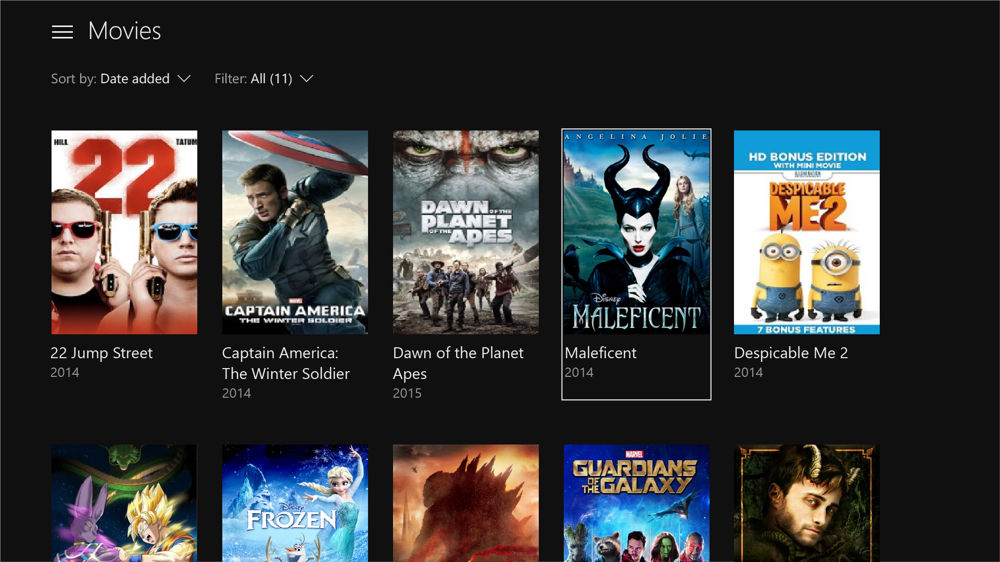
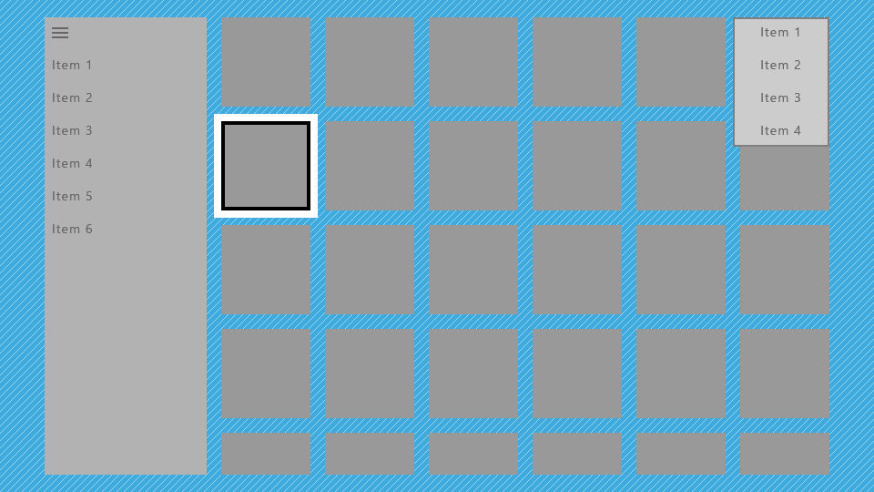
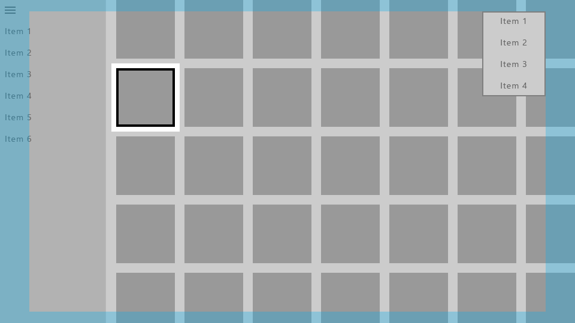

# Designing for Xbox and TV

Design your Windows app so that it looks good and functions well on Xbox One and television screens.

See [Gamepad and remote control interactions](../input/gamepad-and-remote-interactions.md) for guidance on interaction experiences in UWP applications in the *10-foot* experience.

## Overview

The Universal Windows Platform lets you create delightful experiences across multiple Windows 10 devices.
Most of the functionality provided by the UWP framework enables apps to use the same user interface (UI) across these devices, without additional work.
However, tailoring and optimizing your app to work great on Xbox One and TV screens requires special considerations.

The experience of sitting on your couch across the room, using a gamepad or remote to interact with your TV, is called the **10-foot experience**.
It is so named because the user is generally sitting approximately 10 feet away from the screen.
This provides unique challenges that aren't present in, say, the *2-foot* experience, or interacting with a PC.
If you are developing an app for Xbox One or any other device that outputs to the TV screen and uses a controller for input, you should always keep this in mind.

Not all of the steps in this article are required to make your app work well for 10-foot experiences, but understanding them and making the appropriate decisions for your app will result in a better 10-foot experience tailored for your app's specific needs.
As you bring your app to life in the 10-foot environment, consider the following design principles.

### Simple

Designing for the 10-foot environment presents a unique set of challenges. Resolution and viewing distance can make it difficult for people to process too much information.
Try to keep your design clean, reduced to the simplest possible components. The amount of information displayed on a TV should be comparable to what you'd see on a mobile phone, rather than on a desktop.


### Coherent

UWP apps in the 10-foot environment should be intuitive and easy to use. Make the focus clear and unmistakable.
Arrange content so that movement across the space is consistent and predictable. Give people the shortest path to what they want to do.



_**All movies shown in the screenshot are available on Microsoft Movies & TV.**_  

### Captivating

The most immersive, cinematic experiences take place on the big screen. Edge-to-edge scenery, elegant motion, and vibrant use of color and typography take your apps to the next level. Be bold and beautiful.


### Optimizations for the 10-foot experience

Now that you know the principles of good UWP app design for the 10-foot experience, read through the following overview of the specific ways you can optimize your app and make for a great user experience.

| Feature        | Description           |
| -------------------------------------------------------------- |--------------------------------|
| [UI element sizing](#ui-element-sizing)  | The Universal Windows Platform uses [scaling and effective pixels](../basics/design-and-ui-intro.md#effective-pixels-and-scaling) to scale the UI according to the viewing distance. Understanding sizing and applying it across your UI will help optimize your app for the 10-foot environment.  |
|  [TV-safe area](#tv-safe-area) | The UWP will automatically avoid displaying any UI in TV-unsafe areas (areas close to the edges of the screen) by default. However, this creates a "boxed-in" effect in which the UI looks letterboxed. For your app to be truly immersive on TV, you will want to modify it so that it extends to the edges of the screen on TVs that support it. |
| [Colors](#colors)  |  The UWP supports color themes, and an app that respects the system theme will default to **dark** on Xbox One. If your app has a specific color theme, you should consider that some colors don't work well for TV and should be avoided. |
| [Sound](../style/sound.md)    | Sounds play a key role in the 10-foot experience, helping to immerse and give feedback to the user. The UWP provides functionality that automatically turns on sounds for common controls when the app is running on Xbox One. Find out more about the sound support built into the UWP and learn how to take advantage of it.    |
| [Guidelines for UI controls](#guidelines-for-ui-controls)  |  There are several UI controls that work well across multiple devices, but have certain considerations when used on TV. Read about some best practices for using these controls when designing for the 10-foot experience. |
| [Custom visual state trigger for Xbox](#custom-visual-state-trigger-for-xbox) | To tailor your UWP app for the 10-foot experience, we recommend that you use a custom *visual state trigger* to make layout changes when the app detects that it has been launched on an Xbox console. |

In addition to the preceding design and layout considerations, there are a number of [gamepad and remote control interaction](../input/gamepad-and-remote-interactions.md) optimizations you should consider when building your app.

| Feature        | Description           |
| -------------------------------------------------------------- |--------------------------------|
| [XY focus navigation and interaction](../input/gamepad-and-remote-interactions.md#xy-focus-navigation-and-interaction) | **XY focus navigation** enables the user to navigate around your app's UI. However, this limits the user to navigating up, down, left, and right. Recommendations for dealing with this and other considerations are outlined in this section. |
| [Mouse mode](../input/gamepad-and-remote-interactions.md#mouse-mode)|XY focus navigation isn't practical, or even possible, for some types of applications, such as maps or drawing and painting apps. In these cases, **mouse mode** lets users navigate freely with a gamepad or remote control, just like a mouse on a PC.|
| [Focus visual](../input/gamepad-and-remote-interactions.md#focus-visual)  | The focus visual is a border that highlights the currently focused UI element. This helps the user quickly identify the UI they are navigating through or interacting with.  |
| [Focus engagement](../input/gamepad-and-remote-interactions.md#focus-engagement) | Focus engagement requires the user to press the **A/Select** button on a gamepad or remote control when a UI element has focus in order to interact with it. |
| [Hardware buttons](../input/gamepad-and-remote-interactions.md#hardware-buttons) | The gamepad and remote control provide very different buttons and configurations. |

> [!NOTE]
> Most of the code snippets in this topic are in XAML/C#; however, the principles and concepts apply to all UWP apps. If you're developing an HTML/JavaScript UWP app for Xbox, check out the excellent [TVHelpers](https://github.com/Microsoft/TVHelpers/wiki) library on GitHub.

## UI element sizing

Because the user of an app in the 10-foot environment is using a remote control or gamepad and is sitting several feet away from the screen, there are some UI considerations that need to be factored into your design.
Make sure that the UI has an appropriate content density and is not too cluttered so that the user can easily navigate and select elements. Remember: simplicity is key.

### Scale factor and adaptive layout

**Scale factor** helps with ensuring that UI elements are displayed with the right sizing for the device on which the app is running.
On desktop, this setting can be found in **Settings > System > Display** as a sliding value.
This same setting exists on phone as well if the device supports it.


On Xbox One, there is no such system setting; however, for UWP UI elements to be sized appropriately for TV, they are scaled at a default of **200%** for XAML apps and **150%** for HTML apps.
As long as UI elements are appropriately sized for other devices, they will be appropriately sized for TV.
Xbox One renders your app at 1080p (1920 x 1080 pixels). Therefore, when bringing an app from other devices such as PC,
ensure that the UI looks great at 960 x 540 px at 100% scale (or 1280 x 720 px at 100% scale for HTML apps) utilizing [adaptive techniques](../layout/screen-sizes-and-breakpoints-for-responsive-design.md).

Designing for Xbox is a little different from designing for PC because you only need to worry about one resolution, 1920 x 1080.
It doesn't matter if the user has a TV that has better resolution&mdash;UWP apps will always scale to 1080p.

Correct asset sizes from the 200% (or 150% for HTML apps) set will also be pulled in for your app when running on Xbox One, regardless of TV resolution.

### Content density

When designing your app, remember that the user will be viewing the UI from a distance and interacting with it by using a remote or game controller, which takes more time to navigate than using mouse or touch input.

#### Sizes of UI controls

Interactive UI elements should be sized at a minimum height of 32 epx (effective pixels). This is the default for common UWP controls, and when used at 200% scale, it ensures that UI elements are visible from a distance and helps reduce content density.


#### Number of clicks

When the user is navigating from one edge of the TV screen to the other, it should take no more than **six clicks** to simplify your UI. Again, the principle of **simplicity** applies here. 


### Text sizes

To make your UI visible from a distance, use the following rules of thumb:

* Main text and reading content: 15 epx minimum
* Non-critical text and supplemental content: 12 epx minimum

When using larger text in your UI, pick a size that does not limit screen real estate too much, taking up space that other content could potentially fill.

### Opting out of scale factor

We recommend that your app take advantage of scale factor support, which will help it run appropriately on all devices by scaling for each device type.
However, it is possible to opt out of this behavior and design all of your UI at 100% scale. Note that you cannot change the scale factor to anything other than 100%.

For XAML apps, you can opt out of scale factor by using the following code snippet:

```csharp
bool result =
    Windows.UI.ViewManagement.ApplicationViewScaling.TrySetDisableLayoutScaling(true);
```

`result` will inform you whether you successfully opted out.

For more information, including sample code for HTML/JavaScript, see [How to turn off scaling](../../xbox-apps/disable-scaling.md).

Please be sure to calculate the appropriate sizes of UI elements by doubling the *effective* pixel values mentioned in this topic to *actual* pixel values (or multiplying by 1.5 for HTML apps).

## TV-safe area

Not all TVs display content all the way to the edges of the screen due to historical and technological reasons. By default, the UWP will avoid displaying any UI content in TV-unsafe areas and instead will only draw the page background.

The TV-unsafe area is represented by the blue area in the following image.


You can set the background to a static or themed color, or to an image, as the following code snippets demonstrate.

### Theme color

```xml
<Page x:Class="Sample.MainPage"
      Background="{ThemeResource ApplicationPageBackgroundThemeBrush}"/>
```

### Image

```xml
<Page x:Class="Sample.MainPage"
      Background="\Assets\Background.png"/>
```

This is what your app will look like without additional work.



This is not optimal because it gives the app a "boxed-in" effect, with parts of the UI such as the nav pane and grid seemingly cut off. However, you can make optimizations to extend parts of the UI to the edges of the screen to give the app a more cinematic effect.

### Drawing UI to the edge

We recommend that you use certain UI elements to extend to the edges of the screen to provide more immersion to the user. These include [ScrollViewers](/uwp/api/Windows.UI.Xaml.Controls.ScrollViewer), [nav panes](../controls-and-patterns/navigationview.md), and [CommandBars](/uwp/api/Windows.UI.Xaml.Controls.CommandBar).

On the other hand, it's also important that interactive elements and text always avoid the screen edges to ensure that they won't be cut off on some TVs. We recommend that you draw only non-essential visuals within 5% of the screen edges. As mentioned in [UI element sizing](#ui-element-sizing), a UWP app following the Xbox One console's default scale factor of 200% will utilize an area of 960 x 540 epx, so in your app's UI, you should avoid putting essential UI in the following areas:

- 27 epx from the top and bottom
- 48 epx from the left and right sides

The following sections describe how to make your UI extend to the screen edges.

#### Core window bounds

For UWP apps targeting only the 10-foot experience, using core window bounds is a more straightforward option.

In the `OnLaunched` method of `App.xaml.cs`, add the following code:

```csharp
Windows.UI.ViewManagement.ApplicationView.GetForCurrentView().SetDesiredBoundsMode
    (Windows.UI.ViewManagement.ApplicationViewBoundsMode.UseCoreWindow);
```

With this line of code, the app window will extend to the edges of the screen, so you will need to move all interactive and essential UI into the TV-safe area described earlier. Transient UI, such as context menus and opened [ComboBoxes](/uwp/api/Windows.UI.Xaml.Controls.ComboBox), will automatically remain inside the TV-safe area.



#### Pane backgrounds

Navigation panes are typically drawn near the edge of the screen, so the background should extend into the TV-unsafe area so as not to introduce awkward gaps. You can do this by simply changing the color of the nav pane's background to the color of the app's background.

Using the core window bounds as previously described will allow you to draw your UI to the edges of the screen, but you should then use positive margins on the [SplitView](/uwp/api/Windows.UI.Xaml.Controls.SplitView)'s content to keep it within the TV-safe area.


Here, the nav pane's background has been extended to the edges of the screen, while its navigation items are kept in the TV-safe area.
The content of the `SplitView` (in this case, a grid of items) has been extended to the bottom of the screen so that it looks like it continues and isn't cut off, while the top of the grid is still within the TV-safe area. (Learn more about how to do this in [Scrolling ends of lists and grids](#scrolling-ends-of-lists-and-grids)).

The following code snippet achieves this effect:

```xml
<SplitView x:Name="RootSplitView"
           Margin="48,0,48,0">
    <SplitView.Pane>
        <ListView x:Name="NavMenuList"
                  ContainerContentChanging="NavMenuItemContainerContentChanging"
                  ItemContainerStyle="{StaticResource NavMenuItemContainerStyle}"
                  ItemTemplate="{StaticResource NavMenuItemTemplate}"
                  ItemInvoked="NavMenuList_ItemInvoked"
                  ItemsSource="{Binding NavMenuListItems}"/>
    </SplitView.Pane>
    <Frame x:Name="frame"
           Navigating="OnNavigatingToPage"
           Navigated="OnNavigatedToPage"/>
</SplitView>
```

[CommandBar](/uwp/api/Windows.UI.Xaml.Controls.CommandBar) is another example of a pane that is commonly positioned near one or more edges of the app, and as such on TV its background should extend to the edges of the screen. It also usually contains a **More** button, represented by "..." on the right side, which should remain in the TV-safe area. The following are a few different strategies to achieve the desired interactions and visual effects.

**Option 1**: Change the `CommandBar` background color to either transparent or the same color as the page background:

```xml
<CommandBar x:Name="topbar"
            Background="{ThemeResource SystemControlBackgroundAltHighBrush}">
            ...
</CommandBar>
```

Doing this will make the `CommandBar` look like it is on top of the same background as the rest of the page, so the background seamlessly flows to the edge of the screen.

**Option 2**: Add a background rectangle whose fill is the same color as the `CommandBar` background, and have it lie below the `CommandBar` and across the rest of the page:

```xml
<Rectangle VerticalAlignment="Top"
            HorizontalAlignment="Stretch"      
            Fill="{ThemeResource SystemControlBackgroundChromeMediumBrush}"/>
<CommandBar x:Name="topbar"
            VerticalAlignment="Top"
            HorizontalContentAlignment="Stretch">
            ...
</CommandBar>
```

> [!NOTE]
> If using this approach, be aware that the **More** button changes the height of the opened `CommandBar` if necessary, in order to show the labels of the `AppBarButton`s below their icons. We recommend that you move the labels to the *right* of their icons to avoid this resizing. For more information, see [CommandBar labels](#commandbar-labels).

Both of these approaches also apply to the other types of controls listed in this section.

#### Scrolling ends of lists and grids

It's common for lists and grids to contain more items than can fit onscreen at the same time. When this is the case, we recommend that you extend the list or grid to the edge of the screen. Horizontally scrolling lists and grids should extend to the right edge, and vertically scrolling ones should extend to the bottom.


While a list or grid is extended like this, it's important to keep the focus visual and its associated item inside the TV-safe area.


The UWP has functionality that will keep the focus visual inside the [VisibleBounds](/uwp/api/windows.ui.viewmanagement.applicationview.visiblebounds), but you need to add padding to ensure that the list/grid items can scroll into view of the safe area. Specifically, you add a positive margin to the [ListView](/uwp/api/Windows.UI.Xaml.Controls.ListView) or [GridView](/uwp/api/Windows.UI.Xaml.Controls.GridView)'s [ItemsPresenter](/uwp/api/Windows.UI.Xaml.Controls.ItemsPresenter), as in the following code snippet:

```xml
<Style x:Key="TitleSafeListViewStyle"
       TargetType="ListView">
    <Setter Property="Template">
        <Setter.Value>
            <ControlTemplate TargetType="ListView">
                <Border BorderBrush="{TemplateBinding BorderBrush}"
                        Background="{TemplateBinding Background}"
                        BorderThickness="{TemplateBinding BorderThickness}">
                    <ScrollViewer x:Name="ScrollViewer"
                                  TabNavigation="{TemplateBinding TabNavigation}"
                                  HorizontalScrollMode="{TemplateBinding ScrollViewer.HorizontalScrollMode}"
                                  HorizontalScrollBarVisibility="{TemplateBinding ScrollViewer.HorizontalScrollBarVisibility}"
                                  IsHorizontalScrollChainingEnabled="{TemplateBinding ScrollViewer.IsHorizontalScrollChainingEnabled}"
                                  VerticalScrollMode="{TemplateBinding ScrollViewer.VerticalScrollMode}"
                                  VerticalScrollBarVisibility="{TemplateBinding ScrollViewer.VerticalScrollBarVisibility}"
                                  IsVerticalScrollChainingEnabled="{TemplateBinding ScrollViewer.IsVerticalScrollChainingEnabled}"
                                  IsHorizontalRailEnabled="{TemplateBinding ScrollViewer.IsHorizontalRailEnabled}"
                                  IsVerticalRailEnabled="{TemplateBinding ScrollViewer.IsVerticalRailEnabled}"
                                  ZoomMode="{TemplateBinding ScrollViewer.ZoomMode}"
                                  IsDeferredScrollingEnabled="{TemplateBinding ScrollViewer.IsDeferredScrollingEnabled}"
                                  BringIntoViewOnFocusChange="{TemplateBinding ScrollViewer.BringIntoViewOnFocusChange}"
                                  AutomationProperties.AccessibilityView="Raw">
                        <ItemsPresenter Header="{TemplateBinding Header}"
                                        HeaderTemplate="{TemplateBinding HeaderTemplate}"
                                        HeaderTransitions="{TemplateBinding HeaderTransitions}"
                                        Footer="{TemplateBinding Footer}"
                                        FooterTemplate="{TemplateBinding FooterTemplate}"
                                        FooterTransitions="{TemplateBinding FooterTransitions}"
                                        Padding="{TemplateBinding Padding}"
                                        Margin="0,27,0,27"/>
                    </ScrollViewer>
                </Border>
            </ControlTemplate>
        </Setter.Value>
    </Setter>
</Style>
```

You would put the previous code snippet in either the page or app resources, and then access it in the following way:

```xml
<Page>
    <Grid>
        <ListView Style="{StaticResource TitleSafeListViewStyle}"
                  ... />
```

> [!NOTE]
> This code snippet is specifically for `ListView`s; for a `GridView` style, set the [TargetType](/uwp/api/windows.ui.xaml.controls.controltemplate.targettype) attribute for both the [ControlTemplate](/uwp/api/Windows.UI.Xaml.Controls.ControlTemplate) and the [Style](/uwp/api/Windows.UI.Xaml.Style) to `GridView`.

For more fine-grained control over how items are brought into view, if your application targets version 1803 or later, you can use the [UIElement.BringIntoViewRequested event](/uwp/api/windows.ui.xaml.uielement.bringintoviewrequested). You can put it on the [ItemsPanel](/uwp/api/windows.ui.xaml.controls.itemscontrol.itemspanel) for the **ListView**/**GridView** to catch it before the internal **ScrollViewer** does, as in the following code snippets:

```xaml
<GridView x:Name="gridView">
    <GridView.ItemsPanel>
        <ItemsPanelTemplate>
            <ItemsWrapGrid Orientation="Horizontal"
                           BringIntoViewRequested="ItemsWrapGrid_BringIntoViewRequested"/>
        </ItemsPanelTemplate>
    </GridView.ItemsPanel>
</GridView>
```

```cs
// The BringIntoViewRequested event is raised by the framework when items receive keyboard (or Narrator) focus or 
// someone triggers it with a call to UIElement.StartBringIntoView.
private void ItemsWrapGrid_BringIntoViewRequested(UIElement sender, BringIntoViewRequestedEventArgs args)
{
    if (args.VerticalAlignmentRatio != 0.5)  // Guard against our own request
    {
        args.Handled = true;
        // Swallow this request and restart it with a request to center the item.  We could instead have chosen
        // to adjust the TargetRect’s Y and Height values to add a specific amount of padding as it bubbles up, 
        // but if we just want to center it then this is easier.

        // (Optional) Account for sticky headers if they exist
        var headerOffset = 0.0;
        var itemsWrapGrid = sender as ItemsWrapGrid;
        if (gridView.IsGrouping && itemsWrapGrid.AreStickyGroupHeadersEnabled)
        {
            var header = gridView.GroupHeaderContainerFromItemContainer(args.TargetElement as GridViewItem);
            if (header != null)
            {
                headerOffset = ((FrameworkElement)header).ActualHeight;
            }
        }

        // Issue a new request
        args.TargetElement.StartBringIntoView(new BringIntoViewOptions()
        {
            AnimationDesired = true,
            VerticalAlignmentRatio = 0.5, // a normalized alignment position (0 for the top, 1 for the bottom)
            VerticalOffset = headerOffset, // applied after meeting the alignment ratio request
        });
    }
}
```

## Colors

By default, the Universal Windows Platform scales your app's colors to the TV-safe range (see [TV-safe colors](#tv-safe-colors) for more information) so that your app looks good on any TV. In addition, there are improvements that you can make to the set of colors your app uses to improve the visual experience on TV.

### Application theme

You can choose an **Application theme** (dark or light) according to what is right for your app, or you can opt out of theming. Read more about general recommendations for themes in [Color themes](../style/color.md).

The UWP also allows apps to dynamically set the theme based on the system settings provided by the devices on which they run.
While the UWP always respects the theme settings specified by the user, each device also provides an appropriate default theme.
Because of the nature of Xbox One, which is expected to have more *media* experiences than *productivity* experiences, it defaults to a dark system theme.
If your app's theme is based on the system settings, expect it to default to dark on Xbox One.

### Accent color

The UWP provides a convenient way to expose the **accent color** that the user has selected from their system settings.

On Xbox One, the user is able to select a user color, just as they can select an accent color on a PC.
As long as your app calls these accent colors through brushes or color resources, the color that the user selected in the system settings will be used. Note that accent colors on Xbox One are per user, not per system.

Please also note that the set of user colors on Xbox One is not the same as that on PCs, phones, and other devices.

As long as your app uses a brush resource such as **SystemControlForegroundAccentBrush**, or a color resource (**SystemAccentColor**), or instead calls accent colors directly through the [UIColorType.Accent*](/uwp/api/Windows.UI.ViewManagement.UIColorType) API, those colors are replaced with accent colors available on Xbox One. High contrast brush colors are also pulled in from the system the same way as on a PC and phone.

To learn more about accent color in general, see [Accent color](../style/color.md#accent-color).

### Color variance among TVs

When designing for TV, note that colors display quite differently depending on the TV on which they are rendered. Don't assume colors will look exactly as they do on your monitor. If your app relies on subtle differences in color to differentiate parts of the UI, colors could blend together and users could get confused. Try to use colors that are different enough that users will be able to clearly differentiate them, regardless of the TV they are using.

### TV-safe colors

A color's RGB values represent intensities for red, green, and blue. TVs don't handle extreme intensities very well&mdash;they can produce an odd banded effect, or appear washed out on certain TVs. Additionally, high-intensity colors may cause blooming (nearby pixels start drawing the same colors). While there are different schools of thought in what are considered TV-safe colors, colors within the RGB values of 16-235 (or 10-EB in hexadecimal) are generally safe to use for TV.


Historically, apps on Xbox had to tailor their colors to fall within this "TV-safe" color range; however, starting with the Fall Creators Update, Xbox One automatically scales full range content into the TV-safe range. This means that most app developers no longer have to worry about TV-safe colors.

> [!IMPORTANT]
> Video content that's already in the TV-safe color range doesn't have this color scaling effect applied when played back using [Media Foundation](/windows/desktop/medfound/microsoft-media-foundation-sdk).

If you're developing an app using DirectX 11 or DirectX 12 and creating your own swap chain to render UI or video, you can specify the color space you use by calling [IDXGISwapChain3::SetColorSpace1](/windows/desktop/api/dxgi1_4/nf-dxgi1_4-idxgiswapchain3-setcolorspace1), which will let the system know if it needs to scale colors or not.

## Guidelines for UI controls

There are several UI controls that work well across multiple devices, but have certain considerations when used on TV. Read about some best practices for using these controls when designing for the 10-foot experience.

### Pivot control

A [Pivot](/uwp/api/Windows.UI.Xaml.Controls.Pivot) provides quick navigation of views within an app through selecting different headers or tabs. The control underlines whichever header has focus, making it more obvious which header is currently selected when using gamepad/remote.


You can set the [Pivot.IsHeaderItemsCarouselEnabled](/uwp/api/windows.ui.xaml.controls.pivot.isheaderitemscarouselenabledproperty) property to `true` so that pivots always keep the same position, rather than having the selected pivot header always move to the first position. This is a better experience for large-screen displays such as TV, because header wrapping can be distracting to users. If all of the pivot headers don't fit onscreen at once, there will be a scrollbar to let customers see the other headers; however, you should make sure that they all fit on the screen to provide the best experience. For more information, see [Tabs and pivots](../controls-and-patterns/pivot.md).

### Navigation pane <a name="navigation-pane" />

A navigation pane (also known as a *hamburger menu*) is a navigation control commonly used in UWP apps. Typically it is a pane with several options to choose from in a list style menu that will take the user to different pages. Generally this pane starts out collapsed to save space, and the user can open it by clicking on a button.

While nav panes are very accessible with mouse and touch, gamepad/remote makes them less accessible since the user has to navigate to a button to open the pane. Therefore, a good practice is to have the **View** button open the nav pane, as well as allow the user to open it by navigating all the way to the left of the page. Code sample on how to implement this design pattern can be found in [Programmatic focus navigation](../input/focus-navigation-programmatic.md#split-view-code-sample) document. This will provide the user with very easy access to the contents of the pane. For more information about how nav panes behave in different screen sizes as well as best practices for gamepad/remote navigation, see [Nav panes](../controls-and-patterns/navigationview.md).

### CommandBar labels

It is a good idea to have the labels placed to the right of the icons on a [CommandBar](/uwp/api/Windows.UI.Xaml.Controls.CommandBar) so that its height is minimized and stays consistent. You can do this by setting the [CommandBar.DefaultLabelPosition](/uwp/api/windows.ui.xaml.controls.commandbar.defaultlabelpositionproperty) property to `CommandBarDefaultLabelPosition.Right`.


Setting this property will also cause the labels to always be displayed, which works well for the 10-foot experience because it minimizes the number of clicks for the user. This is also a great model for other device types to follow.

### Tooltip

The [Tooltip](/uwp/api/Windows.UI.Xaml.Controls.ToolTip) control was introduced as a way to provide more information in the UI when the user hovers the mouse over, or taps and holds their figure on, an element. For gamepad and remote, `Tooltip` appears after a brief moment when the element gets focus, stays onscreen for a short time, and then disappears. This behavior could be distracting if too many `Tooltip`s are used. Try to avoid using `Tooltip` when designing for TV.

### Button styles

While the standard UWP buttons work well on TV, some visual styles of buttons call attention to the UI better, which you may want to consider for all platforms, particularly in the 10-foot experience, which benefits from clearly communicating where the focus is located. To read more about these styles, see [Buttons](../controls-and-patterns/buttons.md).

### Nested UI elements

Nested UI exposes nested actionable items enclosed inside a container UI element where both the nested item as well as the container item can take independent focus from each other.

Nested UI works well for some input types, but not always for gamepad and remote, which rely on XY navigation. Be sure to follow the guidance in this topic to ensure that your UI is optimized for the 10-foot environment, and that the user can access all interactable elements easily. One common solution is to place nested UI elements in a `ContextFlyout`.

For more information on nested UI, see [Nested UI in list items](../controls-and-patterns/nested-ui.md).

### MediaTransportControls

The [MediaTransportControls](/uwp/api/Windows.UI.Xaml.Controls.MediaTransportControls) element lets users interact with their media by providing a default playback experience that allows them to play, pause, turn on closed captions, and more. This control is a property of [MediaPlayerElement](/uwp/api/Windows.UI.Xaml.Controls.MediaPlayerElement) and supports two layout options: *single-row* and *double-row*. In the single-row layout, the slider and playback buttons are all located in one row, with the play/pause button located to the left of the slider. In the double-row layout, the slider occupies its own row, with the playback buttons on a separate lower row. When designing for the 10-foot experience, the double-row layout should be used, as it provides better navigation for gamepad. To enable the double-row layout, set `IsCompact="False"` on the `MediaTransportControls` element in the [TransportControls](/uwp/api/windows.ui.xaml.controls.mediaplayerelement.transportcontrols) property of the `MediaPlayerElement`.

```xml
<MediaPlayerElement x:Name="mediaPlayerElement1"  
                    Source="Assets/video.mp4"
                    AreTransportControlsEnabled="True">
    <MediaPlayerElement.TransportControls>
        <MediaTransportControls IsCompact="False"/>
    </MediaPlayerElement.TransportControls>
</MediaPlayerElement>
```  

Visit [Media playback](../controls-and-patterns/media-playback.md) to learn more about adding media to your app.

> ![NOTE]
> `MediaPlayerElement` is only available in Windows 10, version 1607 and later. If you're developing an app for an earlier version of Windows 10, you'll need to use [MediaElement](/uwp/api/Windows.UI.Xaml.Controls.MediaElement) instead. The recommendations above apply to `MediaElement` as well, and the `TransportControls` property is accessed in the same way.

### Search experience

Searching for content is one of the most commonly performed functions in the 10-foot experience. If your app provides a search experience, it is helpful for the user to have quick access to it by using the **Y** button on the gamepad as an accelerator.

Most customers should already be familiar with this accelerator, but if you like you can add a visual **Y** glyph to the UI to indicate that the customer can use the button to access search functionality. If you do add this cue, be sure to use the symbol from the **Segoe Xbox MDL2 Symbol** font (`&#xE3CC;` for XAML apps, `\E426` for HTML apps) to provide consistency with the Xbox shell and other apps.

> [!NOTE]
> Because the **Segoe Xbox MDL2 Symbol** font is only available on Xbox, the symbol won't appear correctly on your PC. However, it will show up on the TV once you deploy to Xbox.

Since the **Y** button is only available on gamepad, make sure to provide other methods of access to search, such as buttons in the UI. Otherwise, some customers may not be able to access the functionality.

In the 10-foot experience, it is often easier for customers to use a full screen search experience because there is limited room on the display. Whether you have full screen or partial-screen, "in-place" search, we recommend that when the user opens the search experience, the onscreen keyboard appears already opened, ready for the customer to enter search terms.

## Custom visual state trigger for Xbox

To tailor your UWP app for the 10-foot experience, we recommend that you make layout changes when the app detects that it has been launched on an Xbox console. One way to do this is by using a custom *visual state trigger*. Visual state triggers are most useful when you want to edit in **Blend for Visual Studio**. The following code snippet shows how to create a visual state trigger for Xbox:

```xml
<VisualStateManager.VisualStateGroups>
    <VisualStateGroup>
        <VisualState>
            <VisualState.StateTriggers>
                <triggers:DeviceFamilyTrigger DeviceFamily="Windows.Xbox"/>
            </VisualState.StateTriggers>
            <VisualState.Setters>
                <Setter Target="RootSplitView.OpenPaneLength"
                        Value="368"/>
                <Setter Target="RootSplitView.CompactPaneLength"
                        Value="96"/>
                <Setter Target="NavMenuList.Margin"
                        Value="0,75,0,27"/>
                <Setter Target="Frame.Margin"
                        Value="0,27,48,27"/>
                <Setter Target="NavMenuList.ItemContainerStyle"
                        Value="{StaticResource NavMenuItemContainerXboxStyle}"/>
            </VisualState.Setters>
        </VisualState>
    </VisualStateGroup>
</VisualStateManager.VisualStateGroups>
```

To create the trigger, add the following class to your app. This is the class that is referenced by the XAML code above:

```csharp
class DeviceFamilyTrigger : StateTriggerBase
{
    private string _currentDeviceFamily, _queriedDeviceFamily;

    public string DeviceFamily
    {
        get
        {
            return _queriedDeviceFamily;
        }

        set
        {
            _queriedDeviceFamily = value;
            _currentDeviceFamily = AnalyticsInfo.VersionInfo.DeviceFamily;
            SetActive(_queriedDeviceFamily == _currentDeviceFamily);
        }
    }
}
```

After you've added your custom trigger, your app will automatically make the layout modifications you specified in your XAML code whenever it detects that it is running on an Xbox One console.

Another way you can check whether your app is running on Xbox and then make the appropriate adjustments is through code. You can use the following simple variable to check if your app is running on Xbox:

```csharp
bool IsTenFoot = (Windows.System.Profile.AnalyticsInfo.VersionInfo.DeviceFamily ==
                    "Windows.Xbox");
```

Then, you can make the appropriate adjustments to your UI in the code block following this check. 

## Summary

Designing for the 10-foot experience has special considerations to take into account that make it different from designing for any other platform. While you can certainly do a straight port of your UWP app to Xbox One and it will work, it won't necessarily be optimized for the 10-foot experience and can lead to user frustration. Following the guidelines in this article will make sure that your app is as good as it can be on TV.

## Related articles

- [Device primer for Windows apps](index.md)
- [Gamepad and remote control interactions](../input/gamepad-and-remote-interactions.md)
- [Sound in UWP apps](../style/sound.md)