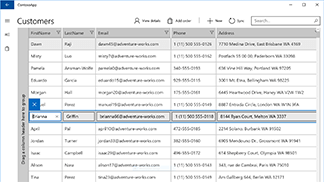
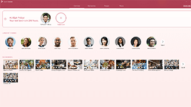

# Design toolkits and samples for UWP apps
 

Design and UI-related downloads for Fluent Design/UWP apps. For additional tools, such as Visual Studio, see <a href="https://developer.microsoft.com/downloads">our main downloads page</a>. 

## Design toolkits

These toolkits provide controls and layout templates for designing UWP apps.

* <a href="https://aka.ms/adobexdtoolkit">Adobe XD toolkit (v1806, June 2018)</a>
* <a href="https://aka.ms/adobeillustratortoolkit">Adobe Illustrator toolkit (v1806, June 2018)</a>
* <a href="https://aka.ms/sketchtoolkit">Sketch toolkit (v1803, March 2018)</a>
* <a href="https://aka.ms/adobephotoshoptoolkit">Adobe Photoshop toolkit (v1705, May 2017)</a>
* <a href="https://aka.ms/framertoolkit">Framer toolkit (on GitHub) (v1710, August 2017)</a>

## Fonts

* <a href="https://aka.ms/SegoeFonts">Segoe UI and MDL2 icon fonts (Mac only)</a>
* <a href="https://aka.ms/hololensiconfont">Hololens icon font (Windows only)</a>

## Tools

  

            
<b>Tile and icon generator for Adobe Photoshop</b> 
            This set of actions for Adobe Photoshop generates the 68 recommended tile and icon assets from just 7 files.  <a href="http://go.microsoft.com/fwlink/p/?LinkId=760394">Download the tile and icon generator</a>
    
  

  

  

## Samples

  

            
<b>BuildCast</b>  
            BuildCast is an end-to-end sample built to showcase the Fluent Design System, as well as other capabilities of the Universal Windows Platform. It permits browsing, downloading, and playback of select video podcasts, including a sampling of the most popular ones from Channel 9 and some Windows tech enthusiast feeds. It also features ink notes, bookmarks, and remote playback. This sample was initially shown at the 2017 Build conference during the <a href="https://channel9.msdn.com/Events/Build/2017/B8034">Build Amazing Apps with Fluent Design</a> talk.  <a href="https://github.com/Microsoft/BuildCast/archive/master.zip">Download the BuildCast sample</a>  <a href="https://github.com/Microsoft/BuildCast">Check out the BuildCast sample on GitHub</a>
    
  

  

  

 

  

            
<b>Customers Orders Database</b>  
            This UWP sample app showcases features useful to enterprise developers, like Azure Active Directory (AAD) authentication, UI controls (including a data grid), and cloud database and API integration using ASP.NET Core and Entity Framework.  <a href="https://github.com/Microsoft/Windows-appsample-customers-orders-database/archive/master.zip">Download the Customers Orders Database sample</a> <a href="https://github.com/Microsoft/Windows-appsample-customers-orders-database">Check out the Customers Orders Database sample on GitHub</a>
   
  

  

  

 

  

            
<b>Lunch Scheduler</b> 
            A UWP sample that schedules lunches with your friends and coworkers. You create a lunch, invite friends to a restaurant of interest, and the app takes care of the lunch management for all involved parties. This app incorporates elements of the Fluent Design System in a UWP app, including acrylic, reveal, and connected animations.  <a href="https://github.com/Microsoft/Windows-appsample-lunch-scheduler/archive/master.zip">Download the Lunch Scheduler sample</a> <a href="https://github.com/Microsoft/Windows-appsample-lunch-scheduler">Check out the Lunch Scheduler sample on GitHub</a>
    
  

  

  

 

  

            
<b>XAML Controls Gallery</b> 
            This sample provides an interactive demo of all of the XAML controls. It shows a variety of layouts from basic to adaptive, and displays markup that you can copy into your own project. Note: The download file and the GitHub repository currently refer to this sample app as "UI Basics (XAML)."  <a href="https://github.com/Microsoft/Windows-universal-samples/archive/master.zip">Download the XAML Controls Gallery sample</a> <a href="https://github.com/Microsoft/Windows-universal-samples/tree/master/Samples/XamlUIBasics">Check out the XAML Controls Gallery sample on GitHub</a>  <a href="https://www.microsoft.com/store/apps/9msvh128x2zt">Download the XAML Controls Gallery app from the Store</a>
    
  

  

  

 

<b>Want more code?</b> Check out the Windows sample page for complete list of all our UWP app samples. <a href="https://developer.microsoft.com/samples">Go to the samples portal</a>
