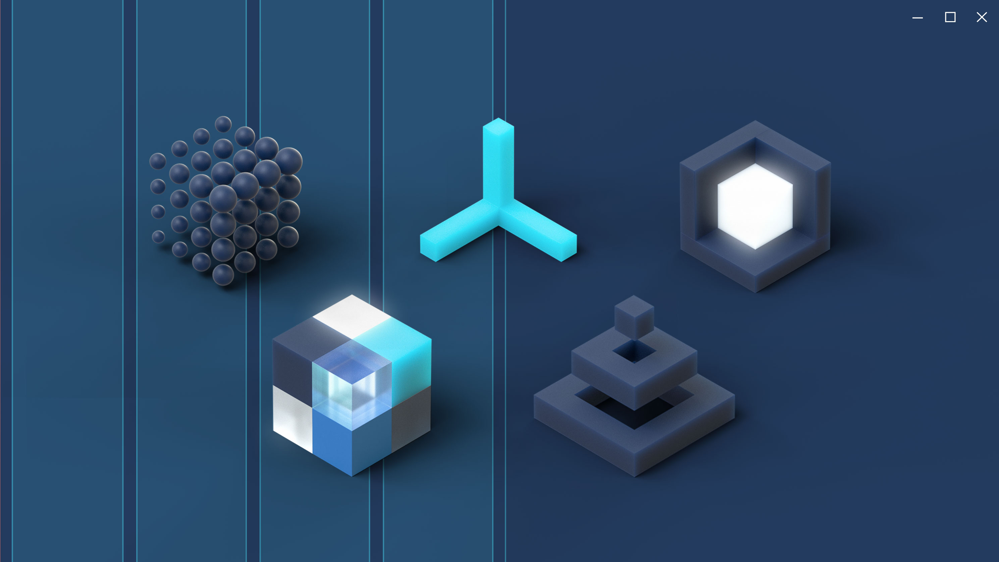

# The Fluent Design System for UWP apps

## Introduction

The user interface is evolving. It's expanding to include new dimensions and interfaces, from 2D to 3D and beyond, from keyboard and mouse to gaze, pen, and touch.  

The Fluent Design System is a set of innovative UWP features combined with best practices for creating apps that perform beautifully on all types of Windows-powered devices.

It's our system for creating adaptive, empathetic, and beautiful user interfaces. 

**Adaptive: Fluent experiences feel natural on each device**

Fluent experiences adapt to the environment. A Fluent experience feels comfortable on a tablet, a desktop PC, and an Xbox&mdash;it even works great on a Mixed Reality headset. And when you add more hardware, like an additional monitor for your PC, a Fluent experience takes advantage of it. 

**Empathetic: Fluent experiences are intuitive and powerful**

Fluent experiences adjust to behavior and intent&mdash;they understand and anticipate what’s needed. They unite people and ideas, whether they’re on opposite sides of the globe or standing right next to each other. 

Demonstrating empathy is about doing the right thing at the right time. 

Fluent experiences use controls and patterns consistently, so they behave in ways the user has learned to expect. Fluent experiences are accessible to people with a wide range of physical abilities, and incorporate globalization features so people around the world can use them. 

**Beautiful: Fluent experiences are engaging and immersive** 

By incorporating elements of the physical world, a Fluent experience taps into something fundamental. It uses light, shadow, motion, depth, and texture to organize information in a way that feels intuitive and instinctual. 

Fluent Design isn't about flashy effects. It incorporates physical effects that truly enhance the user experience, because they emulate experiences that our brains are programmed to process efficiently. 

## Applying Fluent Design to your app

Fluent Design features are built into UWP. Some of these features&mdash;such as effective pixels and the universal input system&mdash;are automatic. You don't have to write any extra code to take advantage of them. Other features, like acrylic, are optional; you add them to your app by writing code to include them. 

> To learn more about the basic features that are automatically included in every UWP app, see the [Intro to UWP app design article](../basics/design-and-ui-intro.md). If you're completely new to UWP development, you might want to check out our [Get started with UWP page](https://developer.microsoft.com/windows/apps/getstarted) first. 

To learn more about the new features that help you incorporate Fluent Design into your app, keep reading.

## Find a natural fit

How do you make an app feel natural on a variety of devices? By making it feel as though it were designed with each specific device in mind. A UI layout that adapts to different screen sizes&mdash;so there's no wasted space (but no crowding either)&mdash;makes an experience feel natural, as though it were designed for that device. 

*  **Design for the right breakpoints**

	Instead of designing for every individual screen size, focusing on a few key widths (also called "breakpoints") can greatly simplify your designs and code while still making your app look great on small to large screens.

	[Learn about screen sizes and breakpoints](/windows/uwp/design/layout/screen-sizes-and-breakpoints-for-responsive-design)

*  **Create a responsive layout**

	For an app to feel natural, it needs to fill the available display space without seeming too crowded. UWP provides panels that arrange content in grids, stacks, and flows, and you can nest them inside each other.

	[Learn about UWP's layout panels](/windows/uwp/design/layout/layout-panels)

* **Design for a spectrum of devices**

	UWP apps can run on a wide variety of Windows-powered devices. It's helpful to understand which devices are available, what they're made for, and how users interact with them.

	[Learn about UWP devices](/windows/uwp/design/devices/)

* **Optimize for the right input**

	UWP apps automatically support common mouse, keyboard, pen, and touch interactions&mdash;there's nothing extra you have to do. But you can enhance your app with optimized support for specific inputs, like pen and the Surface Dial.

	[Learn about inputs and interactions](/windows/uwp/design/input/input-primer)

## Make it intuitive and powerful

An experience feels intuitive when it behaves that way the user expects it to. By using established controls and patterns and taking advantage of platform support for accessibility and globalization, you create an effortless experience that helps users be more productive. 

* **Use the right control for the job**

	Controls are the building blocks of the user interface; using the right control helps you create a user interface that behaves the way users expect it to.  UWP provides more than 45 controls, ranging from simple buttons to powerful data controls. 

	[Learn about UWP controls](/windows/uwp/design/controls-and-patterns/)

* **Be inclusive** 

	A well-design app is accessible to people with disabilities. With some extra coding, you can share your app with people around the world.

	[Learn about Usability](/windows/uwp/design/usability/)

## Be engaging and immersive 

Make your app engaging by incorporating physical elements, like light and motion. 

## Use light

Light has a way of drawing our attention. It creates atmosphere and a sense of place, and it’s a practical tool to illuminate information.
		
Add light to your UWP app:
		
* [Reveal highlight](../style/reveal.md) uses light to make interactive elements stand out. Light illuminates the elements the user can interact with, revealing hidden borders. Reveal is automatically enabled on some controls, such as list view and grid view. You can enable it on other controls by applying our predefined Reveal highlight styles. 

* [Reveal focus](../style/reveal-focus.md) uses light to call attention to the element that currently has input focus.  

## Create a sense of depth

We live in a three-dimensional world. By purposefully incorporating depth into the UI, we transform a flat, 2-D interface into something more&mdash;something that efficiently presents information and concepts by creating a visual hierarchy. It reinvents how things relate to each other within a layered, physical environment

Add depth to your UWP app:

* [Acrylic](../style/acrylic.md) is a translucent material that lets the user see layers of content, establishing a hierarchy of UI elements.

* [Parallax](../motion/parallax.md) creates the illusion of depth by making items in the foreground appear to move more quickly than items in the background.

## Incorporate motion

Think of motion design like a movie. Seamless transitions keep you focused on the story, and bring experiences to life. We can invite those feelings into our designs, leading people from one task to the next with cinematic ease.

Add motion to your UWP app:

* [Connected animations](../motion/connected-animation.md) help the user maintain context by creating a seamless transition between scenes. 

## Build it with the right material

The things that surround us in the real world are sensory and invigorating. They bend, stretch, bounce, shatter, and glide. Those material qualities translate to digital environments, making people want to reach out and touch our designs.

Add material to your UWP app: 
		
* [Acrylic](../style/acrylic.md)  is a translucent material that lets the user see layers of content, establishing a hierarchy of UI elements. 

## Design toolkits and code samples

Want to get started creating your own apps with Fluent Design? Our toolkits for Adobe XD, Adobe Illustrator, Adobe Photoshop, Framer, and Sketch will help jumpstart your designs, and our samples will help get you coding faster.

* Check out our [Design toolkits and samples page](/windows/uwp/design/downloads/)

