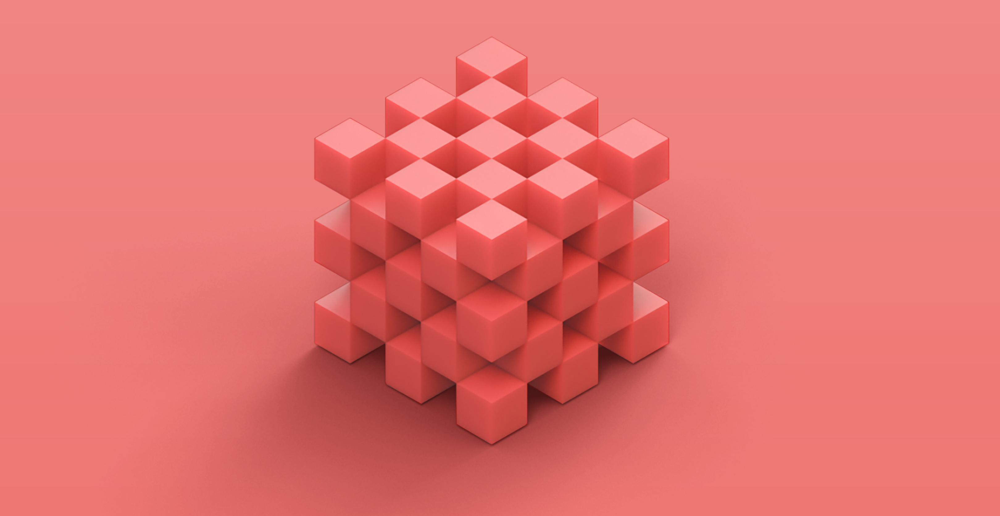
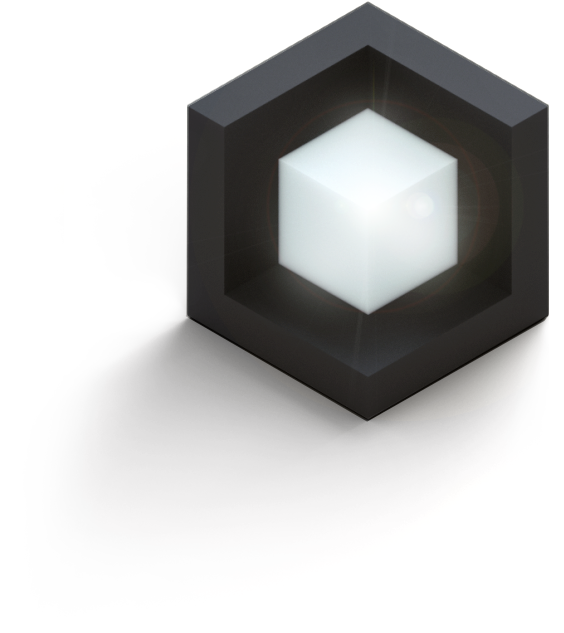
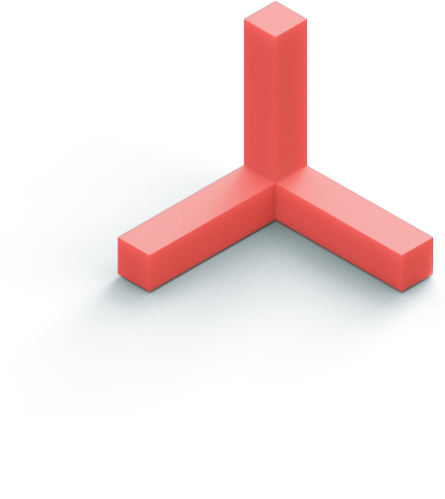
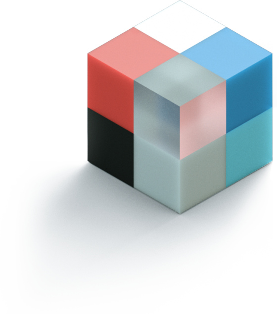
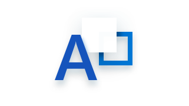
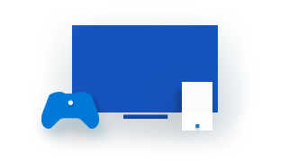

# The Fluent Design System

## Introduction

The user interface is evolving, expanding to include new dimensions and interactions. We speak, type, ink, touch, and gaze. We're engaged and immersed. We're surrounded by devices, interactions, and experiences. This evolution provides new opportunities and challenges that need us to be fluent in our designs. This is Fluent Design. 

## Fluent Design for UWP

The Fluent Design System for UWP is a set of UWP features and guidelines for creating UWP apps that perform beautifully across devices, inputs, and dimensions. Our guidelines are divided into several categories: [layout](../layout/index.md), [style](../style/index.md), [controls](../controls-and-patterns/index.md), [input and devices](../input/index.md), and [usability](../usability/index.md). 

Fluent Design platform features are built into UWP and help you create apps that are Fluent. Some of these features--such as effective pixels and the universal input system--are automatic. You don't have to write any extra code to take advantage of them. Other features, such as acrylic, are optional; you include them in your app by writing code to include them. 

To learn more about the basic features that are automatically included in every UWP app, see the [Intro to UWP app design article](../basics/design-and-ui-intro.md). To learn more about the new features that help you incorporate Fluent Design into your app, read on. 

## The building blocks of Fluent Design

<table>
	<tr>
		<td style="padding-left: 0px; padding-right: 0px; padding-top: 0px;">
			

				
			

		</td>
		
		<td style="padding-left: 0px; padding-right: 0px; padding-top: 0px;">
			

				
			

		</td>
		
		<td style="padding-left: 0px; padding-right: 0px; padding-top: 0px;">
			

				
			

		</td>
		
		<td style="padding-left: 0px; padding-right: 0px; padding-top: 0px;">
			

				
			

		</td>
		
		<td style="padding-left: 0px; padding-right: 0px; padding-top: 0px;">
			

				
			

		</td>
	<tr>
	<tr>
		<td style="text-align: center; padding-left: 0px; padding-right: 0px;">Light</td>
		<td style="text-align: center; padding-left: 0px; padding-right: 0px;">Depth</td>
		<td style="text-align: center; padding-left: 0px; padding-right: 0px;">Motion</td>
		<td style="text-align: center; padding-left: 0px; padding-right: 0px;">Material</td>
		<td style="text-align: center; padding-left: 0px; padding-right: 0px;">Scale</td>
	<tr>	
</table>

## Light

<video style="margin-top: 8px; margin-bottom: 18px; width: 100%;"
title="Light" controls aria-describedby="ariaDescription-Light" aria-label="A video showing the Light building block" preload="metadata" poster="images/v-thumbs/vid_light.png">
<source src="https://query.prod.cms.rt.microsoft.com/cms/api/am/binary/RE1F1d7" type="video/mp4">
</video>

	

	

	Light has a way of drawing our attention. It’s warm and inviting; it’s fluid and purposeful. Light creates atmosphere and a sense of place, and it’s a practical tool to illuminate information.
		
		
Use these features to add light to your UWP app:

		<ul style="margin-left: 20px">
		<li>[Reveal](../style/reveal.md) uses light to make interactive elements stand out. Light illuminates the interactive element the user can interact with, revealing hidden borders. The light also gently illuminates other interactive elements that are nearby. </li>
		</ul> 
	

## Depth 

<video style="margin-top: 8px; margin-bottom: 18px; width: 100%;"
title="Depth" controls aria-describedby="ariaDescription-Depth" aria-label="A video showing the Depth building block" preload="metadata" poster="images/v-thumbs/vid_depth.png">
	<source src="https://query.prod.cms.rt.microsoft.com/cms/api/am/binary/RE1FbzA" type="video/mp4">
</video>

	

	
We live in a three-dimensional world. By purposefully incorporating depth into the UI, we transform a flat, 2-D interface into something more, something that efficiently presents information and concepts by creating a visual hierarchy. It reinvents how things relate to each other within a more layered, physical environment.     
		
		
Use these features to add depth to your UWP app:

		<ul style="margin-left: 20px"><li>[Acrylic](../style/acrylic.md) is a translucent material that lets the user see layers of content, establishing a hierarchy of UI elements.</li> 
		<li>[Parallax](../motion/parallax.md) creates the illusion of depth by making items in the foreground appear to move more quickly than items in the background.</li></ul> 
	

## Motion

<video style="margin-top: 8px; margin-bottom: 18px; width: 100%;"
title="Motion" aria-describedby="ariaDescription-Motion" controls aria-label="A video showing the Motion building block" preload="metadata" poster="images/v-thumbs/vid_motion.png">
	<source src="https://query.prod.cms.rt.microsoft.com/cms/api/am/binary/RE1F1dd" type="video/mp4">
</video>

	

	

	Think of motion design like a movie. Seamless transitions keep you focused on the story, and bring experiences to life. We can invite that feeling into our designs, leading people from one task to the next with cinematic ease.
		
		
Use these features to add motion to your UWP app: 

		<ul style="margin-left: 20px">
		<li>[Connected animations](../motion/connected-animation.md) help the user maintain context by creating a seamless transition between scenes. </li></ul> 
	

## Material

<video style="margin-top: 8px; margin-bottom: 18px; width: 100%;"
title="Material" aria-describedby="ariaDescription-Material" controls aria-label="A video showing the Material building block" preload="metadata" poster="images/v-thumbs/vid_material.png">
	<source src="https://query.prod.cms.rt.microsoft.com/cms/api/am/binary/RE1F1da" type="video/mp4">
</video>

	

	

	The things that surround us in the real world are sensory and invigorating. They bend, stretch, bounce, shatter, and glide. Those material qualities translate to digital environments, making people want to reach out and touch our designs.
		
		
Use these features to add material to your UWP app:

		<ul style="margin-left: 20px">
		<li>[Acrylic](../style/acrylic.md)  is a translucent material that lets the user see layers of content, establishing a hierarchy of UI elements. </li>
		</ul> 
	

## Scale

<video style="margin-top: 8px; margin-bottom: 18px; width: 100%;"
title="Scale" aria-describedby="ariaDescription-Scale" controls aria-label="A video showing the Scale building block" preload="metadata" poster="images/v-thumbs/vid_scale.png">
	<source src="https://query.prod.cms.rt.microsoft.com/cms/api/am/binary/RE1FbzN" type="video/mp4">
</video>

	

	

	The industry lives and breathes 2D design. Now’s the time to expand our toolkit for more dimensions. We’re scaling our design system from 0D to 3D, inviting innovation across new forms. And we’re looking to you to help us imagine this new world.
		
		
UWP articles that help you build an app that scales: 

		<ul style="margin-left: 20px">
		<li>[Input](../input/index.md) shows you how to optimize your app for the different input types of different devices.</li>
		<li>[Devices](../devices/index.md) shows you how to optimize your app for different devices.</li>
		</ul> 
	

## Get the complete guidelines

This article has highlighted some of the visual features that make Fluent Design stand out, but if you're interested, there's more to read: We've provided a complete set of guidelines that help you design and implement every aspect of your app. 

<table style="border-collapse:collapse">

	<tr>
		<td style="border-style: none"> **[Layout](../layout/index.md)** Structure your pages and add navigation elements.</td>
		<td style="border-style: none"> **[Style](../style/index.md)** Use color, typography and Fluent Design features to create a stunning UI.</td>
		<td style="border-style: none"> **[Controls](../controls-and-patterns/index.md)** Jumpstart your app with our extensive set of controls.</td>
	</tr>
    <tr>
		<td style="border-style: none"> **[Input and devices](../input/index.md)** Customize how your app handles input and optimize it for specific devices.</td>
		<td style="border-style: none"> **[Usability](../usability/index.md)** Make your app inclusive and easy to use for everyone.</td>
		<td style="border-style: none"></td>
        
    </tr>         
</table>

