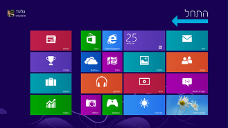
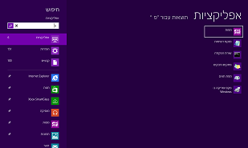
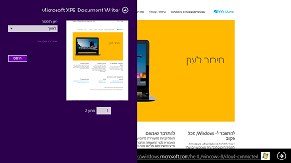
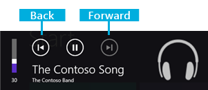
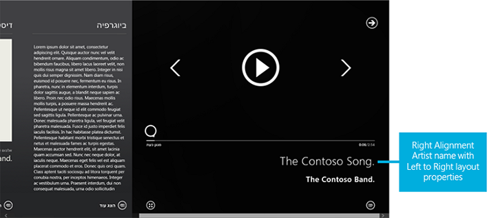
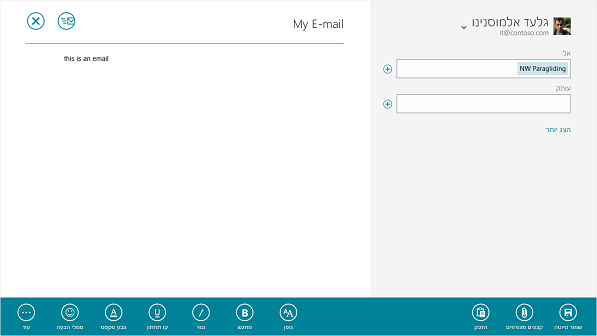

# Design your app for bidirectional text

Design your app to provide bidirectional text support (BiDi) so that you can combine script from right to left (RTL) and left to right (LTR) writing systems, which generally contain different types of alphabets.

Right-to-left writing systems, such as those used in the Middle East, Central and South Asia, and in Africa, have unique design requirements. These writing systems require bidirectional text support (BiDi). BiDi support is the ability to input and display text layout in either right to left (RTL) or left to right (LTR) order.

A total of nine BiDi languages are included with Windows.
- Two fully localized languages. Arabic, and Hebrew.
- Seven Language Interface Packs for emerging markets. Persian, Urdu, Dari, Central Kurdish, Sindhi, Punjabi (Pakistan), and Uyghur.

This topic contains the Windows BiDi design philosophy, and case studies that show BiDi design considerations.

## Bidi design elements

Four elements influence BiDi design decisions in Windows.

- **User interface (UI) mirroring**. User interface (UI) flow allows right-to-left content to be presented in its native layout. UI design feels local to BiDi markets.
- **Consistency in user experience**. The design feels natural in right-to-left orientation. UI elements share a consistent layout direction and appear as the user expects them.
- **Touch optimization**. Similar to touch UI in non-mirrored UI, elements are easy to reach, and they natural to touch interaction.
- **Mixed text support**. Text directionality support enables great mixed text presentation (English text on BiDi builds, and vice versa).

## Feature design overview

Windows supports the four BiDi design elements. Let's look at some of the major relevant features in Windows, and provide some context around how they affect your app.

### Navigate in the direction that feels natural

Windows adjusts the direction of the typographic grid so that it flows from right to left, meaning that the first tile on the grid is placed at the top right corner, and the last tile at the bottom left. This matches the RTL pattern of printed publications such as books and magazines, where the reading pattern always starts at the top right corner and progresses to the left.




To preserve a consistent UI flow, content on tiles retain a right-to-left layout, meaning that the app name and logo are positioned at the bottom right corner of the tile regardless of the app UI language.

#### BiDi tile


#### English tile


### Get tile notifications that read correctly

Tiles have mixed text support. The notification region has built-in flexibility to adjust the text alignment based on the notification language.  When an app sends Arabic, Hebrew, or other BiDi language notifications, the text is aligned to the right. And when an English (or other LTR) notification arrives, it will align to the left.


### A consistent, easy-to-touch RTL user experience

Every element in the Windows UI fits into the RTL orientation. Charms and flyouts have been positioned on the left edge of the screen so that they don't overlap search results or degrade touch optimization. They can be easily reached with the thumbs.





### Text input in any direction

Windows offers an on-screen touch keyboard that is clean and clutter-free. For BiDi languages, there is a text direction control key so that the text input direction can be switched as needed.


### Use any app in any language

Install and use your favorite apps in any language. The apps appear and function as they would on non-BiDi versions of Windows. Elements within apps are always placed in a consistent and predictable position.


### Display parentheses correctly

With the introduction of the BiDi Parenthesis Algorithm (BPA), paired parentheses always display properly regardless of language or text alignment properties.

#### Incorrect parentheses


#### Correct parentheses


### Typography

Windows uses the Segoe UI font for all BiDi languages. This font is shaped and scaled for the Windows UI.


## Case study #1: A BiDi music app

### Overview

Multimedia apps make for a very interesting design challenge, because media controls are generally expected to have a left-to-right layout similar to that of non-BiDi languages.




### Establishing UI directionality

Retaining the right-to-left UI flow is important for consistent design for BiDi markets. Adding elements that have left-to-right flow within this context is difficult, because some navigational elements such as the back button may contradict the directional orientation of the back button in the audio controls.


This music app retains a right-to-left-oriented grid. This gives the app a very natural feel for users who already navigate in this direction across the Windows UI. The flow is retained by ensuring that the main elements are not just ordered from right to left, but also aligned properly in the section headers to help maintain the UI flow.


### Text handling

The artist bio in the screenshot above is left-aligned, while other artist-related text pieces such as album and track names preserve right alignment. The bio field is a fairly large text element, which reads poorly when aligned to the right simply because it's hard to track between the lines while reading a wider text block. In general, any text element with more than two or three lines containing five or more words should be considered for similar alignment exceptions, where the text block alignment is opposite to that of the overall app directional layout.

Manipulating the alignment across the app can look simple, but it often exposes some of the boundaries and limitations of the rendering engines in terms of neutral character placement across BiDi strings. For example, the following string can display differently based on alignment.

| | English String (LTR) | Hebrew String (RTL) |
| -------------- | ------------------- | ------------------- |
| **Left-alignment** | Hello, World! | בוקר טוב! |
| **Right-alignment** | !Hello, World | !בוקר טוב |

To ensure that artist information is properly displayed across the music app, the development team separated text layout properties from alignment. In other words, the artist info might be displayed as right-aligned in many of the cases, but the string layout adjustment is set based on customized background processing. The background processing determines the best directional layout setting based on the content of the string.



For example, without custom string layout processing, the artist name "The Contoso Band." would appear as ".The Contoso Band".

### Specialized string direction preprocessing

When the app contacts the server for media metadata, it preprocesses each string prior to displaying it to the user. During this preprocessing, the app also does a transformation to make the text direction consistent. To do this, it checks whether there are neutral characters on the ends of the string. Also, if the text direction of the string is opposite to the app direction set by the Windows language settings, then it appends (and sometimes prepends) Unicode direction markers. The transformation function looks like this.

```csharp
string NormalizeTextDirection(string data) 
{
    if (data.Length > 0) {
        var lastCharacterDirection = DetectCharacterDirection(data[data.Length - 1]);

        // If the last character has strong directionality (direction is not null), then the text direction for the string is already consistent.
        if (!lastCharacterDirection) {
            // If the last character has no directionality (neutral character, direction is null), then we may need to add a direction marker to
            // ensure that the last character doesn't inherit directionality from the outside context.
            var appTextDirection = GetAppTextDirection(); // checks the <html> element's "dir" attribute.
            var dataTextDirection = DetectStringDirection(data); // Run through the string until a non-neutral character is encountered,
                                                                 // which determines the text direction.

            if (appTextDirection != dataTextDirection) {
                // Add a direction marker only if the data text runs opposite to the directionality of the app as a whole,
                // which would cause the neutral characters at the ends to flip.
                var directionMarkerCharacter =
                    dataTextDirection == TextDirections.RightToLeft ?
                        UnicodeDirectionMarkers.RightToLeftDirectionMarker : // "\u200F"
                        UnicodeDirectionMarkers.LeftToRightDirectionMarker; // "\u200E"

                data += directionMarkerCharacter;

                // Prepend the direction marker if the data text begins with a neutral character.
                var firstCharacterDirection = DetectCharacterDirection(data[0]);
                if (!firstCharacterDirection) {
                    data = directionMarkerCharacter + data;
                }
            }
        }
    }

    return data;
}
```

The added Unicode characters are zero-width, so they don't impact the spacing of the strings. This code carries a potential performance penalty, since detecting the direction of a string requires running through the string until a non-neutral character is encountered. Each character that's checked for neutrality is first compared against several Unicode ranges as well, so it isn't a trivial check.

## Case study #2: A BiDi mail app

### Overview

In terms of UI layout requirements, a mail client is fairly simple to design. The Mail app in Windows is mirrored by default. From a text-handling perspective the mail app is required to have more robust text display and composition capabilities in order to accommodate mixed text scenarios.

### Establishing UI directionality

The UI layout for the Mail app is mirrored. The three panes have been reoriented so that the folder pane is positioned on the right edge of the screen, followed by the mail item list pane to the left, and then the email composition pane.


Additional items have been reoriented to match the overall UI flow, and touch optimization. These include the app bar and the compose, reply, and delete icons.



### Text Handling

#### UI

Text alignment across the UI is usually right-aligned. This includes the folder pane and items pane. The item pane is limited to two lines of text (Address, and Title). This is important for retaining the right-to-left alignment, without introducing a block of text that would be difficult to read when the content direction is opposite to the UI direction flow.

#### Text Editing

Text editing requires the ability to compose in both right-to-left and left-to-right form. In addition, the composition layout must be preserved by using a format&mdash;such as rich text&mdash;that has the ability to save directional information.


