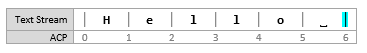
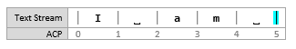

# Custom text input

The core text APIs in the [**Windows.UI.Text.Core**](/uwp/api/Windows.UI.Text.Core) namespace enable a Windows app to receive text input from any text service supported on Windows devices. The APIs are similar to the [Text Services Framework](/windows/desktop/TSF/text-services-framework) APIs in that the app is not required to have detailed knowledge of the text services. This enables the app to receive text in any language and from any input type, like keyboard, speech, or pen.

> **Important APIs**: [**Windows.UI.Text.Core**](/uwp/api/Windows.UI.Text.Core), [**CoreTextEditContext**](/uwp/api/Windows.UI.Text.Core.CoreTextEditContext)

## Why use core text APIs?

For many apps, the XAML or HTML text box controls are sufficient for text input and editing. However, if your app handles complex text scenarios, like a word processing app, you might need the flexibility of a custom text edit control. You could use the [**CoreWindow**](/uwp/api/Windows.UI.Core.CoreWindow) keyboard APIs to create your text edit control, but these don't provide a way to receive composition-based text input, which is required to support East Asian languages.

Instead, use the [**Windows.UI.Text.Core**](/uwp/api/Windows.UI.Text.Core) APIs when you need to create a custom text edit control. These APIs are designed to give you a lot of flexibility in processing text input, in any language, and let you provide the text experience best suited to your app. Text input and edit controls built with the core text APIs can receive text input from all existing text input methods on Windows devices, from [Text Services Framework](/windows/desktop/TSF/text-services-framework) based Input Method Editors (IMEs) and handwriting on PCs to the WordFlow keyboard (which provides auto-correction, prediction, and dictation) on mobile devices.

## Architecture

The following is a simple representation of the text input system.

-   "Application" represents a Windows app hosting a custom edit control built using the core text APIs.
-   The [**Windows.UI.Text.Core**](/uwp/api/Windows.UI.Text.Core) APIs facilitate the communication with text services through Windows. Communication between the text edit control and the text services is handled primarily through a [**CoreTextEditContext**](/uwp/api/Windows.UI.Text.Core.CoreTextEditContext) object that provides the methods and events to facilitate the communication.

## Text ranges and selection

Edit controls provide space for text entry and users expect to edit text anywhere in this space. Here, we explain the text positioning system used by the core text APIs and how ranges and selections are represented in this system.

### Application caret position

Text ranges used with the core text APIs are expressed in terms of caret positions. An "Application Caret Position (ACP)" is a zero-based number that indicates the count of characters from the start of the text stream immediately before the caret, as shown here.

### Text ranges and selection

Text ranges and selections are represented by the [**CoreTextRange**](/uwp/api/Windows.UI.Text.Core.CoreTextRange) structure which contains two fields:

| Field                  | Data type                                                                 | Description                                                                      |
|------------------------|---------------------------------------------------------------------------|----------------------------------------------------------------------------------|
| **StartCaretPosition** | **Number** \[JavaScript\] | **System.Int32** \[.NET\] | **int32** \[C++\] | The start position of a range is the ACP immediately before the first character. |
| **EndCaretPosition**   | **Number** \[JavaScript\] | **System.Int32** \[.NET\] | **int32** \[C++\] | The end position of a range is the ACP immediately after the last character.     |

 

For example, in the text range shown previously, the range \[0, 5\] specifies the word "Hello". **StartCaretPosition** must always be less than or equal to the **EndCaretPosition**. The range \[5, 0\] is invalid.

### Insertion point

The current caret position, frequently referred to as the insertion point, is represented by setting the **StartCaretPosition** to be equal to the **EndCaretPosition**.

### Noncontiguous selection

Some edit controls support noncontiguous selections. For example, Microsoft Office apps support multiple arbitrary selections, and many source code editors support column selection. However, the core text APIs do not support noncontiguous selections. Edit controls must report only a single contiguous selection, most often the active sub-range of the noncontiguous selections.

For example, consider this text stream:

There are two selections: \[0, 1\] and \[6, 11\]. The edit control must report only one of them; either \[0, 1\] or \[6, 11\].

## Working with text

The [**CoreTextEditContext**](/uwp/api/Windows.UI.Text.Core.CoreTextEditContext) class enables text flow between Windows and edit controls through the [**TextUpdating**](/uwp/api/windows.ui.text.core.coretexteditcontext.textupdating) event, the [**TextRequested**](/uwp/api/windows.ui.text.core.coretexteditcontext.textrequested) event, and the [**NotifyTextChanged**](/uwp/api/windows.ui.text.core.coretexteditcontext.notifytextchanged) method.

Your edit control receives text through [**TextUpdating**](/uwp/api/windows.ui.text.core.coretexteditcontext.textupdating) events that are generated when users interact with text input methods like keyboards, speech, or IMEs.

When you change text in your edit control, for example, by pasting text into the control, you need to notify Windows by calling [**NotifyTextChanged**](/uwp/api/windows.ui.text.core.coretexteditcontext.notifytextchanged).

If the text service requires the new text, then a [**TextRequested**](/uwp/api/windows.ui.text.core.coretexteditcontext.textrequested) event is raised. You must provide the new text in the **TextRequested** event handler.

### Accepting text updates

Your edit control should typically accept text update requests because they represent the text the user wants to enter. In the [**TextUpdating**](/uwp/api/windows.ui.text.core.coretexteditcontext.textupdating) event handler, these actions are expected of your edit control:

1.  Insert the text specified in [**CoreTextTextUpdatingEventArgs.Text**](/uwp/api/windows.ui.text.core.coretexttextupdatingeventargs.text) in the position specified in [**CoreTextTextUpdatingEventArgs.Range**](/uwp/api/windows.ui.text.core.coretexttextupdatingeventargs.range).
2.  Place selection at the position specified in [**CoreTextTextUpdatingEventArgs.NewSelection**](/uwp/api/windows.ui.text.core.coretexttextupdatingeventargs.newselection).
3.  Notify the system that the update succeeded by setting [**CoreTextTextUpdatingEventArgs.Result**](/uwp/api/windows.ui.text.core.coretexttextupdatingeventargs.result) to [**CoreTextTextUpdatingResult.Succeeded**](/uwp/api/Windows.UI.Text.Core.CoreTextTextUpdatingResult).

For example, this is the state of an edit control before the user types "d". The insertion point is at \[10, 10\].

When the user types "d", a [**TextUpdating**](/uwp/api/windows.ui.text.core.coretexteditcontext.textupdating) event is raised with the following [**CoreTextTextUpdatingEventArgs**](/uwp/api/Windows.UI.Text.Core.CoreTextTextUpdatingEventArgs) data:

-   [**Range**](/uwp/api/windows.ui.text.core.coretexttextupdatingeventargs.range) = \[10, 10\]
-   [**Text**](/uwp/api/windows.ui.text.core.coretexttextupdatingeventargs.text) = "d"
-   [**NewSelection**](/uwp/api/windows.ui.text.core.coretexttextupdatingeventargs.newselection) = \[11, 11\]

In your edit control, apply the specified changes and set [**Result**](/uwp/api/windows.ui.text.core.coretexttextupdatingeventargs.result) to **Succeeded**. Here's the state of the control after the changes are applied.

### Rejecting text updates

Sometimes, you cannot apply text updates because the requested range is in an area of the edit control that should not be changed. In this case, you should not apply any changes. Instead, notify the system that the update failed by setting [**CoreTextTextUpdatingEventArgs.Result**](/uwp/api/windows.ui.text.core.coretexttextupdatingeventargs.result) to [**CoreTextTextUpdatingResult.Failed**](/uwp/api/Windows.UI.Text.Core.CoreTextTextUpdatingResult).

For example, consider an edit control that accepts only an e-mail address. Spaces should be rejected because e-mail addresses cannot contain spaces, so when [**TextUpdating**](/uwp/api/windows.ui.text.core.coretexteditcontext.textupdating) events are raised for the space key, you should simply set [**Result**](/uwp/api/windows.ui.text.core.coretexttextupdatingeventargs.result) to **Failed** in your edit control.

### Notifying text changes

Sometimes, your edit control makes changes to text such as when text is pasted or auto-corrected. In these cases, you must notify the text services of these changes by calling the [**NotifyTextChanged**](/uwp/api/windows.ui.text.core.coretexteditcontext.notifytextchanged) method.

For example, this is the state of an edit control before the user pastes "World". The insertion point is at \[6, 6\].

The user performs the paste action and the edit control ends up with the following text:

When this happens, you should call [**NotifyTextChanged**](/uwp/api/windows.ui.text.core.coretexteditcontext.notifytextchanged) with these arguments:

-   *modifiedRange* = \[6, 6\]
-   *newLength* = 5
-   *newSelection* = \[11, 11\]

One or more [**TextRequested**](/uwp/api/windows.ui.text.core.coretexteditcontext.textrequested) events will follow, which you handle to update the text that the text services are working with.

### Overriding text updates

In your edit control, you might want to override a text update to provide auto-correction features.

For example, consider an edit control that provides a correction feature that formalizes contractions. This is the state of the edit control before the user types the space key to trigger the correction. The insertion point is at \[3, 3\].

The user presses the space key and a corresponding [**TextUpdating**](/uwp/api/windows.ui.text.core.coretexteditcontext.textupdating) event is raised. The edit control accepts the text update. This is the state of the edit control for a brief moment before the correction is completed. The insertion point is at \[4, 4\].

Outside of the [**TextUpdating**](/uwp/api/windows.ui.text.core.coretexteditcontext.textupdating) event handler, the edit control makes the following correction. This is the state of the edit control after the correction is complete. The insertion point is at \[5, 5\].

When this happens, you should call [**NotifyTextChanged**](/uwp/api/windows.ui.text.core.coretexteditcontext.notifytextchanged) with these arguments:

-   *modifiedRange* = \[1, 2\]
-   *newLength* = 2
-   *newSelection* = \[5, 5\]

One or more [**TextRequested**](/uwp/api/windows.ui.text.core.coretexteditcontext.textrequested) events will follow, which you handle to update the text that the text services are working with.

### Providing requested text

It's important for text services to have the correct text to provide features like auto-correction or prediction, especially for text that already existed in the edit control, from loading a document, for example, or text that is inserted by the edit control as explained in previous sections. Therefore, whenever a [**TextRequested**](/uwp/api/windows.ui.text.core.coretexteditcontext.textrequested) event is raised, you must provide the text currently in your edit control for the specified range.

There will be times the [**Range**](/uwp/api/windows.ui.text.core.coretexttextrequest.range) in [**CoreTextTextRequest**](/uwp/api/Windows.UI.Text.Core.CoreTextTextRequest) specifies a range that your edit control cannot accommodate as-is. For example, the **Range** is larger than the size of the edit control at the time of the [**TextRequested**](/uwp/api/windows.ui.text.core.coretexteditcontext.textrequested) event, or the end of the **Range** is out of bounds. In these cases, you should return whatever range makes sense, which is typically a subset of the requested range.

## Related articles

### Samples

- [Custom Edit Control sample](https://github.com/Microsoft/Windows-universal-samples/tree/master/Samples/CustomEditControl)

### Archive samples

- [XAML text editing sample](https://github.com/microsoftarchive/msdn-code-gallery-microsoft/tree/411c271e537727d737a53fa2cbe99eaecac00cc0/Official%20Windows%20Platform%20Sample/Windows%208%20app%20samples/%5BVB%5D-Windows%208%20app%20samples/VB/Windows%208%20app%20samples/XAML%20text%20editing%20sample%20(Windows%208))