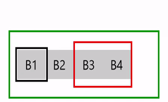
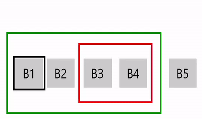
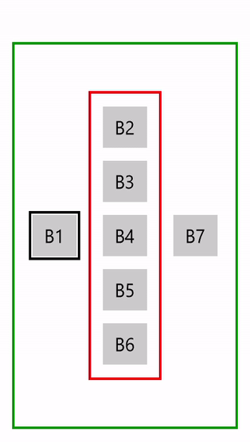
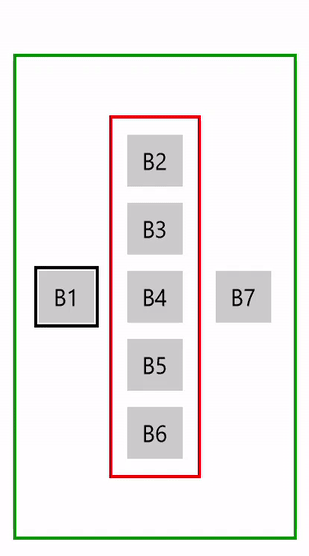
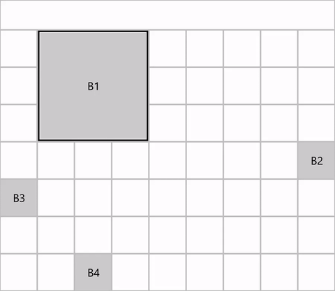

# Focus navigation for keyboard, gamepad, remote control, and accessibility tools


Use focus navigation to provide comprehensive and consistent interaction experiences in your Windows apps and custom controls for keyboard power users, those with disabilities and other accessibility requirements, as well as the 10-foot experience of television screens and the Xbox One.

## Overview

Focus navigation refers to the underlying mechanism that enables users to navigate and interact with the UI of a Windows application using a keyboard, gamepad, or remote control.

> [!NOTE]
> Input devices are typically classified as pointing devices, such as touch, touchpad, pen, and mouse, and non-pointing devices, such as keyboard, gamepad, and remote control.

This topic describes how to optimize a Windows application and build custom interaction experiences for users that rely on non-pointing input types. 

Even though we focus on keyboard input for custom controls in Windows apps on PCs, a well-designed keyboard experience is also important for software keyboards such as the touch keyboard and the On-Screen Keyboard (OSK), supporting accessibility tools such as Windows Narrator, and supporting the 10-foot experience.

See [Handle pointer input](handle-pointer-input.md) for guidance on building custom experiences in Windows applications for pointing devices.

For more general information on building apps and experiences for keyboard, see [Keyboard Interaction](keyboard-interactions.md).

## General guidance

Only those UI elements that require user interaction should support focus navigation, elements that don’t require an action, such as static images, do not need keyboard focus. Screen readers and similar accessibility tools still announce these static elements, even when they are not included in focus navigation. 

It is important to remember that unlike navigating with a pointer device such as a mouse or touch, focus navigation is linear. When implementing focus navigation, consider how a user will interact with your application and what the logical navigation should be. In most cases, we recommend custom focus navigation behavior follows the preferred reading pattern of the user's culture.

Some other focus navigation considerations include:

- Are controls grouped logically?
- Are there groups of controls with greater importance?
  - If yes, do those groups contain sub-groups?
- Does the layout require custom directional navigation (arrow keys) and tab order?

The [Engineering Software for Accessibility](https://www.microsoft.com/download/details.aspx?id=19262) eBook has an excellent chapter on *Designing the Logical Hierarchy*.

## 2D directional navigation for keyboard

The 2D inner navigation region of a control, or control group, is referred to as its "directional area". When focus shifts to this object, the keyboard arrow keys (left, right, up, and down) can be used to navigate between child elements within the directional area.


*2D Inner navigation region, or directional area, of a control group*

You can use the [XYFocusKeyboardNavigation](/uwp/api/windows.ui.xaml.uielement#Windows_UI_Xaml_UIElement_XYFocusKeyboardNavigation) property (which has possible values of [Auto](/uwp/api/windows.ui.xaml.input.xyfocuskeyboardnavigationmode), [Enabled](/uwp/api/windows.ui.xaml.input.xyfocuskeyboardnavigationmode), or [Disabled](/uwp/api/windows.ui.xaml.input.xyfocuskeyboardnavigationmode)) to manage 2D inner navigation with the keyboard arrow keys.

> [!NOTE]
> Tab order is not affected by this property. To avoid a confusing navigation experience, we recommend that child elements of a directional area *not* be explicitly specified in the tab navigation order of your application. See the [UIElement.TabFocusNavigation](/uwp/api/windows.ui.xaml.uielement#Windows_UI_Xaml_UIElement_TabFocusNavigation) and [TabIndex](/uwp/api/windows.ui.xaml.controls.control#Windows_UI_Xaml_Controls_Control_TabIndex) properties for more detail on tabbing behavior for an element.

### [Auto](/uwp/api/windows.ui.xaml.input.xyfocuskeyboardnavigationmode) (default behavior)

When set to Auto, directional navigation behavior is determined by the element’s ancestry, or inheritance hierarchy. If all ancestors are in default mode (set to **Auto**), directional navigation with the keyboard is *not* supported.

### [Disabled](/uwp/api/windows.ui.xaml.input.xyfocuskeyboardnavigationmode)

Set **XYFocusKeyboardNavigation** to **Disabled** to block directional navigation to the control and its child elements.


*XYFocusKeyboardNavigation disabled behavior*

In this example, the primary [StackPanel](/uwp/api/Windows.UI.Xaml.Controls.StackPanel) (ContainerPrimary) has **XYFocusKeyboardNavigation** set to **Enabled**. All child elements inherit this setting, and can be navigated to with the arrow keys. However, the B3 and B4 elements are in a secondary [StackPanel](/uwp/api/Windows.UI.Xaml.Controls.StackPanel) (ContainerSecondary) with **XYFocusKeyboardNavigation** set to **Disabled**, which overrides the primary container and disables arrow key navigation to itself and between its child elements.

```XAML
<Grid 
    Background="{ThemeResource ApplicationPageBackgroundThemeBrush}" 
    TabFocusNavigation="Cycle">
    <Grid.RowDefinitions>
        <RowDefinition Height="40"/>
        <RowDefinition Height="75"/>
        <RowDefinition Height="*"/>
    </Grid.RowDefinitions>
    <TextBlock Name="KeyPressed"
                Grid.Row="0" 
                FontWeight="ExtraBold" 
                HorizontalTextAlignment="Center"
                TextWrapping="Wrap" 
                Padding="10" />
    <StackPanel Name="ContainerPrimary" 
                XYFocusKeyboardNavigation="Enabled" 
                KeyDown="ContainerPrimary_KeyDown" 
                Orientation="Horizontal" 
                BorderBrush="Green" 
                BorderThickness="2" 
                Grid.Row="1" 
                Padding="10" 
                MaxWidth="200">
        <Button Name="B1" 
                Content="B1" 
                GettingFocus="Btn_GettingFocus" />
        <Button Name="B2" 
                Content="B2" 
                GettingFocus="Btn_GettingFocus" />
        <StackPanel Name="ContainerSecondary" 
                    XYFocusKeyboardNavigation="Disabled" 
                    Orientation="Horizontal" 
                    BorderBrush="Red" 
                    BorderThickness="2">
            <Button Name="B3" 
                    Content="B3" 
                    GettingFocus="Btn_GettingFocus" />
            <Button Name="B4" 
                    Content="B4" 
                    GettingFocus="Btn_GettingFocus" />
        </StackPanel>
    </StackPanel>
</Grid>
```

### [Enabled](/uwp/api/windows.ui.xaml.input.xyfocuskeyboardnavigationmode)

Set **XYFocusKeyboardNavigation** to **Enabled** to support 2D directional navigation to a control and each of its [UIElement](/uwp/api/Windows.UI.Xaml.UIElement) child objects.

When set, navigation with the arrow keys is restricted to elements within the directional area. Tab navigation is not affected, as all controls remain accessible through their tab order hierarchy.


*XYFocusKeyboardNavigation enabled behavior*

In this example, the primary [StackPanel](/uwp/api/Windows.UI.Xaml.Controls.StackPanel) (ContainerPrimary) has **XYFocusKeyboardNavigation** set to **Enabled**. All child elements inherit this setting, and can be navigated to with the arrow keys. The B3 and B4 elements are in a secondary [StackPanel](/uwp/api/Windows.UI.Xaml.Controls.StackPanel) (ContainerSecondary) where **XYFocusKeyboardNavigation** is not set, which then inherits the primary container setting. The B5 element is not within a declared directional area, and does not support arrow key navigation but does support standard tab navigation behavior.

```xaml
<Grid
    Background="{ThemeResource ApplicationPageBackgroundThemeBrush}"
    TabFocusNavigation="Cycle">
    <Grid.RowDefinitions>
        <RowDefinition Height="40"/>
        <RowDefinition Height="100"/>
        <RowDefinition Height="*"/>
    </Grid.RowDefinitions>
    <TextBlock Name="KeyPressed"
               Grid.Row="0"
               FontWeight="ExtraBold"
               HorizontalTextAlignment="Center"
               TextWrapping="Wrap"
               Padding="10" />
    <StackPanel Grid.Row="1"
                Orientation="Horizontal"
                HorizontalAlignment="Center">
        <StackPanel Name="ContainerPrimary"
                    XYFocusKeyboardNavigation="Enabled"
                    KeyDown="ContainerPrimary_KeyDown"
                    Orientation="Horizontal"
                    BorderBrush="Green"
                    BorderThickness="2"
                    Padding="5" Margin="5">
            <Button Name="B1"
                    Content="B1"
                    GettingFocus="Btn_GettingFocus" Margin="5" />
            <Button Name="B2"
                    Content="B2"
                    GettingFocus="Btn_GettingFocus" />
            <StackPanel Name="ContainerSecondary"
                        Orientation="Horizontal"
                        BorderBrush="Red"
                        BorderThickness="2"
                        Margin="5">
                <Button Name="B3"
                        Content="B3"
                        GettingFocus="Btn_GettingFocus"
                        Margin="5" />
                <Button Name="B4"
                        Content="B4"
                        GettingFocus="Btn_GettingFocus"
                        Margin="5" />
            </StackPanel>
        </StackPanel>
        <Button Name="B5"
                Content="B5"
                GettingFocus="Btn_GettingFocus"
                Margin="5" />
    </StackPanel>
</Grid>
```

You can have multiple levels of nested directional areas. If all parent elements have XYFocusKeyboardNavigation set to Enabled, inner navigation region boundaries are ignored.

Here's an example of two nested directional areas within an element that does not explicitly support 2D directional navigation. In this case, directional navigation is not supported between the two nested areas.


*XYFocusKeyboardNavigation enabled and nested behavior*

Here’s a more complex example of three nested directional areas where:

-   When B1 has focus, only B5 can be navigated to (and vice versa) because there is a directional area boundary where XYFocusKeyboardNavigation set to Disabled, making B2, B3, and B4 unreachable with the arrow keys
-   When B2 has focus, only B3 can be navigated to (and vice versa) because the directional area boundary prevents arrow key navigation to B1, B4, and B5
-   When B4 has focus, the Tab key must be used to navigate between controls


*XYFocusKeyboardNavigation enabled and complex nested behavior*

## Tab navigation

While the arrow keys can be used for 2D directional navigation witin a control, or control group, the Tab key can be used to navigate between all controls in a Windows application. 

All interactive controls support Tab key navigation by default ([IsEnabled](/uwp/api/windows.ui.xaml.controls.control#Windows_UI_Xaml_Controls_Control_IsEnabled) and [IsTabStop](/uwp/api/Windows.UI.Xaml.Controls.Control#Windows_UI_Xaml_Controls_Control_IsTabStop) property are **true**), with the logical tab order derived from the control layout in your application. However, the default order does not necessarily correspond to the visual order. The actual display position might depend on the parent layout container and certain properties that you can set on the child elements to influence the layout.

Avoid a custom tab order that makes the focus jump around in your application. For example, a list of controls in a form should have a tab order that flows from top to bottom and left to right (depending on locale).

In this section we describe how this tab order can be fully customized to suit your app.

### Set the tab navigation behavior

The [TabFocusNavigation](/uwp/api/Windows.UI.Xaml.UIElement#Windows_UI_Xaml_UIElement_TabFocusNavigation)
property of [UIElement](/uwp/api/Windows.UI.Xaml.UIElement) specifies the tab navigation behavior for its entire object tree (or directional area).

> [!NOTE]
> Use this property instead of the [Control.TabNavigation](/uwp/api/windows.ui.xaml.controls.control#Windows_UI_Xaml_Controls_Control_TabNavigation) property for objects that do not use a [ControlTemplate](/uwp/api/windows.ui.xaml.controls.controltemplate) to define their appearance.

As we mentioned in the previous section, to avoid a confusing navigation experience, we recommend that child elements of a directional area *not* be explicitly specified in the tab navigation order of your application. See the [UIElement.TabFocusNavigation](/uwp/api/windows.ui.xaml.uielement#Windows_UI_Xaml_UIElement_TabFocusNavigation) and the [TabIndex](/uwp/api/windows.ui.xaml.controls.control#Windows_UI_Xaml_Controls_Control_TabIndex) properties for more detail on tabbing behavior for an element.   
> For versions older than Windows 10 Creators Update (build 10.0.15063), tab settings were limited to [ControlTemplate](/uwp/api/windows.ui.xaml.controls.controltemplate) objects. For more info, see [Control.TabNavigation](/uwp/api/windows.ui.xaml.controls.control#Windows_UI_Xaml_Controls_Control_TabNavigation).

[TabFocusNavigation](/uwp/api/windows.ui.xaml.uielement#Windows_UI_Xaml_UIElement_TabFocusNavigation)
has a value of type [KeyboardNavigationMode](/uwp/api/windows.ui.xaml.input.keyboardnavigationmode) with the following possible values (note that these examples are not custom control groups and do not require inner navigation with the arrow keys):

- **Local** (default)	
  Tab indexes are recognized on the local subtree inside the container. For this example, the tab order is B1, B2, B3, B4, B5, B6, B7, B1.

   

   *"Local" tab navigation behavior*

- **Once**	
  The container and all child elements receive focus once. For this example, the tab order is B1, B2, B7, B1 (inner navigation with arrow key is also demonstrated).

   

   *"Once" tab navigation behavior*

- **Cycle**	  
  Focus cycles back to the initial focusable element inside a container. For this example, the tab order is B1, B2, B3, B4, B5, B6, B2...

   

   *"Cycle" tab navigation behavior*

Here's the code for the preceding examples (with TabFocusNavigation ="Cycle").

```XAML
<Grid 
    Background="{ThemeResource ApplicationPageBackgroundThemeBrush}" 
    TabFocusNavigation="Cycle">
    <Grid.RowDefinitions>
        <RowDefinition Height="40"/>
        <RowDefinition Height="300"/>
        <RowDefinition Height="*"/>
    </Grid.RowDefinitions>
    <TextBlock Name="KeyPressed"
               Grid.Row="0" 
               FontWeight="ExtraBold" 
               HorizontalTextAlignment="Center"
               TextWrapping="Wrap" 
               Padding="10" />
    <StackPanel Name="ContainerPrimary"
                KeyDown="Container_KeyDown" 
                Orientation="Horizontal" 
                HorizontalAlignment="Center"
                BorderBrush="Green" 
                BorderThickness="2" 
                Grid.Row="1" 
                Padding="10" 
                MaxWidth="200">
        <Button Name="B1" 
                Content="B1" 
                GettingFocus="Btn_GettingFocus" 
                Margin="5"/>
        <StackPanel Name="ContainerSecondary" 
                    KeyDown="Container_KeyDown"
                    XYFocusKeyboardNavigation="Enabled" 
                    TabFocusNavigation ="Cycle"
                    Orientation="Vertical" 
                    VerticalAlignment="Center"
                    BorderBrush="Red" 
                    BorderThickness="2"
                    Padding="5" Margin="5">
            <Button Name="B2" 
                    Content="B2" 
                    GettingFocus="Btn_GettingFocus" 
                    Margin="5"/>
            <Button Name="B3" 
                    Content="B3" 
                    GettingFocus="Btn_GettingFocus" 
                    Margin="5"/>
            <Button Name="B4" 
                    Content="B4" 
                    GettingFocus="Btn_GettingFocus" 
                    Margin="5"/>
            <Button Name="B5" 
                    Content="B5" 
                    GettingFocus="Btn_GettingFocus" 
                    Margin="5"/>
            <Button Name="B6" 
                    Content="B6" 
                    GettingFocus="Btn_GettingFocus" 
                    Margin="5"/>
        </StackPanel>
        <Button Name="B7" 
                Content="B7" 
                GettingFocus="Btn_GettingFocus" 
                Margin="5"/>
    </StackPanel>
</Grid>
```

### [TabIndex](/uwp/api/windows.ui.xaml.controls.control#Windows_UI_Xaml_Controls_Control_TabIndex)

Use [TabIndex](/uwp/api/windows.ui.xaml.controls.control#Windows_UI_Xaml_Controls_Control_TabIndex) to specify the order in which elements receive focus when the user navigates through controls using the Tab key. A control with a lower tab index receives focus before a control with a higher index.

When a control has no [TabIndex](/uwp/api/Windows.UI.Xaml.Controls.Control#Windows_UI_Xaml_Controls_Control_TabIndex) specified, it is assigned a higher index value than the current highest index value (and the lowest priority) of all interactive controls in the visual tree, based on scope. 

All child elements of a control are considered a scope, and if one of these elements also has child elements, they are considered another scope. Any ambiguity is resolved by choosing the first element on the visual tree of the scope. 

To exclude a control from the tab order, set the [IsTabStop](/uwp/api/Windows.UI.Xaml.Controls.Control#Windows_UI_Xaml_Controls_Control_IsTabStop) property to **false**.

Override the default tab order by setting the [TabIndex](/uwp/api/Windows.UI.Xaml.Controls.Control#Windows_UI_Xaml_Controls_Control_TabIndex) property.

> [!NOTE] 
> [TabIndex](/uwp/api/Windows.UI.Xaml.Controls.Control#Windows_UI_Xaml_Controls_Control_TabIndex) works the same way with both [UIElement.TabFocusNavigation](/uwp/api/windows.ui.xaml.uielement#Windows_UI_Xaml_UIElement_TabFocusNavigation) and [Control.TabNavigation](/uwp/api/windows.ui.xaml.controls.control#Windows_UI_Xaml_Controls_Control_TabNavigation).


Here, we show how focus navigation can be affected by the [TabIndex](/uwp/api/Windows.UI.Xaml.Controls.Control#Windows_UI_Xaml_Controls_Control_TabIndex) property on specific elements. 


*"Local" tab navigation with TabIndex behavior*

In the preceding example, there are two scopes: 
- B1, directional area (B2 - B6), and B7
- directional area (B2 - B6)

When B3 (in the directional area) gets focus, the scope changes and tab navigation transfers to the directional area where the best candidate for subsequent focus is identified. In this case, B2 followed by B4, B5, and B6. Scope then changes again, and focus moves to B1.

Here's the code for this example.

```xaml
<Grid
    Background="{ThemeResource ApplicationPageBackgroundThemeBrush}"
    TabFocusNavigation="Cycle">
    <Grid.RowDefinitions>
        <RowDefinition Height="40"/>
        <RowDefinition Height="300"/>
        <RowDefinition Height="*"/>
    </Grid.RowDefinitions>
    <TextBlock Name="KeyPressed"
               Grid.Row="0"
               FontWeight="ExtraBold"
               HorizontalTextAlignment="Center"
               TextWrapping="Wrap"
               Padding="10" />
    <StackPanel Name="ContainerPrimary"
                KeyDown="Container_KeyDown"
                Orientation="Horizontal"
                HorizontalAlignment="Center"
                BorderBrush="Green"
                BorderThickness="2"
                Grid.Row="1"
                Padding="10"
                MaxWidth="200">
        <Button Name="B1"
                Content="B1"
                TabIndex="1"
                ToolTipService.ToolTip="TabIndex = 1"
                GettingFocus="Btn_GettingFocus"
                Margin="5"/>
        <StackPanel Name="ContainerSecondary"
                    KeyDown="Container_KeyDown"
                    TabFocusNavigation ="Local"
                    Orientation="Vertical"
                    VerticalAlignment="Center"
                    BorderBrush="Red"
                    BorderThickness="2"
                    Padding="5" Margin="5">
            <Button Name="B2"
                    Content="B2"
                    GettingFocus="Btn_GettingFocus"
                    Margin="5"/>
            <Button Name="B3"
                    Content="B3"
                    TabIndex="3"
                    ToolTipService.ToolTip="TabIndex = 3"
                    GettingFocus="Btn_GettingFocus"
                    Margin="5"/>
            <Button Name="B4"
                    Content="B4"
                    GettingFocus="Btn_GettingFocus"
                    Margin="5"/>
            <Button Name="B5"
                    Content="B5"
                    GettingFocus="Btn_GettingFocus"
                    Margin="5"/>
            <Button Name="B6"
                    Content="B6"
                    GettingFocus="Btn_GettingFocus"
                    Margin="5"/>
        </StackPanel>
        <Button Name="B7"
                Content="B7"
                TabIndex="2"
                ToolTipService.ToolTip="TabIndex = 2"
                GettingFocus="Btn_GettingFocus"
                Margin="5"/>
    </StackPanel>
</Grid>
```

## 2D directional navigation for keyboard, gamepad, and remote control

Non-pointer input types such as keyboard, gamepad, remote control, and accessibility tools like Windows Narrator, share a common, underlying mechanism for navigating and interacting with the UI of your Windows application.

In this section, we cover how to specify a preferred navigation strategy and fine tune focus navigation within your application through a set of navigation strategy properties that support all focus-based, non-pointer input types.

For more general information on building apps and experiences for Xbox/TV, see [Keyboard Interaction](keyboard-interactions.md), [Designing for Xbox and TV](../devices/designing-for-tv.md), and [Gamepad and remote control interactions](gamepad-and-remote-interactions.md).

### Navigation Strategies

> Navigation strategies are applicable to keyboard, gamepad, remote control, and various accessibility tools.

The following navigation strategy properties let you influence which control receives focus based on the arrow key, directional pad (D-pad) button, or similar pressed. 

-   XYFocusUpNavigationStrategy
-   XYFocusDownNavigationStrategy
-   XYFocusLeftNavigationStrategy
-   XYFocusRightNavigationStrategy

These properties have possible values of [Auto](/uwp/api/windows.ui.xaml.input.xyfocusnavigationstrategy) (default), [NavigationDirectionDistance](/uwp/api/windows.ui.xaml.input.xyfocusnavigationstrategy), [Projection](/uwp/api/windows.ui.xaml.input.xyfocusnavigationstrategy), or [RectilinearDistance ](/uwp/api/windows.ui.xaml.input.xyfocusnavigationstrategy).

If set to **Auto**, the behavior of the element is based on the ancestors of the element. If all elements are set to **Auto**, **Projection** is used.

> [!NOTE]
> Other factors, such as the previously focused element or proximity to the axis of the navigation direction, can influence the result.

### Projection

The Projection strategy moves focus to the first element encountered when the edge of the currently focused element is *projected* in the direction of navigation.

In this example, each focus navigation direction is set to Projection. Notice how focus moves down from B1 to B4, bypassing B3. This is because, B3 is not in the projection zone. Also notice how a focus candidate is not identified when moving left from B1. This is because the position of B2 relative to B1 eliminates B3 as a candidate. If B3 was in the same row as B2, it would be a viable candidate for left navigation. B2 is a viable candidate due to its unobstructed proximity to the axis of navigation direction.



*Projection navigation strategy*

### NavigationDirectionDistance

The NavigationDirectionDistance strategy moves focus to the element closest to the axis of the navigation direction.

The edge of the bounding rect corresponding to the navigation direction is *extended* and *projected* to identify candidate targets. The first element encountered is identified as the target. In the case of multiple candidates, the closest element is identified as the target. If there are still multiple candidates, the topmost/leftmost element is identified as the candidate.


*NavigationDirectionDistance navigation strategy*

### RectilinearDistance

The RectilinearDistance strategy moves focus to the closest element based on 2D rectilinear distance ([Taxicab geometry](https://en.wikipedia.org/wiki/Taxicab_geometry)).

The sum of the primary distance and the secondary distance to each potential candidate is used to identify the best candidtate. In a tie, the first element to the left is selected if the requested direction is up or down, and the first element to the top is selected if the requested direction is left or right.


*RectilinearDistance navigation strategy*

This image shows how, when B1 has focus and down is the requested direction, B3 is the RectilinearDistance focus candidate. This is based on the following calcualations for this example:
-   Distance (B1, B3, Down) is 10 + 0 = 10
-   Distance (B1, B2, Down) is 0 + 40 = 30
-   Distance (B1, D, Down) is 30 + 0 = 30


## Related articles
- [Programmatic focus navigation](focus-navigation-programmatic.md)
- [Keyboard interactions](keyboard-interactions.md)
- [Keyboard accessibility](../accessibility/keyboard-accessibility.md)