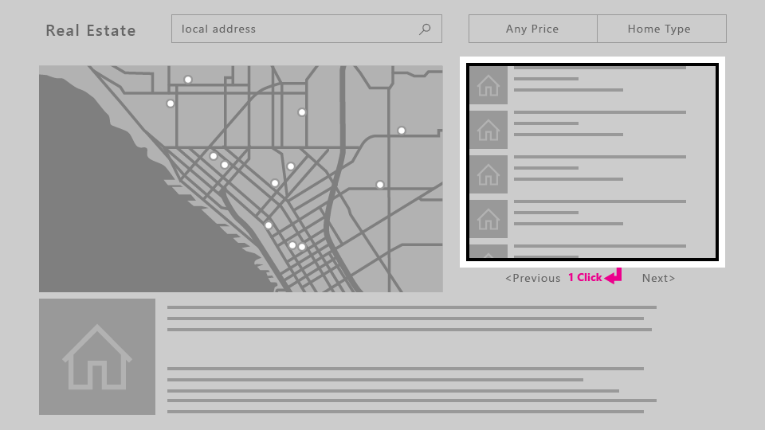
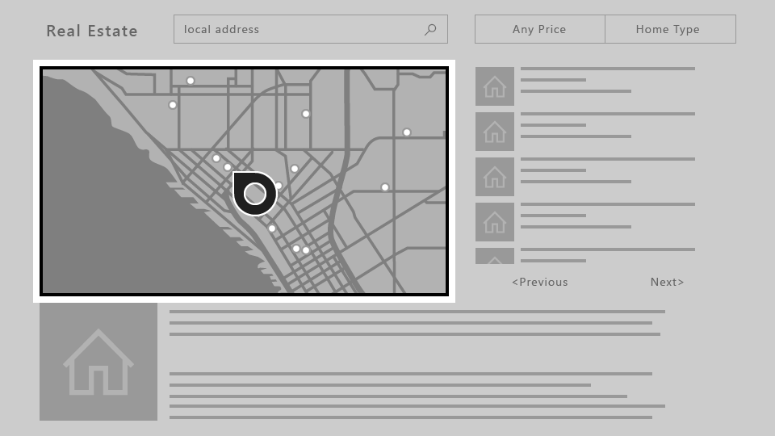

# Gamepad and remote control interactions


***Many interaction experiences are shared between gamepad, remote control, and keyboard***

Build interaction experiences in your Windows applications that ensure your app is usable and accessible through both the traditional input types of PCs, laptops, and tablets (mouse, keyboard, touch, and so on), as well as the input types typical of the TV and Xbox *10-foot* experience, such as the gamepad and remote control.

See [Designing for Xbox and TV](../devices/designing-for-tv.md) for general design guidance on Windows applications in the *10-foot* experience.

## Overview

In this topic, we discuss what you should consider in your interaction design (or what you don't, if the platform looks after it for you), and provide guidance, recommendations, and suggestions for building Windows applications that are enjoyable to use regardless of device, input type, or user abilities and preferences.

Bottom line, your application should be as intuitive and easy to use in the *2-foot* environment as it is in the *10-foot* environment (and vice versa). Support the user's preferred devices, make the UI focus clear and unmistakable, arrange content so navigation is consistent and predictable, and give users the shortest path possible to what they want to do.

> [!NOTE]
> Most of the code snippets in this topic are in XAML/C#; however, the principles and concepts apply to all Windows apps. If you're developing an HTML/JavaScript Windows app for Xbox, check out the excellent [TVHelpers](https://github.com/Microsoft/TVHelpers/wiki) library on GitHub.


## Optimize for both 2-foot and 10-foot experiences

At a minimum, we recommend that you test your applications to ensure they work well in both 2-foot and 10-foot scenarios, and that all functionality is discoverable and accessible to the Xbox [gamepad and remote-control](#gamepad-and-remote-control).

Here are some other ways you can optimize your app for use in both 2-foot and 10-foot experiences and with all input devices (each links to the appropriate section in this topic).

> [!NOTE]
> Because Xbox gamepads and remote controls support many Windows keyboard behaviors and experiences, these recommendations are appropriate for both input types. See [Keyboard interactions](keyboard-interactions.md) for more detailed keyboard info.

| Feature        | Description           |
| -------------------------------------------------------------- |--------------------------------|
| [XY focus navigation and interaction](#xy-focus-navigation-and-interaction) | **XY focus navigation** enables the user to navigate around your app's UI. However, this limits the user to navigating up, down, left, and right. Recommendations for dealing with this and other considerations are outlined in this section. |
| [Mouse mode](#mouse-mode)|XY focus navigation isn't practical, or even possible, for some types of applications, such as maps or drawing and painting apps. In these cases, **mouse mode** lets users navigate freely with a gamepad or remote control, just like a mouse on a PC.|
| [Focus visual](#focus-visual)  | The focus visual is a border that highlights the currently focused UI element. This helps the user quickly identify the UI they are navigating through or interacting with.  |
| [Focus engagement](#focus-engagement) | Focus engagement requires the user to press the **A/Select** button on a gamepad or remote control when a UI element has focus in order to interact with it. |
| [Hardware buttons](#hardware-buttons) | The gamepad and remote control provide very different buttons and configurations. |

## Gamepad and remote control

Just like keyboard and mouse are for PC, and touch is for phone and tablet, gamepad and remote control are the main input devices for the 10-foot experience.
This section introduces what the hardware buttons are and what they do.
In [XY focus navigation and interaction](#xy-focus-navigation-and-interaction) and [Mouse mode](#mouse-mode), you will learn how to optimize your app when using these input devices.

The quality of gamepad and remote behavior that you get out-of-the-box depends on how well keyboard is supported in your app. A good way to ensure that your app will work well with gamepad/remote is to make sure that it works well with keyboard on PC, and then test with gamepad/remote to find weak spots in your UI.

### Hardware buttons

Throughout this document, buttons will be referred to by the names given in the following diagram.


As you can see from the diagram, there are some buttons that are supported on gamepad that are not supported on remote control, and vice versa. While you can use buttons that are only supported on one input device to make navigating the UI faster, be aware that using them for critical interactions may create a situation where the user is unable to interact with certain parts of the UI.

The following table lists all of the hardware buttons supported by Windows apps, and which input device supports them.

| Button                    | Gamepad   | Remote control    |
|---------------------------|-----------|-------------------|
| A/Select button           | Yes       | Yes               |
| B/Back button             | Yes       | Yes               |
| Directional pad (D-pad)   | Yes       | Yes               |
| Menu button               | Yes       | Yes               |
| View button               | Yes       | Yes               |
| X and Y buttons           | Yes       | No                |
| Left stick                | Yes       | No                |
| Right stick               | Yes       | No                |
| Left and right triggers   | Yes       | No                |
| Left and right bumpers    | Yes       | No                |
| OneGuide button           | No        | Yes               |
| Volume button             | No        | Yes               |
| Channel button            | No        | Yes               |
| Media control buttons     | No        | Yes               |
| Mute button               | No        | Yes               |

### Built-in button support

UWP automatically maps existing keyboard input behavior to gamepad and remote control input. The following table lists these built-in mappings.

| Keyboard              | Gamepad/remote                        |
|-----------------------|---------------------------------------|
| Arrow keys            | D-pad (also left stick on gamepad)    |
| Spacebar              | A/Select button                       |
| Enter                 | A/Select button                       |
| Escape                | B/Back button*                        |

\*When neither the [KeyDown](/uwp/api/windows.ui.xaml.uielement.keydown) nor [KeyUp](/uwp/api/windows.ui.xaml.uielement.keyup) events for the B button are handled by the app, the [SystemNavigationManager.BackRequested](/uwp/api/windows.ui.core.systemnavigationmanager.backrequested) event will be fired, which should result in back navigation within the app. However, you have to implement this yourself, as in the following code snippet:

```csharp
// This code goes in the MainPage class

public MainPage()
{
    this.InitializeComponent();

    // Handling Page Back navigation behaviors
    SystemNavigationManager.GetForCurrentView().BackRequested +=
        SystemNavigationManager_BackRequested;
}

private void SystemNavigationManager_BackRequested(
    object sender,
    BackRequestedEventArgs e)
{
    if (!e.Handled)
    {
        e.Handled = this.BackRequested();
    }
}

public Frame AppFrame { get { return this.Frame; } }

private bool BackRequested()
{
    // Get a hold of the current frame so that we can inspect the app back stack
    if (this.AppFrame == null)
        return false;

    // Check to see if this is the top-most page on the app back stack
    if (this.AppFrame.CanGoBack)
    {
        // If not, set the event to handled and go back to the previous page in the
        // app.
        this.AppFrame.GoBack();
        return true;
    }
    return false;
}
```

> [!NOTE]
> If the B button is used to go back, then don't show a back button in the UI. If you're using a [Navigation view](../controls-and-patterns/navigationview.md), the back button will be hidden automatically. For more information about backwards navigation, see [Navigation history and backwards navigation for Windows apps](../basics/navigation-history-and-backwards-navigation.md).

Windows apps on Xbox One also support pressing the **Menu** button to open context menus. For more information, see [CommandBar and ContextFlyout](#commandbar-and-contextflyout).

### Accelerator support

Accelerator buttons are buttons that can be used to speed up navigation through a UI. However, these buttons may be unique to a certain input device, so keep in mind that not all users will be able to use these functions. In fact, gamepad is currently the only input device that supports accelerator functions for Windows apps on Xbox One.

The following table lists the accelerator support built into the UWP, as well as that which you can implement on your own. Utilize these behaviors in your custom UI to provide a consistent and friendly user experience.

| Interaction   | Keyboard/Mouse   | Gamepad      | Built-in for:  | Recommended for: |
|---------------|------------|--------------|----------------|------------------|
| Page up/down  | Page up/down | Left/right triggers | [CalendarView](/uwp/api/Windows.UI.Xaml.Controls.CalendarView), [ListBox](/uwp/api/Windows.UI.Xaml.Controls.ListBox), [ListViewBase](/uwp/api/Windows.UI.Xaml.Controls.ListViewBase), [ListView](/uwp/api/Windows.UI.Xaml.Controls.ListView), `ScrollViewer`, [Selector](/uwp/api/Windows.UI.Xaml.Controls.Primitives.Selector), [LoopingSelector](/uwp/api/Windows.UI.Xaml.Controls.Primitives.LoopingSelector), [ComboBox](/uwp/api/Windows.UI.Xaml.Controls.ComboBox), [FlipView](/uwp/api/Windows.UI.Xaml.Controls.FlipView) | Views that support vertical scrolling
| Page left/right | None | Left/right bumpers | [Pivot](/uwp/api/Windows.UI.Xaml.Controls.Pivot), [ListBox](/uwp/api/Windows.UI.Xaml.Controls.ListBox), [ListViewBase](/uwp/api/Windows.UI.Xaml.Controls.ListViewBase), [ListView](/uwp/api/Windows.UI.Xaml.Controls.ListView), `ScrollViewer`, [Selector](/uwp/api/Windows.UI.Xaml.Controls.Primitives.Selector), [LoopingSelector](/uwp/api/Windows.UI.Xaml.Controls.Primitives.LoopingSelector), [FlipView](/uwp/api/Windows.UI.Xaml.Controls.FlipView) | Views that support horizontal scrolling
| Zoom in/out        | Ctrl +/- | Left/right triggers | None | `ScrollViewer`, views that support zooming in and out |
| Open/close nav pane | None | View | None | Navigation panes |
| Search | None | Y button | None | Shortcut to the main search function in the app |
| [Open context menu](#commandbar-and-contextflyout) | Right-click | Menu button | [ContextFlyout](/uwp/api/Windows.UI.Xaml.UIElement.ContextFlyout) | Context menus |

## XY focus navigation and interaction

If your app supports proper focus navigation for keyboard, this will translate well to gamepad and remote control.
Navigation with the arrow keys is mapped to the **D-pad** (as well as the **left stick** on gamepad), and interaction with UI elements is mapped to the **Enter/Select** key
(see [Gamepad and remote control](#gamepad-and-remote-control)).

Many events and properties are used by both keyboard and gamepad&mdash;they both fire `KeyDown` and `KeyUp` events, and they both will only navigate to controls that have the properties `IsTabStop="True"` and `Visibility="Visible"`. For keyboard design guidance, see [Keyboard interactions](../input/keyboard-interactions.md).

If keyboard support is implemented properly, your app will work reasonably well; however, there may be some extra work required to support every scenario. Think about your app's specific needs to provide the best user experience possible.

> [!IMPORTANT]
> Mouse mode is enabled by default for Windows apps running on Xbox One. To disable mouse mode and enable XY focus navigation, set `Application.RequiresPointerMode=WhenRequested`.

### Debugging focus issues

The [FocusManager.GetFocusedElement](/uwp/api/windows.ui.xaml.input.focusmanager.getfocusedelement) method will tell you which element currently has focus. This is useful for situations where the location of the focus visual may not be obvious. You can log this information to the Visual Studio output window like so:

```csharp
page.GotFocus += (object sender, RoutedEventArgs e) =>
{
    FrameworkElement focus = FocusManager.GetFocusedElement() as FrameworkElement;
    if (focus != null)
    {
        Debug.WriteLine("got focus: " + focus.Name + " (" +
            focus.GetType().ToString() + ")");
    }
};
```

There are three common reasons why XY navigation might not work the way you expect:

* The [IsTabStop](/uwp/api/windows.ui.xaml.controls.control.istabstop) or [Visibility](/uwp/api/windows.ui.xaml.uielement.visibility) property is set wrong.
* The control getting focus is actually bigger than you think&mdash;XY navigation looks at the total size of the control ([ActualWidth](/uwp/api/windows.ui.xaml.frameworkelement.actualwidth) and [ActualHeight](/uwp/api/windows.ui.xaml.frameworkelement.actualheight)), not just the portion of the control that renders something interesting.
* One focusable control is on top of another&mdash;XY navigation doesn't support controls that are overlapped.

If XY navigation is still not working the way you expect after fixing these issues, you can manually point to the element that you want to get focus using the method described in [Overriding the default navigation](#overriding-the-default-navigation).

If XY navigation is working as intended but no focus visual is displayed, one of the following issues may be the cause:

* You re-templated the control and didn't include a focus visual. Set `UseSystemFocusVisuals="True"` or add a focus visual manually.
* You moved the focus by calling `Focus(FocusState.Pointer)`. The [FocusState](/uwp/api/Windows.UI.Xaml.FocusState) parameter controls what happens to the focus visual. Generally you should set this to `FocusState.Programmatic`, which keeps the focus visual visible if it was visible before, and hidden if it was hidden before.

The rest of this section goes into detail about common design challenges when using XY navigation, and offers several ways to solve them.

### Inaccessible UI

Because XY focus navigation limits the user to moving up, down, left, and right, you may end up with scenarios where parts of the UI are inaccessible.
The following diagram illustrates an example of the kind of UI layout that XY focus navigation doesn't support.
Note that the element in the middle is not accessible by using gamepad/remote because the vertical and horizontal navigation will be prioritized and the middle element will never be high enough priority to get focus.


If for some reason rearranging the UI is not possible, use one of the techniques discussed in the next section to override the default focus behavior.

### Overriding the default navigation

While the Universal Windows Platform tries to ensure that D-pad/left stick navigation makes sense to the user, it cannot guarantee behavior that is optimized for your app's intentions.
The best way to ensure that navigation is optimized for your app is to test it with a gamepad and confirm that every UI element can be accessed by the user in a manner that makes sense for your app's scenarios. In case your app's scenarios call for a behavior not achieved through the XY focus navigation provided, consider following the recommendations in the following sections and/or overriding the behavior to place the focus on a logical item.

The following code snippet shows how you might override the XY focus navigation behavior:

```xml
<StackPanel>
    <Button x:Name="MyBtnLeft"
            Content="Search" />
    <Button x:Name="MyBtnRight"
            Content="Delete"/>
    <Button x:Name="MyBtnTop"
            Content="Update" />
    <Button x:Name="MyBtnDown"
            Content="Undo" />
    <Button Content="Home"  
            XYFocusLeft="{x:Bind MyBtnLeft}"
            XYFocusRight="{x:Bind MyBtnRight}"
            XYFocusDown="{x:Bind MyBtnDown}"
            XYFocusUp="{x:Bind MyBtnTop}" />
</StackPanel>
```

In this case, when focus is on the `Home` button and the user navigates to the left, focus will move to the `MyBtnLeft` button; if the user navigates to the right, focus will move to the `MyBtnRight` button; and so on.

To prevent the focus from moving from a control in a certain direction, use the `XYFocus*` property to point it at the same control:

```xml
<Button Name="HomeButton"  
        Content="Home"  
        XYFocusLeft ="{x:Bind HomeButton}" />
```

Using these `XYFocus` properties, a control parent can also force the navigation of its children when the next focus candidate is out of its visual tree, unless the child who has the focus uses the same `XYFocus` property.

```xml
<StackPanel Orientation="Horizontal" Margin="300,300">
    <UserControl XYFocusRight="{x:Bind ButtonThree}">
        <StackPanel>
            <Button Content="One"/>
            <Button Content="Two"/>
        </StackPanel>
    </UserControl>
    <StackPanel>
        <Button x:Name="ButtonThree" Content="Three"/>
        <Button Content="Four"/>
    </StackPanel>
</StackPanel>
```

In the sample above, if the focus is on `Button` Two and the user navigates to the right, the best focus candidate is `Button` Four; however, the focus is moved to `Button` Three because the parent `UserControl` forces it to navigate there when it is out of its visual tree.

### Path of least clicks

Try to allow the user to perform the most common tasks in the least number of clicks. In the following example, the [TextBlock](/uwp/api/Windows.UI.Xaml.Controls.TextBlock) is placed between the **Play** button (which initially gets focus) and a commonly used element, so that an unnecessary element is placed in between priority tasks.


In the following example, the [TextBlock](/uwp/api/Windows.UI.Xaml.Controls.TextBlock) is placed above the **Play** button instead.
Simply rearranging the UI so that unnecessary elements are not placed in between priority tasks will greatly improve your app's usability.


### CommandBar and ContextFlyout

When using a [CommandBar](/uwp/api/Windows.UI.Xaml.Controls.CommandBar), keep in mind the issue of scrolling through a list as mentioned in [Problem: UI elements located after long scrolling list/grid](#problem-ui-elements-located-after-long-scrolling-list-grid). The following image shows a UI layout with the `CommandBar` on the bottom of a list/grid. The user would need to scroll all the way down through the list/grid to reach the `CommandBar`.


What if you put the `CommandBar` *above* the list/grid? While a user who scrolled down the list/grid would have to scroll back up to reach the `CommandBar`, it is slightly less navigation than the previous configuration. Note that this is assuming that your app's initial focus is placed next to or above the `CommandBar`; this approach won't work as well if the initial focus is below the list/grid. If these `CommandBar` items are global action items that don't have to be accessed very often (such as a **Sync** button), it may be acceptable to have them above the list/grid.

While you can't stack a `CommandBar`'s items vertically, placing them against the scroll direction (for example, to the left or right of a vertically scrolling list, or the top or bottom of a horizontally scrolling list) is another option you may want to consider if it works well for your UI layout.

If your app has a `CommandBar` whose items need to be readily accessible by users, you may want to consider placing these items inside a [ContextFlyout](/uwp/api/windows.ui.xaml.uielement.contextflyout) and removing them from the `CommandBar`. `ContextFlyout` is a property of [UIElement](/uwp/api/Windows.UI.Xaml.UIElement) and is the [context menu](../controls-and-patterns/dialogs-and-flyouts/index.md) associated with that element. On PC, when you right-click on an element with a `ContextFlyout`, that context menu will pop up. On Xbox One, this will happen when you press the **Menu** button while the focus is on such an element.

### UI layout challenges

Some UI layouts are more challenging due to the nature of XY focus navigation, and should be evaluated on a case-by-case basis. While there is no single "right" way, and which solution you choose is up to your app's specific needs, there are some techniques that you can employ to make a great TV experience.

To understand this better, let's look at an imaginary app that illustrates some of these issues and techniques to overcome them.

> [!NOTE]
> This fake app is meant to illustrate UI problems and potential solutions to them, and is not intended to show the best user experience for your particular app.

The following is an imaginary real estate app which shows a list of houses available for sale, a map, a description of a property, and other information. This app poses three challenges that you can overcome by using the following techniques:

- [UI rearrange](#ui-rearrange)
- [Focus engagement](#engagement)
- [Mouse mode](#mouse-mode)


#### Problem: UI elements located after long scrolling list/grid <a name="problem-ui-elements-located-after-long-scrolling-list-grid"></a>

The [ListView](/uwp/api/Windows.UI.Xaml.Controls.ListView) of properties shown in the following image is a very long scrolling list. If [engagement](#focus-engagement) is *not* required on the `ListView`, when the user navigates to the list, focus will be placed on the first item in the list. For the user to reach the **Previous** or **Next** button, they must go through all the items in the list. In cases like this where requiring the user to traverse the entire list is painful&mdash;that is, when the list is not short enough for this experience to be acceptable&mdash;you may want to consider other options.


#### Solutions

**UI rearrange <a name="ui-rearrange"></a>**

Unless your initial focus is placed at the bottom of the page, UI elements placed above a long scrolling list are typically more easily accessible than if placed below.
If this new layout works for other devices, changing the layout for all device families instead of doing special UI changes just for Xbox One might be a less costly approach.
Additionally, placing UI elements against the scrolling direction (that is, horizontally to a vertically scrolling list, or vertically to a horizontally scrolling list) will make for even better accessibility.


**Focus engagement <a name="engagement"></a>**

When engagement is *required*, the entire `ListView` becomes a single focus target. The user will be able to bypass the contents of the list to get to the next focusable element. Read more about what controls support engagement and how to use them in [Focus engagement](#focus-engagement).



#### Problem: ScrollViewer without any focusable elements

Because XY focus navigation relies on navigating to one focusable UI element at a time,
a [ScrollViewer](/uwp/api/Windows.UI.Xaml.Controls.ScrollViewer) that doesn't contain any focusable elements (such as one with only text, as in this example) may cause a scenario where the user isn't able to view all of the content in the `ScrollViewer`.
For solutions to this and other related scenarios, see [Focus engagement](#focus-engagement).


#### Problem: Free-scrolling UI

When your app requires a freely scrolling UI, such as a drawing surface or, in this example, a map, XY focus navigation simply doesn't work.
In such cases, you can turn on [mouse mode](#mouse-mode) to allow the user to navigate freely inside a UI element.



## Mouse mode

As described in [XY focus navigation and interaction](#xy-focus-navigation-and-interaction), on Xbox One the focus is moved by using an XY navigation system, allowing the user to shift the focus from control to control by moving up, down, left, and right.
However, some controls, such as [WebView](/uwp/api/Windows.UI.Xaml.Controls.WebView) and
[MapControl](/uwp/api/Windows.UI.Xaml.Controls.Maps.MapControl),
require a mouse-like interaction where users can freely move the pointer inside the boundaries of the control.
There are also some apps where it makes sense for the user to be able to move the pointer across the entire page, having an experience with gamepad/remote similar to what users can find on a PC with a mouse.

For these scenarios, you should request a pointer (mouse mode) for the entire page, or on a control inside a page.
For example, your app could have a page that has a `WebView` control that uses mouse mode only while inside the control, and XY focus navigation everywhere else.
To request a pointer, you can specify whether you want it **when a control or page is engaged** or **when a page has focus**.

> [!NOTE]
> Requesting a pointer when a control gets focus is not supported.

For both XAML and hosted web apps running on Xbox One, mouse mode is turned on by default for the entire app. It is highly recommended that you turn this off and optimize your app for XY navigation. To do this, set the `Application.RequiresPointerMode` property to `WhenRequested` so that you only enable mouse mode when a control or page calls for it.

To do this in a XAML app, use the following code in your `App` class:

```csharp
public App()
{
    this.InitializeComponent();
    this.RequiresPointerMode =
        Windows.UI.Xaml.ApplicationRequiresPointerMode.WhenRequested;
    this.Suspending += OnSuspending;
}
```

For more information, including sample code for HTML/JavaScript, see [How to disable mouse mode](../../xbox-apps/how-to-disable-mouse-mode.md).

The following diagram shows the button mappings for gamepad/remote in mouse mode.


> [!NOTE]
> Mouse mode is only supported on Xbox One with gamepad/remote. On other device families and input types it is silently ignored.

Use the [RequiresPointer](/uwp/api/windows.ui.xaml.controls.requirespointer) property on a control or page to activate mouse mode on it. This property has three possible values: `Never` (the default value), `WhenEngaged`, and `WhenFocused`.

### Activating mouse mode on a control

When the user engages a control with `RequiresPointer="WhenEngaged"`, mouse mode is activated on the control until the user disengages it. The following code snippet demonstrates a simple `MapControl` that activates mouse mode when engaged:

```xml
<Page>
    <Grid>
        <MapControl IsEngagementRequired="true"
                    RequiresPointer="WhenEngaged"/>
    </Grid>
</Page>
```

> [!NOTE]
> If a control activates mouse mode when engaged, it must also require engagement with `IsEngagementRequired="true"`; otherwise, mouse mode will never be activated.

When a control is in mouse mode, its nested controls will be in mouse mode as well. The requested mode of its children will be ignored&mdash;it's impossible for a parent to be in mouse mode but a child not to be.

Additionally, the requested mode of a control is only inspected when it gets focus, so the mode won't change dynamically while it has focus.

### Activating mouse mode on a page

When a page has the property `RequiresPointer="WhenFocused"`, mouse mode will be activated for the whole page when it gets focus. The following code snippet demonstrates giving a page this property:

```xml
<Page RequiresPointer="WhenFocused">
    ...
</Page>
```

> [!NOTE]
> The `WhenFocused` value is only supported on [Page](/uwp/api/Windows.UI.Xaml.Controls.Page) objects. If you try to set this value on a control, an exception will be thrown.

### Disabling mouse mode for full screen content

Usually when displaying video or other types of content in full screen, you will want to hide the cursor because it can distract the user. This scenario occurs when the rest of the app uses mouse mode, but you want to turn it off when showing full screen content. To accomplish this, put the full screen content on its own `Page`, and follow the steps below.

1. In the `App` object, set `RequiresPointerMode="WhenRequested"`.
2. In every `Page` object *except* for the full screen `Page`, set `RequiresPointer="WhenFocused"`.
3. For the full screen `Page`, set `RequiresPointer="Never"`.

This way, the cursor will never appear when showing full screen content.

## Focus visual

The focus visual is the border around the UI element that currently has focus. This helps orient the user so that they can easily navigate your UI without getting lost.

With a visual update and numerous customization options added to focus visual, developers can trust that a single focus visual will work well on PCs and Xbox One, as well as on any other Windows 10 devices that support keyboard and/or gamepad/remote.

While the same focus visual can be used across different platforms, the context in which the user encounters it is slightly different for the 10-foot experience. You should assume that the user is not paying full attention to the entire TV screen, and therefore it is important that the currently focused element is clearly visible to the user at all times to avoid the frustration of searching for the visual.

It is also important to keep in mind that the focus visual is displayed by default when using a gamepad or remote control, but *not* a keyboard. Thus, even if you don't implement it, it will appear when you run your app on Xbox One.

### Initial focus visual placement

When launching an app or navigating to a page, place the focus on a UI element that makes sense as the first element on which the user would take action. For example, a photo app may place focus on the first item in the gallery, and a music app navigated to a detailed view of a song might place focus on the play button for ease of playing music.

Try to put initial focus in the top left region of your app (or top right for a right-to-left flow). Most users tend to focus on that corner first because that's where app content flow generally begins.

### Making focus clearly visible

One focus visual should always be visible on the screen so that the user can pick up where they left off without searching for the focus. Similarly, there should be a focusable item onscreen at all times&mdash;for example, don't use pop-ups with only text and no focusable elements.

An exception to this rule would be for full-screen experiences, such as watching videos or viewing images, in which cases it would not be appropriate to show the focus visual.

### Reveal focus

Reveal focus is a lighting effect that animates the border of focusable elements, such as a button, when the user moves gamepad or keyboard focus to them. By animating the glow around the border of the focused elements, Reveal focus gives users a better understanding of where focus is and where focus is going.

Reveal focus is off by default. For 10 foot experiences you should opt-in to reveal focus by setting the [Application.FocusVisualKind property](/uwp/api/windows.ui.xaml.application.FocusVisualKind) in your app constructor.

```csharp
    if(AnalyticsInfo.VersionInfo.DeviceFamily == "Windows.Xbox")
    {
        this.FocusVisualKind = FocusVisualKind.Reveal;
    }
```

For more information see the guidance for [Reveal focus](../style/reveal-focus.md).

### Customizing the focus visual

If you'd like to customize the focus visual, you can do so by modifying the properties related to the focus visual for each control. There are several such properties that you can take advantage of to personalize your app.

You can even opt out of the system-provided focus visuals by drawing your own using visual states. To learn more, see [VisualState](/uwp/api/Windows.UI.Xaml.VisualState).

### Light dismiss overlay

To call the user's attention to the UI elements that the user is currently manipulating with the game controller or remote control, UWP automatically adds a "smoke" layer that covers areas outside of the popup UI when the app is running on Xbox One. This requires no extra work, but is something to keep in mind when designing your UI. You can set the `LightDismissOverlayMode` property on any `FlyoutBase` to enable or disable the smoke layer; it defaults to `Auto`, meaning that it is enabled on Xbox and disabled elsewhere. For more information, see [Modal vs light dismiss](../controls-and-patterns/menus.md).

## Focus engagement

Focus engagement is intended to make it easier to use a gamepad or remote to interact with an app.

> [!NOTE]
> Setting focus engagement does not impact keyboard or other input devices.

When the property `IsFocusEngagementEnabled` on a [FrameworkElement](/uwp/api/Windows.UI.Xaml.FrameworkElement) object is set to `True`, it marks the control as requiring focus engagement. This means that the user must press the **A/Select** button to "engage" the control and interact with it. When they are finished, they can press the **B/Back** button to disengage the control and navigate out of it.

> [!NOTE]
> `IsFocusEngagementEnabled` is a new API and not yet documented.

### Focus trapping

Focus trapping is what happens when a user attempts to navigate an app's UI but becomes "trapped" within a control, making it difficult or even impossible to move outside of that control.

The following example shows UI that creates focus trapping.


If the user wants to navigate from the left button to the right button, it would be logical to assume that all they'd have to do is press right on the D-pad/left stick twice.
However, if the [Slider](/uwp/api/Windows.UI.Xaml.Controls.Slider) doesn't require engagement, the following behavior would occur: when the user presses right the first time, focus would shift to the `Slider`, and when they press right again, the `Slider`'s handle would move to the right. The user would keep moving the handle to the right and wouldn't be able to get to the button.

There are several approaches to getting around this issue. One is to design a different layout, similar to the real estate app example in [XY focus navigation and interaction](#xy-focus-navigation-and-interaction) where we relocated the **Previous** and **Next** buttons above the `ListView`. Stacking the controls vertically instead of horizontally as in the following image would solve the problem.


Now the user can navigate to each of the controls by pressing up and down on the D-pad/left stick, and when the `Slider` has focus, they can press left and right to move the `Slider` handle, as expected.

Another approach to solving this problem is to require engagement on the `Slider`. If you set `IsFocusEngagementEnabled="True"`, this will result in the following behavior.


When the `Slider` requires focus engagement, the user can get to the button on the right simply by pressing right on the D-pad/left stick twice. This solution is great because it requires no UI adjustment and produces the expected behavior.

### Items controls

Aside from the [Slider](/uwp/api/Windows.UI.Xaml.Controls.Slider) control, there are other controls which you may want to require engagement, such as:

- [ListBox](/uwp/api/Windows.UI.Xaml.Controls.ListBox)
- [ListView](/uwp/api/Windows.UI.Xaml.Controls.ListView)
- [GridView](/uwp/api/Windows.UI.Xaml.Controls.GridView)
- [FlipView](/uwp/api/Windows.UI.Xaml.Controls.FlipView)

Unlike the `Slider` control, these controls don't trap focus within themselves; however, they can cause usability issues when they contain large amounts of data. The following is an example of a `ListView` that contains a large amount of data.


Similar to the `Slider` example, let's try to navigate from the button at the top to the button at the bottom with a gamepad/remote.
Starting with focus on the top button, pressing down on the D-pad/stick will place the focus on the first item in the `ListView` ("Item 1").
When the user presses down again, the next item in the list gets focus, not the button on the bottom.
To get to the button, the user must navigate through every item in the `ListView` first.
If the `ListView` contains a large amount of data, this could be inconvenient and not an optimal user experience.

To solve this problem, set the property `IsFocusEngagementEnabled="True"` on the `ListView` to require engagement on it.
This will allow the user to quickly skip over the `ListView` by simply pressing down. However,
they will not be able to scroll through the list or choose an item from it unless they engage it by pressing the **A/Select** button when it has focus, and then pressing the **B/Back** button to disengage.


#### ScrollViewer

Slightly different from these controls is the [ScrollViewer](/uwp/api/Windows.UI.Xaml.Controls.ScrollViewer),
which has its own quirks to consider. If you have a `ScrollViewer` with focusable content, by default navigating to the `ScrollViewer` will allow you to move through its focusable elements. Like in a `ListView`, you must scroll through each item to navigate outside of the `ScrollViewer`.

If the `ScrollViewer` has *no* focusable content&mdash;for example, if it only contains text&mdash;you can set `IsFocusEngagementEnabled="True"` so the user can engage the `ScrollViewer` by using the **A/Select** button. After they have engaged, they can scroll through the text by using the **D-pad/left stick**, and then press the **B/Back** button to disengage when they're finished.

Another approach would be to set `IsTabStop="True"` on the `ScrollViewer` so that the user doesn't have to engage the control&mdash;they can simply place
focus on it and then scroll by using the **D-pad/left stick** when there are no focusable elements within the `ScrollViewer`.

### Focus engagement defaults

Some controls cause focus trapping commonly enough to warrant their default settings to require focus engagement, while others have focus engagement turned off by default but can benefit from turning it on. The following table lists these controls and their default focus engagement behaviors.

| Control               | Focus engagement default  |
|-----------------------|---------------------------|
| CalendarDatePicker    | On                        |
| FlipView              | Off                       |
| GridView              | Off                       |
| ListBox               | Off                       |
| ListView              | Off                       |
| ScrollViewer          | Off                       |
| SemanticZoom          | Off                       |
| Slider                | On                        |

All other Windows controls will result in no behavioral or visual changes when `IsFocusEngagementEnabled="True"`.

## Summary

You can build Windows applications that are optimized for a specific device or experience, but the Universal Windows Platform also enables you to build apps that can be used successfully across devices, in both 2-foot and 10-foot experiences, and regardless of input device or user ability. Using the recommendations in this article can ensure that your app is as good as it can be on both the TV and a PC.

## Related articles

- [Designing for Xbox and TV](../devices/designing-for-tv.md)
- [Device primer for Windows apps](index.md)