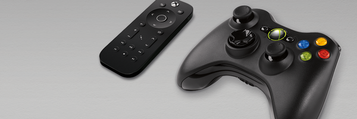

# Gamepad and remote control interactions

Universal Windows Platform (UWP) apps now support gamepad and remote control input, which are the primary input devices for Xbox and TV experiences.

UWP apps should be optimized for these input device types, just like they are for keyboard and mouse input on a PC, and touch input on a phone or tablet.

Making sure that your app works well with these input devices is a critical  step when optimizing for Xbox and the TV.

> [!NOTE] 
> You can now plug in and use the gamepad with UWP apps on PC which makes validating the work easy.

To ensure a successful and enjoyable user experience for your UWP app when using a gamepad or remote control, you should consider the following:

* [Hardware buttons](../devices/designing-for-tv.md#hardware-buttons) - The gamepad and remote provide very different buttons and configurations.

* [XY focus navigation and interaction](../devices/designing-for-tv.md#xy-focus-navigation-and-interaction) - XY focus navigation enables the user to navigate around your app's UI.

* [Mouse mode](../devices/designing-for-tv.md#mouse-mode) - Mouse mode lets your app emulate a mouse experience when XY focus navigation isn't sufficient.
