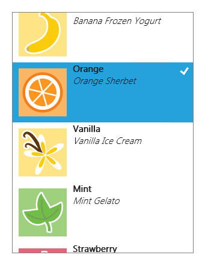

# Guidelines for cross-slide

**Important APIs**

-   [**CrossSliding**](/uwp/api/windows.ui.input.gesturerecognizer.crosssliding)
-   [**CrossSlideThresholds**](/uwp/api/windows.ui.input.gesturerecognizer.crossslidethresholds)
-   [**Windows.UI.Input**](/uwp/api/Windows.UI.Input)

Use cross-slide to support selection with the swipe gesture and drag (move) interactions with the slide gesture.

## Dos and don'ts

-   Use cross-slide for lists or collections that scroll in a single direction.
-   Use cross-slide for item selection when the tap interaction is used for another purpose.
-   Don't use cross-slide for adding items to a queue.

## Additional usage guidance

Selection and drag are possible only within a content area that is pannable in one direction (vertical or horizontal). For either interaction to work, one panning direction must be locked and the gesture must be performed in the direction perpendicular to the panning direction.

Here we demonstrate selecting and dragging an object using a cross-slide. The image on the left shows how an item is selected if a swipe gesture doesn't cross a distance threshold before the contact is lifted and the object released. The image on the right shows a sliding gesture that crosses a distance threshold and results in the object being dragged.

The threshold distances used by the cross-slide interaction are shown in the following diagram.

To preserve panning functionality, a small threshold of 2.7mm (approximately 10 pixels at target resolution) must be crossed before either a select or drag interaction is activated. This small threshold helps the system to differentiate cross-sliding from panning, and also helps ensure that a tap gesture is distinguished from both cross-sliding and panning.

This image shows how a user touches an element in the UI, but moves their finger down slightly at contact. With no threshold, the interaction would be interpreted as a cross-slide because of the initial vertical movement. With the threshold, the movement is interpreted correctly as horizontal panning.

Here are some guidelines to consider when including cross-slide functionality in your app.

Use cross-slide for lists or collections that scroll in a single direction. For more information, see [Adding ListView controls](/previous-versions/windows/apps/hh465382(v=win.10)).

**Note**  In cases where the content area can be panned in two directions, such as web browsers or e-readers, the press-and-hold timed interaction should be used to invoke the context menu for objects such as images and hyperlinks.

 

|                                                                                         |                                                                                         |
|-----------------------------------------------------------------------------------------|-----------------------------------------------------------------------------------------|
|                 |                 |
| A horizontally panning two-dimensional list. Drag vertically to select or move an item. | A vertically panning one-dimensional list. Drag horizontally to select or move an item. |

 

### 

**Selecting**

Selection is the marking, without launching or activating, of one or more objects. This action is analogous to a single mouse click, or Shift key and mouse click, on one or more objects.

Cross-slide selection is achieved by touching an element and releasing it after a short dragging interaction. This method of selection dispenses with both the dedicated selection mode and the press-and-hold timed interaction required by other touch interfaces and does not conflict with the tap interaction for activation.

In addition to the distance threshold, cross-slide selection is constrained to a 90° threshold area, as shown in the following diagram. If the object is dragged outside of this area, it is not selected.

The cross-slide interaction is supplemented by a press-and-hold timed interaction, also referred to as a "self-revealing" interaction. This supplemental interaction activates an animation that indicates what action can be performed on the object. For more information on disambiguation UI, see [Guidelines for visual feedback](guidelines-for-visualfeedback.md).

The following screen shots demonstrate how the self-revealing animation works.

1.  Press and hold to initiate the animation for the self-revealing interaction. The selected state of the item affects what is revealed by the animation: a check mark if unselected and no check mark if selected.

    

2.  Select the item using the swipe gesture (up or down).

    

3.  The item is now selected. Override the selection behavior using the slide gesture to move the item.

    

Use a single tap for selection in applications where it is the only primary action. The cross-slide self-revealing animation is displayed to disambiguate this functionality from the standard tap interaction for activation and navigation.

**Selection basket**

The selection basket is a visually distinct and dynamic representation of items that have been selected from the primary list or collection in the application. This feature is useful for tracking selected items and should be used by applications where:

-   Items can be selected from multiple locations.
-   Many items can be selected.
-   An action or command relies upon the selection list.

The content of the selection basket persists across actions and commands. For example, if you select a series of photographs from a gallery, apply a color correction to each photograph, and share the photographs in some fashion, the items remain selected.

If no selection basket is used in an application, the current selection should be cleared after an action or command. For example, if you select a song from a play list and rate it, the selection should be cleared.

The current selection should also be cleared when no selection basket is used and another item in the list or collection is activated. For example, if you select an inbox message, the preview pane is updated. Then, if you select a second inbox message, the selection of the previous message is canceled and the preview pane is updated.

**Queues**

A queue is not equivalent to the selection basket list and should not be treated as such. The primary distinctions include:

-   The list of items in the selection basket is only a visual representation; the items in a queue are assembled with a specific action in mind.
-   Items can be represented only once in the selection basket but multiple times in a queue.
-   The order of items in the selection basket represents the order of selection. The order of items in a queue is directly related to functionality.

For these reasons, the cross-slide selection interaction should not be used to add items to a queue. Instead, items should be added to a queue through a drag action.

### 

**Drag**

Use drag to move one or more objects from one location to another.

If more than one object needs to be moved, let users select multiple items and then drag all at one time.

## Related articles

### Samples

- [Basic input sample](https://github.com/Microsoft/Windows-universal-samples/tree/master/Samples/BasicInput)
- [Low latency input sample](https://github.com/Microsoft/Windows-universal-samples/tree/master/Samples/LowLatencyInput)
- [User interaction mode sample](https://github.com/Microsoft/Windows-universal-samples/tree/master/Samples/UserInteractionMode)
- [Focus visuals sample](https://github.com/Microsoft/Windows-universal-samples/tree/master/Samples/XamlFocusVisuals)

### Archive samples

- [Input: XAML user input events sample](https://github.com/microsoftarchive/msdn-code-gallery-microsoft/tree/411c271e537727d737a53fa2cbe99eaecac00cc0/Official%20Windows%20Platform%20Sample/Input%20XAML%20user%20input%20events%20sample)
- [Input: Device capabilities sample](https://github.com/microsoftarchive/msdn-code-gallery-microsoft/tree/411c271e537727d737a53fa2cbe99eaecac00cc0/Official%20Windows%20Platform%20Sample/Windows%208%20app%20samples/%5BC%23%5D-Windows%208%20app%20samples/C%23/Windows%208%20app%20samples/Input%20Device%20capabilities%20sample%20(Windows%208))
- [Input: Touch hit testing sample](https://github.com/microsoftarchive/msdn-code-gallery-microsoft/tree/411c271e537727d737a53fa2cbe99eaecac00cc0/Official%20Windows%20Platform%20Sample/Windows%208%20desktop%20samples/%5BC%2B%2B%5D-Windows%208%20desktop%20samples/C%2B%2B/Windows%208%20desktop%20samples/Input%20Touch%20hit%20testing%20sample)
- [XAML scrolling, panning, and zooming sample](https://github.com/microsoftarchive/msdn-code-gallery-microsoft/tree/411c271e537727d737a53fa2cbe99eaecac00cc0/Official%20Windows%20Platform%20Sample/Universal%20Windows%20app%20samples/111487-Universal%20Windows%20app%20samples/XAML%20scrolling%2C%20panning%2C%20and%20zooming%20sample)
- [Input: Simplified ink sample](https://github.com/microsoftarchive/msdn-code-gallery-microsoft/tree/411c271e537727d737a53fa2cbe99eaecac00cc0/Official%20Windows%20Platform%20Sample/Input%20Simplified%20ink%20sample)
- [Input: Windows 8 gestures sample](/samples/browse/?redirectedfrom=MSDN-samples)
- [Input: Manipulations and gestures sample](https://github.com/microsoftarchive/msdn-code-gallery-microsoft/tree/411c271e537727d737a53fa2cbe99eaecac00cc0/Official%20Windows%20Platform%20Sample/Input%20Gestures%20and%20manipulations%20with%20GestureRecognizer)
- [DirectX touch input sample](https://github.com/microsoftarchive/msdn-code-gallery-microsoft/tree/411c271e537727d737a53fa2cbe99eaecac00cc0/Official%20Windows%20Platform%20Sample/Windows%208%20app%20samples/%5BC%2B%2B%5D-Windows%208%20app%20samples/C%2B%2B/Windows%208%20app%20samples/DirectX%20touch%20input%20sample%20(Windows%208))
 

 