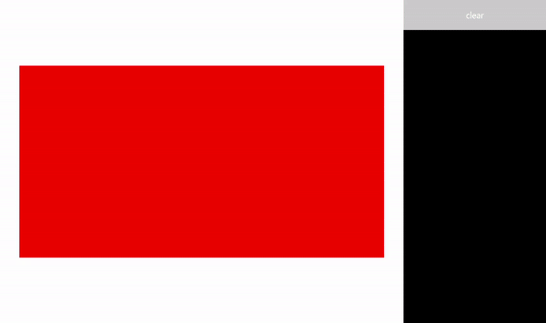

# Handle pointer input

Receive, process, and manage input data from pointing devices (such as touch, mouse, pen/stylus, and touchpad) in your Windows applications.

> [!Important]
> Create custom interactions only if there is a clear, well-defined requirement and the interactions supported by the platform controls don't support your scenario.  
> If you customize the interaction experiences in your Windows application, users expect them to be consistent, intuitive, and discoverable. For these reasons, we recommend that you model your custom interactions on those supported by the [platform controls](../controls-and-patterns/controls-by-function.md). The platform controls provide the full Windows app user interaction experience, including standard interactions, animated physics effects, visual feedback, and accessibility. 

## Important APIs
- [Windows.Devices.Input](/uwp/api/Windows.Devices.Input)
- [Windows.UI.Input](/uwp/api/Windows.UI.Core)
- [Windows.UI.Xaml.Input](/uwp/api/Windows.UI.Input)

## Pointers
Most interaction experiences typically involve the user identifying the object they want to interact with by pointing at it through input devices such as touch, mouse, pen/stylus, and touchpad. Because the raw Human Interface Device (HID) data provided by these input devices includes many common properties, the data is promoted and consolidated into a unified input stack and exposed as device-agnostic pointer data. Your Windows applications can then consume this data without worrying about the input device being used.

> [!NOTE]
> Device-specific info is also promoted from the raw HID data should your app require it.

Each input point (or contact) on the input stack is represented by a [**Pointer**](/uwp/api/Windows.UI.Xaml.Input.Pointer) object exposed through the [**PointerRoutedEventArgs**](/uwp/api/Windows.UI.Xaml.Input.PointerRoutedEventArgs) parameter in the various pointer event handlers. In the case of multi-pen or multi-touch input, each contact is treated as a unique input pointer.

## Pointer events

Pointer events expose basic info such as input device type and detection state (in range or in contact), and extended info such as location, pressure, and contact geometry. In addition, specific device properties such as which mouse button a user pressed or whether the pen eraser tip is being used are also available. If your app needs to differentiate between input devices and their capabilities, see [Identify input devices](identify-input-devices.md).

Windows apps can listen for the following pointer events:

> [!NOTE]
> Constrain pointer input to a specific UI element by calling  [**CapturePointer**](/uwp/api/windows.ui.xaml.uielement.capturepointer) on that element within a pointer event handler. When a pointer is captured by an element, only that object receives pointer input events, even when the pointer moves outside the bounding area of the object. The [**IsInContact**](/uwp/api/windows.ui.xaml.input.pointer.isincontact) (mouse button pressed, touch or stylus in contact) must be true for **CapturePointer** to be successful.

<table>
<colgroup>
<col width="50%" />
<col width="50%" />
</colgroup>
<thead>
<tr class="header">
<th align="left">Event</th>
<th align="left">Description</th>
</tr>
</thead>
<tbody>
<tr class="odd">
<td align="left"><p><a href="https://docs.microsoft.com/uwp/api/windows.ui.xaml.uielement.pointercanceled"><strong>PointerCanceled</strong></a></p></td>
<td align="left"><p>Occurs when a pointer is canceled by the platform. This can occur in the following circumstances:</p>
<ul>
<li>Touch pointers are canceled when a pen is detected within range of the input surface.</li>
<li>An active contact is not detected for more than 100 ms.</li>
<li>Monitor/display is changed (resolution, settings, multi-mon configuration).</li>
<li>The desktop is locked or the user has logged off.</li>
<li>The number of simultaneous contacts exceeded the number supported by the device.</li>
</ul></td>
</tr>
<tr class="even">
<td align="left"><p><a href="https://docs.microsoft.com/uwp/api/windows.ui.xaml.uielement.pointercapturelost"><strong>PointerCaptureLost</strong></a></p></td>
<td align="left"><p>Occurs when another UI element captures the pointer, the pointer was released, or another pointer was programmatically captured.</p>
<div class="alert">
<strong>Note</strong>  There is no corresponding pointer capture event.
</div>
<div>
 
</div></td>
</tr>
<tr class="odd">
<td align="left"><p><a href="https://docs.microsoft.com/uwp/api/windows.ui.xaml.uielement.pointerentered"><strong>PointerEntered</strong></a></p></td>
<td align="left"><p>Occurs when a pointer enters the bounding area of an element. This can happen in slightly different ways for touch, touchpad, mouse, and pen input.</p>
<ul>
<li>Touch requires a finger contact to fire this event, either from a direct touch down on the element or from moving into the bounding area of the element.</li>
<li>Mouse and touchpad both have an on-screen cursor that is always visible and fires this event even if no mouse or touchpad button is pressed.</li>
<li>Like touch, pen fires this event with a direct pen down on the element or from moving into the bounding area of the element. However, pen also has a hover state (<a href="https://docs.microsoft.com/uwp/api/windows.ui.xaml.input.pointer.isinrange">IsInRange</a>) that, when true, fires this event.</li>
</ul></td>
</tr>
<tr class="even">
<td align="left"><p><a href="https://docs.microsoft.com/uwp/api/windows.ui.xaml.uielement.pointerexited"><strong>PointerExited</strong></a></p></td>
<td align="left"><p>Occurs when a pointer leaves the bounding area of an element. This can happen in slightly different ways for touch, touchpad, mouse, and pen input.</p>
<ul>
<li>Touch requires a finger contact and fires this event when the pointer moves out of the bounding area of the element.</li>
<li>Mouse and touchpad both have an on-screen cursor that is always visible and fires this event even if no mouse or touchpad button is pressed.</li>
<li>Like touch, pen fires this event when moving out of the bounding area of the element. However, pen also has a hover state (<a href="https://docs.microsoft.com/uwp/api/windows.ui.xaml.input.pointer.isinrange">IsInRange</a>) that fires this event when the state changes from true to false.</li>
</ul></td>
</tr>
<tr class="odd">
<td align="left"><p><a href="https://docs.microsoft.com/uwp/api/windows.ui.xaml.uielement.pointermoved"><strong>PointerMoved</strong></a></p></td>
<td align="left"><p>Occurs when a pointer changes coordinates, button state, pressure, tilt, or contact geometry (for example, width and height) within the bounding area of an element. This can happen in slightly different ways for touch, touchpad, mouse, and pen input.</p>
<ul>
<li>Touch requires a finger contact and fires this event only when in contact within the bounding area of the element.</li>
<li>Mouse and touchpad both have an on-screen cursor that is always visible and fires this event even if no mouse or touchpad button is pressed.</li>
<li>Like touch, pen fires this event when in contact within the bounding area of the element. However, pen also has a hover state (<a href="https://docs.microsoft.com/uwp/api/windows.ui.xaml.input.pointer.isinrange">IsInRange</a>) that, when true and within the bounding area of the element, fires this event.</li>
</ul></td>
</tr>
<tr class="even">
<td align="left"><p><a href="https://docs.microsoft.com/uwp/api/windows.ui.xaml.uielement.pointerpressed"><strong>PointerPressed</strong></a></p></td>
<td align="left"><p>Occurs when the pointer indicates a press action (such as a touch down, mouse button down, pen down, or touchpad button down) within the bounding area of an element.</p>
<p><a href="/uwp/api/windows.ui.xaml.uielement.capturepointer">CapturePointer</a> must be called from the handler for this event.</p></td>
</tr>
<tr class="odd">
<td align="left"><p><a href="https://docs.microsoft.com/uwp/api/windows.ui.xaml.uielement.pointerreleased"><strong>PointerReleased</strong></a></p></td>
<td align="left"><p>Occurs when the pointer indicates a release action (such as a touch up, mouse button up, pen up, or touchpad button up) within the bounding area of an element or, if the pointer is captured, outside the bounding area.</p></td>
</tr>
<tr class="even">
<td align="left"><p><a href="https://docs.microsoft.com/uwp/api/windows.ui.xaml.uielement.pointerwheelchanged"><strong>PointerWheelChanged</strong></a></p></td>
<td align="left"><p>Occurs when the mouse wheel is rotated.</p>
<p>Mouse input is associated with a single pointer assigned when mouse input is first detected. Clicking a mouse button (left, wheel, or right) creates a secondary association between the pointer and that button through the <a href="/uwp/api/windows.ui.xaml.uielement.pointermoved">PointerMoved</a> event.</p></td>
</tr>
</tbody>
</table> 

## Pointer event example

Here are some code snippets from a basic pointer tracking app that show how to listen for and handle events for multiple pointers, and get various properties for the associated pointers.



**Download this sample from [Pointer input sample (basic)](https://github.com/MicrosoftDocs/windows-topic-specific-samples/archive/uwp-pointers.zip)**

### Create the UI

For this example, we use a [Rectangle](/uwp/api/windows.ui.xaml.shapes.rectangle) (`Target`) as the object consuming pointer input. The color of the target changes when the pointer status changes.

Details for each pointer are displayed in a floating [TextBlock](/uwp/api/Windows.UI.Xaml.Controls.TextBlock) that follows the pointer as it moves. The pointer events themselves are reported in the [RichTextBlock](/uwp/api/Windows.UI.Xaml.Controls.RichTextBlock) to the right of the rectangle.

This is the Extensible Application Markup Language (XAML) for the UI in this example. 

```xaml
<Grid Background="{ThemeResource ApplicationPageBackgroundThemeBrush}">
    <Grid.ColumnDefinitions>
        <ColumnDefinition Width="*" />
        <ColumnDefinition Width="250"/>
    </Grid.ColumnDefinitions>
    <Grid.RowDefinitions>
        <RowDefinition Height="*" />
        <RowDefinition Height="320" />
        <RowDefinition Height="*"/>
    </Grid.RowDefinitions>
    <Canvas Name="Container" 
            Grid.Column="0"
            Grid.Row="1"
            HorizontalAlignment="Center" 
            VerticalAlignment="Center" 
            Margin="245,0" 
            Height="320"  Width="640">
        <Rectangle Name="Target" 
                    Fill="#FF0000" 
                    Stroke="Black" 
                    StrokeThickness="0"
                    Height="320" Width="640" />
    </Canvas>
    <Grid Grid.Column="1" Grid.Row="0" Grid.RowSpan="3">
        <Grid.RowDefinitions>
            <RowDefinition Height="50" />
            <RowDefinition Height="*" />
        </Grid.RowDefinitions>
        <Button Name="buttonClear" 
                Grid.Row="0"
                Content="Clear"
                Foreground="White"
                HorizontalAlignment="Stretch" 
                VerticalAlignment="Stretch">
        </Button>
        <ScrollViewer Name="eventLogScrollViewer" Grid.Row="1" 
                        VerticalScrollMode="Auto" 
                        Background="Black">                
            <RichTextBlock Name="eventLog"  
                        TextWrapping="Wrap" 
                        Foreground="#FFFFFF" 
                        ScrollViewer.VerticalScrollBarVisibility="Visible" 
                        ScrollViewer.HorizontalScrollBarVisibility="Disabled"
                        Grid.ColumnSpan="2">
            </RichTextBlock>
        </ScrollViewer>
    </Grid>
</Grid>
```

### Listen for pointer events

In most cases, we recommend that you get pointer info through the [**PointerRoutedEventArgs**](/uwp/api/Windows.UI.Xaml.Input.PointerRoutedEventArgs) of the event handler.

If the event argument doesn't expose the pointer details required, you can get access to extended [**PointerPoint**](/uwp/api/Windows.UI.Input.PointerPoint) info exposed through the [**GetCurrentPoint**](/uwp/api/windows.ui.xaml.input.pointerroutedeventargs.getcurrentpoint) and [**GetIntermediatePoints**](/uwp/api/windows.ui.xaml.input.pointerroutedeventargs.getintermediatepoints) methods of [**PointerRoutedEventArgs**](/uwp/api/Windows.UI.Xaml.Input.PointerRoutedEventArgs).

The following code sets up the global dictionary object for tracking each active pointer, and identifies the various pointer event listeners for the target object.

```CSharp
// Dictionary to maintain information about each active pointer. 
// An entry is added during PointerPressed/PointerEntered events and removed 
// during PointerReleased/PointerCaptureLost/PointerCanceled/PointerExited events.
Dictionary<uint, Windows.UI.Xaml.Input.Pointer> pointers;

public MainPage()
{
    this.InitializeComponent();

    // Initialize the dictionary.
    pointers = new Dictionary<uint, Windows.UI.Xaml.Input.Pointer>();

    // Declare the pointer event handlers.
    Target.PointerPressed += 
        new PointerEventHandler(Target_PointerPressed);
    Target.PointerEntered += 
        new PointerEventHandler(Target_PointerEntered);
    Target.PointerReleased += 
        new PointerEventHandler(Target_PointerReleased);
    Target.PointerExited += 
        new PointerEventHandler(Target_PointerExited);
    Target.PointerCanceled += 
        new PointerEventHandler(Target_PointerCanceled);
    Target.PointerCaptureLost += 
        new PointerEventHandler(Target_PointerCaptureLost);
    Target.PointerMoved += 
        new PointerEventHandler(Target_PointerMoved);
    Target.PointerWheelChanged += 
        new PointerEventHandler(Target_PointerWheelChanged);

    buttonClear.Click += 
        new RoutedEventHandler(ButtonClear_Click);
}
```

### Handle pointer events

Next, we use UI feedback to demonstrate basic pointer event handlers.

-   This handler manages the [**PointerPressed**](/uwp/api/windows.ui.xaml.uielement.pointerpressed) event. We add the event to the event log, add the pointer to the active pointer dictionary, and display the pointer details.

    > [!NOTE]
    > [**PointerPressed**](/uwp/api/windows.ui.xaml.uielement.pointerpressed) and [**PointerReleased**](/uwp/api/windows.ui.xaml.uielement.pointerreleased) events do not always occur in pairs. Your app should listen for and handle any event that might conclude a pointer down (such as [**PointerExited**](/uwp/api/windows.ui.xaml.uielement.pointerexited), [**PointerCanceled**](/uwp/api/windows.ui.xaml.uielement.pointercanceled), and [**PointerCaptureLost**](/uwp/api/windows.ui.xaml.uielement.pointercapturelost)).
         

```csharp
/// <summary>
/// The pointer pressed event handler.
/// PointerPressed and PointerReleased don't always occur in pairs. 
/// Your app should listen for and handle any event that can conclude 
/// a pointer down (PointerExited, PointerCanceled, PointerCaptureLost).
/// </summary>
/// <param name="sender">Source of the pointer event.</param>
/// <param name="e">Event args for the pointer routed event.</param>
void Target_PointerPressed(object sender, PointerRoutedEventArgs e)
{
    // Prevent most handlers along the event route from handling the same event again.
    e.Handled = true;

    PointerPoint ptrPt = e.GetCurrentPoint(Target);

    // Update event log.
    UpdateEventLog("Down: " + ptrPt.PointerId);

    // Lock the pointer to the target.
    Target.CapturePointer(e.Pointer);

    // Update event log.
    UpdateEventLog("Pointer captured: " + ptrPt.PointerId);

    // Check if pointer exists in dictionary (ie, enter occurred prior to press).
    if (!pointers.ContainsKey(ptrPt.PointerId))
    {
        // Add contact to dictionary.
        pointers[ptrPt.PointerId] = e.Pointer;
    }

    // Change background color of target when pointer contact detected.
    Target.Fill = new SolidColorBrush(Windows.UI.Colors.Green);

    // Display pointer details.
    CreateInfoPop(ptrPt);
}
```

-   This handler manages the [**PointerEntered**](/uwp/api/windows.ui.xaml.uielement.pointerentered) event. We add the event to the event log, add the pointer to the pointer collection, and display the pointer details.

```csharp
/// <summary>
/// The pointer entered event handler.
/// We do not capture the pointer on this event.
/// </summary>
/// <param name="sender">Source of the pointer event.</param>
/// <param name="e">Event args for the pointer routed event.</param>
private void Target_PointerEntered(object sender, PointerRoutedEventArgs e)
{
    // Prevent most handlers along the event route from handling the same event again.
    e.Handled = true;

    PointerPoint ptrPt = e.GetCurrentPoint(Target);

    // Update event log.
    UpdateEventLog("Entered: " + ptrPt.PointerId);

    // Check if pointer already exists (if enter occurred prior to down).
    if (!pointers.ContainsKey(ptrPt.PointerId))
    {
        // Add contact to dictionary.
        pointers[ptrPt.PointerId] = e.Pointer;
    }

    if (pointers.Count == 0)
    {
        // Change background color of target when pointer contact detected.
        Target.Fill = new SolidColorBrush(Windows.UI.Colors.Blue);
    }

    // Display pointer details.
    CreateInfoPop(ptrPt);
}
```

-   This handler manages the [**PointerMoved**](/uwp/api/windows.ui.xaml.uielement.pointermoved) event. We add the event to the event log and update the pointer details.

    > [!Important]
    > Mouse input is associated with a single pointer assigned when mouse input is first detected. Clicking a mouse button (left, wheel, or right) creates a secondary association between the pointer and that button through the [**PointerPressed**](/uwp/api/windows.ui.xaml.uielement.pointerpressed) event. The [**PointerReleased**](/uwp/api/windows.ui.xaml.uielement.pointerreleased) event is fired only when that same mouse button is released (no other button can be associated with the pointer until this event is complete). Because of this exclusive association, other mouse button clicks are routed through the [**PointerMoved**](/uwp/api/windows.ui.xaml.uielement.pointermoved) event.     

```csharp
/// <summary>
/// The pointer moved event handler.
/// </summary>
/// <param name="sender">Source of the pointer event.</param>
/// <param name="e">Event args for the pointer routed event.</param>
private void Target_PointerMoved(object sender, PointerRoutedEventArgs e)
{
    // Prevent most handlers along the event route from handling the same event again.
    e.Handled = true;

    PointerPoint ptrPt = e.GetCurrentPoint(Target);

    // Multiple, simultaneous mouse button inputs are processed here.
    // Mouse input is associated with a single pointer assigned when 
    // mouse input is first detected. 
    // Clicking additional mouse buttons (left, wheel, or right) during 
    // the interaction creates secondary associations between those buttons 
    // and the pointer through the pointer pressed event. 
    // The pointer released event is fired only when the last mouse button 
    // associated with the interaction (not necessarily the initial button) 
    // is released. 
    // Because of this exclusive association, other mouse button clicks are 
    // routed through the pointer move event.          
    if (ptrPt.PointerDevice.PointerDeviceType == Windows.Devices.Input.PointerDeviceType.Mouse)
    {
        if (ptrPt.Properties.IsLeftButtonPressed)
        {
            UpdateEventLog("Left button: " + ptrPt.PointerId);
        }
        if (ptrPt.Properties.IsMiddleButtonPressed)
        {
            UpdateEventLog("Wheel button: " + ptrPt.PointerId);
        }
        if (ptrPt.Properties.IsRightButtonPressed)
        {
            UpdateEventLog("Right button: " + ptrPt.PointerId);
        }
    }

    // Display pointer details.
    UpdateInfoPop(ptrPt);
}
```

-   This handler manages the [**PointerWheelChanged**](/uwp/api/windows.ui.xaml.uielement.pointerwheelchanged) event. We add the event to the event log, add the pointer to the pointer array (if necessary), and display the pointer details.

```csharp
/// <summary>
/// The pointer wheel event handler.
/// </summary>
/// <param name="sender">Source of the pointer event.</param>
/// <param name="e">Event args for the pointer routed event.</param>
private void Target_PointerWheelChanged(object sender, PointerRoutedEventArgs e)
{
    // Prevent most handlers along the event route from handling the same event again.
    e.Handled = true;

    PointerPoint ptrPt = e.GetCurrentPoint(Target);

    // Update event log.
    UpdateEventLog("Mouse wheel: " + ptrPt.PointerId);

    // Check if pointer already exists (for example, enter occurred prior to wheel).
    if (!pointers.ContainsKey(ptrPt.PointerId))
    {
        // Add contact to dictionary.
        pointers[ptrPt.PointerId] = e.Pointer;
    }

    // Display pointer details.
    CreateInfoPop(ptrPt);
}
```

-   This handler manages the [**PointerReleased**](/uwp/api/windows.ui.xaml.uielement.pointerreleased) event where contact with the digitizer is terminated. We add the event to the event log, remove the pointer from the pointer collection, and update the pointer details.

```csharp
/// <summary>
/// The pointer released event handler.
/// PointerPressed and PointerReleased don't always occur in pairs. 
/// Your app should listen for and handle any event that can conclude 
/// a pointer down (PointerExited, PointerCanceled, PointerCaptureLost).
/// </summary>
/// <param name="sender">Source of the pointer event.</param>
/// <param name="e">Event args for the pointer routed event.</param>
void Target_PointerReleased(object sender, PointerRoutedEventArgs e)
{
    // Prevent most handlers along the event route from handling the same event again.
    e.Handled = true;

    PointerPoint ptrPt = e.GetCurrentPoint(Target);

    // Update event log.
    UpdateEventLog("Up: " + ptrPt.PointerId);

    // If event source is mouse or touchpad and the pointer is still 
    // over the target, retain pointer and pointer details.
    // Return without removing pointer from pointers dictionary.
    // For this example, we assume a maximum of one mouse pointer.
    if (ptrPt.PointerDevice.PointerDeviceType != Windows.Devices.Input.PointerDeviceType.Mouse)
    {
        // Update target UI.
        Target.Fill = new SolidColorBrush(Windows.UI.Colors.Red);

        DestroyInfoPop(ptrPt);

        // Remove contact from dictionary.
        if (pointers.ContainsKey(ptrPt.PointerId))
        {
            pointers[ptrPt.PointerId] = null;
            pointers.Remove(ptrPt.PointerId);
        }

        // Release the pointer from the target.
        Target.ReleasePointerCapture(e.Pointer);

        // Update event log.
        UpdateEventLog("Pointer released: " + ptrPt.PointerId);
    }
    else
    {
        Target.Fill = new SolidColorBrush(Windows.UI.Colors.Blue);
    }
}
```

-   This handler manages the [**PointerExited**](/uwp/api/windows.ui.xaml.uielement.pointerexited) event (when contact with the digitizer is maintained). We add the event to the event log, remove the pointer from the pointer array, and update the pointer details.

```csharp
/// <summary>
/// The pointer exited event handler.
/// </summary>
/// <param name="sender">Source of the pointer event.</param>
/// <param name="e">Event args for the pointer routed event.</param>
private void Target_PointerExited(object sender, PointerRoutedEventArgs e)
{
    // Prevent most handlers along the event route from handling the same event again.
    e.Handled = true;

    PointerPoint ptrPt = e.GetCurrentPoint(Target);

    // Update event log.
    UpdateEventLog("Pointer exited: " + ptrPt.PointerId);

    // Remove contact from dictionary.
    if (pointers.ContainsKey(ptrPt.PointerId))
    {
        pointers[ptrPt.PointerId] = null;
        pointers.Remove(ptrPt.PointerId);
    }

    if (pointers.Count == 0)
    {
        Target.Fill = new SolidColorBrush(Windows.UI.Colors.Red);
    }

    // Update the UI and pointer details.
    DestroyInfoPop(ptrPt);
}
```

-   This handler manages the [**PointerCanceled**](/uwp/api/windows.ui.xaml.uielement.pointercanceled) event. We add the event to the event log, remove the pointer from the pointer array, and update the pointer details.

```csharp
/// <summary>
/// The pointer canceled event handler.
/// Fires for various reasons, including: 
///    - Touch contact canceled by pen coming into range of the surface.
///    - The device doesn't report an active contact for more than 100ms.
///    - The desktop is locked or the user logged off. 
///    - The number of simultaneous contacts exceeded the number supported by the device.
/// </summary>
/// <param name="sender">Source of the pointer event.</param>
/// <param name="e">Event args for the pointer routed event.</param>
private void Target_PointerCanceled(object sender, PointerRoutedEventArgs e)
{
    // Prevent most handlers along the event route from handling the same event again.
    e.Handled = true;

    PointerPoint ptrPt = e.GetCurrentPoint(Target);

    // Update event log.
    UpdateEventLog("Pointer canceled: " + ptrPt.PointerId);

    // Remove contact from dictionary.
    if (pointers.ContainsKey(ptrPt.PointerId))
    {
        pointers[ptrPt.PointerId] = null;
        pointers.Remove(ptrPt.PointerId);
    }

    if (pointers.Count == 0)
    {
        Target.Fill = new SolidColorBrush(Windows.UI.Colors.Black);
    }

    DestroyInfoPop(ptrPt);
}
```

-   This handler manages the [**PointerCaptureLost**](/uwp/api/windows.ui.xaml.uielement.pointercapturelost) event. We add the event to the event log, remove the pointer from the pointer array, and update the pointer details.

    > [!NOTE]
    > [**PointerCaptureLost**](/uwp/api/windows.ui.xaml.uielement.pointercapturelost) can occur instead of [**PointerReleased**](/uwp/api/windows.ui.xaml.uielement.pointerreleased). Pointer capture can be lost for various reasons including user interaction, programmatic capture of another pointer, calling [**PointerReleased**](/uwp/api/windows.ui.xaml.uielement.pointerreleased).     

```csharp
/// <summary>
/// The pointer capture lost event handler.
/// Fires for various reasons, including: 
///    - User interactions
///    - Programmatic capture of another pointer
///    - Captured pointer was deliberately released
// PointerCaptureLost can fire instead of PointerReleased. 
/// </summary>
/// <param name="sender">Source of the pointer event.</param>
/// <param name="e">Event args for the pointer routed event.</param>
private void Target_PointerCaptureLost(object sender, PointerRoutedEventArgs e)
{
    // Prevent most handlers along the event route from handling the same event again.
    e.Handled = true;

    PointerPoint ptrPt = e.GetCurrentPoint(Target);

    // Update event log.
    UpdateEventLog("Pointer capture lost: " + ptrPt.PointerId);

    if (pointers.Count == 0)
    {
        Target.Fill = new SolidColorBrush(Windows.UI.Colors.Black);
    }

    // Remove contact from dictionary.
    if (pointers.ContainsKey(ptrPt.PointerId))
    {
        pointers[ptrPt.PointerId] = null;
        pointers.Remove(ptrPt.PointerId);
    }

    DestroyInfoPop(ptrPt);
}
```

### Get pointer properties

As stated earlier, you must get most extended pointer info from a [**Windows.UI.Input.PointerPoint**](/uwp/api/Windows.UI.Input.PointerPoint) object obtained through the [**GetCurrentPoint**](/uwp/api/windows.ui.xaml.input.pointerroutedeventargs.getcurrentpoint) and [**GetIntermediatePoints**](/uwp/api/windows.ui.xaml.input.pointerroutedeventargs.getintermediatepoints) methods of [**PointerRoutedEventArgs**](/uwp/api/Windows.UI.Xaml.Input.PointerRoutedEventArgs). The following code snippets show how.

-   First, we create a new [**TextBlock**](/uwp/api/Windows.UI.Xaml.Controls.TextBlock) for each pointer.

```csharp
/// <summary>
/// Create the pointer info popup.
/// </summary>
/// <param name="ptrPt">Reference to the input pointer.</param>
void CreateInfoPop(PointerPoint ptrPt)
{
    TextBlock pointerDetails = new TextBlock();
    pointerDetails.Name = ptrPt.PointerId.ToString();
    pointerDetails.Foreground = new SolidColorBrush(Windows.UI.Colors.White);
    pointerDetails.Text = QueryPointer(ptrPt);

    TranslateTransform x = new TranslateTransform();
    x.X = ptrPt.Position.X + 20;
    x.Y = ptrPt.Position.Y + 20;
    pointerDetails.RenderTransform = x;

    Container.Children.Add(pointerDetails);
}
```

-   Then we provide a way to update the pointer info in an existing [**TextBlock**](/uwp/api/Windows.UI.Xaml.Controls.TextBlock) associated with that pointer.

```csharp
/// <summary>
/// Update the pointer info popup.
/// </summary>
/// <param name="ptrPt">Reference to the input pointer.</param>
void UpdateInfoPop(PointerPoint ptrPt)
{
    foreach (var pointerDetails in Container.Children)
    {
        if (pointerDetails.GetType().ToString() == "Windows.UI.Xaml.Controls.TextBlock")
        {
            TextBlock textBlock = (TextBlock)pointerDetails;
            if (textBlock.Name == ptrPt.PointerId.ToString())
            {
                // To get pointer location details, we need extended pointer info.
                // We get the pointer info through the getCurrentPoint method
                // of the event argument. 
                TranslateTransform x = new TranslateTransform();
                x.X = ptrPt.Position.X + 20;
                x.Y = ptrPt.Position.Y + 20;
                pointerDetails.RenderTransform = x;
                textBlock.Text = QueryPointer(ptrPt);
            }
        }
    }
}
```

-   Finally, we query various pointer properties.

```csharp
/// <summary>
/// Get pointer details.
/// </summary>
/// <param name="ptrPt">Reference to the input pointer.</param>
/// <returns>A string composed of pointer details.</returns>
String QueryPointer(PointerPoint ptrPt)
{
    String details = "";

    switch (ptrPt.PointerDevice.PointerDeviceType)
    {
        case Windows.Devices.Input.PointerDeviceType.Mouse:
            details += "\nPointer type: mouse";
            break;
        case Windows.Devices.Input.PointerDeviceType.Pen:
            details += "\nPointer type: pen";
            if (ptrPt.IsInContact)
            {
                details += "\nPressure: " + ptrPt.Properties.Pressure;
                details += "\nrotation: " + ptrPt.Properties.Orientation;
                details += "\nTilt X: " + ptrPt.Properties.XTilt;
                details += "\nTilt Y: " + ptrPt.Properties.YTilt;
                details += "\nBarrel button pressed: " + ptrPt.Properties.IsBarrelButtonPressed;
            }
            break;
        case Windows.Devices.Input.PointerDeviceType.Touch:
            details += "\nPointer type: touch";
            details += "\nrotation: " + ptrPt.Properties.Orientation;
            details += "\nTilt X: " + ptrPt.Properties.XTilt;
            details += "\nTilt Y: " + ptrPt.Properties.YTilt;
            break;
        default:
            details += "\nPointer type: n/a";
            break;
    }

    GeneralTransform gt = Target.TransformToVisual(this);
    Point screenPoint;

    screenPoint = gt.TransformPoint(new Point(ptrPt.Position.X, ptrPt.Position.Y));
    details += "\nPointer Id: " + ptrPt.PointerId.ToString() +
        "\nPointer location (target): " + Math.Round(ptrPt.Position.X) + ", " + Math.Round(ptrPt.Position.Y) +
        "\nPointer location (container): " + Math.Round(screenPoint.X) + ", " + Math.Round(screenPoint.Y);

    return details;
}
```

## Primary pointer
Some input devices, such as a touch digitizer or touchpad, support more than the typical single pointer of a mouse or a pen (in most cases as the Surface Hub supports two pen inputs). 

Use the read-only **[IsPrimary](/uwp/api/windows.ui.input.pointerpointproperties.IsPrimary)** property of the **[PointerPointerProperties](/uwp/api/windows.ui.input.pointerpointproperties)** class to identify and differentiate a single primary pointer (the primary pointer is always the first pointer detected during an input sequence). 

By identifying the primary pointer, you can use it to emulate mouse or pen input, customize interactions, or provide some other specific functionality or UI.

> [!NOTE]
> If the primary pointer is released, canceled, or lost during an input sequence, a primary input pointer is not created until a new input sequence is initiated (an input sequence ends when all pointers have been released, canceled, or lost).

## Primary pointer animation example

These code snippets show how you can provide special visual feedback to help a user differentiate between pointer inputs in your application.

This particular app uses both color and animation to highlight the primary pointer.


**Download this sample from [Pointer input sample (UserControl with animation)](https://github.com/MicrosoftDocs/windows-topic-specific-samples/archive/uwp-pointers-animation.zip)**

### Visual feedback

We define a **[UserControl](/uwp/api/windows.ui.xaml.controls.usercontrol)**, based on a XAML **[Ellipse](/uwp/api/windows.ui.xaml.shapes.ellipse)** object, that highlights where each pointer is on the canvas and uses a **[Storyboard](/uwp/api/windows.ui.xaml.media.animation.storyboard)** to animate the ellipse that corresponds to the primary pointer.

**Here's the XAML:**

```xaml
<UserControl
    x:Class="UWP_Pointers.PointerEllipse"
    xmlns="http://schemas.microsoft.com/winfx/2006/xaml/presentation"
    xmlns:x="http://schemas.microsoft.com/winfx/2006/xaml"
    xmlns:local="using:UWP_Pointers"
    xmlns:d="http://schemas.microsoft.com/expression/blend/2008"
    xmlns:mc="http://schemas.openxmlformats.org/markup-compatibility/2006"
    mc:Ignorable="d"
    d:DesignHeight="100"
    d:DesignWidth="100">

    <UserControl.Resources>
        <Style x:Key="EllipseStyle" TargetType="Ellipse">
            <Setter Property="Transitions">
                <Setter.Value>
                    <TransitionCollection>
                        <ContentThemeTransition/>
                    </TransitionCollection>
                </Setter.Value>
            </Setter>
        </Style>
        
        <Storyboard x:Name="myStoryboard">
            <!-- Animates the value of a Double property between 
            two target values using linear interpolation over the 
            specified Duration. -->
            <DoubleAnimation
              Storyboard.TargetName="ellipse"
              Storyboard.TargetProperty="(RenderTransform).(ScaleTransform.ScaleY)"  
              Duration="0:0:1" 
              AutoReverse="True" 
              RepeatBehavior="Forever" From="1.0" To="1.4">
            </DoubleAnimation>

            <!-- Animates the value of a Double property between 
            two target values using linear interpolation over the 
            specified Duration. -->
            <DoubleAnimation
              Storyboard.TargetName="ellipse"
              Storyboard.TargetProperty="(RenderTransform).(ScaleTransform.ScaleX)"  
              Duration="0:0:1" 
              AutoReverse="True" 
              RepeatBehavior="Forever" From="1.0" To="1.4">
            </DoubleAnimation>

            <!-- Animates the value of a Color property between 
            two target values using linear interpolation over the 
            specified Duration. -->
            <ColorAnimation 
                Storyboard.TargetName="ellipse" 
                EnableDependentAnimation="True" 
                Storyboard.TargetProperty="(Fill).(SolidColorBrush.Color)" 
                From="White" To="Red"  Duration="0:0:1" 
                AutoReverse="True" RepeatBehavior="Forever"/>
        </Storyboard>
    </UserControl.Resources>

    <Grid x:Name="CompositionContainer">
        <Ellipse Name="ellipse" 
        StrokeThickness="2" 
        Width="{x:Bind Diameter}" 
        Height="{x:Bind Diameter}"  
        Style="{StaticResource EllipseStyle}" />
    </Grid>
</UserControl>
```

And here's the code-behind:
```csharp
using Windows.Foundation;
using Windows.UI.Xaml;
using Windows.UI.Xaml.Controls;
using Windows.UI.Xaml.Media;

// The User Control item template is documented at 
// https://go.microsoft.com/fwlink/?LinkId=234236

namespace UWP_Pointers
{
    /// <summary>
    /// Pointer feedback object.
    /// </summary>
    public sealed partial class PointerEllipse : UserControl
    {
        // Reference to the application canvas.
        Canvas canvas;

        /// <summary>
        /// Ellipse UI for pointer feedback.
        /// </summary>
        /// <param name="c">The drawing canvas.</param>
        public PointerEllipse(Canvas c)
        {
            this.InitializeComponent();
            canvas = c;
        }

        /// <summary>
        /// Gets or sets the pointer Id to associate with the PointerEllipse object.
        /// </summary>
        public uint PointerId
        {
            get { return (uint)GetValue(PointerIdProperty); }
            set { SetValue(PointerIdProperty, value); }
        }
        // Using a DependencyProperty as the backing store for PointerId.  
        // This enables animation, styling, binding, etc...
        public static readonly DependencyProperty PointerIdProperty =
            DependencyProperty.Register("PointerId", typeof(uint), 
                typeof(PointerEllipse), new PropertyMetadata(null));


        /// <summary>
        /// Gets or sets whether the associated pointer is Primary.
        /// </summary>
        public bool PrimaryPointer
        {
            get { return (bool)GetValue(PrimaryPointerProperty); }
            set
            {
                SetValue(PrimaryPointerProperty, value);
            }
        }
        // Using a DependencyProperty as the backing store for PrimaryPointer.  
        // This enables animation, styling, binding, etc...
        public static readonly DependencyProperty PrimaryPointerProperty =
            DependencyProperty.Register("PrimaryPointer", typeof(bool), 
                typeof(PointerEllipse), new PropertyMetadata(false));


        /// <summary>
        /// Gets or sets the ellipse style based on whether the pointer is Primary.
        /// </summary>
        public bool PrimaryEllipse 
        {
            get { return (bool)GetValue(PrimaryEllipseProperty); }
            set
            {
                SetValue(PrimaryEllipseProperty, value);
                if (value)
                {
                    SolidColorBrush fillBrush = 
                        (SolidColorBrush)Application.Current.Resources["PrimaryFillBrush"];
                    SolidColorBrush strokeBrush = 
                        (SolidColorBrush)Application.Current.Resources["PrimaryStrokeBrush"];

                    ellipse.Fill = fillBrush;
                    ellipse.Stroke = strokeBrush;
                    ellipse.RenderTransform = new CompositeTransform();
                    ellipse.RenderTransformOrigin = new Point(.5, .5);
                    myStoryboard.Begin();
                }
                else
                {
                    SolidColorBrush fillBrush = 
                        (SolidColorBrush)Application.Current.Resources["SecondaryFillBrush"];
                    SolidColorBrush strokeBrush = 
                        (SolidColorBrush)Application.Current.Resources["SecondaryStrokeBrush"];
                    ellipse.Fill = fillBrush;
                    ellipse.Stroke = strokeBrush;
                }
            }
        }
        // Using a DependencyProperty as the backing store for PrimaryEllipse.  
        // This enables animation, styling, binding, etc...
        public static readonly DependencyProperty PrimaryEllipseProperty =
            DependencyProperty.Register("PrimaryEllipse", 
                typeof(bool), typeof(PointerEllipse), new PropertyMetadata(false));


        /// <summary>
        /// Gets or sets the diameter of the PointerEllipse object.
        /// </summary>
        public int Diameter
        {
            get { return (int)GetValue(DiameterProperty); }
            set { SetValue(DiameterProperty, value); }
        }
        // Using a DependencyProperty as the backing store for Diameter.  This enables animation, styling, binding, etc...
        public static readonly DependencyProperty DiameterProperty =
            DependencyProperty.Register("Diameter", typeof(int), 
                typeof(PointerEllipse), new PropertyMetadata(120));
    }
}
```

### Create the UI
The UI in this example is limited to the input **[Canvas](/uwp/api/windows.ui.xaml.controls.canvas)** where we track any pointers and render the pointer indicators and primary pointer animation (if applicable), along with a header bar containing a pointer counter and a primary pointer identifier.

Here's the MainPage.xaml:

```xaml
<Grid Background="{ThemeResource ApplicationPageBackgroundThemeBrush}">
    <Grid.RowDefinitions>
        <RowDefinition Height="Auto"/>
        <RowDefinition Height="*"/>
    </Grid.RowDefinitions>
    <StackPanel x:Name="HeaderPanel" 
                Orientation="Horizontal" 
                Grid.Row="0">
        <StackPanel.Transitions>
            <TransitionCollection>
                <AddDeleteThemeTransition/>
            </TransitionCollection>
        </StackPanel.Transitions>
        <TextBlock x:Name="Header" 
                    Text="Basic pointer tracking sample - IsPrimary" 
                    Style="{ThemeResource HeaderTextBlockStyle}" 
                    Margin="10,0,0,0" />
        <TextBlock x:Name="PointerCounterLabel"
                    VerticalAlignment="Center"                 
                    Style="{ThemeResource BodyTextBlockStyle}"
                    Text="Number of pointers: " 
                    Margin="50,0,0,0"/>
        <TextBlock x:Name="PointerCounter"
                    VerticalAlignment="Center"                 
                    Style="{ThemeResource BodyTextBlockStyle}"
                    Text="0" 
                    Margin="10,0,0,0"/>
        <TextBlock x:Name="PointerPrimaryLabel"
                    VerticalAlignment="Center"                 
                    Style="{ThemeResource BodyTextBlockStyle}"
                    Text="Primary: " 
                    Margin="50,0,0,0"/>
        <TextBlock x:Name="PointerPrimary"
                    VerticalAlignment="Center"                 
                    Style="{ThemeResource BodyTextBlockStyle}"
                    Text="n/a" 
                    Margin="10,0,0,0"/>
    </StackPanel>
    
    <Grid Grid.Row="1">
        <!--The canvas where we render the pointer UI.-->
        <Canvas x:Name="pointerCanvas"/>
    </Grid>
</Grid>
```

### Handle pointer events

Finally, we define our basic pointer event handlers in the MainPage.xaml.cs code-behind. We won't reproduce the code here as the basics were covered in the previous example, but you can download the working sample from [Pointer input sample (UserControl with animation)](https://github.com/MicrosoftDocs/windows-topic-specific-samples/archive/uwp-pointers-animation.zip).

## Related articles

### Topic samples

- [Pointer input sample (basic)](https://github.com/MicrosoftDocs/windows-topic-specific-samples/archive/uwp-pointers.zip)
- [Pointer input sample (UserControl with animation)](https://github.com/MicrosoftDocs/windows-topic-specific-samples/archive/uwp-pointers-animation.zip)

### Other samples

- [Basic input sample](https://github.com/Microsoft/Windows-universal-samples/tree/master/Samples/BasicInput)
- [Low latency input sample](https://github.com/Microsoft/Windows-universal-samples/tree/master/Samples/LowLatencyInput)
- [User interaction mode sample](https://github.com/Microsoft/Windows-universal-samples/tree/master/Samples/UserInteractionMode)
- [Focus visuals sample](https://github.com/Microsoft/Windows-universal-samples/tree/master/Samples/XamlFocusVisuals)

### Archive samples

- [Input: XAML user input events sample](https://github.com/microsoftarchive/msdn-code-gallery-microsoft/tree/411c271e537727d737a53fa2cbe99eaecac00cc0/Official%20Windows%20Platform%20Sample/Input%20XAML%20user%20input%20events%20sample)
- [Input: Device capabilities sample](https://github.com/microsoftarchive/msdn-code-gallery-microsoft/tree/411c271e537727d737a53fa2cbe99eaecac00cc0/Official%20Windows%20Platform%20Sample/Windows%208%20app%20samples/%5BC%23%5D-Windows%208%20app%20samples/C%23/Windows%208%20app%20samples/Input%20Device%20capabilities%20sample%20(Windows%208))
- [Input: Manipulations and gestures sample](https://github.com/microsoftarchive/msdn-code-gallery-microsoft/tree/411c271e537727d737a53fa2cbe99eaecac00cc0/Official%20Windows%20Platform%20Sample/Input%20Gestures%20and%20manipulations%20with%20GestureRecognizer)
- [Input: Touch hit testing sample](https://github.com/microsoftarchive/msdn-code-gallery-microsoft/tree/411c271e537727d737a53fa2cbe99eaecac00cc0/Official%20Windows%20Platform%20Sample/Windows%208%20desktop%20samples/%5BC%2B%2B%5D-Windows%208%20desktop%20samples/C%2B%2B/Windows%208%20desktop%20samples/Input%20Touch%20hit%20testing%20sample)
- [XAML scrolling, panning, and zooming sample](https://github.com/microsoftarchive/msdn-code-gallery-microsoft/tree/411c271e537727d737a53fa2cbe99eaecac00cc0/Official%20Windows%20Platform%20Sample/Universal%20Windows%20app%20samples/111487-Universal%20Windows%20app%20samples/XAML%20scrolling%2C%20panning%2C%20and%20zooming%20sample)
- [Input: Simplified ink sample](https://github.com/microsoftarchive/msdn-code-gallery-microsoft/tree/411c271e537727d737a53fa2cbe99eaecac00cc0/Official%20Windows%20Platform%20Sample/Input%20Simplified%20ink%20sample)