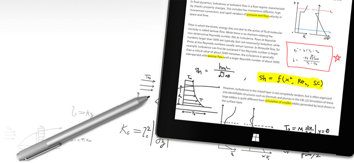
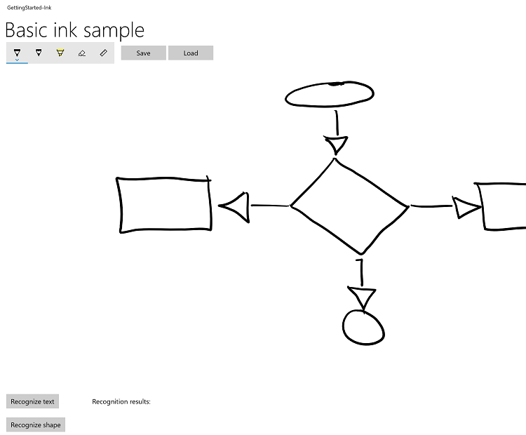

# Tutorial: Support ink in your Windows app

  
*Surface Pen* (available for purchase at the [Microsoft Store](https://www.microsoft.com/p/surface-pen/8zl5c82qmg6b)).

This tutorial steps through how to create a basic Windows app that supports writing and drawing with Windows Ink. We use snippets from a sample app, which you can download from GitHub (see [Sample code](#sample-code)), to demonstrate the various features and associated Windows Ink APIs (see [Components of the Windows Ink platform](#components-of-the-windows-ink-platform)) discussed in each step.

We focus on the following:
* Adding basic ink support
* Adding an ink toolbar
* Supporting handwriting recognition
* Supporting basic shape recognition
* Saving and loading ink

For more detail about implementing these features, see [Pen interactions and Windows Ink in Windows apps](./pen-and-stylus-interactions.md).

## Introduction

With Windows Ink, you can provide your customers with the digital equivalent of almost any pen-and-paper experience imaginable, from quick, handwritten notes and annotations to whiteboard demos, and from architectural and engineering drawings to personal masterpieces.

## Prerequisites

* A computer (or a virtual machine) running the current version of Windows 10
* [Visual Studio 2019 and the RS2 SDK](https://developer.microsoft.com/windows/downloads)
* [Windows 10 SDK (10.0.15063.0)](https://developer.microsoft.com/windows/downloads/windows-10-sdk)
* Depending on your configuration, you might have to install the [Microsoft.NETCore.UniversalWindowsPlatform](https://www.nuget.org/packages/Microsoft.NETCore.UniversalWindowsPlatform) NuGet package and enable **Developer mode** in your system settings (Settings -> Update & Security -> For developers -> Use developer features).
* If you're new to Windows app development with Visual Studio, have a look through these topics before you start this tutorial:  
    * [Get set up](../../get-started/get-set-up.md)
    * [Create a "Hello, world" app (XAML)](../../get-started/create-a-hello-world-app-xaml-universal.md)
* **[OPTIONAL]** A digital pen and a computer with a display that supports input from that digital pen.

> [!NOTE] 
> While Windows Ink can support drawing with a mouse and touch (we show how to do this in Step 3 of this tutorial) for an optimal Windows Ink experience, we recommend that you have a digital pen and a computer with a display that supports input from that digital pen.

## Sample code
Throughout this tutorial, we use a sample ink app to demonstrate the concepts and functionality discussed.

Download this Visual Studio sample and source code from [GitHub](https://github.com/) at [windows-appsample-get-started-ink sample](https://github.com/Microsoft/Windows-tutorials-inputs-and-devices/tree/master/GettingStarted-Ink):

1. Select the green **Clone or download** button  

2. If you have a GitHub account, you can clone the repo to your local machine by choosing **Open in Visual Studio** 
3. If you don't have a GitHub account, or you just want a local copy of the project, choose **Download ZIP** (you'll have to check back regularly to download the latest updates)

> [!IMPORTANT]
> Most of the code in the sample is commented out. As we go through each step, you'll be asked to uncomment various sections of the code. In Visual Studio, just highlight the lines of code, and press CTRL-K and then CTRL-U.

## Components of the Windows Ink platform

These objects provide the bulk of the inking experience for Windows apps.

| Component | Description |
| --- | --- |
| [**InkCanvas**](/uwp/api/windows.ui.xaml.controls.inkcanvas) | A XAML UI platform control that, by default, receives and displays all input from a pen as either an ink stroke or an erase stroke. |
| [**InkPresenter**](/uwp/api/Windows.UI.Input.Inking.InkPresenter) | A code-behind object, instantiated along with an [**InkCanvas**](/uwp/api/Windows.UI.Xaml.Controls.InkCanvas) control (exposed through the [**InkCanvas.InkPresenter**](/uwp/api/windows.ui.xaml.controls.inkcanvas.InkPresenter) property). This object provides all default inking functionality exposed by the [**InkCanvas**](/uwp/api/windows.ui.xaml.controls.inkcanvas), along with a comprehensive set of APIs for additional customization and personalization. |
| [**InkToolbar**](/uwp/api/Windows.UI.Xaml.Controls.InkToolbar) | A XAML UI platform control containing a customizable and extensible collection of buttons that activate ink-related features in an associated [**InkCanvas**](/uwp/api/windows.ui.xaml.controls.inkcanvas). |
| [**IInkD2DRenderer**](/windows/desktop/api/inkrenderer/nn-inkrenderer-iinkd2drenderer)<br/>We do not cover this functionality here, for more information, see the [Complex ink sample](https://github.com/Microsoft/Windows-universal-samples/tree/master/Samples/ComplexInk). | Enables the rendering of ink strokes onto the designated Direct2D device context of a Universal Windows app, instead of the default [**InkCanvas**](/uwp/api/Windows.UI.Xaml.Controls.InkCanvas) control. |

## Step 1: Run the sample

After you've downloaded the RadialController sample app, verify that it runs:
1. Open the sample project in Visual Studio.
2. Set the **Solution Platforms** dropdown to a non-ARM selection.
3. Press F5 to compile, deploy, and run.  

   > [!NOTE]
   > Alternatively, you can select **Debug** > **Start debugging** menu item, or select the **Local Machine** Run button shown here.
   > 

The app window opens, and after a splash screen appears for a few seconds, you’ll see this initial screen.


Okay, we now have the basic Windows app that we’ll use throughout the rest of this tutorial. In the following steps, we add our ink functionality.

## Step 2: Use InkCanvas to support basic inking

Perhaps you've probably already noticed that the app, in it's initial form, doesn't let you draw anything with the pen (although you can use the pen as a standard pointer device to interact with the app). 

Let's fix that little shortcoming in this step.

To add basic inking functionality, just place an [**InkCanvas**](/uwp/api/Windows.UI.Xaml.Controls.InkCanvas) control on the appropriate page in your app.

> [!NOTE]
> An InkCanvas has default [**Height**](/uwp/api/windows.ui.xaml.frameworkelement.Height) and [**Width**](/uwp/api/windows.ui.xaml.frameworkelement.Width) properties of zero, unless it is the child of an element that automatically sizes its child elements. 

### In the sample:
1. Open the MainPage.xaml.cs file.
2. Find the code marked with the title of this step ("// Step 2: Use InkCanvas to support basic inking").
3. Uncomment the following lines. (These references are required for the functionality used in the subsequent steps).  

``` csharp
    using Windows.UI.Input.Inking;
    using Windows.UI.Input.Inking.Analysis;
    using Windows.UI.Xaml.Shapes;
    using Windows.Storage.Streams;
```

4. Open the MainPage.xaml file.
5. Find the code marked with the title of this step ("\<!-- Step 2: Basic inking with InkCanvas -->").
6. Uncomment the following line.  

``` xaml
    <InkCanvas x:Name="inkCanvas" />
```

That's it! 

Now run the app again. Go ahead and scribble, write your name, or (if you're holding a mirror or have a very good memory) draw your self-portrait.


## Step 3: Support inking with touch and mouse

You'll notice that, by default, ink is supported for pen input only. If you try to write or draw with your finger, your mouse, or your touchpad, you'll be disappointed.

To turn that frown upside down , you need to add a second line of code. This time it’s in the code-behind for the XAML file in which you declared your [**InkCanvas**](/uwp/api/windows.ui.xaml.controls.inkcanvas). 

In this step, we introduce the [**InkPresenter**](/uwp/api/windows.ui.input.inking.inkpresenter) object, which provides finer-grained management of the input, processing, and rendering of ink input (standard and modified) on your [**InkCanvas**](/uwp/api/windows.ui.xaml.controls.inkcanvas).

> [!NOTE]
> Standard ink input (pen tip or eraser tip/button) is not modified with a secondary hardware affordance, such as a pen barrel button, right mouse button, or similar mechanism. 

To enable mouse and touch inking, set the [**InputDeviceTypes**](/uwp/api/windows.ui.input.inking.inkpresenter.InputDeviceTypes) property of the [**InkPresenter**](/uwp/api/windows.ui.input.inking.inkpresenter) to the combination of [**CoreInputDeviceTypes**](/uwp/api/windows.ui.core.coreinputdevicetypes) values that you want.

### In the sample:
1. Open the MainPage.xaml.cs file.
2. Find the code marked with the title of this step ("// Step 3: Support inking with touch and mouse").
3. Uncomment the following lines.  

``` csharp
    inkCanvas.InkPresenter.InputDeviceTypes =
        Windows.UI.Core.CoreInputDeviceTypes.Mouse | 
        Windows.UI.Core.CoreInputDeviceTypes.Touch | 
        Windows.UI.Core.CoreInputDeviceTypes.Pen;
```

Run the app again and you'll find that all your finger-painting-on-a-computer-screen dreams have come true!

> [!NOTE]
> When specifying input device types, you must indicate support for each specific input type (including pen), because setting this property overrides the default [**InkCanvas**](/uwp/api/windows.ui.xaml.controls.inkcanvas) setting.

## Step 4: Add an ink toolbar

The [**InkToolbar**](/uwp/api/windows.ui.xaml.controls.inktoolbar) is a UWP platform control that provides a customizable and extensible collection of buttons for activating ink-related features. 

By default, the [**InkToolbar**](/uwp/api/windows.ui.xaml.controls.inktoolbar) includes a basic set of buttons that let users quickly select between a pen, a pencil, a highlighter, or an eraser, any of which can be used together with a stencil (ruler or protractor). The pen, pencil, and highlighter buttons each also provide a flyout for selecting ink color and stroke size.

To add a default [**InkToolbar**](/uwp/api/windows.ui.xaml.controls.inktoolbar) to an inking app, just place it on the same page as your [**InkCanvas**](/uwp/api/windows.ui.xaml.controls.inkcanvas) and associate the two controls.

### In the sample
1. Open the MainPage.xaml file.
2. Find the code marked with the title of this step ("\<!-- Step 4: Add an ink toolbar -->").
3. Uncomment the following lines.  

``` xaml
    <InkToolbar x:Name="inkToolbar" 
                        VerticalAlignment="Top" 
                        Margin="10,0,10,0"
                        TargetInkCanvas="{x:Bind inkCanvas}">
    </InkToolbar>
```

> [!NOTE]
> To keep the UI and code as uncluttered and simple as possible, we use a basic Grid layout and declare the [**InkToolbar**](/uwp/api/windows.ui.xaml.controls.inktoolbar) after the [**InkCanvas**](/uwp/api/windows.ui.xaml.controls.inkcanvas) in a grid row. If you declare it before the [**InkCanvas**](/uwp/api/windows.ui.xaml.controls.inkcanvas), the [**InkToolbar**](/uwp/api/windows.ui.xaml.controls.inktoolbar) is rendered first, below the canvas and inaccessible to the user.  

Now run the app again to see the [**InkToolbar**](/uwp/api/windows.ui.xaml.controls.inktoolbar) and try out some of the tools.


### Challenge: Add a custom button
<table class="wdg-noborder">
<tr>
<td>


</td>
<td>

Here's an example of a custom **[InkToolbar](/uwp/api/windows.ui.xaml.controls.inktoolbar)** (from Sketchpad in the Windows Ink Workspace).


For more details about customizing an [InkToolbar](/uwp/api/windows.ui.xaml.controls.inktoolbar), see [Add an InkToolbar to a Windows app inking app](ink-toolbar.md).

</td>
</tr>
</table>

## Step 5: Support handwriting recognition

Now that you can write and draw in your app, let's try to do something useful with those scribbles.

In this step, we use the handwriting recognition features of Windows Ink to try to decipher what you've written.

> [!NOTE]
> Handwriting recognition can be improved through the **Pen & Windows Ink** settings:
> 1. Open the Start menu and select **Settings**.
> 2. From the Settings screen select **Devices** > **Pen & Windows Ink**.
> 
> 3. Select **Get to know my handwriting** to open the **Handwriting Personalization** dialog.
> 

### In the sample:
1. Open the MainPage.xaml file.
2. Find the code marked with the title of this step ("\<!-- Step 5: Support handwriting recognition -->").
3. Uncomment the following lines.  

``` xaml
    <Button x:Name="recognizeText" 
            Content="Recognize text"  
            Grid.Row="0" Grid.Column="0"
            Margin="10,10,10,10"
            Click="recognizeText_ClickAsync"/>
    <TextBlock x:Name="recognitionResult" 
                Text="Recognition results: "
                VerticalAlignment="Center" 
                Grid.Row="0" Grid.Column="1"
                Margin="50,0,0,0" />
```

4. Open the MainPage.xaml.cs file.
5. Find the code marked with the title of this step (" Step 5: Support handwriting recognition").
6. Uncomment the following lines.  

- These are the global variables required for this step.

``` csharp
    InkAnalyzer analyzerText = new InkAnalyzer();
    IReadOnlyList<InkStroke> strokesText = null;
    InkAnalysisResult resultText = null;
    IReadOnlyList<IInkAnalysisNode> words = null;
```

- This is the handler for the **Recognize text** button, where we do the recognition processing.

``` csharp
    private async void recognizeText_ClickAsync(object sender, RoutedEventArgs e)
    {
        strokesText = inkCanvas.InkPresenter.StrokeContainer.GetStrokes();
        // Ensure an ink stroke is present.
        if (strokesText.Count > 0)
        {
            analyzerText.AddDataForStrokes(strokesText);

            resultText = await analyzerText.AnalyzeAsync();

            if (resultText.Status == InkAnalysisStatus.Updated)
            {
                words = analyzerText.AnalysisRoot.FindNodes(InkAnalysisNodeKind.InkWord);
                foreach (var word in words)
                {
                    InkAnalysisInkWord concreteWord = (InkAnalysisInkWord)word;
                    foreach (string s in concreteWord.TextAlternates)
                    {
                        recognitionResult.Text += s;
                    }
                }
            }
            analyzerText.ClearDataForAllStrokes();
        }
    }
```

7. Run the app again, write something, and then click the **Recognize text** button
8. The results of the recognition are displayed beside the button

### Challenge 1: International recognition
<table class="wdg-noborder">
<tr>
<td>


</td>
<td>

Windows Ink supports text recognition for many of the of the languages supported by Windows. Each language pack includes a handwriting recognition engine that can be installed with the language pack.

Target a specific language by querying the installed handwriting recognition engines.

For more details about international handwriting recognition, see [Recognize Windows Ink strokes as text](convert-ink-to-text.md).

</td>
</tr>
</table>

### Challenge 2: Dynamic recognition
<table class="wdg-noborder">
<tr>
<td>


</td>
<td>

For this tutorial, we require that a button be pressed to initiate recognition. You can also perform dynamic recognition by using a basic timing function.

For more details about dynamic recognition, see [Recognize Windows Ink strokes as text](convert-ink-to-text.md).

</td>
</tr>
</table>

## Step 6: Recognize shapes

Ok, so now you can convert your handwritten notes into something a little more legible. But what about those shaky, caffeinated doodles from your morning Flowcharters Anonymous meeting?

Using ink analysis, your app can also recognize a set of core shapes, including:

- Circle
- Diamond
- Drawing
- Ellipse
- EquilateralTriangle
- Hexagon
- IsoscelesTriangle
- Parallelogram
- Pentagon
- Quadrilateral
- Rectangle
- RightTriangle
- Square
- Trapezoid
- Triangle

In this step, we use the shape-recognition features of Windows Ink to try to clean up your doodles.

For this example, we don't attempt to redraw ink strokes (although that's possible). Instead, we add a standard canvas under the InkCanvas where we draw equivalent Ellipse or Polygon objects derived from the original ink. We then delete the corresponding ink strokes.

### In the sample:
1. Open the MainPage.xaml file
2. Find the code marked with the title of this step ("\<!-- Step 6: Recognize shapes -->")
3. Uncomment this line.  

``` xaml
   <Canvas x:Name="canvas" />

   And these lines.

    <Button Grid.Row="1" x:Name="recognizeShape" Click="recognizeShape_ClickAsync"
        Content="Recognize shape" 
        Margin="10,10,10,10" />
```

4. Open the MainPage.xaml.cs file
5. Find the code marked with the title of this step ("// Step 6: Recognize shapes")
6. Uncomment these lines:  

``` csharp
    private async void recognizeShape_ClickAsync(object sender, RoutedEventArgs e)
    {
        ...
    }

    private void DrawEllipse(InkAnalysisInkDrawing shape)
    {
        ...
    }

    private void DrawPolygon(InkAnalysisInkDrawing shape)
    {
        ...
    }
```

7. Run the app, draw some shapes, and click the **Recognize shape** button

Here's an example of a rudimentary flowchart from a digital napkin.



Here's the same flowchart after shape recognition.


## Step 7: Save and load ink

So, you're done doodling and you like what you see, but think you might like to tweak a couple of things later? You can save your ink strokes to an Ink Serialized Format (ISF) file and load them for editing whenever the inspiration strikes. 

The ISF file is a basic GIF image that includes additional metadata describing ink-stroke properties and behaviors. Apps that are not ink enabled can ignore the extra metadata and still load the basic GIF image (including alpha-channel background transparency).

In this step, we hook up the **Save** and **Load** buttons located beside the ink toolbar.

### In the sample:
1. Open the MainPage.xaml file.
2. Find the code marked with the title of this step ("\<!-- Step 7: Saving and loading ink -->").
3. Uncomment the following lines. 

``` xaml
    <Button x:Name="buttonSave" 
            Content="Save" 
            Click="buttonSave_ClickAsync"
            Width="100"
            Margin="5,0,0,0"/>
    <Button x:Name="buttonLoad" 
            Content="Load"  
            Click="buttonLoad_ClickAsync"
            Width="100"
            Margin="5,0,0,0"/>
```

4. Open the MainPage.xaml.cs file.
5. Find the code marked with the title of this step ("// Step 7: Save and load ink").
6. Uncomment the following lines.  

``` csharp
    private async void buttonSave_ClickAsync(object sender, RoutedEventArgs e)
    {
        ...
    }

    private async void buttonLoad_ClickAsync(object sender, RoutedEventArgs e)
    {
        ...
    }
```

7. Run the app and draw something.
8. Select the **Save** button and save your drawing.
9. Erase the ink or restart the app.
10. Select the **Load** button and open the ink file you just saved.

### Challenge: Use the clipboard to copy and paste ink strokes 
<table class="wdg-noborder">
<tr>
<td>


</td>

<td>

Windows ink also supports copying and pasting ink strokes to and from the clipboard.

For more details about using the clipboard with ink, see [Store and retrieve Windows Ink stroke data](save-and-load-ink.md).

</td>
</tr>
</table>

## Summary

Congratulations, you've completed the **Input: Support ink in your Windows app** tutorial ! We showed you the basic code required for supporting ink in your Windows apps, and how to provide some of the richer user experiences supported by the Windows Ink platform.

## Related articles

* [Pen interactions and Windows Ink in Windows apps](pen-and-stylus-interactions.md)

### Samples

* [Ink analysis sample (basic) (C#)](https://github.com/MicrosoftDocs/windows-topic-specific-samples/archive/uwp-ink-analysis-basic.zip)
* [Ink handwriting recognition sample (C#)](https://github.com/MicrosoftDocs/windows-topic-specific-samples/archive/uwp-ink-handwriting-reco.zip)
* [Save and load ink strokes from an Ink Serialized Format (ISF) file](https://github.com/MicrosoftDocs/windows-topic-specific-samples/archive/uwp-ink-store.zip)
* [Save and load ink strokes from the clipboard](https://github.com/MicrosoftDocs/windows-topic-specific-samples/archive/uwp-ink-store-clipboard.zip)
* [Ink toolbar location and orientation sample (basic)](https://github.com/MicrosoftDocs/windows-topic-specific-samples/archive/uwp-ink-toolbar-handedness.zip)
* [Ink toolbar location and orientation sample (dynamic)](https://github.com/MicrosoftDocs/windows-topic-specific-samples/archive/uwp-ink-toolbar-handedness-dynamic.zip)
* [Simple ink sample (C#/C++)](https://github.com/Microsoft/Windows-universal-samples/tree/master/Samples/SimpleInk)
* [Complex ink sample (C++)](https://github.com/Microsoft/Windows-universal-samples/tree/master/Samples/ComplexInk)
* [Ink sample (JavaScript)](https://github.com/microsoftarchive/msdn-code-gallery-microsoft/tree/411c271e537727d737a53fa2cbe99eaecac00cc0/Official%20Windows%20Platform%20Sample/Windows%208%20app%20samples/%5BJavaScript%5D-Windows%208%20app%20samples/JavaScript/Windows%208%20app%20samples/Input%20Ink%20sample%20(Windows%208))
* [Get Started Tutorial: Support ink in your Windows app](https://github.com/Microsoft/Windows-tutorials-inputs-and-devices/tree/master/GettingStarted-Ink)
* [Coloring book sample](https://github.com/Microsoft/Windows-appsample-coloringbook)
* [Family notes sample](https://github.com/Microsoft/Windows-appsample-familynotes)
