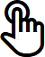
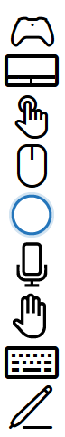

# Interaction primer

User interactions in the Windows app are a combination of input and output sources (such as mouse, keyboard, pen, touch, touchpad, speech, **Cortana**, controller, gesture, gaze, and so on), along with various modes or modifiers that enable extended experiences (including mouse wheel and buttons, pen eraser and barrel buttons, touch keyboard, and background app services).

UWP uses a "smart" contextual interaction system that, in most cases, eliminates the need to individually handle the unique types of input received by your app. This includes handling touch, touchpad, mouse, and pen input as a generic pointer type to support static gestures such as tap or press-and-hold, manipulation gestures such as slide for panning, or rendering digital ink.

Familiarize yourself with each input device type and its behaviors, capabilities, and limitations when paired with certain form factors. This can help you decide whether the platform controls and affordances are sufficient for your app, or require you to provide customized interaction experiences.

## Gaze

For **Windows 10 April 2018 Update**, we introduced support for Gaze input using eye and head tracking input devices. 

> [!NOTE]
> Support for eye tracking hardware was introduced in **Windows 10 Fall Creators Update** along with [Eye control](https://support.microsoft.com/help/4043921/windows-10-get-started-eye-control), a built-in feature that lets you use your eyes to control the on-screen pointer, type with the on-screen keyboard, and communicate with people using text-to-speech.

### Device support

- Tablet
- PCs and laptops

### Typical usage

Track a user's gaze, attention, and presence based on the location and movement of their eyes. This powerful new way to use and interact with Windows apps is especially useful as an assistive technology for users with neuro-muscular diseases (such as ALS) and other disabilities involving impaired muscle or nerve functions. Gaze input also provides compelling opportunities for both gaming (including target acquisition and tracking) and traditional productivity applications, kiosks, and other interactive scenarios where traditional input devices (keyboard, mouse, touch) are not available, or where it might be useful/helpful to free up the user's hands for other tasks (such as holding shopping bags).

### More info

[Gaze interactions and eye tracking](gaze-interactions.md)

## Surface Dial

For **Windows 10 Anniversary Update**, we introduced the Windows Wheel category of input device. The Surface Dial is the first in this class of device.

### Device support

- Tablet
- PCs and laptops

### Typical usage

With a form factor based on a rotate action (or gesture), the Surface Dial is intended as a secondary, multi-modal input device that complements or modifies input from a primary device. In most cases, the device is manipulated by a user's non-dominant hand while they perform a task with their dominant hand (such as inking with a pen).

### More info

[Surface Dial design guidelines](windows-wheel-interactions.md)

## Cortana

In Windows 10, **Cortana** extensibility lets you handle voice commands from a user and launch your application to carry out a single action.

### Device support

-   Phones and phablets
-   Tablet
-   PCs and laptops
-   Surface Hub
-   IoT
-   Xbox
-   HoloLens

### Typical usage

A voice command is a single utterance, defined in a Voice Command Definition (VCD) file, directed at an installed app through **Cortana**. The app can be launched in the foreground or background, depending on the level and complexity of the interaction. For instance, voice commands that require additional context or user input are best handled in the foreground, while basic commands can be handled in the background.

Integrating the basic functionality of your app, and providing a central entry point for the user to accomplish most of the tasks without opening your app directly, lets **Cortana** become a liaison between your app and the user. In many cases, this can save the user significant time and effort. For more info, see [Cortana design guidelines](/cortana/skills/cortana-design-guidelines).

### More info

[Cortana design guidelines](/cortana/skills/cortana-design-guidelines)
 

## Speech

Speech is an effective and natural way for people to interact with applications. It's an easy and accurate way to communicate with applications, and lets people be productive and stay informed in a variety of situations.

Speech can complement or, in many cases, be the primary input type, depending on the user's device. For example, devices such as HoloLens and Xbox do not support traditional input types (aside from a software keyboard in specific scenarios). Instead, they rely on speech input and output (often combined with other non-traditional input types such as gaze and gesture) for most user interactions.

Text-to-speech (also known as TTS, or speech synthesis) is used to inform or direct the user.

### Device support

-   Phones and phablets
-   Tablet
-   PCs and laptops
-   Surface Hub
-   IoT
-   Xbox
-   HoloLens

### Typical usage

There are three modes of Speech interaction:

**Natural language**

Natural language is how we verbally interact with people on a regular basis. Our speech varies from person to person and situation to situation, and is generally understood. When it's not, we often use different words and word order to get the same idea across.

Natural language interactions with an app are similar: we speak to the app through our device as if it were a person and expect it to understand and react accordingly.

Natural language is the most advanced mode of speech interaction, and can be implemented and exposed through **Cortana**.

**Command and control**

Command and control is the use of verbal commands to activate controls and functionality such as clicking a button or selecting a menu item.

As command and control is critical to a successful user experience, a single input type is generally not recommended. Speech is typically one of several input options for a user based on their preferences or hardware capabilities.

**Dictation**

The most basic speech input method. Each utterance is converted to text.

Dictation is typically used when an app doesn’t need to understand meaning or intent.

### More info

[Speech design guidelines](./speech-interactions.md)
 

## Pen

A pen (or stylus) can serve as a pixel precise pointing device, like a mouse, and is the optimal device for digital ink input.

**Note**  There are two types of pen devices: active and passive.
  -   Passive pens do not contain electronics, and effectively emulate touch input from a finger. They require a basic device display that recognizes input based on contact pressure. Because users often rest their hand as they write on the input surface, input data can become polluted due to unsuccessful palm rejection.
  -   Active pens contain electronics and can work with complex device displays to provide much more extensive input data (including hover, or proximity data) to the system and your app. Palm rejection is much more robust.

When we refer to pen devices here, we are referring to active pens that provide rich input data and are used primarily for precise ink and pointing interactions.

### Device support

-   Phones and phablets
-   Tablet
-   PCs and laptops
-   Surface Hub
-   IoT

### Typical usage

The Windows ink platform, together with a pen, provides a natural way to create handwritten notes, drawings, and annotations. The platform supports capturing ink data from digitizer input, generating ink data, rendering that data as ink strokes on the output device, managing the ink data, and performing handwriting recognition. In addition to capturing the spatial movements of the pen as the user writes or draws, your app can also collect info such as pressure, shape, color, and opacity, to offer user experiences that closely resemble drawing on paper with a pen, pencil, or brush.

Where pen and touch input diverge is the ability for touch to emulate direct manipulation of UI elements on the screen through physical gestures performed on those objects (such as swiping, sliding, dragging, rotating, and so on).

You should provide pen-specific UI commands, or affordances, to support these interactions. For example, use previous and next (or + and -) buttons to let users flip through pages of content, or rotate, resize, and zoom objects.

### More info

[Pen design guidelines](./pen-and-stylus-interactions.md)
 

## Touch

With touch, physical gestures from one or more fingers can be used to either emulate the direct manipulation of UI elements (such as panning, rotating, resizing, or moving), as an alternative input method (similar to mouse or pen), or as a complementary input method (to modify aspects of other input, such as smudging an ink stroke drawn with a pen). Tactile experiences such as this can provide more natural, real-world sensations for users as they interact with elements on a screen.

### Device support

-   Phones and phablets
-   Tablet
-   PCs and laptops
-   Surface Hub
-   IoT

### Typical usage

Support for touch input can vary significantly, depending on the device.

Some devices don't support touch at all, some devices support a single touch contact, while others support multi-touch (two or more contacts).

Most devices that support multi-touch input, typically recognize ten unique, concurrent contacts.

Surface Hub devices recognize 100 unique, concurrent touch contacts.

In general, touch is:

-   Single user, unless being used with a Microsoft Team device like Surface Hub, where collaboration is emphasized.
-   Not constrained to device orientation.
-   Used for all interactions, including text input (touch keyboard) and inking (app-configured).

### More info

[Touch design guidelines](./touch-interactions.md)
 

## Touchpad

A touchpad combines both indirect multi-touch input with the precision input of a pointing device, such as a mouse. This combination makes the touchpad suited to both a touch-optimized UI and the smaller targets of productivity apps.

### Device support

-   PCs and laptops
-   IoT

### Typical usage

Touchpads typically support a set of touch gestures that provide support similar to touch for direct manipulation of objects and UI.

Because of this convergence of interaction experiences supported by touchpads, we recommend also providing mouse-style UI commands or affordances rather than relying solely on support for touch input. Provide touchpad-specific UI commands, or affordances, to support these interactions.

You should provide mouse-specific UI commands, or affordances, to support these interactions. For example, use previous and next (or + and -) buttons to let users flip through pages of content, or rotate, resize, and zoom objects.

### More info

[Touchpad design guidelines](./touch-interactions.md)
 

## Keyboard

A keyboard is the primary input device for text, and is often indispensable to people with certain disabilities or users who consider it a faster and more efficient way to interact with an app.

With [Continuum for Phone](/windows-hardware/design/device-experiences/continuum-phone), a new experience for compatible Windows 10 mobile devices, users can connect their phones to a mouse and keyboard to make their phones work like a laptop.

### Device support

-   Phones and phablets
-   Tablet
-   PCs and laptops
-   Surface Hub
-   IoT
-   Xbox
-   HoloLens

### Typical usage

Users can interact with Universal Windows apps through a hardware keyboard and two software keyboards: the On-Screen Keyboard (OSK) and the touch keyboard.

The OSK is a visual, software keyboard that you can use instead of the physical keyboard to type and enter data using touch, mouse, pen/stylus or other pointing device (a touch screen is not required). The OSK is provided for systems that don't have a physical keyboard, or for users whose mobility impairments prevent them from using traditional physical input devices. The OSK emulates most, if not all, the functionality of a hardware keyboard.

The touch keyboard is a visual, software keyboard used for text entry with touch input. The touch keyboard is not a replacement for the OSK as it is used for text input only (it doesn't emulate the hardware keyboard) and appears only when a text field or other editable text control gets focus. The touch keyboard does not support app or system commands.

**Note**  The OSK has priority over the touch keyboard, which won't be shown if the OSK is present.

In general, a keyboard is:

-   Single user.
-   Not constrained to device orientation.
-   Used for text input, navigation, gameplay, and accessibility.
-   Always available, either proactively or reactively.

### More info

[Keyboard design guidelines](./keyboard-interactions.md)
 

## Mouse

A mouse is best suited for productivity apps and high-density UI where user interactions require pixel-level precision for targeting and commanding.

### Device support

-   Phones and phablets
-   Tablet
-   PCs and laptops
-   Surface Hub
-   IoT

### Typical usage

Mouse input can be modified with the addition of various keyboard keys (Ctrl, Shift, Alt, and so on). These keys can be combined with the left mouse button, the right mouse button, the wheel button, and the X buttons for an expanded mouse-optimized command set. (Some Microsoft mouse devices have two additional buttons, referred to as X buttons, typically used to navigate back and forward in Web browsers).

Similar to pen, where mouse and touch input diverge is the ability for touch to emulate direct manipulation of UI elements on the screen through physical gestures performed on those objects (such as swiping, sliding, dragging, rotating, and so on).

You should provide mouse-specific UI commands, or affordances, to support these interactions. For example, use previous and next (or + and -) buttons to let users flip through pages of content, or rotate, resize, and zoom objects.

### More info

[Mouse design guidelines](./mouse-interactions.md)
 

## Gesture

A gesture is any form of user movement that is recognized as input for controlling or interacting with an application. Gestures take many forms, from simply using a hand to target something on the screen, to specific, learned patterns of movement, to long stretches of continuous movement using the entire body. Be careful when designing custom gestures, as their meaning can vary depending on locale and culture.

### Device support

-   PCs and laptops
-   IoT
-   Xbox
-   HoloLens

### Typical usage

Static gesture events are fired after an interaction is complete.

- Static gesture events include Tapped, DoubleTapped, RightTapped, and Holding.

Manipulation gesture events indicate an ongoing interaction. They start firing when the user touches an element and continue until the user lifts their finger(s), or the manipulation is canceled.

- Manipulation events include multi-touch interactions such as zooming, panning, or rotating, and interactions that use inertia and velocity data such as dragging. (The information provided by the manipulation events doesn't identify the interaction, but rather provides data such as position, translation delta, and velocity.)

- Pointer events such as PointerPressed and PointerMoved provide low-level details for each touch contact, including pointer motion and the ability to distinguish press and release events.

Because of the convergence of interaction experiences supported by Windows, we recommend also providing mouse-style UI commands or affordances rather than relying solely on support for touch input. For example, use previous and next (or + and -) buttons to let users flip through pages of content, or rotate, resize, and zoom objects.

## Gamepad/Controller

The gamepad/controller is a highly specialized device typically dedicated to playing games. However, it is also used for to emulate basic keyboard input and provides a UI navigation experience very similar to the keyboard.

### Device support

-   PCs and laptops
-   IoT
-   Xbox

### Typical usage

Playing games and interacting with a specialized console.

## Multiple inputs

Accommodating as many users and devices as possible and designing your apps to work with as many input types (gesture, speech, touch, touchpad, mouse, and keyboard) as possible maximizes flexibility, usability, and accessibility.

### Device support

-   Phones and phablets
-   Tablet
-   PCs and laptops
-   Surface Hub
-   IoT
-   Xbox
-   HoloLens

### Typical usage

Just as people use a combination of voice and gesture when communicating with each other, multiple types and modes of input can also be useful when interacting with an app. However, these combined interactions need to be as intuitive and natural as possible as they can also create a very confusing experience.

 

 