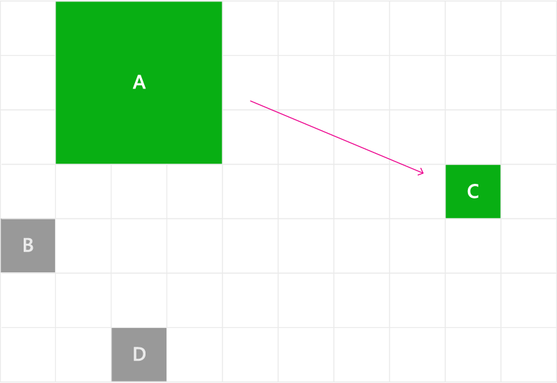

# Focus navigation with keyboard, gamepad, and accessibility tools

Many input namely keyboard, accessibility tools such as Windows
Narrator, gamepad, and remote control share common underling mechanism
to move focus visual around your applications’ UI. Read more about focus
visual and navigation at [Keyboard Interaction](keyboard-interactions.md)
document as well as [Designing for Xbox and TV](../devices/designing-for-tv.md#xy-focus-navigation-and-interaction)
document.

Following provide input agnostic way for application to move focus
around the application’s UI which enable you to write single code that
make your application work great with multiple input types.

## Navigation Strategies properties to fine tune focus movements

Use the XYFocus navigation strategy properties to specify which control
should receive focus based on the arrow key pressed. These properties
are:

-   XYFocusUpNavigationStrategy
-   XYFocusDownNavigationStrategy
-   XYFocusLeftNavigationStrategy
-   XYFocusRightNavigationStrategy

These properties have a value of type value of type
**XYFocusNavigationStrategy**. If set to **Auto**, the behavior of the
element is based on the ancestors of the element. If all elements are
set to **Auto**, **Projection** is used.

These navigation strategies are applicable to keyboard, gamepad, and
remote control.

### Projection

The Projection strategy moves focus to the first element encountered when projecting the edge of the currently focused element in the  direction of navigation.

> [!NOTE]
> Other factors, such as the previously focused element and proximity to the axis of the navigation direction, can influence the result.


*Focus moves from A to D on down navigation based on projection of the bottom edge of A*

### NavigationDirectionDistance

The NavigationDirectionDistance strategy moves focus to the element closest to the axis of the navigation direction.

The edge of the bounding rect corresponding to the navigation direction is extended and projected to identify candidate targets. The first element encountered is identified as the target. In the case of multiple candidates, the closest element is identified as the target. If there are still multiple candidates, the topmost/leftmost element is identified as the candidate.



*Focus moves from A to C and then from C to B on down navigation*


### RectilinearDistance

The RectilinearDistance strategy moves focus to the closest element
based on the shortest 2D distance (Manhattan metric). This distance is
calculated by adding the primary distance and the secondary distance of
each potential candidate. In a tie, the first element to the left is
selected if the direction is up or down, or the first element to the top
is selected if the direction is left or right.

In the following image, we show that when A has focus, focus is moved to
B because:

-   Distance (A, B, Down) = 10 + 0 = 10
-   Distance (A, C, Down) = 0 + 30 = 30
-   Distance (A, D, Down) 30 + 0 = 30


*When A has focus, focus is moved to B when using the
RectilinearDistance strategy*

The following image shows how the navigation strategy is applied to the
element itself, not the child elements (unlike
XYFocusKeyboardNavigation).

For example, when E has focus, pressing right moves focus to F using the
RectilinearDistance strategy, but when D has focus, pressing right moves
focus to H when using the Projection strategy.

Notice that main container strategy (Navigation Direction Distance) is
not applied. It is only used when the focus is on H, F, or G.


*Different focus behaviors based on navigation strategy applied*

The following example simulates the behavior of the Tiles panel from the
Windows 10 Start menu. In this case, pressing the up and down arrow uses
the NavigationDirectionDistance strategy, and pressing the left and
right arrow uses the Projection strategy.

```XAML
<start:TileGridView
        XYFocusKeyboardNavigation ="Default"
        XYFocusUpNavigationStrategy=" NavigationDirectionDistance "
        XYFocusDownNavigationStrategy=" NavigationDirectionDistance "
        XYFocusLeftNavigationStrategy="Projection"
        XYFocusRightNavigationStrategy="Projection"
/>
```

## Move focus programmatically

Use either the
[FocusManager.TryMoveFocus](http://msdn.microsoft.com/en-us/library/windows/apps/xaml/Windows.UI.Xaml.Input.FocusManager.TryMoveFocus)
method or the
[FocusManager.FindNextElement](http://msdn.microsoft.com/en-us/library/windows/apps/xaml/Windows.UI.Xaml.Input.FocusManager.FindNextFocusableElement)
method to programmatically move focus.

TryMoveFocus sets focus as if a navigation key was pressed.
FindNextElement returns the element (a DependencyObject) that
TryMoveFocus would move to.

**NOTE** We recommend using the **FindNextElement** method instead of
**FindNextFocusableElement**. FindNextFocusableElement tries to return
a UIElement, but if the next focusable element is a Hyperlink, it
returns null because a Hyperlink is not a UIElement. FindNextElement
method returns a DependencyObject instead.

### Find a focus candidate in a scope

FocusManager.FindNextElement and FocusManager.TryMoveFocus both let you
customize the next focusable element search behavior. You can search
within a specific UI tree, or exclude elements in a specific navigation
area.

This example is taken from an implementation of a TicTacToe game and
demonstrates how to use the FindNextElement and TryMoveFocus methods:

```XAML
<StackPanel Orientation="Horizontal"
                VerticalAlignment="Center"
                HorizontalAlignment="Center" >
        <Button Content="Start Game" />
        <Button Content="Undo Movement" />
        <Grid x:Name="TicTacToeGrid" KeyDown="OnKeyDown">
            <Grid.ColumnDefinitions>
                <ColumnDefinition Width="50" />
                <ColumnDefinition Width="50" />
                <ColumnDefinition Width="50" />
            </Grid.ColumnDefinitions>
            <Grid.RowDefinitions>
                <RowDefinition Height="50" />
                <RowDefinition Height="50" />
                <RowDefinition Height="50" />
            </Grid.RowDefinitions>
            <myControls:TicTacToeCell Grid.Column="0" Grid.Row="0" x:Name="Cell00" />
            <myControls:TicTacToeCell Grid.Column="1" Grid.Row="0" x:Name="Cell10"/>
            <myControls:TicTacToeCell Grid.Column="2" Grid.Row="0" x:Name="Cell20"/>
            <myControls:TicTacToeCell Grid.Column="0" Grid.Row="1" x:Name="Cell01"/>
            <myControls:TicTacToeCell Grid.Column="1" Grid.Row="1" x:Name="Cell11"/>
            <myControls:TicTacToeCell Grid.Column="2" Grid.Row="1" x:Name="Cell21"/>
            <myControls:TicTacToeCell Grid.Column="0" Grid.Row="2" x:Name="Cell02"/>
            <myControls:TicTacToeCell Grid.Column="1" Grid.Row="2" x:Name="Cell22"/>
            <myControls:TicTacToeCell Grid.Column="2" Grid.Row="2" x:Name="Cell32"/>
        </Grid>
    </StackPanel>
```
```csharp
private void OnKeyDown(object sender, KeyRoutedEventArgs e)
        {
            DependencyObject candidate = null;

            var options = new FindNextElementOptions ()
            {
                SearchRoot = TicTacToeGrid,
                NavigationStrategy = NavigationStrategyMode.Heuristic
            };

            switch (e.Key)
            {
                case Windows.System.VirtualKey.Up:
                    candidate = FocusManager.FindNextElement(FocusNavigationDirection.Up, options);
                    break;
                case Windows.System.VirtualKey.Down:
                    candidate = FocusManager.FindNextElement(FocusNavigationDirection.Down, options);
                    break;
                case Windows.System.VirtualKey.Left:
                    candidate = FocusManager.FindNextElement(FocusNavigationDirection.Left, options);
                    break;
                case Windows.System.VirtualKey.Right:
                    candidate = FocusManager.FindNextElement(FocusNavigationDirection.Right, options);
                    break;
            }
	     //Note you should also consider whether is a Hyperlink, WebView, or TextBlock.
            if (candidate != null && candidate is Control)
            {
                (candidate as Control).Focus(FocusState.Keyboard);
            }
        }
```

**NOTE** FocusNavigationDirection.Left and FocusNavigationDirection.Right
are logical (near and far) to support RTL scenarios. (This matches the
rest of Xaml.)

The search for focus candidates can be adjusted using the
FindNextElementOptions class. This object has the following properties:

-   **SearchRoot** DependencyObject: To scope the search of candidates
    to the children of this DependencyObject. Null value indicates the
    entire visual tree of the app.
-   **ExclusionRect** Rect: To exclude from the search the items that,
    when are rendered, overlap at least one pixel from this rectangle.
-   **HintRect** Rect: Potential candidates are calculated using the
    focused item as reference. This rectangle lets developers specify
    another reference instead of the focused element. The rectangle is a
    “fictitious” rectangle used only for calculations. It is never
    converted to a real rectangle and added to the visual tree.
-   **XYFocusNavigationStrategyOverride**
    XYFocusNavigationStrategyOverride: The navigation strategy used to
    move the focus. The type is an enum with the values None (which is
    the zero value), Auto, RectilinearDistance,
    NavigationDirectionDistance and Projection.
**Important** **SearchRoot** is not used to calculate the rendered
(geometric) area or to get the candidates inside the area. As a
consequence, if transforms are applied to the descendants of the
DependencyObject that place them outside of the directional area, these
elements are still considered candidates.

The options overload of FindNextElement cannot be used with tab
navigation, it only supports directional navigation.

The following image illustrates these options.

For example, when B has focus, calling FindNextElement (with various
options set to indicate that focus moves to the right) sets focus on I.
The reasons for this are:

1.  The reference is not B, it is A due to the HintRect
2.  C is excluded because the potential candidate should be on MyPanel
    (the SearchRoot)
3.  F is excluded because it overlaps the exclusions rectangle


*Focus behavior based on navigation hints*

### No focus candidate available

The UIElement.NoFocusCandidateFound event is fired when the user
attempts to move focus with tab or arrow keys, but there is no possible
candidate in the specified direction. This event is not fired for
FocusManager.TryMoveFocus().

Because this is a routed event, it bubbles from the focused element up
through successive parent objects to the root of the object tree. In
this way, you can handle the event wherever appropriate.

<a name="split-view-code-sample"></a>
The following example shows a Grid that opens a split view when the user attempts to move focus to the left of the left-most focusable control as described in [Designing for TV documentation](../devices/designing-for-tv.md#navigation-pane).

```XAML
<Grid NoFocusCandidateFound="OnNoFocusCandidateFound">  ...</Grid>
```

```csharp
private void OnNoFocusCandidateFound (UIElement sender, NoFocusCandidateFoundEventArgs args)
{
            if(args.NavigationDirection == FocusNavigationDirection.Left)
            {
         if(args.InputDevice == FocusInputDeviceKind.Keyboard ||
            args.InputDevice == FocusInputDeviceKind.GameController )
                {
           		OpenSplitPaneView();
                }
            args.Handled = true;
            }
}
```

## Focus events

The
[UIElement.GotFocus](http://msdn.microsoft.com/en-us/library/windows/apps/xaml/Windows.UI.Xaml.UIElement.GotFocus)
and UIElement.LostFocus events are fired when a control gets focus or
loses focus, respectively. This event is not fired for
FocusManager.TryMoveFocus().

Because this is a routed event, it bubbles from the focused element up
through successive parent objects to the root of the object tree. In
this way, you can handle the event wherever appropriate.

The **UIElement.GettingFocus** and **UIElement.LosingFocus** events also
bubble from the control, but *before* the focus change takes place. This
gives the app an opportunity to redirect or cancel the focus change.

Note that the GettingFocus and LosingFocus events are synchronous, while
the GotFocus and LostFocus events are asynchronous. For example, if
focus moves because the app calls the Control.Focus() method,
GettingFocus is raised during the call, but GotFocus is raised sometime
after the call.

UIElements can hook onto the GettingFocus and LosingFocus events and
change the target (using the NewFocusedElement property) before the
focus is moved. Even if the target has changed, the event still bubbles
and another parent can change the target again.

To avoid reentrancy issues, exceptions are thrown if you try to move
focus (using FocusManager.TryMoveFocus or the Control.Focus) while these
events are bubbling.

These events are fired regardless of the reason for the focus moving
(for example, tab navigation, XYFocus navigation, programmatic).

The following image shows how, when moving from A to the right, the
XYFocus chooses LVI4 as a candidate. LVI4 then fires the GettingFocus
event where the ListView has the opportunity to reassign focus to LVI3.


*Focus events*

This code example shows how to handle the OnGettingFocus event and
redirect focus based on where focus was previously set.

```XAML
<StackPanel Orientation="Horizontal">
    <Button Content="A" />
    <ListView x:Name="MyListView" SelectedIndex="2" GettingFocus="OnGettingFocus">
        <ListViewItem>LV1</ListViewItem>
        <ListViewItem>LV2</ListViewItem>
        <ListViewItem>LV3</ListViewItem>
        <ListViewItem>LV4</ListViewItem>
        <ListViewItem>LV5</ListViewItem>
    </ListView>
</StackPanel>
```

```csharp
private void OnGettingFocus(UIElement sender, GettingFocusEventArgs args)
  {

                 //Redirect the focus only when the focus comes from outside of the ListView.
       // move the focus to the selected item
            if (MyListView.SelectedIndex != -1 && IsNotAChildOf(MyListView, args.OldFocusedElement))
            {
                var selectedContainer = MyListView.ContainerFromItem(MyListView.SelectedItem);
                if (args.FocusState == FocusState.Keyboard && args.NewFocusedElement != selectedContainer)
                {
                    args.NewFocusedElement = MyListView.ContainerFromItem(MyListView.SelectedItem);
                    args.Handled = true;
                }
            }        
  }
```

This code example shows how to handle the OnLosingFocus event for a
CommandBar object and wait to set focus until the DropDown menu is
closed.

```XAML
<CommandBar x:Name="MyCommandBar" LosingFocus="OnLosingFocus">
     <AppBarButton Icon="Back" Label="Back" />
     <AppBarButton Icon="Stop" Label="Stop" />
     <AppBarButton Icon="Play" Label="Play" />
     <AppBarButton Icon="Forward" Label="Forward" />

     <CommandBar.SecondaryCommands>
         <AppBarButton Icon="Like" Label="Like" />
         <AppBarButton Icon="Share" Label="Share" />
     </CommandBar.SecondaryCommands>
 </CommandBar>
```

```csharp
private void OnLosingFocus(UIElement sender, LosingFocusEventArgs args)
{
          if (MyCommandBar.IsOpen == true && IsNotAChildOf(MyCommandBar, args.NewFocusedElement))
          {
              args.Cancel = true;
              args.Handled = true;
          }
}
```

### LosingFocus and GettingFocus event order

LosingFocus and GettingFocus are synchronous events, so focus won’t be
moved while these events are bubbling. However, because LostFocus and
GotFocus are asynchronous events, there is no guarantee that focus won’t
move again before the handler is executed. The only guarantee is that
the LostFocus handler is executed before the GotFocus handler.

Here is the order of execution:

1.  Sync LosingFocus: If LosingFocus resets focus back to the element
    that was losing focus or setting the Cancel=true, no further events
2.  Sync GettingFocus: If GettingFocus resets focus back to the element
    that was losing focus or setting the Cancel=true, no further events
3.  Async LostFocus
4.  Async GotFocus

## Find the first and last focusable element <a name="findfirstfocusableelement">

The **FocusManager.FindFirstFocusableElement** and the
**FocusManager.FindLastFocusableElement** methods let you move focus to
the first or last focusable element within the scope of an object (the
element tree of a UIElement or the text tree of a TextElement). You
specify the scope when you call these methods. If the argument is null,
the scope will be the current window.

**Note** These methods can return null if there are no focusable items in
the scope.

<a name="popup-ui-code-sample"></a>
The following code example shows how to specify that the buttons of a
CommandBar have a wrap-around directional behavior described in
[Keyboard Interactions](keyboard-interactions.md#popup-ui)
article.

```XAML
<CommandBar x:Name="MyCommandBar" LosingFocus="OnLosingFocus">
            <AppBarButton Icon="Back" Label="Back" />
            <AppBarButton Icon="Stop" Label="Stop" />
            <AppBarButton Icon="Play" Label="Play" />
            <AppBarButton Icon="Forward" Label="Forward" />

            <CommandBar.SecondaryCommands>
                <AppBarButton Icon="Like" Label="Like" />
                <AppBarButton Icon="ReShare" Label="Share" />
            </CommandBar.SecondaryCommands>
</CommandBar>
```

```csharp
private void OnLosingFocus(UIElement sender, LosingFocusEventArgs args)
        {
            if (IsNotAChildOf(MyCommandBar, args.NewFocussedElement))
            {
                DependencyObject candidate = null;
                if (args.Direction == FocusNavigationDirection.Left)
                {
                    candidate = FocusManager.FindLastFocusableElement(MyCommandBar);
                }
                else if (args.Direction == FocusNavigationDirection.Right)
                {
                    candidate = FocusManager.FindFirstFocusableElement(MyCommandBar);
                }
                if (candidate != null)
                {
                    args.NewFocusedElement = candidate;
                    args.Handled = true;
                }
            }
        }
```
