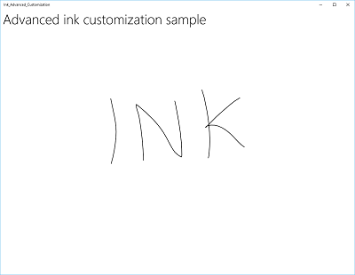

# Pen interactions and Windows Ink in Windows apps

  
*Surface Pen* (available for purchase at the [Microsoft Store](https://www.microsoft.com/p/surface-pen/8zl5c82qmg6b)).

## Overview

Optimize your Windows app for pen input to provide both standard [**pointer device**](/uwp/api/Windows.Devices.Input.PointerDevice) functionality and the best Windows Ink experience for your users.

> [!NOTE]
> This topic focuses on the Windows Ink platform. For general pointer input handling (similar to mouse, touch, and touchpad), see [Handle pointer input](handle-pointer-input.md).

| Videos |   |
| --- | --- |
| <iframe src="https://channel9.msdn.com/Blogs/One-Dev-Minute/Using-Ink-in-Your-UWP-App/player" width="300" height="200" allowFullScreen frameBorder="0"></iframe> | <iframe src="https://channel9.msdn.com/Events/Ignite/2016/BRK2060/player" width="300" height="200" allowFullScreen frameBorder="0"></iframe> |
| *Using ink in your Windows app* | *Use Windows Pen and Ink to build more engaging enterprise apps* |

The Windows Ink platform, together with a pen device, provides a natural way to create digital handwritten notes, drawings, and annotations. The platform supports capturing digitizer input as ink data, generating ink data, managing ink data, rendering ink data as ink strokes on the output device, and converting ink to text through handwriting recognition.

In addition to capturing the basic position and movement of the pen as the user writes or draws, your app can also track and collect the varying amounts of pressure used throughout a stroke. This information, along with settings for pen tip shape, size, and rotation, ink color, and purpose (plain ink, erasing, highlighting, and selecting), enables you to provide user experiences that closely resemble writing or drawing on paper with a pen, pencil, or brush.

> [!NOTE]
> Your app can also support ink input from other pointer-based devices, including touch digitizers and mouse devices. 

The ink platform is very flexible. It is designed to support various levels of functionality, depending on your requirements.

For Windows Ink UX guidelines, see [Inking controls](../controls-and-patterns/inking-controls.md).

## Components of the Windows Ink platform

| Component | Description |
| --- | --- |
| [**InkCanvas**](/uwp/api/Windows.UI.Xaml.Controls.InkCanvas) | A XAML UI platform control that, by default, receives and displays all input from a pen as either an ink stroke or an erase stroke.<br/>For more information about how to use the InkCanvas, see [Recognize Windows Ink strokes as text](convert-ink-to-text.md) and [Store and retrieve Windows Ink stroke data](save-and-load-ink.md). |
| [**InkPresenter**](/uwp/api/Windows.UI.Input.Inking.InkPresenter) | A code-behind object, instantiated along with an [**InkCanvas**](/uwp/api/Windows.UI.Xaml.Controls.InkCanvas) control (exposed through the [**InkCanvas.InkPresenter**](/uwp/api/windows.ui.xaml.controls.inkcanvas.inkpresenter) property). This object provides all default inking functionality exposed by the **InkCanvas**, along with a comprehensive set of APIs for additional customization and personalization.<br/>For more information about how to use the InkPresenter, see [Recognize Windows Ink strokes as text](convert-ink-to-text.md) and [Store and retrieve Windows Ink stroke data](save-and-load-ink.md). |
| [**InkToolbar**](/uwp/api/windows.ui.xaml.controls.inktoolbar) | A XAML UI platform control containing a customizable and extensible collection of buttons that activate ink-related features in an associated [**InkCanvas**](/uwp/api/windows.ui.xaml.controls.inkcanvas).<br/>For more information about how to use the InkToolbar, see [Add an InkToolbar to a Windows app inking app](ink-toolbar.md). |
| [**IInkD2DRenderer**](/windows/desktop/api/inkrenderer/nn-inkrenderer-iinkd2drenderer) | Enables the rendering of ink strokes onto the designated Direct2D device context of a Universal Windows app, instead of the default [**InkCanvas**](/uwp/api/Windows.UI.Xaml.Controls.InkCanvas) control. This enables full customization of the inking experience.<br/>For more information, see the [Complex ink sample](https://github.com/Microsoft/Windows-universal-samples/tree/master/Samples/ComplexInk). |

## Basic inking with InkCanvas

To add basic inking functionality, just place an [**InkCanvas**](/uwp/api/Windows.UI.Xaml.Controls.InkCanvas) UWP platform control on the appropriate page in your app.

By default, the [**InkCanvas**](/uwp/api/Windows.UI.Xaml.Controls.InkCanvas) supports ink input only from a pen. The input is either rendered as an ink stroke using default settings for color and thickness (a black ballpoint pen with a thickness of 2 pixels), or treated as a stroke eraser (when input is from an eraser tip or the pen tip modified with an erase button).

> [!NOTE]
> If an eraser tip or button is not present, the InkCanvas can be configured to process input from the pen tip as an erase stroke.

In this example, an [**InkCanvas**](/uwp/api/Windows.UI.Xaml.Controls.InkCanvas) overlays a background image.

> [!NOTE]
> An InkCanvas has default [**Height**](/uwp/api/windows.ui.xaml.frameworkelement.Height) and [**Width**](/uwp/api/windows.ui.xaml.frameworkelement.Width) properties of zero, unless it is the child of an element that automatically sizes its child elements, such as [StackPanel](/uwp/api/windows.ui.xaml.controls.stackpanel) or [Grid](/uwp/api/windows.ui.xaml.controls.grid) controls.

```xaml
<Grid Background="{ThemeResource ApplicationPageBackgroundThemeBrush}">
    <Grid.RowDefinitions>
        <RowDefinition Height="Auto"/>
        <RowDefinition Height="*"/>
    </Grid.RowDefinitions>
    <StackPanel x:Name="HeaderPanel" Orientation="Horizontal" Grid.Row="0">
        <TextBlock x:Name="Header"
                   Text="Basic ink sample"
                   Style="{ThemeResource HeaderTextBlockStyle}"
                   Margin="10,0,0,0" />            
    </StackPanel>
    <Grid Grid.Row="1">
        <Image Source="Assets\StoreLogo.png" />
        <InkCanvas x:Name="inkCanvas" />
    </Grid>
</Grid>
```

This series of images shows how pen input is rendered by this [**InkCanvas**](/uwp/api/Windows.UI.Xaml.Controls.InkCanvas) control.

|  |  |  |
| --- | --- | ---|
| The blank [**InkCanvas**](/uwp/api/Windows.UI.Xaml.Controls.InkCanvas) with a background image. | The [**InkCanvas**](/uwp/api/Windows.UI.Xaml.Controls.InkCanvas) with ink strokes. | The [**InkCanvas**](/uwp/api/Windows.UI.Xaml.Controls.InkCanvas) with one stroke erased (note how erase operates on an entire stroke, not a portion). |

The inking functionality supported by the [**InkCanvas**](/uwp/api/Windows.UI.Xaml.Controls.InkCanvas) control is provided by a code-behind object called the [**InkPresenter**](/uwp/api/Windows.UI.Input.Inking.InkPresenter).

For basic inking, you don't have to concern yourself with the [**InkPresenter**](/uwp/api/Windows.UI.Input.Inking.InkPresenter). However, to customize and configure inking behavior on the [**InkCanvas**](/uwp/api/Windows.UI.Xaml.Controls.InkCanvas), you must access its corresponding **InkPresenter** object.

## Basic customization with InkPresenter

An [**InkPresenter**](/uwp/api/Windows.UI.Input.Inking.InkPresenter) object is instantiated with each [**InkCanvas**](/uwp/api/Windows.UI.Xaml.Controls.InkCanvas) control.

> [!NOTE]
> The [**InkPresenter**](/uwp/api/Windows.UI.Input.Inking.InkPresenter) cannot be instantiated directly. Instead, it is accessed through the [**InkPresenter**](/uwp/api/windows.ui.xaml.controls.inkcanvas.inkpresenter) property of the [**InkCanvas**](/uwp/api/Windows.UI.Xaml.Controls.InkCanvas). 

Along with providing all default inking behaviors of its corresponding [**InkCanvas**](/uwp/api/Windows.UI.Xaml.Controls.InkCanvas) control, the [**InkPresenter**](/uwp/api/Windows.UI.Input.Inking.InkPresenter) provides a comprehensive set of APIs for additional stroke customization and finer-grained management of the pen input (standard and modified). This includes stroke properties, supported input device types, and whether input is processed by the object or passed to the app for processing.

> [!NOTE]
> Standard ink input (from either pen tip or eraser tip/button) is not modified with a secondary hardware affordance, such as a pen barrel button, right mouse button, or similar mechanism. 

By default, ink is supported for pen input only. Here, we configure the [**InkPresenter**](/uwp/api/windows.ui.xaml.controls.inkcanvas.inkpresenter) to interpret input data from both pen and mouse as ink strokes. We also set some initial ink stroke attributes used for rendering strokes to the [**InkCanvas**](/uwp/api/Windows.UI.Xaml.Controls.InkCanvas).

To enable mouse and touch inking, set the [**InputDeviceTypes**](/uwp/api/windows.ui.input.inking.inkpresenter.InputDeviceTypes) property of the [**InkPresenter**](/uwp/api/windows.ui.input.inking.inkpresenter) to the combination of [**CoreInputDeviceTypes**](/uwp/api/windows.ui.core.coreinputdevicetypes) values that you want.

```csharp
public MainPage()
{
    this.InitializeComponent();

    // Set supported inking device types.
    inkCanvas.InkPresenter.InputDeviceTypes =
        Windows.UI.Core.CoreInputDeviceTypes.Mouse |
        Windows.UI.Core.CoreInputDeviceTypes.Pen;

    // Set initial ink stroke attributes.
    InkDrawingAttributes drawingAttributes = new InkDrawingAttributes();
    drawingAttributes.Color = Windows.UI.Colors.Black;
    drawingAttributes.IgnorePressure = false;
    drawingAttributes.FitToCurve = true;
    inkCanvas.InkPresenter.UpdateDefaultDrawingAttributes(drawingAttributes);
}
```

Ink stroke attributes can be set dynamically to accommodate user preferences or app requirements.

Here, we let a user choose from a list of ink colors.

```xaml
<Grid Background="{ThemeResource ApplicationPageBackgroundThemeBrush}">
    <Grid.RowDefinitions>
        <RowDefinition Height="Auto"/>
        <RowDefinition Height="*"/>
    </Grid.RowDefinitions>
    <StackPanel x:Name="HeaderPanel" Orientation="Horizontal" Grid.Row="0">
        <TextBlock x:Name="Header"
                   Text="Basic ink customization sample"
                   VerticalAlignment="Center"
                   Style="{ThemeResource HeaderTextBlockStyle}"
                   Margin="10,0,0,0" />
        <TextBlock Text="Color:"
                   Style="{StaticResource SubheaderTextBlockStyle}"
                   VerticalAlignment="Center"
                   Margin="50,0,10,0"/>
        <ComboBox x:Name="PenColor"
                  VerticalAlignment="Center"
                  SelectedIndex="0"
                  SelectionChanged="OnPenColorChanged">
            <ComboBoxItem Content="Black"/>
            <ComboBoxItem Content="Red"/>
        </ComboBox>
    </StackPanel>
    <Grid Grid.Row="1">
        <Image Source="Assets\StoreLogo.png" />
        <InkCanvas x:Name="inkCanvas" />
    </Grid>
</Grid>
```

We then handle changes to the selected color and update the ink stroke attributes accordingly.

```csharp
// Update ink stroke color for new strokes.
private void OnPenColorChanged(object sender, SelectionChangedEventArgs e)
{
    if (inkCanvas != null)
    {
        InkDrawingAttributes drawingAttributes =
            inkCanvas.InkPresenter.CopyDefaultDrawingAttributes();

        string value = ((ComboBoxItem)PenColor.SelectedItem).Content.ToString();

        switch (value)
        {
            case "Black":
                drawingAttributes.Color = Windows.UI.Colors.Black;
                break;
            case "Red":
                drawingAttributes.Color = Windows.UI.Colors.Red;
                break;
            default:
                drawingAttributes.Color = Windows.UI.Colors.Black;
                break;
        };

        inkCanvas.InkPresenter.UpdateDefaultDrawingAttributes(drawingAttributes);
    }
}
```

These images shows how pen input is processed and customized by the [**InkPresenter**](/uwp/api/windows.ui.xaml.controls.inkcanvas.inkpresenter).

|  |  |
| --- | --- |
| The [**InkCanvas**](/uwp/api/Windows.UI.Xaml.Controls.InkCanvas) with default black ink strokes. | The [**InkCanvas**](/uwp/api/Windows.UI.Xaml.Controls.InkCanvas) with user selected red ink strokes. | 

To provide functionality beyond inking and erasing, such as stroke selection, your app must identify specific input for the [**InkPresenter**](/uwp/api/windows.ui.xaml.controls.inkcanvas.inkpresenter) to pass through unprocessed for handling by your app.

## Pass-through input for advanced processing

By default, [**InkPresenter**](/uwp/api/windows.ui.xaml.controls.inkcanvas.inkpresenter) processes all input as either an ink stroke or an erase stroke, including input modified by a secondary hardware affordance such as a pen barrel button, a right mouse button, or similar. However, users typically expect some additional functionality or modified behavior with these secondary affordances.

In some cases, you might also need to expose additional functionality for pens without secondary affordances (functionality not usually associated with the pen tip), other input device types, or some type of modified behavior based on a user selection in your app's UI.

To support this, [**InkPresenter**](/uwp/api/windows.ui.xaml.controls.inkcanvas.inkpresenter) can be configured to leave specific input unprocessed. This unprocessed input is then passed through to your app for processing.

### Example - Use unprocessed input to implement stroke selection 

The Windows Ink platform does not provide built-in support for actions that require modified input, such as stroke selection. To support features like this, you must provide a custom solution in your apps. 

The following code example (all code is in the MainPage.xaml and MainPage.xaml.cs files) steps through how to enable stroke selection when input is modified with a pen barrel button (or right mouse button).

1.  First, we set up the UI in MainPage.xaml.

    Here, we add a canvas (below the [**InkCanvas**](/uwp/api/Windows.UI.Xaml.Controls.InkCanvas)) to draw the selection stroke. Using a separate layer to draw the selection stroke leaves the **InkCanvas** and its content untouched.

    

      ```xaml
        <Grid Background="{ThemeResource ApplicationPageBackgroundThemeBrush}">
          <Grid.RowDefinitions>
            <RowDefinition Height="Auto"/>
            <RowDefinition Height="*"/>
          </Grid.RowDefinitions>
          <StackPanel x:Name="HeaderPanel" Orientation="Horizontal" Grid.Row="0">
            <TextBlock x:Name="Header"
              Text="Advanced ink customization sample"
              VerticalAlignment="Center"
              Style="{ThemeResource HeaderTextBlockStyle}"
              Margin="10,0,0,0" />
          </StackPanel>
          <Grid Grid.Row="1">
            <!-- Canvas for displaying selection UI. -->
            <Canvas x:Name="selectionCanvas"/>
            <!-- Inking area -->
            <InkCanvas x:Name="inkCanvas"/>
          </Grid>
        </Grid>
      ```

2.  In MainPage.xaml.cs, we declare a couple of global variables for keeping references to aspects of the selection UI. Specifically, the selection lasso stroke and the bounding rectangle that highlights the selected strokes.

      ```csharp
        // Stroke selection tool.
        private Polyline lasso;
        // Stroke selection area.
        private Rect boundingRect;
      ```

3.  Next, we configure the [**InkPresenter**](/uwp/api/windows.ui.xaml.controls.inkcanvas.inkpresenter) to interpret input data from both pen and mouse as ink strokes, and set some initial ink stroke attributes used for rendering strokes to the [**InkCanvas**](/uwp/api/Windows.UI.Xaml.Controls.InkCanvas).

    Most importantly, we use the [**InputProcessingConfiguration**](/uwp/api/windows.ui.input.inking.inkpresenter.inputprocessingconfiguration) property of the [InkPresenter](/uwp/api/windows.ui.xaml.controls.inkcanvas.inkpresenter) to indicate that any modified input should be processed by the app. Modified input is specified by assigning **InputProcessingConfiguration.RightDragAction** a value of [**InkInputRightDragAction.LeaveUnprocessed**](/uwp/api/Windows.UI.Input.Inking.InkInputRightDragAction). When this value is set, the [InkPresenter](/uwp/api/windows.ui.xaml.controls.inkcanvas.inkpresenter) passes through to the [InkUnprocessedInput](/uwp/api/windows.ui.input.inking.inkunprocessedinput) class, a set of pointer events for you to handle.

    We assign listeners for the unprocessed [**PointerPressed**](/uwp/api/windows.ui.input.inking.inkunprocessedinput.pointerpressed), [**PointerMoved**](/uwp/api/windows.ui.input.inking.inkunprocessedinput.pointermoved), and [**PointerReleased**](/uwp/api/windows.ui.input.inking.inkunprocessedinput.pointerreleased) events passed through by the [**InkPresenter**](/uwp/api/windows.ui.xaml.controls.inkcanvas.inkpresenter). All selection functionality is implemented in the handlers for these events.

    Finally, we assign listeners for the [**StrokeStarted**](/uwp/api/windows.ui.input.inking.inkstrokeinput.strokestarted) and [**StrokesErased**](/uwp/api/windows.ui.input.inking.inkpresenter.strokeserased) events of the [**InkPresenter**](/uwp/api/windows.ui.xaml.controls.inkcanvas.inkpresenter). We use the handlers for these events to clean up the selection UI if a new stroke is started or an existing stroke is erased.

    

      ```csharp
        public MainPage()
        {
          this.InitializeComponent();

          // Set supported inking device types.
          inkCanvas.InkPresenter.InputDeviceTypes =
            Windows.UI.Core.CoreInputDeviceTypes.Mouse |
            Windows.UI.Core.CoreInputDeviceTypes.Pen;

          // Set initial ink stroke attributes.
          InkDrawingAttributes drawingAttributes = new InkDrawingAttributes();
          drawingAttributes.Color = Windows.UI.Colors.Black;
          drawingAttributes.IgnorePressure = false;
          drawingAttributes.FitToCurve = true;
          inkCanvas.InkPresenter.UpdateDefaultDrawingAttributes(drawingAttributes);

          // By default, the InkPresenter processes input modified by
          // a secondary affordance (pen barrel button, right mouse
          // button, or similar) as ink.
          // To pass through modified input to the app for custom processing
          // on the app UI thread instead of the background ink thread, set
          // InputProcessingConfiguration.RightDragAction to LeaveUnprocessed.
          inkCanvas.InkPresenter.InputProcessingConfiguration.RightDragAction =
              InkInputRightDragAction.LeaveUnprocessed;

          // Listen for unprocessed pointer events from modified input.
          // The input is used to provide selection functionality.
          inkCanvas.InkPresenter.UnprocessedInput.PointerPressed +=
              UnprocessedInput_PointerPressed;
          inkCanvas.InkPresenter.UnprocessedInput.PointerMoved +=
              UnprocessedInput_PointerMoved;
          inkCanvas.InkPresenter.UnprocessedInput.PointerReleased +=
              UnprocessedInput_PointerReleased;

          // Listen for new ink or erase strokes to clean up selection UI.
          inkCanvas.InkPresenter.StrokeInput.StrokeStarted +=
              StrokeInput_StrokeStarted;
          inkCanvas.InkPresenter.StrokesErased +=
              InkPresenter_StrokesErased;
        }
      ```

4.  We then define handlers for the unprocessed [**PointerPressed**](/uwp/api/windows.ui.input.inking.inkunprocessedinput.pointerpressed), [**PointerMoved**](/uwp/api/windows.ui.input.inking.inkunprocessedinput.pointermoved), and [**PointerReleased**](/uwp/api/windows.ui.input.inking.inkunprocessedinput.pointerreleased) events passed through by the [**InkPresenter**](/uwp/api/windows.ui.xaml.controls.inkcanvas.inkpresenter).

    All selection functionality is implemented in these handlers, including the lasso stroke and the bounding rectangle.

    

      ```csharp
        // Handle unprocessed pointer events from modified input.
        // The input is used to provide selection functionality.
        // Selection UI is drawn on a canvas under the InkCanvas.
        private void UnprocessedInput_PointerPressed(
          InkUnprocessedInput sender, PointerEventArgs args)
        {
          // Initialize a selection lasso.
          lasso = new Polyline()
          {
              Stroke = new SolidColorBrush(Windows.UI.Colors.Blue),
              StrokeThickness = 1,
              StrokeDashArray = new DoubleCollection() { 5, 2 },
              };

              lasso.Points.Add(args.CurrentPoint.RawPosition);

              selectionCanvas.Children.Add(lasso);
          }

          private void UnprocessedInput_PointerMoved(
            InkUnprocessedInput sender, PointerEventArgs args)
          {
            // Add a point to the lasso Polyline object.
            lasso.Points.Add(args.CurrentPoint.RawPosition);
          }

          private void UnprocessedInput_PointerReleased(
            InkUnprocessedInput sender, PointerEventArgs args)
          {
            // Add the final point to the Polyline object and
            // select strokes within the lasso area.
            // Draw a bounding box on the selection canvas
            // around the selected ink strokes.
            lasso.Points.Add(args.CurrentPoint.RawPosition);

            boundingRect =
              inkCanvas.InkPresenter.StrokeContainer.SelectWithPolyLine(
                lasso.Points);

            DrawBoundingRect();
          }
      ```

5.  To conclude the PointerReleased event handler, we clear the selection layer of all content (the lasso stroke) and then draw a single bounding rectangle around the ink strokes encompassed by the lasso area.

    

      ```csharp
        // Draw a bounding rectangle, on the selection canvas, encompassing
        // all ink strokes within the lasso area.
        private void DrawBoundingRect()
        {
          // Clear all existing content from the selection canvas.
          selectionCanvas.Children.Clear();

          // Draw a bounding rectangle only if there are ink strokes
          // within the lasso area.
          if (!((boundingRect.Width == 0) ||
            (boundingRect.Height == 0) ||
            boundingRect.IsEmpty))
            {
              var rectangle = new Rectangle()
              {
                Stroke = new SolidColorBrush(Windows.UI.Colors.Blue),
                  StrokeThickness = 1,
                  StrokeDashArray = new DoubleCollection() { 5, 2 },
                  Width = boundingRect.Width,
                  Height = boundingRect.Height
              };

              Canvas.SetLeft(rectangle, boundingRect.X);
              Canvas.SetTop(rectangle, boundingRect.Y);

              selectionCanvas.Children.Add(rectangle);
            }
          }
      ```

6.  Finally, we define handlers for the [**StrokeStarted**](/uwp/api/windows.ui.input.inking.inkstrokeinput.strokestarted) and [**StrokesErased**](/uwp/api/windows.ui.input.inking.inkpresenter.strokeserased) InkPresenter events.

    These both just call the same cleanup function to clear the current selection whenever a new stroke is detected.

      ```csharp
        // Handle new ink or erase strokes to clean up selection UI.
        private void StrokeInput_StrokeStarted(
          InkStrokeInput sender, Windows.UI.Core.PointerEventArgs args)
        {
          ClearSelection();
        }

        private void InkPresenter_StrokesErased(
          InkPresenter sender, InkStrokesErasedEventArgs args)
        {
          ClearSelection();
        }
      ```

7.  Here's the function to remove all selection UI from the selection canvas when a new stroke is started or an existing stroke is erased.

      ```csharp
        // Clean up selection UI.
        private void ClearSelection()
        {
          var strokes = inkCanvas.InkPresenter.StrokeContainer.GetStrokes();
          foreach (var stroke in strokes)
          {
            stroke.Selected = false;
          }
          ClearDrawnBoundingRect();
         }

        private void ClearDrawnBoundingRect()
        {
          if (selectionCanvas.Children.Any())
          {
            selectionCanvas.Children.Clear();
            boundingRect = Rect.Empty;
          }
        }
      ```

## Custom ink rendering

By default, ink input is processed on a low-latency background thread and rendered in-progress, or "wet", as it is drawn. When the stroke is completed (pen or finger lifted, or mouse button released), the stroke is processed on the UI thread and rendered "dry" to the [**InkCanvas**](/uwp/api/Windows.UI.Xaml.Controls.InkCanvas) layer (above the application content and replacing the wet ink).

You can override this default behavior and completely control the inking experience by "custom drying" the wet ink strokes. While the default behavior is typically sufficient for most applications, there are a few cases where custom drying might be required, these include:
- More efficient management of large, or complex, collections of ink strokes
- More efficient panning and zooming support on large ink canvases
- Interleaving ink and other objects, such as shapes or text, while maintaining z-order 
- Drying and converting ink synchronously into a DirectX shape (for example, a straight line or shape rasterized and integrated into application content instead of as a separate **InkCanvas** layer).

Custom drying requires an [**IInkD2DRenderer**](/windows/desktop/api/inkrenderer/nn-inkrenderer-iinkd2drenderer) object to manage the ink input and render it to the Direct2D device context of your Universal Windows app, instead of the default [**InkCanvas**](/uwp/api/Windows.UI.Xaml.Controls.InkCanvas) control.

By calling [**ActivateCustomDrying**](/uwp/api/windows.ui.input.inking.inkpresenter.activatecustomdrying) (before the [**InkCanvas**](/uwp/api/Windows.UI.Xaml.Controls.InkCanvas) is loaded), an app creates an [**InkSynchronizer**](/uwp/api/Windows.UI.Input.Inking.InkSynchronizer) object to customize how an ink stroke is rendered dry to a [**SurfaceImageSource**](/uwp/api/Windows.UI.Xaml.Media.Imaging.SurfaceImageSource) or [**VirtualSurfaceImageSource**](/uwp/api/windows.ui.xaml.media.imaging.virtualsurfaceimagesource). 

Both [**SurfaceImageSource**](/uwp/api/Windows.UI.Xaml.Media.Imaging.SurfaceImageSource) and [**VirtualSurfaceImageSource**](/uwp/api/windows.ui.xaml.media.imaging.virtualsurfaceimagesource) provide a DirectX shared surface for your app to draw into and compose into your application's content, although VSIS provides a virtual surface that’s larger than the screen for performant panning and zooming. Because visual updates to these surfaces are synchronized with the XAML UI thread, when ink is rendered to either, the wet ink can be removed from the InkCanvas  simultaneously. 

You can also custom dry ink to a [SwapChainPanel](/uwp/api/windows.ui.xaml.controls.swapchainpanel), but synchronization with the UI thread is not guaranteed and there might be a delay between when the ink is rendered to your SwapChainPanel and when ink is removed from the InkCanvas.

For a full example of this functionality, see the [Complex ink sample](https://github.com/Microsoft/Windows-universal-samples/tree/master/Samples/ComplexInk).

> [!NOTE]
> Custom drying and the [**InkToolbar**](/uwp/api/windows.ui.xaml.controls.inktoolbar)  
> If your app overrides the default ink rendering behavior of the [**InkPresenter**](/uwp/api/Windows.UI.Input.Inking.InkPresenter) with a custom drying implementation, the rendered ink strokes are no longer available to the InkToolbar and the built-in erase commands of the InkToolbar do not work as expected. To provide erase functionality, you must handle all pointer events, perform hit-testing on each stroke, and override the built-in "Erase all ink" command.

## Other articles in this section

| Topic | Description |
| --- | --- |
| [Recognize ink strokes](convert-ink-to-text.md) | Convert ink strokes to text using handwriting recognition, or to shapes using custom recognition. |
| [Store and retrieve ink strokes](save-and-load-ink.md) | Store ink stroke data in a Graphics Interchange Format (GIF) file using embedded Ink Serialized Format (ISF) metadata. |
| [Add an InkToolbar to a Windows inking app](ink-toolbar.md) | Add a default InkToolbar to a Windows app inking app, add a custom pen button to the InkToolbar, and bind the custom pen button to a custom pen definition. |

## Related articles

- [Get started: Support ink in your Windows app](./ink-walkthrough.md)
- [Handle pointer input](handle-pointer-input.md)
- [Identify input devices](identify-input-devices.md)

### APIs

- [**Windows.Devices.Input**](/uwp/api/Windows.Devices.Input)
- [**Windows.UI.Input.Inking**](/uwp/api/Windows.UI.Input.Inking)
- [**Windows.UI.Input.Inking.Core**](/uwp/api/Windows.UI.Input.Inking.Core)

### Samples

- [Get Started Tutorial: Support ink in your Windows app](https://github.com/Microsoft/Windows-tutorials-inputs-and-devices/tree/master/GettingStarted-Ink)
- [Simple ink sample (C#/C++)](https://github.com/Microsoft/Windows-universal-samples/tree/master/Samples/SimpleInk)
- [Complex ink sample (C++)](https://github.com/Microsoft/Windows-universal-samples/tree/master/Samples/ComplexInk)
- [Ink sample (JavaScript)](https://github.com/microsoftarchive/msdn-code-gallery-microsoft/tree/411c271e537727d737a53fa2cbe99eaecac00cc0/Official%20Windows%20Platform%20Sample/Windows%208%20app%20samples/%5BJavaScript%5D-Windows%208%20app%20samples/JavaScript/Windows%208%20app%20samples/Input%20Ink%20sample%20(Windows%208))
- [Coloring book sample](https://github.com/Microsoft/Windows-appsample-coloringbook)
- [Family notes sample](https://github.com/Microsoft/Windows-appsample-familynotes)
- [Basic input sample](https://github.com/Microsoft/Windows-universal-samples/tree/master/Samples/BasicInput)
- [Low latency input sample](https://github.com/Microsoft/Windows-universal-samples/tree/master/Samples/LowLatencyInput)
- [User interaction mode sample](https://github.com/Microsoft/Windows-universal-samples/tree/master/Samples/UserInteractionMode)
- [Focus visuals sample](https://github.com/Microsoft/Windows-universal-samples/tree/master/Samples/XamlFocusVisuals)

### Archive Samples

- [Input: Device capabilities sample](https://github.com/microsoftarchive/msdn-code-gallery-microsoft/tree/411c271e537727d737a53fa2cbe99eaecac00cc0/Official%20Windows%20Platform%20Sample/Windows%208%20app%20samples/%5BC%23%5D-Windows%208%20app%20samples/C%23/Windows%208%20app%20samples/Input%20Device%20capabilities%20sample%20(Windows%208))
- [Input: XAML user input events sample](https://github.com/microsoftarchive/msdn-code-gallery-microsoft/tree/411c271e537727d737a53fa2cbe99eaecac00cc0/Official%20Windows%20Platform%20Sample/Input%20XAML%20user%20input%20events%20sample)
- [XAML scrolling, panning, and zooming sample](https://github.com/microsoftarchive/msdn-code-gallery-microsoft/tree/411c271e537727d737a53fa2cbe99eaecac00cc0/Official%20Windows%20Platform%20Sample/Universal%20Windows%20app%20samples/111487-Universal%20Windows%20app%20samples/XAML%20scrolling%2C%20panning%2C%20and%20zooming%20sample)
- [Input: Gestures and manipulations with GestureRecognizer](https://github.com/microsoftarchive/msdn-code-gallery-microsoft/tree/411c271e537727d737a53fa2cbe99eaecac00cc0/Official%20Windows%20Platform%20Sample/Input%20Gestures%20and%20manipulations%20with%20GestureRecognizer)